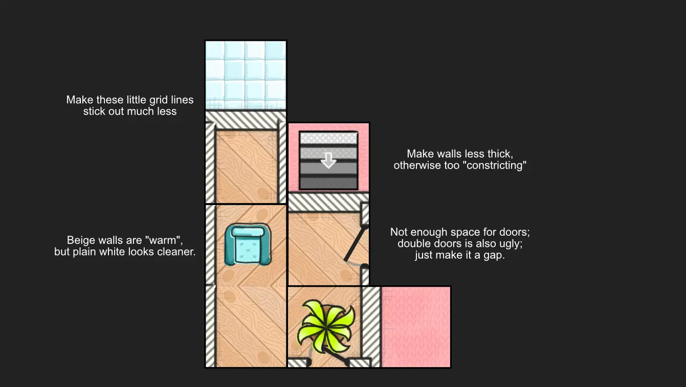
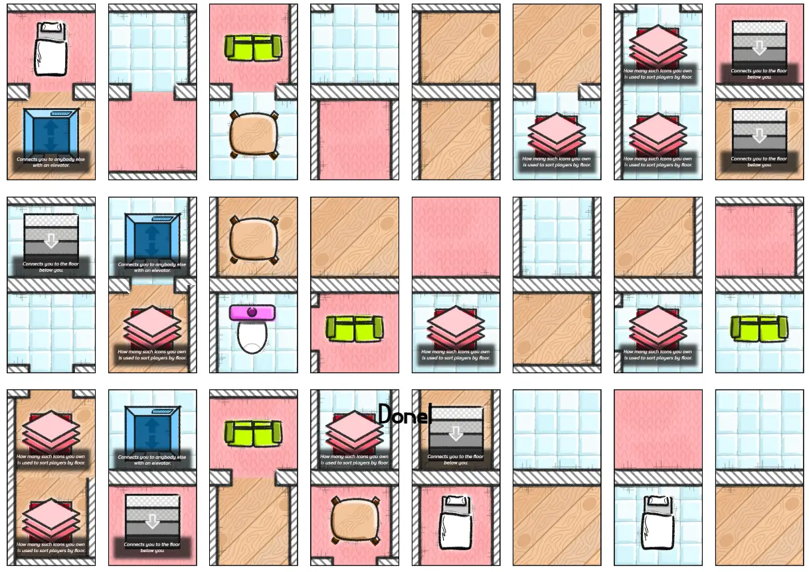
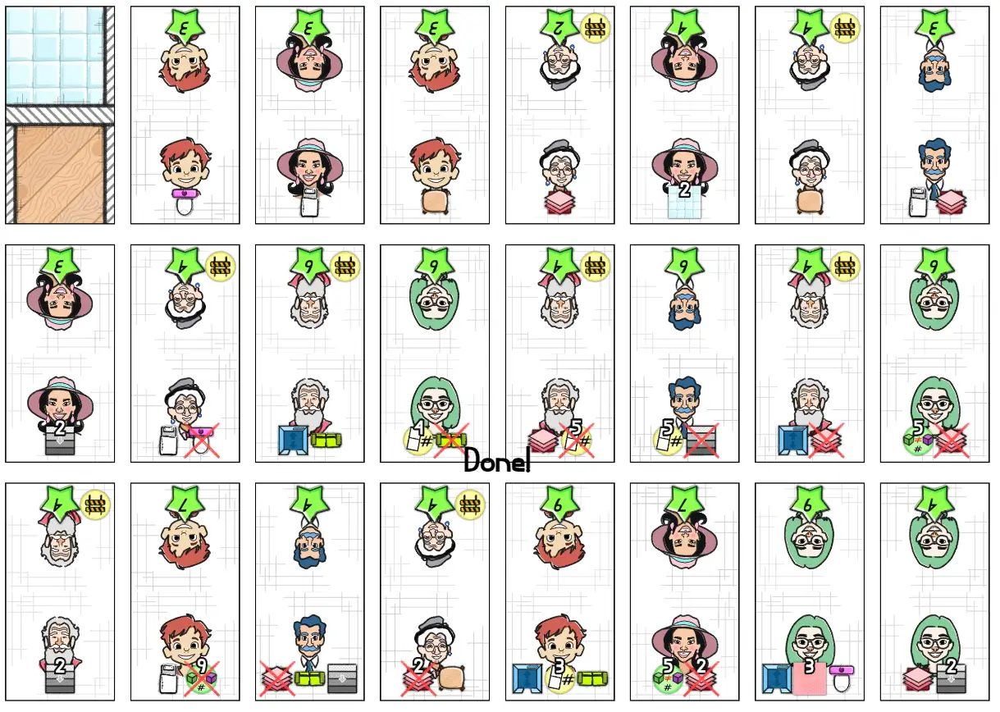
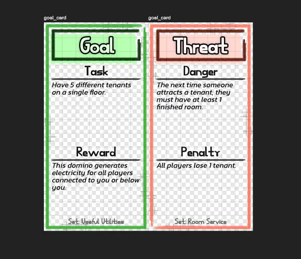

Welcome to the devlog ("developer diary") for my game [Highrise Homino](https://pandaqi.com/the-domino-diaries/place/highrise-homino/)

This article describes the whole process of creating this game, moving through the different versions, what problems I faced and why I made certain decisions. Hopefully it's interesting and fun to read!

## What's the idea?

All my other domino games have a shared map. That's just my style: I like extremely interactive and social games, and minimalist material.

But I wanted to make at least one that had individual maps. Each player has their own little area. There is still clear interaction or connections between the players, but only _you_ can touch and change your area, and you score _individually_ for your specific tenants.

Tenants? Yes! When considering themes and mechanics, I eventually settled on the following.

* You're managing your own _floor_ (of apartments, utilities, etcetera).
* But you're all different floors in the same skyscraper.
* And scoring does not happen based on your map itself ( = what dominoes are placed and how), but by _attracting_ tenants who'd like to live on that map.

You basically try to design your map to fulfill the wishes of the tenant you want, which is just an open market of options. A person with some icons below/above them that say "I need a bathroom" and "I want wooden floors" and stuff. They also have their own point value, which is what you score at the end of the game.

But you don't need to fulfill all wishes _yourself_. This was the second breakthrough that made me decide to go for this (admittedly experimental) theme and actually make the game.

* Each round, players are sorted to determine what floor they're on (based on _some metric_).
* You can _connect_ to players using staircases or elevators.
* When attracing a tenant, you _also_ provide anything to which you're connected. (So if you have a staircase to the floor above you, and that player has a pool, then you can attract a tenant who wants a pool.)

I felt like this would work wonders, but also be a really unique approach to this kind of game.

* There should be NO elements in the game that actually allow you to alter another player's floor. It is _your_ floor, safe from anything else, and only managed by you. (Others can connect to it, but not actually change it.)
* But it should be crucial to manage your floor number and connections to other players to win. It should be really hard to attract good tenants using only the things _you_ have built. (There are just too many unique items in the game to have them all yourself, even if you're lucky.)

At first, I thought this game would be more difficult than Zoo Parque and Theme Parque. The more I worked on it, though, the more I thought it might actually be one of the simpler ones. We'll see where I end up by the end.

## How to turn that into a game?

Then I had to actually _specify_ this vague idea, turning it into rules and material.

All material are _dominoes_. That's just nice and consistent.

* Some are tiles to place in your map.
* Others are tenants to attract. (I also realized you can now _fold_ the tenants to use them like a pawn, which would actually allow you to place them on your map! That felt fun.)

### The Map Tiles

The map tiles show ...

* A floor type.
* Walls at the sides (randomly).
* A special icon in the center (optional).

I briefly considered elements that require multiple tiles (such as a big pool requiring multiple pool edges to be connected), but that was just needlessly complicated.

I also considered placing the walls in the _center_ instead of at the _edges_. This looks better, yes. You don't get nasty doubling of walls, for example, if one domino has a right wall and the one to its right has a left wall. Buuuut this means that a single domino side is _broken_ into multiple ones by the wall. Which turns one domino into potentially 4 or 8 elements, which is just too confusing (and we don't have space for that).

After trying this out, however, I realized I _could_ keep it around. _Some_ tiles can have a wall in the middle and split into two floor types, as long as the wall becomes a proper one again at the edges. This can be an expansion or just a really special fun tile.

Because this game has the _added_ mechanics of floor-changing and tenant-attracting, I wanted to keep the actual domino placement simple. There are only two rules.

* Floors need to connect (unless a wall separates them, of course).
  * This is similar to "group matching terrains" in the other games. It just looks much better, gives a clear and simple goal for placement, and automatically segregates your map into designated rooms.
* Walls need to connect.
  * Because some walls will have _doors_, and I don't want the ugly situation of "hey we have a door on one side, and a wall on the other, what should we do?" (Although that IS funny.)
  * And because I did _not_ do this in the Zoo game, which has fences on the sides. I want to be different with each game!

The main point of specific _items_ on the tiles is to attract Tenants. (For example: you need to place a sofa somewhere to attract a tenant who "wants a sofa").

Just that, however, felt too weak. Because tenants are in a shared market, anyone can see "hey that one wants a sofa, and this tile has a sofa, let's grab it and place it". As such, many items have a side-effect. Maybe the sofa adds +1 score to every Tenant of type X. Maybe the pool allows you to attract 2 Tenants. Etcetera.

### The Tenant Tiles

It was crucial, to me, that the tenant tiles have a big _illustration_ of a person. This just makes it feel real and intuitive, like an actual being is living in your apartment. (In other words, I did _not_ want those tiles to just be abstract squares with numbers and icons.)

This does leave little space, however, for everything else I needed.

I identified two parts.

* **Properties**: fixed _properties_ the Tenant will always have, such as their SCORE and whether they leave during CONSTRUCTION.
* **Wishes**: the specific things they _wish for_. If you meet them all, you can attract them.

Because they are dominoes, with the sides mirrored, I decided to add all _properties_ on one side and all _wishe_s on the others. By necessity---lack of space---their wishes would need to be restricted to at most 3 or 4 icons.

So, in general

* One or two more complicated wishes, such as "#dominoes" or "#rooms"
* The others are the exact icons of the things they want, such as the Pool icon or the Sofa icon. (Potentially with a red cross through them, to indicate they DON'T want you to have that.)

The actual details of this would be spread out over the base game and expansions. The base game can just include 5 or 6 different things you can place in your map, then an expansion can add more of them (with perhaps more complicated actions or rules), and so forth.

### Other Eureka moments

Some other important choices were:

* No dominoes in your hand. With two separate decks already, _and_ individual floors, also holding dominoes in your hand is just too much. So you grab from market and place immediately.
* Tenants are attracted in a separate phase, _after_ everyone has taken their turn. Otherwise you get that typical issue of "I do something only for _this turn_ to get _that specific tenant_, then just undo it next turn" No, your plans need to hold up even after everyone has taken their turn, and floors have potentially moved around.
* You only attract 1 Tenant (at most). This is crucial for the game to work. If players can _connect_ to other player's maps, and use anything they have, then the first player in turn order will attract _all_ tenants that the connected players would otherwise have gotten.

Then I realized Tenants could obviously also _not_ want something. Maybe they don't want a floor with too many rooms, or too many tenants, or that's too expensive. But the only way to make this work would be if I allowed players to _destroy_ their floor at will. Something I surely didn't include in the other domino games :p

So I did. On your turn, you can remove tiles at will. This is powerful and gives a lot of freedom, but maybe a bit too much.

To offset this, I call this "Construction Work" and use it as a penalty in other parts of the rules. Tenants can have a "Construction" property, and if so, they will LEAVE your floor if you start removing stuff. They will go to any player that is connected to you.

I quickly saw the potential in this mechanic and used Construction for more things in the expansion, as well as the idea of Wandering Tenants. 

I mean, that's the thematic, intuitive consequence of our core rules! If we're part of the same skyscraper, and we build staircases to each other, then surely Tenants can _leave_ to a better floor if they desire. The specifics of this were unclear at the time, but I knew I really wanted to include the idea of Tenants actually walking around the skyscraper.

### What decides floor order?

The final crucial piece of the puzzle was a rule for the floor order. What determines which player is ground floor, which is second floor, etcetera?

Because this would need to be constantly calculated, I didn't want something too involved. I could've come up with some extra mechanic, or a crazy formula using your tenants, but that feels meh.

Instead, the simplest thing I could imagine was this: **simply sort the players by how many "floor icons" they have.**

This is a simple, recognizable icon that appears on many dominoes. Count it, sort players by that, and you know which floor everyone is on.

This allows _ties_, however, mostly at the start of the game. Instead of breaking the tie with another rule, I decided that all tied players are simply on the same floor. And, by consequence, automatically _connected_ to each other.

### Expansions & Other Ideas

I immediately saw a few opportunities to expand the game.

* **Basic Utilities:** things like electricity and water. You need a special icon to "get access" ... but even here, floor order matters! You can only get electricity from the floor below you. So you only have it if they have it. (If nobody is below you, _then_ you get electricity for free.)
  * As you see, with every game I make I try to pick a single unique core idea and then _apply it to everything_. Really use that idea---floor order, in this case---for every single other aspect of the game. It simplifies the rules immensely and leads to really interesting ideas down the line.
* **Price:** tenants have a maximum price they can pay, so you can only attract them if your map is cheaper than that. I moved this to an expansion because it requires multiple changes/multiple things to explain. Namely, it needs a technique to quickly calculate the price of your apartments.
  * This expansion would ALSO introduce some other more complicated wishes. 
  * I really want the base game to just be as simple as "you have those icons? You can attract them!" But the expansions might require an extra step of parsing or calculating.
* **Special Offers:** earlier, I stated the idea of Wandering Tenants. This expansion would fully embrace that. It would give many situations in which you can steal Tenants from players connected to you, or they'd just walk around on their own, or maybe tenants interact with other tenants. (For example, a very rich Tenant might lower their score if they're on the same floor as poor ones.)
* **Rooms:** this was a candidate for the base game, and I'm still not sure what to do. With current placement rules, you automatically start creating rooms on your floor. But they don't actually give you anything, because the base game says nothing about them.
  * Instead, this expansion would "define" a room as "an enclosed space with at least one door"
  * And now tenants can require specific rooms, items can talk about the room they're in, etcetera.
  * It needs _juuust_ too many rules and changes that I moved it out of the base game, to an expansion. But we'll see.

My biggest doubt, just before I dove in and _made this_, was the cooperative variant. I want all games in The Domino Diaries to be played fully cooperatively or fully competitively.

The current rules are _competitive_. You score on your own, you score the tentants that _you_ attracted (or stole from someone else), you connect to others to _abuse_ what they have for your own gain.

But they obviously lead into cooperative play easily. You can _share_ your wealth when connected! You can _move_ tenants to where they should be! You can _take care of the whole building_!

I saw no way, however, to fit this into the base game, with no or minimal rule changes.

It's just too weak to say "if cooperative, try to get as high a score as you can!" No, in that case, you need to "play against the game" or have some other kind of goal.

So I made this an "expansion" too. The Cooperative Expansion, if you will.

* During the game, you draw dominoes with goals and threats.
  * Such as "_all_ tenants find a place this round" or "the entire building needs 3 pools by the end of the game"
  * Or "an inspector is coming, make sure there is no mess in the entire building or the game ends"
* These dominoes also provide _rewards_ if completed, which always aid _cooperative play_. For example, if you meet a challenge, the domino might grant someone the power to move 1 Tenant freely each round. Or that domino might hold a "power generator" that can power the entire building.

I _hope_ that, with minimal added material or rules, this provides a really strong _truly cooperative_ experience for this game.

And with that settled, I thought it was time to make this.

## Let's make that!

### Generation

As usual, I am not that interested in a large amount of randomness here. The randomness already comes from the fact that we _combine two elements on the same domino_. Besides that, I manually set values/frequencies for types, and it simply follows that (scaled by the total number of dominoes in this "set").

Walls are assigned randomly, with a few tweaks for bad situations.

* Two floors of different types (on the same domino) must have a wall between them.
* If there are two walls in the middle (of the domino), just remove one.
* (As stated, it supports a few "unique wall types" that split something in two or make a corner. That's just an exception with some unique code to handle it.)

The Tenants were the real challenge here. How do we provide a good spread of tenants, with a good spread of values and wishes?

I ended up using the following approach.

* Beforehand, determine exactly how many 1-wish tenants we want, how many 2-wish, and so forth.
* This means we know exactly how many unique wishes we need in total.
* Then we can loop through all possible wishes, multiply their probability with the total, and know exactly how often they should occur.
* With this list done, we simply shuffle it (randomize order), then loop through and assign to the tenants.

The "score" of each tenant mostly depends on the number of wishes, though I deem some types harder than others. (If a sofa is 4 times more likely to appear than a pool, well, a tenant who wishes a pool should be more valuable, right?)

In general, you would assume that the "maximum price" a tenant wants to pay is pretty directly connected to their "score". I mean, if you wish for 2 pools in your apartment, then you're surely prepared to pay a lot, right? :p In practice, however, this wasn't interesting. It made the whole addition useless if it was just a multiple of the score.

I tried simplifying it be _reusing_ the score as the maximum price. Even though it has some issues---now our formula for the apartment price needs to lead to _very low numbers_---I still like it. Simpler is better! Less icons/text on tenants is better! For now, a Tenant with score "2" will also pay at most "2", and can't be attracted to a map that is more expensive than that.

Other properties, such as "leaves during construction", are independent of everything else. So they are generated using their own probabilities and just assigned randomly too.

### Graphics

I wanted to do it manually this time. This game was perfect for a _simplified, abstract, geometric look_. Like looking at an actual blueprint or floor plan from above!

I don't want to rely too much on generative AI and picked _this game_ to try and do it all myself. Just very basic line-work, simple colors and soft shadows, some details (such as grid lines or "scribbled notes/texture") to indicate this is an architectural sketch.

As for the Tenants, though, I still used AI to get something "in the right ballpark". It's easier to draw stylized, simplified people (of many variaties, ages, etcetera) if you have some good references.

As opposed to Zoo Parque, I now had the space to fill the _entire_ edge with a wall. So I did. It also simply looks better and more natural. (I even think it doesn't look completely natural in Zoo Parque to have slight gaps between the fences, but it was necessary to keep everything on the tile clearly visible and out of each other's way. Maybe I'll change that in the future.)

I still jumped between top-down view and side view. In top-down, you're simply very limited in how things can appear, and it can be hard to recognize different elements. Now that I was drawing everything myself, however, I decided to stick to it. I would find a way to differentiate everything in pure top-down view, even if it meant picking different items or designs in the first place.

Below are some first sketches to get close to the right style, and to see how it would all combine on a single domino tile.

Then I simply implemented this, combined it with the generation code, and we suddenly have finished PDFs with the game material!

Below is a screenshot of that.

### Final Tweaks & Improvements

As always, completely finishing the rules and material yielded some more insights and changes.

* There really isn't enough space for more than _three_ types of wishes (or _two_ properties at the other side). So I simply removed the ~10% of tenants that had more than that. (Which was just an initial guesstimate in my generation code.)
* It was possible, though rare, that a tenant received the same wish multiple times. (For example, it randomly draws "SOFA", then "TOILET", then "SOFA" again.) I simply coded a loop to check for these duplicates and _merge_ them. (In this example: the final tenant would just display "SOFA (2)" and "TOILET")
  * I also sorted the wishes alphabetically (based on their id behind the scenes), so that order is always consistent.
  * And I came up with a few more special wishes, which seemed easy/useful enough that I immediately put them in the base game. (These were "object diversity" and "tenant diversity", so, you need to have at least X number of _different_ objects/tenants.)
* I still needed some subtle shadow/glow to make things blend together or stick out when needed.
* (Unsurprisingly, completely drawing everything yourself takes more time, so I actually hadn't drawn all the tenants yet when I created that screenshot. I simply distributed the work over a few days, making everything for the base game first, and drawing stuff for the expansions ... whenever.)
* I relaxed the rules on wall placement. Previously, you had to match walls too. (So you could only place a domino to another domino with a wall, if it had a matching wall on its edge.) This makes the game too hard, however, while not giving that much fun or challenge in return. Matching floors is enough, at least for now. We'll see if the expansions can do something more.
* Staircases always connect to below. I had planned to create _two_ types of staircases---one to a player below you, one to a player above you. But that just felt messy. A distinction you'd need to explain and people would just forget. 
  * And so I decided: any special rules about connections always go to _the floor below you_, never above.
  * This also helps balance the core mechanic of modifying what floor you're on. If staircases would also go up, then you have less incentive to grab those floor icons, because you'd _want_ to be on the lowest floor all the time.
* Similarly, special wishes are always "AT LEAST". For example, you need _at least_ this number of dominoes, or you need _at least_ this number of tenants.
  * Not only is this nice and consistent ...
  * ... it also makes it easy to understand what happens when they're inverted ( = there's a red cross over it). It simply becomes "AT MOST", always.

When trying to explain the rules to someone else, I realized that some things should probably be moved to the expansion. In my eagerness---as always---I added too many different ideas in the base game already. The game is challenging enough as it is, thanks to the core mechanic of shifting floors and fulfilling guest wishes, so I felt quite comfortable moving anything special out of the base game.

* "Special Wishes" are a unique icon that need to be explained. ("This icon means you need at least X dominoes in your map.") I had 2 of them in the base game by default, simply moved them all to expansions.
* "Special Properties" (such as tenants that move during construction) were similarly _juuust_ too much explanation for your first game, or so I felt. I didn't even use that property a lot in the base game, probably because I already felt like it was something "extra". So, well, let's just move it to expansions.

I'm quite sure the base game will be fine, but I am quite uncertain about the expansions at this point. I just haven't found a very clear path forward on some of them that would keep rules simple and be really thematic, so I'll give that a few days to simmer in my brain.

So far, the sketch below is all I have for a "cooperative" expansion where you collectively have to meet goals or ward off threats.

I'm also not sure about the graphics. I wanted to do something very abstract and simple, but ended up straying towards some sort of middle ground. And usually, that's a bad thing. In the future, I want to retry the entire style but with lots more white space and much softer/lighter colors. (Like an _actual_ pencil drawing of a floor plan on white paper.)

For now, though, the base game is at least done and playable.

## Playtesting & Polishing

### Coming back (after a while)

As mentioned in the other devlogs, I made these Domino Diaries games (the first batch) during tumultuous times. I was moved to different rooms every week or so, I had to work through loud noise or lack of any heating, I wasn't feeling it in general. 

As such, I honestly made most of these Domino games with the idea of "just do something, just get it done, just keep moving". And I wasn't able to let other people playtest many of them before my self-imposed deadline to release them. In fact, I didn't even playtest the game myself, that's how much I didn't really care.

This is all still true, honestly, as I write this and all Domino games are nearing completion. It is no secret that I basically lost my passion for life ten years ago and I never got it back. So, even as I finish these games, my mindset is still "just do something, just finish it, keep moving".

As stated in other devlogs, I don't even have the motivation to test my own games. But, if I just keep going every day, I can at least _make_ and _finish_ them.

So, in this case, "polishing" meant making the rulebook images. Which _did_ reveal a few areas of improvement.

* I forgot to tell you to pick a start player :p
* The "Wallet Watchers" expansion asks a lot of bookkeeping of players. "If another player has a better price that this Tenant can pay, they leave." That's just too much effort to check all the time. I don't know what I was thinking! I made it an _optional_ rule.
* Similarly, "Happy Housing" expansion had a rule about players leaving "if, during Attract Phase, another player fulfills their wishes". This is also way too much effort! This is way too often. I changed it to say "whenever you attract new Tenants"---that will only happen on SOME attract phases, and that is a conscious choice, so easier to remember.

Even so, I changed all those rules to be "cheatable". What does that mean? The _other player_ has to tell you that the Tenant is leaving to them. The one who stands to profit---who receives that Tenant, wandering to their floor---has to _check_ and _notify_ you. If they don't, you don't have to do anything.

This is a simple way to basically reward players for putting in the effort to follow this rule ... without _requiring_ everyone to follow it, if they don't want to or can't.

Besides that, as I finished those rulebook images, I realized some special tiles that are now in the base game ... really don't have to be. We have enough variety and interesting decisions already, we don't need more special tiles. So I moved those too.

### Playtesting

So, yeah, no actual playtesting being done. It sucks. I'm still trying to find motivation to test my own games after 10 years. We move on.

With all my experience, I can _guesstimate_ that the game is easy to teach, easy to play, challenging to play _well_, but there will surely be some unbalanced numbers or "slightly tricky situations". The exact number of tiles, floors, walls, etcetera must be finetuned further, but that's something you do by playtesting over and over. I can't just stand behind my computer and magically tweak the numbers to be just right. For now, the numbers are "right enough".

That's the moment I decide the game is done.

## Conclusion

I think there is a slightly cleaner version of this game out there. Perhaps, just like _Zoo Parque_, a "Kids" version. Even further simplified graphics, remove even more rules from the base game, you know the drill.

At the same time, the game is _really_ straightforward right now. The only thing that might take players some effort to grasp is how "floor sorting" and "being connected to other players" works. But ... that is precisely the unique thing of the game. The core mechanic that makes the game tick and makes it special.

I think it's alright. Especially the Tenant graphics are nice---and they should be, because I remember how much time and effort I spent on all of those! The other graphics are stylish, though as I said, perhaps a _cleaner_ (less "rough/sketchy/pencil") look could've been preferred.

If you actually test the game, obviously let me know the results. One reason I've made these games completely digital and freely available is to make it exceptionally easy to update over time as people find improvements or mistakes.

Let's hope others _do_ have the motivation to playtest my games, and help me improve them.

Until the next devlog,

Pandaqi