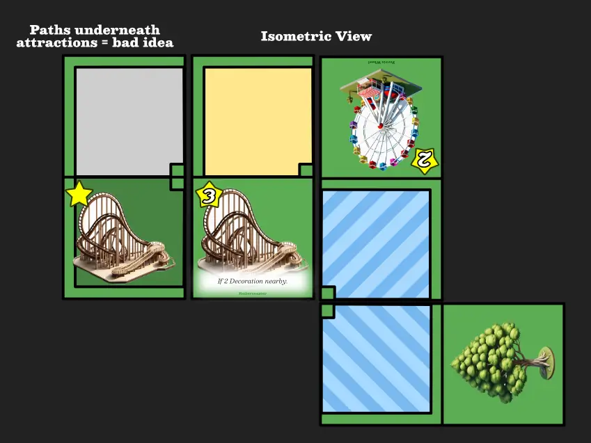
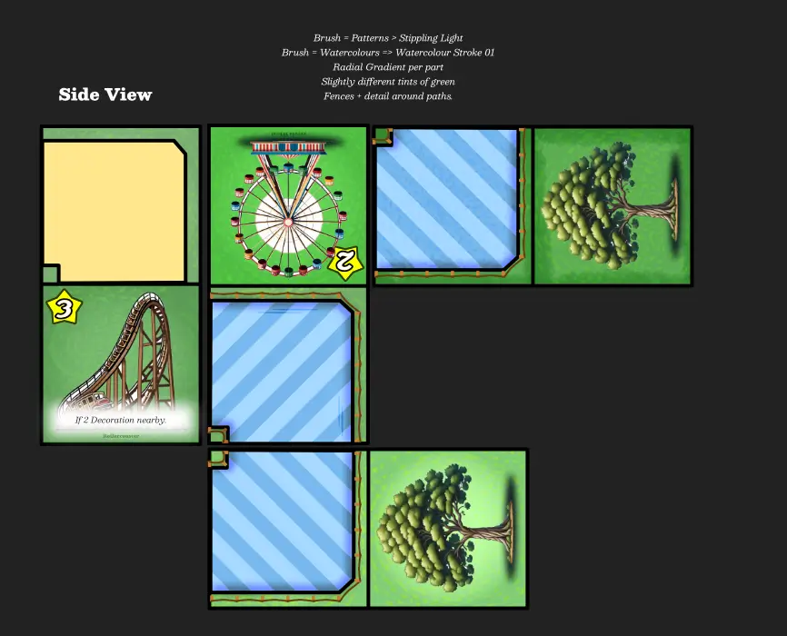
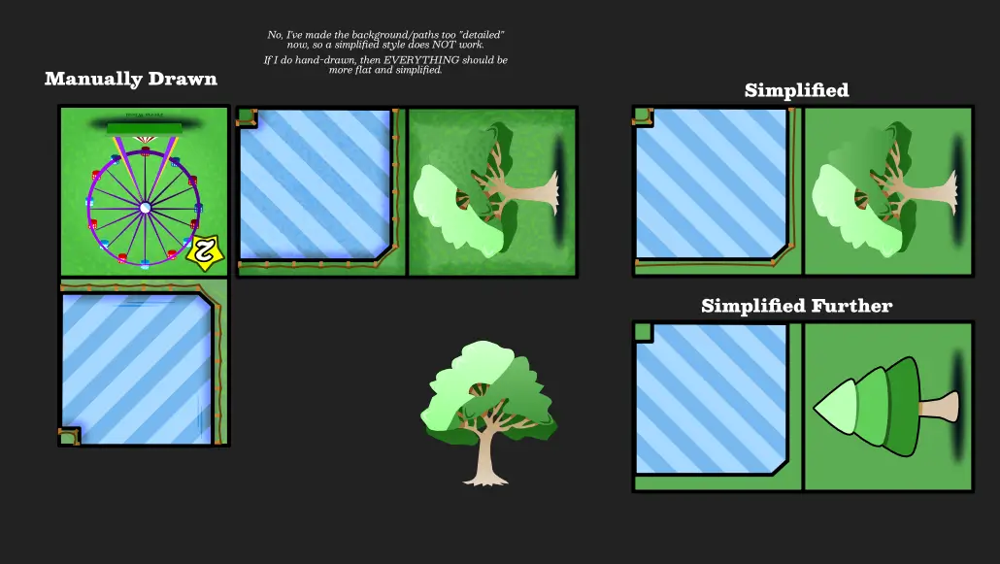
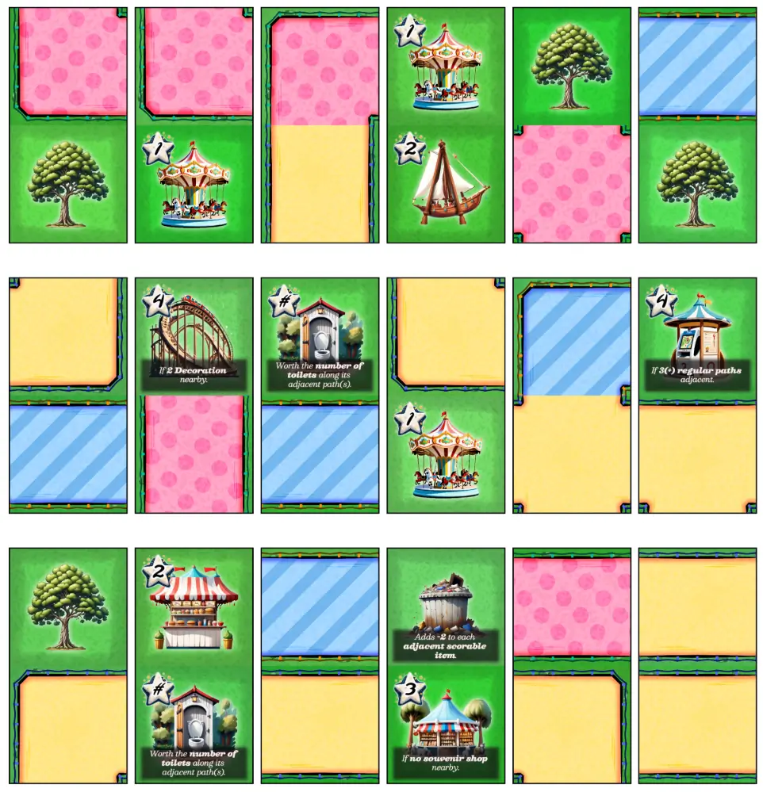

Welcome to the devlog ("developer diary") for my game [Theme Parque](https://pandaqi.com/the-domino-diaries/place/theme-parque/)

This article describes the whole process of creating this game, moving through the different versions, what problems I faced and why I made certain decisions. Hopefully it's interesting and fun to read!

## What's the idea?
I don't know where the idea came from. I only know it popped into my head while playing piano.
* What if we had a domino game in which you create a theme park ...
* Where each attraction scored the **length of its queue** (multiplied by the value of the attraction)?

I immediately envisioned a game about building queues together and expanding the theme park. You only received X "claim tokens", and each queue obviously can only be used for a single attraction. So it becomes a game of ...

* Growing queues (and attractions) in value
* Because you _must_ place dominoes on your turn, and you secretly _want_ a certain part of the board to become more valuable.
* But you must time your claims perfectly, to prevent another from getting that juicy rollercoaster with a queue of 5 tiles before you.

It sounded so potent in my head, that I stopped playing piano and wrote down the idea, and went out of my way to find time to create and test a paper prototype. (Creating a large deck of balanced domino tiles from scratch, using pen and paper, is surprisingly time-consuming.)

## Sharpening the rules
Of course, we need some definitions for how you may place tiles and other specifics.

* The game starts with just one tile: the entrance tile which has regular paths in _all directions_.
* All players have 5 tiles in their hand.
* On your turn, you _must_ place 2 dominoes (if possible), then you _may_ claim once.

When placing,
* Paths need to connect to paths.
* There are three path types: Regular, Queue 1, Queue 2
* A _queue_ must have one connection to an attraction, and one connection to a regular path. Nothing else is allowed.
* An _attraction_ can be connected to from all sides. However,
	* It can only have 1 queue.
	* Once claimed, it cannot be changed/extended anymore.

When claiming,
* Place your claim token (I just used wooden cubes for now, I have a large assortment of those always standing by) on that domino part.
* Everything can only be claimed once.

When it comes to scorable tiles, I created two of them: **stalls** and **attractions**.

When scoring,
* A stall simply scores what it says, but only if connected to or next to the Regular path. (Think of things such as a "toilet" or "restaurant".)
* An attraction scores the **length of its queue** times its **value**. (Think of things like a Carousel, a Swinging Ship, a Rollercoaster.)

That's it. I love the simplicity of these rules and this approach, and I was ready to test it.

{}
You can get exactly 44 dominoes out of a single A4 paper. They're small, but not so small that it's annoying. Getting a whole game out of one paper seems like good value.
{}

## After the prototype
The game just ... **works**?

I only have some improvements and tweaks, and a different composition of the domino deck, but otherwise I see no issues.

**Tweak 1:** "Nearby" should mean all directions (horizontally, vertically and diagonally). Because you need _paths_ everywhere, which are connected horizontally/vertically by definition, those spots are usually taken and it's too hard to fulfill adjacency requirements.

**Tweak 2:** Stalls can be simplified, which has the bonus of making them clearly distinct from attractions. You score stalls if they're **adjacent to any path**. (This also means I don't need to draw paths/openings _on_ the tile at all sides, as they **can't** be connected to a path.)

**Tweak 3:** In my prototype, I made each path equally likely. Now I know what's needed in practice.
* Queue 2 (which I started calling _Queue Rare_): should appear the least.
* Queue 1 (which is now _Queue Frequent_): should appear roughly 1.5x as often
* Regular: should appear roughly 1.5x as often as Queue 1

The regular path is required to glue everything together and make it _look_ like a functioning theme park. At the same time, having two queues which are identical (in dominoes and probability) is a waste. By making one rare, you have more variety and more strategic decisions. (You _know_ this queue is rare, so you might bet on nobody else having it and ruining your plans.)

**Tweak 4**: I'm not sure what's most interesting. The current rule forbids any further extension once an attraction is claimed. In practice, however, this means you'll only claim it if you can completely _finish_ it during your turn. Which is fine, but it feels more exciting if you can claim things _prematurely_, hoping they'll be completed in a few rounds.

So, for now, the rule is changed. You can continue adding to the queue after claiming. (Though if you claim prematurely, other players are obviously eager to hinder you and will certainly never _help_ you.)

**Tweak 5:** Decorations may be placed anywhere. (As in, a regular path is allowed to end in a decoration.) This didn't break anything, while giving more opportunities and a nice freedom to their placement.

**Tweak 6:** When creating my dominoes, I'd always done _one_ attraction or stall, and then something else (a decoration or path, not necessarily connected).

But then I realized that, by far, the most interesting dominoes ... would be those with **two scorable things on them**. Because placing such a tile means you _can_ only claim one of them, and the other must be opened to the other players.

As such, I decided to add quite some cards of that variety.

**Tweak 7:** Finally, not so much a tweak as just _good ideas to add_. There's a long list of ideas that sparked from testing the paper version against myself, but the most notable ones are ...
* **Bulldozer** ("decoration"): if played, allows you to overlap existing tiles this turn.
	* This allows plugging holes in the map or overcoming an especially nasty situation. But of course, these icons are rare and placement still has to be valid.
* **Not Named Yet** ("stall"): stalls that only score when adjacent to _specific paths_. And stalls whose scoring depends on _other stalls_ along the same path.  
* **Tunnels**: A dead-end with a tunnel icon, which allows the path to continue at any other tunnel.
	* Of course, you need some way to _connect_ the tunnel. At first, I decided to just add _one tunnel_ ( = two icons on separate cards) per path type, so they were always unique.
	* But that felt too restricting. What if they're so fun we want more? What if an expansion wants to add more?
	* So I made the rule a little more generous: "a tunnel connects to any other tunnel that's nearby or in the same row/column".
	* This gives more freedom and opportunities, without being overpowered or too easy.

## Let's make that
With those tweaks, I thought the game was _really_ strong. It still had a relatively small deck, it still played in 30 minutes (which is especially great for such a tactical game that has quite some depth), so lets make it.

I basically went back to my first video game love---Rollercoaster Tycoon---for the stalls, attractions and decorations. (In fact, you can probably see how this whole idea was born from my deep experience and knowledge of that game.)

Once I had those, I asked AI to generate the most complex illustrations, and did the rest of the design myself.

I don't like adding a lot of text on cards/dominoes. But if I don't, you'll surely forget the details of how something scores or what action a decoration gives you.

So,
* I tried to do everything through simple icons (wherever possible) and kept numbers low.
* Where needed, a very _small_ bit of text is added.
* But mostly, any decoration/stall/attraction that required some text was moved to the _expansions_.

When I tested the game, for example, I only had one decoration. Just a _tree_ that did nothing else. And that was _fine_. Decorations with more complicated scoring/actions can move to an expansion, they're not essential to have in the base game.

### Better Expansions

At first, I wanted to make expansions based on the type of thing added. For example, an "Amazing Attractions" expansion that added 8 new attraction types. This felt thematic, and intuitive, and simple. (And it _is_ slightly simpler to code it that way.)

However, in the mean time I've made a few more (domino) games, which showed me that this is stupid. Dominoes have _two things on them_. They don't work in a vacuum, they work because of the variety of elements on them and how they can be combined. So, adding 8 new attractions (and nothing else) in an expansion, would mean those tiles are completely unbalanced. Because, well, they only have attractions (and no stalls, or decoration, or anything else)!

Instead, each expansion should add a little bit of everything: a few new Attractions, a few new Stalls, a few new Decorations.

This means you can add any expansion and the game remains balanced. Your park isn't suddenly 99% decoration and nothing else :p Additionally, these new elements can reference each other (e.g. "scores 1 point for every decoration of type X"), because they are now CERTAIN they're included.

I tried to find a different overarching theme for these, but found nothing. It's just "my simpler ideas for expansions" and then "my slightly harder ideas for expansions".

### Randomly generating material

In this game, I can't just randomly put 2 elements on a tile. Even if the elements are selected in a fair/balanced way, this still doesn't work, because _paths need to match_. It's not nice if we end up with many dominoes where, on that domino itself, the paths are placed illegally. It's ugly and confusing, and doesn't help the game.

So, I needed a robust system to quickly find 2 elements that could fit together.

Below is my first approach.

* Populate a list of _all_ options based on predefined probabilities.
  * For example, say we have 100 spots to fill, and I say I want 10% straight paths, then it adds 10 straight paths to this list.
* Shuffle this list (to randomize its order).
* For each domino, place the first element of that list (which is allowed to be anything).
  * Each part of the domino saves its "open edges". (For example, a straight path will be open on one side and the opposite side.)
* Then, search the remainder of that list for any element with an open edge that matches.
  * If found, great! Add that one, remove from list.
  * If not found, simply place a random new path (not from the list) that matches.

It's really bad if the solutions can't be found a lot of the time. And with so much randomness/freedom, that's bound to happen.

How do we solve that?

* SORTING: Only place the _first_ element in all dominoes first. Once done, sort by how strict they are. (Dominoes which have only one open edge, for example, come before those that don't care what's added to the other side.) Then place the _second_ element in that order.
* OVERDRAW: The total list of elements is a bit larger than the number of spots to fill. (Say, 120 elements for 100 spots.) This means they are still balanced, following my percentages, but the likelihood of finding something that fits is much larger.

Theeeeen I realized I was being stupid, as always.

It's not about "matching" compatible elements (with all the uncertainty it entails). We can simply _rotate_ the elements to match. Each domino only has one connection point anyway (the middle edge), so the other sides don't matter.

This realization reduced the complexity immensely. Now we only needed to do the following:

* Add two random elements to the domino.
* MUST MATCH: Check if one has an open side to the middle and the other has not => if so, rotate the other to be open to the middle.
* MUST NOT MATCH: Check if it's a situation in which both sides of the domino can't/shouldn't match. If so, rotate their open side(s) AWAY from the middle instead.
	* For example, an attraction can't be connected to a regular path directly, because then it has no queue. So that's one of those specific cases in which both sides turn away from each other.

### Sketching the graphics

This was always going to be the big issue. 

First of all, I didn't want to do a very simplified or abstract style. It just didn't fit the theme and probably wouldn't have enough detail the clearly distinguish the many types of rides, stalls, etcetera that might occur.

But I knew I had to make at least some parts completely myself, such as the paths and their exact measurements/connections. So I needed to find a style that allowed me to mix hand-drawn and AI-aided, preferably. Something not TOO detailed or complicated, but rather with simple shapes and some texturing.

Additionally, domino tiles are best viewed with top-down graphics. But you know what becomes completely unrecognizable/indistinguishable from top-down perspective? Rides, shops and decorations! 

After trying isometric view (and some other things), I settled on using perfect _front view/side view_ for all the icons instead. Then I started drawing them myself first, then asking AI to make them more detailed (or more into the same painterly style). 

Because, whatever I tried, generative AI just didn't understand 99% of rides (and other things I asked). For example, when you ask for a "swinging ship" (the common name for a very well-known type of ride), you just get a regular boat at a random angle and that's it :p So I had to draw the general look of one myself first, then ask AI to make it prettier, then edit that further because it refused to make it _side view_ and always tried to insert perspective in there.

Below are three images of me trying to figure out a style, while becoming progressively more detailed or more simplified.

Also, notice how I initially added paths below the rides ... then immediately saw this was ugly and ditched the entire thing (both in the graphics and the code). The idea was "well, rides need to connect too, so they need a path". But in practice, it just looks odd, and allowing connections from _all sides_ (to any ride) made my test games much more fun and playable.

### The Final Material

Below is a screenshot of the final generated PDF. (Because the dominoes are arranged completely randomly, this will of course be different every single time you press that button.)

I've only made quick illustrations for the base game now. I'll probably do more editing to get everything more in line (in terms of style, same level of brightness/contrast, etcetera). Once I've made _all_ the illustrations (for expansions too), I have a better idea of the final polishing needed for the final look.

But this is most of the way towards what it should be.

Now I can print, cut and test!

Side Note: I only realized at the last second that I'd completely forgotten to add something to differentiate Attractions/Rides and Stalls/Shops! I _had_ done that in my paper prototype, with a small icon of a house in the top right corner of stalls, but had completely glossed over that when transferring the game to proper code/illustrations. Only when I studied the final PDF, to check "is this good enough to waste ink on", did I suddenly realize players wouldn't be able to tell which was which. (Though you can obviously _guess_ that a ferris wheel is a ride and a toilet is a stall, but we don't want players _guessing_!)

And so I made some small changes. I added back that icon and other indicators for what type something is. (Decorations have no score/number, which makes them easy to recognize already.) I also coded the generator for the final rollercoaster expansion and designed some simple top-down tracks. Nothing too fancy here, took a few hours and then it was done.

## Playtesting & Polishing

Finally, many months after actually finishing it, I was able to playtest with others. 

{}
As stated, it was meant as a birthday gift for someone who loves rollercoasters, but we ended up doing something else for his birthday the entire day. Which was fine! But then people tend to forget about these things and it takes a while to plan it again.
{}

The results were the usual ones with my games: **it works great, except for a few tiny snags**.

For the most part, the game is quick to explain, really easy to play (while also just keeping a nice conversation or cracking jokes), while requiring real strategy and number-crunching at some points.

Below were my issues.

* **Tunnels** could be simpler and more freeform. Instead of "they connect to any tunnel in the same row/column", it's just "they connect to any tunnel". (Easier to remember, more fun to play with, helps you out of some messy layouts on the table.)
* **End of the Game**: I wrote down that the game ends when the deck runs out or when players have placed all pawns. This was an obvious mistake! It means that the final player to place their pawns just has free reign for many turns, and that's too easy and not interesting/fun.
  * Solution? **As soon as only 1 player has Pawns left, they take the final turn of the game.**
* **No Elimination**: similarly, I simply wrote that players were "done" and received no further turns. In such a tight game as this, with only 3 pawns to place ... this might mean you're eliminated _for a looong time_. That's not interesting. It also means you can't keep helping yourself _after_ placing that final pawn, which severely restricts what you want to do with it. (For example, you can't claim an attraction with your final pawn and then grow its queue later---because, well, you're out of the game!)
  * Solution? Once out of pawns, you just keep playing. **But you only play 1 domino per turn, and don't refill your hand.**
  * This was even simpler than the previous rule, while keeping players engaged and opening up strategies. (Without being overpowered. If I let you keep playing _fully_, your only incentive would be to annoy others endlessly, and that's not great.)
* **Bulldozer:** this _seemed_ overpowered for a bit, but repeat plays showed it wasn't. There are only two, and the placement ("overlap any existing tiles") still needs to be valid, and you can really only hurt players who were too eager and claimed stuff too quickly.
  * It did need a clarification (in its text) that you can only overlap unclaimed spots. And that you have to overlap one entire tile, not multiple different tiles.
  * Overlapping claimed spots, in absolutely any way, _is_ too overpowered.
* **Decorations:** again, they _seemed_ to appear too little, but that also wasn't an issue. In our first game, people simply either overestimated or underestimated their value. Yes, scoring a Rollercoaster is _hard_ (because it requires 2 decorations nearby). But that's the point. It's a risk/reward thing, it adds tension, it means people won't _instantly_ claim it after placing.
* **Nearby or Adjacent?** I made a clear distinction between the terms. Nearby was all 8 surrounding tiles, adjacent only the usual 4 (left/right/top/bottom). In practice, however ... "nearby" was easier to see and work with. And just _more fun_. Players were often excited about doing a cool turn, only for others to point out "no, it says adjacent, not nearby". And they had a sad face.
  * Solution? I simply changed them all to _nearby_. The tiles involved were hard enough to use as it was. This simplified things _and_ made possible more of the "fun actions that players really want to do".
  * This applies to the text on the tiles themselves, but also the rulebook. Stalls can now be placed _nearby_ a regular path, instead of _adjacent to any path_. (Because Stalls next to queues sometimes looked odd; but scoring Stalls when nearby _any path_ is such an easy rule that it might as well not be there.)
* **Fewer hand cards**: I reduced the hand and market size from 5 tiles to 4 tiles. This proved enough to give options and choice, without overwhelming players or making it _too easy_ to just play 2 perfect dominoes on your turn and that's that. It also means the game plays a little longer on the highest player count (before the deck runs out).
	* I did _clarify_ that you refill the market after each draw. (Instead of only refilling it all _after_ your turn.) This gives a bit more flexibility and options again, at the cost of ... nothing really. That's why _most_ games with such a mechanic do it.

After making these small changes, I dare call the game a great success. Looks good, easy to explain, intuitive theme and mechanics (at least, once you've explained that single "pathing rule"), but really hard to win and find optimal turns.

{}
In fact, when I test these games, I am always too busy explaining and checking where people run into issues, to actually play well. I can usually pay only little attention to my own turns. Which means I take dreadfully suboptimal turns :p I made some rookie mistakes in that first game with others, such as claiming far too early. The others just built a dump and a bulldozer around me, and my rollercoaster ended up scoring 0.
{}

I'm still keeping it as a middle game---not one of the easiest/simplest in the Domino Diaries---simply because it has a few more rules to learn. Tiles can show many things (attractions, stalls, decorations, paths) and many of them have text about how they score. This simply makes it a harder game than, for example, Dinoland that only uses icons and two possible things that can be on tiles.

## Conclusion

It's been so long since I created the game that I can't really reminisce on it too much :p I've forgotten the original idea and the process, as I write this just after finishing the playtests and finalizing the game's material.

The conclusion, I guess, is that it's a good game and I'm proud of it! The very vague original idea actually worked and came out well in the final product.

The idea of "attraction value is multiplied by queue length" really started it all, and it's still the core draw in the game. That big risk/reward thing of betting on an attraction, but struggling to close out a long queue for it. The other additions were simply shaped to support it and give more interesting choices.

As usual, I think the game really shines with one or two of the expansions. They simply add more special powers and ways to score, which not only adds variety, but combats some really bad luck or sucky situations. For example, many players still play it too safe and instantly claim an attraction which has only a queue of 1, maybe 2 tiles. This will not win them the game ... but it's also not that interesting. So, some of the stalls/decorations of the expansion help overcome this or really incentivize players to share more of the map and claim later.

It's the usual balance between "how much can I remove from the base game, to keep it extremely simple and accessible, before it becomes too simplistic?"

I think I did fine here. Our first test game of Theme Parque actually took way longer than it should _because_ people were overthinking their turns and really struggling to optimize those queues. There's already a nice challenge in the base game.

I'm sure that, if I look back on this design in 5 years, I can see ways to optimize it even further. Find a slight tweak that nudges players to build longer queues and delay claiming more. But I don't see it now---at least not without ruining the simple core we have---so I call the project done!

Until the next devlog,

Pandaqi