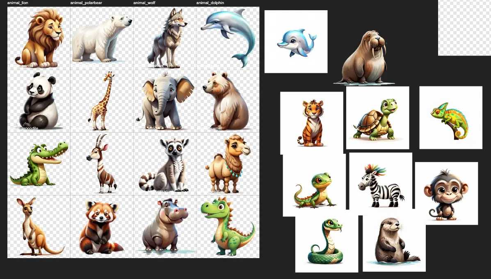
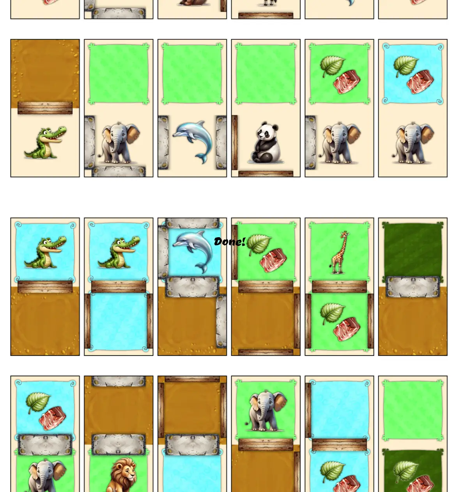
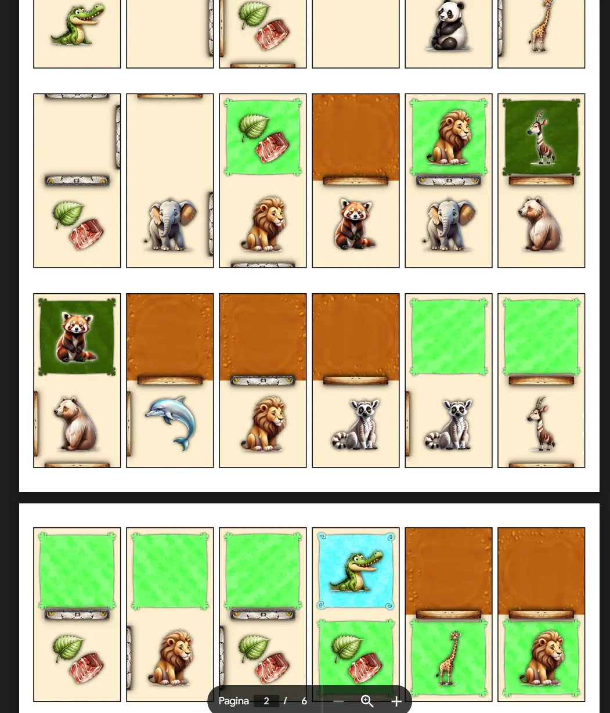
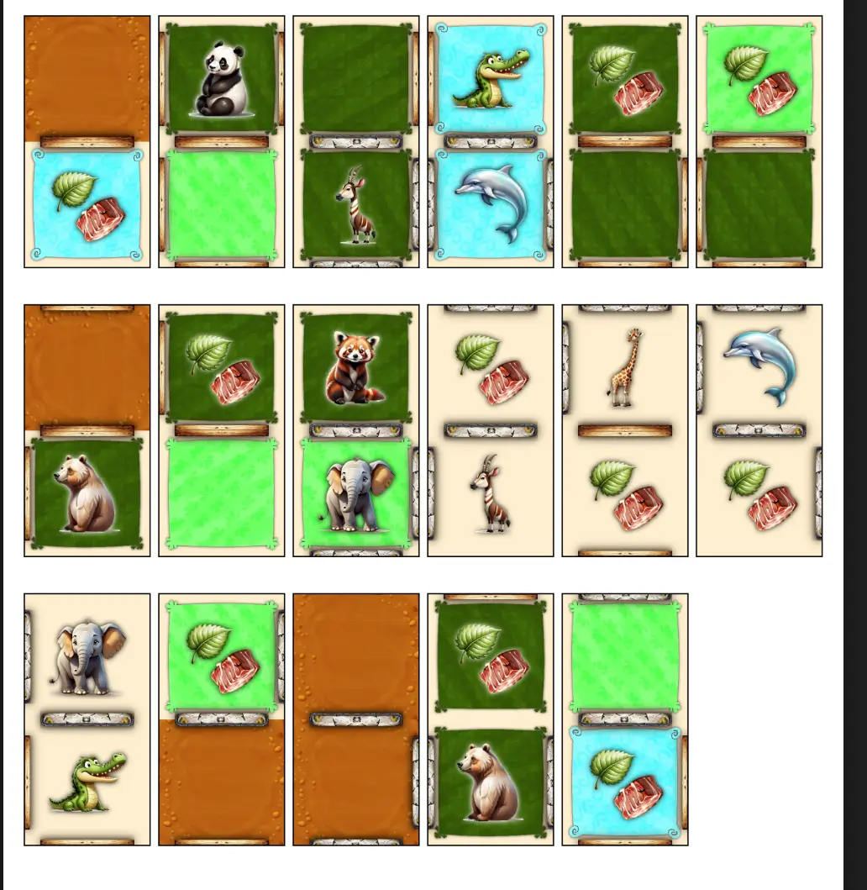
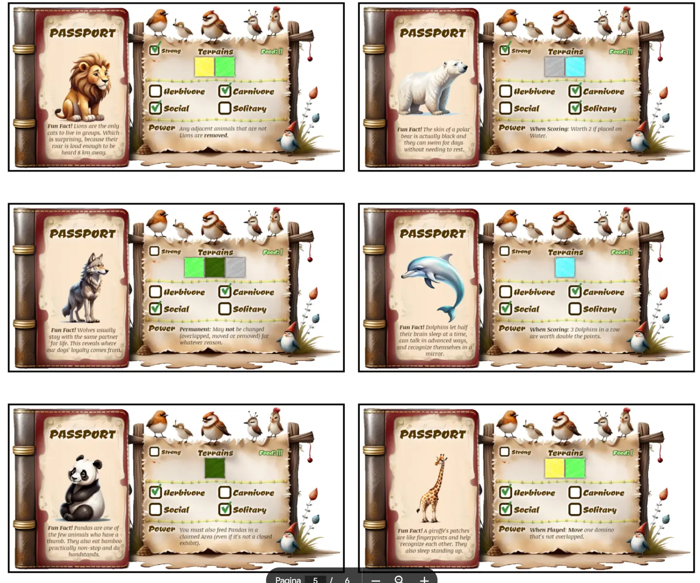

Welcome to the devlog ("developer diary") for my game [Zoo Parque](https://pandaqi.com/the-domino-diaries/place/zoo-parque/)

This article describes the whole process of creating this game, moving through the different versions, what problems I faced and why I made certain decisions. Hopefully it's interesting and fun to read!

## What's the idea?

When I invented the original idea for my "theme park"-related domino game (currently titled Theme Parque, might change), I _obviously_ also thought about making a "zoo"-related domino game within the same series.

(I grew up on Rollercoaster Tycoon and Zoo Tycoon and have basically linked the two types of parks in my head until the end of time.)

It would have to be more focused on _enclosures_ and putting animals inside (rather than building paths and connecting queues to attractions) ... but I didn't have any clue about what else to do. I had no strong ideas to make this a unique game instead of a slightly-different-spinoff of the other domino games.

When I came back half a year later (to finally _make_ that theme park game), I had some fresh ideas and a new approach.

Namely, whenever I make multiple related games, I try to identify their core aspects and try a _different combination of choices_ for each game. In other words, I write down a few of the major mechanics you could employ using dominoes ("placement is free/placement is restrictive", "you score for individual tiles/you score for groups of tiles", etcetera), then try to pick a _unique_ set of options for each _unique_ game.

This restricts me in what I can do with the rules, and that is actually _good_. What were the restrictions for this game?

* Pathing is irrelevant. It's about **enclosing**: creating fences around a group of dominoes.
  * (In the Theme Park game, pathing is EVERYTHING. That whole idea started with building queues and scoring from that.)
* This means you score for _groups_ of tiles. (And the challenge of the game, of course, is about playing the dominoes in such a way that you get high-scoring groups.)
  * (In the Dino-themed game, we also use "grouping". It simply uses the terrain on the background of all dominoes, and all connected terrains are one group. We'll have to pick something slightly DIFFERENT for this game.)
* The main special element is **dynamic dominoes**. In all the other games, you place a domino (adjacent to others, no overlap) ... and then it sits there for the rest of the game. In this one, dominoes will be _removed_ or _overlapped_ over time.

## A first rules sketch

How does that transfer to a zoo-themed game?

* Each _enclosed_ group of dominoes (paths/fences all around) scores points for whoever owns it. (Score = #animals x #tiles inside.)
  * A single exhibit can contain multiple terrains! It's about _fencing off_, not matching terrain.
  * It only scores, of course, if it's fully enclosed and has no holes.
* OBJECTIVE = The game ends when everyone has used all their claim tokens. Score your claimed exhibits; highest score wins.
* GAMEPLAY =
  * On your turn, place dominoes (required) and claim (optional).
  * Normally, dominoes are placed adjacent to others, no overlap. (The usual rules.)
  * Animals must be placed ON TOP of an existing domino that has a terrain that they accept. (For example, you can place a Giraffe on a savannah domino that's already on the map. You can't place it on nothing, nor can you place it on a water terrain.)
  * Somehow, a timer regularly triggers "feeding" events. If so, you must feed your animals in your exhibits: remove a "food" tile in the same exhibit. If you fail to do so, you lose animals.

As always, when I try to design rules for a game, I try to make sure they create a playable game (that finishes in X time, always has options, etcetera) but also to achieve a certain vision.

In this case, that vision was ...

> This should be the most "wholesome" of the domino games. It should be about being kind to your animals and it should be most warm/cooperative. It should not be abstract or number-crunching, but instead _feel_ or _look like_ you actually build a zoo by the end.

To accomplish this, I set a few guidelines.

* I won't include any mechanisms to completely destroy exhibits or animals, or otherwise extremely "harsh" rules. 
  * (For example, I might say that if you place a carnivore with herbivores, they will just eat the herbivores. But for this game, I'd rather go the opposite way: you simply CAN'T place those animals in the same exhibit, so this never happens.)
* Domino placement is still restrictive, but not overly so. There is still a _path_ that connects everything and should turn the board into something resembling a real zoo. But it's just _one_ path that can be connected quite easily.
  * This path also has fences on its sides, so it doubles up.
  * Without this path, the board just looks too disjointed and abstract to me. It would also remove most of what actually makes domino games shine, which is "connecting" the right elements, such as connecting two paths.
* The "feeding" mechanic is intuitive and realistic. It requires you to plan ahead and take care of your animals. It also, however, should result in nice gameplay. 
  * As stated, you need to strategize and can't blindly claim something or grow an exhibit endlessly.
  * But you only need to feed _your animals_. So you must also find the perfect time to claim something, because from that moment onwards, you need to feed them. (If unowned, animals just eat on their own or something :p)
* Any special elements (such as buildings/stalls/decoration to place) should reinforce this by being an _aid_ to your animals.
  * For example, besides placing food in their exhibit, you might also place toys.
  * A common special element might be an "information sign" you can place next to exhibits.
  * The terrain inside the exhibit also matters. Most animals can survive on other terrains, but they'll have one preferred terrain.
* _If feasible,_ I'd like to make the animals even more "real" by giving them all unique powers or rules. These would just be written on a unique tile (like a big "Giraffe Tile" that you can place anywhere and reminds players of what they want).
  * This might make the game too complicated, or be too much work. If I do this, it's most certainly an optional expansion.

## Improving the Rules

### What is an exhibit!?

The issue here is that I don't want to say something like "you can only claim finished exhibits". This is needlessly restrictive and has no strategy: you simply wait until it's done and then insta-claim it.

No, you should be able to claim ... something at any time, and then grow it afterwards.

What is that "something"? While writing the rulebook, I identified two useful definitions.

* Area = a connected group of tiles with the same _terrain_.
* Exhibit = a connected group of _areas_ that is completely enclosed ( = fences on all sides).

At first, I kept writing "Area or Exhibit" everywhere in the rules. (You can claim an Area or Exhibit. You score for every Area or Exhibit. Etcetera.)

This is silly, but it also showed me the true path forward. Remember my vision for a game that still requires cooperation and working together at most points? This is the opportunity to bake it into the game!

* You can only claim AREAS. (And each Area can only be claimed by one player.)
* This means that the final exhibit might contain multiple terrains and multiple players. They now have shared ownership (and benefits), so to speak, from this exhibit.
* But it removes any other nasty exceptions or needlessly long rules.

Again, the idea here is to reward people for matching terrains ( = bigger Areas), without making it a hard requirement (which is too restrictive and not useful). The idea is to reward people big time for managing to enclose an entire exhibit, so that's the only thing you score. But because multiple players can be inside that exhibit, you're more likely to finish it, because you're working together now.

This greatly streamlines the game and actually provides that truly unique experience I was looking for. It's now a middle ground between a competitive and cooperative game.

### What is the feeding timer?

For now, I decided to trigger a "feeding phase" whenever **someone finishes an exhibit**. This should happen at a regular pace in any game, so it felt like a good idea to try first.

When this happens,
* If a claimed exhibit has at least one animal, it must be fed.
* The owners of the exhibit discuss and pick one domino tile (showing Food) to discard.
* If none exists, you lose one domino tile (showing animals) from inside the exhibit.
* (If no decision can be reached, there is a default rule for who gets the "final say".)

This might be a bad approach in practice, but it's the simplest one for now and I see no immediate issues with it.

### Is it too simple now?

With such a great theme, many rules present themselves quite naturally.

* You can't mix herbivores and carnivores
* You can't mix solitary creatures and herd creatures
* Etcetera

Adding all of these to the base game, however, is overwhelming.

At the same time, leaving them all _out_ of the base game, makes it a bit barren. Simple and streamlined, yes, but is it fun and thematic enough now?

I decided to do the following.

* Each animal has a unique _tile_ that shows its properties (e.g. herbivore/carnivore, preferred terrain, etcetera) => You can simply place these tiles on the table as constant reminders, so players don't need to remember any details about a specific animal species :p
* This is in the base game! Buuuut almost _nothing_ on the tile is actually used in the base game. Because all those other rules are spread out over a few expansions, sprinkling in a few more restrictions/options each time.
* The only thing the base game uses is the one that feels most intuitive to me. That is: Animals must be placed on their preferred terrain.
  * Why? It feels most "wrong" if it isn't followed. Placing a Zebra on Water is just odd :p And so is making a Dolphin live on Grass.

With this decision made, the rules were "done", and I had enough certainty to know exactly what material to generate and what graphics I should find.

## Let's Make That!

### Generation

The generation was tricky at first, until I realized a better starting point.

The most important thing to "control" here (and ensure that it's balanced), is how many tiles are BOTTOM (they have a background, must be placed in the usual way) and how many are TOP (they have no background and must be placed on _top_ of existing dominoes). Because, obviously, if we have too few bottom and too much top, then we can't actually place the top tiles, and the entire game stops working.

As such, the generation starts by determining exactly how many dominoes we want of each (BOTTOM, 50/50, TOP).

Now that we know that, we can split "domino parts" (one half of a domino) into two lists: one with a terrain, one without.

* Only animals and objects can be without background. So we draw from a _smaller_ list.
* Everything can be with background. So in that case, we draw from the _full_ list of options.

As usual, options are weighted, so they appear roughly as often as needed, and some terrains/animals/stalls/etcetera appear more often than others (by design).

The _number_ and _type_ of fences are predetermined following my own distribution. In other words, I say something like "2: 0.25", and it means that 25% of all tiles will have _2 fences_, arranged randomly on its sides. Once that list is done, I can just loop through it and give a random element to each domino side every time.

The terrains provided some extra difficulty, because animals can't just be plopped onto random terrains. Each animal is only _allowed_ on 1 or 2 "preferred terrains", so I had to take that into account.

* Determine how many tiles need a "random terrain", and how many are fixed (because there's an animal on them).
* Give the animals any of their preferred terrains. But track this too by subtracting 1 from the overall frequency needed.
* Then go through all the other tiles and assign a random terrain that we haven't exhausted yet (their frequency > 0).

This was close to what I needed, but still required some finetuning.

* If one side of the domino is a path, and the other is something else, then we always want a fence between that. There is no practical use to random paths within exhibits or something, and it looks ugly/unnatural.
* If an animal is _strong_ and thus requires strong fences (in the expansion), then always give them strong fences. Seems obvious when stated like this, but still a rule I need to explain to the computer.
* If there are two fences in the middle ( = both domino sides have a fence in that direction), remove the weakest one.
* Draw all the fences _after_ everything else, otherwise terrains might overlap the fences of the other side (and other ugly stuff).

The biggest uncertainty here, as always, are the precise numbers. How many animals do we need? How many of each terrain? How many TOP and how many BOTTOM tiles?

I use my experience and intuition here---having made so many games where I needed to balance such numbers---but that's far from a guarantee. 

### Drawing / Graphics

I didn't want to do a very cartoony or flat style. I wanted something "painterly", closer to realism (but not quite). Something slightly faded, but still bright and detailed.

After some fumbling around, I found good settings and prompts to give to the AI. 

As usual, many illustrations or designs were done by hand, either because AI just doesn't understand it or because it's faster to get exactly a pattern/color scheme/whatever needed by just doing it myself.

For example, the terrains have their own icon and subtle pattern/texture, which was all drawn by me. It doesn't take too much time, while we get recognizable and consistent terrains (also to those who are colorblind) in return. In a game where most of the map will be those terrains---and using them strategically is the most important thing---I want that consistency and clarity, as opposed to whatever extra detail or pretty blades of grass the AI might give me.

I used some simple bamboo and leaf designs for the pawns and wherever else I needed something more.

The animals themselves (and the stalls/objects that come in the expansions) were the biggest part, of course. And there I ran into a dilemma: how "cartoony" or "cute" do I want the animals to be?

I love cute and cartoony animals, but I've already done them several times and they don't actually fit the original look I was going for. They scream "kids game" too much, while this game is more of a timeless family game for all ages. (Or, at least, it should be.)

But if we get too realistic, then we run into other issues: animals that don't fit neatly within a square frame, animals that look a bit too sombre or bland or dully colored, animals the AI really struggles to make realistic and painterly at the same time.

In the end, I managed to find a mix between the two. It's not as consistent or robust as I'd like, but I think most animals clearly fit within the same style and within the game.

Below is a screenshot of the "work in progress" on the material. 

You can see the fences are way too thick here---I still need to make thinner ones and update the spritesheet.

I added a shadow to the terrains to make them stand out more from the beige background. (I considered making all terrains darker, but that just looked bad.) Similarly, animals/food has a shadow as well, or a glow instead on dark backgrounds.

I still need to decide on the final set of base animals, but for now I just had a set that provided a good spread over the terrains. (Every base terrain type is "preferred" roughly equally often.)

I really do love me some nice animal paintings, though. It would be a shame to only include 4 or 5 of them in the whole game. And, realistically, a zoo will have more than that.

But adding more of them means each animal only appears a few times! It's hard to "match animals", it's hard to get a more consistent layout for the zoo.

I thought about this for a while ... until I realized the following.

### Rules & Realizations

In most zoo games, and most domino games, you have to match types. That's why my mind kept thinking: "oh we shouldn't have too many unique animals, or it would be impossible to place them all in an exhibit together"

Until I realized that my rules didn't actually require this, or reward this, or talk about this in any way. From the start, building exhibits has been about _fencing off_ an area of the _same terrain_. You don't actually need to put the same animals together.

In other words, my game can make itself even more unique by never requiring this. I can add a large number of unique animals, because it doesn't matter if one of them only appears 4 times on all the tiles. You can just combine it with other animals.

This _does_ make the board a bit messier, though, and I _do_ want to reward matching animals. So I added the rule that your exhibit score is _doubled_ if it only contains animals of the same type.

It's a case of solving a solution by thinking the other way. All this time, I've been thinking I need to heavily reduce the number of unique animals. Instead, I can say "let's just assume we have many different animals, let's pick that as a starting point" and then think backwards to how the game can accommodate this.

In a sense, the base game just tries to be as open, simple and unrestrictive as possible. But as you add expansions, you slowly move towards more of that "one animal per exhibit" style. (When herbivores and carnivores aren't allowed together anymore ... nor are solitary animals with herd animals ... and before you know it, you basically have to match animals to get a good number of points.)

As usual, might be a mistake. We'll see how it turns out in practice.

Finally, I needed to actually invent the special rules/powers of the objects, stalls, animals, etcetera. This happens through the usual process of "what are the core rules of the game, and how can I change/twist them in a way that doesn't completely break the game?"

For example, placing trees inside an exhibit means you don't have to feed herbivores anymore. Placing building X next to an exhibit makes it worth more points. That kind of stuff.

When it came to providing the details for each animal (herbivore/carnivore, solitary/herd, preferred terrains, etcetera) I obviously tried to base it on truth. I sought out animals that had certain characteristics I still needed, then picked the most common or popular from those. The animal detail tiles became quite simplistic, because I like minimalism, but also because I felt a bit burned out on the game after encountering many dilemmas and issues in a short period of time.

And so I fixed the final graphical issues (with the fences, missing illustrations, forgot to add the entrance tile that starts every game, etcetera) and arrived at our final material.

While doing so, I found a few more improvements to the rules:

* It felt a bit of a waste to only use the "research lab" to unlock one extinct animal (the dino). At the same time, I wanted to give the animals special powers, but thought that giving _all of them powers, all the time_ would be too much. So I combined the two: animal powers + extinct animals only activate once a research lab has been built. (This is all in the final expansion, not base game of course.)
* It looked ugly to use fractional numbers for the "food" animals need. (Such as "Food: 1.5" on their passport.) But if I use whole numbers, their sum becomes too high and you likely won't be able to pay that! And so I tweaked the rules: animals have nice simple numbers for their food requirements, but you _divide by 4_ to get the final cost. After doing some quick practical tests/calculations, this seemed to be the right number for division to keep food manageable, but also make bigger exhibits/bigger animals "more expensive to maintain". (As always, might be completely wrong about that in a practical game with other players.)
* As stated, the expansions add _extra_ restrictions/rules to placement. Such as: Herbivores and Carnivores can't be together. Buuuut I hadn't actually considered this in the generation code, which meant there were many domino tiles where they were together from the start. Which is confusing at best or just breaks the expansion at worst. 
  * I briefly considered modifying the rule to "you ARE allowed to combine them, but they just won't SCORE at the end" But that's a bit of a weak modification. A restriction that's not truly a restriction, just a penalty, is a lose-lose situation. Players aren't nudged to do something interesting and challenging, but they're also not scoring a lot of points at the end.
  * So, instead, this is forbidden at all times. The generation code simply checks if one side is an animal that's not allowed to combine with the other side. If so, it triggers the code for "make sure there's a fence in the middle", to separate the two. (The same code that separates a _path_ from an _animal_, for example.)

At this point, I was _reaaaally_ uncertain about whether this game would work at all. Overlapping animals? The mixed cooperative-competitive rules? This many unique animals? I had no clue whether I'd made something amazing or something horrible, so it was time to stop tweaking things and just test whatever I had.

## Playtesting & Polishing

### Improvements after coming back

While making the images for the rulebook, some time later, I was already able to simplify further. And fix some potential issues I'd missed.

For example,

* By finishing the game [Theme Parque](/blog/the-domino-diaries/theme-parque/), I figured out better rules for when the game should end. I simply copied those to Zoo Parque. (It's a long story; I'd suggest reading the end of the devlog for that game.)
* I improved the feeding phase by making the player who triggered it the _exception_. (Otherwise, you'd often be punished more than rewarded for finishing an exhibit.)
* Scoring was simplified: instead of counting the "biggest area", just count which terrain appears "most often".
* Some things were renamed to shorter + more consistent terms.
* Hand size / market size was reduced to 5. (To save material, make the game a better length at its highest player counts, and simply because testing Theme Parque showed this was fine.)
* Some "tiny extra bits" to rules were simply removed. For example, the rule used to be that "Areas with Herd animals can be claimed by as many players as the number of unique animals inside". This sounds smart ... but it's just convoluted. It's a very niche rule, and for what? It's much simpler---and more fun/effective---to just say "Areas with Social animals can be claimed infinitely often".
* And more tiny things I'm forgetting right now.

Most of these were the result of creating **visual examples** for the rules. As I was placing dominoes to illustrate a rule (or what is _not_ allowed), I often had a _hard time_ creating a valid example! And I have screenshots of all dominoes in the game to use!

This repeatedly showed that rules were just a bit too specific, and too hard, and there were too few bottom tiles and fenced tiles. In almost all cases, I simply shortened/simplified rules or changed them to a version that is _kinder_ to players.

This led to much cleaner rules and a game that should be less frustrating to play (well).

One major improvement to the game---making it both easier to play and simpler to explain---came from these visual examples too. Maybe I had made up my mind about this, but my _notes/rules_ didn't specifically state it. So I assumed I had just forgotten to deal with this issue.

What was the issue? It was actually two issues.

* Are regular paths allowed to be inside an exhibit? Do they count as an "Area"?
* When you _overlap_ something ... does the original terrain still count? (In other words, must players regularly lift that domino to check the "real area size"?)

The answer to the first question was simply "yes". It's consistent with all the rules. It's _necessary_ to make the game playable; without it, you're just too restricted, as a lot of the tiles have paths on them.

The answer to the first question was a resolute "no". It is _really_ fiddly to ask players to constantly lift dominoes to see what's below. As such, the core rule---which is never broken, not even in expansions---is that you should NEVER have to lift a domino to see what's below.

I feared my thinking here would be too simplistic. Because overlapping would now (almost) always mean _shrinking your area_. You're replacing terrain with a domino with a blank background. So ... aren't you just losing points by overlapping?

With the new rules, and the finetuned material, though, this actually works great.

* Often, the only way to _close_ an exhibit (fences on all sides), or get animals/food to actually score, is to overlap.
* This invites planning ahead for overlaps. If you do that _well_, they will help you win.
* Because of the rule "once an area is claimed, only that player may overlap it", it's not chaotic. It's actually a really strategic choice between "claim this early and get certainty" or "allow others to overlap for now".

Similarly, I had major doubts about the _feeding_ mechanism. Paying 1 food tile, every time someone finished an exhibit, felt like too harsh a punishment. When making the rulebook images, though, I saw that ...

* Closing an exhibit is hard. It often depends on placing the right tile at the right moment.
* As such, for _most of the game_, you won't have finished exhibits (or you'll be strategically waiting to close them). So you don't need to feed.
* At the same time, a feed phase always _removes_ a tile. Which opens up opportunities that would otherwise be impossible. "Bad situations" or "unclosable exhibits" (is that a word??) are never permanent in this game.

Even so, I also realized this part of the game could just be an _expansion_ (or _variant_). I intuitively used a single standalone image to explain the entire food/feeding system. This proves it's able to stand on its own and can be turned on/off. And in those cases, I'll always opt to keep the base game dead simple and move the rest to expansions.

{}
By still including food icons on the base tiles, it won't require extra material---always nice---and I also hope it entices players to check out what they mean and try that first expansion.
{}

As such, this simple "95%->100% finishing step" (after being away for a few months) already improved the game a LOT and made me far more CERTAIN about it.

Unfortunately ...

### Playtest?

I simply wasn't able to get a playtest going with other humans. I lack the resources to hire people or set up some better system, and I simply create too many games to test them all. In this first batch of the Domino Diaries, Dinoland + Theme Parque were tested with others, and the other games simply weren't. At least, not in time. Whenever possible, I retroactively test and update games if I see a chance.

As usual, I am sorry about that, I wish I'd only release battle-tested perfect games, but this is the reality at the moment. I'd rather release a game that might have issues or rough edges, than only release this game in 3 years when I've finally been able to get some playtests with friends/family.

So ... nothing to say here.

## Conclusion

I think the game is at least okay. Its rules are unique, yet very simple and intuitive. My own testing and polishing confirmed it is a challenging game, but certainly one that rewards skill and allows ending the game with a pile of points :p The animals look cute, it is colorful, especially the expansions add a lot of realistic zoo-park building.

I wish I could've tested and developed it more. I really hope to be in a condition/environment to rigorously playtest all my games, instead of, like, half of them.

I _do_ think, however, that this theme deserves an even simpler game. A _Zoo Parque: Kids_, if you will. I already know which parts to remove or simplify, how to get the material down further, etcetera. So I'll probably make that version for the _next_ batch of Domino Diaries games.

Until the next devlog,

Pandaqi