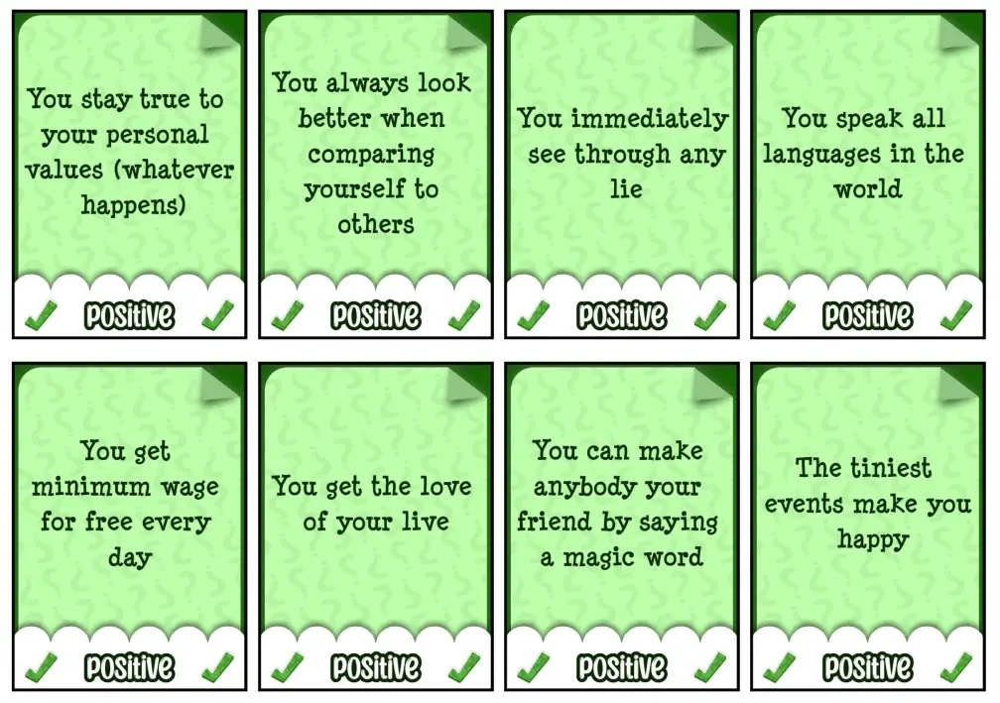

Welcome to the devlog for [The Game of Dilemmas](https://pandaqi.com/the-game-of-dilemmas/).

This will be an incredibly short devlog, because this game was basically born while making [The Game of Happiness](https://pandaqi.com/blog/boardgames/the-game-of-happiness/). You can literally read about the moment I realized this might be a good game. They were developed in tandem for mostly the same reasons.

The devlog below will only mention the specific tasks for this project that I had to do from scratch.

## What's the idea?

There are two huge decks with POSITIVE and NEGATIVE cards.
* POSITIVE = some superpower, good event, nice thing to have
* NEGATIVE = some bad consequence, terrible side-effect, or nasty event.

(This is obviously based on the general consensus of what's good or bad. Anything that makes me doubt goes into a NEUTRAL category you can use as a sort of expansion.)

Players simultaneously use these to create a _dilemma_: attach a positive to a negative, then play that to the table.

Once all dilemmas have been created, players vote. They get a bunch of YES and NO tokens, and for each dilemma they (secretly) decide if they'd accept it or not.

Finally, all votes are revealed. The most **controversial dilemma** wins! In other words, the dilemma with the **smallest difference** between YES and NO votes.

That is the entire game. It's about creativity and social play, trying to come up with dilemmas that would stump most players and lead to the most variety in votes.

## Does this work?

Yes, with a few slight tweaks.

* You grab an equal number of YES and NO tokens. (Half the dilemmas, rounded up.) This ensures you have to accept and have to reject some dilemmas, instead of people ruining it by just voting reject on _everything_.
* An added bonus is that this makes our rule for the "most controversial dilemma" quite straightforward. Each dilemma is guaranteed to have the same number of votes (one per player), so you never have a dilemma that just wins because it only had one vote. (Which would often be the smallest difference between YES and NO, namely 1.)
* If there's still a tie, most REJECTS wins. Because we need some tiebreaker, and negative is always more _interesting_ than positive. After that, to keep things simple, we just say all tied dilemmas win.
* As stated, neutral cards or special votes become expansions/variants.

That's all. Now it was time to make the cards.

## Creating the cards

I already had a _huge_ list from The Game of Happiness with possible events, items, jobs, superpowers, etcetera.

I can't use all of it. But _most_ of it can be rewritten into this format:

> You get `some positive thing`, BUT you also get `some negative thing`

The easiest ones are the actual superpowers. But you can also do this with jobs, for example: "You are a world-famous musician, BUT you must also work as a telemarketer."

In this case,
* The POSITIVE card is "You are a world-famous musician"
* The NEGATIVE card is "... but you must also work full-time as a telemarketer."

I considered leaving the "... but" out. But it helps to actually read it like a sentence, and the different formatting makes negative cards stand out from positive ones (preventing accidental confusion), so I'll keep it.

{}
For a brief moment, I considered reusing Game of Happiness material directly for this game. Less printing! Less ink wasted! But that just turned messy. The cards aren't properly worded for that nor labeled positive/negative (on purpose!) It would also require people to visit another game to play this game, which is just one confusing step too many for most.
{}

A NEUTRAL card is an ongoing effect that might be good or bad. For example: 
* "While wearing a clown suit all the time."
* "While living at the top of a mountain."

It took some iteration to find a phrasing that allowed _any_ combination of two sentence splices. 

For example, a superpower from Game of Happiness is: "You can teleport ... but each time you teleport you forget where you are or why."

Such phrasing for the negative card won't work on other positive cards. "You are a world-famous musician ... but each time you teleport (huh?) you forget where you are or why."

So cards needed to be a little more vague and general.

### The final selection

So yeah, I spent another few days coming up with cool cards for about an hour, until I figured I had enough.

I set the max player count at 6 players, and the rounds to play at 5. With 8 cards in the hand, using 2 each turn, we're looking at 90 cards needed (to prevent doubles in the worst case scenario). It seemed reasonable to do 45 positive and 45 negative, with some 10 neutral cards per pack. At a sensible card size, this is 6 or 7 pages to print.

The first two packs were quite easy, the third one (with more creative, unique or specific things) was harder to fill up.

I discovered some interesting ideas along the way.
* The NEGATIVE card could say "you must do X to keep this benefit", linking up with the POSITIVE card in a nice way. (In a sense, this reverses the dilemma. The default is "You get X ... but also Y", this turns it into "If you're willing to pay Y, you get X". Though, the more I think about it, the less significant this difference seems :p)
* It was hard to find things that are more generally applicable. Things that allow truly creative dilemmas. Most ideas clearly point one way or another, which is fine, but felt like lost potential.
* The negative things were much easier than the positive ones. That was to be expected. It's always easier to break stuff or mention things you dislike, than invent some power or cool idea people would like to have.
* I also added a (smaller, different) fourth pack with all ideas I came across that are perhaps unsuitable for kids or families. I wouldn't care, nor would the people around me, but I'm sure some people do care about cards mentioning sex or addiction. So I kept all of that out of the base game and put it into a separate pack.
* The neutral cards are just silly modifications or twists. I hoped to find more game-changing stuff, but it just doesn't work. (Getting too specific or dramatic means the cards can't work on any dilemma and/or overpower the original game.)

All in all, we end with,

* BASE = 102 cards (45 positive, 12 neutral, 45 negative)
* ADVANCED = 100 cards
* EXPERT = 100 cards
* EXTRAORDINARY = 62 cards (26 positive, 10 neutral, 26 negative)

For a total of 364 cards. That oughta do it.

### Generating that

The cards are a simple set of three layers.
* A solid background (green for positive, gray for neutral, red for negative)
* An image of a folded paper with a question mark pattern (tinted to match the card; the original image is grayscale)
* A bubbly image at the bottom to hold the icons + card name

These are just an amalgamation of some sketches I did the night before. (Asking myself what would fit the idea of "happiness" and "dilemmas", which apparently yielded question marks and bubbles.)

On top of that, the actual card text is drawn. I kept increasing the font size over time, and also turned text **bold** by default at some point.

In the end, _most_ cards fit within the large font size, but some just have too much text. That's why I created several "levels": if a card has a string of text that's too long (say >70 characters), it switches to the next (smaller) font size.

Such as harsh cutoff always looks much better, in my experience, than continually scaling it. (Because then each card has a _slightly_ different font size than all the others, creating a mess.)

And so we get a simple but effective look for the final cards:

## Conclusion

We're already done! As stated in the other devlog (for The Game of Happiness), this was a side project of about 4 days, as I procrastinated on meeting my actual deadlines. (No, let's paraphrase that as "waiting for inspiration and better ideas".)

The game just works. It's obviously easy to teach and play, just combine two cards and then vote on each dilemma. The rule about "most controversial wins" is actually the key to this whole game, and I'm happy it was the very first thing my mind decided.

Letting the most liked or disliked win is way less interesting, because then it's mostly luck of the draw. You have some really terrible cards? Just pick those and everyone will say NO to your dilemma! Easy win!

But you need a dilemma that _some_ will accept and _some_ will reject, and that makes the game actually work. 

Also, I realized the rule about "if you win, all tokens on your dilemma become points" was stupid now that each dilemma had an identical number of tokens (one per player). So you only get the YES tokens on your dilemma, further cementing the idea that you want a balanced response.

For the game header, I let AI generate a very happy and very "devilish" image, then stitched them together with something like a "crack" or "thunderstrike" between them. It worked out reasonably well and conveys the message of the game. 

(Another reason for doing so is because my laptop is terrible and I have no money for paid AI services, so I'm limited to pretty small images that do not cover the entire area. So secretly stitching 2 images together this way is a nice trick to work around that :p)

Enjoy the game, keep playing,

Pandaqi