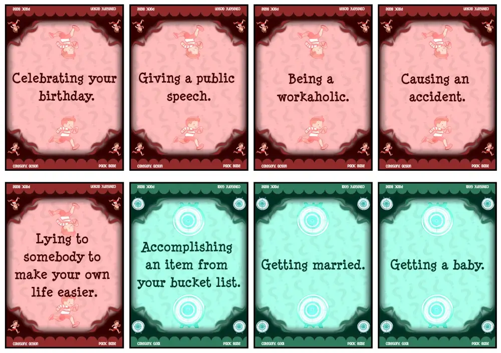
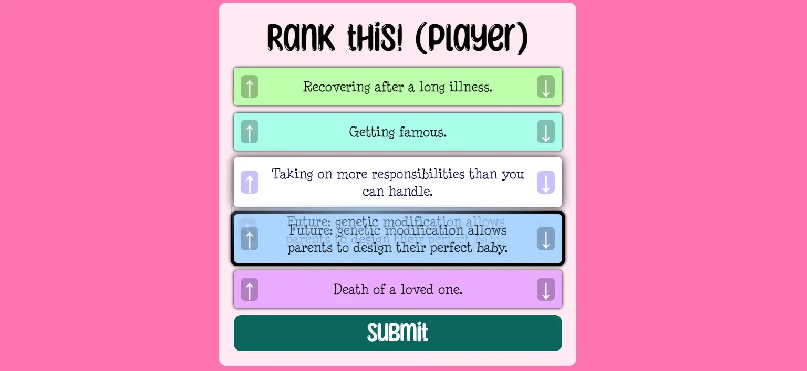

Welcome to the devlog for [The Game of Happiness](https://pandaqi.com/the-game-of-happiness/).

This is a really weird, special, personal project. The devlog will probably be quite short and the game not as expansive / marketed / polished as my others. But that's fine, because this is more a therapy session than a game :p

## What's the idea?
If you've ever read an About page on my websites, or some personal articles on my blog, you know I have a problem. When I was young, my life felt so horrible for so long that I ... lost the ability to enjoy things. It's just gone. I've been living for 10+ years without ever really wanting or liking something. All I do is based on discipline, good habits, and a strong determination to keep going.

Obviously, this isn't how it's supposed to be. It's exhausting. A struggle to do anything, because you never _want_ to do anything. Not even things that are "supposed to be fun". That's what it means when you completely lost that ability.

So in those 10+ years, I've constantly tried to stay active and to invent new habits or approaches that might help me regain that sense of "happiness".

This game idea was another such attempt. An attempt to look at things a different way and maybe, just maybe, trigger something in me. 

A few weeks after writing down the idea, my mother's birthday came up. She likes these kinds of "not-really-a-game games". So I decided to create and finish it to play on her birthday.

## What is the actual game?
On your turn, you draw a bunch of cards saying things like "visit the zoo" or "a walk along the beach". You secretly rank them based on how happy they make you. All the other players try to read your mind and guess what your secret ranking is (by creating their own). The more the two match, the more points you score!

That is the whole game. It's basically a group exercise in figuring out what makes you or others happy, but gamified and structured to trick people into actually doing it :p

## How do we make that?
The biggest issue is the ranking aspect. 

> How do we allow the two groups (you / the others) to create a secret ranking of the cards?

I can't add unique numbers or names to the cards, because then we'd need a boatload of tokens to reference them.

Because these cards are public (both you and the others must see them), I also can't let you simply place _the cards themselves_ in order.

So I see two approaches.

**Tokens + Cards:** You have numbered tokens (say 1--5). You place the right number next to the right card. (The event that makes you most unhappy gets the token 1. The next one token 2. Ecetera.)

**Unique Categories**: Cards are separated into several piles (with a unique color / icon / category). For each round, you draw at most 1 card per category. This allows the ranking tokens to just be a category, which you can place facedown in the correct order.

Both have pros and cons.
* Tokens + Cards = allows more variety/randomness in cards drawn, but is way harder to use and read correctly. (It's hard for humans to look at numbers like "1 3 4 2 5" and rearrange them in our head to place the cards in the right order.)
* Unique Categories = a tight constraint on card diversity, but more intuitive (the order is literally the order).

I couldn't decide, so I just allowed both :p Not on the same token; that would be confusing. If tokens had both a category and a number, there'd be confusion about which one is used or matters at that time.

But we're talking about ~10 tokens here. I can easily add one set of categories and one set of numbers to the material without needing another page to print.

No, that is all dwarfed by the number of **cards** this game will need.

The idea of categories helped structure the cards needed. These were the overall categories for "things that could make you happy or unhappy"
* **Event**: going to or experiencing something. ("Visit the zoo.")
* **Item**: having or using an object. ("Owning a huge high-definition TV.")
* **Action**: doing something. ("Being a teacher.")
* **Goal**: achieving some goal. ("Getting a master's degree.")
* **Lifestyle**: a general philosophy or approach to daily life. ("Every day, say a prayer before going to bed.")
* **Change**: if a certain thing changed or was true in the future, how would you feel about it? ("From now on, people kiss as a greeting instead of shaking hands.")
* **Personal**: related to relationships or human stuff _specifically with another player_. ("Having a late-night talk with `[your left neighbor]`")

There is some overlap here, but that's fine. It's all fine. I have a tight deadline and I'm designing this game on intuition.

You might see why I couldn't decide between the two approaches above.
* It's interesting if you, for example, randomly draw 5 "Item" cards and must choose which item somehow makes you most happy. (Computer or Smartphone? Which one would I rather use or lose? Hmm.)
* It's also interesting if you must draw 5 cards from the different categories and must somehow compare wildly different things. (Visiting my favorite theme park or improving my relationship with the neighbors? Hmm.)

Some people will probably play this game and discover things that makes them feel insulted. "Oh, you'd rather win the lottery than have a late-night talk with me!?" That's not a reason to tone it down or not make it---that's a _benefit_! 

## Creating the list of cards
I asked ChatGPT to hit me with some starting points. I asked it about events, items, accomplishments, etcetera that might make someone happy / unhappy / awkward / etcetera.

As usual, the response was quite vague and filtered. ("Having a functioning digital device makes people happy!" No shit, Sherlock.) But that's not the point. The point was to be inspired and turn the gist of it into specific entries to put on the cards.

I personally turn something like that into multiple entries. For example, just improvising here, ...
* Event: Your smartphone glass breaks.
* Item: Having the latest smartphone.
* Action: Playing games on your smartphone.
* Goal: Design a carbon-neutral smartphone.
* Lifestyle: Never touch another smartphone in your life.
* Change: From now on, all smartphones are shaped like circles.
* Personal: Have a call with `[youngest player]` about their upcoming birthday.

Perhaps ChatGPT can do that as well. I don't care.

I have two interesting notes here.
* The "happy" question is easy for ChatGPT. Anyone can name a list of items that they'd like to have. The "unhappy" question, however, brings some very interesting results. Suddenly, people have to think about items that they'd rather _not have_ than _have_. 
	* (For example, ChatGPT came up with stuff like "Having very ugly painting in your living room." I'm paraphrasing, of course. The AI would never write such an informal specific sentence.)
* If I want to turn this more into a silly party game, I need to ask for "embarrassing" or "silly" events or items. This gives very fun results, but might steer the game in the wrong direction. An optional set of cards, perhaps?
	* (For example, my example of kissing instead of shaking hands came from ChatGPT saying we should all high-five instead of shake hands.)

### Refining the list
When it came time to actually write the specifics (from the disjointed lists of inspiration and ideas), I made some further changes.

I added two new categories: **Job** and **Health**.
* Job is anything related to your "professional life", but also the simple statements of "Being a doctor" or "Being an astronaut"
* Health is anything related to your health, but also possible "superpowers" you might have.

I had way too many entries for the existing categories, and these were the two most common denominators I found.

Moreover, I moved anything that was "personal" to the **Personal** category. (Even if they were actually an event, or goal, or whatever.) It was the other common denominator that took too much space in other categories. For example, "lying to a stranger" isn't personal, but "lying to your best friend" is.)

Also, I improved the **Change** category. Starting each card with "From now on," or "In the future," felt like a waste of words. I changed it to just "Future:"

Which prompted the idea that we could also do "Past:" cards! The Future type is about a life/societal change for the future, the Past type is about something you _wish_ you could change in your past. Both have very interesting cards.

All of this showed me that these kinds of "dilemmas" would be a great starting point for a story. For example, if I wrote "You get insanely rich", I wanted to balance that by adding a _but_ behind it. What downside could I imagine that would make people second-guess if they wanted those riches? "You get insanely rich, but nobody remembers you anymore"?

Everything I came up with sounded like a great moral dilemma for a story. Something that truly explored character and human morality, and ended/started with this question. I'll probably write an article about this on my blog and use this in upcoming stories.

(In fact, I might turn this into its own game. The Game of Dilemmas. You draw one card from the positive pile, one from the negative, now you must decide if you'd be willing to accept this dilemma or not. Sounds like it could work.)

(No, no, wait, it's probably better if the _players_ create the dilemmas. So you always have a few positive cards and a few negative cards in your hand. Each player creates their dilemma. Then everyone votes whether they would or wouldn't pick each one. The dilemma with the biggest diversity---some would, some wouldn't---wins.)

(Yes, and then you have a few special cards per game to turn your dilemma into a 3-part-dilemma, when you really need to win this round. So use them at the right time, in the right way. We get both an interesting social game and an actual strategic game. Damn. Now I need to make this.)

Anyway, getting side-tracked.

I figured these sub-types of cards were a good way to add _some_ pictures or illustrations to the game. For example, all "superpower" cards would show the same superhero illustration. It keeps the game light and small, yet makes sure cards don't all like bland and the same.

### This takes longer than I thought
It always does. I don't know how I still don't factor that into my calculations.

Instead of one day of creating event cards, it turned into _three days_. Granted, the number of categories shot up as I discovered more fun or interesting approaches (as shown in the previous section).

Most of the final results were still completely invented by me, because ChatGPT mostly gives the same repetitive, vague responses. Surprisingly, it really only worked when asking for superpowers with a downside.

The final code file, at time of writing, has 741 lines. Removing the code around the data, I guess we have nearly 500+ possible cards. Yeah, I need to stop doing that.

{}
The number of story ideas that I got from generating these "dilemmas" or "interesting events" is hitting double numbers now.
{}

It obviously means three "packs" isn't enough. I was smart enough to already tag them based on general feeling (happy, unhappy, awkward) and subcategory (superpower, future, etcetera). 

It seemed most logical to use that to create the packs.

* Base = just the most common cards, about 10 of them per category.
* Advanced = the same as base, just more of it.
* Expert = the same as base, just more of it (and perhaps longer sentences and harder to understand cards)
* Silly = only cards that are more silly or awkward, spread across the categories.
* Serious Superpowers = only "Superpower:" cards
* Change the Past = only "Past:" cards
* Jovial Jobs = loads of slightly less common jobs
* Horrible Habits = a bunch of habits/lifestyle ideas that were leftovers
* Let's Get Personal = those "personal" card types I mentioned before.
  * The category was hijacked by the many ideas I had for stuff related to your personality or close relationships.
  * Additionally, some players might love this and some might hate this, especially if you're playing with strangers. Better to keep it an optional extra pack.

The names "base, advanced, expert" might make some people believe there's some wild difference in difficulty between them. That's not true: they're just a way to break down the HUGE list of options into manageable packs to print and play with. I couldn't find a better name, however. Because there _is_ a gradual increase in complexity / commonality in the packs from base to expert.

I also noticed something interesting. No matter how hard I tried, I couldn't find that many actions that would make you "unhappy". For almost all actions, I can see a world in which it makes someone happy. Instead, the best "bad actions" I could invent were merely moved to the Silly pack because they could be "awkward"---not necessarily bad.

The only things left in there are "accidentally" stuff. For example: "You accidentally cause an accident."

I thought that was funny. It goes to show, again, that just _doing stuff_ is better than not doing it at all. Most people regret _not_ doing something, rather than doing something that turned out to be kinda pointless or a mistake.

Really, try it. Try to find a list of actions that are unequivocally bad (or would make anyone doing them unhappy for sure). Try it without putting them all inside a trick like "accidentally do a serious crime".

{}
By the way, once I was done with this I realized I could've saved some time and effort if I'd saved the data in a smarter way. Then again, I didn't know the categories and packs would shift this significantly, so I did the best with what I had.
{}

At the start of my generator, it collects all the events into their _packs_. This allows me to quickly log the name of each pack and its **size**. To check if none of the packs is absurdly tiny or huge. This yields ...

* Base = 113 cards
* Advanced = 104 cards
* Expert = 101 cards
* Silly = 104 cards
* Past = 29 cards
* Habits = 25 cards
* Jobs = 44 cards
* Superpowers = 24 cards
* Items = 39 cards
* Personal = 30 cards

Which is 613 cards total xD Yeah, really should have slowed down at some earlier point. But it's fine, at least the game has endless variety, and I can reuse all those ideas for that spin-off about dilemmas.

As also explained on the game page, the "base, advanced, expert, silly" packs are like the core of the game. Each one adds 10+ cards per category, which is why they're the biggest but also most diverse. The other packs are much smaller add-ons that do one specific thing.

Still, 113 cards to print and cut ... might be a little much.

### Generating that
The important thing is the unique _text_ on each card. Hence, I wanted to keep cards very simple and just allow a lot of space for the text. 

We need the category color + icon around it, and perhaps _some_ extra decoration, but that's it.

Generating this just means calling some default functions to create text and images in the right places (and the right ways) using my own PQ Games library.

The end result is something like this:

### Digital version?

Now that I had all these things programmed anyway, I figured I'd make a digital version of the game too.
* You open it on a smartphone.
* It randomly loads events from my list.
* First, you get to rank them.
* Then you give the device away and other players get to rank them.
* And the device automatically compares and hands out points.

Yes, it's extra work and makes this project even bigger. Relatively speaking, though, it is _almost no work_ compared to _how much benefit we get_. Now players can test drive the game, or play with ALL the options without having to print that much material, with just the press of a button.

Also, I can playtest the game already (against myself) without having printed my paper prototype :p Ideas in your head are nice; it's always the question whether it works out in practice. In this case, I was worried that the random events might be too easy or near impossible to rank in any way. Randomness can do nasty things.

Coding this and checking the random cards it came up with, showed me that this wasn't true.

## Conclusion

Yes, we're already done. This game was made in 3 or 4 days (in tandem with the Game of Dilemmas). It ... works as I envisioned and quite well!

Some rounds are easier than others, but none are "obvious". Some packs contain better cards than others, but none are clearly better or worse. It all just works and I'm at least _happy_ I was able to make this game (as I procrastinate working on what I was _actually_ supposed to do this week).

Keep playing,

Pandaqi