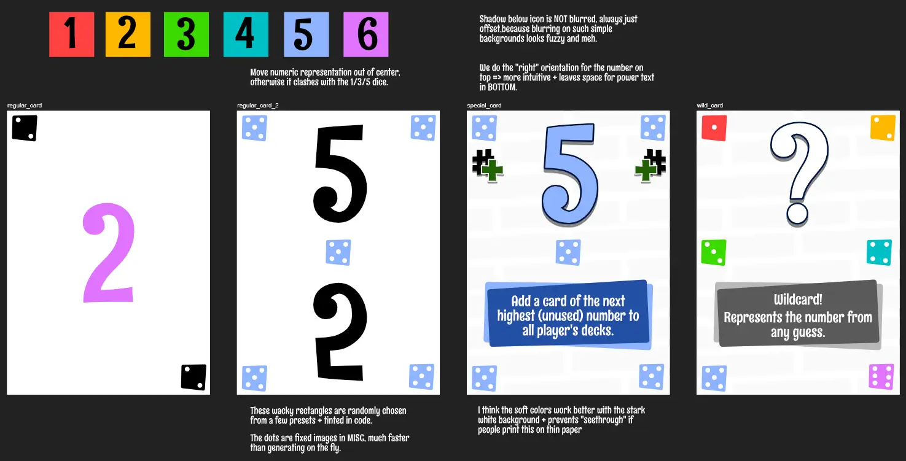
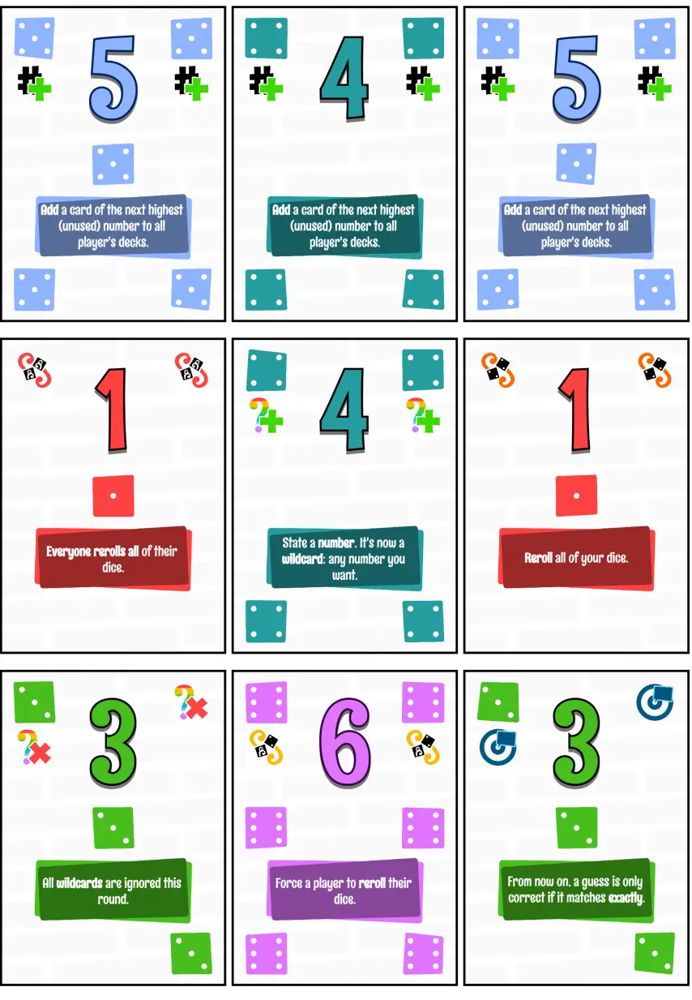
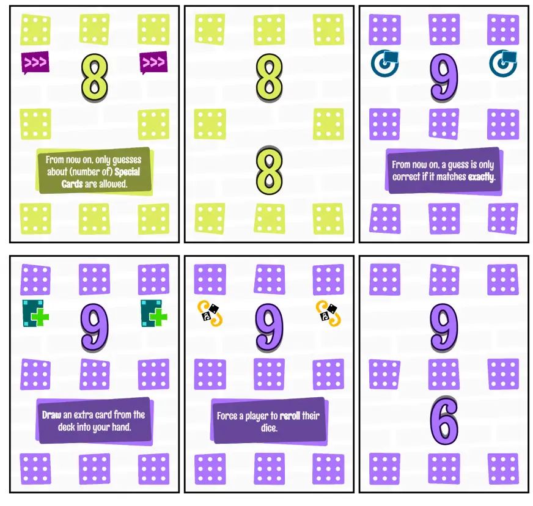

Welcome to the devlog for my game [A Little White Die](https://pandaqi.com/the-luck-legends/roll/a-little-white-die/). 

This project is part of a series of games called The Luck Legends. Visit the devlog for the entire series if you just want a "summary" of the development behind this game. This article will be about the in-depth specifics, which problems I encountered, how I solved them, and any other interesting bits.

## What's the idea?

This was my third simplest idea, based on the general idea of **Liar's Dice**. As I researched this, I stumbled upon a two-player variant inspired by _poker hands_ or _common hands_, which is how this idea turned into _two_ simple ideas.

As usual, I don't intend to just simulate or copy existing games 100%. What's the point? Instead, I wanted to use the special advantages we have now that dice are cards.

Below are the general rules of Liar's Dice.

* Everyone has their own set of dice and a cup. We roll simultaneously.
* The first player starts with a bid about how many dice there are of a certain type _across the entire table_. ("There are five 3's.")
* In clockwise order, players must either make a higher, riskier bid ("There are six 3's") or call the previous player's bluff.
  * The most straightforward rule that I've learned is to say that every bid simply has two numbers (_how many_ and _which dice face_), and a bid is higher if at least one of those numbers is higher.
* If you're right, the bluffing player loses a die and starts next round. If you're wrong, this happens to you.

Simple, effective, I like this game. So I thought: how could we use our cards to add just a little twist or two?

* A wildcard number.
* The starting player can tell everyone else how many dice to use (must be at least 2). If they say "3 dice", then players must break their deck into 3 parts (however they want) and roll those separately.
  * _Why_? This gives losing players more control and strategy to get back, as they can pick numbers favorable to them.
* Special action cards, such as one that "adds the number 7" (to all dice decks). When it's your turn to bid, you may _choose_ to trigger that action if you have it.
  * _Why_? By revealing it, you give other players more certainty about their bids and what's on the table (which is bad for you). But you might really want that action!
  * _Why add higher numbers?_ Simply to allow bids to get a little more wild/go on for a little longer as the game progresses, moving towards a nice climax. Otherwise, if you keep playing Liar's dice until only one player remains, those final rounds can become very boring/stale/predictable.
* If you "lost", you lose all cards of the smallest dice you threw.
  * _Why_? This, again, makes that decision of "into how many dice do I want to break my deck?" have meaning. You can make it more unpredictable for other players by using _large dice_ ... at the cost of potentially losing _a lot of cards_.

That worked! The material was just simple numbered cards, with a few actions thrown in. I capped it off with a simple rule about bidding on the number of special cards too. ("You can always raise a bid by bidding on how many special cards there are, as long as your number is equal to or higher than the previous bid.")

A very simple game that nevertheless turns Liar's Dice into a different interesting direction.

## Simulation

I quickly coded the interactive example for the rulebook ( = "press a button and the website simulates one example turn for you"), then used it for the simulation.

After playing 10,000 random rounds, the computer told me that ...

* **Average #rounds per game is ~6.5**. This is fine!
* **Average #turns per game is ~8.5**. This is fine too! It means most players get at least _one_ turn per round, and on average a few of them get _two_ turns per round.

Please remember that this is with mostly random, stupid play. (The computer makes somewhat intelligent guesses, but only to a very low level of intelligence :p)

As usual, the simulation was mostly a "sanity check" for myself (see if the game works as it should and is at least numerically balanced), and allowed me to fix a few tiny issues.

* **Issue 1**: Previously, you were allowed to say any number (for how many dice people must create), as long as you can follow that number yourself. But ... if you say "1" in the first round, then the loser of that round will lose _all their cards_ (when you lose the round, you discard 1 of your dice used), ending the game instantly. That's not great, of course, and it showed in the simulation by skewing the average number of rounds to some really low number.
  * Solution? Simply raise the minimum number of dice to be created in a round to **two**.
* **Issue 2**: Previously, you were allowed to raise a guess if at least _one_ of your numbers was higher. The other number was allowed to be anything. Well, especially when you add expansions, this has the issue of creating _neverending rounds_. ("Number 3 appears 2 times." => "Number 2 appears 3 times." => "Number 3 appears 2 times." => and so forth)
  * Such guesses are tactically stupid moves. But when making games, you shouldn't rely on the players "not breaking the game by being smart". You should just create rules that are unbreakable.
  * Solution? Switch to a different rule that's common in Liar's Dice and variations: _At least one number must be higher. No number may be lower._ This way, one thing is always going up, and the round is certain to end in a reasonable amount of time.

Also, I realized a slight simplification to the rules to prevent any confusion from another tiny issue.

* PREVIOUSLY: When the Liar picks that number (of dice to use), the rules added an extra line: _The Liar can't pick a number by which they can't legally abide themselves._ This is fine, but troublesome when the Liar in question has only a single card in their hand. If you strictly follow the rules now, the Liar _can't say any number_ and the game halts. (Because they need to say a number that's at least 2 ... but not a number they can't follow themselves ... but they only have 1 card in their hand!) Messy. Meh.
* NEW: That line is _gone_! Without it, the entire issue disappears. While the reason for its inclusion is actually not important. I was afraid that players might abuse this by saying ridiculously high numbers they don't have to follow themselves ... but this is actually fine? 
  * It can be a tactical way to get back at players who are in the lead ( = having the most cards left)
  * Many times, though, saying a very high number is a stupid decision. Because it means that _if_ one of those best players (with the most cards) loses ... they only lose very few cards, because the dice are so small!

Finally, I feared that games would be far too short with only 6 cards in your hand. But this was fine already, and with these slight fixes/tweaks, I'm happy with games taking 6 or 7 turns with so little material and rules needed.

* Say the first round has 2 dice per player, and you lose. Now you're down to 3 cards.
* The next round, someone says 2 dice again. You create a die of 2 and of 1. Even if you lose again, you only lose 1 card.
* if you lose the next round, you only lose 1 card.
* If you lose the next round, _that's_ when you're out of cards and gone.

Losing the game after losing 4 times in a row, in the absolute worst-case scenarios, is a pretty normal consequence, if you ask me :p

## Visual Design

The visual design of this game is _very_ simple. It's one of the simplest rulesets I ever made---including perhaps one of the simplest and smallest sets of material---which is why overcomplicating the visuals would just send the wrong message and feel wrong. 

(Also, the name "A Little White Die" suggested keeping most of the colors/backgrounds simply _plain white_.)

Below is an image of my sketches and notes about the graphic design.

The visual of dice is just a great tool. It's very simple to create a colored rectangle with some white dots inside; at the same time, this immediately communicates what the game is about and makes mostly-white cards look colorful and polished.

## Finishing

As I finished this game, I made a few tiny tweaks.

* I removed shadows from the action icons. It looked great on some icons, and terrible on others. (Besides, the most important part of the card is the number + action text, and giving shadows to the icons makes them "pop" a bit too much and draw too much attention.)
* I completely forgot to pick colors (and add the dice image) for higher numbers (7,8,9) :p I had to do that later, picking whatever colors most contrasted what I already had.

Most importantly, I reduced the number of expansion cards. Before, it included _all_ actions, and every higher number _six times_ (so, if you played with 6 players, everyone would get one). 

This meant, however, that the number of expansion cards was **far larger** than the regular cards. You never want that. It means the base game is overcrowded by the expansion, which is too heavy and changes the game too much. (It's also just too much material to print, with too many cards with actions.)

As such, I reduced it to just 4 cards of every higher number, and only picking a subset of all possible actions (at random). In case material runs out, the active player---who played the card that allows adding a higher number---simply picks who gets one and who doesn't.

It saves me 15 cards, while adding extra strategy to the game ("who deserves a larger die?"), so I'm fine with that.

Once done, this was the final material.

## Conclusion

Not much to say here!

The game is very simple, the material was simple to make, and it all works wonderfully. Some people might still prefer regular Liar's Dice, because it has slightly less setup (just grab dice and go) but _more dice_ (more possible guesses, rounds that can go on longer).

I, personally, think I succeeded in making something in the same vein, but using just cards (you don't need to have loads of dice at home!). The wildcards and special actions from the expansion make it truly its own game with new opportunities. But even the simple act of splitting your deck into dice each round already creates an extra layer of strategy and gameplay that's not present in the original.

A worthy entry, probably the 2nd or 3rd simplest one, to the Luck Legends.

Until the next devlog,

Pandaqi