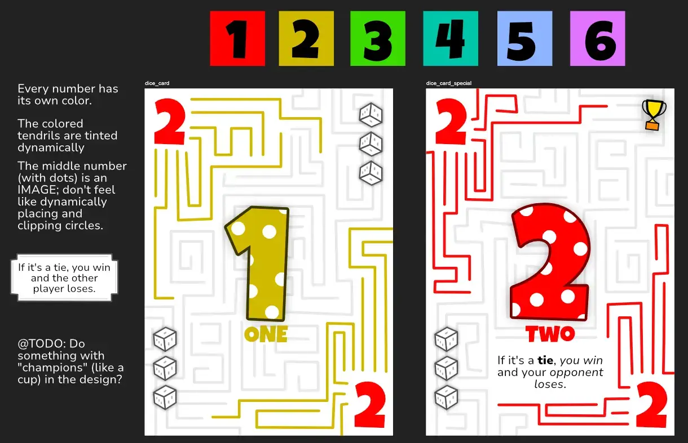
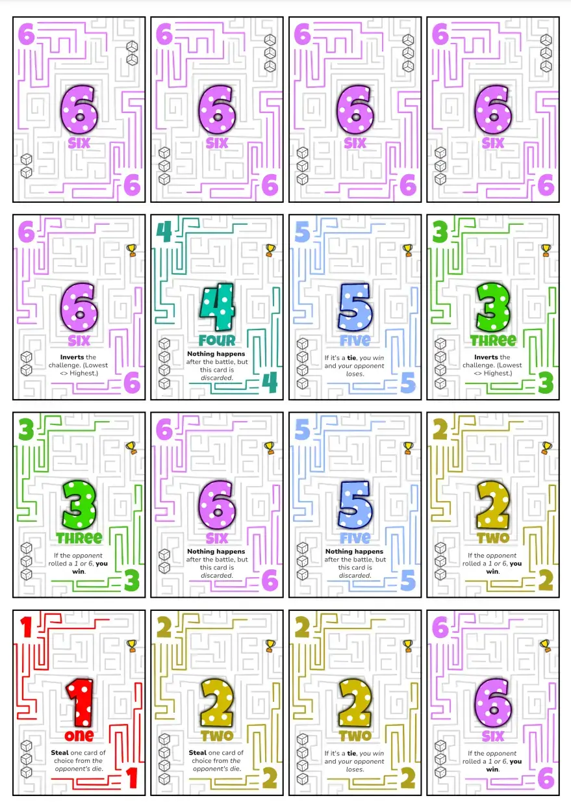

Welcome to the devlog for my game called [Champions of Chance](https://pandaqi.com/the-luck-legends/roll/champions-of-chance/). It's part of the Luck Legends series, so visit that general devlog for a high-overview of every game and what the project is. This devlog will (briefly!) discuss the process and other interesting stories for this particular game.

## What's the idea?

I wanted to create the absolute simplest "dice rolling game" I could think of. To test my Dice Deck idea (which is what the Luck Legends is all about) and just to get my entry level game for the project.

And it doesn't get much more basic than this:

* At the start, you receive 6 random cards as your die (which could be numbers 1--6)
* Every round, 
  * All players roll their dice.
  * Highest number wins.

Of course, that's no fun. There is no strategy there, no tactics, just pure randomness and luck of the draw.

So I expanded it.

* All players roll their dice.
* The active player picks their challenge type: "highest" or "lowest"
* This works exactly as you'd expect. If highest, then highest number wins. Otherwise, lowest.

Alright, a little more challenge, but still not great. What if you happen to start with only 3s and 4s? You can never win anything.

We can solve this by giving all players the same die at the start---everyone starts with 1,2,3,4,5,6 cards. But this requires extra boring setup (sorting out these cards) _and_ makes the first X turns of the game literally random. Because everyone is equal and randomness of the dice roll is the only decider of anything.

So no, I decided against that quite early on.

Instead, let's expand the idea again.

* You battle _1v1_ (instead of "everyone rolls"). This allows you to focus only on a player you think you're most likely to beat.
* Your opponent picks _how many cards to use_ (for your die). For example, if they say "3", then you only pick 3 cards from your deck and "roll" that.

Especially that second twist is very interesting. It's something I can easily do _because_ I simulate dice with decks (and not actual dice), while immediately adding loads of strategy.

If you have a few high numbers and a few low numbers (in your die/hand), you can pick some low number for how large the die may be. This increases your chances of rolling a high number in any case. In fact, this is so easy and removes so much uncertainty, that we need to be smart about the ORDER of things.

> The opponent picks _how many cards to use_ BEFORE you state your challenge (highest/lowest). 

This way, they have to guess what your challenge will be. Or, if they're too unsure, they can choose to pick a high number anyway and just use their full die. Strategy! Interesting decisions!

That sealed the deal for me. I finalized the rules and started work on the game.

## Let's make that!

### Generation

Most of my games are generated by the website: you press a button, it draws the cards on demand, and gives you back a PDF (some seconds later).

With games like these, this is especially a godsend. All we need are cards with numbers 1--6, repeated over and over. This is trivial to program, which means the generation code for this game was done in 5 minutes.

### Drawing

I picked some fonts with nice numbers. (My Luck Legends project folder has a huge folder of "fonts with nice numbers" that I'll probably distribute over all entries.)

That was the most important requirement, of course: having legible numbers you want to look at for a whole game. But it also helps settle the rest of the design, because it has to work around those fonts I picked.

For such a simple game, I decided on something extremely clean and minimalist. Use _color_ as well---a unique color per number---to help recognize what you rolled even faster.

### Expansions?

I forgot to mention the actual objective of the game! 

Initially, the plan was as follows.

* When you win your battle, you score the opponent's card.
* You keep playing these "battles" until someone has 10(+) points.

This, however, felt like an extra needless step. For the base game, I _really_ want everything as simple as possible. Additionally, score-based games like these always run the risk of being boring in the latter half. Because somebody is already so far ahead that you have almost no shot of winning anymore.

As such, I changed it to the following.

* When you win, discard the card you used.
* You win when you're **out of cards**.
* Of course, losing cards means your die becomes less and less varied, which good opponents can take advantage of. (They'll battle you when they _know_ they can win against your single remaining card.)
* As such, this auto-balances the game while using simpler rules and less stuff on the cards.

The idea of cards having a different score/value, though, remains interesting. Because it can change how you want to pick your battles or compose your die: if you _score_ your card on victory, then you want your die to be full off high-scoring cards, right?

I decided to add this as a multi-purpose expansion.

* Every card has 0--4 "dice icons" on it.
* This represents the card's value.
* It _also_ restricts the number the opponent may choose: if you want, you can pick the number of dice on your top-scoring card as the _dice size_, overruling whatever the opponent says.

Finally, I added another tiny expansion with cards with special powers. This is something I almost do by default :p It's so easy, with my experience and automatic generation, to add 5--10 cards with a simple action to shake things up once you've played the base game a few times. For example, a card that demands a re-roll if it appears. These surely shouldn't be too complicated or powerful; just one-liners for things you wanted to be able to do anyway.

### Finishing

There's not much more to say here. I did what I set out to do, the game is just a small deck of cards numbered 1--6, and the rules are simple but really fun and intresting.

To add some more meat to this devlog, here's an image of the final material PDF :p

### Rulebook / Simulation

Before completely finishing the project, I decided I wanted an interactive example in the rulebook anyway. The game was so simple, and such examples are just more fun and more effective at teaching how to play a game.

Additionally, I have a default system now that can reuse that code to _simulate_ the game (letting the computer play it 10000 times) and get some statistics on whether it's balanced or not.

What were those statistics?

* **Average turns per game is ~3.5**. This would be incredibly low for most other games, but here it's fine because every turn is a _battle_ between 2 players. So you're often losing cards or doing stuff on a turn _that's not yours_, which is why players only get 3 or 4 turns where they pick the battle.
* **Probability of a Tie is 15%**. This is fine too. Ties aren't bad, but you don't want this number too high, because then the game is stagnant and most battles a bit ... anti-climactic.

There wasn't much more to track in such a simple game :p

My biggest fear was that games would drag on too long. When you're down to your final card, most opponents will know your exact number and can make you lose battle after battle, until ALL players were down to 1 card. But the simulation showed that this isn't the case. Even when down to your last card, _you_ still pick the challenge and the opponent. So if you did your job remembering what other players have, and maybe get a bit lucky, you can win that same turn.

## Conclusion

Yeah, really tiny game, really simple, not much as else to say. But it works! It was a great test for the Luck Legends in general, and it passed with flying colors. It made me confident that I could turn all the other ideas (for this specific project/mechanic) into games too.

Until the next devlog,

Pandaqi