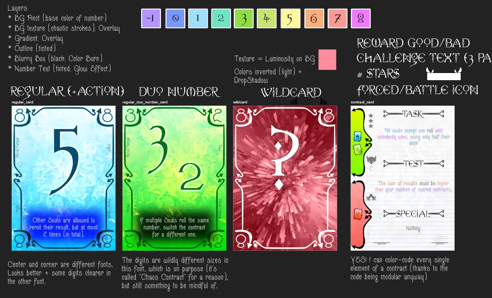
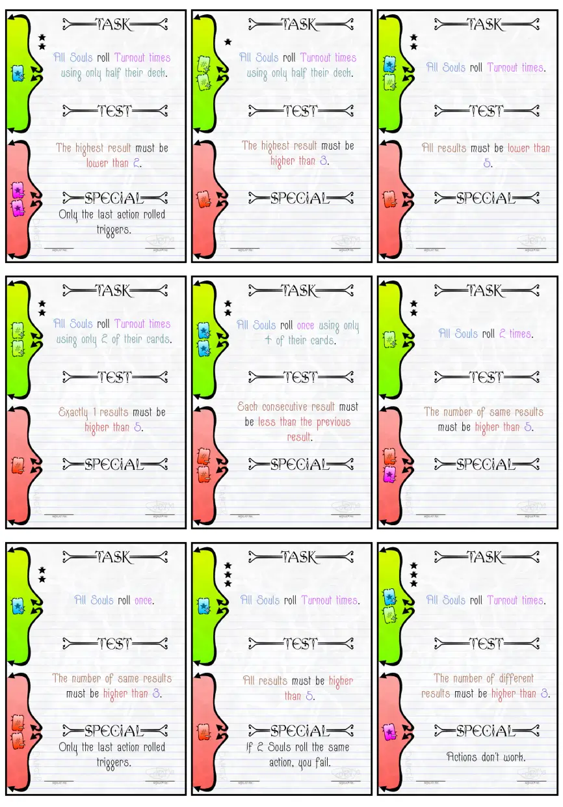
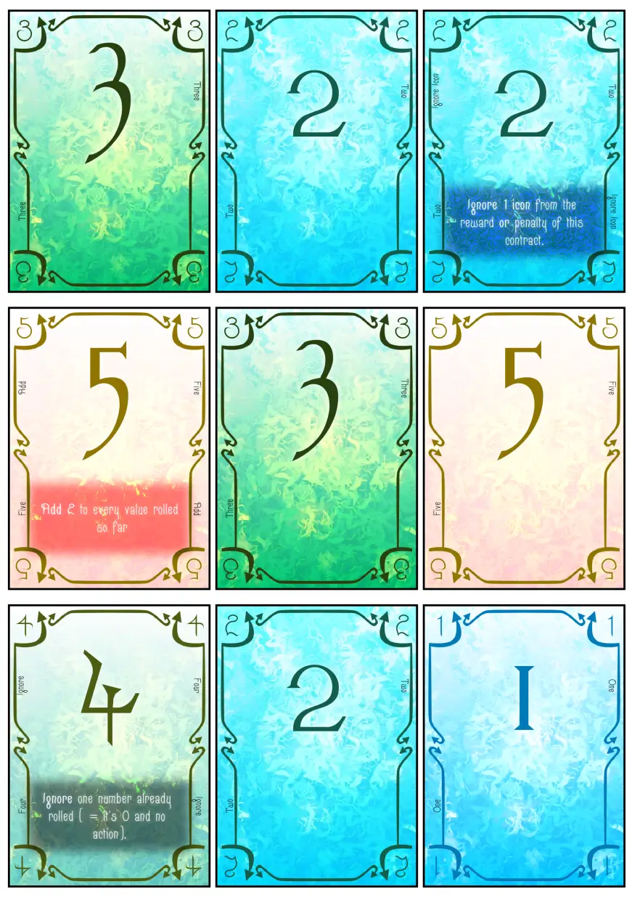
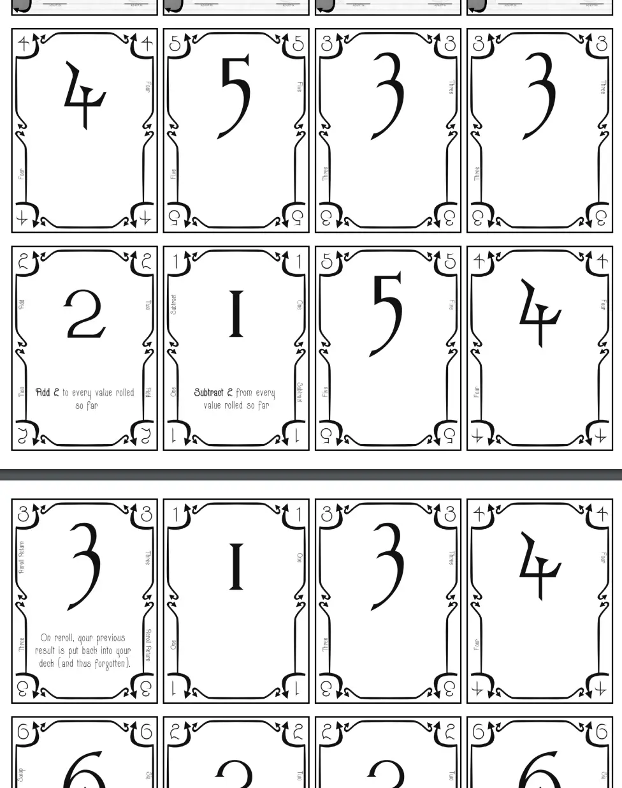
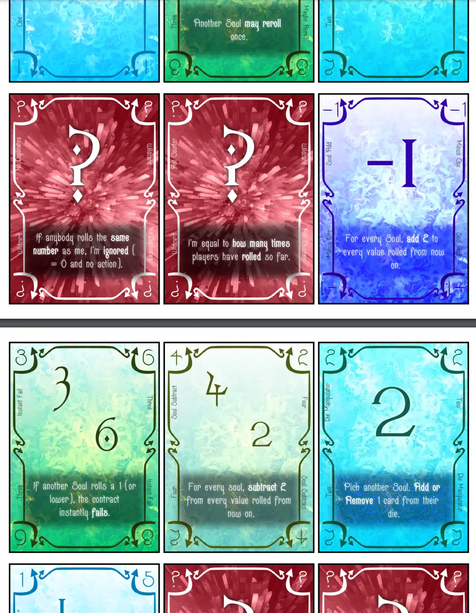

Welcome to the devlog for my game [Chaos Contract](https://pandaqi.com/the-luck-legends/roll/chaos-contract/). 

This project is part of a series of games called The Luck Legends. Visit the devlog for the entire series if you just want a "summary" of the development behind this game. This article will be about the in-depth specifics, which problems I encountered, how I solved them, and any other interesting bits.

## What's the idea?

This is the final game I made for the "first set". 

I try to pace myself and not go head-first into creating 15 games for a series all back to back :p So I chunk them into 3--5 games, then I leave the project for a year and come back later with fresh eyes. That doesn't mean those other ideas aren't there yet---most of them have a solid set of rules or ideas already---but I'm just not actually fully developing them now.

Anyway, I originally planned to do this one as the third of the series. It's one of the absolute simplest ideas.

* There are "contracts" on the table stating some challenge. (Example: "Roll higher than a 5.")
* On your turn, you pick one, roll your die, and if you pass the challenge you win the card!
* First to X cards wins.

That's it! Extremely simple, I could generate the exact challenges on the fly (from a large array of options/possible values), what's wrong?

Well, I already made 2 "contracts"-based game ideas recently. (One a few months earlier, one literally two weeks earlier.) I didn't want to do it all again, so I wanted a bit of extra time to get fresh inspiration on how to do it _differently_ this time.

Eventually, I found that in two things.

* The other contract games had a far more rigid structure. (One generated them dynamically, but from a tight template. The other had all contracts already locked in.) For this one, I wanted to **generate them as cleverly and freely as possible**: using templates for challenges that I could _chain_ or _combine_ or _invert_ in any way I wanted. 
* To make this _possible_ though ... we need to allow **tackling a challenge with multiple players**. (If the challenges are this random and unpredictable, it's highly unlikely players will regularly pass them on their lonesome.)

That's where the game title eventually landed: most of this game is about "entering a chaos contract" with one or two other players.

* You're eyeing a contract with juicy rewards, but it has ridiculous requirements. 
* So you ask another player to roll their die too, and another, adding your values together.
* If you succeed, you share the spoils.
* If you fail, you share the burden.

This automatically made the game semi-cooperative. Everyone is always engaged, because everyone might be asked to assist (and be rewarded) at any time. There's a nice risk/reward tug-of-war again, with players only being able to go for the highest scoring contracts if they take on risky outsiders. The exact contents of your die really matter, because other players _know_ what you can or can't do for you, and will ask or ignore you based on that.

Very interesting; still not easy to execute. What would the reward/penalty be? How to scale it properly with player count? Eventually, it came down to one very simple core rule.

> The reward/penalty of any card is always multiplied by how many players participated.

For example, say a bid card has the reward "+1 hand card, +1 scored card". If you pass it on your own, you get that and you're done. If you asked another player to help, you know have +2 hand cards and +2 scored cards to distribute. You decide how to do that---maybe you want the 2 scored cards, or none at all, or you share it evenly, whatever!

This way, all these values kind of balance themselves. Because players _themselves_ are in control of how much they get or give away, and they'll modulate that based on the current standings of the game.

(Same with penalties, of course. If the penalty is "-2 hand cards", and you tried with 3 players but failed ... you now have 6 hand cards to throw away. Your choice who loses how much. And if you make that choice too selfishly, that will probably come back to bite you later in the game ...)

The specifics of the contracts are explained in more detail in the individual devlog. Because that's where all the magic and gameplay lies, in the end. Just raw numbers or really simple contracts ("roll higher than 4") weren't interesting enough.

## How to structure contracts?

This was the big question. How do we make contracts as "modular" as possible? (Like LEGO bricks that my code can assemble in any way we want, and the challenge is always beatable and makes sense.) 

And how do we do that in a balanced way, that doesn't lead to paradoxes and allows us to customize where needed? (Such as only allowing some of the harder contract modules on the _expansion_, not the base game.)

We'd need to break down contracts into tiny "puzzle pieces" that could slot into each other, regardless of their content.

After some trial and error, I found a structure that worked for basically all the ideas I had. (Some compromises were made and I had to throw out some of the more "wild" contract ideas, but I think this is a great balance between freedom/randomization and structure.)

Every contract has three parts: DO, TEST, SPECIAL

* **DO**: What must the players actually do? (EXAMPLE: Roll once? Roll 3 times? Roll only half their deck?)
* **TEST**: What is the challenge? How are they tested? (EXAMPLE: The total sum of results must be greater than 5.)
* **SPECIAL**: Is there an overall twist or exception that modifies the entire contract? (EXAMPLE: Actions don't work.)

The SPECIAL is optional. The other two are not, as they're essential to having a challenge in the first place.

As such, the other two can be broken down into three more parts. That is their "template", if you will.

* **DO:** WHO + FREQUENCY ("how many times") + MODIFIER.
  * Who does it? (All Souls? One of the Souls?)
  * How often? (Roll once? Roll twice? Roll as many times as the Turnout?)
  * Modifier? (Optional; use only part of your deck, for example.)
* **TEST**: WHAT + COMPARE + THRESHOLD
  * What are we testing? (Total sum? Highest roll? Lowest roll?)
  * How do we compare it? (Less than? Greater than? Precisely equal?)
  * What's the threshold we need to pass? (A random number between 1--6? The Turnout?)

For each of these little parts, I could provide a _list_ of options. Any single one could slot in there; by randomly combining them, we have over 20,000 different contracts that can appear. And that's not even everything.

_Within_ these templates are more random values. For example, as I stated, the threshold can be any number between 1 and 6. ("Your highest roll must be greater than 1" is a very different contract than "Your highest roll must be greater than 6")

If you factor that in, the number of possible contracts easily exceeds the millions. That's nice, but not really my goal, of course. My goal was to have varied and balanced contracts within any game that players download/generate. And this is just enough rigid structure to create that variety with relative ease.

The most "complicated" modules were moved to the expansion. I mostly decided this based on _how many words were needed to explain it_ and _if it needed any custom requirements_. For example, some modules can't combine with everything. They only work with a handful of other options, which I manually set on its data. That's a good indication that this module is slightly more complicated (and narrowly focused) and should not be in the base game.

## Finetuning the details

### Rule Changes

It's common for contracts to let players roll multiple times. While testing this, I realized an obvious annoyance: it's tough to remember your previous rolls correctly. 

If you're in a contract with 3 players, and they all roll 3 times, someone is likely to forget their first roll after _9 results_. That's not great.

At the same time, I had the issue that certain card actions were "permanent". But if you rerolled them, I had to add an exception that said: "Powers only work if the card is visible. As such, on reroll, the permanent power is forgotten." There was this weird dichotomy between actions that triggered _now_ and actions that were _permanent_ ... but also went away if you rerolled and thus put the card back into your dice. Meh.

I decided to solve both issues with a change in the rules: **After rolling, take that result out of your deck (for rerolls)**.

* This way, all your previous results are neatly faceup on the table. No uncertainty, nothing to remember.
* Permanent powers just, well, stay permanent. No exceptions there; this is more intuitive even.
* It removes the "anti-climactic" turn of rolling the same thing over and over.
* While adding an extra strategy, because your dice keeps getting smaller upon rerolls (within one specific round).

### Estimating difficulty

I wanted to assign a difficulty to every contract. Why?

* To allow an "easier" (first) game if people want, by only including 1-star and maybe 2-star contracts.
* To give players a vague sense of how likely a contract is to succeed, so they don't need to be math wizards themselves to at least play somewhat intelligently.
* To check, for myself, if there was a nice variance of them and enough contracts were "doable" generally speaking.

But how do we assign 1, 2 or 3 stars with such a varied system? 

* I decided to assign a difficulty _per module_. For example, the task of "Your highest number must be at least X" is easier than "ALL your numbers must be at least X". So the first one gets `diff = 1`, and the other `diff = 2`.
* Then, the contract simply adds up all the difficulties of its components (some can be negative, making things EASIER).
* And then it divides it by ~2 to roughly clamp it to the 1--3 star range.

I played around with a more sophisticated system. Something that also took into account the _details_ of other modules. Because, for example, "Your highest number must be greater than 2" is far easier than "Your highest number must be greater than 5".

Shouldn't I take that into account? Yes, I should, but I saw no easy way to do this. No "general" way to do this properly. I would have to manually code things like "if that other module is _greater than_, and that module has a number _below 3_, then lower this one's difficulty". Which goes against the entire idea of random generation and is prone to mistakes.

Instead, I relied on my core rules to help me out here. Because you can always ask other players to _help you_ with a contract, you can make it easier for yourself. Rolling at least one number greater than 5 is much easier if you have 4 players rolling, instead of just yourself.

So yes, the stars are not a perfect indication of difficulty. But that's not needed (or even possible), because you _modulate_ difficulty by picking players to enter the contract with you. I looked over the list and decided this was a feature, not a bug. Most contracts can absolutely be done if you're tactical with how you approach them ... or become near impossible if you stubbornly try to go it alone and approach them wrong.

The stars are just a general indication of average difficulty.

### Rewards / Penalties

All this time, I'd moved the actual rewards/penalties of cards to the back of my to-do list. (It was hard enough as it is to create this entire algorithm, come up with the contract modules, etcetera.) When it finally came time to assign them, I realized there really wasn't much to do: there are only two things to reward or penalize players with.

* Get Score / Lose Score
* Get Card / Lose Card

To ensure the game doesn't grind to a halt (or stalemate), we need more _get score_ than _lose score_. Otherwise, I just assigned these randomly and that was that.

I considered assigning bigger rewards/penalties to more difficult cards ( = higher stars), but removed that feature.

* We _don't_ want a huge penalty on those cards, because it nudges players to play more safely and never take that risk.
* We _don't_ want a huge reward on those cards, because then it flies out of control if the Turnout is high.
* We _do_ want players to realize that it's tactically more useful to invite more players to the riskier cards, which _automatically_ scales the reward.

And so, every card simply gets 1 or 2 icons for reward/penalty, drawn at random (but weighted more towards _getting_ stuff than _losing_ stuff).

### Assigning special actions

This was a lot of work, but not much interesting to mention.

Numbers can have special actions in this game. I briefly considered moving this to expansion only, but those actions are just too crucial and too fun and should be in the base game.

These are assigned randomly. (It's not like the number 1 always has action X, and number 2 always has action Y, etcetera. That wouldn't be possible in any case, because we only have 6 numbers and more unique actions than that.)

As usual, my original list of actions had more than 20 entries, which is way too much. So I had to whittle it down to just the simplest and most useful, then whittle it down further to the absolute most crucial ones and give those to the _base game_.

I checked if none of them broke the game. (If assigned to a specific number, or occuring too often, etcetera.) And then I input them all into the code and gave it to the cards.

This is a neverending game of "but this action can be _so useful_ or _so strategic_!" fighting with "But I only have _space_ for a few different actions!"

Many of the actions that I moved to the expansion are still very simple and could've easily been in the base game. They would've been immediately understood and fun/useful. But having more than 8--10 different actions written on cards is just _too much_, so I have to make cuts somewhere.

### To battle or not to battle

Finally, I had come up with a "battle" contract. Instead of working together with other Souls, you'd be _competing_ against each other to match the contract as best as possible.

This was both a good idea and a bad idea.

* Good = this is very fun and intuitive! I even considered making this the base version of the game, until I realized that the options for "battle contracts" were more limited and slightly harder to explain. So no, the cooperative contracts as the "regular version" is fine.
* Bad = I couldn't really re-use my contract system for this, so I had to write even more code and exceptions just for the battle contracts.

Those two contracts have such a different perspective/approach that I couldn't fully unify the systems by just flipping a switch or something.

For example, a typical regular contract is "The total sum of results must be greater than X". 

But in a battle, there's no succeed or fail. There's only "do better than your opponent". (And I decided you could have any number of opponents---any number of players joining that battle---so I can't rely on it just being the two of you either.) 

So what would this become? "All Souls roll 3 times. The total sum of your personal results must be greater than your opponent."

It's longer and has a different sentence structure. It becomes even worse when we get to more unique battles.

> "Roll one after another, clockwise. As soon as someone rolls _lower_ than the previous player, the previous player wins."

This doesn't fit in our current contract syntax at all! 

At the same time, these two are not _dissimilar_ enough to write a completely different system for battle contracts. They are still _quite close_ in what they say or want you to do.

And so I made an _alternative version_ of some of the contract parts to slot into the same overall template. This is just a hardcoded change that deviates from the usual system. I thought this was fine---I knew that, after this code, I'd be completely done with the entire coding side of the project.

* **DO**:
  * **WHO**: This is always "All Souls"
  * **FREQUENCY**: This is either a fixed number ("roll X times") or a continuous loop ("keep rolling until somebody wins")
  * **MODIFIER**: N/A.
* **TEST**:
  * Some of the battle cards _can_ be phrased like regular contracts. 
    * WHAT = "The total sum of your personal results"
    * COMPARE = "must be greater than"
    * THRESHOLD = "that of your opponents" (always the same)
  * But there's a second variation needed for that continuous loop. One with an extra bit at the front:
    * END = "You win if"
    * WHAT = "the result of the previous player"
    * COMPARE = "is lower than"
    * THRESHOLD = "your result"

I also tried the inverted statement: "keep playing until someone loses => you lose if ..." 

It might seem like this makes no difference, but it does!

* "You win if you roll higher than the previous player" means there's a single winner; everyone else are losers.
* "You lose if you roll higher than the previous player" means there's a single loser; everyone else are winners.

The second one heavily incentivizes everyone to join every battle, hoping the second or third player just loses and they can get loads of rewards for free. Not ideal. Having a single winner is more balanced and fair, and also a more intuitive way of phrasing everything.

## Let's Make That!

### Visual Design

As usual, "making that" is already 80+% done after figuring out all those previous problems. 

(And it took a loooong time and a lot of coding + brainstorming to figure it out. I jumped into this game assuming, a bit naively, that I'd be able to finish the generation code by afternoon and then work on something else. Instead, I had to work until late in the evening just to get everything sorted.)

We have code that generates all cards (base game and expansions), we have our lists of possible actions/contracts, now I just need to create a visual design and put it all together.

Below are my sketches trying to figure out a general style.

I got inspired by general "devil"-imagery, such as their tail with a pointy bit at the end. 

For the contracts, I wanted to clearly differentiate them by actually having them be a _contract_ on paper (with a fake signature from the devil).

For the playing cards, I leaned into the "chaos" aspect and found a combination of textures, effects and layering to create a chaotic background that is still very readable and not distracting.

You can also see I figured out---while doing this---that different _colors_ were the way to make contracts easier to read and understand. Because I have the contracts broken into modules (that are chained together), it was very easy to just print the text from every "contract part" in a different color!

### Final Material

It was quite hard to balance a very colorful, textured and chaotic card with something that needs to be instantly readable. I think I managed in the end, but it took a while. For example, these things changed as I moved the sketches to the final material generation code.

* I made the main number even bigger.
* I made the dark box behind text even darker (for extra contrast); especially on wildcards.
* I added a slight glow effect to the text, partially because it just looked much nicer (and more fitting), partially because this makes the font a bit "thicker" and so more readable from a distance.
* (I considered a few other fonts for the project. More traditional fonts, highly readable but also ... boring and non-thematic. Needless to say, I decided to stick with my original choice.)
* I made the text on contract cards as big as I could, without every overlapping/overflowing (even on the longest possible contracts). Still I think it's slightly too small, but oh well, compromises compromises.

Finally, I lowered the number of cards (both base game and expansions). It was set to quite a high number: a random guess based on the idea this game would play 6 players. But that's not a good idea---with so many players, contracts might be done with too many Souls, and it all becomes a bit slow and unbalanced.

With a lower max player count, I could reduce the material once.

Then ... my laptop _reaaally_ struggled to generate the material for this one. It's so highly detailed and textured and varied, that it can't save the whole thing in memory and draw it to a PDF. (At least, the Google Chrome browser can't. Mozilla Firefox can, but it's 10x slower at it.)

So I lowered it further, just to make it possible to provide downloadable PDFs for others. (This is fine on other computers; mine is simply old and broken.)

The "inkfriendly" versions are no issue at all. When I make the cards smaller or "black-and-white", the computer obviously has less to do and can create those PDFs quickly and easily. That's one reason why I did my best to provide a really good inkfriendly version for this game.

The other reason I did that, was because of the chaotic base design. In case it's really too much or unreadable to some people, they can just use the inkfriendly version. Grayscale cards, much simpler design, still the same game.

When I first came up with this idea of "inkfriendly versions", they were a bit half-baked. I'd just throw a grayscale filter over most things and that was that.

Now, with more experience and effort put into those versions, I ... sometimes even prefer them. I'm a minimalist and I like things simple and practical. As such, when I strip away all the nice decorations and colors, and am left with just black-on-white cards with clear contrast, I sometimes print _that_ version for playtesting and usage.

I'm not just making things grayscale anymore. When I sketch the original card designs, I already actively pick which things will be disabled/removed/lowered in opacity for inkfriendly. This makes it very simple to code, and makes the final black-and-white versions very clean.

Below are images of the final material. And one from inkfriendly, to illustrate my point.

{}
To illustrate my point further: when I showed these designs to someone else (who has seen/tested loads of my games), they said it's the prettiest and most striking design I ever did. While I, the designer, think it's too busy and prefer the black-and-white version! Different tastes, different preferences, I simply try my best with each project.
{}

## Conclusion

I don't know what to think of this game. But I'm glad I made it, because I learned a lot and made a really cool system for those dynamic contracts.

Because of the wide variety, though, the game can be a bit more unbalanced. In certain groups, with certain dice, some contracts are just NEAR IMPOSSIBLE while others are VERY EASY. I can't prevent that, not without ruining that core aspect that makes this game unique (and possible in the first place).

At least the fact you can ask any soul to join you (+randomness of dice and dice actions) makes up for this, softening most issues with unbalanced contracts.

Besides that, the visual design _is_ different and striking, and the core rules of the game are incredibly simple again. 

{}
That's a general rule I've learned at this point: the more work I have to do _behind the scenes_, the simpler the game is _for the players_. I wrote a crazy algorithm for the contracts and rewards and all---the player only needs to learn 3 rules and can just read what's on the contract cards :p
{}

I pegged this as one of the harder entries, at least from the first set of Luck Legends games. We'll see how it stands the test of time. For now I think it's a fine game and a cool implementation of what's possible with my Dicedecks.

Until the next devlog,

Pandaqi