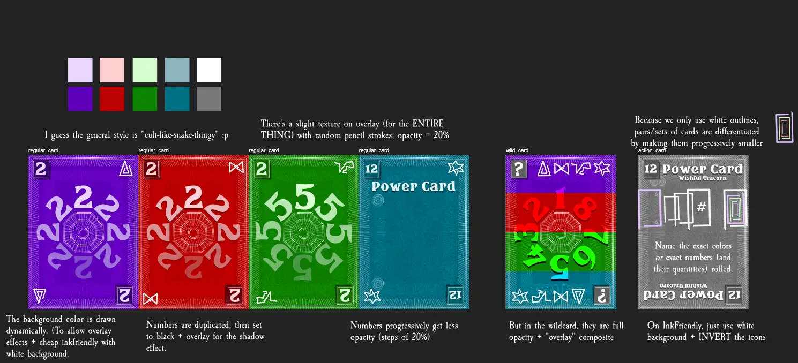
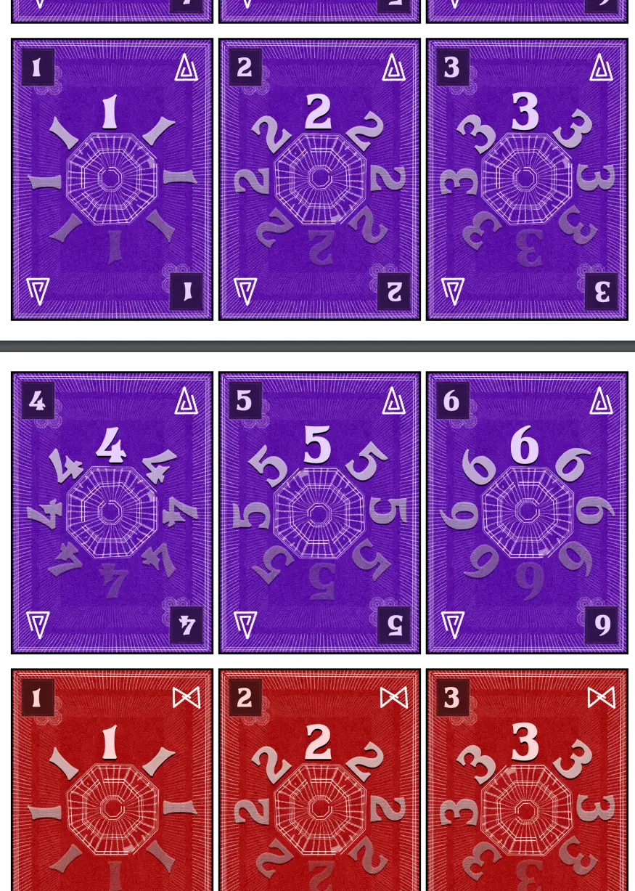
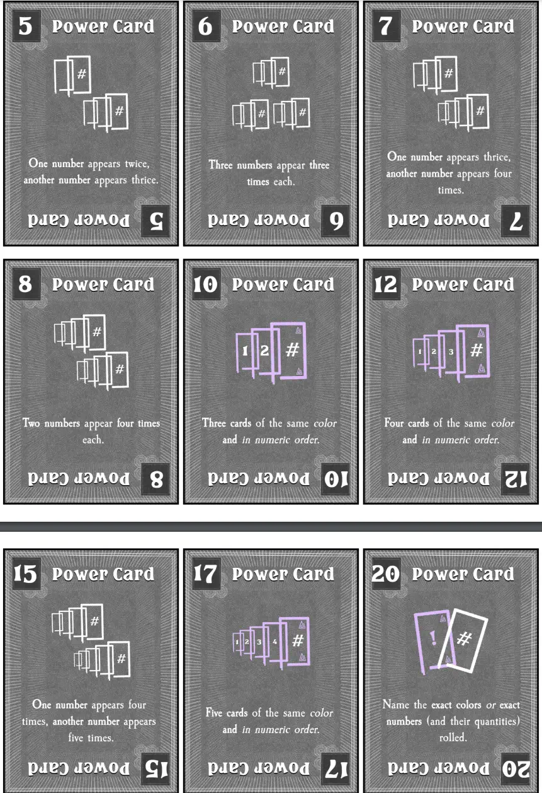

Welcome to the devlog for my game [Deceptidice](https://pandaqi.com/the-luck-legends/roll/deceptidice/). 

This project is part of a series of games called The Luck Legends. Visit the devlog for the entire series if you just want a "summary" of the development behind this game. This article will be about the in-depth specifics, which problems I encountered, how I solved them, and any other interesting bits.

## What's the idea?

This is basically an "advanced" or "alternative" version of _A Little White Die_, a very simple entry to the Luck Legends based on the common game _Liar's Dice_.

It's quite similar, but ended up _slightly too different_ to merge with the other game.

* Cards have numbers and colors ("suits" if you will).
* After rolling (individually, hidden, simultaneously), you claim a certain combo (inspired by poker hands, such as "a pair" or "a straight").
* You keep claiming higher combos until someone calls your bluff.

The only issue here is that people always forget poker hands and how they're ranked. Is a straight higher than a flush?! And which of the two was in numeric order again!? Additionally, if playing with more players, any combination is far more likely to appear, which makes the game hard to balance for different player counts.

As such, I decided to simplify that. (In fact, I modified it to a laughable extent, yes, but simpler is always better).

When bidding, you can bid on NUMBER or SUIT. 

* You say _how many_ cards are in the combo.
* You say whether they're the _same_ or in _numeric order_ (in case of numbers).
* Optionally, you say a _specific_ suit or number.

For example, you can state "5 dice of the same suit" or "4 dice in numeric order". More cards is a higher bid. If you make it _specific_ it's always higher than vague: "5 dice of Hearts" is higher than "5 dice of the same suit".

This covers _most_ poker combinations in a much more freeflowing way where you can always go higher in your bids.

Just to get the full experience, I added an expansion that adds "special cards" showing very specific bids. You may only bid that if you roll that exact card. That's ideal, because you rolled it ... you can just read the bid instead of having to memorize it. Special bids have their own numbers and they must simply be higher than the number of a previous special bid (if it exists).

This, too, requires just a deck of cards with numbers and suits (really just _colors_). I think the most time-consuming aspect of these projects was finding the right numbers to get nice probabilities, because only including numbers 1--6 (and every suit loads of times) isn't great here: it makes most combos perhaps a bit too likely, and others too unlikely.

As usual, this is a mix between paper prototyping and writing a quick simulation to play thousands of random rounds and tell me how likely combinations are.

## Simulation

### The Issues, The Issues!

I quickly coded the interactive example for the rulebook ( = "press a button and the website simulates one example turn for you"), then used it for the simulation.

After playing 10,000 random rounds, the computer told me that ...

* **A game takes ~7.5 rounds on average.** This is fine, if maybe trending towards the high side.
* **A player gets ~10.5 turns on average.** This means nearly 1.5 turn per round, which is a good sign. Rounds usually pass by every player at least once, and a few of them get the chance to guess again.

For some reason, I'd initially written in the rulebook that you only lose 1 card when losing the entire round. While _A Little White Die_ had the rule that you lose _one entire die_ for losing, which is far better, more impactful, and had been tested by that previous simulation. So ... I just changed the rules for this game to do the same.

(I realized this because the very first simulation run reported games taking a whopping 20+ rounds on average. Yeah, that's not surprising when players lose only a _single card_ for losing an entire round, and you start with 9 cards. Although I'd also left in a different piece of code that was wrong, which only ended the game if you were fully out of cards, instead of when you had only 3 cards left.)

The **biggest issue**, however, was that the probabilities didn't line up with how my cards (numbers and suits) were distributed at the moment.

* Just to get enough cards, I'd decided to use **6 suits** (or just "colors") with **9 numbers each**.
* In practice, however, this meant that any guesses based on _numbers_ were far less likely to be true than ones for _colors_. Additionally, guesses for numbers could only go as high as 6 ("The same number appears 6 times"), because, well, no number appeared 7 times or more.
* This severely constrained how high bidding could go, which meant that **~85% of the time** the final bid was simply challenged because you CAN'T go higher ... and then the challenge was won.

This issue is related to the second gripe I had when studying the random games from this simulation. 

The current rules state that any guess is _higher_ than the previous one if the number of cards is higher. ("5 cards of the same color" is higher than "4 cards in numeric order", for example.) But ... as I just explained, those other bits vary wildly in probability. A guess based on _numeric order_ is far more risky than one on color, because it's simply far less likely to be true.

This means guesses don't necessarily only _increase_ in difficulty/risk over time. They more or less pingpong instead, and making a risky guess ... just isn't rewarded enough to try it.

No, we needed a better core ruleset for guesses. 

### A Better Guessing System

I decided to move "specific guesses" back into the base game (instead of a variant), and move some other things out of the base game.

* PREVIOUSLY: The base rules only allow vague guesses. ("A number appears X times" or "A color appears X times".) That variant allowed specific guesses, which were always higher. ("Number 9 appears 3 times.") To make the base game a little spicier, though, I did include guessing _in numeric order_ in the base game.
* UPDATE: We switch it around!

The core rules only allow **specific guesses**. You must say how often a specific suit or number appears.

The variant/expansion is what introduces **vague guesses** and **numeric order**.

This is a nice simplification, but not enough. I mentioned the fact that, in a game like this, you really want _every subsequent guess_ to _add a little bit more risk_. To always ramp up the tension until the "climax" at the end of the round where someone has to make a ludicrous guess or challenge.

With 9 cards in 6 suits, this is hard. Numbers can only go as high as 6 or 9, and players just don't have enough certainty or information to do much in the higher ranges.

So I thought: how would we be able to allow higher numbers (and slightly more confidence behind risky guesses)?

* Instead of guessing on a single thing ... guess _multiple things_.
* In case of colors, this means inverting => "6 Cards that are _not_ the color Blue."
* In case of numbers, this means adding "at most" => "6 cards with at most number 5."
  * By necessity, the "at most" version will include more cards, as it will also count all the cards with a number below 5 in this example.
  * At the same time, if you have lots of 5's and nothing else, then this is a great way to keep yourself in the running without having to guess completely blindly.

Yes, these are two extra rules, and you know how much I dislike having more rules/exceptions/parts in the rulebook. But this was just too vital and interesting to leave out of the base game. It's an optional _third_ thing you can add to your guess. (Which is still simpler than the original rules, where all three components were required!)

Now we could move the other rules to a variant and give it some cleaner rules.

* STRAIGHTS = To guess a straight, say how many cards + one specific number that appears in your straight. (It is _higher_ than the previous guess following the usual rules: your NUMBER must be higher.)
  * _Why must you say one specific number?_ The simulation showed that straights are quite easy to get with so many cards and appearances per number. It's just not interesting to guess a vague straight, while it is _very_ interesting if you have to reveal the general area of your straight. 
  * It tells other players something about your cards; something they might use for their own _higher straight_.
* VAGUE = To make a vague guess, just say "X cards of same color/number". It is _higher_ than the previous guess if your number is higher than DOUBLE the previous number. (To offset how much easier/less risky these are.)
  * And this also works the other way around. When following a vague guess, your specific guess only needs to be hgiher than HALF the previous number.
  * Not only is this consistent and just makes sense, it also prevents the issue of someone starting with some really high vague guess (which isn't that risky) ... ruining all diversity and potential for the remainder of the round.

### Better Material

The second part of the solution was to change how many suits we have and how many numbers are inside them.

* We need enough material (combined) to spread 9 starting cards over 6 players. (I was willing to go down to 5 players max for base game, but not lower.)
* But we don't want too many numbers, because it makes those guesses too hard to pull off.
* And we don't want too many suits, because it makes the game messy and the inverted version of the guess too overpowered.
* So ... I decided to just keep it to **4 suits, 6 numbers** ... but **double them**.

In other words, the game creates 1--6 in 4 suits _twice_. So the Blue 2 appears twice, the Red 4 appears twice, etcetera.

This was the absolute minimum set of material that still had a very simple structure to it and led to nice probabilities for everything.

Together, this is 4 * 6 * 2 = 48 cards. (Which is enough for 5*9 = 45 starting cards.)

(If you add the expansions, you can still play with 6, 7 or 8 players. Let me add that as a clear note to the page/rules right now.)

Now the AI players sometimes even seemed "smart" :p Because you're just more likely to be able to make sensible guesses or predictions about what others have, asking for interactive examples sometimes gives quite realistic rounds with realistic guesses from the players. 

It also simply makes the game less messy and overwhelming, now that the number of digits and colors are reduced.

### The final results

With these new rules and base material, the simulation showed a much more balanced and interesting game.

* **Average rounds per game is ~7.25**. Surprisingly, this didn't change much after all those core changes. It's still the same as before, just with slightly _less_ rounds, which take _longer_ (individually) on average.
* **Average turns per game is ~11**
* **Challenge win percentage is ~55%**. This is much better. Nearly a perfect 50/50 split, but if has to lean some way, favoring the players who made the challenge is the better direction.
* (Additionally, with every tiny tweak to make my AI players more "intelligent", the percentage gets closer to 50% while the other two statistics stay roughly the same. This gives me the sense that more intelligent play will not yield completely different results/break the game, but actually make it closer to the best balance.)

## Visual Design

I had no plan beforehand, just that name ("Deceptidice") and the general feeling that it meant something cult-like, Illuminati, sketch, grunge.

Well, with that I just started sketching cards until I had a nice look.

The biggest struggle here was that circle of numbers in the center. Placing numbers in a circle is easy in code. But then I needed a shadow. (The numbers are the most important part of the card, so I want them to "pop", to get attention, to be clearly readable at a glance.)

But if you place a shadow on the number itself ... and then rotate/fade the number ... that shadow also gets the wrong orientation and brightness!

I tried a few tricks, until I settled on simply copying the entire circle of numbers, and making that copy completely _black_. (Instead of using a standard shadow filter available to me in browsers, I basically faked it by doing it myself.)

Another struggle were the sketchy pencil lines. It's always hard to make something look "rought" and "organic", without it looking messy or unreadable. It's about playing with just how much randomness in the lines/strokes you want, just how thick they should be, just how contrasting their color should be. 

(Thanks to the dark backgrounds on these cards, fortunately, many of the lines are just pure white and that looks good.)

## Finishing

I was lucky to do that whole simulation thing before making the cards/final drawings, which meant I could easily update the values and bid icons to what they should be. Instead of having to go back-and-forth five times between my drawing tablet and computer, which is never fun :p

{}
One of the highest "power cards" at first wanted "two sextets": two numbers appear 6 times. That's ... basically impossible. So unlikely it might as well never happen. And it only had a value of 11!

In the final version, most power cards ask a far easier combo, while having a higher number in return.
{}

Another change is that I left out the _name_ of the power cards. Why? 

* In the game, you may _lie_ about having a certain power combo. 
* But if they have names, I realized, others can just ask "tell us the name!"
* Unless you perfectly memorized all cards in the game---very unlikely, don't do that---this will out you immediately, as you don't actually have a card with the right name on it.

The biggest change was to the core rules.

* I realized that there's a HUGE flaw in allowing players to bid "AT MOST X".
* Why? You can _always_ bid "At most `<highest card in the game>`" and be correct. Literally every card has to be equal to or lower than the highest possible number!
* Instead, I changed it to "less than". This isn't a _great_ fix, but it's enough.
  * In the base game, the highest number is 6.
  * If you bid "X cards less than 6", you still have uncertainty, because there might be some 6's in there you're missing now.
  * (In practice, though, all rounds will go bust way before you ever get this far. And the special powers/wildcards/expansions make this even more unlikely to be a problem.)

Below is a screenshot of the final material. 

## Conclusion

Because the bidding structure (that requires three steps: how many, what, modifier), I decided this game was one of the more complicated to learn.

It's not complicated in any other way: rules are short and simple, material is small and consistent, the idea is pretty intuitive. But I noticed that giving players so much freedom in how they "structure" their turn (in this case, how exactly the form a "guess") is very hard for some players. They need to see it a few times to realize it's not that overwhelming, and to navigate that freedom.

I considered adding a simpler "first game" variant where you always had to bid the same thing as the previous player, just 1--3 numbers higher. Yes, this helps limit your guess to the point anyone can learn this game easily. Buuuut it also ruins the entire game and makes it far too random, so I left it out completely.

I think this game ended up a very nice upgrade to A Little White Die.

Until the next devlog,

Pandaqi