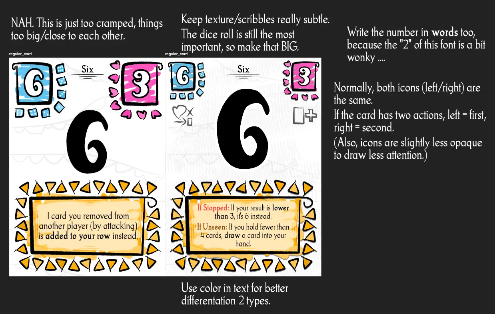
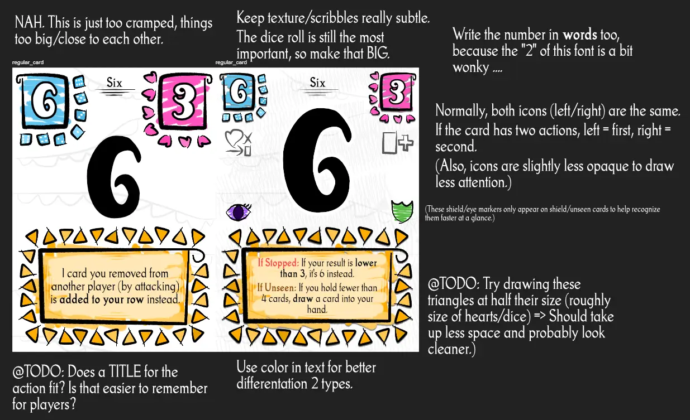
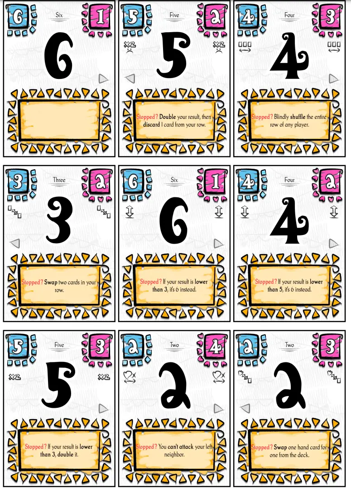

Welcome to the devlog for my game [Folly & Fortune](https://pandaqi.com/the-luck-legends/roll/folly-and-fortune/). 

This project is part of a series of games called The Luck Legends. Visit the devlog for the entire series if you just want a "summary" of the development behind this game. This article will be about the in-depth specifics, which problems I encountered, how I solved them, and any other interesting bits.

## What's the idea?

The idea behind this game was basically "what if we go in reverse? You start with a large die, but it only shrinks over time."

This quickly turned into a more specific implementation: "What if the card you rolled became _permanent_ every time?" 

In other words, you roll something, that card is now _removed_ from your die and becomes a permanent part of the board or your personal area or whatever. This automatically creates a nice and clear trajectory for a game.

* Start with all your cards.
* Lose one every turn.
* Until everyone has lost all their cards.

Of course, this is useless if the _order_ of losing cards doesn't matter. It should, somehow, be important _when_ a specific card becomes permanent and leaves your dice. The second rule of this idea immediately became that you **placed cards in a row**, and the order/direction (left to right) was crucial.

After some more brainstorming and testing, I arrived at a specific ruleset that I thought was simple yet effective.

* So, cards are placed in a row before you.
* You may (re-)roll as often as you have cards before you, while keeping track of how often you've rolled now ("counter")
* Why? After every roll, the card at position _counter_ determines some special effect or rule that applies to your roll.
* (Which is why the rule quickly changed to allow placing your new card either at the _start_ or _end_ of your row, to give you more influence over that fixed order.)

For example, the first time you roll, the special power of your _first_ card applies. The second time you roll (that turn), the special power of your _second_ card applies. And so forth.

The special powers of the cards might be simple things like "deduct 3 from your roll" or "if you roll higher than 4, your turn ends (no more rerolls)".

I thought this would balance itself: if you get a bad result, you _can_ roll more often. But ... this might mean rolling with some really bad special power at the end of it, adding a risk/reward system. Are you satisfied with that 3? Or do you want to try for higher, at the risk of getting 0 instead?

But what would be the objective? How would you actually _use_ this? Well, the simplest thing seemed to mimic a simple "attack/health" pattern.

* Whatever your final value, that's the damage you do to another player. (For example, you rolled a 4, the special power subtracted 2, so you now attack with strength 2.)
* Cards have health. If your damage exceeds a card's health, it's removed. (For example, that other player has a card with Health 1. Your attack is stronger, so remove that card.)

It seemed a very simple, streamlined way to close the game loop. You want _more cards_ so you get more rerolls; others _remove cards_ by attacking. All in all, the game just needs a tiny deck of cards and that's it.

Of course, if players keep adding and losing health, we can't end the game based on that. (If we say "the game ends when somebody has 0 health", then this can happen in the very first turn of the game. If we say "the game ends as soon as somebody has 10 health", we might never reach it, because players keep losing health before they get there!)

Instead, the simplest solution was just to make the game end once somebody has no die left. (They've made all their cards permanent at some point.)

The beauty of the system is that this _doesn't_ mean the very first player, and it _doesn't_ mean all their cards are before them now. Because you lose cards from attacks, and you might lose/gain cards from those special powers.

I don't really have a word for it. But the more I've designed games, the more I instinctively invent mechanics that follow very simple consistent rules which _also_ allow variation in every aspect of the game. In this case: your turn always executes with the same simple rules (roll, check special power, until you decide to stop and attack), but everything else can change for a myriad of reasons and give you a new challenge each time.

Anyway, one of the simplest games, which is also very well suited for playing with kids/large groups/casual gatherings, so it was one of the first I made.

## The fine details

The rules for this game were mostly finished now, so it was time to actually create the list of possible actions that could appear. All of these had to be simple actions that could either help or hinder you in specific circumstances.

To come up with that list, I always ask myself: what are the core elements of this game and how can we change/twist/manipulate them?

* The number you rolled ( = the "damage" your attack does). (Example: "Add +3 to the result.")
  * This is the **biggest thing** and should have the most actions associated with it.
  * Those actions should be extremely simple---see my example---to make the majority of the game simple to understand and calculate/play.
  * In general, this game is about how to make the most out of the thing you roll. As such, these actions should allow a low number to do lots of damage ... or a high number to end with a whimper, depending on circumstances and how well you played.
* _How_ you attack. (Example: an action that allows attacking two players at once.)
* The _content_ or _order_ of your row. (Example: double your result, but discard 1 card from your row.)
* The _content_ of your hand / die. (Example: subtract 3 from the result, but draw an extra card into your hand.)

This is enough to get ~15 different actions.

At that point, I realized I'd completely ignored the _health_ on cards. There isn't _one_ number on every card (the value you roll), no, there's two we can use!

I briefly considered streamlining this and making those values the same: **the card's number IS its health**.

This is a nice simplification, but it goes against the entire core of this game. This simplification would greatly unbalance the game, otherwise I would've kept it.

Why? Because a card with a _higher number_ is already stronger ( = it does more damage on attack), giving it _more health too_ would make it too overpowered.

Instead, it should precisely be the inverse: _higher numbers_ have _lower health_. This automatically balances all cards, so that players can start with any hand and not be considered (un)lucky.

I wondered if having 15 different actions in the base game was too much. They are, however, written on the cards and very simple. I couldn't find a clear category of actions to "leave out" (or move to an expansion), because all of them are interesting and provide more ways to play the game.

I decided to keep this list. The core rules of this game are so simple that a larger list of possible actions feels fine. Additionally, the rolling of dice adds so much randomness that I _want_ to give the players enough actions to combat this, otherwise it feels as if the game just plays itself.

Instead, I added a few "no action" cards. I _always forget this at first_! I'm so caught up in my special actions or cool card ideas, that I forget that the game would be much more approachable---especially for first-time players---if 20% of the cards were simply neutral and did nothing. Perhaps that's one big lesson or principle to always remember: "A good game should also be good if you remove all special cards or action variety, making stuff neutral or blank."

## Expansion

All my _most complicated actions_ (yes, I had way more ideas than just 15!) were moved to the expansion instead.

I identified four possible ways to trigger an action: 

* **IF STOPPED** (you stop your turn there and use this roll), 
* **IF REACHED** (you reached this card; regardless of what happened afterwards) 
* **IF PASSED** (you reached this card, then _continued_)
* **IF UNSEEN** (you never got to this card)

I decided that REACHED and PASSED were too similar to keep the distinction. Instead, I changed it to ...

> IF PASSED: you reached this card; its effect is _permanent_. (It stays with you from now on.)

This gave it a clear purpose, different from the other actions.

I briefly considered making all the actions from the base game "IF PASSED" (instead of "IF STOPPED", which they are now). But having powers be _permanent_ is simply more difficult to understand or calculate then having them be one-time (and only if you stop on that roll). And anything that's more difficult or takes more lines to explain, goes out of the base game!

The UNSEEN was a nice idea, but it gave me more and more headaches as I went on.

* If the UNSEEN powers are too strong or weak, it ruins the game. (Say you have an UNSEEN power on position 3. You simply never roll more than twice, so that you get this power _every turn_ for free, and it soon gets out of hand.)
* But if I change it to "you've reached here, but didn't roll for it" or some other variation, it becomes too convoluted to explain/use. (At some point, this was called UNUSED instead.)

The only way to balance it, I thought, was to make it a _double action_. In other words, an UNSEEN action is always combined with a second action (PASSED or STOPPED).

This changes so that it poses a slightly different question: "Do you want thing A (by stopping here/seeing this card) ... or thing B (by never reaching this far)?"

That's more balanced and more interesting. The UNSEEN powers are _weak_, but if you play it right, they can _accumulate_ (over not-seeing the card for many turns) into a big advantage. But I guess most players will be tempted to use the _other_ power of the card half the time, which softens the issue of power creep completely.

The biggest core addition in the expansion are the **shield powers**. I was tempted to add these to the base game, but if I merely "sprinkle" one or two shield cards in there ... the players who are lucky to get them just have too much of an advantage. No, it only works if shields are a full-fledged component of the game that anyone will likely access at some point.

The powers themselves are simple: they protect you against specific damage/attacks/moves from others until your next turn. (And you rotate the shield card sideways to remember this.)

If I don't add _too many_ of these---which would grind the game to a halt---they're a great and logical addition.

## Let's Make That!

Below are my sketches for the cards. For some reason, I have two images (v1 and v2), with seemingly very minor differences. But I'll show them both in case I forgot the reason my old self wanted two images.

As you see, I tried to use a cartoony, wonky, scribbly, outlined style. This inherently makes it a bit more messy and "busy", so I tried to balance it ...

* By keeping all cards the same white background
* And making the scribbles mostly solid colors
* And keeping the outlines all black (and not _too_ thick)

I think the end result might still be slightly too busy for some people, but it's the best I could do with this style.

The "place hearts around the shape" looked good and distinct, though, I so I did the same thing for the dice, and the orange triangles, and later in _all the visual design of this game_.

It was a bit of a chore to create 30+ icons for all the unique actions that can appear on cards (base game only has a few, but expansions add a lot). But I decided to do it anyway, because I could do it very quickly (the icons are just black lines) and it's just so much nicer than players having to rely on text only.

When moving that to the computer, I made a few more changes.

* There's a subtle white outline around the big black number => this sets it apart from the light gray background texture, which just makes it more readable and pop a bit more.
* I forgot to add the "arrow" (for an expansion/variant) to the cards here. I simply used one of those triangles (from the orange text box) and made that an arrow, then placed it left/right.
* Of course, the EYE/SHIELD icon now _obscured_ the arrow. In such a case, it's best to just simplify (instead of trying to put too much on the card): whenever a card has a special icon (SHIELD/UNSEEN), it just has _no arrow_.
* If a card has no action ... I just display no text. (That's much better than wasting pointless letters on "No action." or "Nothing special.")
* I changed the "action prefix" (the thing that is placed before each action to communicate its type) from "IF STOPPED" to just "Stopped?"
  * It's shorter, less screamy, and thanks to different coloring still recognizable.
  * I also shortened some other action texts to make them fit in the tight space. In general, everything can be written _with fewer words_. And you always want to pick the shorter option, even if it slightly changes the meaning of an action.
* And I decided to add that prefix _at all times_, even to the base game (where all cards are the same). It just looked more consistent. And the word ("Stopped?") explains when/how to use those actions, so it's actually a nice reminder for people playing the game for the first time.

This game required a lot of code and setup _behind the scenes_, but the actual game that players can see and hold is very simple. The material is simple to generate and display, you only need a few cards, and it's all consistent in look.

As such, I don't have much more to say here!

Below is an image of the final material.

## Conclusion

This is a bit of a weird one. I knew that when I started out, and the visual design kind of reflected that.

_Why did you make it then?_ Because weird doesn't mean bad. And because I try to create a varied "collection" of games. The other 6 Luck Legends games I made are all more traditional and "safe". I think it's always wise to have one or two completely different games in such a set. To provide the players with something fresh and exciting; to challenge myself and grow as a designer.

In the end, I'm actually surprised the game ended up as simple as it is. I feared that actions would need too much text, and that _two_ actions (UNSEEN + OTHER) would not fit. I feared the split between "number of card" and its "health" was an annoying extra step, but it really isn't.

Because all the complexity is in my code (and the text on cards), the actual rules for the game can be kept extremely simple and streamlined. The only downside, then, is that players need to be able to read English (somewhat well) to play the game.

Until the next devlog,

Pandaqi