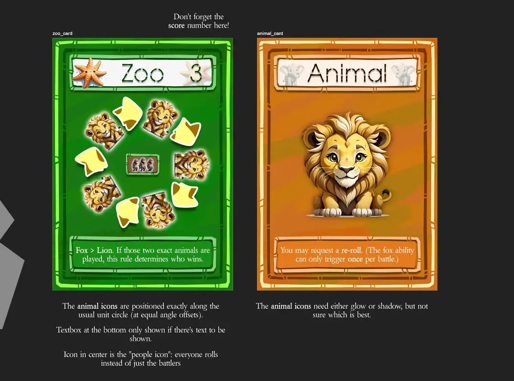
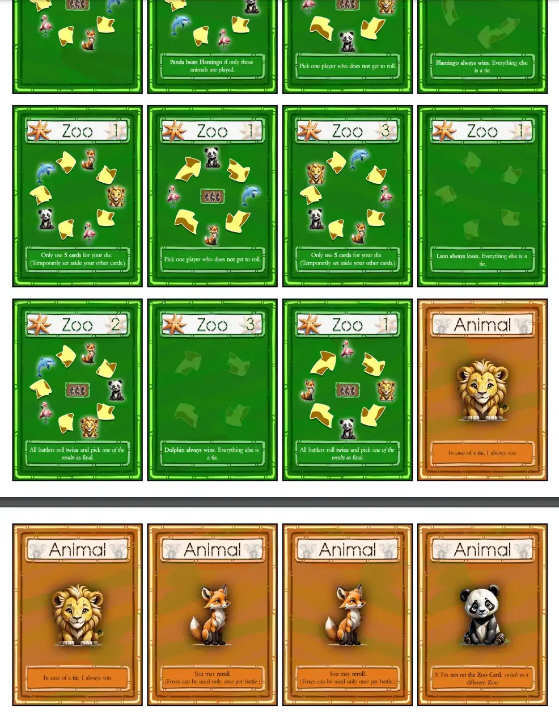

Welcome to the devlog for my game called [Lucky Lions](https://pandaqi.com/the-luck-legends/roll/lucky-lions/). It's part of the Luck Legends series, so visit that general devlog for a high-overview of every game and what the project is. This devlog will (briefly!) discuss the process and other interesting stories for this particular game.

## What's the idea?

Dice rolling games, or "compare numbers games" in general, have the issue of highest numbers always being better. Or, in some of my own games, the "extreme numbers" (highest or lowest) being better. If you're just lucky with your cards/dice, you have a much easier, maybe even boring game.

As such, most of those games have one or two "twists" to combat this. Best case scenario? You can actually _use_ this inherent randomness or unfairness to make the game more fun.

That's what I sought to do with this simple twist: instead of numbers on your "die", you have animals. And those animals have a "rock, paper, scissors" type relationship, like a cycle saying "Animal A > Animal B > Animal C > Animal A again".

The basic idea was as follows.

* All players get 6 cards with animals: their "die". (To "roll" it, simply shuffle and reveal a random card.)
* On your turn,
  * Pick a Zoo Card that shows this cycle (A > B > ...)
  * Pick an opponent to battle.
  * Both players roll their die.
  * Whoever rolled the "stronger" animal wins!

This is already a good start. Because of the cyclical relationships, no animal is inherently better or worse than another. Because you may _pick_ one yourself (from a few available cards), you get more agency and tactics.

I started work on the project with just this snippet of an idea. Doing that work, and specifying the idea, revealed a few more issues though.

* **What's the objective?** If you win the battle, you score the Zoo Card. (That seemed the simplest way to keep score without requiring extra material.)
* **What if it's a tie?** One player gets the zoo card, the other discards a card. Active player chooses. (Discarding a card might seem like a penalty, but it's actually a benefit. Because your die is smaller, you have far more certainty over the outcome of any roll!)
* **How can we involve other players?** I decided to create an _expansion_ where, if a Zoo Card shows a "people icon", _everyone_ rolls. If it ends up with a 3-way tie (or more), the active player simply decides which players get _nothing_.
* The game is called "Lucky Lions"---**should Lions be special or something?** No, I decided not to give _one_ animal special properties or rules to remember. That would create the issue again where you could get lucky, start with more lions than anyone else, bla bla.
  * Instead, I added another tiny expansion where _all_ animals have special powers. Lions perhaps have the best one, but that's debatable. It's simple things like: re-roll once, if a tie I win, etcetera.
  * Those power texts, however, only appear on those expansion cards. This reduces the complexity of the game, because all the base game animals are still powerless. Only once in a while will you roll a "special animal".

The biggest oversight by me, however, was that **cylical relationships obviously have no "winner"** :p

Let's say it's: "Animal A > Animal B > Animal C > Animal A"

One player rolls Animal B. The other rolls Animal A.

Well ... Animal A > Animal B, but if we look further down the cycle, we see that Animal B >> Animal A too!

In Rock, Paper, Scissors this is fixed by having the relationship not being "transitive". That is, only the two things directly compared matter. Animal B is _not_ better than Animal A, because Animal C is in-between and breaks that up.

How do we explain this very simply to players? I surely don't want to use words like "transitive" or an entire paragraph explaining this or comparing it to Rock, Paper, Scissors. Instead, let's just focusing on "gaps".

> The animal with the longest gap (on the cycle) to the other animal is the best.

In our example, the gap between Animal B and Animal A (following the cycle) is 0. They're right after each other.

The gap between Animal A and Animal B (following the cycle) is 1. Animal C is between them (in cycle order / clockwise order).

When visualized on the card, as an actual circle, this is very intuitive and easy to check.

With that fixed, the idea was finalized

## Let's make that!

### Generation

The code for generating this material was slightly more complicated than I initially expected.

* The different zoo cards have different sizes for the cycle. (One card might have _all_ animals on it, while another only has 3.)
* We need to make sure that, overall, the animals are fairly distributed. But within the zoo card itself, it needs to match the cycle size and be random. (We don't want to accidentally generate cards where LION is _always_ directly next to FOX.)

That wasn't too bad, however. All the other code simply meant going through a loop and adding all the animals X times.

### Drawing

I'd picked the fonts for this game a week or so ago, because I just happened to stumble across perfect ones. As I've stated many times before, locking in the fonts _early_ helps a great deal. Now I know what numbers and text will look like, and I can design the rest of the card to match that.

I purposely picked the animals to have different colors. The "missing" colors were brown and (dark) green, so that I could use those for card background and decorations.

Combining all of that into simple card designs, we get the following.

{}
I like minimalism in general. But I also find that having really involved or detailed visual designs for a really simple game ... just sets completely the wrong expectations / makes the wrong promises. People will naturally assume the game is a bit more difficult or detailed. As such, the simpler the game, the simpler I try to keep every part of the visuals.
{}

### Finalizing

I kept the game simple and low in requirements. This meant there wasn't much "finalizing" to do, as there wasn't much to fix and I hadn't left a pile of work (such as drawing a lot of icons for the expansion) for myself in the future :p

The game worked immediately. Understanding how cycles work/explaining them to players takes just a few more seconds than I'd like. But I'm a perfectionist when it comes to making my games _absolutely as simple as possible_, and really, it's not a big deal. You can literally see which animal beats another, and you can see which has the biggest gap right on the card. Throw in "it's like Rock, Paper, Scissors" and everyone gets it.

Of course, that simplicity means there isn't a huge amount of depth or tactical change. But there's more than enough. I feel the balance here between randomness/risk and tactics/informed choices is good here.

* You get to choose your Zoo Card. (Go for a high-scoring one that you're unlikely to win? Or a low-scoring one you're more certain about?)
* On ties, you get to choose how to resolve them. (Do I want points now? Or a less random/more certain dice?)
* Over time, you get to see all the cards in the dice of other players, giving you more and more information to make tactical plays.
* The two tiny expansions add extra spice and variety for those who want it, at very little cost.

I will suppress my urge to overcomplicate the game.

Here's a screenshot of the final material.

### Surprise Simulation!

I completely forgot that I have this really nice system now for interactive examples in my rulebooks. For games that are simple enough---and this one surely is---it doesn't take much to completely simulate the gameplay. Then I can provide fun interactive examples to learn from (for now players), but I can also reuse that code to let the computer play 10,000 games and give me some results.

Those results?

* **Average number of turns per game is 3.** (This is quite low because every turn is a _battle_ between players, so you're also often losing/gaining cards on _other_ player's turns. This actually feels like the perfect length for such a short/simple game.)
* **Probability for Ties is ~25%.** (This is fine too. Not too high, not too low. Especially because ties have an interesting rule for resolving them, I'm fine with 1 out of 4 battles ending like that.)
* On higher player counts, you could **run out of Zoo Cards** => I bumped up the number of Zoo Cards in the base game by 5 and this was completely gone.
* **Average number of hand cards (when doing a battle) is 5.** => This is fine too. Players are losing cards during the game, but not so many that they have only 1 or 2 left.
* **Average number of zoo cards (at the end) is 3.** => This is fine too. It means most players at least have a few Zoo Cards or are close to winning. (You need at least 4 to win, because you need 10 points and the max value per card is 3.)

So, yeah, a nice confirmation that the game seems balanced (after fixing the issue of too few zoo cards). 

I was mostly worried about the ties being too prominent. Because "animals not on the cycle" are all considered equal, and there are more than enough zoo cards with just 2 or 3 icons in the cycle (instead of all animals).

At first, this fear seemed correct: my simulation gave a 66% tie rate! Way too high! Fortunately, that was a bug :p

I had forgotten to implement the _second_ part of that rule "... but animals not on the cycle are always _worth less_ than those that ARE on it".

For such simple games, these simulations are a nice bonus and reality check, but I mostly write that code for the _interactive example_ in the rulebook.

## Conclusion

That's it! The second game for the Luck Legends done. I still love the Dice Deck mechanic as an alternative for dice rolls, so I'll try to get my other (slightly more involved) game ideas going quickly. (I have to take a break now to meet other deadlines, but will be back to boardgames in a few weeks, probably.)

Until the next devlog,

Pandaqi