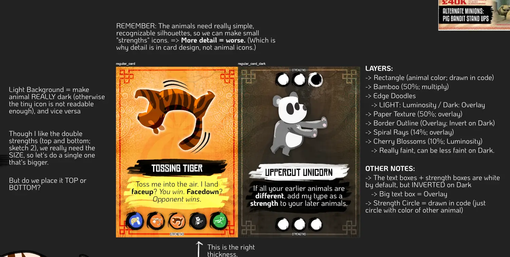
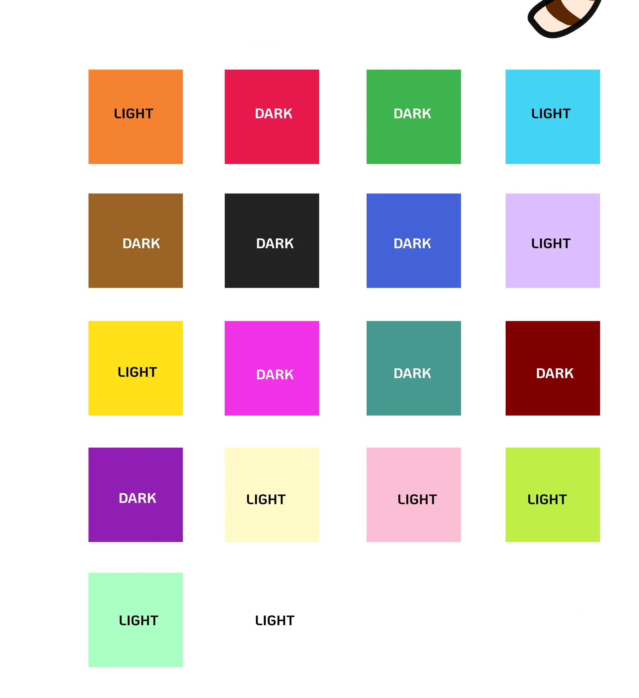
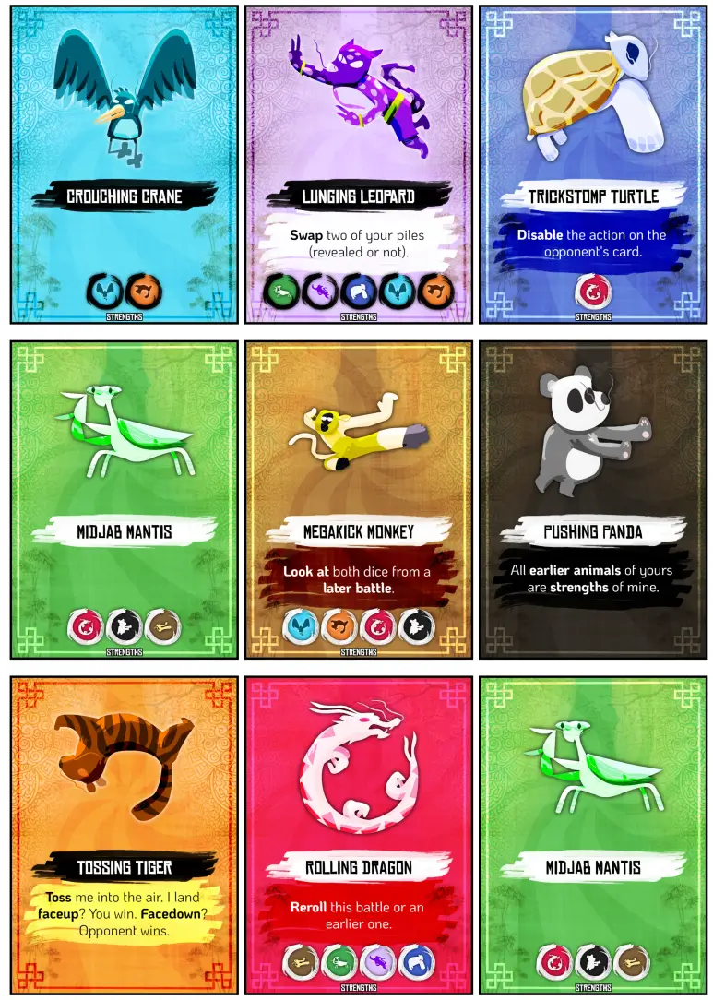
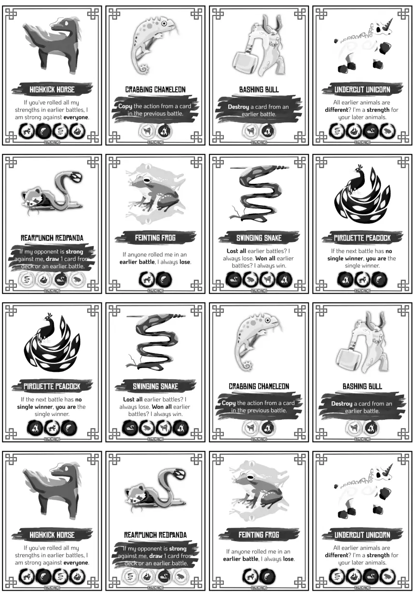
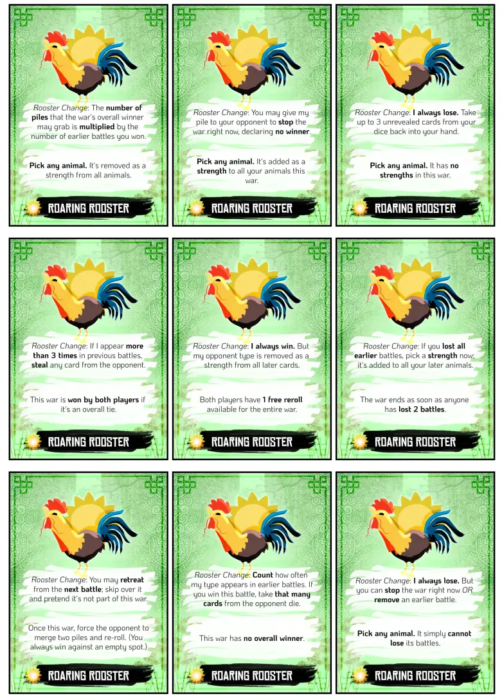

Welcome to the devlog for my game [Tossing Tiger, Rolling Dragon](https://pandaqi.com/the-luck-legends/roll/tossing-tiger-rolling-dragon/). 

This project is part of a series of games called The Luck Legends. Visit the devlog for the entire series if you just want a "summary" of the development behind this game. This article will be about the in-depth specifics, which problems I encountered, how I solved them, and any other interesting bits.

## What's the idea?

The title of this game is a play on the movie _Crouching Tiger, Hidden Dragon_. As usual, my ideas start with bad pun titles and I work my way forward from there.

Luckily, this one came together quite easily. The theme of martial arts made me think about auto-battlers (and rock paper scissors, again).

* Two players prepare a row of instructions or attacks.
* Then you simply execute the "battle" by stepping through those attacks in pairs, checking who wins each time.
* Until whoever won the most attacks wins the entire battle.

Instead of _numbers_ (or colors/suits) on your dice cards, I decided to switch it up and try **completely custom cards**. In other words, the cards in this game don't have numbers or some intrinsic order (of "high" and "low").

Instead, the deck consists of multiple different **attacking / defensive manoeuvers**. Or just "offensive / defensive moves", I guess.

Everything is strong against one thing, and weak against another. A kick might do a lot of damage against some non-defensive move, but if the opponent rolled a hook, they grab your feet and you damage yourself with your kick :p

At least, that was the idea.

* Players build their decks with moves.
* On their turn, they split that deck into smaller dice and roll them all. (You may look at what you put inside each die!)
* Then you and your opponent reveal, and you compare each set of dice (one from you, one from the opponent, next to each other) to see who wins.

At first, I wanted to only reward you for winning the _entire battle_. In practice, however, this made it very unsatisfying if the battle was close, and it made you feel as if you were powerless or parts of a battle were "worthless". (Maybe you already know you had lost after 4 checks, so why even do the remaining 3?)

I changed it to be more granular.

* For every battle you win, you grab 1 card from the dice the opponent used. (If it's very close, both players will walk away with _some_ reward or change from that event.)
* But for winning the _entire battle_ (majority of pairs go in your favor), you get an extra bonus: you grab/win _one entire die_ from the opponent. (You get to decide how many "dice" to break your deck into. So you have full control over risk/reward here.)

I knew this was a strong setup for a game, but I also wrote down a note (before going to bed) that I needed a few things to spice it up: "WE NEED simple ways to customize your deck + restrict what the opponent can do + provide limited choices _while_ auto-battling."

The next morning, I researched simple ways to include this.

* CHOICES = some cards simply have a special way of resolving their battle that still gives you a choice. 
  * (For example, a card that says "If you think you will lose the next battle, retreat and skip over it." or "You may purposely lose this battle to pretend you won an earlier one.")
  * At this point, I started using the distinction between "battle" (comparing two dice rolls) and "war" (the entire collection of fights this turn).
* RESTRICT = you already restrict the opponent somewhat by picking the number of dice. But let's kill two birds with one stone and use special moves for this too: "The attacker may decide to play a faceup card for the very first battle (instead of rolling a die). The rule of this card will be true for this entire war."
  * There are only a few cards that even have an action to restrict the entire war, so this can't be overused.
  * At the same time, giving away this information basically assures your opponent will win that first battle, giving them a pretty big edge. Balanced, I hope.
* CUSTOMIZE = when "grabbing" a card, it doesn't just automatically (always!) go into your hand. Instead, for every card won during a war, you may decide to discard it instead.
  * This is a very simple way to keep your deck the size you want and be somewhat in control of _what_ cards are in there.

I liked this, which is why this was also one of the earliest games I made, despite requiring a bit more illustrations/work by me.

The entire material consists of the same "martial art moves" (which are just animals in funny positions on cards). Yet with that simple core, we get a lot of interesting and tactical battles, with the randomness of dice rolls thrown in. Because most animals use that rock-paper-scissors cycle (they're strong against A, but weak against B), your starting hand is never "better" or "worse" than that of another player.

Finally, I added a slight variant that allows simultaneous fighting: one team against another, everyone is always active. I know that some people, especially young children, benefit a lot from a game that's not turn-based but that _always_ keeps their attention and allows them to do something. I also know that this isn't the best version for this particular game, and requires some extra rules, which is why it's _not_ the base game version.

{}
One thing I'm glossing over at this point is the fact that the issue of "too much randomness / too little strategy" is automatically mitigated in all these Luck Legends games. Because the more turns someone takes---the more they roll their die---the more information you have about what they have exactly. 

As such, over time, as the number of cards grows larger ... you also have a much clearer idea about what every opponent COULD roll, and how LIKELY that is. As such, these games don't really need extra rules or mechanisms to fight "too much randomness".
{}

## The fine details

### Simplifying actions

Once I had the first version of the ruleset, it was time to actually write the code to generate the specific material. This includes all the specific actions and weaknesses of all the cards.

And as usual, that's when you hit a few more practical issues.

For an interesting, balanced base game, I felt I needed at least 10 different actions/animals. 

But ... that's a lot. 

Sure, it might look nice to have all these different animals. After that initial excitement wears off, as is my experience, players are just overwhelmed, keep forgetting what animals there are and what they do, and it's just _too much_ for a first game.

If we need to show the _weakness_ of every animal on the card too, this can get messy real quick. (Imagine an animal that has a special _action_ AND needs to show a weakness icon for, like, _6 other animals_.)

Additionally, I didn't want to do this manually. I wanted the computer to randomly assign the weaknesses in a fair way when you click that button to generate material.

_Why_?

* More flexible. If it turns out to be unbalanced (or there's some other issue), I merely need to tweak one number or one setting, instead of recalibrating---by hand---all the data for all animals everywhere.
* I like surprise and variation. If I can make a game playable with randomized material (within certain bounds, of course), I see that as a plus. It means that everyone who generated my game literally has _a different game_ with slightly different values and possible play styles.

As such, I decided to do the following.

* The base game only has 8 animals. Some of them have _no action_, others have a consistent action (that is, the same animal always has the same action).
* The expansion has 8 more animals. These are new animals; not present in the base game.
* Another expansion (the Dawndojo) has whatever animals remain. This is fine, because these cards "always lose". (They have a power so nice that they always lose their individual battle, to balance it.) This means I don't need to show them as a weakness, ever.

Crucially, this means the weaknesses are generated _separately_ for the base game and expansion. An animal for the base game can't be weak to one from the expansion, because the code simply doesn't consider them.

* ADVANTAGE: This reduces the number of icons on a card to at most 4, maybe 5.
* ADVANTAGE: It simplifies the code and streamlines the gameplay for players.
* DISADVANTAGE: Well ... there's little interaction between base game and expansion now, being completely separated.
  * SOLUTION: We give the expansion all my ideas for actions that resolve battles in a different way. For example, actions that say "You may decide to lose this battle, in return for reward X" => This allows battles between _base game animals_ and _expansion animals_ to still be interesting, because both can still win or lose.

### Generating weaknesses

So, how do we generate weaknesses specifically? Below is a high-level overview of such an algorithm.

* First, we determine a distribution for _how many_ weaknesses. For example: 50% of animals have 2 weaknesses, 50% have 3.
* Then we calculate how many weaknesses we need _in total_. In the case of 8 animals, this would mean: 4 * 2 + 4 * 3 = 20
* Now we create a list of animal types.
  * As long as the size of this list is _smaller_ than our total number (20) ...
  * Add the full list of options ( = each animal once) in a random order.
* Having this list, we can simply step through and assign parts of it.
  * For every animal ...
  * Grab the next 2 or 3 weaknesses from that big list. (Depending on that number at the very start.)
  * (It's absolutely fine to be weak against yourself. Simplifies code, rules and gameplay.)
  * Save that as the weaknesses for this type.

This guarantees a ~95% fair distribution.

* Because we step through the list, we guarantee we get no duplicates.
* Because we created the list by adding every type equally often, they'll all be part of a weakness equally often too.*
* Because it's all randomized, literally any distribution of weaknesses can occur.

That tiny asterisk (*) there is because, if you've been paying attention, you'll have noticed that we don't actually use the full list. In our example, we have 8 animals and 20 weaknesses needed. But ... 8 doesn't fit into 20, so our list instead has length 24, and we miss out on 4 weaknesses.

I am fine with this. It just means one or two animals appear _one less time_, which does not mess with the game's balance or playability in any significant way.

### Let's turn weak into strong

At this point, I flipped the terminology around. Instead, animals save the type they are **strong** against. Why?

* It's a shorter word. And its aggressive nature fits the general theme/rules of this game better.
* In games, in general, you want to think from the perspective of the one _doing something_. Not the one _being the victim_ or on the _receiving end of an action_.
  * When phrased as weakness, it means a player must first look at their animal, then the opponent animal, then back again to see if the _opponent hits them_.
  * When phrased as strong, a player just looks at their animal, then the opponent, and they know if they attack or not. It's _active_. It's more natural.

Might seem like a silly thing, but it really matters in my experience.

### Dawndojo repurposed

As I was putting my ideas for actions into the final curated list, I realized that I'd completely forgotten the **most interesting and important type of action**. Namely, one that cares about the _order_ in which the war takes place.

Without that, it really doesn't matter much in what order you place your piles. Which is a shame, because it's a missed opportunity, and it's just not thematic. (In a real fight, the order/sequence of your moves obviously matters a lot.)

Examples of such actions are:
* "If the next battle has no single winner, you are the single winner."
* "If you've lost 2 battles (before me), I am demotivated and always lose."

Hopefully you can see how much more useful and interesting this is. Now it matters how you plan your series of dice, because the result of an earlier one might be crucial to pull off a later one. (When I realized this, I instantly knew all my previous work was down the drain and wrote in my notes _THIS IS THE WAY_ :p)

This meant my original plan for which actions to include (base or expansion) went out the window. Looking at my newfound ideas, I realized many of my old action ideas were a bit ... meh?

No, not exactly "meh", but simply _limited_. I looked at it for a while and then realized: I can easily repurpose those old action ideas as _Dawndojo_ cards.

For example, one of the actions I intended to place on an _animal_ was: "You _may_ lose this battle to pretend you won an earlier one."

We can rephrase that to: "Once this war, you may lose a battle to pretend you won an earlier one."

Now we can just make it one of the options that can appear on the "Dawn" cards. (As a reminder, this a special expansion with cards that you can only play before the war starts. And if you do, they contain some rule that applies to the _overall war_ that's about to come.)

I could fit in many of my interesting ideas this way, without overcomplicating any rules or adding too many animals.

As expected, actions that care about _order_ or _sequence_ of moves became far more prevalent in the base game.

### The 3 Principles of Good Actions

Finally, this led me to three "principles" for good and simple actions.

* **The action should not be worthless if it appears multiple times.** (For example: "The opponent loses every battle where both players played the same card" is a nice idea, but rolling more than 1 of these is ... useless now. You can only toggle that on _once_. And toggling it on/off with each instance is too convoluted.)
  * I think this one is obvious. We don't want a card to be dead weight if it's already appeared once and now it just keeps appearing with ... no consequence at all.
* **Keep a good balance between CHOICE cards and AUTO cards.** (A little over half the cards should have an effect that happens automatically. The rest should allow the player to make some sort of choice.)
  * Having too many choice cards slows down the game too much _and_ makes it really hard to remember what you choose. It also makes the events so unpredictable as to be nearly random.
  * But having too little removes the most interesting actions and agency while executing a war.
* **The choice cards should not allow picking something freely / unmarked.** In other words, you should be able to reconstruct or remember the choice made easily from the card itself or those around it.
  * A card like "Pick any animal. It's now a strength on all your cards." is nice ... but very hard to remember. Especially if this one appears multiple times in a war and people keep picking different things. It's just too hard, too convoluted.
  * Instead, change that to something like "_This animal_ is now a strength on all your cards." No need to remember anything. You can check how the war resolves by just reading the card again.

These principles showed me the way to the ~10 actions for the base game and expansions. The simplest, most effective, most fun ones.

Everything else? Yes, I still had some interesting actions left that I'd love to include, but they didn't hit the three principles. That means they were a little harder to remember or understand, and the game would slow down too much if those actions appeared too frequently.

I came up with the idea to add one more animal that is a "blank slate". It has no action by default, _but_ the Rooster cards (from Dawndojo) can say "That animal now has action X for this round!" This way, we don't add way more animals (we already have more than enough!), and those more convoluted actions can never appear too often or even together in the same war.

A great idea, but I soon realized I could simplify it even further---the Rooster itself could be the blank slate! And so I moved about 10 actions onto a Dawndojo card that simply says: "Any other Rooster played this round will have action X"

This also neatly solved another issue (pretty much the final major thing this game needed), which was that Rooster cards were "dead weight" (again ...) if you're not the attacking player. Because then you can't play them at the start---to modify the entire war---and just always lose with them.

Now that the Rooster _can_, sometimes, have an action, they actually become useful and unique.

### But wait! Again!

After doing this, however, I realized the Rooster now has _way more cards_ than any other animal. If I included this expansion, it would severely overcrowd all the others. (The other animals appear 6--8 times. The rooster ~18 times at the moment I realized that.)

Then I noticed the number of "Rooster Change" entries (that add an action to the Rooster just for that round) ... was roughly equal to the number of "War Change" actions.

So why not combine them? I divided the list into two (based on those two categories I just listed), and now every Rooster card picks one entry from both lists.

This means that ...

* They only appear ~10 times in the deck.
* But by adding such a card at the start, you not only put some twist on this war, you _also_ give an action to all Roosters (both yours and your opponent's).
* This makes all these cards more interesting by default _and_ pretty much ensures the Rooster is doing something too each round. (But it's a different action each time, from my list of actions that are "interesting but not good enough/balanced enough for the base game")

This finally shrank the list of actions and possibilities to a very balanced, manageable space. All animals appear roughly equally often, are roughly equally valuable, and in the base game a few animals have _no action_ while the others have simple _one-liner actions_.

After all that, I realized there's no reason to go turn-based anymore :p

Why wouldn't players be allowed to wage war simultaneously? There's no interaction "between wars", so to speak. The only issue, of course, is that simultaneous turns are hard for a _first game_. Because players don't know the rules yet, so they might accidentally cheat, or wait their turn anyway for you to explain what icon X meant again.

As such, I provided two variants (one team-based, one without needing extra material or rules) for _simultaneous warring_. And the rulebook recommends, at the start, to use those once familiar with the game. Because nobody likes waiting on their turn, especially when it's not needed.

{}
Also, the expansion has a much higher percentage of "automatic" actions than "choice" actions. When testing the game, it was just too overwhelming and made wars too slow if everything was put to a choice. Really, your major choices come from _before_ and _after_ the war, not during. Additionally, it made the action text too long if everything had to be phrased as a choice or an "either/or". In the end, simplicity is more important than giving the player loads of choices.
{}

## Let's Make That!

Well, that heading is perhaps a bit wrong now. We've already "made" 70+% of the game now, just by trying to write the specific text and properties of all animals/actions into a big dictionary on my website.

I also already explained the main part of the algorithm that randomly assigns the card's properties.

Really, all that's left to do is connect the dots and then create the _visual design_.

I say that as if it's nothing, which is ironic, because this is the game that received by far the most attention to the visuals. I "picked" this game---because of its theme, and because I believed in its gameplay the most---to go all out with my visual design.

The templates of the cards have loads of layers. I drew all the animals myself, both textured/shadowed/detailed and simplified. I stole nice patterns and textures from loads of references, such as Kung Fu Panda :p

Below are sketches of that process. And my grid of colors, and whether they should have a LIGHT or DARK template over them (for maximum contrast).

Because of my attention to detail here, this didn't really change anymore when moving to the final version on my website.

* I merely made some things slightly bigger/smaller. Mostly the _strengths_, as they should really be easily recognizable.
* I nudged a few colors for clearer contrast. The peacock was the biggest issue---it used to be dark, now it's a mix between light and dark :p
* I rewrote a lot of actions to be _shorter_, so they'd fit on every card despite having quite a large font size.
* I sunk a bit more time into the inkfriendly versions. This game is _so detailed_ that it has a **huge file size** and might overwhelm some players, so I provide a clean black-and-white version that looks just as good.
  * The base game material, despite being only 6 pages, is 50+ MB (megabytes in file size).
  * For reference, my previous largest game, which also nearly broke my computer at the time (I remember), was 25 MB.

Below are some images of the final material.

As I said, I really went all out on this design. Lots of layers, textures, nice little details, finetuning and nitpicking colors. And it shows.

In some ways, this is a bit annoying, because it makes me feel guilty about half-assing some other designs. It could look _so much prettier_ if I invested the same time in every design!

At the same time, I _know_ I don't have time and energy for that. And some ideas are simply less good, or have less depth, and creating some crazy visual design for it is just a waste and sends the wrong message.

In this game, the depth of the game itself + richness of theme + my motivation to challenge myself (in terms of graphic design) just aligned perfectly.

Now let's hope that game itself holds up to scrutiny :p

## Conclusion

As is often the case, the ideas weren't the issue here. I had _too many_ ideas and I spent most of the time simplifying, cutting, finding what was truly necessary, especially for a simple base game.

But that was fine, really, because I knew the core game loop was so promising. I was more afraid of overcomplicating it (and ruining it that way) than, erm, undercomplicating it?

In the end, the cards look _really nice_, the game rules are _really simple_, and the animal actions are short enough to fit on those cards in large font sizes. I think the game has tremendous depth (both in gameplay and visuals), while looking fun and approachable.

I think I was right to pick this game as my "go all out, make this the best one". Let's hope others agree. 

As usual, this doesn't mean I think the game is perfect, and I'll likely tweak things later after more feedback/playtests come in. I am very limited in how much I can test the games myself, so I'm always prepared to launch games "good enough" and perhaps update later. It's one of the downsides of doing all this for free, without any proper support or tools.

But oh well, if I look at this game, I can only see a very professional and polished card game, and I'm proud of myself.

**Also,** not sure when this happened, but all the Luck Legends games (so far) have been completely free of AI. Many of my games before then used generative AI to get the big detailed illustrations---and most games need those---but for some reason, I decided I had enough of that and went back to doing things 100% myself for the Luck Legends. 

Yes, it was a bit of a chore to draw 20+ animals myself, in a specific style, with shadows and all. I spread it out over 3 days, only working on it in the early morning. But the game looks very cohesive now, I learned a lot from it, and I can say I made another game without the help of AI.

Until the next devlog,

Pandaqi