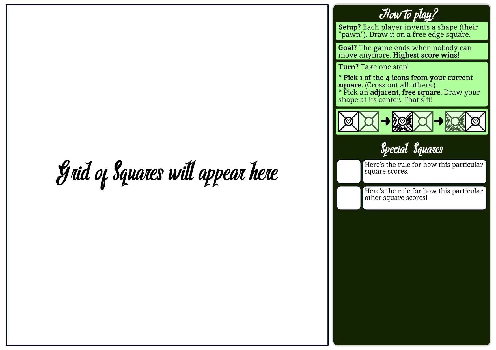
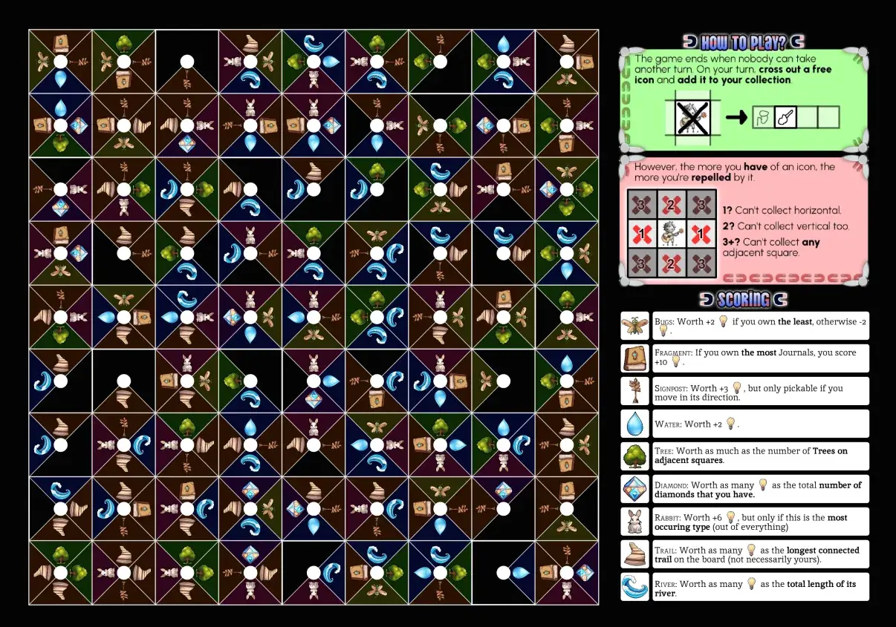
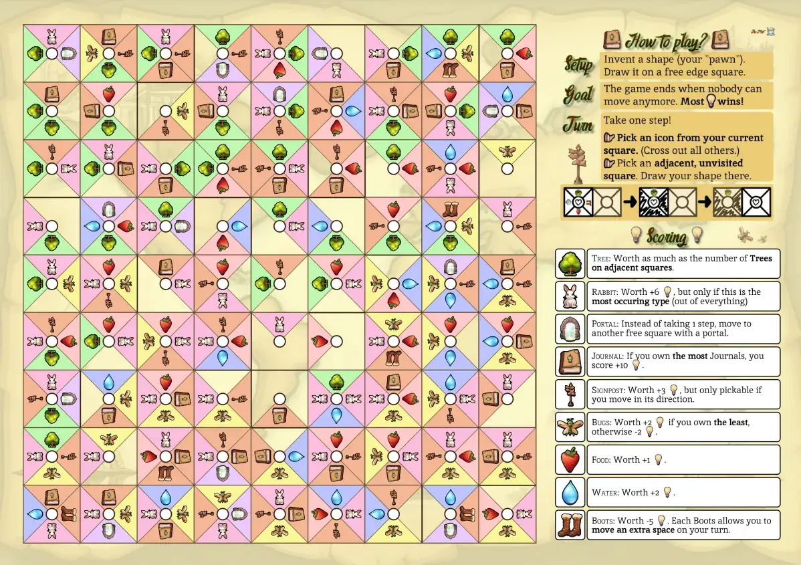
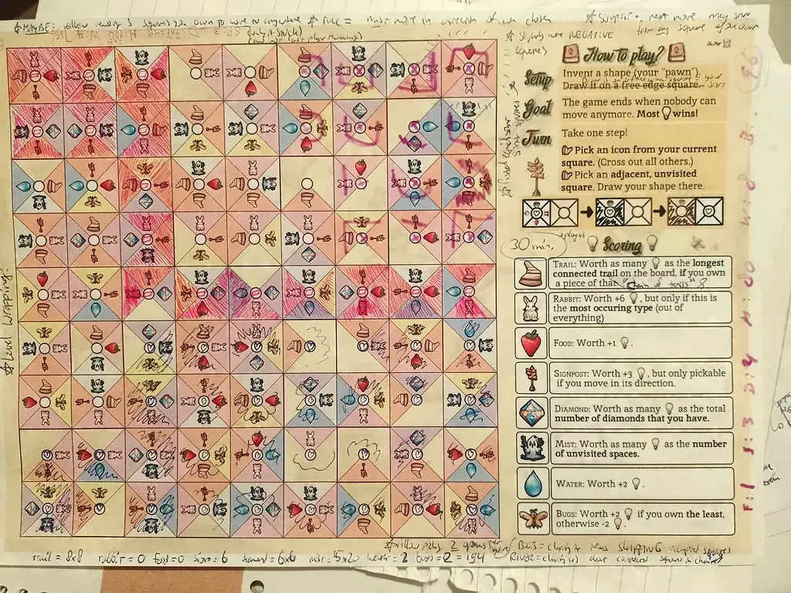

Welcome to the devlog ("developer diary") for my game [The Mist](https://pandaqi.com/the-mist/).

This article will explain the process behind the creation, the problems I faced, interesting lessons, and more. It will be a rather _short_ devlog (relatively speaking, at least), because this was a very small project that I basically made "on the side".

## What's the idea?
I'm always looking for ways to make games even simpler and more accessible. 

Recently, I had several ideas for this. ([Magnetmen](https://pandaqi.com/blog/boardgames/magnetmen/) being another one that'll probably have released before this one.)

This was the "second best idea" I had, in my eyes. 

It's based on something that sounds difficult, but really isn't: superposition (from quantum physics). Nevertheless, because it _sounds_ difficult, I decided to stay away from that word and any science-related theme, and just theme this game as a (jungle) exploration game.

What's the idea?
* All squares on the board start with 4 icons. (They are, currently, all 4 things at the same time.)
* Every turn, you take one step. (You start at the edge.)
* When you do, you pick _one_ icon from your previous square. (In other words, when leaving a square, you _choose_ which of the 4 things it actually is.)

Over time, this means the board "collapses" from all its possibilities ... into one where most (or all) squares are actually, permanently fixed into one thing. (Basically a wave collapse algorithm, in board game form. If that means anything to you.)

That's ... the whole game. (See what I mean about making games simpler and simpler?)

* You have plenty meaningful decisions. (Where to move; and which icon to choose of the 4 options when leaving.)
* There's extremely high interaction. (The decisions that _other_ players make---which types they collapse into---changes your potential moves or score over time.)
* You are in control and have full information. (No luck, randomness, separate sheet with rules needed, etcetera.)
* It truly feels like an unexplored area slowly comes into focus and is explored.
* And all of that with extremely simple rules!

It sounded like a winner to me.

At first, the working title was "Quantum Quest". Which, honestly, is a fine title, but I don't want people to make the wrong assumptions about the game. 

So I pivoted towards the following: you're explorers going through a landscape covered in _mist_. That's why all squares are currently "4 possibilities", and you can only know what each square is once you visit it :)

Hence, **The Mist**.

## Let's make that
Just like Magnetmen, this is a quick side project just to take a break from the bigger ones. I pushed all doubts aside and just _made it_ with whatever came to mind.

{}
If I design the rules well, this game might actually simulate "wave collapse" really well. That's an algorithm used in video games to randomly generate a sensible, organic landscape. This game basically models it already with its core rules---if I add smart square types, you might end up with a pretty landscape at the end of the game!
{}

I already had the fonts. (Once in a while, I research fonts for a new project, and then I push any unused fonts to upcoming projects. That's how my next 10 projects often already have their fonts selected :) )

It's a One Paper Game, so we're limited to one paper. One side will be the board, the other side is a "sidebar" containing the tutorial for the game.

Each square needs one icon on all the four sides, and one big circle in the center (for drawing your player icon, to keep track where you're moving).

And that's really all we need.

Below is a very rudimentary sketch.

### Cell Types
I can't really say much about this. I simply brainstorm all possible ways you might _score_ in such a game. All useful _actions_ you might want to take, either to help yourself or hinder opponents.

That results in a HUGE list.

I combine things that are similar. I remove things that seem too weak or rare, or too hard to explain. (Remember that _all_ the rules are on the paper itself, so any power that needs more than 10 words for the explanation is already danger territory.)

I rely on my experience creating powers/abilities for 50+ games already. Just a gut feeling that says "this might lead to confusion" or "meh this doesn't seem _fun_".

Whatever's left is good enough to ...
* Add into the data. (Each of these games has one big code file with _all_ powers that can appear, tagged with all sorts of things to ensure a balanced generation. And, of course, a way to know which image to display.)
* And turn into an illustration.

Let's talk about that second point now.

### Graphics
I researched some styles that give off that jungle, exploration, safari vibe. But also styles that are a bit more dark, gloomy, threatening. Deeper shadows and sharper lighting---not just happy, cartoony, colorful icons. (We're exploring an area covered in mist, after all.)

Then I asked an old version of Stable Diffusion (the only one I could find that had enough free credits for this project) to create those images. 

{}
Yes, yes, one day I am able to afford a new computer that actually works and can do graphical work offline. Opening illustration software and making _edits_ is already a tough sell for my broken laptop.
{}

### Sets
As always, it's too overwhelming to dump _all possible squares_ onto the player at once. Even with rules on the board,
* Some squares are simply more vital than others.
* Some are simpler (or need fewer words to explain them) than others.
* Some can only be understood well if you've played the game a few times and see the strategy behind them.

On the other hand, for me---the developer---it's also overwhelming to work on 20 or 30 possible squares at once.

That's why I usually break it down into smaller sets. Sets that are handpicked and balanced with themselves.

In this case, I noticed a few global types of actions.
* **Scoring**: these simply score points, potentially based on some other condition.
* **Terraforming**: these are nature elements that shape the board into a somewhat organic map over time. (You're encouraged to use them by getting points.)
* **Movement**: these change how you or other players can _move_. (As moving is _the only thing you do in this game_, it deserves to be in its own category.)
* **Action**: any other type of action, usually with a point penalty to "pay" for it.

As expected, each set should be a mix of all types.

### Finishing Touches
At some point, I wanted to make the _edge_ squares of the board empty. To clearly signal that you _enter_ the game from there. (They were also called entrances/exits in the rules.)

But that just seemed unnecessarily complicated. The phrase "you start at a square on the edge" seems clear to me. Making the whole board consistent is also worth a lot.

Similarly, the original rules (or perhaps a "variation") changed the order.
* You move first.
* Then pick one correct icon on your new square.

This intuitively makes more sense, but it leads to one major issue: **you don't know where you are**. Your "current location" isn't clearly defined, because your player icon will be drawn in _all the tiles you visited thus far_.

By switching the order, you now know: I am at the one tile showing my player icon which still has all its icons. (Because you only pick one upon _leaving_.)

This may seem a minor thing. But this actually solves one of the biggest issues plaguing my One Paper Games so far. I always have to find a solution for "moving pawns" (in an easy, fast, clear way). 

The more I work on the game, the more I confirm that this switched order is far better for the game.

Also, you can score by simply tracing the path you walked---looking at all squares with your player icon inside. This also solves a recurring challenge with One Paper Games: how to keep track of permanent data such as score or things collected.

In other games (such as Magnetmen), I had to add an "inventory" to the edge of the board. (Each player has a strip of empty squares in which they write/draw permanent progress). But that takes space, looks less appealing, and quickly feels overwhelming.

I decided to design the game in such a way that I can completely remove all of that. It's just a board (with consistent, uniform squares) + the rules to the side.

I think that covers everything. Let's test!

### Balanced generation
The generator for this game is basically a copy of the one for Magnetmen, with a few things swapped behind the scenes. (I turned some parts of the code into reusable modules, but otherwise don't want to optimize prematurely. I'm fine with a few lines of copied code between projects.)

Not much interesting there. The rules of the game allow mostly random generation, without much tweaking from my end.

That said, there is always SOME tweaking needed to keep random generation within limits. (Or to simply create nicer board that automatically lead to better games.)

First of all, **no duplicates on cells**. It's pretty pointless if a cell has multiple icons of the same type. (With the exception of a few icons for which the placement matters.)

Secondly, **terraforming types should flood fill**. What does that mean? Well, 
* While the board is still empty, we place all terraforming squares _first_.
* For each one, we pick a few random starting locations, and then "grow" from there. (That's where _flood fill_ comes from.)
* This means we automatically create groups or chains of these types, which makes them more useful. (For example, the river scores for how _long_ it is. If there are barely any river tiles next to other river tiles, then this whole square becomes pointless for that game.)

I did make a distinction between _flood fill_ (create a group going in all directions) and _chains_ (more like a random walk through the board, with a clear beginning or end). Some types like the first one better, some the second.

Thirdly, I use a "template" when picking my random types that _could_ appear on the board. In other words,
* It picks _one_ random square for each main category (score, terraform, ...)
* Whatever space is left, is filled randomly.

This ensures that the nice distribution of special powers actually comes through in the board. We never end up with a board that's only terraforming tiles, or that has no tiles that actually score points.

With all that done, I only have to set some thresholds for each type (their probability of appearing + a hard minimum or maximum, if needed), and generation is done.

### A side note about my systems
When I just started creating games on websites, I had no clue how to do it. I used the only framework I knew (and which seemed popular and well-supported), which was Phaser.

That's why, for all these years, the Phaser framework was built into all those "random board generators" I coded. 
* Every single one of those games had to _load_ the entire library, which is easily a few megabytes.
* I had to work around the limitations and unsupported features all the time.
* While requiring glue code to "plug" my generated board into a Phaser instance to draw it.

It was just overkill, and messy, and slow. Since then, I've created my own functions and systems for drawing and generating stuff on the web. 

For months now, I've slowly been switching over.

First, I replaced all direct calls to phaser (`this.game.dosomething`) with a layer in between (`imageToPhaser(imageResource)`). This layer decoupled my systems and let me see if my ideas worked or where I needed to find a cleaner API. Many of the older games already use this.

With this game, I've finally made the second step (for the first time): Phaser isn't involved at all and I use my own code directly, on a blank canvas. This was easy to do now, because I already decoupled the systems and could just replace that "middle-layer" with direct calls to my own system.

To my players/visitors, there's no difference, except a significant speed upgrade. 

{}
Although, in some cases it became considerably slower. So there's probably some stupid unoptimized thing I'm doing at the moment.
{}

But the code for this game is _much_ simpler and cleaner behind the scenes.

Writing this entire section might seem overkill for such a simple change in my code. But that's the downside of creating things for a long time, which are supposed to _exist_ for a long time: you accumulate technical baggage.

If I were to start now, I obviously wouldn't have used Phaser and wouldn't have integrated it so tightly (into my website) that I was barely able to get rid of it. But I didn't start now: I started ten years ago and still have projects from that period that need to stay working.

That's why my website can basically be divided into three parts.
* "The previous system": whatever is needed to support an older, worse system I used.
* "Middle layer": temporary solutions to transition to the new system.
* "The new system": my current, best, most modern solution used in the most recent projects

No matter how many times I upgrade the website and improve as a programmer, this division _persists_. Because once you've made that better system ... you already see the flaws, or have a new project with _different_ requirements, and the cycle repeats.

{}
This also means you should send me an email if you find something broken in my games. There's a good chance it broke because of a minor upgrade to a better API behind the scenes---which means I have no clue this one tiny thing broke, but also that it's easily fixable.
{}

### A note about board legibility
One of the recurring challenges with One Paper Games is the fact that, well, we only have _one paper_. It's hard to keep things legible and easy to parse, let alone _good looking_, at such small sizes or cramped spaces.

As such, the following cycle repeated itself several times.
* Let's see what the boards look like now.
* Ugh. Don't like this. The icons have too little contrast and fade into the background, while the rest of the paper is one solid color.
* Let's add some more details/texture to the board, and let's add a thicker outline/shadow around the icons!

For example, look at one of these very early boards. I tried to make the background almost entirely _dark_, just to make the icons stand out more. (Needless to say, this didn't look great _and_ it would've been murder on your ink cartridges.)

Now compare that to the (mostly final) version. It has bright colors. The icons have a _much_ thicker outline and shadow to make them pop. (I also increased contrast and brightness for many of them, with a filter of the same name in my graphics software.) 

There's a slight _world map_ texture behind the whole thing, just enough to make it look way more polished. Such polishing steps always take way longer than I want, but they do pay off in the end.

## Playtesting
So I created some boards, printed them, and tested the game.

The results? As always, **some good stuff, some bad stuff**.

The good thing is that the game, in general, works and is very easy to teach and play.

The bad thing is that it's not great at the moment.

Below is an image of the very first test game. 

### Problem 1
**Problem 1: Too much freedom.** You can always walk to any (free) adjacent square. This means that players quickly learn to just "snake" across the board: you move to the other players as quickly as possible to "cut off" your chunk of the board. Once done, you just finish the game by collecting all squares in your chunk (which nobody else can reach).

This is the most boring and predictable way the game could play out. It makes the choice of which icon you pick somewhat irrelevant, because each square usually has 2 or 3 "fine" choices, and you can move anywhere anyway!

**Solution 1: You must move in the direction of the icon you chose.** As stated earlier, I was already playing around with this idea. But I prefer more loose/free rules for a first prototype---if they work, they are simpler, if they don't work, I can always try the stricter rule _later_.

With this rule, you can't move around willy-nilly. You have to _choose_ between "is picking this icon worth more than potentially getting myself stuck when moving that way?" You can't have everything, because the icon you pick also determines the way you must go.

Another nicety is that this doesn't _add_ rules, it merely _changes_ one line.

> "Move to any free, adjacent square." becomes "Move in the direction of the icon you picked."

### Problem 2
**Problem 2: Starting locations.** Once players realize the power of _cutting off other players_, the most strategical move is to start _really close_ to another player. So you can instantly cut them off and limit their movement for the entire game.

This is obviously annoying and not fun at all. The game works best when players have equally spread out starting positions.

**Solution 2: Add predetermined starting locations.** Pick 6 squares with the same distance to the edge and minimum distance between each other. Mark them with some icon / glow / effect.

Again, this is nice because it doesn't _add_ more rules, it only _changes_.

> "Start at any free edge square." becomes "Start at any square marked with SOME ICON."

### Problem 3
**Problem 3: Getting stuck is too easy.** Especially with the new movement rule, it can happen that you get stuck rather quickly ... and you just can't help it. That's no fun, being out of the game after 5 turns.

I foresaw this problem and had already added several special types that play with your movement. They were too weak, however, and sometimes negative (they restrict you _further_ instead of helping!)

**Solution 3: Better move helper squares.** I changed these squares and made sure at least one always appears.

For example, take the **signpost**. 
* OLD POWER: "Worth +3 points, but only pickable if you move in its direction."
* NEW POWER: "Worth -3 points. When you move, you may start from _any_ square on your trail."

The old power became worthless, now that "you must move in the direction of your picked icon" is a core rule. The old power was also _restricting_, so players only picked it when it happened to be fine. (Otherwise, the point reward wasn't high enough.)

The new power actually helps you get unstuck, albeit at a prize (to not make it overpowered).

### Problem 4
**Problem 4: Some special powers unbalanced (or badly explained).** This always happens, but I'll mention it anyway. Some powers were too powerful. Others were so weak they were never picked.

**Solution 4: Obviously, smarter powers.**

As you've seen by now, the biggest issue was _movement_. The players need enough variety of movement to get unstuck or take strategic paths, as that makes the game way more challenging and interesting.

Hence, while playtesting, I mostly realized better _movement_ powers I wanted to add.
* **Wrapping:** "Worth -10 points. If owned, you may **wrap** around the board. (Exiting at one edge makes you reappear at the opposite edge.)"
* **Multipick**: "Worth -20 points. If owned, you may pick **two** options from each location." (Which, consequently, gives you two directions in which you may travel.)
* **Bargain**: "When picked, destroy 3 icons on your trail, then move to _any_ free square."
* **Freedom**: "Worth -1 points. When picked, you may move in _any_ direction."

All of these require a sacrifice (which may or may not be worth it) to open up your options on the coming turns. Much more interesting than some of the current powers.

I added more negative squares in general. With our new core rule, they are much more useful, because sometimes you'll be forced to pick them because you want to move in that direction.

And then it's just tweaking numbers. Small changes in probability, in how often something can appear (at least / at most), in how many points it's worth.

I'll give one final example. The **diamond** is worth as many points as the number of diamonds you have. This is a simple (common) rule that rewards going all-in: the points quickly multiply into something huge once you gather more and more diamonds. (But having <4 diamonds is worth almost nothing.)

Well, my playtests showed that there were currently too many diamonds :p So, in most games, at least 2 or 3 players scored 50+ points from diamonds alone.

So, I lower its probability, and I lower the "maximum number" of them that can appear.

Repeating this process for all types, a few times, usually gets us near the ideal balance for each.

### Anything else?
There were some further suggestions.

For example, a core rule that would say "remove any 2 icons from your trail (so far), to teleport to anywhere". It would allow you to always get unstuck, until the board is pretty much filled at the end of the game.

While it'd probably be fine ... I just don't want to add another core rule. I prefer solving issues by being smart with the random generation and the special powers, and I think I did so now with the changes outlined above.

It's quite common that a bunch of similar rules are then suggested during playtesting, such as "oh but what if you say: if your square only HAS 1 option, you may move ANYWHERE?"

Yes, again, it sounds like good rule. It balances the lack of choice by adding more movement freedom. But it's _an extra rule_ (for a very slight benefit).

In the end, I decided not to choose any of these options. 

I did make loads of other small tweaks. 

For example, with the new rule, icons pointing _out of the board_ are pretty pointless (unless you have one of those special squares that allows special movement!) As such, the generator prefers placing icons in such a way that most of them point inwards, away from the edge.

The expert set introduces the fact that squares can be an ITEM or a HAZARD, but only a few of them actually _used_ that. So I raised that number.

Due to a mistake in drawing order, some lines were thicker than others, which made the board like slightly messy.

Stuff like that.

## Finishing
With all these changes, the game plays much better!

Even after all these games I've made, it remains very tough to make meaningful changes and balance a game. Sometimes I do a playtest and everybody barely manages to get points ... but I can clearly point out several dumb moves, so is it a flaw in the game? Or did everybody just play badly?

The fact that these One Paper Games are _randomly generated_ makes it even worse. Was this game slightly more frustrating because of the rules, or just because this combination of powers + starting positions + players meant slightly less options for what to do?

I test as much as I can. I tweak based on experience and instinct. I improve the game for several iterations.

But then I just have to call it done. So this game is _done_! 

(Though, as always, the _advantage_ of randomly generated games on a website is that they are never "done". I can always come back and improve, fix bugs, handle feedback, etcetera. In fact, many of my board games are done at least 6+ months before I planned to publish them, so I have plenty of time to come back later if I come up with some better rule or special power :p)

The game works, it's quick, it's extremely simple, it's fun, it's different every time, and it looks pretty good.

I'm calling The Mist finished.

Until the next devlog, keep playing,

Pandaqi
