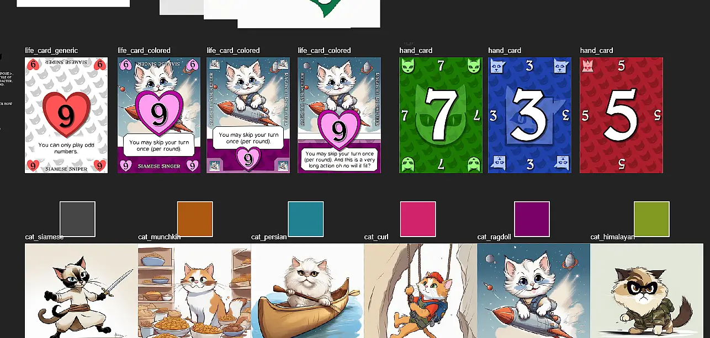
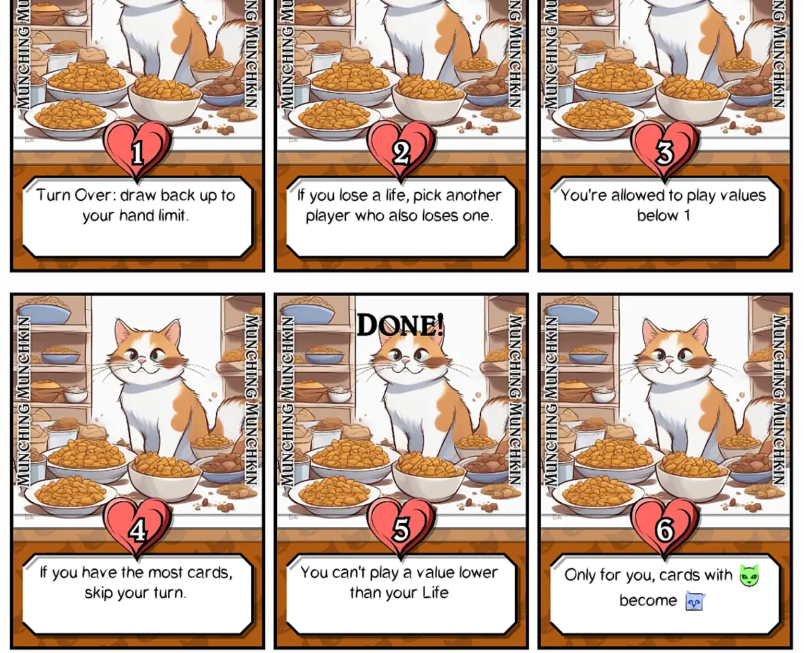
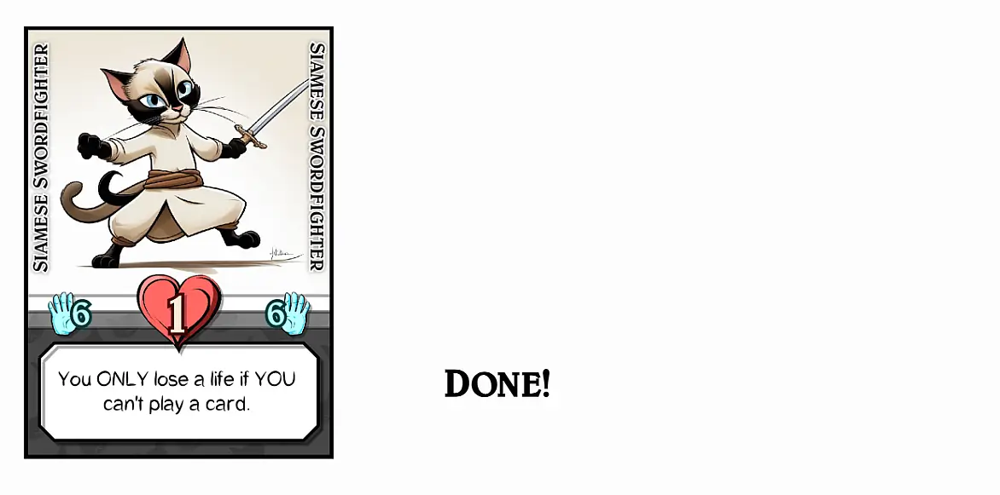

Welcome to the devlog ("developer diary") for my game [Nine Lives: Math Meows](https://pandaqi.com/the-outnumbered-series/nine-lives-math-meows/).

This game slipped through the cracks. I worked on it a while in my head---with random thoughts and ideas popping up---before I actually "properly" started the project. This devlog might therefore omit some details or make some time jumps, but I'll try to give a good summary of what I remember about the development process.

{}
Also, this ended up being a spin-off, while I made another version the base game. As such, if you read this devlog and don't recognize certain rules or ideas immediately ... that's because they ended up in another Nine Lives game!
{}

## What's the idea?
I like very simple card games with small decks. Usually, those are trick-taking games, or they use suits/numbers in some way. 

Those games extremely easy to take with you, to explain, to play anywhere, to customize by mixing up a few of the cards.

That's probably why my brain suddenly came up with the following idea.
* What if you had a game called "Nine Lives" (from that idea that cats have nine lives) ...
* And everyone actually had 9 lives (at the start) ...
* And you lost a life whenever you lost a trick/round ...
* Until somebody was out of lives, and highest number of lives left wins?

It seemed promising. But not strong/specific enough to do anything with it (yet).

Some time later, my brain added the following.
* Those lives are displayed using a deck of (unique) cards.
* Whenever you lose a life, you turn over the next card. 
* This means we can add **special abilities / rules** on those Life Cards!
* And the more lives you lose, the _stronger_ those abilities are (to balance the game and compensate for the fact you're almost dead).

And finally, we'd closed the game loop when my brain discovered what you'd actually _do_ on your turn.
* Take turns playing a card.
* You're trying to play the numbers 1-9. 
* In other words, the cards show numbers 1-9 (in four different suits), and you cannot play a number already played.
* Can't play a card? You lose a life, next round.
* You managed to play all numbers (between 1 and 9)? Everyone loses a life, next round.

With that figured out, I was able to take the game a bit more seriously and play a paper prototype against myself.

## Obvious mistakes, not-so-obvious solutions
In my original rules, the "core rule" of the game was:

> You can't play a number that's already played. You must follow suit, if possible.

Maybe you already see the obvious error here. The error I discovered 5 seconds into my first test game.

**If you must follow suit, and every suit has the numbers 1-9 once, then it can never happen that you must play a duplicate number!**

Somebody played a green "1"? Great, that's the only green 1 in the game, so there's 0% chance that _you_ are holding a green 1 in your hand that's causing trouble.

The whole idea basically falls apart, so I went back to the drawing table. 

Throughout these rules, the number "9" (and its root "3") were a recurring theme. I decided to go all-in on that.
* Initially I said "everybody gets 5 cards", but I changed it to "3".
* Initially the cards had numbers 1-9 once, in 4 suits. As stated, that was useless, _and_ created a deck that was far too large. (If you add all the Life Cards needed as well.)
* So I changed it to **3 suits**, with **3 numbers each**, and every card appears **3 times**.
* How?
	* Suit 1 = numbers 1, 4, 7
	* Suit 2 = numbers 2, 5, 8
	* Suit 3= numbers 3, 6, 9

Okay, so I had reduced the deck and created a nice intuitive consistency to the numbers.

It doesn't solve the issue.

At this point, I just had to create the new cards (by scribbling them on a paper and cutting them out) and try a bunch of different rules _in practice_ to see what worked.

## A much better game
Here are some examples of rules I tried and then discarded.
* You must follow suit (of first card played): too harsh, near impossible to follow.
* You must follow _any_ suit already played. (For example, if there's already GREEN and RED, and you have a card in either of those suits, you must play that): with only three suits in the game, this rule was a big "meh" that didn't do much.
* You **don't** have to follow suit, but you're rewarded for playing a card in a suit already played: draw 2 cards.
	* 2 cards was too much.
	* 1 card was too little.
	* And this was too _free_. Now you could basically play anything.

### Managing your hand
The more I tested the game, the more I realized it was actually about **hand management**. 
* If you only have 1 or 2 cards, then it's _really hard_ to be able to do a turn. (No matter which rules I used.)
* If you have 4+ cards, it becomes much easier to always find a way to play a valid card. (No matter which rules I used.)

But in the first rules draft, the rule was simply "draw back up to the hand limit of 3". (Or "draw as many cards as you played, at the end of the round")

Once I started experimenting with _that_, the game started to flow.
* No, you **don't** draw cards automatically at the end of a round.
* When you play a card in a suit already played, you draw 2 cards.

Suddenly, you might want to _not_ play a certain card, because you'd be left with a tiny hand next round. Or you _do_ play a card that might get you in trouble (if the turn comes back around to you), because you need the new cards it provides.

It still wasn't perfect, but now we were on the right track. After more experimenting,

* I set a **hand limit**. Furthermore, this hand limit was decided by your current Life Card. (If you still have lots of lives left, you can only keep 3 cards. The closer you are to dying, the bigger your hand may be. Again: the idea of the lives system is to self-balance and keep the game close, even if you get extremely unlucky with cards.)
* I allowed playing a card to **either side** of the current row (left or right edge). 
* The rule became: **if your card matches suit with its neighbor, draw 2 cards**.
* The player with **the most cards** starts the round.

I was afraid the third rule would be too free. Surely, with only three suits, you can pretty much always match suit with a neighbor? But in practice, it seemed perfectly balanced.
* You have so few cards, there's actually a high likelihood you _don't_ have that suit.
* Other players are encouraged to play the same suit, so both sides (left and right) have a high likelihood of showing _the same suit_. (Giving you only one option.)
* You _should_ be getting new cards more than 50% of the time, otherwise you are out of cards within two rounds!

{}
To go one step further, even ties for victory are broken by hand size. If, at the end of the game, multiple players have the most lives left, the one with the most _cards_ wins.
{}
### Who must start?
The fourth rule, no matter how simple, was also crucial. 

I tried other ideas:
* Player with the least lives starts the round.
* Player with the most lives starts the round.
* Player who lost the previous round starts the next one.

All of these, however, had issues.
* If you must start, then you can never match with a neighbor. (You're playing the first card on the table!) As such, starting is a _punishment_ making you lose more cards. We don't want to give that to the player who's already behind.
* Especially for the first part of a game, _many_ players are still at the same number of lives (9 or 8). So this is often a tie that needs another rule and it's just not great.
* Remember that, if all numbers were played, _everyone_ loses. So there's no clear loser of that round. As such, the rule needs exceptions and I don't like that.

Once I realized hand management was actually crucial---and going first was bad for the number of cards in your hand---the rule changed to "most cards starts". (And if that's a tie, the start player simply doesn't change.)

This worked wonderfully to balance the game further.

### Number magic
At this point, the game worked. But that was mostly because of those Life Cards. Once people start losing lives, extra powers enter the game that shake things up, turning this into much more than a simple card game playing numbers.

But I also want the game to be good (enough) _without_ those powers. The first round should also be challenging. If you have a weak power---or one that's simply not that useful in your current situation---it should still be a fun game.

So I played a few games while ignoring the life system completely and tried to find one or two rules to spice up how you can play numbers.

In the end, I found the solution in this simple thought.

> Why don't I allow playing **multiple cards** at once, and adding their numbers? (So if you play a 2 + 3, you actually played a 5.)

This allows _way_ more variety in what numbers you can play (and/or block for future players). It allows more (strategic) ways to use a specific hand of cards.

If you play it _really well_, you can match _multiple cards_ with a neighbor, allowing you to draw 4 or even 6 cards!

At the same time, it's not overpowered. 
* You still need to have the right cards to get that number.
* Obviously, playing multiple cards _costs_ multiple cards, making your hand management an issue again.
* Numbers above 9 can't be played.

Once my mathematician brain woke up, however, I immediately saw that the final rule was unsustainable. The _majority_ of card combinations will exceed 9 when added together.

So the rule changed to: any number above 9 is simply 9. (Easy to implement, but not overpowered, because only one 9 can be played per round, so players can't endlessly stack cards with high numbers.)

Finally, finally, I realized a third way to add strategy to the game and make playing cards harder. Because ...
* When you play a stack, one card has to be on top. (That's just how a stack works, of course.)
* The number that's on top is **also forbidden** (from now on).

In other words, if you play a smart stack, you can claim _two numbers_ in one turn. This makes the game more efficient and tight. It adds more strategy to playing a stack, because now even the decision for _what to put on top_ can matter! 

This isn't just a great rule, it also makes intuitive sense. While testing the game, I kept seeing that card on top of the stack and immediately thinking "ah so I also can't play that". It would be way less intuitive to go against that natural assumption.

With those changes, the game is also fun and challenging _without_ powers. The nine lives are just a great addition on top that multiplies what you can do and how rounds can flow.

## Let's make that
I was now certain that the rules were as simple and effective as could be. 

My only gripe is the summing part, and how _most_ combinations of numbers will just be "9" because they are higher than 9. If I can find some simple thing to allow more variation when summing, such as subtracting in certain situations, it would be great. 

But I didn't have any good ideas, and I didn't want to let it slow me down, so I moved past it.

I had also written down nearly 50 possible "powers" that could be on Life cards, categorized by "low", "medium" and "high".

(As in, a card that's really GOOD should only appear on LOW Life Cards. A card that's actually BAD should only appear on the HIGHEST Life Cards.)

{}
Also, but maybe this is just me, I love that the deck for the game is only 27 cards. Less material. Less to print. You _can_ actually figure out what others have in their hand, near the end of the game.
{}

All that was left, was writing the code to generate those cards, and design some simple illustrations/layout to go with it.

### Graphics Design

I wanted to try something new: outlines around basically everything, extreme focus on a big illustration for the Life Cards, and a few subtler decisions. 

I'm not sure I succeeded. For some reason, this one was _hard_. All my ideas failed. And my head was suddenly completely out of ideas.

Below are some sketches in an attempt to find a card design, and then the first cards generated by my code.

As you see, I struggled with the placement of the heart and the lives. Placing it front and center makes everything else a little awkward to place. Making it too small is obviously not great, as the whole purpose of the Life Cards is to display how many lives you have left.

I do really like the illustrations (generated with AI, no edits or improvements from me yet). The issue is that I initially generated them with a clear "white background" prompt, with the intention to cut them out. With the final design, however, I want them at full size and _with_ a background, so I'll have to figure something out for that.

The pattern of cats in the background of all cards is also a keeper. (It's more clearly visible on the number cards.)

The icons for the suits were designed to look like cats, but also clearly look like an easy-to-recognize shape (circle, square, triangle). As I said, I'm not too happy with them as their style is clearly a little different from the illustrations, but at this point I have to tell myself "good enough, continue".

The fonts are literally called "Puss in Boots" and "CatCafe" :p It took a while to find them (as most "cat-themed" fonts are symbol fonts that are completely unreadable), but they're readable enough that I can even use these fonts for all other text. (I think.)

At this point, I realized I **completely forgot to add the hand limit on the cards!**

Seeing how this design/code was already a huge struggle, I did not want to redo anything and just stuck a hand + a number on the best spot I could find:

## "Kids version" always leads to better games

As I wrote down the idea for Nine Lives, I also wrote down two other ideas.

* A slightly more complicated version based on "trick-taking"
* A simplified ("Kids") version without numbers or text on (Life) cards.

My initial solution to the "summing" problem (summing numbers almost always leads to numbers above 9, kinda defeating that rule in most rounds) was to add **negative** numbers on the bottom of the card. So, the "3" would have a "+3" on the top and a "-3" at the bottom. Depending on how you stacked the cards, you'd be able to create more varied numbers.

But as I created that, I immediately saw this would be hard to do for children, and put it behind a "toggle". You could turn off negative numbers in the settings, if you wanted.

But how do I simplify this? How do I make this idea work _without_ text on the Life Cards, or without allowing some math with your cards?

As all those loose ideas ruminated in my head, I realized a few things.

### Numbers become Images

Firstly, instead of placing numbers on cards, I can simply put _cats_ on cards. (So a card might have 2 Persian Cats and 1 Himalayan Cat, all just illustrations spread out on the card.) => This allows a very simple base rule "No cat type is allowed to appear more than 9 times!" for my "Kids version"

This is actually something you can do often, and with every game I make, I like it more and more.

Instead of adding numbers, simply add _that many_ of the same icons.

* Downside: it takes more space.
* Upside: you're forced to keep numbers low.
* Upside: looks better and is easier to parse for many.
* Upside: you can even add more variation by switching up some of the icons.

Just a small tip.

### Simplifying the original idea

Secondly, we can simplify the core rule. 

Currently, when checking duplicate numbers, you must check the total value of each stack _and_ its top card. After playing a few rounds, that is second nature, but it's still a little _convoluted_. It's easy to make mistakes, and unnecessarily hard to explain.

Remember that I did this to make rounds end sooner. To allow restricting _more_ numbers in one turn (by playing a stack of cards). 

But we can do that in a simpler way: by simply playing the stack of cards as _separate cards_.

* On your turn, you must play multiple cards that _together_ are a unique number.
* But when placed, you don't put them on top of each other. You simply spread them out. _You do the intuitive thing most people will want to do._
* Now all you need to check are the _numbers on all cards played_. No exceptions, no extra rule, no hidden values.

This still allows restricting multiple numbers in one turn. (You play a stack of 5 + 2, which is valid because there's no 7 yet, but now you've made playing 5 _and_ 2 impossible!) But in a much simpler way that is easier to check (and basically impossible to make mistakes with).

This makes the original "Nine Lives" game as simple as it could be.

### Betting your life on it

Thirdly, I applied the age-old technique of **solving two problems with one solution**.

* Problem 1 = we need slightly too many rules/mathematics in the base game for some people, especially Kids.
* Problem 2 = there's text on Life Cards (and they sometimes have _very_ specific powers)

At some point, the idea of **betting your life on it** came to mind.

The original seed of the idea was just:

> Whenever you can't play a card, you should be able to _wager_ one Life Card. This should give you some special power to keep playing. But ... if you lose a life now, you lose aaaalll the Life Cards you wagered!

> This means Life Cards don't need a wide variety of "permanent powers". No, they can have a really simple one-time power that you _consciously use_ when you wager the card.

This immediately felt strong. 

* It made Life Cards a truly unique and integrated part of the game---which is nice for a series of games called Nine Lives.
* It removes any shenanigans with adding numbers or "clever" little rules to make the game playable. Being able to play a card can be _very_ luck-based or chaotic, because now you can always save yourself (temporarily) by wagering.

In other words, that "Kids Version" ... might actually become the new base game that's released first. I'll need to make some prototype and test it, of course, but it feels promising.

So promising ... that I want to move this betting system to the original idea ...

### Even more wagering

When I tested the new simplified rules, it was actually a little _too_ powerful. 

In 3 player games (and also 4-player, though to a lesser extent), roughly 80% of the rounds ended with _all_ numbers being played! The freedom of adding _or_ subtracting, and not having to check stacks, made it a little too easy to play the right cards.

So I thought,

* What if creating _stacks_ wasn't a free action you could always do? What if you needed to _pay_ for it by wagering a life?
* Since the start, I've had _one_ remaining issue: if you ever run out of cards, there's no way to get any of them back. So what if you could get more cards as well by wagering a life?

This turned into the new rule.

> At the start of your turn, you can wager a life. This allows you to draw a card _and_ play a stack. (But, as always, if you lose now ... you lose ALL of that!)

**This feels like the final version.** It's simple, it just makes the game _click_, suddenly you get way more interesting turns and decisions, with more risk and reward.

If players play risky, lives fly away much faster. If you play conservatively (at the wrong moments), your lives will also drain faster.

When testing, this revealed a nice side-effect as well: when you wager a life, the top card of your deck obviously changes, so your special ability can even _change during a round_.

## Playtesting & Polishing
Now that I've made the decision to split the other two ideas into _separate games_, this devlog will ignore them and just continue with _this game_. The one we started with.

We already had most of the graphics design, the rules are done, so I merely had to spend a day polishing and then I could print a proper deck of cards for the playtest (with other people).

One silly issue I only noticed _after_ printing the cards, was that the "6" and the "9" of this font look identical. You can still tell which is which by looking at the other icons on the card, but that's not great. So I had to program a little line to add underneath the number, to clearly indicate which one it is :p

Anyway, how did the testing go?

It went **great**! The game is very simple to explain, it balances itself quite well, and everybody had a lot of fun. Also, the cards are very easy to read and the cats look instantly inviting.

As always, there are still some improvements to be made, mostly when it comes to the **actions**.

Some of them are pretty inconsequential. For example, "you may ignore the number 3" doesn't do much if you have no 3s and they're not played by others. (Whilst it _is_ powerful if that _does_ happen, as one test game showed.)

Below are some of the biggest changes in this regard.

* "Ignore the number X" becomes "Ignore all numbers below/above X". (I just need to make sure we don't pick useless numbers, like "below 1")
* "Round Start: Reveal your hand." => just _play with your cards open_ the whole time. Much more impactful and fun.

While playing, people will often remark "oh I wish my life would do X", which always reveals great ideas for powers.

* Somehow, I forgot the "Ignore suit X" power, even though I already had "ignore number X"!
* "Round Over: if ALL numbers were played, you GAIN a life instead!"
* "Instead of drawing from the deck, draw from the cards played."
* "Instead of drawing from the deck, draw from the discard pile."
* "If you wager, reverse playing direction."
* "If you run out of cards, everyone loses the round."
* "If you run out of cards, all players give their hand to the left/right."
* "Cards must be played in order (ascending or descending)"
* "Each suit may only be played _twice_."

Finally, some small sources of confusion or room for improvement.
* Currently, there are some powers that occur when a round is over for which _order matters_. I don't want to introduce rules for that, so I just rewrote those powers so order of execution never matters.
* A power said "all cards below X become Y". Yes, _all cards_ means all cards, both your hand and those played. But that proved quite difficult to keep track of, especially if the row on the table grows longer and longer. So that's simplified to "All your _hand_ cards below X become Y."
* When I say "draw 2 cards if you match suit with a neighbor", some people thought it meant the card had to literally touch the other card. What I really mean is "if you match suit with a card in an adjacent column", so I'll probably update the phrasing to that.
* I see no reason why players can't wager _multiple_ lives at once. Wagering is fun. It adds life and excitement to the game. So I'll do whatever is needed to make it more likely that players will do so.

With all those changes, the game is done. It was already fun and playable, but now all the wrinkles we found have been ironed out (as far as I can tell)!

## Conclusion
That's the first Nine Lives game done! 

In the end---as usual---it became wildly different than that original spark of an idea I had about a month or two ago. But that's fine. Especially because I spun off the other variations of the idea into two separate games. 

As I write this, those two spin-offs are both almost done as well. (To know how that turned out, read those other devlogs / check out the other games!0

But the core of the idea, the thing that made me think "huh this could be a great simple game", _did_ work out as I expected.
* Starting with nine lives and losing them one by one is just a great overall objective and a clear goal to work towards.
* That simple core of "play numbers 1-9, but no duplicates" can drive the whole game. (No matter how arbitrary it may seem on the surface.)
* But the special powers + wagering of cards raises it to a much higher level.

I hope to finish and test the other two spin-offs in the coming week. Hopefully, by the end, we have 3 Nine Lives games that have the same fun core---but each playing group can pick exactly the variant that _they_ like the most.

Keep playing, until the next devlog,

Pandaqi