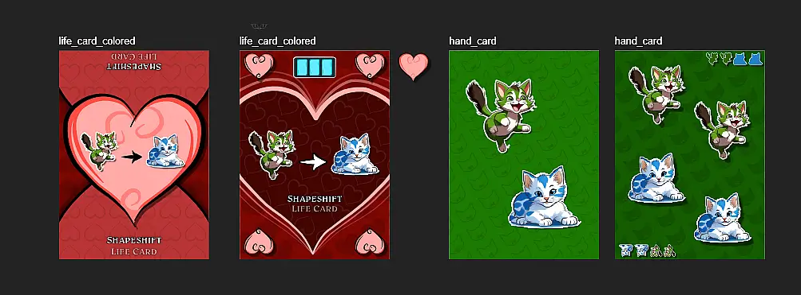
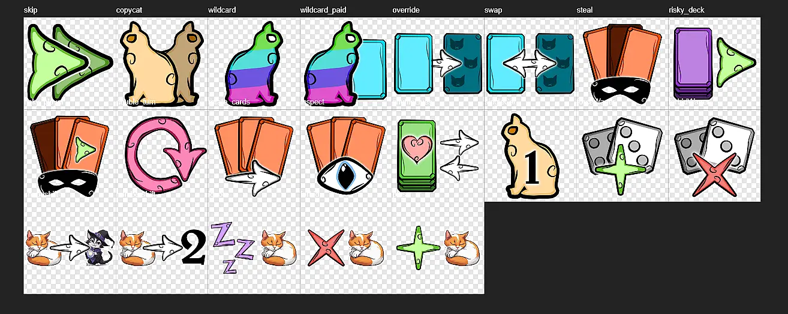

Welcome to the devlog for the game [Nine Lives](https://pandaqi.com/the-outnumbered-series/count-to/nine-lives/). 

The road towards this game is a little weird. It started as a different idea, which I mostly completed before starting work on this one. But _this_ idea felt a little simpler than _that_ idea, so I switched them around: Nine Lives is now the base game, and that other game was renamed to "Nine Lives: Math Meows" (a spin-off or variant).

Why am I telling you this? Because it means that the first part of this devlog is actually part of that other [devlog for the spin-off](https://pandaqi.com/blog/boardgames/the-outnumbered-series/nine-lives-math-meows/). (Where I explain the differences and how the separate ideas influenced each other and made ach other stronger.)

This article will continue where that one left off. Don't worry, you don't need to read the other developer diary if you don't want---I'll start by summarizing the important points.

## What's the idea?
_Nine Lives_ started as an idea about ...
* Having Nine Lives. When one player runs out of them, the game ends, and the player with the _most lives_ wins.
* Each round, you take turns playing a card. You can't play a number that's already on the table.
* If you fail to play, you lose a life.
* (If all numbers end up on the table, _everyone_ loses a life.)

The original implementation used _numbered cards_, and Life Cards with _text on them_. (The more lives you lose, the more powerful abilities you get to keep the game "balanced".)

I wanted to make a "kids version" without numbers and without text. Eventually, that idea lost the moniker "kids version" and just became the "simpler" version (in terms of rules and text).

That's the one you're reading about right now!

A version of the original Nine Lives idea, but ...
* The powers on Life Cards are _icons_. (There is absolutely no text in this game.)
* The cards itself just show a number of _cats_. (So instead of a "3", it would just show three cats of the same type.)

This meant the rules, at least for now, were extremely simple.
* You can't play a card that would make any cat appear more than 9 times.
* You can, however, _wager_ a life: place it in front of you and execute its special power. (Which hopefully helps you to play a card.)
* But if you still lose, you also lose _all wagered lives_.

That's it. That's the whole game. (The only other rules are about who starts each round, and of course learning the handful of different Life powers.)

## Does that really work?
No, it does not :p

I already knew this would probably be too simplistic. But even if I have to add 2 or 3 more rules, that's obviously not going to make the game complicated at all.

So I made this version of the game and tested it. For the cards, I ...
* Created 3 "suits" (circle, triangle, square for now) and created all possible _combinations_ of them up to 4. (So, at most, 4 icons on one card.)
* Created 1 special "suit" that doesn't appear in combos and just represents numbers 1 through 9.

This made the deck a bit larger than I wanted. I'll probably remove some of those cards in the final game, but for now it's fine.

I quickly sketched those cards, cut them out, and played against myself.

### Issues, issues, issues
Immediately, issues presented itself.
* It's almost always the best move to play your biggest card. (The one with the most icons.)
	* It reduces the chance of being unable to play a card on your next turn.
	* While _increasing_ the chance that the next player(s) go bust the most.
* There's no differentiation in how many cards you play. As such, players will generally have exactly the same number of cards in their hand (as all other players) at all times. 
* The first few turns are extremely safe (literally _impossible_ to go wrong) and therefore not that interesting or useful.
* (Also, when it comes to reducing deck size, I think I want to keep the _bigger_ cards, as otherwise the numbers go up too slowly during a round. In fact, I probably want more variety on the biggest cards, adding some with 5, 6, or even more icons.)

When prototyping such a game, I usually ask myself: what would I _want_ to do right now? What should the rules allow/forbid that would make me interested right now?

### Solutions, solutions, solutions
That question yielded the following answer.
* When you reach the number 9 exactly, on your turn, you get a bonus. (Example: currently there are 7 triangles. You play a card with 2 triangles. Ta da, now there are 9 triangles, you're rewarded.)
* When you wager a life, you get its power _and_ draw the number of cards it shows. (Right now, those cards are merely used at the end of the round to show how much players may draw.)
* We need life powers that are _not_ directly related to yourself, but to all other players. Something that's useful even if there's only one or two cards on the table so far.
	* Example: view the cards of another player. (Maybe even _all_ other players?)
	* Example: all players give 2 cards to the right/left.
	* Example: all players move their top Life to the bottom of their stack.

The first change takes a step towards solving my first issue. Now there's a reason to keep your higher cards ...
* ... in hopes of playing them later to be the one to reach 9 (for some cat).
* ... but also to make it less likely that another player can do so, because the numbers stay lower!

Of course, the specific **bonus** you get is crucial to making this work---and also yet undecided at this point ...

The second change makes hand size more variable _and_ wagering a life an action you want to take more frequently. While testing the game, I often noticed how tight the number of cards in your hand was, and how often I thought "I really want to be able to get _more_ cards/options now".

The third change not only adds some pretty essential powers, but also gives the first few turns more character. You can use them to gather information, or to set yourself up for more success down the line. (Or to _ruin_ another player's chances of success down the line.)

I just need to be wary of adding too many powers. That'd mean people need to remember too many different icons and that's never great.

### What's the bonus for a perfect 9?
My intuitive solution was to make you "safe".

> If you play a perfect 9 (for a specific cat), you _do not have to take any more turns_.

Initial testing showed that this was enough reward to really go for it, no matter the risk.
* You're pretty sure you won't lose a life this round. (The chances of getting a perfect 9 for _all cats_ in a round---which means all players lose a life---are pretty low.)
* But you _may_ take more turns, if you so desire. To mess up other people, to help yourself in the next round, perhaps at the cost of wagering more lives.

Of course, it does create a gap in the rules: what if _everyone_ does not need to take any more turns? The round would never end! Paradox!

We need a second tiny rule.

> As soon as only one player remains who must take turns, the round ends and they lose.

No need to play on. A sufficient penalty for playing badly.

While playing against myself, this just seemed to **work great**. But in a game that relies so much on _not knowing what cards the others have_, this isn't really reliable.

As such, with these rules, I decided to just create the whole game and try to playtest it with others as soon as possible.

## Making this
### Graphics
The work on the previous game already settled a general art style. (Cartoony with outlines, but not too simplistic nor "perfect/glossy/vector", generally soft colors with one main color per cat, swirly lines on the life heart, etcetera.)

I tried to maintain this style and fit it to the new requirements.

Then I realized that we really only need _four illustrations_ for this game for which I'd use an AI: the 4 cats. Any other illustrations I'd rather draw myself.

(I try to use generative AI as a _learning tool_ as much as a _creation tool_. From the previous game, I learned some tricks for how to make things look better, so I wanted to do that _myself_ this time.)

When designing the life cards, I initially wanted a big heart in the center and liked that design. Once I started adding the other details, however, this just didn't work. The icons that indicate the _power_ of the card would be too small (as they have to fit _inside_ that heart), and there's no good space to place the card icons (that indicate how many cards you may draw).

That's why I eventually switched to a different design. One where the heart is enlarged (so it clips the edges) to the point you might not immediately recognize it's a heart, which is why I also added hearts in the corners.

Below are those initial sketches for the card design. (Also notice how I switched to _outlined_ hearts in the background pattern for the middle heart, because the other pattern was just too busy and took away from the clarity there.)

### Finishing touches
I added some more icons that can appear. I learned a lot from studying some different styles that the AI gave me and think the life/action icons from this game look really unique and stylish.

Oh, completely forgot to actually _show_ that! Here's an image of the spritesheet. All icons completely manual, no AI.

I split the icons into a _simple set_ and an _advanced set_. (So you can decide to only use the simple icons for your first games, which means it only includes the 8 simplest icons with the most intuitive actions. Less learning icons, more playing the game.)

I messed a lot with the balance inside the generator. I want to keep the deck small. But if I do that, I can't include "all possible combos" of the 4 types---not by a long shot. I can only include all combos until about 3, then it's too much. (Also, if there were too many "full cards", you'd reach 9 way too quickly and rounds would end too quickly.)

So I fiddled a bit, tried some parameters, and eventually settled on something that keeps a running average of how often each type appears. For higher combos (4, 5, 6 cards) it picks randomly, but forbids picks that would make one type appear _way_ more often than others. Any leftover spots were filled with entirely random cards.

{}
Well, at first I filled them all with the "gray" suit, as it's a special suit that occurs less anyway. But that made it occur _too much_!
{}

Once I created the "interactive example" (for in my interactive rulebook), I realized we still didn't have the best balance. About 75% of the time, the example would show "hey, you can play ALL your cards!" 

Which is the most boring and least instructive. And which is caused by having too many cards with very few cats, making it too unlikely any of them reaches 9 (within a few cards).

So I fiddled some more until the probabilities here seemed to line up. (This isn't a perfect test, of course, as the _powers_ are sure to mess things up big time. I could've written a proper simulation of the whole game, but I didn't feel like doing so for such a simple game.)

That's it, I think? Yeah, that's it. Let's go to ...

## Playtesting
We tested the game, and I have pretty much the same result as every playtest: **the game works, but there were slight balance issues**.

### Hand Size
The first issue: your hand.
* Automatically drawing cards at the end of each round gives you too many cards (and too easily).
* But _not_ doing so will quickly lead to players having just 1 card for the rest of the whole game.

The issue here is one that's obvious in hindsight. Many powers allow you to draw _1_ card. But ... you also _play_ 1 card on your turn. As such, wagering those lives means your hand size just stays the same. It doesn't actually grow, like I envisioned while developing the game.

Which means that, once you've lost one or two cards somewhere along the way, you're never getting that back.

The best solution seems to be the one that _removes_ rules from the rulebook and just creates smarter Life Cards. Namely: **increase the draw size of each Life Card (on average)**.

Currently, most lives allow you to draw 1 card when wagered. If we make that 2, then you're always _growing_ your hand when you wager them.

The "1" value can be reserved for powers that are exceptionally powerful and shouldn't be rewarded in another way. (Such as the "Steal" action, as playtesting showed.)

During the games when players got _too many cards_ (too easily), I considered a hand limit of 6 or 9. But with these new rules and balancing, this issue was too small/unlikely to waste precious space on it in the rulebook.
### Lives Management
While playtesting, I kept noticing two things.
* "I'd really like to change the _order_ of my lives now."
* If somebody had a powerful life on top ... it would usually _stay_ on top for many rounds (as they kept "not losing") ... making it _overpowered_.

I already had a Life that said "reorder your Lives however you want". So I'll just make that _more likely_ to appear in your deck.

But we can fix this with another rule. 

Currently, when you wager lives and don't lose, they return to the top of your deck. 

Instead, **wagered lives go to the _bottom_ of your Life Deck**.

This means you automatically cycle through your lives and must use a variety of them.

### Powers
As I said, some powers were too strong and others too inconsequential. (Most were fine, though.)

I also had a sudden realization that will prove very helpful for future games.

> **The most interesting powers are the ones that still leave you with a decision after using it.**

Take the "Copycat" power. It says that you may execute ("copy") one power from another player. This power is far more interesting than many others. When somebody used it, people would lean forward in their chair asking: "So whose power you gonna copy!?"

That's because there's still choice there. You must still _choose_ which player's power to use. So the power isn't just something that's "either clearly helpful or clearly not", something that's 100% predictable.

I made these powers more probable in the generation, and rewrote a few others to move in this direction. 

As another example: "Carousel". It said: "everyone gives 2 cards to the left (simultaneously)". Why pick a direction? Why not let the _player_ pick the direction? So now it says that the player may choose.

The "Shapeshift" (cat A becomes cat B) and "Numbershift" (pretend cat A appears X times on your card) were more balanced than I initially feared, and that was partially due to unforeseen consequences.

I created the cards as a _bonus_. "Change cat A to cat B, so you can still play it and perhaps score a perfect 9!"

But in reality, if you don't watch out / plan ahead, they can be a _liability_. 
* Say there are 4 Blue cats and 6 Orange. (On its own, these are not high numbers.)
* Your Shapeshift says "Blue -> Orange".
* This means there are now _10_ Orange cats.
* So you suddenly can't play a cards with any Blue or Orange from your hand anymore!

Although, the first version of "Numbershift" was more complicated, and I quickly dropped it when playtesting showed a simpler version was better. 

The original said: "_If_ you play a card with this cat, pretend it appears X times. All other icons stay the same."
* While also interesting (and with plenty options for strategy) ...
* It's more complicated ...
* And it means you can just "ignore" the power (by playing a card that doesn't show that cat at all), which is never fun in games ...
* And it means you quickly turn your _whole_ hand into some sort of "supercards" that are near impossible to play.

In the end, after some doubts and indecision, I did pick the simpler version. Just because it seemed to work slightly better in practice.

Finally, the **ignore** and **plus** powers are a little too similar.
* Ignore: completely ignore the existence of a cat. (You're allowed to exceed the number 9, but you also can't score a perfect 9 with it)
* Plus: you're allowed to exceed the number 9 for this particular cat.

As you see, the _only_ difference is that the "Ignore" also doesn't let you score the cat. That's just too minimal. (And in practice, people lumped them together and used them interchangeably almost immediately.)

After some thought, I decided to make this the one card that applies to _the whole round_. (All other powers are just limited to yourself and/or the next player.)
* Ignore: **everybody** ignores the existence of this cat. (The cat is "asleep", if you will.)
* Plus: the same as before.

## Conclusion
As usual, despite all my little criticisms, tweaks, remarks and more, this game simply works. I'm a perfectionist and try to make it all _just_ a little better before I officially call this project done.

For example, if you read this whole devlog, you know I had a lot of doubts about the deck composition. Was it too many cats? Or too little? Would it take too long to reach the threshold of 9?

In the end, those hours of research and writing different generators (in code), paid off. Because as far as my playtests showed, the deck composition is _perfect_.

{}
The same is true for the icons. Most of them needed no explanation, or only one line when asked about it. They explain themselves and are intuitive enough that people easily remember and use the powers. (Although the "title" of the power underneath it---the only text in the game---obviously helps for those who can read.)
{}

And I think I _did_ make it a little better. The final rules lead to the most consistent (and usable) hand sizes, the most interesting powers (which are most likely to appear), a nice variety and cycling through your lives, and overall a balanced and fun game.

Anyway, I call the game done. And as I hoped, it _is_ the simplest version of the 3 Nine Lives games and the best one to call the "base game". It's barely 2 minutes of setup + explanation. 

If you enjoy my work (or read my devlogs), you know that I adhere to the principle of "simpler is better". So judging by that standard, even if the game is too simplistic or random for some, I can confidently call it a success.

### What did we learn?
Perhaps it's a good idea to give a short summary of my lessons (re)learned through developing a project, from now on, at the end of these devlogs. So here's a first attempt.

* **Powers are most interesting if they still leave you choice after using them.** So prefer powers that still allow you to pick a target, or choose a direction, or number, or whatever.
	* The other alternative is a power that's _sometimes good and sometimes bad_. So pick powers that are helpful in a certain situation, but very much unhelpful when used at the wrong time.
* **A great way to balance a game is to pick one "perfect" move, whereas moves below or above it are bad.** In this case, playing a perfect 9 for a cat is your ultimate goal. But anything below it, and you give your _opponent_ a chance to do so. And anything above it makes you lose a life.
	* Another application might be that one square on the board is great when visited, but land on the square _before_ or _after_ it and you're in trouble.
* **Most games can lose their text/numbers by just printing icons (a certain number of times).** This one speaks for itself. If you want games to be playable by young kids, you can often rely on just icons/colors/symbols. In fact, adding this restriction forces you to keep your rules simpler, which is always good.
* **A paper prototype (to test against yourself) is worth whatever time/paper/energy you need to invest.** If I'd just made the game and tested it with others for the first time, it would've been a nightmare. Even though it's quite some work to draw _all those numbers_ and _all those lives_ on paper and cut it into cards, it's worth it. It allowed me to find the flaws, quickly iterate on them, and present a 99% working game before asking others to give me some of their time and test it.
	* Though perhaps I should invest in those flashcards and erasable marker, so I can just re-use those for all game ideas :p

That's all I can remember right now. Already quite some lessons for a relatively small project.

Until the next devlog,
Pandaqi

