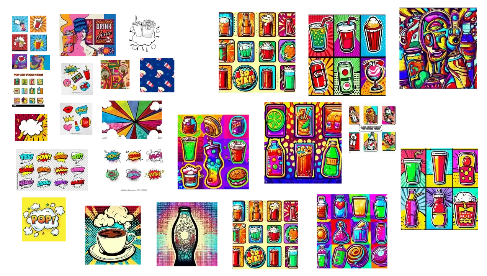
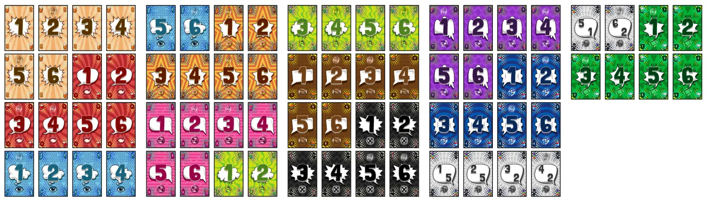

Welcome to the devlog for my game [Sixpack](https://pandaqi.com/the-outnumbered-series/count-to/sixpack/).

This started as a short article on my Dutch, personal blog. I had just played the game "Take 5" and wanted to write about the simple ways in which that game is _really good_. When done, I thought: "hmm, why don't I use these key tips I mentioned to quickly create a new game? To show that they work?"

That become "take 6". Which, after some more thought and testing the game against myself, became "sixpack" and actually quite a good game.

## What's the idea?

Here's what I love about "Take 5" (originally "6 Nimmt", I believe).

* Play is **simultaneous**. No waiting on turns.
* You start with all your cards, so you can plan ahead and strategize.
* The game ends when you're out of cards. Very easy and intuitive, with tight control on how long the game takes to play.
* Rules are very simple and physical: it's about placing cards in numerical order, which is something many people know how to do.

As such, I wanted to take inspiration from that, and then put my own spin on it.

## Change 1: fewer cards & numbers

I'm very much about minimalism (and not wasting resources). Take 5 has a huge deck (of which you don't use a large part). Can we do it with a smaller deck? Also, the numbers go quite high---can we keep the numbers low?

* Instead of numbers 1 to 104, we just do numbers 1 to 6.
* You start with only 6 cards as well.
* The game ends once somebody runs out of cards.
* Your score is simply how many cards you have left. (Which is faster to count than checking cow icons in a pile of cards, like in Take 5.)

These changes have two consequences.

* Numbers _repeat_. (There are multiple cards with "1", multiple with "2", and so forth.)
* You need some way to get cards back, or prevent playing cards in certain situations. (To prolong the game and allow variation in number of cards in your hand.)

I'll discuss those problems in a bit, but first we need to define how we actually play the cards.

## Change 2: piles, not rows

In Take 5, there are 4 rows on the table. From left to right, the cards go up in value. You must place your card in the row with the closest number below it. If that means you place the _sixth_ card in that row, you must take the five before it as penalty. (Hence the name, "Take 5".)

This takes up quite some space. I also don't need this many rows with my lower numbers.

Instead, let's do **piles**. Let's do 3, because that's half of 6, and people like consistent numbers/multiples in games.

> When cards are revealed, place them on the pile showing the closest number below it.

How do you get points?

> If you play the highest card (6), you get that pile!

> If you play a card that fits nowhere, you can grab any pile you want and replace it with this new card!

Very similar to Take 5. Very simple and should work.

## Change 3: repeating numbers

In Take 5, you reveal cards at the same time, then **go through them from lowest to highest**.

This obviously doesn't work if you can have duplicate cards. What's the order? Who goes first?

So here's a solution: **duplicate cards are removed**!

If you play a 4, and somebody else does as well, both are simply removed.

## Change 4: getting cards back

I struggled with this one.

My first rule was: "if you play the lowest card, you may take it back into your hand"

Seems fine ... until you realize this is a never-ending cycle. The number "1" will remain the lowest number. Nobody else will sacrifice their 1 (if they even have it) to stop you from just getting back your card each round.

The same is true for the other extreme: the highest "6".

My second idea, thus, became: "if you play the _middle_ card, take it back"

But ... there isn't one _middle_ with an even number of players. It's not that intuitive or easy to check.

Uncertain about these rules, I tested the game against myself. The solution immediately presented itself when I encountered the problem: **what if you have the same number as a pile?**

Is the same number "the closest one below it"? This feels like a great moment for a special rule. If you can play exactly the number to fit a pile, you should be rewarded.

The rule became ...

> If you play the same number as a pile, and no pile exists below it, take the card back into your hand!

In my testing, this happens often enough to be useful, but not so often that it's "easy" or "slows down" the game.

_Why is this so important?_ First of all, to create that variation in how many cards players hold---as mentioned. But also to make cards **public information**. You can't really strategize if you have _no idea_ what cards other players are holding. By playing cards (publicly), then getting them back, everybody (who pays attention) now knows you have that card.

## Change 5: scoring

As mentioned, your score is how many _cards_ you have at the end of the game. Grabbing a pile, therefore, indirectly means scoring and is good.

But ... if you get _all_ cards back, the game would never end. The cards would just (re)cycle between all players.

Let's take another page from the "Take 5" book! Those cards have two things: a _number_ and one or more _cow icons_ (at the top). Giving cards two properties like that is very useful.

How do we use this?

Some of the cards show a **hand icon**. When you win a pile, you only get the cards _with that icon_ in your hand. (The rest goes away.) This ensures that, over time, the number of cards in the game dwindles.

Of course, when you _take_ a pile, something needs to come back. There always need to be three piles in the center of the table. So ...

* If you win a pile because you played a card that fits nowhere, that new card starts the new pile
* If you win a pile because of a 6, start a new one with a random card from your hand

_Why make these rules slightly different?_ It feels wrong to win a pile with a 6 ... but then leave the 6 behind. It's also useless: nothing can go higher, so next round this pile will almost certainly be removed and replaced with something lower.

While testing, this rules also turned out to be more balanced. Because you _lose_ that card (with which you need to start a new pile), you have to think harder about when a pile is valuable enough to try and claim it.

## Change 5: the secret sauce

Alright, what do we have now?

* Easy setup: deal 6 cards to all players, place 3 in center of the table
* Easy simultaneous turns: pick a card from your hand. When revealed, remove duplicates.
* Easy rules for handling them: from lowest to highest, place on pile closest to it (from below). If you played the extreme (6), or something that fits nowhere, claim a pile and keep the cards showing a hand. 
* Rules for visibility and strategy: if you play the same number as a pile, take the card back into your hand

This works. It's already a solid game you can play. However, it's not exactly groundbreaking ... yet.

The biggest issue is that the cards 1 and 6 are obviously most useful, and everything in between (especially the 5) kinda isn't. With a 5, you can never claim a pile: it's not the extreme, but it's also high enough that it always fits somewhere.

The clear solution is to add a **reverse**. Some way to invert the direction: now you play from high to low, and you claim piles with a "1".

I dislike adding separate cards or systems for this. It _all_ has to happen with these simple numbered cards (1 to 6). 

What do we do? We add these special actions to the cards!

## Card Sets

The number of cards you use depends on the player count. You need 6 cards per player + 3 more cards for the starting piles.

It seemed sensible, to me, to divide the material for this game into **sets of 6 cards (1-6)**. Each set has the same powerup (and general color/design) to clearly indicate they belong to the same set.

For each player, you simply pick a set you like and add it!

This turned out to be a wonderful system.

* You can control difficulty easily. First game? Mostly add neutral sets without powerup. Experienced? Pick the sets with the toughest card types.
* At the same time, you know exactly which cards are in the game. (1 through 6, once for each special type) This allows more strategy and planning ahead.
* It's easy to generate this material for players, to customize it, to not waste paper by printing sets somebody won't use.

To round off the game, therefore, I merely had to invent all the sets! While playing against myself, I consider "what special power would I like to have right now?"

This was my initial list. (Special cards are active as long as they are visible on a pile.)

{}
I renamed the game to Sixpack a short while later. It felt only sensible to rename the card sets to **card packs** as well.
{}

### Reverse

Count the number of (visible) reverse cards. If odd, the whole game is reversed.

* Consider cards from high to low
* Cards must be placed on the pile with the closest number _above_ it
* Piles are claimed by playing a "1" (instead of "6")

This card takes more time to explain/understand than any other. But I still want to include it first, with the base game, because this is _that secret sauce_ :p

Adding this card to my test games really brought the game to life. It makes every card potentially super powerful or super worthless. Timing your inversions well is a real skill. (And accidentally timing them together with another player is really funny, as they'll cancel each other. At least for that round.)

### Transparent

It takes over the _number_ and _hands_ of the card below it. If you play on top of this card, you must (publicly) reveal a card in your hand.

This card is the second most complex, but also one that _makes_ the game. One I wanted from the start.

* It allows making cards more or less useful, depending on what you copy.
* It brings more public information about what other players are holding.
* And more strategy, if you really want to avoid showing your hand.

It mixes the idea of a wildcard and a copycat in a way that aids the game.

### Takeback

If your card is the lowest or highest (out of all cards played this turn), take it back into your hand.

The reasoning behind this will be obvious: more takebacks, more public information, more ways in which you have to predict and guess.

### Secondhand

Shows two hand symbols. When won, also grab any card on top of another pile, or draw blind from another player's hand.

Simple, aggressive interaction between players. Also the ability to get cards you want, which was lacking.

### Biting Hand (Thief?)

If this card is inside a pile you've won, it negates all hands ( = you don't get them). If the pile has no hands, you must throw away an extra card.

This adds strategy because you really _don't_ want to win piles with this inside. Or you can use it to devalue piles to reduce how much another player scores on their turn.

### Sticky

Steal one card from everyone who played the same number this round. (The duplicates are still removed from the game, as per the usual rules.)

### Sheriff

The number on this card counts as the new "extreme" used to win a pile. (Overruling the regular one; "1" or "6".)

I like this one a lot and will probably recommend it as the third type you add. It allows making _any_ card very valuable for a short while.

### No Superheroes

All special card effects are disabled. (While this card is showing, as usual.)

Especially if you add many unique sets, this card might be necessary to keep the game a bit simpler and straightforward.

### Carousel

All players give one card to their left/right. (Activates when played.)

Not sure about this one. It _is_ a great effect. At the same time, this might add too much chaos and destroy too many tactical plans, making the game frustrating instead of fun. Still, an _option_ for those who seek that.

### Supernumbers

Simply adds a 0 and 7 as additional extremes.

_Very_ not sure about this one.

### Pile Driver

Either **split** a pile (put any number of cards from the top onto another pile), or **merge** a pile (combine two piles and use this card to start a new pile).

Again, a fun effect, but perhaps too chaotic for a game that's quite tactical and tight.

## Creating the Material

I've done _many_ games this year that generate their material via my website. This game was not so special in that regard.

* I looked for a font with great, unique, memorable **numerals**
* I created icons for the hands and the special types.
* (I added a color scheme / symbol / design to each type.)
* The algorithm creates cards 1 through 6 for the types you enabled, by placing all these elements in a pretty standard card composition.

### Where to put hands?

This was the only issue: which cards get a hand symbol? While testing, I sometimes thought certain cards were too powerful to get a hand, mostly the 6. However, the more I tested and refined the game, the more I realized there are ways for each card to be won or lost, so placement per number doesn't really matter.

All that matters is that it's _varied_. If I randomly pick cards for hands, I might end up with all of them on "1"-s, which is ... not great.

* My playtesting showed that 2 hands per pack was the ideal number. Let's use that.
* During generation, I keep a simple list of how often each number has received a hand. For each pack, I pick the lowest number. (Or a random one of the lowest numbers, if there's a tie.)

### Picking a visual style

By now, the game was renamed to Sixpack. I did not, however, want to give the impression that this was a drinking game or that alcohol was somehow involved. I opted to show another thing that you can buy as a sixpack: soda / pop / softdrink. I researched styles like "soda pop", "pop art" and logos for soft drinks.

This brought me to a very colorful style, punctuated by

* Busy, usually dotted patterns in the background
* Very thin outlines and/or each element is duplicated, but placed behind it as an offset
* Spiky speech bubbles or starry effects
* Lots of curves/waves, rainbow-colored things, and handwritten (Coca-Cola Like) lettering

Below is a sort of "mood board" I created. Some images are generated by AI (such as DALL-E), others are simply results from Google searches.

{}
And yes, I did want to try a distinct and new style for this game. I've been creating logos/sprites in the same style for too many games in a row now :p
{}

### Rule changes

While finishing the rules and material, I realized I already wanted to change a few things.

First of all, I _did_ get rid of that distinction when claiming a pile. (Reminder: when you claim a pile with a "6", you must start a _new_ one with a _new_ card. But if you claim a pile because your card fits nowhere, you just start a new pile with that card.)

It needed 3 lines in the rulebook and even confused myself for a split second when I read it back (after a two week hiatus on this project). Removing it shortens the rules and makes it more consistent, and in the end I value that _more_.

Additionally, some special packs had (slight) updates.

* **Pile Driver**: "Split or merge two piles" was simplified to "grab part of one pile and place it in top of another pile". Accomplishes the same thing, but with _one_ (more intuitive) line.
* **Second Hand**: originally I planned to always print _two_ hands on it. (To signal you get that card + one extra.) But that was confusing, because all other special cards had their type displayed/conveyed with a separate icon at the bottom. Additionally, it made the cards way too powerful. Instead, the card just allows you to steal another card (when won).
* **Super Numbers**: I disliked the idea of adding a 0 or 7 to the game. (It's called _sixpack_ for a reason. Let's keep things simple and consistent here.) 
  * It also wasn't that interesting when I tried it: it just meant that the card was more powerful than others and the value of the "6" was greatly reduced. Whoever lucked into this card, just had an easier game. That's not fun, is it?
  * When writing the code (to generate the material), I realized an easy fix: print _two_ numbers on the card. You choose which one to use. This is actually powerful without being overpowered.

Finally, I changed the website for the game. First, you only had a _checkbox_ for each pack. (You either include it once, or not at all.) Well ... what if you want to include a pack three times? What if you really like the reverse powerup and want more of it? (In fact, I consider adding it multiple times in the base game, that's how important it is.)

Now there's a simple dropdown to choose _how many_ you want of each pack. (And for most packs, it just defaults to 0.)

I probably changed more things, but these were the big ones.

### That's all

That's everything you need for this game. Just a bunch of cards with numbers and hands :p

And I like that. Simple, small, minimal, but my testing sessions (against myself) show me that it works.

Let's see if the game still holds up after real playtesting. 

{}
Of course, you can test the game with others before finalizing good-looking cards and rules. But the people around me are very much influenced by looks, quality, polish, etcetera. Presenting a hastily sketched paper prototype will automatically mean they subconsciously dislike the game and don't give it a fair / objective chance. I've learned this the hard way, numerous times, and thus always get the game "near polished" before doing serious testing with others.
{}

## Playtesting

**Yes, the game works!** As always, though, there were minor issues. And players asked questions that were _really good questions_ and caused me to refine some of the rules.

### 2-player version

First of all, I iterated on some ideas for a 2-player version of the game. 

* **Change nothing** (6 cards each, one card per turn): this is just too slow and uninteresting. With only 2 cards per round, there's almost no chance of interaction or foiling one another's plans.
* **Double** (12 cards each, 2 extra packs): this is too much. Games take just too long, you have too much choice, and you can't really predict what the opponent will do.
* **Double Fast** (same, but play 2 cards per turn): yes, this is faster and probably the right turn structure, but still too much.
* **Final Version** (one extra pack, 10 cards each, play 2 cards per turn). This turned out to be the perfect balance. It only takes one extra pack, shuffling and dealing cards doesn't take much longer, the game plays quickly, and there's enough possibility to plan ahead or interact with your opponent.

### The reverse card

I obviously started out testing the base game: neutral cards + the reverse card. As suspected, the reverse card is pretty essential for the game to function (well).

When explaining it, a player asked: "so, do the hands get reversed as well?" I never thought of it. But it's absolutely a logical consequence of saying "everything is reversed", and a very interesting one at that.

> When you claim a pile, and direction is reversed, take all cards _without_ a hand into your hand. (As opposed to taking the cards showing the hand icon.)

We played all subsequent games with that new rule and it was a great improvement, so it stays.

### Takeback

Then, I tested the different special packs. (Each game, we'd put one other unique card type into the mix.)

The **Takeback** card is a bit too powerful. (You may take it back when it's either the lowest or the highest card.) It resulted in many rounds where (almost) nothing was played and people just took back cards all the time. 

> Solution? Only the lowest, or only the highest. (Just pick one.)

Tested that, not great. Cards like 4,5,6 will never be lowest. Cards like 1,2,3 will never be highest.

> Solution? If the takeback card is a _duplicate_ or equal to the current _extreme_, take it back.

Tested that, still not great. Why? Because the "1" and "6" will almost always be the current extreme, which means you endlessly take back that card, never playing it. You also won't lose those cards on duplicates, so you _never_ lose it! Starting the game with a Takeback 6 almost guarantees you don't run out of cards.

> Solution? This card can be played on a pile with the same number to _claim_ it. If the card would claim a pile any other way, take it back.

This closes the gaps nicely.

* It fits the theme. Normally, you'd take back a card with the same number as a pile. The takeback card is the only situation that overrules this.
* It's balanced: you can't claim piles any other way, but don't lose the card either.
* It has no endless loop. You can still lose it on duplicates, or when simply played/claimed.
  
### Super Numbers

These were great! The favorite card of some players. So I'm glad I made the change (which I explained above) to _two_ numbers on the same card.

### Sheriff

The **Sheriff** card has a nasty situation I hadn't anticipated. This is how the old card worked:

> This number becomes the new "highest number" with which you win a pile.

A great idea. But ... what if you have a card _above_ it? What if there's a sheriff 3 active, and you play a 6?

You've just maxed out the pile, without winning it. The next player who plays a lower card will just scoop up that pile for free, 99% of the time.

Even worse, the sheriff 6 (and sheriff 1, to a lesser extent) are pretty worthless. You _already_ win a pile with a 6, so what's the point? 

The sheriff is great when it can stay on the field for one round and then be used. Otherwise, it's just removed quickly so players revert back to the usual rules.

This card needs something extra. Some smarter way of doing it that has a bigger impact.

After bouncing around ideas, finding more "meh" solutions, we ended with ...

> If a sheriff is visible, you can only _claim_ piles by playing a sheriff's number. (Replacing the usual rules.) Cards with the same number are played on top of the sheriff, instead of taken back. Cards that fit nowhere are played at the _bottom_ of a pile (of your choosing).

A bit more complicated. But it brings out the strength of the sheriff, without locking the game. (If I disallow winning any pile unless you play the right number, the game obviously grinds to a halt if nobody happens to have that number in their hand anymore.)

Now, when a sheriff enters the game, three things can happen.

* Somebody plays that number next round to claim a (big) pile. (If it fits no other pile, it will at least fit on the sheriff itself.)
* Somebody plays over it, removing the sheriff (but not winning that pile)
* Nobody plays a valid card, in which case the piles keep growing in value for next round. (Increasing tension and reward!)

{}
I don't really know why I keep calling this card type the "sheriff". But the name is sticking, and the design is somewhat influenced by it, so I guess it stays.
{}

### Seethrough

I added this card (as one of the first) because I was right about the only minor issue with this game: lack of information. Especially the first few rounds, you have no clue what others might play.

The last few rounds, you _do_ have this information.

* Some cards are from claimed piles (which you've seen)
* Some cards have been played, then taken back
* The number of cards in total is lower, so you can actually memorize/figure out which ones should be left. (You know each type appears exactly 6 times, with numbers 1-6 :p)

Until then? The seethrough card was supposed to make players reveal what they have. And it does, but I'm not sure if it comes at too great a cost.

The card takes over the value + hands of the card below it. This means that you need to slightly offset those cards, so players can constantly see the true value of the card (below it).

It's not that bad, but it's not very nice either.

I thought and thought ... but saw no better way. The card is simple and powerful enough to keep in, even if it means a tiny bit of extra work for the players.

My decision was solidified when I realized a simple way to make the card give information _right from the start of the game_! 

> The seethrough card must be held in your hand facing the other players. (So everyone always knows you have this card in your hand.)

### Sticky

The sticky card was fine, but not as good as it could be. The old rules:

> Steal one card from everyone who played the same number this round. (But all duplicates are still removed, per the usual rules.)

This card is only really valuable if you manage to match with 2 or more players. (Because you still lose the card.) The chances of that happening are too slim to count on it.

So let's stick with the theme and allow you to keep the card.

> Steal one card from everyone who played the same number this round. Additionally, all other duplicates are removed, but this card stays.

As long as you don't include more than 1 sticky pack (which you shouldn't, packs should only be included once), this doesn't mess up any other situations. And now the card is simple, but very powerful when played at the right moment.

{}
For example, when there's a great opportunity to claim a juicy pile with a six. If you play your sticky card _then_, you wipe out all competition who played a six and reward yourself big time. But then it turns into this game of bluffing and predicting---other players might _count_ on somebody playing that sticky six, and circumventing it. In other words: it's a game!
{}

### New ideas

Testing sparked some new ideas.

**Calculator**: changes the value of the card above it by the amount shown. (Example: it shows a "+2". Somebody plays a 4 over it, which becomes a 6.) Very interesting, but has similar issues as "seethrough":

* Players need to keep track of more cards
* It can create numbers outside the 0--6 range, what to do with those? Just a simple: "any number below 1 is rounded up to 1, any number above 6 is rounded down to 6"?
* Can make the game very chaotic and unpredictable.

A _simpler_ way to execute it, would be to use it as a "powerup" to other cards in your hand. You may attach any number of calculator cards to the card you play, to change its value. When placing your card on a pile, place all attached calculator cards below it.

Or I can do _both_. This is probably the very last pack, because it's the hardest to play with and understand.

**Copycat**: this card is the same as one played by another player. Pick which one after the card reveal. (If there are multiple copycats, players choose their target in numerical order.) Once played on a pile, the card is simply itself again.

Obviously a fun card with high interaction.

**Late Arrival**: when played, immediately add one extra card from your hand to the round. (Proceed as normal; as if that card had been played right from the start.)

Simple, but with obvious value. Plan it well, and you can score big time. Plan it badly, and you've just wasted another card.

**Veto**: when played, pick another card that's still waiting to be played and remove it. If this is the last card handled (in the round), throw away a card from your own hand instead.

The second rule not only handles the exception, but also balances the card. A veto that _always_ removes other player's cards, is almost always _good_. But if there's a chance you shoot yourself in the foot, you think twice about playing it.

As always, I simply designed these cards and added them to be tested later. Even if I think a card is too complicated (or boring) _now_, a test will reveal the truth. And it will usually reveal that I'm wrong and you can't predict how something plays out in practice.

{}
I'm not too scared about making these special packs harder to understand. Five lines of explanation, instead of one. Why? Because, at most, you'll only ever play with a handful of them. The number of different cards / packs in each game is very low. Even if you play only with special cards, and the most complicated ones, the total rules are _still_ very short.
{}

## Final Playtesting

The original game was already polished and solid. The only reason I continued working on the project, is because I'm a hopeless perfectionist :p I made the small changes, added the last few card ideas, and tested it again with different groups and pack combinations. (I especially needed to test the largest player counts more.)

**It still works!** On higher player counts, the game plays even better. The different packs are all interesting in their own ways. Quite quick to explain, but they really do change the game.

The _only_ minor annoyance I have with this game, is how hard it is for people to wrap their head around the "reverse" card. It's essential for the game, so I can't move it out of the base game. But even I struggled the first game with explaining and then applying the rule.

I've considered possible solutions or changes, but ultimately decided that it's fine. This game has _really_ short and simple rules, while hiding a _huge_ amount of depth and possibilities. Most of that is made possible by the reverse card, which becomes second nature once you've played two or three games.

Maybe, in the future, I figure out a way to get the reverse card out of the base game _or_ simplify it even further. 

{}
A second annoyance is the "luck of the draw", but I don't count that, as it's more of a subjective human thing. This is a card game, so you're _supposed_ to get random cards. The whole challenge is doing the best you can with cards randomly drawn. But if that leads to two "bad hands" in a row, you're quick to judge the game is unbalanced or unfair. After playing many games---both in general, and test games for Sixpack---I deem this game to have a significant bluffing/luck/guessing factor, but not overly so.
{}

Besides that, the game is done and polished. I've tested it as much as I can, and it holds up with different player counts, player types, pack combinations, etcetera.

### One mistake: seethrough cards

Almost forgot to mention this! In all my test sessions, there was _one_ clear oversight/mistake on my part.

The Seethrough card must be _revealed_ in your hand. It's held facing outward, so everyone always knows you have that card. 

Additionally, playing _on_ that card forces you to reveal another card in your hand.

Are you seeing the issue? At the start of each round, players _simultaneously_ pick a secret card. But with revealed cards, people obviously want to know if you're playing _that_ card first. Suddenly, there's information about the cards somebody could play, and there needs to be an _order_.

After trying a few different rules or ideas, I settled on this.

* If there are revealed cards, those players must pick a card _first_. Go in order of their lowest revealed card (from low to high).
* If multiple players have the _same_ lowest revealed card, they _must_ play that one.

This means there is always a clear order to how the cards should be picked. It also adds more strategy to which cards you reveal, and forces players to look a bit more at the hands of their opponents.

Yes, it's another extra rule. But it's, again, only an extra rule for _this particular pack_. And it solves a clear issue in a way that's consistent with that pack's "theme", so to speak, and I've found that players don't have much trouble with this. Not ideal, also not the end of the world.

## Conclusion

I'm very proud of this one! Both the _game_ design and the _visual_ design. Play it, try the different packs, give me feedback about what does or doesn't work.

And maybe ... there be sequels / spin-offs ahead. (While playtesting, I joked around with the others about keeping the naming scheme for spin-offs: "sevenbox", "fivebag", "eighttrunk" :p)

Until the next devlog,
Pandaqi