This is a devlog for my game ["Pirate Drawingbeard"](https://pandaqi.com/pirate-drawingbeard)

It's kind of a "prequel" to my game "Pirate Riddlebeard".

## Why?

In the original game (Pirate Riddlebeard), each player received *text
hints*. When combined, they'd point to the one square containing the
treasure.

This had several downsides:

-   The game can't be played by kids or people with a bad command of
    English

-   The text hints take up a lot of space *and* can be misread

-   Which also meant it took longer to *check* the hints or write notes
    while playing.

As such, I decided that the original game was the "advanced version".
Text hints *do* allow for more advanced maps and more advanced hints, so
I took advantage of that. Especially with all options/expansions
enabled, that game can take quite long and be a really tough nut to
crack.

But I really wanted to try a simplified version of the game idea.

This became Pirate Drawingbeard.

## What do we need?

I learned a lot from developing the original game. Let's try to prevent
making the same mistakes:

-   Make *everything* in the map and hints customizable. (I usually
    start too complicated and need to scale back later.)

-   Don't create a map where each cell can have *multiple* properties.
    Create a map where each cell *is one specific thing*.

-   Consider the *hint cards* from the start. Ensure there's enough
    space, there's already a grid for taking notes, etcetera.

-   Split the *visualization* and *game logic* into separate scripts
    behind the scenes.

-   Figure out how to *visualize* a hint with simple images/icons (no
    text, no numbers) and write some *clean* code for checking those
    hints.

I created these sketches to get an idea of how this game will work:

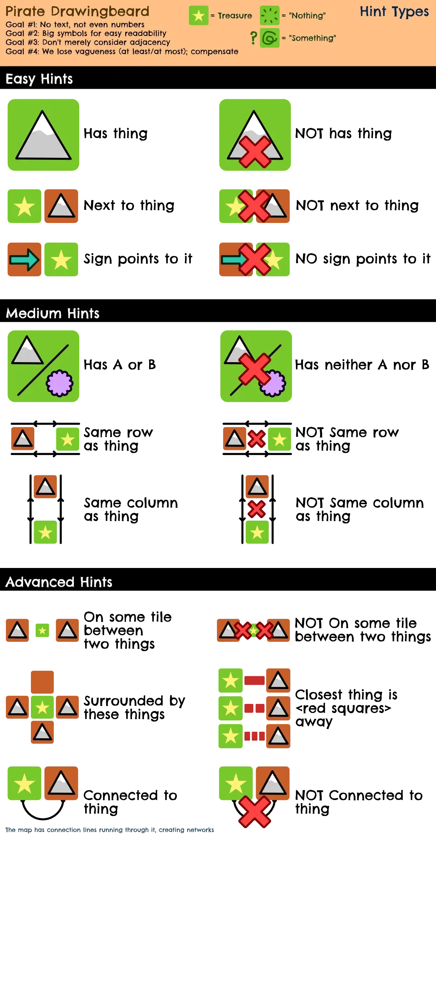

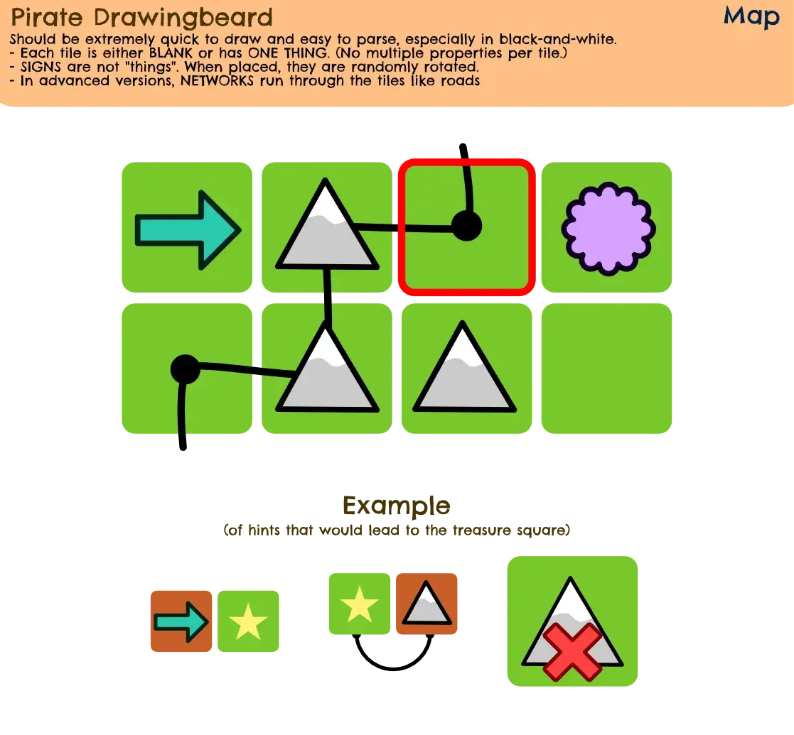

## Map

Being somewhat of a "kids version", I wanted this game to be more
tactile, perhaps use smaller maps.

After some consideration, I decided: **this game should be played with
physical tiles.**

So you can:

-   Either download the material PDF, print and cut it, and reuse that
    for all games from now on.

-   Or grab an empty piece of paper, draw the board, and cut out the
    individual tiles.

Yes, the minor disadvantage is that you need scissors at some point.

But that doesn't outweigh all the advantages!

### Advantage #1: Better main action

Firstly, the "propose/change" action from the original game can be
improved. This is how the original works:

**PROPOSE: Pick a tile (A). Propose to change anything about the tile,
whatever you want. Pick a tile (B). Ask players if changing A changed
whether the treasure could be in B.**

The idea behind this is that you can slowly test what hints other
players have. Remove a flower from a tile, check a tile close to it. If
somebody says "yes, that changes my answer", you know their hint has
*something* to do with flowers and distance.

But the action is a *bit* hard to grasp the first time you play. I mean,
you really need the image from the rulebook to understand how it works.
The text explanation is a bit clunky.

This can be changed to a **"swap" action.**

**SWAP: Pick two tiles. Swap them. Now ask players if this changes if
the treasure could be in the first or second tile.**

The game becomes more tactile, less static. Swapping is an easy way to
limit the theories players can test, without limiting it *too much*.

Want to test if a flower has an impact? Find a flower tile to swap with.

However, because people respond to *both tiles*, there's also a sense of
uncertainty to the result ... unless you're smart about picking tiles.

### Advantage #2: Rotation

Okay, so we have a map with individual tiles. Each tile is *one thing,
and one thing only.* Hints are mostly about the tile itself or the ones
next to it.

This simplifies the game. It also reduces our options.

I wanted to have hints that *don't* just check your neighbor tiles. I
wanted to have an easy way to change what a tile does exactly.

Well, the answer is *rotation*.

Some tile types behave differently when *rotated*. The easiest example
is the **arrow**: it will point in a certain direction, and it's easy to
create hints like "the treasure has an arrow pointing at it".

### Let's create random maps

These maps should be *way* simpler than Riddlebeard's maps.

-   Create a grid

-   Randomly predetermine what tile types we want to place.

-   Each tile knows two things: what it IS and how it's ROTATED.

-   Simply loop through the list and place the stuff we predetermined.

*Is it that small?* Not really. I've learned from the other game to save
a bunch of other data in the cells themselves (to optimize performance
*and* because we need a bot player in solo mode that requires this). So,
right from the start, each cell also knows: if it's at the edge, what
cells are its neighbors, its own coordinates, what happens if you change
the cells around it, etcetera.

*Why predetermine?* It gives far greater control than picking randomly
when we create the cell.

For example, we could say "we want at least 1 tile of each type", so we
add *one of each type* to the predetermined list. Before assigning, we
shuffle the list. Now, no matter what happens, we know that rule is
obeyed and the map somewhat balanced.

I thought about "growing" groups of similar tiles again. But that
doesn't really make sense on such small maps, where the tiles are *not*
nature elements (those can't be rotated and still look right). So I
didn't.

Which begs the question: what *is* the theme of the game? What *are* the
tiles?

Functionally, it'd be ideal to just use abstract shapes (triangle,
square, arrow, ...)

Visually, that'd be terrible, certainly not attractive for
kids/families.

In the end, I settled on the **standard things you'd expect in a
treasure hunt.** Treasure, compass, map, key, an island, palm trees,
that kind of stuff.

There was just enough there for me to implement what I want. And it
ensures any player understands the general idea of the game.

### Advanced Idea: Networks

In my original sketches, you see the idea of **networks**. Tiles being
connected by lines running through them.

It's a great way to add another dimension, without making the game
visually complicated.

(It would be an advanced expansion: it's harder to see if something is
connected on the network, than to check if it's adjacent to something.)

But if we're using *separate tiles* ... how on earth will we do that?

The best we can do is *print network lines on the tiles themselves*, but
that'd mean we need to write an algorithm that ensures these lines all
match up on the final map. Not going to happen.

In that case, this game mode would only work if you play the *online
way* (because then you can just draw them on your paper).

Even then, swapping tiles has a low chance of the networks neatly
matching. But that isn't necessarily an issue, as you might want to
purposely *break* a connection.

An alternative is to make these connections separate tokens to place in
between tiles. But that's just a nightmare waiting to happen: any time
you swap tiles, you need to lift that network, then put it back. And
we'd need extra rules for how to swap/change/interact with *those*
tokens. And it'd be more material. A no go.

As such, I implemented network generation like this:

-   Start somewhere at the edge. Do a random walk into the map, saving
    the tiles and directions.

-   Now do more random walks, but they may also start from tiles inside
    the map (which we walked through before, already connected to the
    network)

-   Visualize all this by drawing lines between the points.

-   Save which neighbors we're connected with *on the cell itself*.

-   (To check if two cells are connected via the network, we simply loop
    through our connected neighbors, then *their* connected neighbors,
    and so forth until we either find the other cell or we've checked
    everything.)

This is okay for now. We'll improve later if needed.

### The result

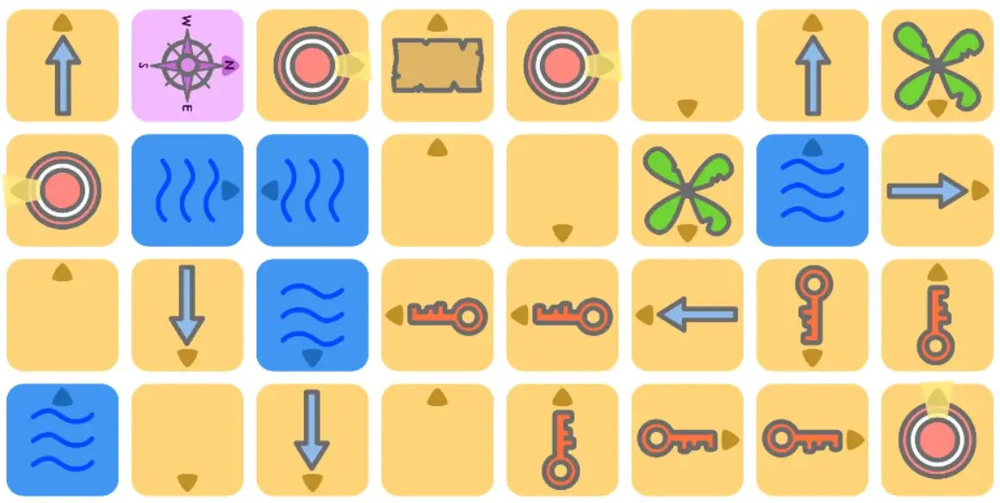

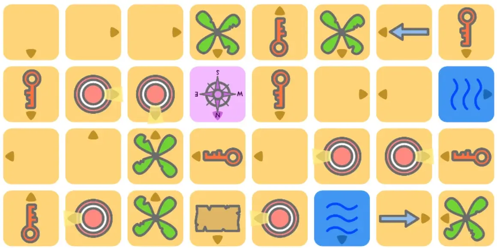

I think they look great already.

That little triangle on each tile is a very clear way to indicate the
*rotation* of a tile. I also tried to make it line up with stuff (like
the arrow).

I think only minor improvements to the maps are needed now. (More tile
types, row/column information, debugging tools for myself.)

Finally, I had the idea of placing things on the *edges* of tiles, and
creating hints about whether they line up, or point to something,
etcetera. But I'm not sure if this will become a thing, as it seems like
it would mess with visual clarity. That's a worry for later.

## Hints

The hints are completely *visual* to the player.

But behind the scenes, they obviously still need to be text, as computer
code is also text and requires that.

As opposed to the original, our possible hints are simplified though,
which allows simplifying the implementation.

**All hints are only about whether something IS or ISN'T true.**

We never need to calculate something or fill in a value dynamically.

Additionally, the original has *two* different algorithms (I wanted to
try both), but we can just use the one I liked most here.

### The general system

The result is a system as follows.

We have a dictionary with all the hints:

-   Each hint has an id

-   It has a list of parameters and *all they can be.* For example:
    "type" means the parameter must be a tile type.

-   It has a parameter "negated" that's either true or false.

-   It has optional parameters that do stuff like: limit how often the
    hint can occur, ensure all parameters are different from each other,
    etcetera.

At the start, we pick our treasure location, then generate *all*
possible hints for it.

-   When building a hint, we check its id.

-   We do whatever calculation is necessary. (This is custom code per
    hint, this is the meat of the logic.)

-   And then we check the end result with the real result.

-   (Remember, all we're doing is checking if some statement is *true or
    false*, then adding a "NOT" if false. No other possible values, no
    inverse, or "greater than" hints, or whatever.)

Once we have that, we simply pick random hints until exactly *one*
square remains ( = the one we chose at the start).

If we're happy with that, we're done!

If not (too few hints, too many, whatever) we try again!

When displaying the hint, we simply pick an image based on its id,
overlay it with images for each parameter, and add a big red cross if
it's negated. (I make it sound simpler than it is. It's not. There are
many edge cases. But this is the general, summarized idea.)

### What to look out for

These hints are way stricter and more precise than in the original.

Hints with vagueness like "*at most* 3 trees within 2 spaces" are not
part of this game. Something is either true or not true!

So my biggest fear is that this simply makes the game too easy *or*
unplayable. The hints are so strict that it will barely need more than
one or two to find the treasure.

Besides that, I immediately implemented improvements I also added to the
original:

-   Assign hints to players so that they don't have two within the same
    category.

-   Count how many possible tiles remain: ensure this is *roughly equal*
    between players (so nobody has a clear head start)

-   Check if somebody has a useless hint.

And lastly, I mentioned I wanted to split the *visualization* and the
*logic*. In the original game, this is all one huge file, which is only
active when the Phaser game is running.

Now I split the map generation into its own object/file, and the hint
generation into its own object/file. Cleaner, shorter, more flexible.

Once my business with the Phaser game is done (drawing the map to the
canvas and saving that image), I can completely shut it off *without*
losing access to the game data and the functionality of checking hints.

### My fears came true

With such specific (and simple) hints, generation takes a *looooong*
time to find something, because the hints are very unbalanced: some
players literally have 3 tiles left over from the start, others have 30.

This happens 99% of the time, so I can't brute force my way through
that.

What to do?

**Solution #1:** I thought, and thought, then realized something: the
whole problem comes from hints being *too powerful*. One hint leaving
only, like, a handful of tiles out of the full map.

We can simply *not choose those hints*.

When generating our hint list, we simply check how much a hint removes
when given the whole map, and discard any hint that leaves only 10 or
fewer tiles.

I wish I'd realized this sooner. This is really powerful!

We can always stack *more* hints on top of each other to lower the
number of options left, but we can't make a hint "less powerful"
retroactively. By already stripping the strongest hints (for a specific
location), we suddenly make the generation very happy.

(I also implemented the reverse: don't consider hints that only remove
one or even zero tiles. I never realized it before, but they do exist of
course: hints that are true for the treasure location ... but also true
for *literally all other tiles*. Those are useless.)

**Solution #2:** Right now, I have two categories with only *one* hint
type. I was being stupid, because that means the generation will
*always* choose that hint (because it tries to alternate between
categories for diversity).

That means that it either finds a solution on the first try ... or keeps
rehashing an almost identical set of hints and failing hundreds of
times.

The solution is simply to add more possible hints to those categories.
(And forget about alternating if a category has too few entries.)

**Solution #3:** I made the hint distribution a bit smarter. Currently
it assigns hints and *then*, afterwards, checks if everything is fair.

I can, instead, do that *while* assigning hints.

-   Keep a list of "possible tiles" for all players.

-   For each hint, go through all players and try the hint on their
    list.

-   Find the player that, when given the hint, creates the fairest
    situation. In general, this is the player who is furthest behind the
    others (in terms of "tiles left over").

This way, we keep the number of starting options as high as possible for
each player, and already balance/check while generating the hints.

And with all those changes, everything works very smoothly!

### The result: written hints

First, we need hints to work *behind the scenes* and output some written
text for me to check.

That's working now. Let's see:

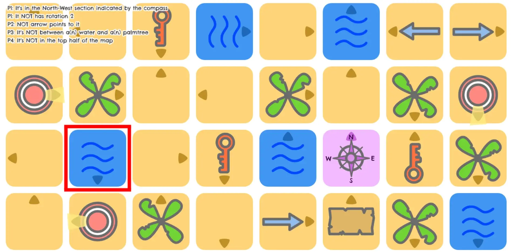

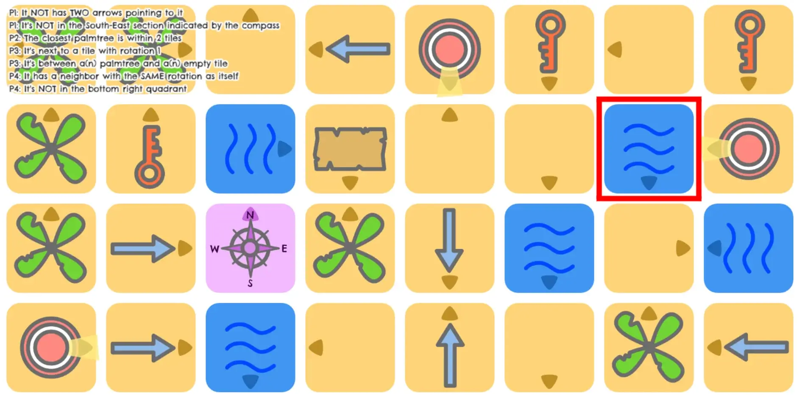

### Visualizing the hints

This proved trickier than expected. (Then again, I keep expecting things
to be way easier than I have any reason to.)

Different hints have very different requirements.

-   Sometimes the red cross (to indicate NOT) is centered, sometimes
    it's off to a side and smaller (because that looks much cleaner), it
    can be anywhere.

-   Similarly, some hints only have *one* type ("the treasure is on a
    KEY"), others have multiple ("the treasure is on a KEY or PALM
    TREE")

I also didn't want to redraw the hint every time it was requested.

I wanted to *draw all the hints once, save them as images, then reuse as
needed*.

The common thread is that the hints are *square* and use the same *set
of sprites.*

After some consideration, I opted for the following:

-   Ignore Phaser / the map generation code.

-   Instead, use vanilla JavaScript to create many small square
    canvases, invisible to the player.

-   On each canvas, draw a hint, then save as an image.

-   (We do them all at the same time because it's faster.)

Each hint has a "layers" property where I manually specified which
sprites and frames to layer on top of each other (and at which
position/scale/rotation). At the end, if the hint is negated (it has a
NOT in it), it places a big red cross over it.

Now we have an array with all the hints, per player, as images.

We can place these back into the generation code when we want a nice PDF
with hint cards.

Or we can display them in the interface when players are playing
digitally.

### The result

For now, I'm just throwing the hint images in the HTML and display them
above the map, for debugging purposes.

Here's what it looks like:

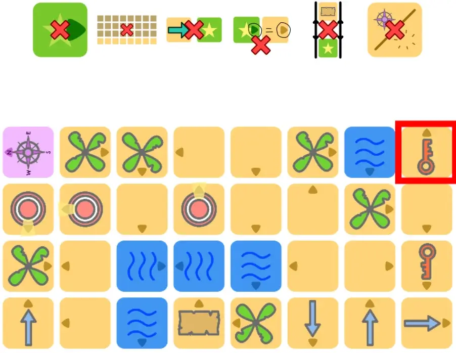

I think that's pretty nice :) I'm not sure about the clarity of some
hints, but I can always change that later. The important thing is that
it completely generates a game (map + hint images) within 5 seconds.

## Some issues & improvements

### Water

I thought it'd look nicer and more natural if water only appeared near
the edges. Then the map would really look like an island in the ocean.

A simple change, but I wanted to add this as an option.

When generation starts, it spawns a few water tiles at the edge. Then it
*extends* existing water tiles (by converting a neighbor into water) a
few times until it's happy.

This leads to very natural water surrounding the map.

Additionally, I decided to make water tiles really a "special type", so
they have a type (water, duh) and a rotation ... but nothing else.
Anything else a tile can be, especially in the expansions, is simply not
possible for water.

It just looked and felt better/simpler that way.

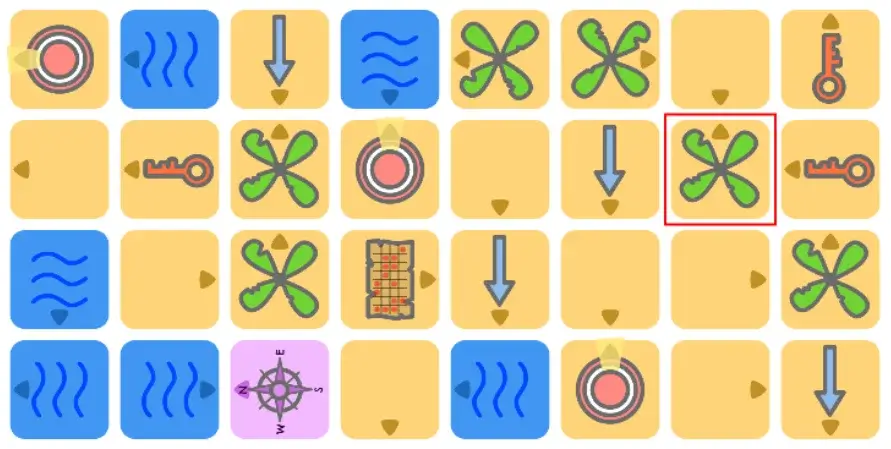

### Redundant Hints

The whole idea of the game is that *there's overlap between the tiles a
hint marks as "could be the treasure".* So there isn't any check on how
much hints overlap.

Unfortunately, though, with certain hints there's a good chance that
**one of them produces a subset of the other.**

For example: hint A leaves 5 tiles. Hint B leaves *the same 5 tiles*,
but also a handful of other tiles. Hint A is a *subset* of hint B, as
they say exactly the same thing, but hint A is simply more specific. And
thus better.

This makes hint B completely redundant. The player getting it will feel
a bit betrayed once they realize hint A exists.

Let's forbid this!

At first, I wrote a simple loop:

-   Loop through the new list of options (for the current hint we're
    evaluating)

-   Check it against the lists for all previous hints.

-   If we are a subset of them (all our tiles can be found in their list
    as well), forbid this hint.

This, however, is *expensive*!

We need to loop through *loads of lists, multiple times, for every
hint*.

**For example:** with 4 hints, on average 20 tiles per list, we're
already looping 20\*20 + 20\*20\*20 + 20\*20\*20\*20 = 168400 times. Not
great. Even if we use some basic techniques to *break* out of the loop
early (if an element doesn't match between the smaller and the bigger
list), it is slow. A quick test shows it has to do \~1200 loops for the
last hint, regularly, and already \~200 loops for the first hint.

How do we solve this?

I realized that these lists are *sorted the same*. Each hint grabs the
same list of *all tiles* and strips it, maintaining order. Which means
two things:

-   We only need to *look ahead* for matches, never back. (Because, if a
    match exists, it will be *later* in the sorted list.)

-   When we realize our *larger list* has become *too small* to fit all
    remaining elements of the *smaller list*, we can immediately stop. A
    subset has become impossible.

It's not a 100% solution, but it's *way way faster in most cases.* Most
lists will stop checking after a few elements, maybe even before it
starts.

**For example:** The highest values I'm finding now are \~150 loops for
the last hint in the list, but even that is rare. It's often near 10-20
loops.

(There was a bug that eluded me for the longest time. The answer was, as
always with these bugs, me being absolutely stupid. I checked redundancy
when generating the *full list*. This is obviously expensive and you're
sure to find loads of redundancy when checking *hundreds of similar
hints*. Additionally, these hints are generated in a fixed order, so
this would *always* throw away the same hints.

The solution was, of course, to check redundancy when picking the
*actual final hints*. Way fewer checks to make. It actually makes sense.
This list is randomized. All was fine again with the world.)

### Edge Symbols

I finally figured out what I wanted the last (advanced) map element to
be.

They are symbols (circle, square, or a sort of combination of both)
placed at the *edges* of tiles.

The hints about them are very basic: a neighbor has a specific symbol,
symbols match (which is very satisfying, when two edges line up with the
same symbol), etcetera.

It's different enough to include, yet it's not too complex and doesn't
create too much visual chaos.

(Especially because I did my best to push them as far into the edge as
possible, leaving enough whitespace around the tile type icon.)

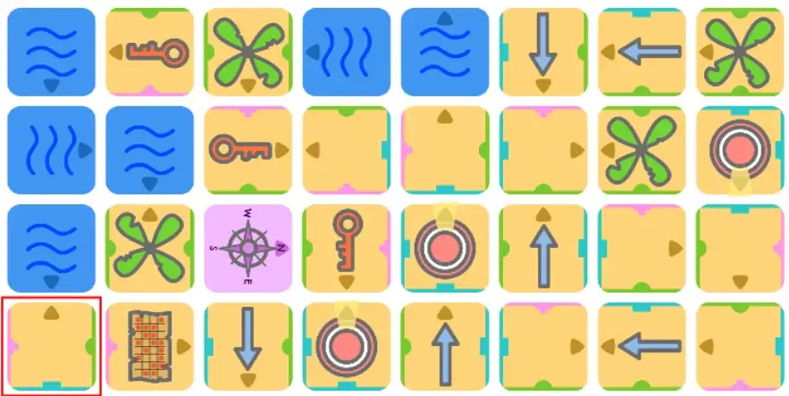

### Speed & Optimizations

The algorithm is reasonably fast. Can find something within the blink of
an eye, but takes a few seconds on average.

Some of that is due to my debugging: logging loads of stuff + displaying
text on a canvas is *expensive*.

But almost 99% of the time it fails because of "too many hints" (it's
currently set at a maximum of 2 hints per player).

On the one hand: that's nice. It's more annoying if there's some vague
reason the algorithm is slow or can't find anything.

On the other hand: I don't really like giving players 3+ hints.

So this seems the solution: add an *option* to create more hints per
player and say that this *usually* speeds up generation.

It's the best I can do :p Really, it's not big deal. Getting a fully
completed, functional game in 8 seconds tops is fine.

### Rules

I decided to include *all* possible hints + a (detailed) *textual*
explanation in the rules.

Some of them just can't be expressed in a way that I'm *certain* players
understand it correctly. And it'd be really stupid if people play the
game incorrectly because they are scratching their head about what a
symbol means.

So I wrote a script to download the generated image for *all* hints.
Then I just have to arrange those in a two-column layout, and use the
second column for a precise explanation of the hint. (And an example if
possible.)

This will become an "appendix" though. It's 3 full pages for *all* the
hints. Don't want that in the flow of the main rules.

(Fun fact: browsers do not like it when you queue 100 simultaneous image
downloads. I ended up learning how to zip dynamic webpage files and
download them. Which, to be honest, was the better solution to begin
with :p)

### Networks

Right now, networks were ... fine, but too chaotic.

It was perfectly possible for a map to just have *one giant network*. Or
a very tiny one somewhere in the corner.

This doesn't look great, but is also bad for hints. If there is only
*one network*, all the specific network hints become *pointless*. ("It's
connected to a tile with rotation 0" simply means "It's connected to the
one big network".)

So I needed a way to ensure we had 2 different networks (maybe even
more) and that they weren't too close or didn't accidentally go through
each other somewhere.

I invented **"network poison".** One in every 4 random walks that we
take (to generate the network) becomes poisoned. It will *not* connect
to existing tiles on a network, nor will it allow later random walks to
connect to *them*.

They are poison. Everyone stays away.

This way, the first two random walks will surely be different. After
that, it depends on how long the walks are/what random network length
we've chosen.

(With 50% chance, instead of starting on a new tile, a random walk
extends an existing one. It only does this, obviously, for the
non-poisoned ones.)

This generates separate networks that usually look good and are a good
length. The hints about them are now useful again.

(I still added a check to be sure though. If a network hint leaves a
list of options that's equal to the total number of *network tiles* (or
close to it), I deem it a bad hint and skip it.)

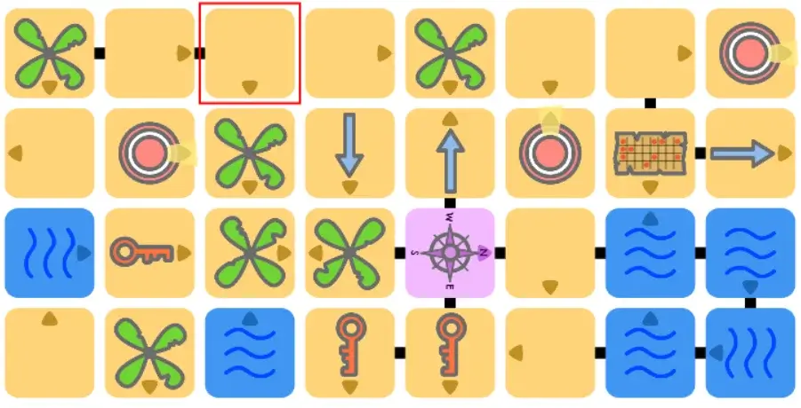

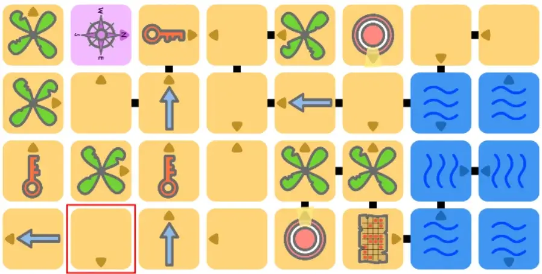

## Finalizing the game

### Settings

I've learned that it's (usually) good to leave everything to the player,
but start with sensible defaults.

As such, almost all hint/map elements are *optional* or *expansions*:
rotation, edge symbols, networks, special stuff (like the compass).

Yes, even rotation. Again, my experience tells me that a first game
should always be *as simple as it can be*. Using only the two easiest
hint types (*tile type* and *row/column*) seems the best way to be
introduced to the game and learn it.

Other settings are:

-   **MultiHint:** by default, it tries to give each player *one* hint.
    Enabling this allows up to three. (As discussed before, this speeds
    up generation as well.)

-   **Advanced:** some hints are harder to grasp/calculate, so they are
    only added when this is enabled.

-   **Use Real Material:** enable this when you're reusing the material
    you printed and cut out. It limits generation to how much you have
    of each type and what those fixed tiles look like.

-   **For Printing:** puts the generated game into a PDF (map + hint
    cards) you can save and use later. (I use this option myself to
    create the "premade games" that I usually offer.)

-   **Colored:** creates colored boards instead of black-and-white
    ("inkfriendly") ones.

This game was meant as the simplest and most "kid friendly" of the whole
bundle of deduction games I'm planning.

As such, there are no real "expansions" or "advanced rules" or anything.

I thought about it. For example, certain tile types might *block* arrows
pointing at stuff. Maybe other tiles must be *rotated* when you use them
in the swap action.

There are interesting ideas. But none of them necessary for the game.
And none of them reward the amount of complexity they'd add.

(Fun fact: I ended up using the idea of a "material limit" on all maps,
even the digital ones, because it creates much more natural and balanced
maps. It's just applied more loosely.)

### Botbeard

I've learned from my mistakes.

With *Pirate Riddlebeard*, I only added a bot at the end. The code
wasn't set up for it. It works, but it's not ideal, and took longer than
I wanted.

With this game, I keep complete access to the map and all its
functionality. Such as ... testing if a hint is true or not!

So Botbeard can fully respond to your actions! If you choose "swap", you
input the tiles in the interface, and it can just quickly calculate your
answer and give it back.

I thought about giving Botbeard actual *turns*. Maybe even letting them
win.

On their turn, they might ask you about a specific tile, and you tell
them what you know.

But it seems pointless. The computer *already knows the answer, and the
hints, and the map*. It generated all of that. And there's no way for
*you* to outplay it or add strategy.

So you'd just be pointlessly telling the computer random tiles they
already know.

There was one other thought that seemed to make sense.

At the end of your turn, you must reveal your answer to one of the
tiles, and are always allowed to dig.

This is something *you choose* and that's already in the game. So I can
add a button to tell Botbeard which tiles you interacted with.

Based on that, I can do a rough calculation of when Botbeard *would*
have won: when you've given away too much information, played for too
long. This would add a time limit to this mode.

But when thinking about it even longer, this also didn't seem fun.
You're playing this game, maybe alone, maybe with two players. You're
close to cracking the code, working on it for 45 minutes ... and then
Botbeard just says "hey, you took to long, I win"

Not great, eh?

The original system was the best: **Botbeard has no turns and cannot
win.** It simply responds to your actions and gives away the information
you request.

**Having Botbeard implemented, though, we can test the usefulness of the
SWAP action!**

First I did some manual testing. Loaded a game, did the SWAP action many
times, checked how often I received a "yes, it changed!" It felt on the
low side, but still "often enough".

So I decided to do some more robust calculations.

I wrote some code to randomly swap 100 pairs of tiles and record how
many times that changed the outcome of one (or both) of those tiles.

On average, the result was around 30 "flips". So, 1/3 of the time, when
using a swap action on one player, they'll say yes. Which is great!

However, it did occur quite often that there were 0 flips. Yes, *zero*.
This seemed odd to me. So I checked which hints Botbeard had, and hit
myself in the face because of my stupidity.

Of course, this happens when your hint is "the tile IS (not) something".
Swapping any pair of tiles will not change *the tile itself*, so of
course this never changes your answer.

At first, I thought this was a problem, and I needed an extra action (or
some more rules) to fix it.

But then I realized it was actually a feature. You see, there are only
four hints *in the whole game* that can't change by swapping:

-   Tile IS (NOT) something

-   Tile HAS (NOT) some rotation

-   Tile HAS (NOT) some symbol

-   Tile HAS (NOT) multiple symbols

So when a player keeps saying *no* to everything, this is also good
information, and tells you the hint is probably about the tile itself
and nothing else.

Combine this with the fact that players have to give away one of their
tiles after each turn, and I think this is actually fine.

I can massage the problem a bit through code, though: mark these four
hints as "swapResistant" and only allow picking *one* (at most) per
game. (If two or more players react with "no" to everything, the game
stops being fun quickly. And is either very easy to figure out, or very
hard.)

### Optimization

After running many tests, I realized a major performance hog which had
almost no benefit.

When selecting hints *fails* for a map, I retry 20 times, before
completely changing the map and starting again.

Well, those 20 retries only yielded a result \<1% of the time. Yet they
can take half a second to complete.

So I simply lowered it to a single retry. And it's much faster now.
Which is great, because I was really starting to worry.

(It's still slower than I'd like. But I cannot find any ways to speed it
up anymore. It's a byproduct of maps being very simple and hints being
very exact, instead of the more varied maps with vague hints from the
original game.)

### Finishing Touches

Some of the hints were a bit inconsistent in terms of iconography. I
tried to make them as clear as possible.

I added a hook to the top left corner of the map (and all hints that do
something with the whole map). When playtesting the previous game, I
realized that some players would view the map *upside down* (or at an
angle), and not being sure which orientation to work with was a bit of
an issue.

I added a button so you can *always* view the map again within the
interface. (With *Pirate Riddlebeard*, for some reason, you only view
the map once at the start and then it disappears. Might need to change
that.)

Small stuff like that. I think I've covered everything now.

Here are pictures of the final maps, including visual hints and expansions.

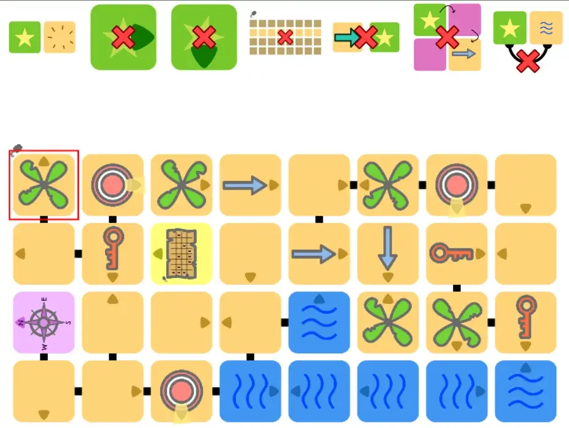

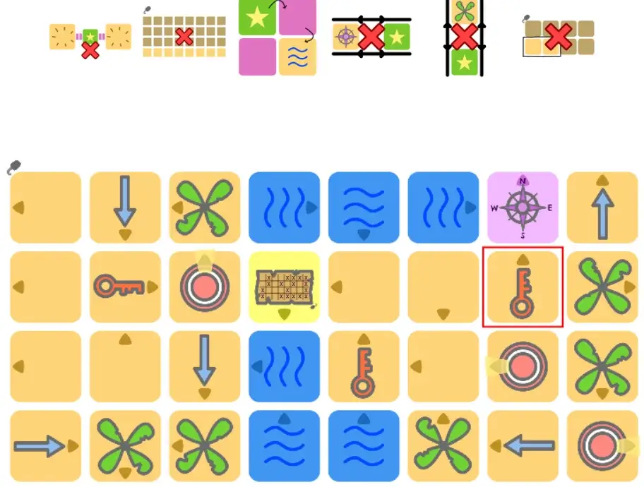

## Testing & Improving

Being a simplified version of a game idea I already made, we're already
at the "test and finish" stage. (I keep saying "already" as if the
devlog isn't already 5,000 words long. Making games is *hard* and takes
a long time.)

### Timing

First the **timing test**. How long does it take to go from a *blank
paper* to *we can play the game*? It takes me roughly 5 minutes:

-   **1 minute** to fold the paper

-   **3 minutes** to copy the map

-   **1 minute** to cut all the tiles

I try to time these at a regular, casual pace. No "tricks" to go faster.
In fact, my workspace is very small and cluttered, so my biggest enemy
is actually finding the room and angles for writing and cutting :p

I find this acceptable. You only need 5 minutes + some device +
paper/pens to setup a game that will last you 30-60 minutes. (The other
modes are all faster, as you reuse material or print something
beforehand.)

Of course, some extra time is needed to copy the *hints* in this case as
well. But that depends on the players themselves and the player count,
and is negligible in all cases. (Players will usually have one or two
hints that are just a simple icon.)

### Practical stuff

The rules are very simple and clear. It plays the same as Riddlebeard,
only faster and smoother. The chance of winning early at random is
slightly higher, but not much, and an unavoidable consequence of simpler
rules.

One minor setback is the main swapping action. When reusing material,
you obviously don't *write* on the tiles. You place tokens to indicate
player's answers for tiles.

This becomes a bit annoying when you start to *swap* tiles, as you need
to move the tokens with them *or* place them to the side for a bit. It's
nothing major, but it could be better.

But I see no solution for this, so we'll have to accept it (and maybe
solve this with the next variant).

### Playing

The game works!

It accomplishes exactly what it wants: a simpler, faster, more
streamlined, kidfriendly, improved version of Riddlebeard.

That's the huge benefit of creating variants on game ideas you already
spent a long time developing and improving.

## Conclusion

There are still some things I'd like to improve in the next variant,
though:

-   The main action ("swap") feels like it could be further simplified.
    Especially when it becomes impractical as well.

-   Drawn hints aren't all 100% clear, while at the same time being
    quite *simple*. I'd like to change the setup so that drawn hints
    don't need any explanation (or lead to any confusion), but allow
    *some* numbers or text to allow more complicated hints.

-   The game is only competitive. I'd like to add a cooperative mode as
    well.

-   Square/grid maps are boring and overdone. I want to try a more
    dynamic graph map.

So this is it for Pirate Drawingbeard.

But the points above will probably be implemented in the next variant,
called *Pirate Spacebeard* (name might be changed) :p

Until the next devlog,

Pandaqi
