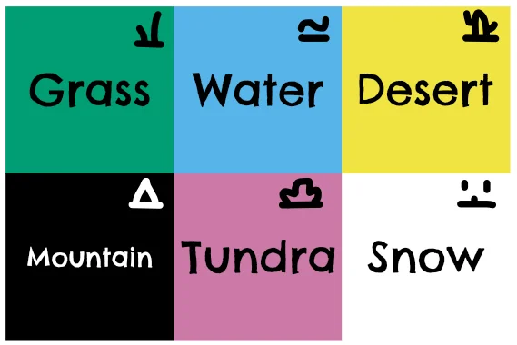
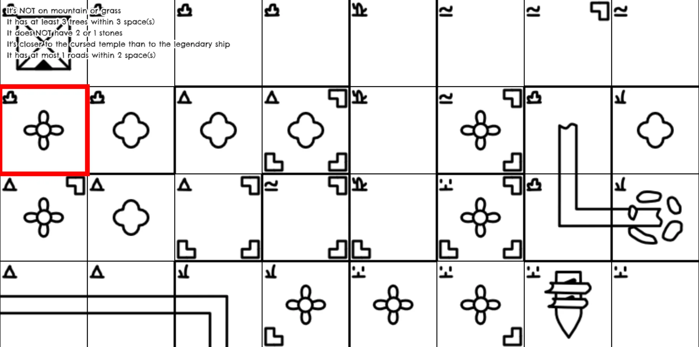
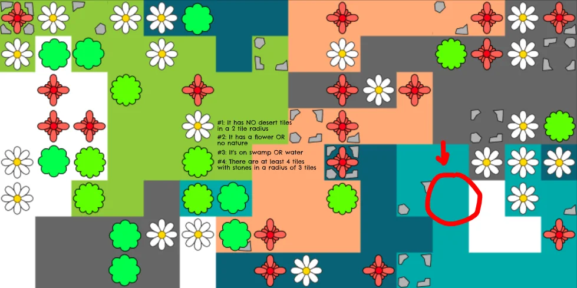
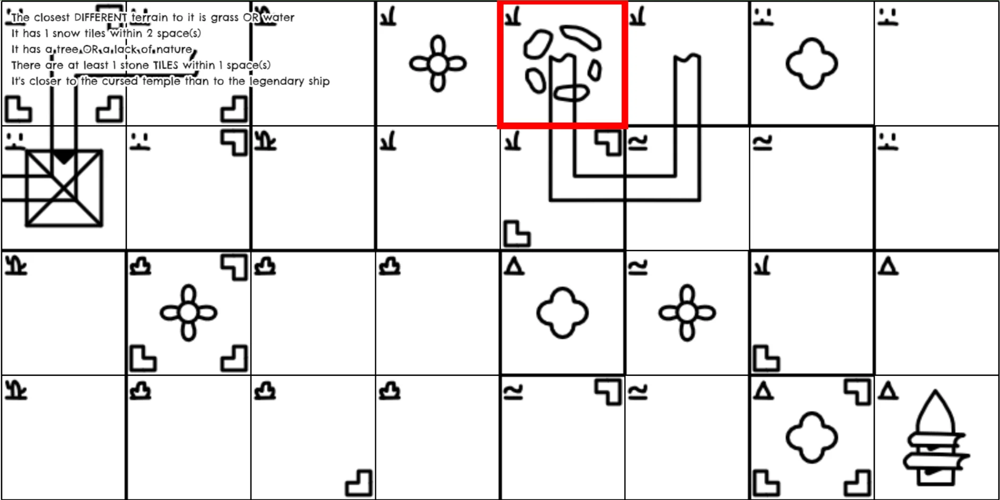
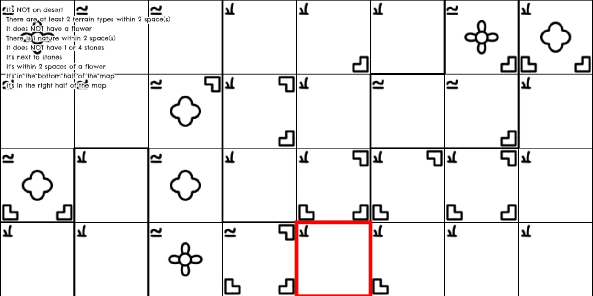
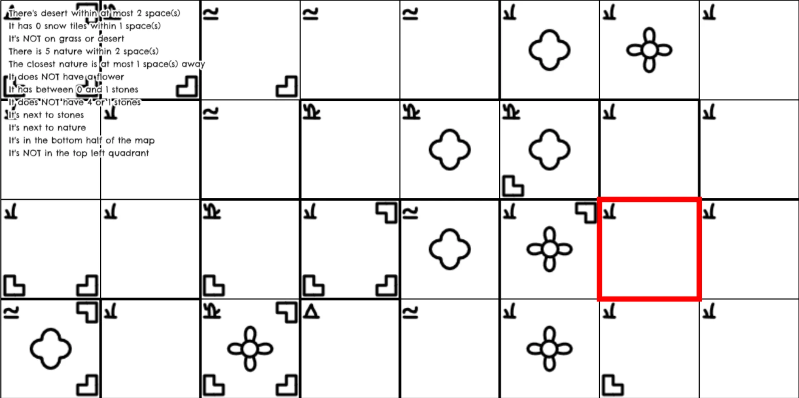

This is a devlog for my game ["Pirate Riddlebeard"](https://pandaqi.com/pirate-riddlebeard)

A large chunk of the work in this game went into writing the *algorithm*
that generates the games. I wrote a separate article about that:
**Deduction Boardgames** (link will appear when the article is done)

This article is mostly about the _game design_, although the algorithm is obviously a core part of the game, so these two are intertwined. Let's take a look!

## Creating the Map

Like all my games, I wanted this to be a "One Paper Game".

Something you could fully play if you had a few empty pieces of paper
and a pen.

As such, there are actually *two* map generators.

**Type #1:** fully colored and illustrated. This one is used if you
intend to *print* the board and play the game in a more traditional way.
(This is Pandaqi from the future: this version might actually be redrawn, because I don't like how it looks now)

**Type #2:** black-and-white with icons. This one is way easier to copy
to a blank piece of paper. (Or if you want to conserve ink.)

What do we need?

-   Terrains => just a color that fills the whole tile

-   Nature => trees or flowers

-   Stones => 0 to 4 stones can be on a cell

-   Roads => one or two random roads can wiggle around the terrain

-   Landmarks => 0-3 special landmarks might be placed (in total)

The idea for the "stones" is that I can show them in the *corners*,
while any other element (road/nature/landmark) is shown *in the middle*.

This way, I can easily combine multiple things on the same tile, without
them obscuring each other.

### Picking a Size

What size should the map be, in terms of width/height (in tiles)?

At first, I used 16x8. It gives 128 tiles, which is slightly more than
for example the game *Cryptid* uses. It gives nice *square* tiles if you
fold a standard piece of paper.

But it was just too much!

The icons didn't fit inside the square half the time. It was
overwhelming to look at. It took forever to copy to our own paper (never
mind the *folding* that also took more time than you'd like).

I shrunk it to a 8x8 map. You can get this by folding a paper 3 times
(both horizontally and vertically). It gives enough space to:

-   Clearly show terrain and other elements

-   And leave space to *write* within the tiles yourself.

I was afraid it wouldn't be able to find large enough sets of hints. But
in practice, resizing the map barely made a difference for the
algorithms. Nice!

This smaller map is way more accessible and useful.

**In fact**, I can even shrink it to an 8x4 map, and it still generates
perfectly fine games. (That's the power of general algorithms that
should always work.) This might be a setting for "first game", or maybe
when playing with kids.

**This is Pandaqi from the future**: I was so, so naive. This game needs an 8x4 map and _nothing bigger than that_. It's not a "first game" or "kids version", it's the actual game. Bigger boards are just too hard, too many variables, too tough to generate (once all expansions and checks are added). So yeah, from now on you'll only see 8x4 maps, as I realized somewhere during the process that it's by far the best way to go.

### Picking Terrains

**Visuals:** I've been looking into "accessibility" (for games) more and
more over the years.

As such, I *started* with a "colorblind friendly palette" and just tried
to match reasonable terrains to those colors. (If *you* can see colors
just fine, it's easy to forget that roughly 1 in 12 men are colorblind.
This means there's a good chance that once every three 4-player games,
there's a colorblind person.)

But how do we display terrains on the black-and-white variant? The best
option I could think of, was simply drawing an *icon* in the top-left
corner.

In the code, there are two different images: one with all the sprites
for the *colored* version, and another with all the icons for the
*black-and-white* version.

**Placement:** The first version of the map used standard *Perlin
noise*. (This is a common technique that generates a "smooth noisemap"
which can be made to look like realistic terrain.)

But, we only have a *very limited* number of squares. Not enough to be
"smooth"!

So I changed it to the "grow algorithm":

-   Start with an empty map

-   Set a few random squares to random terrains

-   Now *grow* these terrains, one tile at a time, until the whole map
    is filled.

We still get "areas" of terrain clumped together, but can also fit way
more diverse terrain on a small map.

**Improvement:** On the "print friendly" mode, seeing the terrains is a
bit harder than I'd like. (Especially if it's your first game and you're
unfamiliar with the symbols.)

So I wrote some code to create a *thick outline* around these terrain
groups. This makes it much easier to identify clumps of a specific
terrain.

The screenshot below is from the (almost) final version of the game. (I'm an idiot, I always start collecting content for devlogs too late.) So you can keep looking at it for the next few sections

### Creating Nature

**Visuals:** At first, I had two or three different variations of "tree"
and "flower" that were displayed randomly. (You can see this in the
original article.)

It was ugly, it was confusing, just a bad idea.

Instead, there is only ONE sprite for a tree and ONE sprite for a
flower.

However, to make the map prettier and more diverse, these sprites
slightly change based on the terrain which they are on. (On a snow
terrain, for example, you'd expect trees to be covered in snow.)

**Placement:** Again, I first used two Perlin noise maps. (One for
trees, one for flowers.)

Whenever they both overlapped, I cancelled them and displayed nothing.
This was bad! Most maps only had like 4 or 5 nature elements left.

But the alternative was equally bad: too *many* nature elements all over
the place.

So I did the same thing: change to the "grow algorithm".

-   Start by placing a few flowers and trees randomly.

-   Grow them one tile at a time.

-   Until I've reached some pseudo-random number that represents "how
    much nature we want"

### Creating Stones

**Visuals:** In my first version, I used fixed images for 0, 1, 2, 3,
and 4 stones.

Below is an example of what that looked like:

This is fine. But it was too static. Not pretty to see, and randomly
rotating these images didn't help either.

On top of that, I realized: if I draw a *terrain* icon in the top-left
corner ... we've lost that space and can't place a stone there anymore.

So on black-and-white maps, there could only be at most *three* stones
per square.

All of this forced me to simply create a few sprites of *individual
stones* and place those in available corners.

**Placement:** The first version picked a random number and then simply
placed stones that many times.

This was fine, but not great. You could end up with a map where *if a
tile had stones, it would have the maximum amount (4)*. Or a map where
the reverse happened: only *single stone* tiles.

Instead, you'd want a gradual decrease: many squares with *one stone*,
but very few with *four stones*.

That's what I did:

-   Place 10 single stones.

-   Place 6 double stones.

-   Place 3 triple stones.

-   Place 2 quadruple stones.

(There's some variation in the algorithm and more checks, but this is
the idea.)

### Creating Roads

**Visuals:** because roads are just a simple "expansion" to this game,
not some core element, I used the simplest sprites possible: only
*straight* or *curved*.

This means that a road cannot go back on itself, and different roads
cannot intersect. I'm fine with that. It only matters that *some tiles
have a road that looks enough like a road*.

**Placement:** just a random walk.

-   Start on a tile at the edge

-   Walk to a random valid neighbor. (It's valid if there isn't already
    a road.)

-   Continue until we have no options, or reached another edge of the
    map, or the road is long enough

While doing this, I can already save what *type* of road the cell has.
(Straight? Corner? Dead-end?)

### Creating Landmarks

**Visuals:** Just a simple drawing of what the landmark might represent.

**Placement:** Simply pick some from the list and place them wherever
you want.

I did write code to ensure they were *some space apart*, as that just
looks nicer and leads to nicer hints pointing to them.

### That's it?

Yeah. This is just a very small game idea I wanted to make. Mostly to
figure out the algorithm behind it.

So the maps needn't look amazing. And any more "patterns" or
"restrictions" we add, will only make the game worse, as it will quickly
eliminate many tiles as the possible location for the treasure.

(For example: if I write code to never place a *tree* in the *water*,
then the game immediately becomes easier. If you get a hint "the
treasure is on a tile with a tree", you *also* know the treasure isn't
in the water. Add a few of these restrictions to the map, and before you
know it, the whole game comes crashing down.)

## Creating the Rules

The core rules of the game are identical to how other "(logic) deduction
boardgames" do it. I see no reason to change it, as it's a very simple
idea that works perfect for this type of game.

### Setup

Print or copy the map to your paper.

Print or copy each player's individual hints to a piece of paper.

Start! (This is why I was so interested in these games. Really simple
rules, really simple setup.)

### Objective

You win by finding the treasure.

### Actions I

Each round, players can do the **DIGGING** action:

-   Pick any tile.

-   Ask the other players: "Could the treasure be here?"

-   They must answer **yes** or **no** (based on their hints)

-   Use that information as you want.

-   But if *everyone* agrees, then you've won, because that tile must
    have the treasure!

### My problems with this

This isn't good enough, for these reasons:

-   It's nothing more than a *pure deduction puzzle*, which will be won
    by whoever can think the fastest or is ready to calculate more.

-   It's very repetitive.

-   It's near impossible: you need a way to *share your literal hints*
    at some point

-   It's been done before, obviously, so we need something more.

Again, this was a quick side project, so I didn't want to inflate the
game to something more complex that would take tons of time.

I borrowed some ideas from other games again to get two more actions.

### Actions II

The **SCAN** action.

-   Pick an area of at most 9 tiles.

-   Ask ONE player: "Could the treasure be here?"

-   They must answer truthfully, but only for at most 4 tiles. *They*
    pick which ones they answer.

You can investigate more tiles at once, but at the cost of only getting
answers from *one* player.

Which tiles another person decides to answer can also give something
away.

### Actions III

The **CHALLENGE** action.

-   Pick at most 4 tiles.

-   Ask ONE player: "Could the treasure be here?"

-   They respond *in secret* by using some "yes/no" tokens.

-   You *predict* how many tokens will say yes.

-   You're correct? Great, you have this information that nobody else
    has!

-   You're wrong? You must make this information public *and* give away
    one of your hints to the player you challenged.

I'm not sure about this one. Maybe it should be an "expansion", not in
the core game. But I think it's definitely interesting.

### Other gameplay considerations

There were some clear issues:

-   The starting player (or "early players in a round") has an
    advantage.

-   As explained, there needed to be some way to exchange your *literal*
    hints over time.

-   You don't want people accidentally guessing the treasure by digging
    somewhere in the first round and winning the game.

So I added the "pirate council": **once every 3 rounds, the council
convenes.**

-   The start player shifts to the right.

-   You cannot DIG before the first council meeting is held.

-   At this meeting, you can trade hints with one other player.

The hint trading seems a bit too strong, but I'll keep it for now. I
want to introduce a few "expansions" or "variations" anyway, so I'll
figure it out when I create those.

## Testing

So yeah, that's all there is. As I said: most of this game is in the
*algorithms* generating the map and the hints pointing to the treasure.

Before I could test the game, though, I already saw some major
improvements.

### Improvement #1: Map Size

Remember how happy I was when I realized the game also works with way
smaller maps?

I already had the suspicion that copying the map to your paper would
take *way* too long on 8x8 or 16x8 maps.

And I was right. Very right.

I timed myself ... copying a 8x4 map. And it took 5 minutes. I wasn't
rushing, I was going normal pace, like I'd expect new players to be.
Still: **5 minutes.**

I really can't make maps much larger than this, or it stops being fun to
setup for a new game.

I find it extremely interesting that this *doesn't matter* for the
hints. No matter the size of the map, it still finds roughly the same
number of hints in roughly the same number of time.

So I'm completely fine with making the maps this small by default.

(*Why doesn't it matter?* I guess it's simply because the hints are all
about eliminating a certain category of tiles. "It's not in WATER or
DESERT" simply eliminates a bunch of water and desert tiles from the
solution.

When you shrink the map, the group you eliminate shrinks with it.
There'll still be some water and desert tiles, just less of them. Which
is exactly what you want, because the map itself is also smaller.

So, with the exception of a few very unique hint structures, the hints
scale automatically with the map size. Which is a great discovery!)

**This does increase the chance of winning by "random guessing".** There
are so few squares, you can accidentally win within the first few
rounds. How to solve?

-   We already have the rule: once every 3 rounds, there's a pirate
    council session. So let's use that.

-   New rule: you can only dig *once* in between council sessions

-   New action: add *something* else you can do which is always
    worthwhile. Idea: ask about a square of which you *know* it's not
    the treasure, due to your hints.

### Improvement #2: Hint Phrasing

The phrasing on the hints was inconsistent.

I was still figuring things out, which caused the hints to be written in
a very formal and expansive way: "There exists a MOUNTAIN tile within a
radius of 1 tiles"

We can shorten this to: "There's MOUNTAIN within 1 space."

(In the rulebook, I clarify that "X spaces" means "you can walk to it in
X steps", including a picture. It's just a shorter way to write
everything related to distance and size.)

On average, this made hints 3 or 4 words shorter, which is huge. Also,
they are now consistent.

### Improvement #3: Actually closing the game loop

I always forget this part.

I had a map, I had hints, but that's not enough to play a full game.

-   I needed an *interface* to set stuff like "how many players" and
    "difficulty level"

-   I needed to distribute the hints across those players and then
    **show them one at a time, to individual players.**

-   And lastly, I needed a button to reveal the treasure location once
    you're done with the game.

Boring UI stuff that's still vital if you want to play the game.

And distributing the hints across players was harder than I expected.

I realized that you **really do not want a single player to have
multiple hints in the same category.**

If one person has "it's NOT on water or desert" *and* "it's on desert or
mountain" ... they simply know the exact terrain of the treasure before
the game even started.

And it's boring, because their hints are very similar and they know
*nothing* of the other stuff that can be on the map.

As such, I had to

-   *Group* the hints based on category.

-   Alternate between players (first player 1, then player 2, ...)

-   Assigning the next hint each time

-   Until hints are exhausted

This way, if there are (for example) 3 terrain hints, they will be given
to player 1, 2 and 3 respectively. Nobody has multiple terrain hints.

### Improvement #4: Enough Hints

So far, the algorithm is satisfied if it can give each player one hint.
(Reasonable, of course, as players without hints would be pointless in
this game :p)

But ... the more I fleshed out the rules, the more a thing like "hint
trading" or "hint revealing" over time seemed necessary and useful.

If everyone only has a single hint, then there's no point to the game
anymore after you've traded it!

So everyone needs at least 2 hints for this to make the most sense.

Fortunately, my algorithms support this! I could just increase the
minimum hints it needs before it is happy, and it did exactly what I
wanted:

### No, wait, this is a real issue

As I got close to finishing the game so I could test it, I received more
and more confirmation that "accidental winning on first round" was a
huge deal.

Yes, I could invent actions that do *not* find the treasure (ask only
one player, scan an area of tiles instead of one, ...)

But I had no way to *force* players to use them, nor would that be fun
(in my experience).

I limited the "digging" action to "once in between council sessions".
But that wasn't a great solution:

-   Players would probably be annoyed that they had to do actions they
    didn't *want* to do in all the other rounds.

-   Players could still decide to just randomly guess each time their
    digging action is "renewed" and win quickly on accident.

No, the "digging" action should be even *more* premium. Too valuable to
waste on randomness.

-   Idea 1: you only have 2 or 3 digging actions per *game*. (And you
    can't dig before the first council session.)

-   Idea 2: you only have 1 digging action. Once used (and you weren't
    successful), you're out of the game.

    -   This was inspired by a different game: "Loot of Lima". I thought
        it would be too harsh, but that game showed that this *can* be a
        valid solution to the problem.

Then I realized that all my current actions were *completely public*.
Yes, you are the one asking, but the results are publicly shared among
all players.

If I add an action that can keep stuff secret, that would incentivize
players to go for it, and reduce the chance of winning very early.

After thinking about this for a while, I found a proper solution. There
are 4 actions:

-   **DIG**: only once per game. Pick a square, if everyone agrees,
    you've won.

-   **MISLEAD**: ask *one player* about *two squares*. They answer in
    secret.

-   **ASK**: ask *one player* about *three connected squares*. They
    answer publicly.

-   **SCAN**: ask *one player* about *four connected squares*. They
    answer publicly, but only with the total number of squares where the
    treasure could be.

In other words, it's up to you *how many squares you want to
investigate* and if you're willing to trade *secrecy* or *specific info*
for that.

With maps this small, and turns this quick/easy, I suspect games to be
rather short. So it's fine if somebody is out early: they are still
active, probably interested where the treasure is, and only need to wait
a few minutes.

### Pirate Riddlebeard

So far, the project was just called "Treasure Hunt" (and that's also the
leftover title you'll find in many places)

When I wrote an introduction for the rulebook, I improvised the name
"Pirate Riddleboard" and that he supposedly hid a treasure and left
behind a bunch of riddles to find it :p

This seemed a way better and more exciting name for the game than
something abstract like "Treasure Hunt" or "Treasure Puzzle" or
whatever.

So I changed it everywhere to this name.

## Actually playing it

*Finally*, we have a working website interface, fully functional maps
and hints generation, and a rulebook that seems 100% watertight.

(Making games is a *lot of work*. This is like the simplest thing I can
imagine, and it still took many more days than expected.)

Let's test it.

**It works great!**

Not perfect, of course, but it's very easy and fun to play, especially
for a "first version".

My test session was with 5 players, all completely new to the game of
course, with games lasting about an hour.

Usually, people figured out the treasure location roughly at the same
time, leading to tense moments near the end. There were some mistakes
(with interpreting hints or giving answers), but those were usually
corrected quickly or inconsequential. The treasure was always found by a
correct digging action.

### Issues & Solutions

What were the issues?

**Issue #1:** Whispering is a bit boring and overpowered. Of course,
having *private* information is way more useful than making it
*completely public*, so everybody chose that action all the time.

But it means that information is collected *very slowly*. And other
players just have nothing to do while another player whispers.

**Solution #1:** Make it less powerful, make other actions more
powerful.

-   Whisper? You only get to ask *one* square.

-   Ask? You may ask *three* squares.

-   Scan? You may ask *five* squares.

Still that nice progression (1 -- 3 -- 5) that's easy to remember. But
no reason to whisper a lot.

**Issue #2:** The start player has both a huge advantage and a huge
disadvantage.

They get to go first, giving them a head start for digging actions. But
they also need to take their *action* earlier, so players after them can
wait what happens and then take *more informed actions*.

**Solution #2:**

-   Start player should be rotated more quickly.

-   You can only whisper *once* per round. The start player could decide
    to whisper, taking it away from anyone else. At the same time,
    whisper is weak enough now to make this an actually tough strategic
    decision.

**Issue/Solution #3:** Continuing on that, the pirate council should
convene after *every round*. (Not once every 2 or 3 rounds, that's just
too slow).

Hint sharing is really useful and something players really *want* to do.
It also allows for more strategy and interaction. The game also takes
too long now, so let's allow these things to happen more quickly.

**Issue #4:** Players disregard the actual *hints* someone might be
holding, and only focus on which squares get a "no" answer.

This is logical, because there isn't a great way to discover the actual
*hints* players are holding, especially if you play the game for the
first time (and don't know the things that might appear).

And the result is that most players had roughly the same squares they
considered (or not) at the end of a round.

**Solution #4:** During the pirate council, you can ask *one* player
about the *category* one of their hints is in.

Let's say somebody says "nature". Then you can check the squares that
they answered, check their answers, and try to find the pattern in that.
If you do it well, you're able to guess their hint (or the general idea
of it), and thus gain a lead over the other players.

This slots nicely into the other rules, and it's optional yet highly
beneficial if used right, so I like it a lot.

### Generation Improvements

**Algorithm Improvement:** It's now possible for a player to receive a
hint that *does nothing for them*. (It's still correct and would greatly
help *others*, but not them.)

That's because I only check if a hint does something *for the whole
group* (while generating), but not *per player*. If I do that, I can
just fail the generation if a player receives a hint that changes
nothing for them.

**Algorithm Improvement:** Hints that talk about something being "within
3 spaces" can be hard to calculate (often). So, I want to disable those,
unless you have "advanced hints" toggled on.

**Algorithm Improvement:** Players liked writing on their *own* hint
cards more than writing on the game board. (Although that changed when
you played the game more than once, as players realized how useful
writing on the board was :p)

They suggested adding more space, or even a greyed-out grid, to the hint
cards, so players could immediately use that.

(In the same way, the rulebook could more *clearly* and *directly*
specify this as being useful: keeping notes on your paper with a grid.
In fact, let's change "useful" to "essential".)

### Deeper Issues

While improving this game and readying it for the new playtest, I
realized some deeper issues and *why* they exist.

Here's the thing:

-   Whispering is *always* the best action.

-   Because the other actions are completely public. In other words,
    everybody gains the exact same information, so there's absolutely no
    benefit *to you* for choosing it.

-   So even if I make whispering weak, or a once-per-round thing,
    players will always choose it.

How do you solve that?

-   Whispering should have some *individual downside.* (Something that
    *you* suffer because you chose it.)

-   And the public actions should have some *individual upside*.
    (Something that only *you* get from it.)

Adding downsides is easy. For example: if you whisper, you ...

-   Must reveal your answer (yes/no) to a different square

-   OR Can't do anything during the pirate council

-   OR Must reveal the category of one of your hints

Adding upsides is much harder.

The more I thought about it, the more it felt like this way of looking
at the game just wasn't right.

It should be about figuring out the *hints* of the other players, not
just *what squares they say "no" to*.

So I started considering a completely different action: **Change.**

**Change: "Pick a square. Pretend you change one thing. Now ask all
players if that would change the outcome (yes to a no, or vice
versa)."**

(I haven't found the best wording/phrasing yet.)

For example: you pick a square that currently has no nature. You say
"Suppose there was a tree there, would that change your answer for this
square?"

Here's why I think this is great:

-   *All* players get to react on (almost) every turn.

-   The player doing the action has *meaningful choice*: which square to
    pick, what thing they propose to change.

-   You can actually *use* this information to deduce a player's hint.
    Even though the information would be public, you still need to draw
    your individual (correct, smart) conclusions.

-   (It would also free up the *dig* action to be used more than once.)

So ... let's scrap all actions we currently have and replace it with
this, right?

Yes, partially. I still want to *allow* players to choose different
strategies or playstyles, depending on the situation. If you're
completely in the dark about the other hints, you might try going safe
and just strike off one square at a time. If you're following a hunch,
you might want to scan a broad area and see what everyone says.

So let's keep one very specific action and one very broad action:

-   **Ask:** pick one player, one square, and ask if the treasure could
    be there

-   **Scan:** pick 2-5 squares, everyone tells you *how many of them*
    could contain the treasure

I think this combination of actions would be a *huge* improvement. It's
just a bit complicated now, so I'll need to streamline it. (So players
can remember it more easily.)

For example, I'd like to make the DIG and ASK action the same action:

-   **Dig:** pick one square, ask all players if the treasure could be
    there. *You can't do anything during the pirate council! (as
    punishment, to prevent endless digging)*

Yes, you can technically dig as often as you like, but it's not a smart
move to do so. (Trading hints and stuff during council is really
important.)

### An interesting lesson about generation

In all my previous games, generation was a certainty. All (or most)
methods used were *certain* to generate an answer, and if not, the code
was so fast it could retry a thousand times in the blink of an eye.

With this game, that isn't the case. Checking *all squares* of the board
against *all hints* (multiple times) just takes longer to compute.

Additionally, there's no guarantee any map or set of hints produces a
valid game.

As such, especially with 5-6 players, the website would hang. It would
take 30+ seconds to create a game ... but usually, before that moment,
Chrome already said "this page has crashed/is unresponsive".

I tried making the algorithm faster and faster, but I just couldn't get
any more certainty/consistency.

Then I realized the solution was simple.

Currently we have an infinite loop that just goes *as fast as it can*
until it finds a solution.

Instead, I wrapped the content of that loop inside a *function* and
decided to repeatedly call it using **setInterval**. (A basic JavaScript
function that calls a function at a fixed time interval, in
milliseconds.)

This means that there's a slight pause between retries. That pause makes
the page responsive again, allowing you to click on the reload link (or
manually reload the page), removing that crashing/error warning.

When we've found a solution, we simply *clear* that interval and call
whatever code we need to finalize the results.

I'll certainly use this in all (random generation) projects from now on.
It plays much more nicely with the browsers and your computers CPU usage
:p

### Fixing Botbeard

When playing 1-2 players, you add an extra player by visiting the
website on a device: Botbeard.

With the main action switched to CHANGE, this simple interface didn't
work anymore.

Previously, all actions were merely about saying yes/no to some square.
Now the computer needs to be intelligent enough to know *"if this
changes, does that change the outcome"*

Calculating this information in realtime wasn't great. (It would mean I
need to keep the generation active at all times, which just drains your
phone battery.)

Calculating all this information beforehand took way too long. (How many
unique pairs exist between 32 squares? And (a,b) != (b,a)? That's 32 \*
32 = 1024. Now, for each pair, we need to change *one* thing about tile
A and check if that changes tile B. There are *loads* of things we can
change. Let's say each tile has approximately 25 things to change. We're
already at 25,600 complex calculations.)

So I took a practical approach:

-   It calculates this information for *random squares* and *random
    changes* a *fixed number of times*. (It's currently 200.)

-   If a player *by chance* asks about a pair of tiles we've calculated,
    display that information!

-   If not, simply give yes/no answers to the tiles, or display a random
    other fact that Botbeard knows.

Botbeards responses can be private, so adding randomness there seems
like an easy way to spice up this game mode.

At first, the change I tested was "clear everything". So completely
strip tile A of all properties and now calculate the answer for tile B,
see if it changed.

But, with 200 tests ... on average only 2 answers were actually changed.
That's not useful.

So I randomly changed *everything* on tile A instead.

Now, with 200 tests, it averages about 40 answers that were actually
changed. Roughly 1 in 4 times, you'll get a "yes, this changes!"
response, which is workable.

But there's one last issue: randomly changing *everything* is very vague
to a player. It doesn't really give the information we want to give.

So I wrote one last bit of code:

-   To *remember* what was changed and communicate that to the player.

-   To allow *recalculating* the same pair of tiles if our previous
    research returned a "false" (to allow as many "true" responses as
    possible, because those are at a premium, yet most exciting to
    encounter)

Now we can test the new version.

## Version 2

I tested the game again. Yes, most changes were in the right direction.

But it still wasn't the final version.

These were the issues ...

**Problem #1:** Digging is still a bit too "free". Random guessing (when
only a few squares left) is a valid strategy.

**Solution?** Digging skips the next pirate council + your next turn.
You can't dig during the first round.

**Problem #2:** Some players start the game with very few squares.

**Solution?** Simply reduce some of the leniency in the algorithm,
tighten the checks.

Also, currently I'm only throwing out hints that do absolutely
*nothing*. Perhaps I can also throw out hints that only remove 1 or 2
squares, as they feel equally useless and increase the probability of an
early victory.

**Problem #3:** It's literally a blank game at the start, which is too
*open* and makes players doubt what they should do.

**Solution?** Players should start by giving away 1 or 2 of their
squares in public.

**Problem #4:** Trading hints is perhaps too powerful to do every
council meeting. There should be a "softer" option that players can go
for.

**Solution?** Allow trading *squares* in secret. Similar to the old
whisper action: everyone else closes their eyes, you point to two
squares, the other nods/shakes head.

I actually really like this, because it creates information asymmetry in
a controlled way. And this information helps create better propose
questions.

**Problem #5:** In the same vein, the public board remains very empty.
The propose action *is* useful, but hard to write down on the map.

**Solution?** After taking your action, you should pick a square and
write yes/no on it publicly. This way, a wealth of information builds
up, which is useful for the propose action to be more powerful.

*In general, I realized this:* the propose action *needs* knowledge of
squares to work well. That's basically the engine that runs this game.
If you can figure out *if a player says yes/no to a square*, and whether
*their answer changes under a certain condition*, you can get very close
to knowing their hint. But if you don't have both components -- which is
often the case with the current rules -- this engine falters.

**Problem #6:** Some of the hints are quite hard to calculate (and
already creating some annoyance within my test groups).

**Solution?** Move most of them to the "advanced hints" category. Only
keep the simplest and most straightforward of hints for the base game.
See if I can figure out a few more creative "simple" hints.

I can also remove the minimum of *two hints* per player, and lower the
maximum of three hints per player. Now that the game has changed, I feel
like having one hint is more a *good* thing than a *bad thing*.

These changes don't take too much time (update the rules a bit, add some
extra lines of code). But I think they'll greatly improve the game.

We're still looking for a game where you can *figure out the hints of
other players*, if you play smart and propose the right things, within
30-45 minutes.

I'm just trying to finetune the rules to make every action have that
balance: give enough information, but not too much.

(Also a minor issue: the "Tiny Treasures" expansion introduces hints
about which you don't *know* if they are true, until a few tiny
treasures have been revealed. I completely forgot this and currently
have no rules for it. I should fix that.)

## Version 3

The group that mainly tests this game has, unfortunately, a tendency to
just think "yolo I'll do random actions". This makes it hard to see what
is the fault of the game, or just their way of playing.

This causes them to make the game a *looong* experience, every time
there is a new version. Because they don't really strategize and try to
play smart.

After thinking and discussing some more, I decided that the current
rules were fine. There were just some tweaks I have to make to nudge
even these players into the right direction and shorten playtime.

**Issue #1:** When digging, you *don't* skip council and turns anymore.
It just ends up being a waiting game, or *everyone* digs and the penalty
does not matter, or it's confusing.

**Solution #1:** The penalty for digging (incorrectly) is to reveal 6 of
your squares publicly. (Giving other players a *lot* of info about you
and what you know.) If that's not possible anymore, you're out of the
game.

This is a severe penalty. You can't realistically dig more than a few
times per game. And it *speeds up* the game anytime somebody tries it.

**Issue #2:** some players can accidentally give out wrong information.
That's not ideal, but it happens. The problem is that *some don't care*.
They'll pretend they never did anything wrong and refuse to do anything
to correct it. There needs to be a way to hold people accountable or
leave a trace.

**Solution #2:** repeatedly mention in the rules to *write down* as much
as possible, as publicly as possible. When testing, *this* is what
caught most of the mistakes and allowed correcting them.

**Issue #3:** the main action ("propose a change") is still not
*amazing*, but that's (again) also because people don't use it well.

For example, people often change a cell and ask about *the same cell*.
Or a neighbor. But there are enough hints that *don't* work with
adjacency (but two spaces away, or same row/column, etcetera).

Those are never tested, but you *can* test them by being smarter with
your tile choices. (Just pick a tile with the nearest tree two tiles
away. Propose to remove it. Get your answers.)

**Solution #3:** clarify, even more, that you can change *anything*
about the cell (even multiple things) and pick cells *way apart*.

Additionally ... I might state that the *start player* always gives
their answers in secret. Just to prevent *everything* being public and
stuff. Or they can refuse to answer "once per round".

Besides that ... I really don't see any improvements. If you play
smarter, you'll figure out hints and win the game rather quickly. If
players require one test game to figure out that's what needed, so be
it, I can't change that.

Any other ideas just aren't great for a number of reasons.

-   Can't dig in the first X rounds / can dig only once => already
    discussed, limits too much, adds too many exceptions/extra rules

-   Trade full hints => already discussed, way too powerful

-   More secret actions or special powers => becomes too complicated,
    with many players often just waiting with their eyes closed

-   A whole extra system or idea => makes the rules too long and
    complicated. (For example, you might add a third action that does
    something completely different, but cool and useful. But it pads the
    rulebook too much.)

## Version 4

Yes, this is it!

The game has been simplified to a point where everyone can understand
and play. It works now. The treasure is found within a reasonable amount
of time. Players know what to do, can strategize, can always get
information.

I'm confident about calling this game done and releasing it online
everyone.

Of course, it's not perfect:

-   Still a chance somebody wins very quickly, somebody just gets
    (unlucky) with their hints + first guesses

-   Text hints can be complicated and require knowledge of English

-   It remains a game that's mostly about very logical puzzling and
    problem solving.

-   The rules are *slightly* longer than I'd like. (But still fewer than
    2 pages, so nothing too bad.)

-   It should be playtested more, especially the expansions, but I don't
    have the resources right now.

That's why I'll explain some thoughts about *alternative versions* (of
the same idea) at the end of this article. The core is promising, and I
know how to code and create it now. But this game, being my first try,
will always have a few rough edges that can't really be smoothed over.

## What did we learn?

A bunch of things, obviously.

**Lesson #1: Simplicity always rules, and your first idea is always *not
simple at all*.**

This game started with 16x8 boards, 6 terrain types, stones, hints with
a radius of at most 5 tiles, all that stuff.

Now the base game is an 8x4 board, just 3 terrain types + tree/flower,
only the simple hints, and as many helping tools/actions I could fit.

And the game is much, much better for it.

**Lesson #2: I should consider designing the map for the game more.**

Now I was mostly considered with generating a *fair map* that looked
*somewhat good*. All elements are there, they are in nice groups, that
kind of stuff.

But that doesn't ensure that nice *hints* can be generated from it. In
future games like this, I should try to design the map *on purpose* to
allow great hints.

**Lesson #3: Trading your literal hints is too powerful for a game about
guessing other player's hints.**

Even if you only trade 1 on 1. Even if you only trade, let's say once
every 3 rounds.

Literally getting someone's hint will usually be *faster* and *easier*
than actually playing the game, so players just wait for that moment,
and after trading the start player usually wins.

In future games, I should find easy ways to trade *something* about your
hint(s), without trading the *whole literal hint*.

**Lesson #4: Hints are best when they have "quick stops"**.

Here's what I mean.

-   A hint like "it has a flower" can instantly be checked. These are
    the easiest to calculate ... but also the easiest (and most boring)
    to guess.

-   A hint like "there's a flower within 1 space" is quick to check.
    Just look at all neighbors, and as soon as you find a flower *you
    can stop checking*. The hint is true, move on. **=> this is a "quick
    stop"**

-   A hint like "the closest flower is 2 spaces away" has no quick stop.
    You have to check *all tiles within 2 spaces* to know what the
    *closest* flower is out of them all. Even if you've already found
    some flowers somewhere, you need to check if there doesn't exist one
    *closer* than that.

In future games, I should design all hints to have those "quick stops".
This merely requires some creative rewriting of how hints are formulated
and calculated, but it makes a huge difference.

"The closest desert is 2 tiles away" => "There is desert within 2 tiles"

The first requires checking all tiles to see what is *closest*. With the
second you can stop calculating as soon as you find *any* desert tile
within 2 spaces.

Also, any hint that asks you to check within 2, 3 or even more spaces,
will never be great :p I tried and tried, but it's just too much to
calculate, and it stops being fun.

**Lesson #5: It's better to make the players feel overly powerful than
clueless.**

The first versions were just too *hard*. Yes, you could figure out
hints. Yes, you could play smart, and you'd win. But most of the time,
players just felt overwhelmed, or it took too long to gain substantial
information.

Instead, design the game in such a way that *every* turn feels like
you're making real progress, whatever happens.

Now I understand why a game like *Cryptid* has this rule: *"If you ask
about a square, and the other responds with no, place one of your cubes
on the board to reveal a tile the treasure can't be (according to you)"*

When your inquiry fails, *you* must give away information. So whatever
happens, there's always progress, always something new to work with.
There's never a turn when someone asks "could this be it?" and the other
says "maybe" and you move on without any useful information.

With my game being a little more complex and open, I decided to *always*
reveal one space after your action.

In future versions, I'll certainly keep it on the simple and powerful
side.

## Alternative versions?

As always, while making and finishing a game, you learn how to *make it
better*. So below are my ideas for, basically, better and improved
versions of the core game I just made.

### No Text -- Kids version?

The current game heavily relies on the written hints.

They are in English and formulated in a rather succinct and abstract
way. (The hints can't be vague. And you certainly don't want them longer
than needed.)

This will not be ideal for many players. (Especially kids or those not
well-versed in English.)

Which spun the thought: **is there a way to create hints *without*
written text?**

Could I create a variation of this game where people receive *symbols*
or some *simple drawing* as their hint?

I see two ways.

**Method #1: Text to Symbols**. Hints are still of the variety "it's NOT
on \<terrain>" or "it's NEXT to \<thing>". But instead of displaying
text, I simply convert that to a drawing.

A "next to" hint can simply show a tile with its 4 neighbors
highlighted.

A "not" hint can display the thing and then a big red cross over it.

This would not change any of the rules or ideas of the game, merely
*how* hints are delivered to the players. (Though I still think I'd want
to write a completely new map generator and rules, as many of the hints
and ideas we currently have aren't possible as symbols.)

**Method #2: Snapshots.** Players get a *snapshot* of the map around the
treasure, but obfuscated.

For example, they might get three squares in a row, which only display
if the tiles have *nature*, but nothing else about these tiles. You have
to match that pattern to a spot on the map: that's where the treasure
will be.

Only if you combine all the different hints ( = overlays) that players
get, can you clearly see the exact surroundings of the treasure tile and
find it.

This *will* change how the whole game works. With the current maps, even
one vague snapshot will be enough to find the treasure. I'd have to
write a new generator that creates maps with lots more overlap/patterns
between the tiles. (Which would make the map a bit more abstract,
probably.)

These are interesting ideas to consider. I think there's great value ...
but it's also a lot of work, when I just wanted to create a tiny game
for a change.

I don't know if I will make this.

### Cooler Maps

Now the maps are just square grids. They fit perfectly on, you know,
*square papers*. They work fine.

They do have three drawbacks:

-   Calculating certain hints isn't great. (The rectangular structure
    makes some things harder to see.)

-   Very regular: each cell has equally many neighbors at equal
    distances. Doesn't allow lots of variation in terms of hints and
    patterns.

-   Not that good-looking.

The obvious alternative would be **hexagonal grids.** But those are
impossible to draw (for 99% of people) and take up more space on a
(rectangular) paper. Good idea, but too impractical.

And then I realized: **we can make a graph!**

Instead of tiles in a grid, we can simply place *nodes* and connect them
with *lines*, any way we like. If we only place nodes on (or near)
intersections of a rectangular grid, it should be easy to copy to a
paper by hand.

A diagram like this is often used for maps of *space* or
*infrastructure*. So if I make this, that should be the theme.

And ... well, *space pirates* sounds much cooler than anything to do
with infrastructure, so this variant will be themed as such :p

In a graph structure, we can have any number of nodes and any number of
connections on them. So maybe there are big planets with 6 connections,
but also small moons with only 1 connection. This makes maps way more
varied.

Additionally, the nodes themselves can be different. Instead of having
identical tiles with different properties ("this tile has a flower",
"this tile has two stones"), we can just draw from a list of possible
nodes ("a moon here", "a red dwarf here", "a planet here").

I imagine this makes the game less abstract and easier to parse for
players. It's easier to see if something is a *moon* or a *planet*, than
distinguish between *a tile with terrain A* and *a tile with terrain B.*

Again, would require a complete rewrite of most systems, so not sure if
I'll make this.
