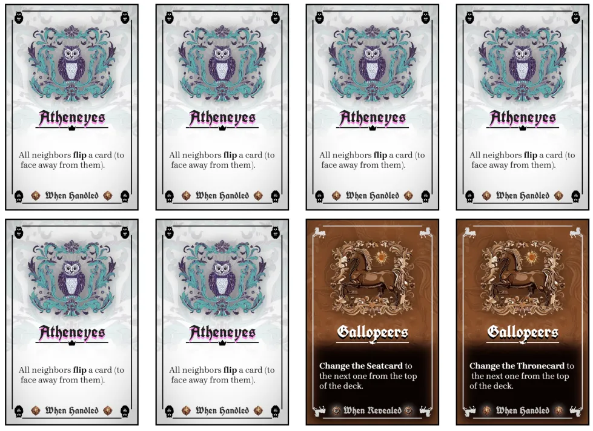
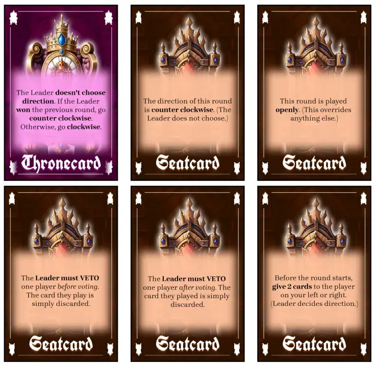

Welcome to the devlog for my game [Kaizerseat](https://pandaqi.com/throneless-games/conquer/kaizerseat/). It's the final (and most "complex") entry in the [Throneless Games](https://pandaqi.com/throneless-games/) collection.

If you've read any of the other devlogs (for the other games), you already know the core mechanic and general approach for this game. You also know that I made the first game (Kingseat) a while ago, then came back with new skills and insights a year later, to massively improve the quality of the whole project.

Fortunately, back then I had already sketched the rules and twists for each version, which meant I had already written 50% of the devlog for Smallseat and Queenseat.

But this game? It was wide open and I hadn't started a devlog yet. So, as you read this, remember it was written mostly after the fact.

# What are Throneless Games?

They are games using my "Throneless Mechanic" at their core.

* Each round, you **simultaneously vote** for a Seeker. (Or Prince/Princess/Animal in the other games.)
* The Seeker with the **most votes** wins the round.
* (If **tied**, direction comes into play. The one closest to the Kaizerseat, in clockwise direction, wins.)

The winning votes are scored (or handled in some favorable way).

All losing votes now make a decision.
* Either execute the action on your card,
* Or swap places with someone else.

Why did I believe this mechanic could sustain multiple games? Why did I like this so much back then?

* Simultaneous turns are always good. (Faster gameplay, everyone always stays engaged, etcetera.)
* They are simple.
* The games can be played without table/chairs.
* And swapping places strategically (as a core element of the game) is fresh and unique.

When trying to turn this into balanced games, though, I learned a lot about game development (again). Because as it's written, the idea isn't great yet.

For example, swapping places only matters because you'll be closer to Kaizerseat _in case of a tie_. In practice, this meant the final player always swapped and always for the same reasons. Sometimes it worked out great, other times it didn't matter.

That's not great, is it?

As such, I invented many small tweaks to the core rules to _actually_ make your actions matter and to _actually_ allow strategy and long-term plans. Each Throneless Game has a different set of tweaks, giving the simplest ones to the simplest games ... and the hardest ones to this game!

## What should Kaizerseat be?

The following ideas were _all_ part of the earlier games, until I pushed them back to only appear in this "most complicated" variant.

* **Thronecard**: each game/round, draw a random card from this deck, which adds a permanent twist to the rules. (This card also neatly indicates where the Kaizerseat is at all times.)
  * These were originally meant to be _for the whole game_. Draw once at the start from a tiny deck of options, apply for the whole game.
  * Then I realized it was more interesting to have one deck _for the game_ ("Thronecards") and one _per round_ ("Seatcards").
* **Direction Switching**: in the other games, direction for checking ties/actions is always clockwise. In this game, this can be modified to counter-clockwise. Which is a simple rule, but in practice makes the game much more volatile of course.
* **Different Types of Actions**: in the other games, all actions have the same "type". That is, they trigger when executed. But there are obviously other types of actions that were interesting, such as "when scored".
  * This was a clear lesson from playtesting Kingseat. In the first version, I had given about 30% of actions a different "type" or a different "condition" that decided when they triggered.
  * Well this confused the hell out of everyone. Especially because these conditions were _written within the action_, making them longer paragraphs, and making the distinction unclear unless you read the card carefully.
  * When moved to Kaizerseat, I knew I had to add clear icons/text to immediately indicate the _type_ of action on a card.
* **The most complicated actions:** similarly, I invented many actions that sounded cool ... but needed too many words to explain, or required some number-crunching. All of these were moved to Kaizerseat, to use the absolute simplest ideas for earlier games.

And so, by the time the other versions were done, Kaizerseat was basically also done by default ;) Many earlier ideas were simply integrated here.

## Inventing Actions

The biggest missing piece was the long list of _actions_ per Seeker.

The simplest game has only 1 action per Seeker: all their cards are simply identical. The next game has 1 unique "Dark action" that's far more powerful but, as stated, only appears on a single card.

And so the sequence logically continues until Kaizerseat had **one regular action** and **3 Dark actions**.

I feared this would be too many, but when I actually sat down to invent them all, I had so many ideas that 3 unique actions per type was perfect.

This process also increased the list of different **action types**:

* When handled = the usual way. Triggers when you execute the card instead of swapping places.
* When revealed = when played, before checking who won the vote.
* When won = triggers if this card was the winning Seeker.
* When Tell = this action is true when checking who won at the end of the game (by counting the cards in the Tell).
* When hired = these cards are placed permanently before you, giving you an extra power or curse.
  * These are so powerful through their permanence, though, that they only appear on unique Dark cards.

At first, nothing seemed wrong. When designing the specific actions, though, an unintuitive clash of ideas became apparent.

* Some cards only trigger by choice (such as "when handled" or "when hired")
* While others trigger automatically

This is messy to explain and execute for players. It's not the end of the world, of course, but I really want to simplify games at all times.

Similarly, because this game constantly changes---different Thronecard, different Seatcard, etcetera---I had no consistent method to make swapping places very useful. It felt as if it was the "worst choice" at almost all times.

Then I noticed I could invent many interesting actions ... which were _bad for you_. Those are meaningless, of course, if you can always _choose not to trigger it_.

That's how I made the final rule choice that made Kaizerseat what it is.

> You always execute the action on your card. Only if this does nothing (right now), do you swap places.

This simple rule unifies how you deal with all actions. It also means you're not just "sitting around doing nothing" when your action fails---in that case, you swap. (For example, some actions are conditional: "If the Leader won this round, then ...")

{}
Yes, by now the decision had been made to NOT make this game playable without a table. It's just impractical and not what players would want out of a longer game.
{}

## Something I should've realized long ago

So, the game still includes swapping places. You can use that to become Leader and break ties favorably, but that's not enough.

Only now I realized the obvious solution, which I retroactively applied to the other games where possible.

Many actions say something like "All players must reveal 1 card to you" or "Steal a card from 1 player".

This makes positioning irrelevant. It doesn't matter where _you_ or _your target_ sits!

But we can change that to something that _does_ rely on position and instantly make swapping a very useful action.

* "Both your neighbors reveal 1 card to you."
* "Steal 1 card from the Leader."
* "End the round immediately." ( = All players after you, most likely your neighbors, get no more turns.)

I don't know how I didn't see it when I made Kingseat. It's such an obvious change that improves the entire core mechanic with a snap of the fingers.

You know Patrick has a lot of Green Votes? And you want one? First _swap_ until they become your neighbor, then you can steal the card.

You have a Dark card that targets the Leader? And you think Anne is ahead and want to stop her? Wait until she becomes the leader and _then_ try to play that card.

More and more, I'm learning how _constricting_ choice is actually often very, very good for games. (For example: Instead of allowing you to pick _any_ player, only pick neighbors.)

## Creating the cards

I already had the shared code for generating + drawing the cards (used in all other games, with only minor tweaks in configuration).

This time, however, we needed something extra.

* That clear indicator on cards about _action type_.
* Unique designs for the Thronecard and Seatcard (which only need to draw some legible text on top of that).

Generating these cards is easy. I just loop through all the ideas I placed in a list, and put them in a `Card` object, just like all the other cards.

{}
This is probably one of the reasons I gravitate towards making games as "projects" with shared mechanics. It allows me to make unique, playable, great games ... without having to redo everything from scratch every time. Like, picking GOOD FONTS for a new game can be hours of research on its own.
{}

Drawing, of course, required some sketching and trial-and-error. You want things to be clear, but also to not step on each other's toes or obscure other elements. You want to be consistent in how it looks, but not TOO consistent, because then there's no clear hierarchy and players can't discern different elements of a card.

I guess I'm just describing the general skill of design now, so let's look at some images. Notice the part at the bottom that shows the action _type_ (text + icons around it).

And these are the Thronecards / Seatcards. I'm still playing with font size, text alignment, and spacing / how to write these actions. Some of them can get quite long and not as easy to read if it's just one block of text. But the general idea is there.

With that, the entire game was done.

## Playtesting & Polishing

@TODO