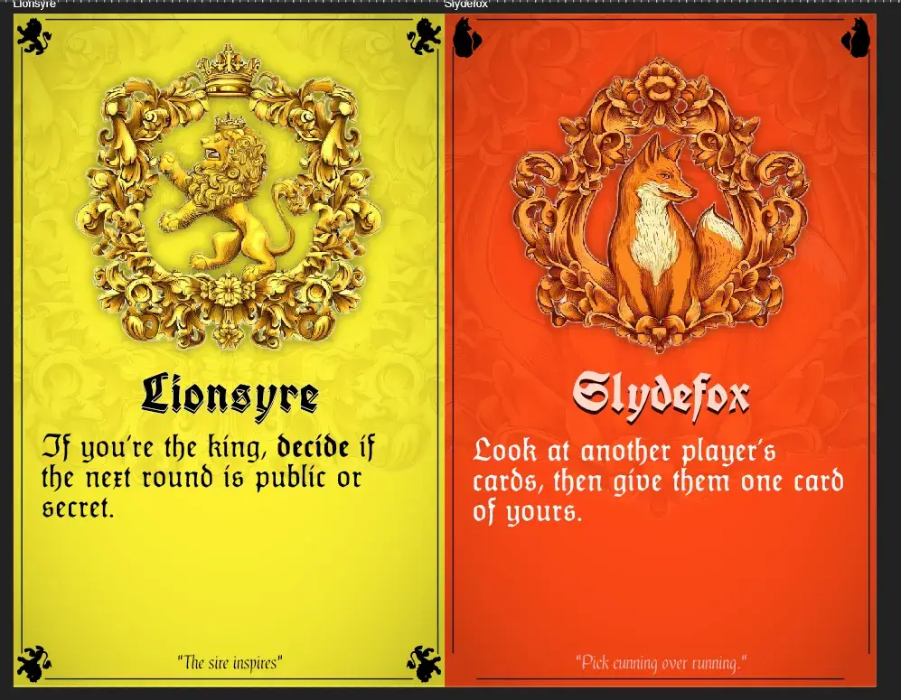
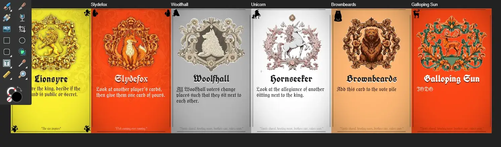
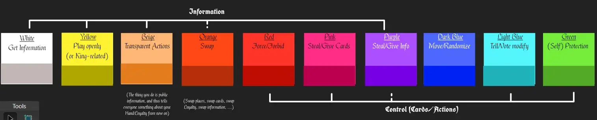

Welcome to the devlog for my game [Kingseat](https://pandaqi.com/kingseat). In this article I will guide you through the journey of creating this game, from its inception until its final published product. Hopefully it's interesting, entertaining or educational!

## What's the idea?

I was discussing "queuing games" with somebody. I've searched for years, but could never find a nice game to play when waiting (in line, in a queue, in a theme park, whatever). Naturally, I wanted to _make_ that game :p

Kingseat was one of the first ideas I had. It didn't fit the mold perfectly---as it takes a little longer to play and needs a large player group---but was a great start. Most importantly, I thought it would make a _great_ game.

The idea was as follows.

* Players stand in a circle. Yes, this game can be played entirely while _standing up_.
* One position in the circle is "kingseat": whoever is there, is currently king.
* Players hold colored cards that represent votes for political parties. (Like, a GREEN card is a vote for GREEN.)

Each round goes like this.

* Everyone simultaneously picks a secret card from their hand. When everybody made their decision, they are revealed.
* Check the cards. _Start_ from the king and go _clockwise_.
* The biggest sequence of votes for the same party WINS! (Example: there are two RED votes in a row, then three GREEN votes in a row. Green wins.)
* These votes are added to the vote pile.
* Anybody who voted for another team may _swap places_.

A very simple ruleset, but I imagined this would work. You could influence the winning votes by picking the right card (at the right time), and by positioning yourself well inside the circle. Everybody has cards for their preferred color, but also cards for the "wrong" color, so you had to strategically "throw them in the trash" as well.

But it's a very experimental idea. I hadn't seen anything like it. A "stand-up-and-vote-six-rounds" game.

So I immediately (well, two weeks later, when I had a free Saturday again) created a paper prototype and tested it.

## Lessons from the prototype

Let me remind you that I played all these test games. against myself, which obviously isn't the same feeling. Because I _know_ all the cards and can't bluff against myself :p

### Lesson 1

I couldn't decide if I wanted _three_ colors or _two_ colors. It felt heavily dependent on player count and how well you understood the game. 

As such, I wanted to make this a _choice_. You decide how many different "political parties" you put into the game. (I can just provide these as different packs or expansions on my website, which you can add to your PDF of material.)

Also, I've decided that 8 cards is a good start. (You lose one of them for choosing your allegiance, so you play 7 rounds.)

### Lesson 2

Swapping happens too often now. Even with 4 players, that often means two swaps each round, which means all _four_ players might be in different places by the end! I grew frustrated by how often I had to move around the hands of my fictional players. Imagine how it feels with a larger group, doing it each round.

(It's also hard to strategize or plan ahead if swapping happens that often.)

I tried the following rule.

> For each party that did NOT win the vote, find the player closest to the king, _counter clockwise_. They may swap places with someone else.

This reduces swaps. It helps the player who needs it the most: the player just behind the king. But it also grows with player count, as more parties are added.

It seemed to work. Though now players in the _middle_ of the circle get the short end of the stick. I expect this rule to change slightly.

### Lesson 3

Lack of information at the start. The first 2-3 votes are basically blind guesses. What cards are others holding? What is their allegiance? What will they play? Who knows! Nobody knows!

**Idea 1**: The king always casts their vote first, and it is _public_. 

This isn't great. On low player counts, this probably gives away too much. Additionally, it means everyone _waits_ for the king to make a decision, removing the speed of simultaneous turns.

**Idea 2**: The king gets to look at the other votes, after being cast, and is allowed to change their own vote.

Yeah, pretty nice, but too narrow. Some players might not be king until round 4. (Probably something for a powerup.)

Then I thought: how do similar games do this? How do you play Werewolf / Mafia (for example) without feeling like you know 100% _nothing_?

That game switches between a _day_ and _night_ phase. And during the day, votes / discussion / anything else is completely open and public.

Let's try that!

**Idea 3**: the game switches between public voting and secret voting. The first round is public.

Yes, much better. I actually found myself making _meaningful_ choices. The public round gives a lot of information, without adding complexity in rules or mechanics.

{}
If you're certain you won't win anything, because you're in last place and the longest sequence is already established, you can use this situation to "throw away bad cards". But ... doing so would clearly signal to other players which political party does _not_ have your allegiance. Choices! Meaningful choices! That's what games are all about.
{}

### Lesson 4: part 1

Now the game engine is running, but not smoothly. You still don't have _that_ much control over what happens. Rounds can be very same-y. (Which is reflected by the fact that 80% of rounds with 4 players end with the same situation. The 2nd and 3rd player vote for the same thing, giving two votes to one party. The fourth player then gets to swap, and decides to swap with the kingseat.)

**Idea**: each political party gets their own special action. This is always the same. The RED party always has action X, the GREEN party always action Y, etcetera.

At first, I wanted to make special cards their own separate thing. I wrote down a list of ideas for cards that would be colored grey, and each type would appear 1x-3x per game. 

But it's much more _clean_ and streamlined to use only one card type for the whole game: a vote for one party.

The only thing I might consider, is one or two actual "one-off" cards that help balance the game. These would be dark cards, something like "The Assassin" or "The Poisoner" with some powerful action when used right.

{}
I actually got this idea because I had _one_ blank card remaining after cutting an A4 paper into cards. So I thought: what can I do with that?
{}

The rule would be ...

> Each player who did NOT vote for the winning party, **may** execute the action of their card. (In clockwise order, from king seat, as always.)

I was tempted to do it the regular way: you execute your action if you're part of the WINNING team. I considered that too powerful, however. It would mean that the losing team literally gets to do _nothing_, while the winners of the round get multiple bonuses.

### Lesson 4: part 2

What would these actions be? (At this point, I'll switch to shapes when mentioning the "parties" in the game. As that's what I actually used with the paper prototype.)

* CIRCLE: Swap places with another player.
* SQUARE: Move the kingseat to somebody else who didn't vote the winning team. If none exists, move it to yourself.
* TRIANGLE: Look at the hand of another player, then give them one card of yours.

I got another idea. What if each _party_ had this "darker side"? In a game, there might be 8 regular CIRCLE cards, but 2 darker ones with a unique powerful action?

For example,

* CIRCLE DARK (1): swap places with the kingseat. This can _not_ be undone by any other rules this round!
* CIRCLE DARK (2): swap two random cards from the vote pile with two secret cards from your hand.

These are very powerful. But there's only one of each type. And if you happen to play it _when your team wins_, you don't get to execute it. Which means they are balanced automatically, just by following the rules we already have.

This felt like a very strong, unique setup for this game. So I wrote these special actions on the cards of my prototype and played some more games.

{}
After playing some more test games, I think I like this idea because it adds _direct_ interaction, instead of _indirect_. The previous rules meant you could never attack or help another player directly. Only by accident, only as a side-effect of trying to help yourself. With these "darker" cards, I add an opportunity to clearly show your hand and say: "I don't trust you, I'm gonna attack you"
{}

Below were my ideas for the other parties, for completeness' sake.

* SQUARE DARK (1): move the kingseat to yourself and _look at_ the vote pile
* SQUARE DARK (2): move the kingseat to _any_ player and tell them what card to play. They must do so, if they can.
* TRIANGLE DARK (1): look at the hand of another player, and take one of their cards
* TRIANGLE DARK (2): the next round is _public_, but _you_ play your card face-down

As you see, I try to keep to a "theme". CIRCLE is about swapping, SQUARE is about the kingseat, TRIANGLE is about revealing/information. In the final game, I'll probably give names to the political parties and give them some identity or purpose.

### Where are we now?

This ... works? It's hard to judge, playing against myself.

The general flow of the game is quite interesting and leads to meaningful choices. The dark cards are powerful when used well and you want to think twice about using them.

I've tried playing with 2, 3 or 4 different parties. It all works, so that's nice. As expected, these changes merely change the general feel and strategy of the game. (More parties = more chaos / more splintered = more based on luck or high risk/reward moves.) 

With more parties, you also have more "plausible deniability". At the start of the game, you're not going to convince all other players that you just don't have _one of the two parties in the game_.

My biggest issues are:

* A public round _every other round_ seems juuuuust too quick. Especially if you're at the _end_ of that round, it feels like your move often doesn't matter. (At the same time, as mentioned, this allows you to throw away bad cards, give info otherwise, OR use a dark card strategically.)
* Similarly, if you're pretty sure that the first two players have played the same symbol, it doesn't matter what you do after that! (In a 4 player game, which I use as an average reference point.)
* And with these rule changes, swapping happens juuuuust too infrequently.

In short: sitting at the middle-to-end of that circle is often not that fun. And the current rules handle that issue for 75%, I'm just looking for a neat rule or idea to handles that final part. The game misses some of that "hidden roles" and "backstabbing/intrigue" atmosphere I am looking for.

The best solution I have is ...

> If you choose _not_ to execute your card action, swap places with somebody else

This means more swapping is possible, but it's (again) a meaningful _choice_ between two things. Which you probably want _both_. It also means the CIRCLE party needs a different main action: "make two _other_ players swap places".

But I can't judge that clearly, I need to test the game against others. See how it feels when I _don't_ know their cards or allegiance.

## The visual design

This game only uses one type of card: a vote card for a particular party.

As such, we only need to design these parties.

* Their general color. (Clearly distinct. Default colors are _light_, so we can have that _dark_ variant.)
* Their general shape. (For extra easy identification, will probably just place that in the corners)
* Their official "icon"

(Besides that, we need two fonts: one for headers and ornamental text, the other for body text. But that process is always: search through tens of possible fonts with the right feeling, find the two most legible ones that pair the best.)

For the icon, I sought the help of generative AI. After using it for two previous projects, I've established somewhat of a routine.

* I search "prompt repositories" for something like the style I want, and check what they used.
* I also check for things I _don't_ like and what might cause those to appear.

Doing this, I discovered the following.

* What I'm looking for, is called a **crest**, **sigil**, **emblem**, **coat of arms** or **heraldic**. You can put "royal" or "family" in front of it.
* You run a great risk of generating crests shown at an _angle_ or with strong _lighting_ (reflections). To compensate for that, use words like "front view, straight-on, matte, flat lightning, vector"
* The style I liked the best, was the ones created as a "wood carving" or "paper sculpture". They just seemed the most natural and consistent to me.
* Besides that, I'd finish it off with ...
  * Asking it to create the crest in a certain color, with a solid white background ( = easy to cut out). 
  * Adding touches such as: "ornamental flowers, antique pattern, motif, ornate, bilateral symmetry"

### Manual design first

What I mostly learned, however, is that the AI is just a _dumb tool_. To use it well, you need to carefully guide it with a strong (visual) concept of your own. If you don't, each generated image will look wildly different from the others, and cliché at the same time. ("Oh great, another sigil with a bald eagle and two crossed swords.")

That's why I designed the "background" for each pack first. Each party needed a name and a general "mission" or vibe.

And an **animal** :p It's _very_ common to add one or two animals to your family crest. It's a way to visually distinguish it---because otherwise, all sigils would show similar human shapes---and relate yourself to some strong or inspiring part of the animal kingdom.

{}
I might consider a nature element, or a building, but that would only be for parties that are radically different from the others. To signal how different / unique they are _in every possible way_.
{}

I researched the most common animals. As usual, with research, you end up with way more information than you bargained for. (For example, I've learned that the animals on crests are broadly categorized into four categories: beasts, birds, sea creatures, and other.) 

After creating a _long_ list of common animals, I shortened it to ones I thought would look and feel varied. As much as I like both lions and tigers, they have a similar look and vibe. A game like this wants icons that immediately convey the party to which they belong.

I still ended up with some duplicate colors. I simply solved that by giving them _similarly themed_ powers and stating (in the rules) that you shouldn't play with multiple parties of the same color.

Then I fed this to the AI ... and my research paid off! Using the keywords described, and predetermined animals/shapes/colors, I could get very consistent icons of what I wanted. 

Below were the first two "test cards" I designed this way. (Remember that, eventually, the computer will generate all this on the fly. I'm not adding the text + image + colors + etcetera by hand for all individual cards.)

It did have trouble staying within the frame, though. Whatever I tried, 90% of the images had parts cut off. After ten minutes, I found a rather simple solution: I asked the AI to make the images symmetric ... so I could just complete the part that we lost by copy-pasting from the other side!

They were, however, very detailed. This made them hard to use at smaller sizes (such as icons at the edges). As such, I did have to manually "trace" the most important parts of the sigil to create a (heavily) simplified icon myself. It's fine. It takes a few minutes per sigil, but adds a _lot_ to the clarity of the cards.

Also, I realized that asking it for _two_ colors led to more interesting and eye-catching results. An "orange fox" would give a fine icon, but also ... completely _orange_. Asking for an "orange with pink" fox, adds these nice tints and highlights that make it unique.

I ended up with so many animals and possible cards, that I decided to split this game in two. I've learned that putting _too much content_ into one project is basically never a good thing. (It overwhelms new players, it bloats the project, it removes the possibility of doing something _really_ special with some of the cards.)

As such, _Kingseat_ will contain the ~8 parties that looked and played the best. Then I'll take time to make the other ~8 as good as can be for an _expansion_. (Probably called _Kingseat: Dethroned_ or something.)

{}
Consider what happens if I put all that into one game. Somebody finds the game, looks at it, and sees _sixteen different packs to try_! Which ones to choose? Do I need to learn the rules for _all_ of them? Man, this seems like a _complicated_ game! And boom---they are gone.

I can add a paragraph about the best "starter pack" or "political parties for your first game". But that means _more text_, which might be skipped. In fact, it probably will be skipped at first glance.
{}

## Why you shouldn't wait too long with visual design

People recommend completely finishing your idea first, then doing the execution (with visuals, polishing, etcetera). And yes, in general, that is true. It's much faster to rewrite a bad rule or card idea, than to redo a whole drawing or design.

But I've learned that these two elements (rules and graphics) influence each other. That's why I never want to wait _too long_ before I start working towards a final design for the cards.

So, as expected, when designing these cards, it revealed issues and opportunities with my game.

### Forced to simplify

**Firstly**, some ideas for actions were too complicated. If they don't fit on the card (with generous font size and whitespace), they have to be simplified. Shrinking the font size or pushing text against the edge of the card is a no-go :p

This can mean a complete rewrite, or just a smarter phrasing.

{}
Many rules referred to the "voting pile". By giving that thing a short unique _name_ in the rules, many card descriptions can be shortened. I'm not sure what I'll choose yet. I'm considering something like "the Count". It communicates that this is the pile for counting votes, not playing them, while being short. Or maybe "Teller", the official name for someone tracking / counting something.
{}

### Good overview of final material

**Secondly**, the dark cards ... obviously had to change more than just the background. The colors and icons need to be inverted to stay legible (with an exception for the main emblem). Additionally, I wanted some clear icon for those having trouble seeing the color difference.

While coding the material generator, I looked at the full PDF and thought "man, that's a lot of actions, do we really _need_ every card to have an action? And 2 dark actions per pack?" 

I added code to disable this and wrote down ideas for "parties" that have no special action, or only 1 dark action. I'm not sure if I'll use this or not. Playtesting and balancing will have to reveal if we need all these actions. But at least I can play with it.

### Easier to see what you need

**Thirdly**, the most interesting actions I could come up with ... weren't actions at all. 

For example, I invented a party that counts for _two_. Each card in the voting pile is actually two votes. That's a really nice idea, if balanced correctly. But it means it's not an action, it's more a property of the card. Something that only becomes important at the end.

How to deal with this? Disallow it? Add an icon/word to the card that indicates what _type_ of action it has?

I certainly don't want to overcomplicate the game or the card layout. But not allowing these types of cards at all, means the game will only have ~5 parties and doesn't reach its potential.

Additionally, my rules so far assumed there'd be a "king card" (or "throne card"). The current king would have this showing.

This simple thing doesn't even work for numerous reasons.

* The game would need a table, then.
* Each pack needs the same number of cards (for fairness), so which pack has to remove one card to make place for the king card on the material PDF?
* Another element, another thing to explain or show, which actually goes against the name and idea of the game. It's called "Kingseat", because the king is determine by your _position_ in the circle, not some card!

All of this lead to ...

## About the "expansion"

I've decided to call all the "parties" in this game "Princes". The expansion will be called "Queenseat" and all its parties will be "Princesses". This just felt more thematic and unique than calling them "teams" or "groups" or "(political) parties" or "houses". (Although that last one would've been okay.)

Each Prince is simply somebody vying for the throne. A short word, an intuitive theme, easy to explain and work with.

Also, when I wrote down the original idea for the game, I immediately saw many small rule tweaks that would make the game varied and interesting. 

{}
By default, only the first longest sequence of votes wins. But what if _all_ longest sequences won? (If both the Lions and the Elephants received three votes, they'd both win and add their votes to the pile.)
{}

A day later, I knew I had to put these variations _on the cards_. Putting them in the rulebook would mean players had to keep it at hand (or have a great memory), or never even realize these variants exist. Not great.

Well, what did I just tell you about this unique "king card" that fit nowhere?

I decided ...

* That this "king card" would not exist in the base game (Kingseat). It would be _exclusively_ Prince cards.
* But the expansion (Queenseat) would have one page in the material with 16 different "throne cards". Each of them has a variation on the rules _written on them_. This means the variation is always in plain sight, from the start of the game. It also means I can add a few Princesses which _do_ something with that card.

{}
Also, we can use this card to denote public/private rounds. Flip it face-down if the next round is private, face-up if public. I'm still very much open to removing this rule from Kingseat, if I can help it.
{}

A third variation might be created as well, depending on how many different ideas I end up creating (and liking). But for now, Kingseat and Queenseat seem like a sure bet.

## Final rules > Prototype

### Finalizing the rules

As stated, I wanted to remove the rule of "alternate between public and private voting rounds". It was a nasty extra rule that felt ... unnecessary.

With slight tweaks to the cards or rules, it felt like we could get information (and public voting rounds) in a more natural way.

While considering this, I realized three new issues.

* Any cards that aren't votes, go into the "discard pile". Well, if I want the game to be playable without a table, I have to assign a player to hold this pile. Also, the name was obviously shortened to "Discard".
* When you swap places ... you obviously take your vote card with you, messing up the order :p The rule changed to "go around the table, in clockwise order, until all cards are gone".
* I need to make sure players aren't swapping places all the time, and never execute the action on their cards.

The card actions are now _vital_ to making the game tick. After turning "public voting" into an _action_ on cards, I had to make sure this action would be invoked _regularly_.

Additionally, too many swapping makes the game unpredictable to the point of being ... pointless. You can't strategize or execute your great plan if _every player_ can literally end up _anywhere_ next round.

As always, I tried to hit two birds with one stone, with a minor rules change.

> Players may only change places once per round

This limits the number of swaps, but not by too much. With 4 players, you can still do _two swaps_ if you want. (A<->B, and C<->D).

But it also means you _have_ to execute your action if somebody else swapped with you previously. It ensures actions _will_ be used regularly. And it's even another strategic layer, another thing to consider while picking your card.

{}
I also considered not picking a Loyalty/Allegiance at all. You simply play until all players have 1 card left ... and that's their final Loyalty. A nice idea, but again not for the base game.
{}

I think this rule will truly make the game possible. Its absolutely as simple as can be, but still balanced.

The only downside is that you can't have hilarious situations in which one player is swapped by _everyone_ and constantly has to move around :p But then again, such situations are hilarious once, and then they'd just become annoying if they happen over and over.

### Finalizing the Princes

With these new rules, I needed new Princes. They should have very basic actions within the following categories.

* Give more information (through public voting round, revealing cards, play a card then take it back again, etcetera)
* More control over cards or actions (force others to execute their action, ask specific cards, block attempts to steal from you, etcetera)

After all this work on the game, I've learned those two areas need to be in the game to really make it work.

In fact, after more consideration, I decided to color code everything into three categories: information, control, and other.

Each category uses colors close to each other and has around 4 different ways to implement it ( = 4 different colors). An ideal 4-player game, for example, would use one Prince of each type. Which now _automatically_ means that you pick three colors that are clearly distinct.

Maybe players won't notice this, ever. But it really helps me keep a clear overview of all the ideas/parts of this game, and balance them more easily.

With the new rules, actions can also be _bad_! Because you can be _forced_ to execute the action (for several reasons), I can give each Prince one or two downsides to their action. In fact, that's probably a wise move for balancing.

This structure feels much better. It helped me make decisions about which colors / animals / rules to put in which game, and in what order. Which is especially useful if you have 30+ ideas and don't know where to start. With the new color coded system (and simpler rules), I was able to finish a completely playable prototype the next morning.

It has 12 different animals to play. (The colors you saw + gray and "multicolor".) All of them look great. Unique and recognizable, yet clearly the same style.

Let's play the game. And hope it plays as well as it looks :p

## Playtesting

As always, I have both good news and bad news. The game **mostly works**, but there are some clear areas for improvement.

First, let's go over the essentials.

* Games take 15 minutes. That's great.
* It's easy to explain and _most_ people understood it immediately. (Otherwise, they'd figure it out after playing the first one or two rounds.)
* I was able to win many games, but not all. Which means it's not just random. Strategy / knowledge will help, and the other players slowly figured out strategies.
* People generally enjoyed themselves and the "place swapping" was seen as a fun and unique element.
* There's a good variation to which players "win" the vote and which get to execute their action. (And by how many a Prince wins the vote. Often two, sometimes one or three.)

Now, the "bad".

Some minor things:

* Some of the "dark" cards weren't dark enough to clearly signal this :p
* I realized we need a clear rule about how many cards to include. (Otherwise, if you include all 16, you have _waaay_ too many cards left over.) It's not that easy, however. How to phrase it? How to provide a simple instruction that works for any number of players / Princes? "Provide just enough cards to fill the deck, but no more!" is really vague.

Now some major issues:

* Earlier, I added the rule of "max 1 swap per round". In practice, though, this wasn't necessary. The amount of swapping depends on the Princes you've included. (The more people _want_ to execute their action, the less they'll pick the alternative: swap.) It was never very high, though.
* The cards with special actions ("when revealed", "when in Tell") were confusing, as I'd feared. They are exceptions to the core rule that take people by surprise the first few times. At the same time, when used, they made the game _better_.
* Some cards feel overpowered or underpowered; I'll give the specifics below.
* There's still too much randomness and too little opportunity for strategy and knowledge. That rule about alternating "open rounds" that I discarded, still feels like it's needed in some form or another.
  * Potentially, we could use _more_ cards per player. 

### Changes for each Prince

Below are my specific notes per Prince. First the ones that need (almost) no change.

* **Hornseeker**: perfect. Gives information, people want to use it, is useful. (People like the animal and the card design.)
* **Lionsyre**: perfect. Again, people _want_ to use the public round and the information it gives.
* **Salsa Salamanda**: mostly fine. I changed the action to "put one of the winning cards into any player's Hand _or_ Discard". In my games, there were too many situations where taking the card into your own Hand (as the only option) ... didn't really matter.
* **Squlofish**: surprisingly balanced. Their action is that they count for 2 in the Tell. This feels waaaay overpowered, but in practice it's only _slightly_ overpowered. To soften this, I've changed their action such that only the non-Dark cards count for two. (And the Dark cards are very good at _removing_ Squlofish votes :p)
* **Gulliballistas**: mostly fine. The actions just needed to be taken to the extreme. (Instead of revealing 1 card, reveal 3. Instead of a Dark card forcing another to reveal part of their hand, force them to reveal their full hand.) Based on my playtesting, it's quite hard to execute Dark cards, so making them more extreme is better for balancing.
  

Now the ones that needed significant change.

* **Hardshell**: the Dark cards are nice and powerful. The general action, however, is a special one that's rarely useful. ("If anybody swaps places with you, they must reveal their Hand")
  * It's meant to deter anybody from swapping. However, it's so effective that it deters _anybody_ from swapping with you, making it useless in practice. (And it's an action that only triggers on a condition, which is confusing.) 
  * I changed it to: "Any time you swap (from now on, this round), trade 2 cards with the other. Now swap places with someone." This makes it a regular action, following regular rules. It also creates more interaction and can have a negative side for you.
* **Crassclamps**: just very mediocre. "The next player must execute their action" isn't great if there _is_ no next player, or most are executing their action _anyway_. The Dark actions are similarly ... meh.
  * Instead, let's give them more agency. "_Decide_ what the next player should do: action or swap"
  * The dark actions became simpler and more powerful. Additionally, this allowed me to remove the "special action" tag from them, simply making them regular actions.
* **Monarchrys**: almost perfect. Asking others for cards both gives information (everyone knows that card, or you know that somebody else does NOT have a certain prince), and it gives you a valuable extra vote. The Dark cards, though, are a bit weak. I made them stronger by saying "ask for a Prince; somebody gives you _all_ matching cards from their hand". But that was _too strong_! If you manage to play that card at the start, you can easily scoop up 4 or 5 cards from somebody else. As such, I added an extra condition to both dark cards: if their execution fails (your victim does not have that Prince), _you_ lose all those cards.
  * Additionally, realize how much information this gives. Yes, you might win 4 cards. But everyone _knows_ you have it and that leads to more strategy and fun. 
* **Smugwing**: the regular action is "blocks everything", which is too powerful, and also a special action (you don't pick it, it's "always true"). The same is true for the other actions: too powerful, too confusing.
  * The issue is that blocking is rather pointless if it's only true for actions that come _after you_. There's a _very small_ chance of it being useful that way. Instead, let's move it to the next round. "You're immune to any actions aimed at you next round". 
  * But it's not overpowered, because you don't _know_ if people intended to target you. It's hard to decide if taking that action is more powerful than, say, swapping places. 
  * I do hesitate, though, because _blocking_ can mean that you simply prevent players from playing the game (to its full extent).
  * So I added a stipulation " ... but may not vote". This will cause more hesitation before using the action. It also serves as a great _reminder_ that this power is active on that player, otherwise you easily forget.
  * This has another fun consequence that I haven't seen before in this game: it _moves_ your votes to different timings, which is very interesting. 

The ones below were tested the least, which means I'm uncertain about their changes. 

* **Slydefox**: seems fine, just needs to be slightly more extreme. Not "swap a random card from the Tell with your Hand", but "swap 3 cards". Again, this is informed by how often you get to execute your card action in practice. If you manage to make that happen, you want it to be useful and have an _impact_.
* **Brownbeards**: seems fine, just made it more powerful _again_. Not "if you sit next to a Brownbeard vote, grab a Brownbeard card from the Discard pile", but "for every Brownbeard vote, ...". Not "if nobody else voted Brownbeard, undo this round". Simply: "undo this round". Otherwise, you get these "special actions" again that only happen on some condition. And I've now learned that this is confusing and means the actions don't happen enough.
* **Woolfhall**: this card is grey, which means it's the "cooperative" or "group" card. It should, somehow, be a group decision or something that is true for all Woolfhall voters that round.  
  * The **issue** with that is, of course, that somebody needs to have final say. If I say "discuss and pick one player to do X", there needs to be a failsafe in case discussions don't work out. Conversely, if I say "the _first_ Woolfhall voter decides that the rest must do X", then that whole group aspect is lost, because only the first one matters. 
  * It gets even worse if you consider that players might choose to "not do" their action on the Woolfhall card. Do they count for the pack? Or not? Do they have a choice? Unclear. Confusing. How do we fix this?
  * I ended up **removing** the discussion/group decision aspect. It was just too vague and muddy, especially for a game that's otherwise highly strategical.
  * Instead, all actions ask you to _count_ the Woolfhall voters, or _trade/swap/do something_ with only them. It still clearly groups players into Woolfhall and non-Woolfhall. But now in a precise way that needs no special action or exceptions.

### Where are we now?

I've decided to leave the number of cards as a _decision for the players_. (Like the number of Princes already is.) Because this allows a very simple rule for creating and dealing your deck.

> Add equally many cards of each Prince to the deck. Now deal each player an equal number of cards; leftovers go into the Tell. More cards per player mean a longer and more strategic game. At least 7 Hand cards is recommended.

It explains the important part and a guideline. Otherwise, you decide your game length and structure entirely by how you create your deck. (I might also add a note that 7 Hand cards means a 15 minute game.)

With these changes to the Princes, I can remove the "special action" aspect entirely. This simplifies the game again, no matter your combination of Princes, which is _always good_.

### The final uncertainty

I'm still uncertain about the amount of information. Yes, many actions will now bleed information and strategy into the game. But most of them will only do so when used by a skilled player, later in the game. You can play this game highly strategically, even track other player's cards, or you can just wing it and hope for the best. Alternatively, you can bluff, lie, and make deals.

Is that a good thing? A bad thing? I'm leaning towards _good_. Currently, the game is _very_ light on rules and does not force you into anything. (A specific play style, or atmosphere, or heavy-thinking game.)

I'm just not sure if it's worth adding one or two extra rules, just to get more information from the start of the game.

For example, I might say ...

> When you _swap_ places with another, reveal 1 card to each other. (Or something similar. Reveal Loyalty. Trade 1 card. Etcetera.)

Relatively simple. But players are likely to forget this. It's one more tiny "game-y" exception. And how much does it _really_ help? Knowing a few more cards over time? 

Knowing the _distribution_ and other player's Loyalty is more useful. But trading Loyalty on each swap is waaay too powerful. (Within a few rounds, everybody _knows_ the Loyalty of nearly everyone else _for certain_.)

After a good night's sleep, I realized a simple solution used in other card games where you want to "design" your hand. For example, the classic game Hearts. 

* First round? Give three cards to your left.
* Second round? Give three cards to your right.
* Third round? Give three cards to the player sitting opposite you.
* Fourth round? Give away no cards.
* (And repeat.)

Now, this is a bit _too_ involved. But the idea is there.

* You can give away your bad cards.
* But what you give away is knowledge for the other player.
* And what another gives _you_ is knowledge for _you_.
* (And because seating order is so important in this game, having this knowledge for the players sitting next to you is even more useful.)

So let's add _one_ final rule to the setup of the game.

> Give away two cards to the player on your right, and two to the player on your left. Pick your Loyalty _after_ this.

## Playtesting some more

@TODO Describe

@TODO Image of the playtest? It's a bit tough when the game can be played standing-up with nothing really left to photograph ... Perhaps just a picture of a voting round in action.

## Conclusion

I am happy with this game. Which, if you read these devlogs (or at least my conclusions), is a rarity.

Like most games, it does depend on the players and how active they are. Because the rules and actions are so simple, you could just "vote at random" or "see what happens" and the game would become more boring because of it.

But if all players at least _somewhat_ engage, this is a game with ...

* Extremely fast setup, rules and turns
* Which scales to many player counts or playing spaces
* That has some beautiful cards and artwork
* And endless variety with how you mix and match the Princes
* But endless opportunities for strategy, planning ahead, betrayal, and surprises.

As mentioned, there are certainly areas that could be improved or ideas I would've liked to add to this game. I moved those to expansions/spin-offs (such as Queenseat), to be fully explored there, instead of crammed into this game with all the subtlety of a raging rhino. 

At first, I planned to create and release these spin-offs back-to-back. So, Kingseat comes out December 2023, then Queenseat comes January/February 2024, another spin-off in March 2024, etcetera.

I, however, realized I don't like that. It's too little time to properly test and refine those other ideas. (If anything doesn't work out immediately, I'm stressed and out of time.) 

Most importantly, though, I just want to work on something _different_ for at least a few months. After working on a game for a while, I don't want to work on a _very similar game_ the next while. I want to try some new idea first.

That's why I made the decision to just do _one_ spin-off for Kingseat next year, which will most likely be Queenseat. I bet that this time _next year_ I'll have new ideas and the enthusiasm to make that spin-off as good as possible. (And thanks to all my hard work here, those spin-offs already have a solid foundation.)

Until the next devlog,

Pandaqi