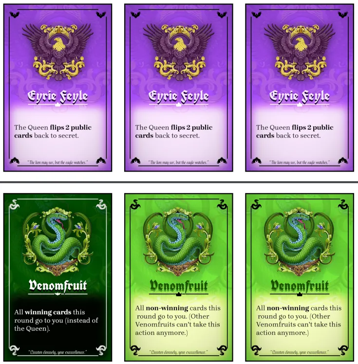

Welcome to the devlog for my game [Queenseat](https://pandaqi.com/queenseat). It's an expansion / spin-off for the original game [Kingseat](https://pandaqi.com/kingseat).

As such, the basic rules and ideas are _identical_ and will not be discussed in this devlog. For that, read the devlog of Kingseat.

Instead, this devlog talks about the two things that are _new_.

* 12 new Princesses, with their own actions and rules
* The throne card.

## Throne card?

When developing the original game, I had several ideas for rules that were great ... but _just_ too much to learn or explain in the rules. Players would easily forget these rules, which meant I wanted a reminder.

The throne card started as this "reminder". The card not only indicates where the Queenseat is ( = the position that starts each vote), but also has text that explains these extra rules.

However, as I developed the idea further, I realized ...

* This card was too much for the base game---let's move it to an expansion
* There were _many_ rules that were interesting on their own, but couldn't be combined

That's how the throne card was born. Each game, you pick a random throne card (from ~16 options). It adds one interesting wrinkle to the rules that is true for this whole game.

{}
When prototyping Kingseat, I realized players needed more information. A great solution was to alternate voting rounds between _public_ and _secret_. Well, guess what: that's one of the throne cards now.
{}

For these cards, I needed ...

* A new design. One that clearly depicted the _throne_ and clearly looked different than the Princesses. (Otherwise it might get confusing or you might accidentally include these cards in your deck.)
* A list of good ideas. Rules that were easy to explain (just one or two sentences), but would be balanced and have a lasting impact on the whole game.

## New Princesses

With Kingseat, I created a simple "color coding". Each of the twelve colors has its own general "theme". Similar colors follow a similar theme. As such, a balanced deck is easy to create: just pick Princesses with _different_ colors.

Additionally, half the ideas from this game spilled over from Kingseat. For example, the Dolphins and the Eagles were some of the earliest factions I created. But they just didn't fit anymore in the base game, so I ported them to here.

The other half (6 Princesses) was still completely open. Maybe I had a simple idea for a rule, or an animal I really wanted to include, but nothing else.

At this time, I started to worry about my method for generating the _sigils_. If I left too much time between these different games, the AI might be updated and provide different outputs (or it might stop being free ...). Perhaps a silly worry. But I wanted to generate _all_ sigils right now, even if I didn't know where to use them yet, to make sure they all had the same style and quality.

So I did.

## Coming Back (after a year)

So, after completely finishing Kingseat, I planned to come back and finish the Throneless Games a year later.

### The Major Changes

When I came back with fresh eyes, and way more experience making games, Queenseat was basically completely redone.

* That "throne card" was moved to Kaizerseat instead. Although it's a very simple addition, it does require explaining some more rules, and the throne cards themselves can't be that interesting when the game itself is very simple. (There aren't many rules to twist, bend, invert, etcetera.)
* Three of the Throneless Games already have the same objective: in the end, make sure a certain prince/animal/whatever has the most votes. So I decided to try a different objective for Queenseat: votes only helped you indirectly, you won by _sitting on the Throne_ when the game ends.
* Smallseat only has 1 (regular) action per animal. Kingseat has 1 action + 2 unique Dark actions. For Queenseat, the logical move was to pick the middle ground: 1 regular + 1 dark per Princess.
* I finished this one after Smallseat. That game can _actually_ be played without table or chairs, because one _player_ holds all the votes and discarded cards in their hand. (They start with an empty hand and basically play a special role.) So I thought: why not make _everyone_ do this in Queenseat?
  * The game will still be playable standing up or without a table.
  * Your playable cards face _you_; any received votes face _away from you_.
  * If we do that, nobody ever gets a ludicrously large hand (because total number of cards stays the same all game). But we can _use_ this public information for better rules and actions ...

### Limitations help

When testing the game more, I also noticed that the game was much _worse_ because of ... freedom. Each round, a player has total freedom in choosing which of their cards to use for a vote. This means it's too hard to predict what will happen, to strategize in the long term, etcetera. The lesson here is that games _should_ restrict and limit players, at least to the extent that gameplay becomes _possible_ to predict.

After some experimentation, I realized we needed a simple rule that limited what you could or could not play each round. Something you could control, something that showed one of the types in the game. Of course, a separate deck or mechanic was out of the question, as everything in this game had to happen in your _hands_.

Then I realized: we have cards _facing away_. Public cards. (When the round ends, winning votes and discarded cards are given to players _facing away_.) 

This means every player is constantly looking at the public cards of other places. And so the rule became:

> You _can't_ play the type you see the most on other player's hands.

One small added rule that makes play _way more predictable_, which is good in this case. Now you know your left neighbor won't vote X, and you've already seen they don't have Y, so you can play into the fact they'll probably vote Z. But this restriction constantly changes and can be _influenced_.

{}
The inversion of this is bad, though. "You MUST play the type you see the most" is a positive feedback loop that just keeps getting worse. You play the type you see the most, that card now is a public card in another player's hand too, so you see it _even more_, and so forth, and so forth.
{}

### How to make becoming Queen hard?

Finally, finally, we needed to make it "somewhat hard" to swap places with the Queen. Because that's how you win the game: end the game being the Queen. You need to build up to that, plan your actions wisely, strategize for several rounds to make that swap.

How do we accomplish this?

* First of all, you can't swap with the Queen if they won the round. (This incentivizes the Queen to keep winning, but everyone else to ensure _some other animal_ wins. A nice tug-of-war.)
* Secondly, you must have _more_ public cards of the winning type than the queen. (This felt like something you can "build up" and overtake the current queen. At the same time, this is public information, so it doesn't come out of nowhere and others can react to it.)
* And of course, some special actions make this harder or easier. But it really needed to be a "core thing".

The final question then becomes: how do we give players control over the public cards of themselves and others? 

This really needs playtesting and seeing how it develops in practice. But based on some brainstorming, this was the best I could come up with:

* The Queen receives all _winning votes_. (You're rewarded for being the Queen, receiving more cards and the lion share of profits. Others are, again, incentivized to kick them off their throne and give them nothing.)
* All other votes, however, can be discarded to _anyone_ (including yourself). This means you can play something with the expectation it won't win, so you can take it back yourself. Or you can give something to _another player_ to help or hinder them, playing a longer game.

### Everything else?

As stated, I already generated the sigils for all versions a year ago. The general card layout, color scheme, fonts, they were already set in stone.

All I had to do now was ...

* Actually write the actions + names + description of the 12 Princesses. (And input all of that into the code and rulebook.)
* Pick the best sigil, edit it until it was good enough, put it all in spritesheets. (Many sigils have inconsistent colors, or parts are cut off that I have to draw myself, or they're way too dark/bright compared to the others, etcetera.)
* Connect this game to the shared Throneless codebase. (Which I had completely written from scratch anyway, because the old Kingseat code was garbage and didn't allow others to re-use it easily.)

It's pretty boring busy work, but it doesn't take more than a few hours ... and then you have a game!

{}
Any special ideas or other requirements were moved to Kaizerseat, such as those throne cards.
{}

## Doing simulations

The past year I also built easy tools for my interactive examples in rulebooks + allow simulating them. (Repeat 1000 random games and collect data about it.)

So I did the same for these games. (It's just one function with minor variations based on the particular game. Maybe that was a mistake, but the Throneless Games are _similar_ enough in core rules to do so.)

Running 10,000 random games, a few issues revealed themselves.

* The Leader wins the vote (is part of the winning sequence) at least 2/3 of all rounds. Sure, they are supposed to have an advantage, but this feels like _too big_ of an advantage.
* In Queenseat, the Leader on average ends up with 20+ cards in their hand :p That's a lot. Why does this happen?
* Well, because on average only **a single Leader swap** happens per game. It's too hard, which means the Queen stays the same almost all game, collecting all winning votes every round!

How do we fix this?
* Give the Queen fewer advantages each round. For example, 
  * They only get 1 vote, whichever they want.
  * Winners decide who gets their vote themselves.
  * The Queen only decides where the _loser's_ cards go.
* Drop one of the restrictions for swapping with the Queen. For example, you can also swap if the Queen did win, or if you have an equal number of the winning type.
* Research tweaks to the _core mechanic_ to make winning as leader slightly less prevalent. (As this is a recurring statistic in all versions.) 

I implemented all three ideas. Especially the final one was consequential for _all_ games.

Playtesting and Simulating the game simply showed that creating the longest _sequence of votes_ was _too hard_. In random play, it rarely happens. Even with smart play, this longest sequence will most likely be only 1 or 2 votes, and will usually include the Queen.

And that's how the core rule of the game changed to something ... simpler?

> The Princess with the **most votes** wins the round. If tied, pick the one **closest** to the Queen (going clockwise).

This makes it far more likely that other types win _and_ that their numbers are higher. With these changes, 10,000 random games gives the following statistics:

* Probability Queen wins round? ~60%
* Number of _swaps_ for Queen position per game? ~3 (Which is solid for a game that has only 8 rounds.)
* Number of rounds decided by majority? ~60%. (The other 40% are a tie and resolved with the second rule where _order/position still matters_.)
* Average number of winning cards? ~2.5
* Final hand size of Queen? ~10. (So only 2 more cards than with which they started, which is also nice.)
* Probability that you simply can't obey the vote restrictions in a round? Only ~10%. (This is good, because the rule _should_ be in effect most of the time to make play more controlled/predictable.)

All of this uses player counts between 4 and 6. The game really plays much better on _higher_ player counts. (With only 3 players, the statistics get skewed heavily, and it's just not that fun because of how little choice you have.)

Anyway, this is actually a playable game. There is variation, there's a good chance you can win a round (no matter where you sit) and that you can swap with Queenseat at some point. But I didn't need to overcomplicate the rules to get there.

Let's hope this still holds up under scrutiny ;)

## The final cards

Below is a quick screenshot of the final cards PDF (at this time):

Part of the reason why I switched to 9 cards per faction (in _all_ Throneless games, no exceptions) is because it means 1 faction is _exactly_ 1 page to print. It's just a really nice consistent conversion, while also improving the game. 

(The original idea had 12 cards per faction, but only dealt 8 per game. This made games a bit _too_ short in my eyes, while all those leftover cards were meaningless. So 9 cards and you use them all is much nicer.)

## Playtesting & Polishing

@TODO