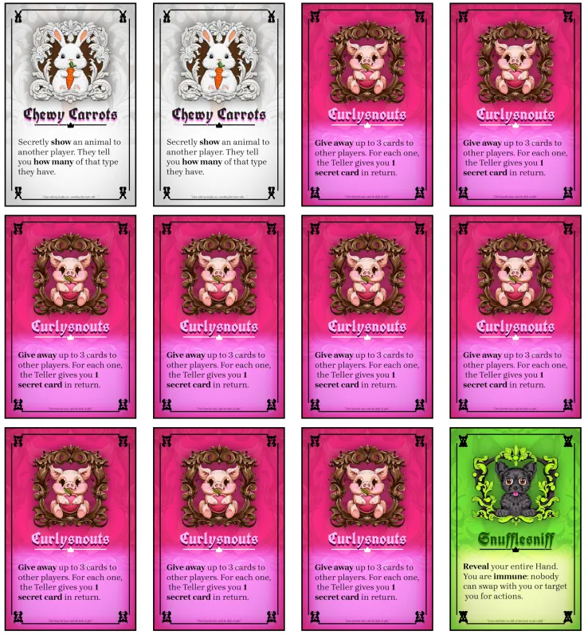

Welcome to the devlog for my game [Smallseat](https://pandaqi.com/smallseat). 

While making my game [Kingseat](https://pandaqi.com/kingseat) and its spin-offs, I realized something. The imagery I generated was beautiful, but very fantastical and a bit more ... grown-up. For example, one of the games has a few emblems for different factions that are seriously scary (fictional) monsters.

Additionally, these games started as "games you could play while standing up" ... but none of them really fit that description anymore. It's still preferred to have some sort of table for the Discard pile and the Vote pile.

As such, I started experimenting.

* Could I generate more "cute" and "kidfriendly" emblems?
* Could I rewrite the rules to _actually_ allow the game to be easily played without table or chairs?
* And in the process, try some other rules that might lead to a game that's even faster/simpler to play and setup?

That's how this version was born.

## Creating the imagery

This was a rather simple matter. (One of the reasons I actually got this idea and decided to go through with it.)

Through the previous games, I'd already finetuned the visual style and workflow for these games. I had a list of exact prompts I could feed the generative AI to get images "in the ballpark" of what I needed. (Most of them still required tinkering or extra manual drawing afterwards. But out of 20 generated images, I'd usually find one or two that had done 95% of my job.)

This meant I learned two ways to make the images much more cute and cartoony.

* Literally add the word `cute`
* Ask for huge eyes and bright colors

That's it. The combination of cute, bright and big eyes is a very common descriptor for kidfriendly cartoony drawings (at least in the dataset on which the AI trained).

I created a list of "common animals" that looked cute (in general). This meant I had to change some animals from the other versions. For example, Queenseat had a _rabbit_ as the White animal at first. But a rabbit was an obvious choice for _this_ game, so I had to swap that for a white Owl.

Once I had the list, I generated the icons with AI and did manual painting where needed.

## Changing the rules

The biggest changes would be in two areas.

* Setup
* Somehow make the Discard and Vote pile ... disappear!

The setup of Kingseat is the most involved part of the rules. 

* You need to do some math to get the right number of cards (and Princes) in your deck
* You need to designate the Kingseat
* You need to designate people in charge of the Discard and Vote piles
* Players trade cards with their left and right neighbors
* And then they pick their secret Loyalty

I wanted to shorten this. Hence, my goal for this game was ...

* To allow throwing anything in the deck and it should work
* To remove separate piles (which would need a table)
* Don't do any _trading_ and don't pick your Loyalty during setup.

### No piles

The solution? A **player** would represent (and hold) the piles. (I call this the **Teller**.)

* One player starts without cards
* The winning votes from a round, go into _their hand_ (facing them)
* The discarded cards also go into their hand, but facing _outward_ (towards the other players)

I thought it was a beautiful solution. It means one player automatically tracks these two separate piles. This player can just _play the game_ together with the others, but with the interesting wrinkle that their cards are decided by what everyone else plays.

### Don't pick Loyalty at the start

The solution? You stop playing once you have **1 card left**. That final card _is your secret Loyalty_.

Another solution I thought was elegant. It also removes the reason for the 5-step setup of Kingseat.

In Kingseat, you pick your Loyalty at the start, before playing the game. This means you need _some_ information about the other players and _some_ way to design your starting hand, otherwise you have nothing to go on. That's why I added the trading of cards and such.

But if your Loyalty is simply your final card, you can switch strategies during the game. As more information becomes available---while playing---you can decide to leave another card for last.

The only exception is that special player holding the piles (the Teller). Their hand will only _grow_ during the game. As such, they must publicly announce their Loyalty at the start.

These two simple "wrinkles" to the rules seem very interesting to me. I need to _test_ them, however, to see if they are any good.

### Easy deck

This problem mostly solved itself by solving the others!

You can create any deck you want. Any leftover cards simply go into the hand of the Teller from the start. 

By adding more cards or animals, you create a longer and more complicated game. The choice is still yours---but it's a very easy choice now.

In fact, I lean towards adding fewer cards per animal, or designing animals with a different number of cards in total. So that I can always say: "just add _all_ cards for this animal, and it will be balanced"

{}
Let's say you have an animal that counts for **two** votes. Both during the game, and when counting at the end. That's **very powerful**. One way to balance that, would be to simply include fewer cards of that animal.
{}

## Back after a Break

It's been roughly a year. I had planned to "update" the Throneless Games project and make the other games for the end of this year, and with the deadline approaching, I had to return.

I was initially hesitant to do so, I must admit. I left the project behind with the idea of "could be great, but currently the ideas are just not there yet, and I see no solution". I had hoped to gain more inspiration or insight by leaving it for a year.

Fortunately, I was right.

My biggest issues were _Lack of information_ and _Lack of control_ (which leads into monotone or static gameplay). When I came back, I quickly saw some "obvious" ways to solve these, both at a core level (the Throneless Mechanic itself) and the more superficial level (the actions on specific Animal cards).

### How do we get more information?

For example,

* Instead of an action always being good ("you may see someone else's cards"), have many of them require a small payment from you ("reveal 1 card to see another player's hand"). This not only makes it more interesting tactically, but doubles the amount of information being passed around every round.
* The Teller _always_ plays their Vote first. (Everyone else votes simultaneously in secret.)
  * We needed this rule anyway for when they used a public card, as everyone would know what they voted.
  * Making it "always" simplifies the rule and gives players a least 1 known card going into a round.
* Similarly, we add actions or rules that _limit_ what you can play in a round. 
  * For example, "you're not allowed to vote the animal the Teller shows the most".
* We change something at the core: **when you swap places, also swap 1 card**

Because this game has no "Dark Cards" and all cards (of one Animal) share the same action, the first bullet point was needed anyway. Without it, actions were all unbalanced and there was no counterweight. Having this "pay a little->get a big reward" system solved that.

Similarly, after making so many games, I've learned a simple truth:

> "_Trading / Swapping_ cards is always stronger than _looking at_ cards."

When you're allowed to _look_ at another player's cards, you have to _remember_. Even people with a great memory will struggle to remember 10+ cards spread across player's hands. If what you see is of no interest to you, this action now feels _wasted_.

When you swap/trade cards instead, you don't have to remember. That new card is literally in your hand; you can see it at all times! And this action actually _changed_ the state for two players, which always makes it feel impactful.

In the end, I added three of these ideas into the game. The one about "limiting" which cards you may play felt like one rule too many for this simplest version.

### How do we get more control?

This was partially solved by the previous changes. 

* Because the Teller votes first, you know 1 Vote already, so you can play around that to make your desired Animal win more easily.
* Because you swap cards, you can give away "bad" cards _or_ plant them at another player who must vote them at some point.
* Because actions are slightly more involved, you still have a choice or control after deciding to execute it.

Still, I wanted to give the player in the Smallseat just a little more power. That position is special so it should _be_ special.

For this simplest version, I picked one small twist.

> The Boss ( = person in Smallseat) decides if the round happens CLOCKWISE or COUNTER CLOCKWISE.

I need to explain the direction (clockwise, normally) anyway. So changing that sentence into one presenting a choice doesn't complicate the rules.

It _does_ give the Boss more power and control, while making the game far more varied.

### Picking the actions

With this new knowledge, I picked simple actions for all animals. Things I hadn't before in Kingseat, things that had this "pay->reward" structure to give more info/control.

From my original ideas (left behind a year ago), I had to discard most actions. They were too powerful or chaotic, such as

* "The Teller flips all their cards (public <> secret)" => Woah, Tiamo, this literally means a single action can undo ALL votes and switch them for random different ones. Not fun.
* "If CONDITION is met, you end the game instantly." => Conditional actions are too complicated, especially when they're such an exception. And it's near impossible to find a condition/rule that does NOT allow ending the game in the first few rounds, which obviously means you haven't actually played the game.

Coming back to the game and reading my old notes, I also instantly had a few other ideas. Back then, I was probably afraid to touch the core mechanic. Now I know better: each Throneless Game was actually _far too similar_ to one another, and I had to purposely make them _more different_ at their core.

{}
I've learned this from making a lot of other projects containing multiple games. It's not interesting or useful to create a second game if it only changes the look and a few minor rules/actions from the first one. Instead, I brainstormed all possible variations on my core idea, and made each "spin-off" actually a unique game that went into an entirely different direction.

It's why I also stopped calling them "spin-offs" long ago, as now each game within a project is decidedly different and creates a different experience.
{}

As such, those other ideas do NOT appear in Smallseat, but in _one_ of the other games. To really make those _unique_ and worthy of playing (and developing, actually).

## The final cards

Below is a quick screenshot of the final PDF (at this moment in time).

I settled on 9 cards per type, down from the original 12. 

The original games had the confusing recommendation to include "one fewer Animal than the number of players", and then deal out "8 cards per player"---which meant you also had quite some cards left over. Another one of those weird wrinkles that seems needlessly complicated now, looking back on it.

Now it's just "include 1 animal per player; deal until empty (which means 9 cards per player)".

Also, better fonts and sizing + text formatting (the important part of actions is **bold**) does a _lot_ of work making it look better and more professional.

## Playtesting & Polishing

@TODO
