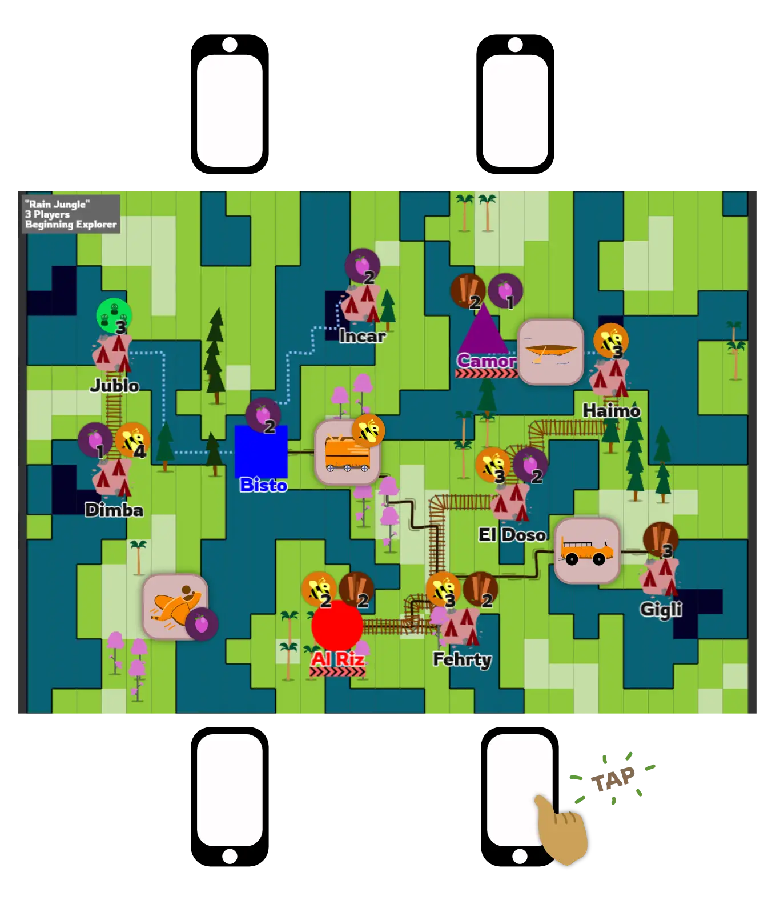
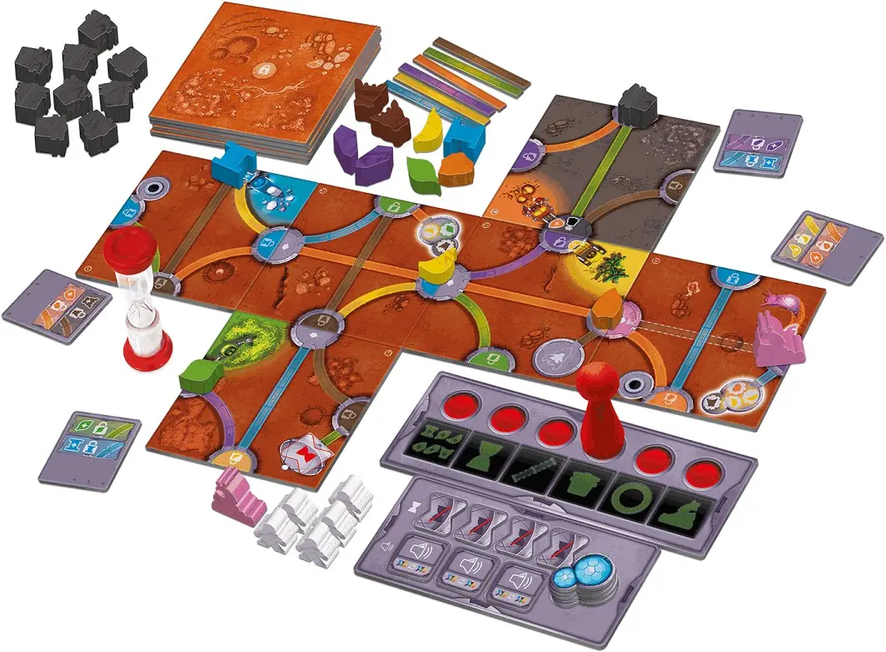

Ever since inventing a new genre of board games (the [One Paper Games](https://pandaqi.com/boardgames#one_paper_games)), my mind has been overflowing with ideas for innovative types of games.

In this devlog I proudly present the first result of all those ideas: a
**hybrid** board and computer game!

(I don't have a strong name for this type of game yet. A *comboard
game*? A *"smart game"?*)

{.float-right}

The game itself is played on a physical board with physical pieces, but
all players must also have their *smartphone* on the table and use that
for many actions in the game. It took me a *long* time to figure out how
to make this work, and accessible, and as fun as possible (instead of
people just staring at their phones all the time).

So, in this devlog, let me explain the original idea, my steps in
pursuing it, and how it finally let to the first game of its type: [Timely Transports](https://pandaqi.com/timely-transports)

(I'll explain the game in detail later. All you need to know for now, to
understand the text below, is that it's a game about *transporting
goods* across a jungle. The game boards are randomly generated on the
website and you need to start a timer on your phone for each *movement*
of your vehicle(s).)

Where did the idea come from?
-----------------------------

Lately, I played a *lot* of "*Magic Maze"* games. In that game, the sand
timer is instrumental. When it runs out, you lose. During the game you
can "reset" it, but only four times, and you usually need all four of
those if you want to be successful.

It reminded me of my love-hate relationship with sand timers. It is
*very easy* to miss it when they run out. They can get knocked over by
an enthusiastic player (certainly in a cooperative, all-around-the-table
game like Magic Maze). But they also automatically add a time limit and
a sense of urgency to any game, which is very useful.

So I thought: why aren't there any boardgames where all your actions are
timed? Where you need to place a sand timer for doing something, and you
must wait until it runs out to complete the action?

Turns out those games exist! I stumbled upon *Kitchen Rush* and *Medic
Rush*.

The first game is basically the analog version of *Overcooked* (in case
that game is familiar to you): you must gather ingredients, combine
them, cook them, and then deliver them to customers for points. All of
these actions work by placing a sand timer on the appropriate spot and
waiting until it has run out.

I'm still waiting for these games to ship to my country, but when they
do, I'll surely try them out, because they seem to be amazing,
cooperative, family-friendly, accessible games.

Anyway, this got me thinking: **instead of including twenty sand timers
in a game box ... why don't we let the computer do this?**

Computers are amazing at timers! (And numbers in general.) Instead of
having loads of physical timers (with fixed lengths), I can just start a
timer *of any length* on my phone with the press of a button.

And that's where the original idea came from. I wanted to create a
regular board game, but with the addition of a computer/smartphone
component that gives me great new possibilities, such as easy and
precise timers.

**Update:** I just learned about the game *Pendulum* that *Stonemaier
Games* is releasing. Seems like everyone is discovering the use of
timers in games these last few years :p

Do we really need a smartphone?
-------------------------------

In the rules of Magic Maze, it states that you should NOT use a timer on
your smartphone for the game, as the experience is noticeably different.

And I like the inclusion of that warning, because I agree with it.

If I made a game which required only a single timer, yes, I would just
include a physical sand timer. It's faster, easier to use and
understand, keeps you in the game.

So, for my *hybrid* idea, I needed a *very compelling reason* to include
smartphones. We're still in the *early idea* stage now, so if I couldn't
find a good reason, I would've just thrown this idea into the bin and
worked on something else.

The first thing I did was list the *pros* and *cons* of this approach.

Advantages of using a digital component
---------------------------------------

These were the main advantages I could find before and during
development.

-   **Memory**. A computer can store and display loads of values, so
    players don't have to keep track of anything or calculate values in
    their heads. Most noticeably, it can keep perfect track of
    **score**.

-   **Dynamic**. Instead of having only a limited set of timers with a
    fixed length, I can create as many timers as I want, with varying
    lengths.

    -   In fact, instead of having only one stage (full -\> empty), I
        can chain stages. In this game (Timely Transports), when a timer
        runs out it goes into a second stage: *overtime*. This gives you
        10 seconds to either click off the timer or upgrade your
        vehicle.

    -   Of course, the possibilities go far beyond timers, but I want to
        keep it simple for now.

-   **Fast Setup**. Most people always have their smartphone at hand.
    With these games, you only need to take out your phone and visit a
    website, and you're ready to go. (As opposed to board games, where
    you'd need to take things out of the box, arrange them, perhaps hand
    out cards, etc.)

-   **Sound**. Surprisingly, this only occurred to me halfway
    development. *Phones can play sounds!* I can play a sound whenever
    something interesting happens in the game, and I can provide a
    general background track that suits the game and the theme.

    -   This is a far greater advantage than you might think: when
        you're starting at the board trying to decide your strategy, the
        sound of an alarm bell is sure to bring your attention back to a
        new event on your phone.

-   **Endless Possibilities**. Seriously, I can display *anything* on a
    phone, and even make it interactive or use the internet! This allows
    countless innovative mechanics that have never been done before in
    gaming, which is at least worth exploring.

An aside about Timers & Psychology
----------------------------------

An additional advantage to using *timers* specifically, is that the game
is guaranteed to be quick (and end after a short amount of time) and
simultaneous, without any dead moments.

If there's one thing I've learned over years of game playing and
developing, it's that *quick and (near) simultaneous games* appeal much
more to people than any other game. What turns people off, usually, is
the "waiting on your turn" or "I don't want to risk spending the next 2
hours sitting at a table". Just a small nugget of wisdom.

(Additionally, if you have a general crowd instead of frequent gamers,
*cooperative* games are your best bet. Many people are like "I'm just
not a competitive person" and only want to play those types of games.
And when they do, ironically, they become extremely enthusiastic and
competitive :p)

Disadvantages of using a digital component
------------------------------------------

And these were the main disadvantages I could find before and during
development.

-   **Hard Requirements.** It's highly unlikely, *but possible*, that
    someone doesn't have their phone, or doesn't have internet, or my
    website is temporarily down. This would render the game unplayable,
    as the digital component is absolutely necessary.

-   **Too Many Screens.** People are already sitting behind screens
    enough these days. I don't want to make "placing your phone on the
    table when playing a game" a normal behavior. I play board games
    (instead of video games) most of the time, *because* it's not behind
    a screen and *because* it's a live social interaction. I don't want
    my games to have a bad influence on people's habits or expectations.

-   **Size Restrictions.** Smartphone screens are quite tiny, simple as
    that.

    -   When building the interface for Timely Transports, I had to
        completely rethink my design (and rewrite the code) three times,
        because the first three versions were just *too small*. It was
        hard to see icons at a glance, and it was easy to click the
        wrong thing.

    -   So, lesson learned, I really cannot expect to have more than 5
        or 6 elements on the screen. (Where an element can be an icon,
        or a score counter, or an event popping up.)

-   **Loose Links.** I cannot "connect" a smartphone with a piece of
    paper ( = the game board). I also don't want to connect multiple
    smartphones with each other, as that is hard to program and
    maintain, and makes the setup considerably harder. So, I can only
    design games where a *loose link* is enough to make them work.

    -   For Timely Transports, I eventually decided to give each game
        board an *identical* number of cities (with identical names).
        That way, phones would automatically shout city names *that
        existed* on the board, regardless of the game board you printed
        or your player count.

    -   Additionally, most of the information is on the game board
        itself. At first, I wanted the phones to determine which goods a
        city wanted to have. (For example, it would say "City X now
        wants **Fruit** for **3 points**!") But ... this allowed the
        accidental possibility that, for example, *all cities* wanted
        fruit, and they wanted nothing else. Which would make the game
        boring or simply unplayable.

That's it for part 1. In the next article, I'll discuss how I used these observations to work towards the first version of this game.
