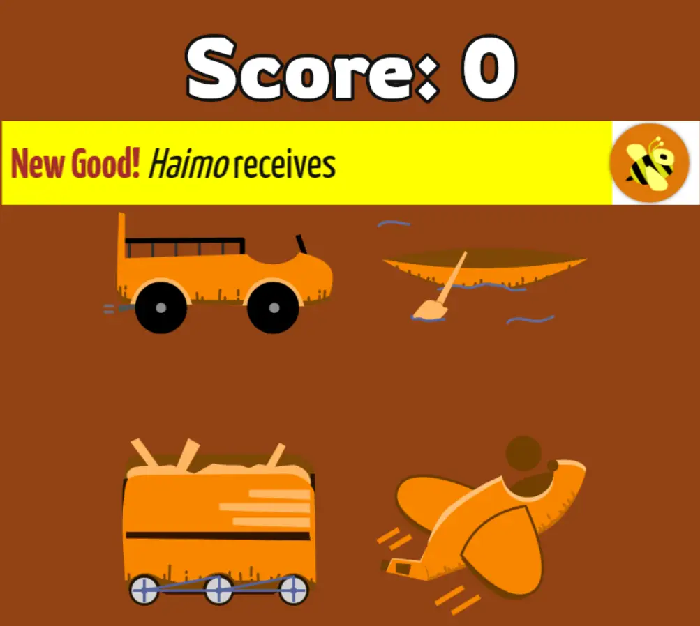

Welcome to part 2 of the devlog! Let's dive right in.

The First Version -- Space Shenanigans?
---------------------------------------

With a strong idea about how such a game might work, I went on a hunt
for simple gameplay ideas and accessible themes.

My first pick was a cooperative game, where everyone is on a
**spaceship** together. During the game, you can place tiles to extend
the ship and send people on missions, *but* all those missions and
extensions cost time.

Additionally, events would regularly occur, such as space pirates
entering your ship or a meteorite damaging it.

The rewards for your missions (*space credits*, probably) could then be
used to buy things in the *shop* on your phone.

The idea is still promising ... but I was already making it *way too
complex*. This has at least four or five interconnected unique systems,
whereas I still didn't know if the original idea would work at all.

So let's simplify. Let's think.

What always costs time? And what has an immediate *negative* impact when
it takes too much time?

Ah, I know: *traveling!* (Or, well, my first thought went to: hmm,
*packages* that arrive too late are annoying. But even that lead to a
more complex game design than I wanted for my first hybrid game.)

The Second Version -- Timely Transports
---------------------------------------

So here's the reason I think this theme is ideal.

In the real world, traveling takes time. Additionally, different
vehicles or routes take different amounts of time.

If you take too long, the negative consequences are obvious. Someone
else will arrive before you, stealing your points. Or your cargo will go
bad (if it's something edible or fragile or whatever). And if you are
slow once, that will lead to a chain reaction where you're constantly
too late.

Without *any* extra rules, such a game would work and heavily *rely* on
timers. People understand how it works and why there's a timer to
everything.

(That's also the reason why I think those cooking games work wonders.
People *know* cooking takes time, so it's only logical to put a timer on
it, and force them to do something else in the meantime ... possibly
causing them to forget their original project and let the kitchen burn
down.)

There are many games with modern transportation or semi-modern vehicles
(like the old steam trains in Ticket to Ride). Let's do something
different. Let's go ... traveling through the Jungle!

(This was partly inspired by the font I chose. It just gave that
Jungle/Rainforest/Indiana Jones vibe, and I liked that.)

Finally, we've arrived at a working concept: **you are transporting
cargo across the jungle**. For each movement, you start a timer. Once it
runs out, you can finish the movement and go to the next space.
Delivering goods to cities that want them yields you points. The first
to 20 points wins!

To give you a preview, this is how the game board and interface looked
at the end of development:

The Obvious Inclusions
----------------------

With a game like this, many of the early choices I made seemed kinda
obvious. Nevertheless, they were very easy to add and explain, and make
the game as good as it is today:

-   I need **different types of routes** on the map. Why? So you need a
    **specific kind of vehicle** to travel it. (Only boats can move over
    water, only trains over railroad, etc.)

-   I need **different goods with different characteristics**. Why? A
    low-value good will appear *very often* on the map. A high-value
    good will only be accepted by a handful of cities. This
    automatically adds variety, an interesting choice, *and* a fallback
    decision if you're having a tough game. ("Man, I just keep missing
    out on those high-value ones. Maybe I'll just very quickly deliver
    five low-value things.")

-   I need **events**. With everything fixed on the game board, I need
    some more variety. Prices should fluctuate, weather should influence
    traveling, that kind of stuff. I decided to make events pop up at
    random that say something like "City X doesn't accept any goods
    anymore", which automatically went away after 30-60 seconds.

-   I need **upgrades/stuff to buy**. This would add a necessary sense
    of *progression* to the game. After moving 5 goods in a row with
    your boat, you want to do something else. So I wanted to include the
    possibility of upgrading your current vehicles or buying new ones
    (which would be faster).

All these things were immediately put into the game, and stayed there,
because they worked. (Nevertheless, I do try to push myself to
diversify, as I introduce these concepts *a lot* in all my games.)

I *did* eventually make several "difficulty levels", and only introduced
the more complex mechanics on higher difficulties. This works all the
time, in my experience. It makes the game super simple when you play it
for the first time (or with a new group of people), but doesn't take
away any of the super fun and interesting stuff I also wanted to add.

Problems, Problems, Problems
----------------------------

And then, as usual, problems started to appear.

**Problem 1: Too little space!** The game board was getting cramped (the
one you should print and play on), as well as the game interface (on
your smartphone).

So, let's forget the idea of *buying new vehicles*, because I simply
don't have room for them. Let's cap it at four vehicles, which you can
upgrade.

Let's also reduce the number of routes and airports. In fact, let's not
display an icon for airports, and just display an underline below the
city name.

While we're at it, let's *zoom in* on the board on lower player counts,
so everything is bigger and clearer.

(I tried, but with 8 players you'll have so many cities on the board, I
can't make it any bigger than it is. I propose printing on A3 paper if
you can.)

The work I did on *randomly generating a playable jungle with cities* is
a whole topic on its own! So I'll probably write a separate devlog or
chapter on that alone. (Spoiler: it's really hard, and messy, and takes
a lot of experimentation to get right.)

**Problem 2: Loose Connections!** Remember when I talked about this
disadvantage?

It might seem obvious now, but at the time I really didn't know how to
proceed. How to make sure the phones said sensible things? Even if they
didn't know the game board *at all*?

It took me a while to acquire the current solution:

-   Given a certain player count + difficulty, the board will *always*
    include the same cities (with the same names) and goods. The board
    is still entirely random, but at least there's the *name* of cities
    and goods that will always exist.

-   Each city's desires are printed on the board. (But events can change
    this temporarily, to an extent.)

-   Airports are only placed when they are *necessary* to connect all
    cities. (Otherwise it was too easy to just fly anywhere. Also,
    airplane connections are the *hardest* to visualize for players. All
    the other connections have a clear line from A to B, but plane
    connections are just "yeah, teleport from A to B")

    -   In fact, as I write this, I'm wondering whether I should move
        planes to a higher difficulty level. I can easily imagine people
        getting overwhelmed by learning how *four* vehicles work on
        their first game. Even if they are extremely simple and
        intuitive.

-   Forests! Surprisingly, placing forests in the world gave the board a
    lot of clarity. Routes were easier to follow, because they had less
    space to wiggle around. It was easy to see where a city was, because
    it surely wasn't anywhere in that big forest.

    -   It also sped up the board generation, because I didn't need to
        check any possible paths through forests. But that is, again, a
        whole topic on its own.

**Problem 3: Too little space, again!**

When I thought I had the space problem figured out, I found a few new
issues with the game board by simply *thinking it through*.

I was like "Okay, so, how many cities do I need with each player count?
Suppose we have ... 6 players, would, say, 6 cities be enough then?"

Then I remembered each player had *4 vehicles*. With 6 players, that's
24 vehicles, moving around the board all the time. Not to mention actual
*goods* lying around as well. I don't think 6 cities is enough.

Thus, I invented a (*very scientifically sound*) rule of thumb: on
average, there should be *at most* three things on a city. With 6
players, that means 24 vehicles, and about 6-12 new goods per minute.
(The time between new goods is slightly less than a minute, per phone.)
So, worst case, 32/3 = 11 cities.

For what it's worth, all tests and generated boards so far have been
quite balanced, so I have reason to believe this will all work out in
the end!

Vehicle Movement
----------------

Now the final aspect. The most important aspect to get right, because
moving vehicles is *all you'll be doing in the game*. (When writing the
rules, I realized it's literally the only type of action. Which is
always a good thing, as it made the rules super simple.)

In my head, there is always this four-sided die of navigation: *car,
train, boat, plane*. (Which also happens to rhyme.)

I used this again, because even after all my research into jungles and
their transportation, this still seemed the best option. (I mean, I
considered making people hop on the back of monkeys, but that just
didn't work out. For too many reasons to mention.)

So everyone has four vehicles. This means we need three road types and
airports. When moving, simply **start the timer**, wait or do something
else, and when the timer finished, actually **move** to the new location
and stop the timer.

You can always take **one good** from your current city with you. And
while you're moving this good ( = it's placed on your vehicle), nobody
else may touch it.

Thankfully, the hybrid setup helped me here. I didn't need to give
vehicles any other properties, because the *computer could take care of
that*.

The different vehicles have slightly different timer lengths, but
players don't need to have that explained to them. They just click on
the matching icon, and a timer will magically start and do everything
for them!

Also, because each vehicle was unique (you couldn't purchase a "second
boat"), you always knew exactly what each icon (and timer) was referring
to. Tap it to start the timer. Tap it to stop the timer. Simple stuff!

One Last Problem
----------------

There was just one problem left: **how do I get a boat from A to B ...
if there's no route that's 100% over water?**

(More generally, how to move vehicles to cities if there's no route
towards the city they can travel themselves?)

I found two solutions this time, which are both in the game!

**First solution:** vehicles can also be used as **goods**. So, you can
literally transport your boat to another town *using one of your other
vehicles*. This automatically turned the game into a much better and
bigger puzzle, as you now need to plan ahead to get your vehicles where
you want them to be.

**Second solution:** each player receives a **capital**. I needed that
anyway, to give players a city to start from, and to make the world feel
more alive. (Players want ownership and customization! Give them
something that's theirs.)

(This image is taken directly from the rulebook, so it also includes
another rule I will talk about soon: bumping other people off the
board.)

But this allowed the **Teleportation Rule** to be added: at *any time*,
instead of moving over a regular connection, you can *teleport* your
vehicle back to your capital. (This follows all the same rules as
moving: you still start a timer, wait, etc.)

It's an extremely simple addition, but it helps out a lot. When you're
stuck, you can always just decide to go back to home base and navigate
your way back into the world.

Finally, finally, we have a complete and working first version. So we can playtest it! In the next article I'll discuss this playtest and what I learned from it.