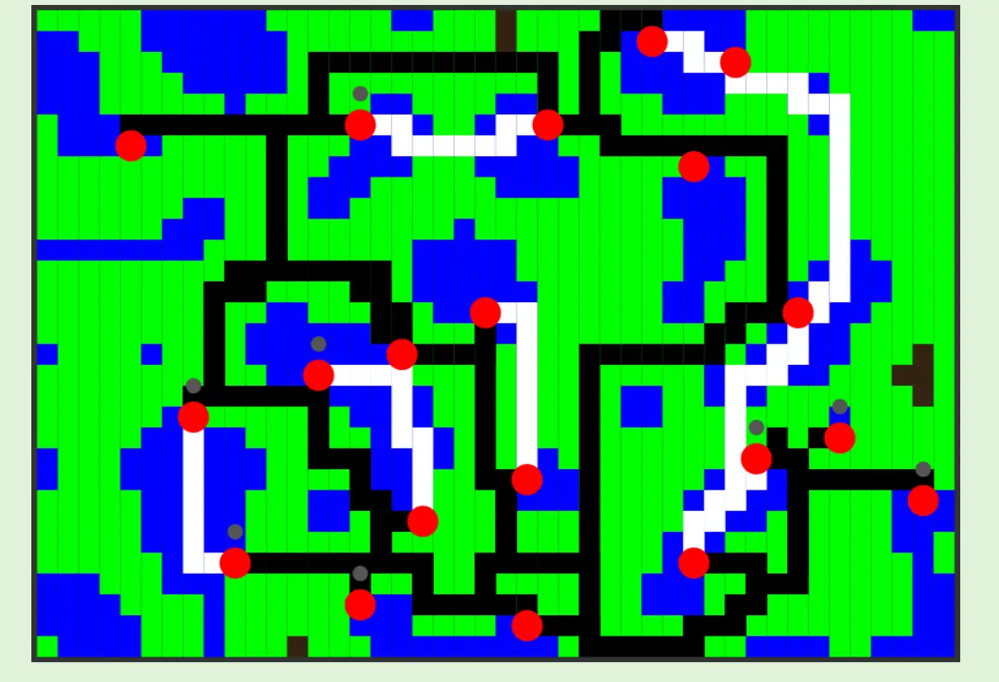
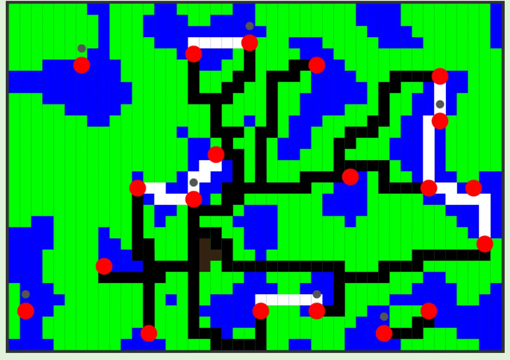
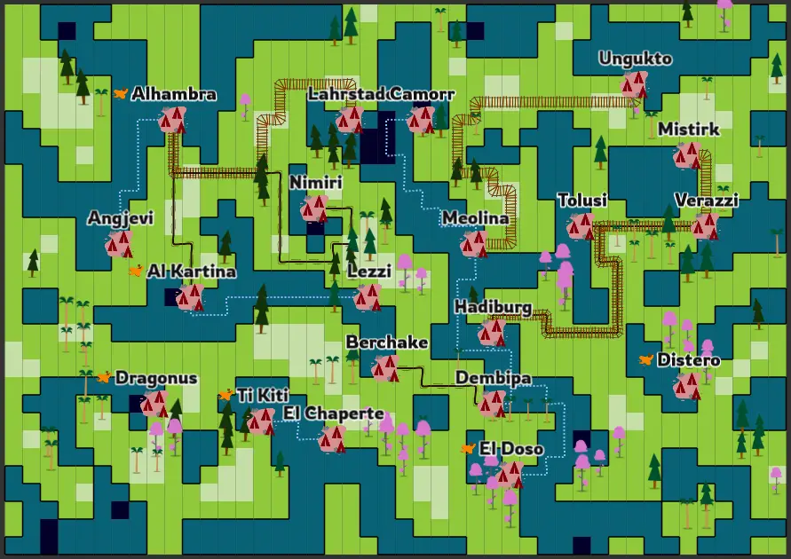
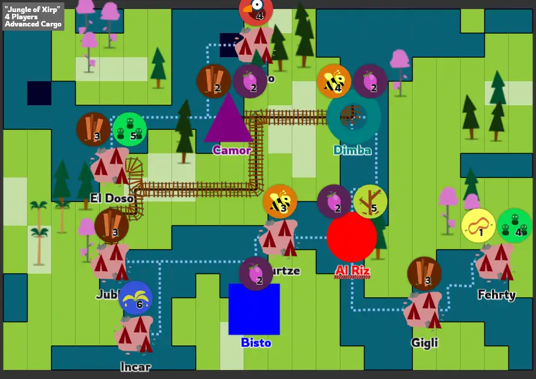

In part 1 I outlined the difficulties with what I was trying to do (combine a boardgame and smartphone, and generate random boards), but also **why** I want to do it. It has clear advantages, has never been done before, and opens many opportunities.

So let's see how we go about that.

Everybody make some noise!
--------------------------

Step 1, as always, uses *noise* to generate a random landscape. I
started with *Perlin Noise*, but switched to *Simplex Noise* as it gives
better results on a grid.

(Why? Perlin Noise will always yield a noise value of 0 if the
coordinates you enter are integers. In practice, you get a map with lots
of completely straight vertical/horizontal lines, which is ugly.)

I loop through all grid cells, take the *average* of the noise value of
the four corners, and save that as the definitive value.

(Why? After many experiments, I found this to be the best way to capture
the roughness of continuous noise on a *grid*. If I just sample one
noise value -- say, the center of the grid square -- there's a good
chance two squares next to each other both sample the value "0", whilst
completely missing a range of super high values between them.)

This approach *does* smooth the noise, as you're taking weighted
averages all the time. Even though the noise takes values between -1 and
1, after averaging the extreme values were usually -0.7 to 0.7.

But that's fine!

Now that I have a grid of values, I convert it to a terrain. After some
trial-and-error, the water line became -0.4. (Everything below that is
water, everything above is land.) But you can raise this value, for
example, and get a huge sea with some tiny islands in it.

Nice!


// you can see this as the "resolution" => it determines how large each cell is and how far zoomed in the noise is
const z = (this.cfg.cellSize / this.cfg.noiseZoom);

// determine noise value per terrain cell (and initialize some other settings for each cell)
for(var x = 0; x < this.cfg.widthInCells; x++) {
  this.terrain[x] = [];

  for(var y = 0; y < this.cfg.heightInCells; y++) {
    // take average of corners in perlin noise
    var weight = 0.25

    var noiseVal = weight*noise.simplex2(x*z, y*z);
    noiseVal += weight*noise.simplex2((x+1)*z, y*z);
    noiseVal += weight*noise.simplex2((x+1)*z, (y+1)*z);
    noiseVal += weight*noise.simplex2(x*z, (y+1)*z);

    this.terrain[x][y] = 
    { 
      'val': noiseVal,

      'isForest': false,
      'forestFrame': -1,

      'partOfPath': false,
      'pathSprite': null,
      'pathTypes': [],

      'cityAllowed': true, 
      'city': null 
    };
  }
}


<!--  -->

(This image already has paths between cities, which I'll discuss soon. I
just didn't have any earlier screenshots of the progress, sorry. And
yes, the colors are ugly, that's how it always starts :p)

Placing Cities
--------------

This step confirmed a famous quote from the game industry (I'm
paraphrasing):

"Whenever you write a new feature, start with the absolute *dumbest* and
*most naïve* approach possible. It will often turn out to be the right
one and save you a lot of time."

A year ago, I worked on a "pirate game" that needed to know the
boundaries of islands. (This project eventually went nowhere, *but* it
taught me everything I use these days in my newer projects. To prove
this, it will soon pop up again!)

I copied this code and changed it to get the boundaries of *lakes*
instead.

How does it work? Really simple: it loops through all water tiles and
checks the neighbours (top, right, bottom, left). If *any* of the
neighbours is a land tile, then this water tile *must* be at the edge!

Why do I need the boundaries of lakes? Because traditionally, and
especially in the jungle area (in which this game is placed), people
placed settlements *near running water*. I want to do that as well!

The city placement algorithm now became very simple:

-   Pick a random tile at the edge of water.

-   Check if any other city is nearby (I don't want cities too close to
    each other)

    -   If so, retry with a new tile

    -   If not, continue

-   Place the city on this tile, disallow all tiles within a certain
    radius.

Below is the code for this whole algorithm.


/* 
    STEP 1
    Go through whole grid, check neighbours, and mark locations at the edge of the water
    (in the code, these were called dock locations, to remind myself they are a bridge between water and land)
    
    NOTE: Perhaps more optimized to keep a list of water cells and only go through those, 
          or do this action within another loop we're already doing
          but I usually separate these things for clarity's sake
*/

for(var x = 0; x < this.cfg.widthInCells; x++) {
  for(var y = 0; y < this.cfg.heightInCells; y++) {

    if(!this.terrain[x][y].isWater) {
      continue;
    }

    var neighbors = [[1,0], [0,1], [-1,0], [0,-1]];
    var waterNeighbors = 0;
    for(var n = 0; n < 4; n++) {
      var newX = x + neighbors[n][0], newY = y + neighbors[n][1];

      if(!this.outOfBounds(newX, newY) && this.terrain[newX][newY].isWater) {
        waterNeighbors++;
      }
    }

    // place city on water edges, but NOT if they are very close to the bounds of the map
    // (this looks ugly and probably cuts off the city name/details)
    if(waterNeighbors < 4 && this.distanceToBounds(x, y) >= this.cfg.minDistanceToEdge) {
      this.dockLocations.push([x,y])
    }
  }
}

/*
    STEP 2
    for each city, place it somewhere it's allowed (dock location and not too close to something else)
    then disallow any cities in a certain radius
    (and turn it into a capital, if we still need those)
*/

for(var i = 0; i < numCities; i++) {
    var pos, x, y
    var tooCloseToCity = false;
    do {
        pos = this.dockLocations.splice(0, 1)[0];
        x = pos[0]
        y = pos[1]

        tooCloseToCity = !this.terrain[x][y].cityAllowed;
    } while(tooCloseToCity && this.dockLocations.length > 0);

    if(this.dockLocations.length <= 0) {
        this.generationFail = true;
        return;
    }

    // remember this city
    var newCity = 
    { 
        'x': x, 
        'y': y, 
        'capital': null,
        'connections': [],
        'connectionGroup': null, 
        'wantedGoods': [],
        'airport': false 
    }

    this.cities.push(newCity)
    this.terrain[x][y].city = newCity

    this.disallowCitiesInRadius(x, y);

    // make it a player capital, if still needed
    if(i < this.cfg.playerCount) {
        newCity.capital = i;
    }
}


<!--  -->

Creating Connections
--------------------

This was the moment I realized *why* the approach above worked so well:
it allowed me to create both routes over *land* and over *sea*, because
each city was on the bridge between both worlds.

This is an overview of the algorithm:

-   Go through all cities.

-   Check all cities that have *not* created their connections yet.

    -   Check path over water.

    -   If it doesn't exist, check path over land.

-   Once we have all possible paths, sort them based on distance.

-   Remove those that are *too long*, then pick random from the
    available ones.

-   (If at the end of generation, a city has *no* connections, give it
    an airport =\> this will change in later versions, as you can
    probably already see the flaw in this reasoning.)

If you do this, you automatically get a collection of paths over land
and over sea, like this:

Again, this is a map from a later stage of development. (I should really
learn to take screenshots that better suit the devlog.)

**Side note:** in the previous section I talked about creating a list of
"water edge tiles". I used this list for another very important thing as
well! I used it to create an *outline* for each body of water. If you
look closely at the image, you'll see that each lake has a thick blue
border. This makes a *huge difference* in the clarity of the map.

Pathfinding
-----------

But, you might ask, *how* do you find the path between two cities?

Aha! The "pirate game" returns! In that game, I needed to *very quickly*
find the shortest route between all trading harbours in the game ... on
a regular basis. There were usually 10-20 harbours, which needed to
update their routes roughly once every 5 turns.

As such, my pathfinding algorithm had to be *fast* and *customizable*.

That's why I wrote my own pathfinding script:

-   It uses A\*

-   But on a grid =\> all nodes are automatically connected to all
    neighbours (top, right, bottom, left)

-   With some space where I can input very specific
    changes/requirements/additions

I won't explain the first two parts, as there are countless videos and
Wikipedia pages on that. (And I don't even think my implementation is
that good, I only know it's fast and does exactly what I want.)

But the third part will benefit from some examples.

**Issue \#1**: if I create paths between random cities, there's a high
chance these will *nearly overlap* or *run side by side for a few
tiles*. This looks ugly. In real life, such paths would be "merged" with
an intersection.

So, in my pathfinding algorithm, I said the following: "if this
neighbour already has a path of the same type as you, give it an
*extremely* *low weight*."

In other words, make that connection *so cheap*, that the algorithm will
probably take it. This way, routes "snap" to existing routes of the same
type.

(This isn't perfect, but it solves 99% of the cases.)

**Issue \#2:** If I create a path over land ... the shortest path will
almost always be one that goes *along the shoreline*. The water is the
obstacle. The shortest path around the water is by literally following
the edge of the water. This looks ugly.

Instead, I want paths over land to stay near the middle of the land, and
paths over water to stay near the center of the water.

To do so, I said the following: "when creating a path over land, give
nodes with a *higher noise value* a *lower weight*" (For water paths,
the inverse holds.)

Small changes, but *vastly improved* results. (All because of that
unfinished pirate game!)

Nice Roads
----------

Okay, so we have connections between cities which are as short/optimal
as we can reasonably expect.

How do we make them look nice? I created an image for each road type
(water, car, train) containing 4 frames. Each frame was one of the
possible configurations such a road could have.

Then I replaced my rectangles (from previous images) with this
spritesheet, checked which of our neighbours had the same path type, and
chose the correct frame and rotation.

This is a monstrous piece of code which I'm not going to show. There are
probably better ways.

(I basically run through all neighbours and track the *longest sequence
of existing neighbours*. If I have three subsequent neighbour
connections, starting from the left, I know I need a 3-way connection
which is rotated 180 degrees. Yeah, it was annoying to write. But once
it works, it looks really nice!)

This was also the point where I chose the nicer colors. (I wanted it to
give a more "faded" look, instead of bright colors.) I created a quick
image for the cities, and saw ... that the map was quite empty and most
roads looked boring. How do we solve this?

To keep these articles to a nice length, I'm going to break it up here and continue in part 3! See you there.