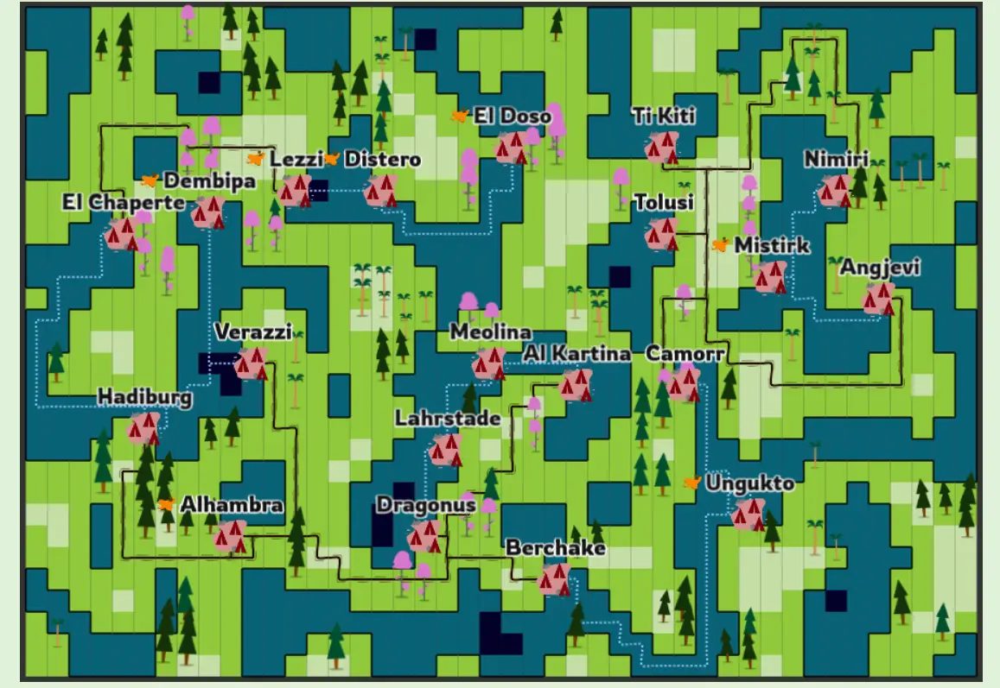
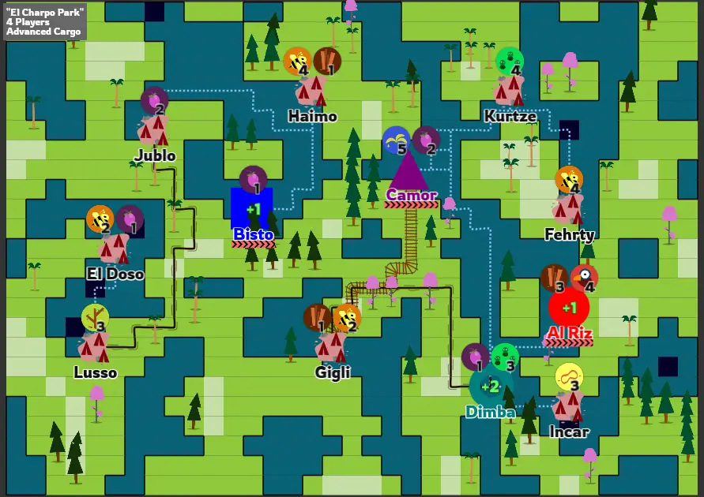
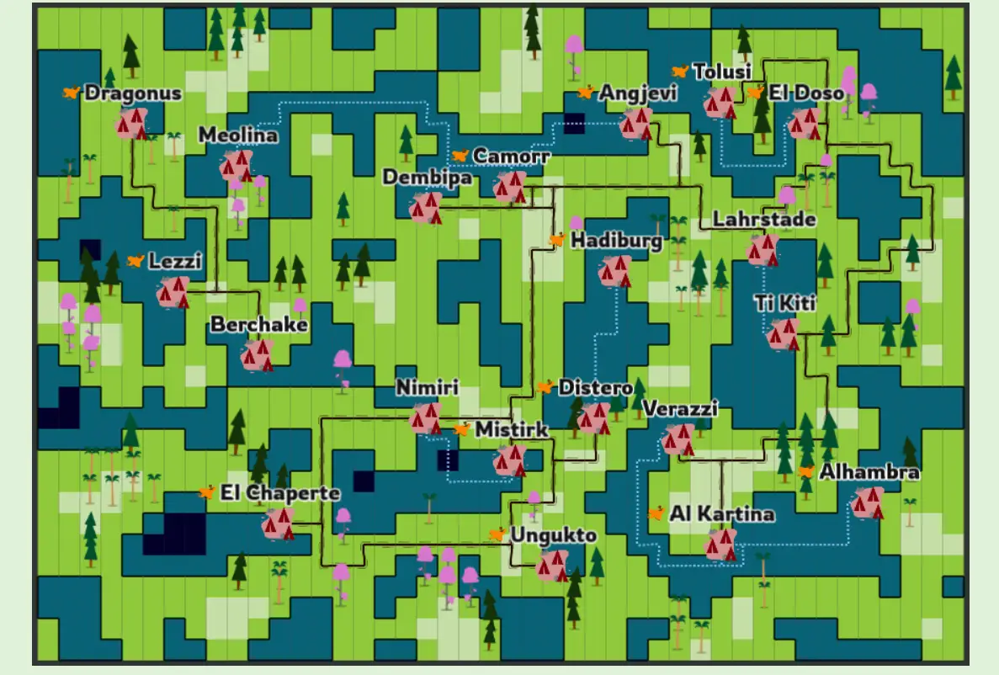

In part 2 I explained 50% of the algorithms/ideas needed to generate a random board. In this part I explain the other half!

Forests
-------

Pathfinding is interesting. It's an algorithm that becomes *faster* and
*more useful*, when you have a world that is *more filled and more
complex*. It's one of the few algorithms to do that -- most get slower
and more unwieldy when there's more stuff.

So, I created a *second noise map*, and used this to place forests
around the world. That's how I get these "blobs" of forest, which looks
significantly better than just placing random trees all over the map.

I also looped through all tiles again to determine random *tree types*
for each forest. It is, again, a quite naïve approach that works:

> "Hey, I am a tree, and there's another tree next to me! Let's set *my
> type* to the type of that *other tree!*"

This way, each connected set of trees will eventually have an identical
type.

With trees in the world, my pathfinding algorithm had way less space,
which means roads snapped together more often *and* they created more
interesting paths. (Of course, I added the exception in the algorithm
that forest tiles are completely forbidden.)

Goods
-----

After some experimentation, I realized there weren't really any
restrictions on this part of the algorithm. Yes, I could try to write
something that spaces out goods (so no two cities close to each other
want the same thing), but that would actually make the game ... easier
and more boring. Whatever good you wanted to deliver, there would always
be a city within very close range.

Instead, I allowed the algorithm to be completely free. Sometimes you
need to travel half the world to deliver a fruit, and *that's* when
things get interesting: will you take the risk? Are those 2 points worth
it? Or do you wait and hope for something better to come along?

I only implemented the following restriction: each good must appear at
least *twice*.

-   Initialize an empty list

-   Go through the list of goods, add each of them to the list TWICE

-   Fill the remaining space with random goods.

-   Shuffle ( = randomize) this list

Then I loop through the cities in order, giving each city one good at a
time, until the list is empty.

Two issues remain:

-   *What is the "remaining space"?* At first I wanted 2\*\<number of
    cities\> goods, because I thought that was a good idea. It wasn't.
    It made the board way too full, hard to read, but easy to play
    (because each city wanted many goods). Instead, it now averages 1.5
    good per city, which means roughly 50% will only want one type of
    good, and the other 50% want two types of goods.

-   *Don't allow the same good to be added on a city twice!* It's quite
    stupid if a city wants bees for 4 points ... and bees for 5 points.
    So, before adding the good, I check if it's already there. If so, I
    just continue to the next city.

Below is the code for this algorithm. 

(I don't know if I need to say this, but these code samples are usually **not** the full code. I leave out the uninteresting bits, or parts that might be confusing. And some things are just a function call. Like "cityHasRoomForGood()"---I think everyone understands what that function is doing.)


// "GOODS" = dictionary with all goods (incl PROBABILITY of appearing and DIFFICULTY when they appear)
// The first part of the function removes all the goods we don't need
// The second part draws randomly following this probability distribution

function determineCityDesires() {
  // first, truncate list to the goods we actually want
  // whilst calculating total probability
  // and adding each good to the list (twice if it's a default good and the number of cities supports this)
  const goodsList = [];
  const gameDifficulty = DIFFICULTY_LEVELS[this.cfg.difficulty];

  var totalGoodProbability = 0;

  for(name in GOODS) {
    const goodDifficulty = DIFFICULTY_LEVELS[GOODS[name].difficulty || "Beginning Explorer"];
    if(goodDifficulty > gameDifficulty) {
      continue;
    }

    totalGoodProbability += GOODS[name].prob;

    goodsList.push(name);
    if(goodDifficulty == 0 && this.cfg.numCities > 10) { goodsList.push(name); }

    this.GOODS[name] = GOODS[name];
  }
  
  // now add goods randomly, following probability distribution, 
  // until we have enough (roughly 1.5 per city)
  const desiredTotalNumberGoods = Math.floor(this.cities.length * 1.5)
  while(goodsList.length < desiredTotalNumberGoods) {
    var randGood = getRandomGood(totalGoodProbability);

    goodsList.push(randGood)
  } 

  // shuffle the goods list
  // (by default, I always throw a Fisher-Yates shuffle function in my projects, I almost always need it)
  this.shuffle(goodsList);

  // while we have goods, loop through the cities and give them to each city, including a point value
  var counter = 0;
  while(goodsList.length > 0) {
    const good = goodsList[goodsList.length - 1]

    if(this.cityHasRoomForGood(counter, good)) {
      const data = GOODS[good];
      const value = Math.floor(Math.random()*(data.pointMax + 1 - data.pointMin)) + data.pointMin;

      this.cities[counter].wantedGoods.push({ 'name': good, 'value': value });

      goodsList.pop();
    }

    counter = (counter + 1) % this.cities.length;
  }
}

// My "draw randomly from any probability distribution" function, 
// if you've read any previous devlogs, you've seen this one before!
function getRandomGood(total) {
  const rand = Math.random()
  var sum = 0
  for(name in this.GOODS) {
    sum += (this.GOODS[name].prob / total)

    if(sum >= rand) {
      return name;
    }
  }
}


<!--  -->

With all elements in place, there was another issue with *space*. (In my
regular devlog I also keep talking about how I ran out of space. That's
the real issue here.)

Each city had the following elements:

-   A big icon (to recognize the city and whose it is)

-   A big city name

-   One or two wanted goods ( + a custom price)

-   An airport (optional)

That's a lot to display! I spent quite some time moving stuff around (as
you can also see in my screenshots).

For example, airports were first an icon displayed next to the city
name. But that's very hard to miss (and it can overlap with neighbouring
cities). Similarly, displaying the goods *above* the city name also
allowed the situation where two cities overlapped each other.

I eventually ended with the following setup:

-   The city icon is *literally* the player shape, so it's hard to miss

-   The city name is *underneath* the city.

-   The goods are *above* the city.

-   If there's an airport, it becomes a *thick underline* (with a "wings
    pattern") underneath the city name.

Because all elements are spaced *around* the city, and cities are at
least X squares apart (as mandated by my generation algorithm), it
(almost) never happens that something overlaps.

Placing Airports
----------------

One final problem remained: where should the airports go?

Currently, they were placed on any city without connection, and then
randomly on some other cities (with 20% probability or so). But that
didn't fix anything.

Instead, once generation is done, we usually end up with several
"groups" of connected cities. See the image below: all cities on the
left are their own group, cut off from the cities on the right. (And
that's why the generator placed an airport on Bisto and Camor.)

To always connect these, without fail, I needed *one airport per
"connection group"*.

Thus, when adding connections, I kept track of a "connectionGroup"
variable on each city. When you connect with another city that already
has a group, you copy it. If that doesn't happen, you start a new group
yourself.


// The code for this is scattered across multiple functions 
// -> to get a full understanding (also of the pathfinding bit), check the createConnections() function in the source code

// STEP 1:
// Just after connecting with a new city, do this:
if(otherCity.connectionGroup != null && curCity.connectionGroup == null) {
  curCity.connectionGroup = otherCity.connectionGroup;
}

// STEP 2:
// if we did not receive any connection group from another city, start our own
if(curCity.connectionGroup == null) {
  curCity.connectionGroup = ++nextConnectionGroup;
}

// in any case, COPY our connection group to all our other connections, so we (mostly) stay in sync with each other
for(var c = 0; c < curCity.connections.length; c++) {
  var conn = curCity.connections[c];
  conn.connectionGroup = curCity.connectionGroup;
}

// STEP 3:
// Lastly, go through all cities. 
// If their connection group doesn't exist yet, it means they are the first of their group, so place an airport there (and start the group)
for(var i = 0; i < cities.length; i++) {
  var c = cities[i];
  var g = c.connectionGroup;

  if(this.numCitiesInGroup[g] == undefined) {
    airportsPlaced++;
    c.airport = true;
    this.numCitiesInGroup[g] = 0;
  }

  this.numCitiesInGroup[g]++;
}


<!--  -->

This code is *not perfect*. It sometimes happens, because of a weird
order in which cities/connections are evaluated, that one or two cities
are considered their own group (when they are clearly not).

However, this is *acceptable*, because in the worst-case scenario, this
means we have 1 or 2 airports too many. As long as we have enough
airports to connect *any city* to *any other city*, I'm fine with it.

(Due to this "overshooting" of the desired target, I do not place any
extra airports anymore, because most of the maps already have those
built in.)

Solving the Boardgame Issues (CCF)
----------------------------------

Remember those three issues I described at the start? *Clarity,
Completeness* and *Fairness*? Despite all my best efforts so far, it's
almost impossible to eradicate these issues just by writing a strong
random generation algorithm.

As I've learned, you need *fail-safes*. Pieces of code ("exceptions")
that only trigger when a board is just *too bad* to continue.

### Clarity

During playtesting, I found that cities without any connections were
*very easy* to miss. They weren't used at all, because nobody realized
they existed. Plopping down an airport did not help at all.

So, when a city cannot find any connection, I simply *move it
completely* to a new position.

(This initially brought some issues, with cities being placed *directly
on top of existing cities*, and such. But that was easily solved by
checking the distance to all other cities, and only placing something if
that distance is greater than, say, 3 tiles.)

### Completeness

Once the full generation is done (all cities and connections placed), I
check if there is at least *one path* of each type in the game (road,
boat, train, plane).

If not, I try to *brute force* it into the game. I go through all
cities, check all other cities (with which a city isn't already
connected), until I find a valid path of the wanted type.

This almost never fails ... unless such a path simply doesn't exist,
which is most likely on the lowest player counts, as the board is way
smaller then.

What do we do? We use the age-old trick of ... *starting all over
again!* The generation code is inside a while loop, which will keep
running as long as there is *something* that triggers a "generation
failed" state.

(This can also happen, for example, if we run out of *water edge
locations*, because that means we cannot place or move cities anymore.
Again, most likely on the smaller maps.)

**Important remark:** this is also why I always split the code into a
*generation* and *visualization* part.

I could already start drawing the cities, icons, connections, terrain
during generation ... but then I'd have to *remove* or *change* all of
that when the generation fails. Or when I decide to add a feature later
on that requires more flexible visuals.

Instead, I generate everything and save the results in some nice lists.
Only once I'm *sure* generation is done and successful, I actually go
through the lists and draw everything in the right way.

### Fairness

This was something I first noticed during playtesting, and did not think
about *at all* when I was designing the original game.

I was playing a two player game. My capital had only *one* outgoing
connection and *two steps* until I could reach an airport. The other
player had a capital with *five outgoing connections* and *an airport on
the city itself*.

That wasn't a fair board. At all.

So I had two options:

-   Somehow ensure all capitals have an equal number of connections,
    wanted goods, airport/no airport, etcetera

-   Somehow calculate a score for capitals and then give the lowest
    scoring cities a *bonus* at the start of the game (of a few points)

The first one quickly proved infeasible. It was hard enough generating
working, playable, good-looking maps as it is. Checking if all capitals
were equal basically meant the algorithm threw its results away hundreds
of times before giving an answer (you know, that other fail-safe I
described above), which took way too long.

On to the second solution! I calculated these factors (weighted by their
importance):

-   Size of connection group

-   Number of connections

-   Airport (yes/no)

-   Value of goods (that can be delivered here)

First, I sort the list to get the *highest scoring* capital. (Because,
for all these factors, *larger is better.*)

Then, for each capital, I take the difference with this maximum value,
divide that by 3, and give that as the bonus.

(For example, the best city has score 26. Another city has 19. Then it
gets a (26-19) / 3 = 7 / 3 = 4 point bonus at the start of the game.)

It's not a perfect solution, but the computer usually finds the worst
cities and gives them a bonus that, in my experience, levels the playing
field.

### Ugliness

There were two ugly bits left at this point.

Paths were "snapping" to each other so well, that all maps had almost
exclusively overlapping paths: each path was both a regular road (for
jeeps) and a railroad (for trains). This made the game way too easy, as
you could get anywhere with both of these vehicles.

So, in the pathfinder algorithm, I only allow "crossover" (or
"snapping") with a certain probability (somewhere near 5%). If that
check fails, the path is *not allowed at all* to merge with an existing
path.

(It's a bit of a hacky way to do this, creating a pathfinding algorithm
based on *chance*, but it works really well.)

The second problem were these "ugly boxes" (as I've come to call them in
the code). Parts of the map where these useless rectangles appeared (see
top center, around Camorr):

There's no reason for these paths to create such rectangles -- it
wouldn't happen on a real map -- so I tried to prevent these as much as
possible.

How? By sweeping over the whole map (all tiles, one by one), checking
the neighbours for such an ugly rectangle, and then checking *if one of
the squares can be removed.*

When can a square be removed? If it has *no connections* outside of this
ugly box (so no outgoing connections). This means I can just remove the
square and all cities should still be connected.

Now, this code is also way longer than you'd like, but I really saw no better way to do this.


// This is called on all squares => again, could be optimized by only keeping a list of "possible ugly boxes", but I had no need to
function checkUglyBox(x,y) {
  // if we're not even part of a path, ignore this
  if(!this.terrain[x][y].partOfPath) {
    return;
  }

  // if the box would go out of bounds, ignore this
  if(this.outOfBounds(x + 1, y + 1)) {
    return;
  }

  // first check if we have a box
  // (each cell can have multiple pathTypes, such as road and train track overlapping, that's what the first loop is for)
  var curCell = this.terrain[x][y]

  for(var i = (curCell.pathTypes.length-1); i >= 0; i--) {
    var pathType = curCell.pathTypes[i]

    var numNeighbors = 0;
    for(var ooX = 0; ooX < 2; ooX++) {
      for(var ooY = 0; ooY < 2; ooY++) {
        var tempCell = this.terrain[x+ooX][y+ooY]
        if(this.validNeighbour(curCell, tempCell, pathType)) {
          numNeighbors++;
        }
      }
    }

    if(numNeighbors < 4) {
      continue;
    }

    // now check if we can remove a square
    var externalConns = [[-1,0], [0,-1], [1,0], [0,1]];
    var cell = [x, y];

    // for each rotation (top left, top right, bottom right, bottom left)
    for(var rotation = 0; rotation < 4; rotation++) {
      var numExternalConns = 0;

      // check if we have a vital external connection
      var curRotatedCell = this.terrain[cell[0]][cell[1]]
      for(var ec = rotation; ec < rotation+2; ec++) {
        var tempX = cell[0] + externalConns[ec % 4][0], tempY = cell[1] + externalConns[ec % 4][1];

        if(this.outOfBounds(tempX, tempY)) { continue; }

        var tempCell = this.terrain[tempX][tempY]
        if(this.validNeighbour(curRotatedCell, tempCell, pathType)) {
          numExternalConns++;
        }
      }

      // if no external connections, the we can just remove this path!
      // also STOP the loop, because now the ugly box is already gone!
      if(numExternalConns == 0) {
        curRotatedCell.pathTypes.filter(function(e) { return e !== pathType })

        if(curRotatedCell.pathTypes.length <= 0) {
          curRotatedCell.partOfPath = false;
        }
        break;
      }

      // keep track of the current cell (of our 2x2 square) that we are considering
      var orthoVec = externalConns[(rotation + 2) % 4]
      cell = [cell[0] + orthoVec[0], cell[1] + orthoVec[1]]
    }
  }
}


<!--  -->

This does not remove *all* of them. For that, I'd need a smarter
algorithm, or multiple sweeps (at least 5 or 10). But this is fine for
now, because I rarely get these ugly boxes anymore.

The End!
--------

So, that is how I created a tool that randomly generates a board you can
actually use (when printed) in a board game. I hope it was interesting
and that you learned something from the problems and how I tackled them.

If you have any questions, or you've played the game and want to give
feedback, just let me know!

I'm very happy with the results. It works better than I expected
(especially for a first try) and it looks better than I could have hoped
(given that computers don't have a sense of visual design and gameboards
are usually meticulously handcrafted).

I'll surely continue creating these kinds of tools and games. In fact, I
have a few ideas and tricks up my sleeve that might be even more awesome
...

(I don't want to spoil too much, because it's still in early stages and
I'm not quite certain if it will work, but you can think of it as
"random generation for board games ... *on steroids!*")

This game heavily relies on a *grid*, some *noise* and *pathfinding*.
I've done this a few times now, so I want to try something else! The
next games will probably feature different methods of random world/map
generation.

Thanks for reading, until the next devlog,

Pandaqi