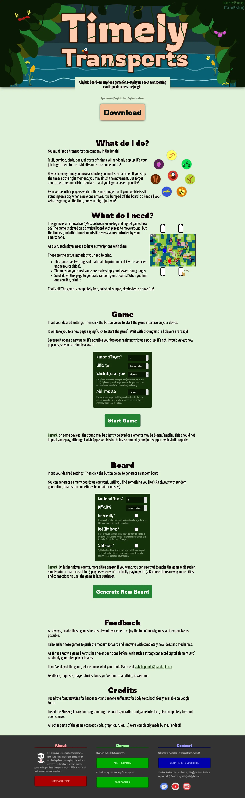
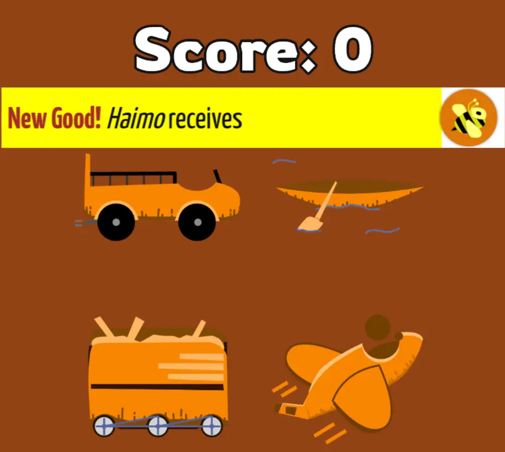

Welcome to the *technical devlog* for **[Timely Transports](https://pandaqi.com/timely-transports)**

Timely Transports is the first ever *hybrid* board + smartphone game.
(I, still, need to come up with a catchy short name for these types of
games. If you have any good ideas, let me know.)

Here I'll talk briefly about how I created the *game interface* (for on
your smartphone), but spent a lot of time explaining how I created a
tool that *randomly generates a game board* (to print and play on).

If you haven't played the game (or checked out the page), be sure to do
so! Not only is it a lot of fun, this article also won't make sense
otherwise.

The toolset
-----------

I just said this was the "first ever hybrid" game, and that might have
raised some question marks for some boardgame-savvy readers.

"Some boardgames already have a "companion app" you can download and
use! You are not the first, Pandaqi, stop telling lies!"

Perhaps surprisingly, I don't like those. Why not?

-   They create an extra setup step. Someone needs to *find, download
    and install* a whole app (which also works on their particular
    smartphone). Unless you always play with the exact same group, you
    might need to do this multiple times because nobody has the app yet.

-   App stores are annoying. They update all their terms of service all
    the time, and they only need to *think* that you're doing something
    wrong, and your app is immediately gone. Just gone. (I have too much personal experience with this.) And I'm not even
    mentioning actual updates to these stores/platforms, which could
    render apps unusable within a year or so.

-   They aren't easily updated. Again, you need to bundle the app, go
    through the update process at your store, and then force players to
    update the app.

No, instead of an app, I wanted it to be a *website*.

I tried to use only the most basic website code, to optimize support for
all sorts of browsers and old phones.

Whenever I need to fix a bug, or finetune some details in the algorithm,
or have an update to the game, I can just update the website. The next
time you play -- the next time you visit the website -- it's
automatically the latest version!

And people can just create a *backup* of these games. You can just
download the website (don't forget to download the external JS and CSS
files as well!). If my server ever goes down, or I somehow stop
supporting the games, you can still play them and even improve them
yourself.

So this was my toolset: **plain old HTML + CSS + JavaScript** using the
awesome **Phaser** library for the game interface and drawing the game
board.

The web page
------------

I struggled with the layout of the web page a lot. It needed to do all
these things:

-   Explain the game to new players/someone who just stumbled upon the
    website. (Also, make them enthusiastic about it. Just make
    everything look *nice and clear.*)

-   Give a short guide to using the *game interface*, plus settings, and
    a clear button to press.

-   Give a short guide to using the *board generator*, plus settings,
    and a clear button to press.

Below is an image of the current webpage (in case you can't visit it now, or it has changed in the meantime):

At first, I had *one* settings menu at the top, which influenced both
the game interface and the board generator. Why? Because they had many
overlapping settings (such as *number of players* and *difficulty*).

In the end, however, this just didn't work. The settings menu became way
too large, because at least 50% of the settings did *not* overlap. Also,
it's intimidating to load a page and immediately see a bunch of settings
you need to understand. And about 50% of the people will then just
*ignore* this and scroll straight down, never even seeing those
settings.

So, I decided to start with the marketing pitch (as you should always
do): a nice header image, clear tagline for the game, big old download
button, and a slightly longer explanation underneath.

Then I get the game interface, which has a short *explanation*, then its
specific *settings*, and then the button.

> Again, at first I tried to make the interface work *on the same page*,
> but that was just asking for trouble. Now the button leads you to a
> new page which *only* contains the game interface and nothing else.
> Way cleaner, way easier to get a full screen game interface.

Lastly, you get the board generation, with a short *explanation*,
*settings* and then the *button*.

> I considered automatically generating a board, to impress new visitors
> and immediately give them something to print. But that made the page
> laggy on old smartphones, as it took a few seconds to create a board.

This order is important! You only need to print a game board *once*, so
that part of the page will rarely be visited. Most players will need the
game interface, so that needed to be on top.

The Game Interface
------------------

We can be short about this one, as there's really nothing special going
on here.

When you press the button (on the main page), it saves all your settings
in **localStorage** (using JavaScript), then loads the game page.

Once loaded, it retrieves your settings from that same localStorage, and
starts the game using that configuration.

The game is just a bunch of vehicle icons which listen for
taps/presses/clicks. If you do so, it starts a timer. If you do so when
a timer is running, it stops it (but only if the timer is in "overtime",
not while you're still waiting for it to finish).

Similarly, you can tap the score text to get +1 point. (Players need to
keep track of their own score, which so far has been no problem at all.
Especially because everyone can see each other's phones all the time, so
cheating is not an option.)

And similarly (again), new messages and events pop up, which get a
click-event (to make it go away) and a timer (to make sure you click it
soon enough).

The reasons for these decisions are all explained in detail in my
regular devlog: [\[Devlog\] Timely Transports](https://pandaqi.com/blog/boardgames/timely-transports/devlog-timely-transports/). This is just
about the technical implementation!

Sure, there were some nasty issues to solve (such as different screen
sizes, where to place the upgrade button, how to make a dynamic timer
bar that responds to changes in length and color), but that's not so
interesting. It's what I call *stumbling through computer-ness*, as you
slowly realize some stupid decisions that your specific
framework/programming language/screen resolution takes.

If you want, you can check the code itself, it's quite short and simple
for a complete working game interface.

(I make no apologies for code messiness :p The code is quite clean, but
I'm still learning the best practices when making these types of games,
so I'm surely doing things in a way that is needlessly complicated.)

Instead, let's continue to the real beast!

Random Board Generation
-----------------------

When I got the idea of "randomly generating a game board you can print",
I was wildly enthusiastic ... and also too optimistic.

I thought: "well, I've done random generation before, surely I can just
randomly place stuff according to some rules, connect them, and voila --
we have a game board!"

No. No, you cannot.

Within one hour of building this project, I realized how wrong this
assumption was. I had a working generator that randomly placed cities
and connected them with a straight line ... and it looked *awful* and
was *too chaotic to play on*.

What are the issues here?

First of all, there's the issue of **clarity**. You can't "zoom in" or
"rotate the camera" on a printed game board, like you would in a
computer game. Everything needs to be clearly visible and legible,
separated by enough space, no matter the layout of the map.

Second of all, there's the issue of **completeness**. When you play this
game, everyone has *four vehicles* and there are *four goods* (in total)
to move around. With a completely random generation, it's quite possible
that some of those elements *don't even appear on the map!* Which is
terrible, because it makes the game unbalanced or straight-up
impossible. Instead, you need to ensure there is *always* at least one
route for each vehicle and one city that requires a certain good.

Lastly, there's the issue of **fairness**. Each player has a capital,
which is where they start and also the only place where new vehicles can
enter the board. If your capital is cut off from the rest of the world
... well, you're going to have a shitty game. Instead, you need to keep
some *score* that represents how "good" a capital is, and ensure that
capitals are roughly equal in score.

So, how did we solve these issues?

Let's find out in part 2 of this devlog! ;)
