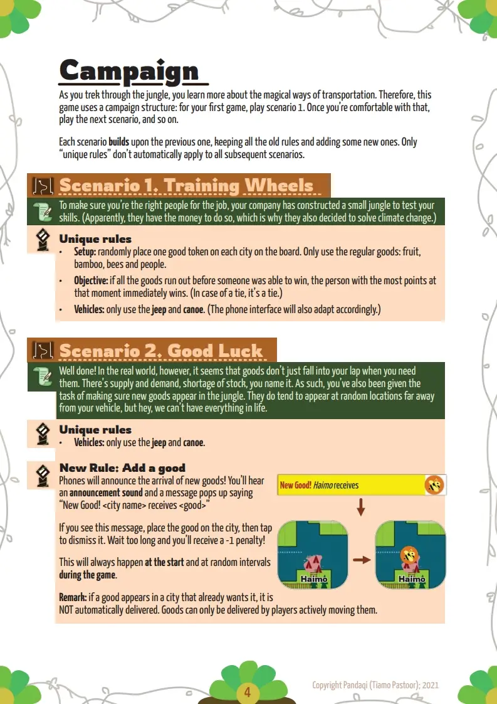
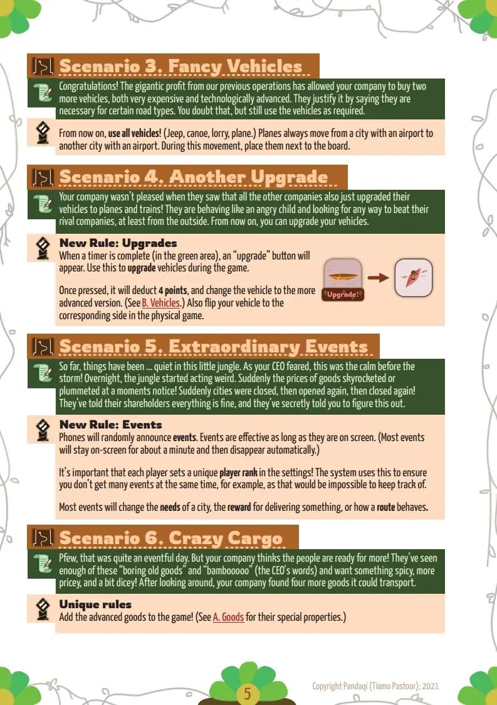
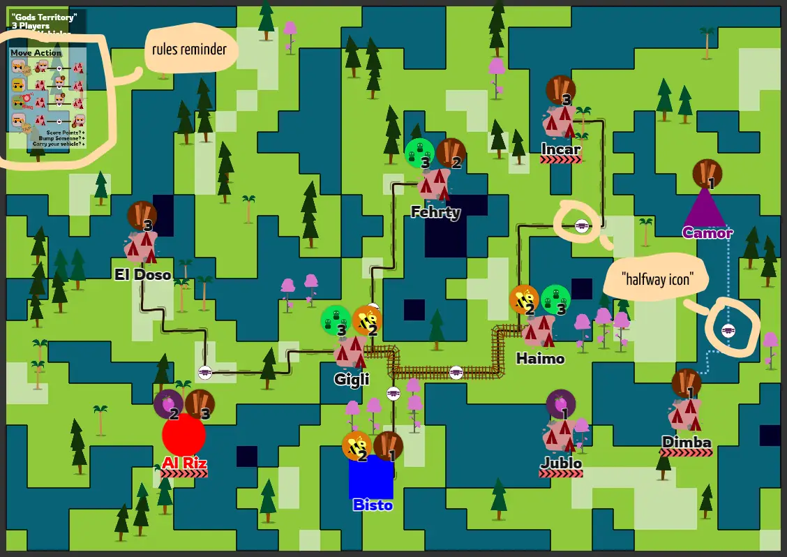
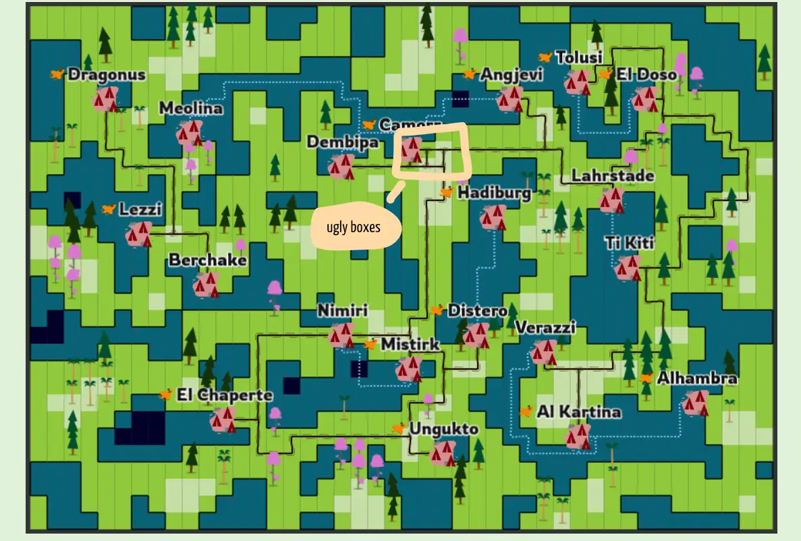
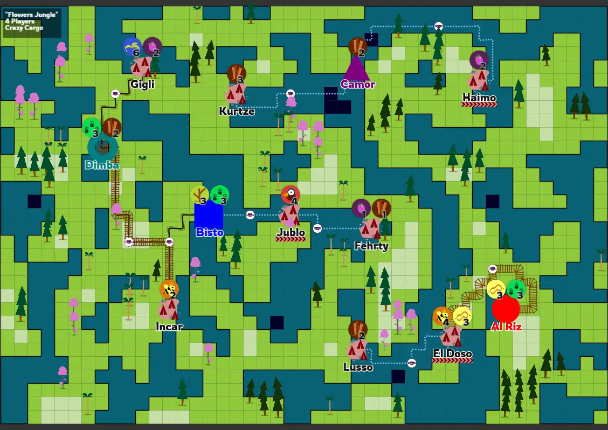
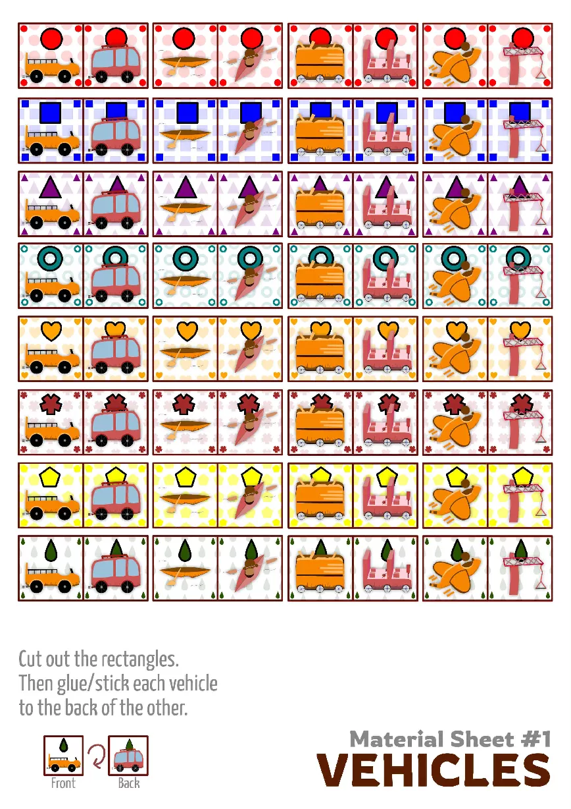

Alright, half a year ago I published my "hybrid" boardgame called
[**Timely Transports**](https://pandaqi.com/timely-transports)

The game was a huge hit during my playtests, and I can say that this was
one of the first projects were I really felt things were coming
together, and the result was a clean and fun game.

Over the past few months, however, I created even more games and learned
a lot of lessons. I was also able to playtest the game more, and in more
diverse settings.

After writing down my thoughts every once in a while, I had generated quite a
substantial list of improvements I'd like to make.

Therefore, I thought it was time to give this game a huge update!
Welcome to Timely Transports v2!

The last drop
-------------

I'd been pushing this update further and further down the to-do list,
because there were other things I thought were more "urgent".

However, one dreadful day ... my game just **stopped working
completely**. (As in, the *digital* component stopped working.) I had no
idea why, it would start, it would play sound effects, but *nothing*
showed on the screen.

After an hour of angry bug fixing, I found the mistake: the project had
*one dependency* on external code, and that code had changed (for the
worse).

I used the BBCode Text plugin for Phaser to give my text nice colors and
styles. If I turned that off, and replaced it with good old regular
text, everything worked fine again.

This was a good lesson. From now on, this project has *no external
dependencies whatsoever*. (I've cloned the versions of the frameworks
that *did* work together, and put them locally on my own server.)

I added some code to make the game even more robust, because if this
component stops working, the whole game stops working. And that's a
shame.

The rules
---------

Although this game isn't *hard to learn* by any means (just a few pages
of rules, most of them explaining how the digital component works), I
still found people struggling.

Why? How could such a simple game make people struggle?

Because it's a *real-time* game, where everyone acts *simultaneously* on
a chaotic board. You can't re-read or re-explain rules, or check if
people are even following the rules, in such a game.

**Problem \#1:** people do things wrong, and they don't even know. For
example, two players thought that the number on the board indicated *how
many of this good you had to deliver*. It doesn't. It depicts *how many
points you get for delivering this good*. But because everyone was busy,
nobody caught this mistake until about 2/3 into the game.

**Problem \#2:** All rules must be explained upfront. That's a lot to
take in, a lot to remember, and people are already (naturally) afraid of
doing something wrong or "stupid".

How do we solve that?

Well, by making the game **simpler,** by adding **reminders** to the
game board, and using a **campaign** to gradually introduce concepts.

### A tiny rule change

The old rules were as follows:

-   *If you enter a city that already has one (or more) vehicles, you
    bump them off the board!*

-   *Exception: if the other vehicle is yours, you may instead use it as
    a good. Place one vehicle on top of the other. (For example, you
    could place your jeep on top of your canoe, to move it over water to
    some other place where you needed it.)*

This was the right idea, but had some holes in it. It was possible,
this way, that a city had more than 2 vehicles. (Because all those
vehicles were yours and you chose not to use them as goods.) Players
felt very comfortable just letting their vehicles idle on their capital,
or any other city that wasn't really visited by anyone else.

It was also easy to forget, because it was phrased as an "optional
exception".

Now it's changed to the following:

-   *Exception: if the other vehicle is yours, you **must** use it as a
    good. Place one vehicle on top of the other and **immediately**
    start moving again.*

This way, no city will ever have more than one vehicle. It also forces
you to be more strategical with the placement of your own vehicles. (You
can't, for example, just stack them on your capital for a moment,
because the rule requires you to immediately move away!)

It's simpler, it forces players to learn this rule and use it properly
in a tactical way.

The campaign
------------

Currently, you start the game with *all four of your vehicles*.
Additionally, people must be taught the *add good* mechanic, using which
they add new goods during the game.

And lastly, the game has 3 "expansions":

-   One that adds *upgrades* to the 4 base vehicles.

-   One that adds random events.

-   One that adds more types of cargo.

When I first made the game, I was sure that it couldn't be simpler. I
was sure you *needed* all the vehicles for a fun, working base game.

I was also stupid and naïve :p

Now I can see that this game could've been much simpler from the start.
Only *two* types of vehicles are necessary for the game to function.
Goods don't need to be added if you simply *start* the game with goods
already on the board.

So, I wrote a campaign with six "scenarios":

1.  Training Wheels: only two vehicles, goods are already on the board.
    This means the rules literally only explain one thing: **how to move
    a vehicle** and **how to win.**

2.  Good Luck: now the "add good" event is explained, and you start the
    game with an empty board.

3.  Fancy Vehicles: now you get the other two vehicles.

4.  Another Upgrade: now vehicles can be upgraded.

5.  Extraordinary Events: now you get random events, which is completely
    controlled by the digital component ( = no extra rules to learn for
    the players.)

6.  Crazy Cargo: now you get 4 more types of cargo.

It was very easy to write these and it feels like a natural progression.
More playtests are needed to see if these are actually balanced, fun,
and a better introduction. But I'm already happy.

Below are some images from the rulebook of these scenarios. (These might still be updated, because I will be playtesting them more in the future, and I'm still putting the finishing touches on the rulebook.)

Random Boards
-------------

Of course, the board generation needed to be changed with the campaign.

**First change:** If you only have *two vehicles* (the jeep for land
roads, and the canoe for water roads), all other roads cannot be on the
map.

That's actually quite tricky, because *airports* are often necessary to
connect everything around the map.

Eventually, I settled on several tactics:

-   The first two scenarios, the board is more *zoomed in*. This means
    larger chunks of land, and larger chunks of water. This increases
    the chance that everything is connected nicely, *without* the need
    for an airport.

-   If this still doesn't work, *fail the whole simulation and try
    again*. It's fast enough to find a board in \<1 second in all cases.

**Second change:** playtesting the game with *many people* (or with all
expansions enabled) showed the need for a larger board. I'd already
implemented this functionality ... but only half-baked. It would just
scale up the board (by x2.0) and slice it in 4 separate pages.

The result was *blurry* (because we literally scaled pixels), but still
a *huge file* because of the huge board.

Additionally, some of the simulation parameters didn't scale well,
because they were finetuned for the smaller boards.

This was solved by:

-   Creating a larger canvas to begin with. If the canvas is enlarged,
    some parameters are *also* changed to make everything fit well.

-   Adding compression to the PDF generation. It literally went from
    50MB -\> 2MB, just like that.

-   Enabling the "split board" option by default and providing a short
    explanation about its necessity.

Reminders
---------

It's always good to remind players of the rules (and exceptions)
*everywhere you can*. That's also something I've learned the past few
months.

These things were commonly forgotten:

-   During a movement, your vehicle is *halfway* the route. People
    forgot this and just let their vehicle sit on the city until their
    alarm rang. Then the vehicle just *teleported* to its destination :p

-   The road type corresponding with each vehicle. It's very simple and
    intuitive, but still, it can't hurt to give people some confidence
    with extra iconography.

-   The fact that a vehicle that's *off the board* will always appear in
    your *capital*. Similarly, the fact that a vehicle can be used as a
    *good* to get it somewhere else.

How do we solve this?

-   Place icons halfway routes which mark these "transit spaces" or
    "inbetween spaces". This gives players a reminder *and* a clear
    place to put their vehicles.

-   Place each vehicle's road type on its token. (There should be just
    enough room for that, without overcrowding it.) =\> Alternatively,
    place it in the game interface, as that has more space. (Yes, that is what I eventually did, much cleaner!)

-   Place a short summary of the possible actions and rules on each
    generated board. I already place other data (number of players,
    jungle name, scenario, etc.) and I see that there's often *lots of
    space left at some of the corners.*

### Ugly boxes

As I was implementing this, I was reminded of another issue that bugged
me all through the development of this game. Something I call "ugly
boxes". When two (or more) routes in the game run parallel for a few
squares, they create these weird boxes on the map, which would never
appear on a real map. (Because they are unnecessary and inefficient.)

Fortunately, I suddenly figured out what I had to do. I'd written an
algorithm to remove these, but it could only remove them *several at a
time*. (For reasons which are hard to explain. The summary: the computer
doesn't "know" beforehand which routes are needed, and which are
redundant. So every "pass" of the algorithm, it might discover *new*
ugly boxes it didn't see before.)

But what if I ... ran another pass of that algorithm, but *backwards*?
This actually removed 80% of these boxes right away.

To remove them all, I'd need to do 5-10 passes, but that's a *lot of
computing time* for something so minor. Boards already look very clean
now.

### Ugly boxes -- my nemesis

After sleeping on it, I decided it still wasn't enough. I wanted to get
rid of (almost) all those ugly boxes!

Then I realized *why* they were still being created so often: I only
"definitively" add each path once I've generated all *possible* paths
for some city. That's why these paths couldn't "snap" to each other,
because they didn't exist yet when the *pathfind* function was called.

So I changed that. When definitively adding the paths, I re-check the
shortest path, making sure the algorithm is rewarded for snapping to
existing routes. Quite some extra computational cost, but it removes
even more of these boxes!

And to top it off, I *also* added a clause in the pathfinding algorithm
that completely *disallows* a square if it would create an ugly box,
looking from the top-left corner.

This eliminates like 99% of these boxes. They still exist. Some maps
have a sequence of 3 or 4 of them. But that's *way better* than it used
to be, doesn't get in the way, and doesn't look ugly anymore.

### Placing transit spaces

Because many routes on the map "collide" for a moment, and then move
apart, I couldn't just place reminder icons halfway routes. That would
create *way too many icons*.

(Additionally, sometimes routes are removed or changed after generation,
which means I need to wait until the *very end* of generation before I
can place these icons.)

To solve this ... I basically did a rudimentary neighbor check. Is there
already an icon in one of our neighbour cells? Then don't place another
one!

Again, it doesn't catch *all cases*, but the boards look clean and
simple enough.

Visual Flair
------------

Usually, you focus on *gameplay* and *concept/rules* first, and then the
visuals. If the first part takes very long, I tend to lose motivation
for the second part :p

The game looks nice -- luckily, I *have* developed some baseline
standards -- but there is always *more you can do* to make it really
pop.

-   A background pattern for the rules and website. (And perhaps the
    game interface.)

-   More icons and more diversity in colors/blocking in the rules.

-   Better looking vehicle icons, which are also easier to pick out
    during a chaotic game.

-   Some more general "jungle" vibes throughout the whole project.

And those were exactly the parts I worked on during this update. 

For example, here's what the material sheet for the vehicle tokens (to print and cut out) looks like now:

Just a little more color, texture, a background pattern, drop shadow, higher resolution, and clear shapes on all corners to make it easy to recognize your own vehicles. (It's a bit harder to show all the other changes in an image. I suggest you simply look at the website and the rulebook.)

To be honest, I still think there's a *lot* to improve. But there are
two reasons I stop here:

-   The game is print & play. This means I try to keep the *number of
    pages/materials* and the *amount of ink used* to a minimum. And yes,
    that means many white pages and blank sections.

-   I already have four different projects going on right now. This game
    isn't giving me any income, and I need money to survive, so those
    other projects will now take over my time again!

Conclusion
----------

I'm trying to keep these devlogs shorter, that's why this might seem
like a *minor* upgrade, not worthy of a devlog.

But it's actually quite a huge deal. The game just instantly become more
accessible, better-looking, and more stable. It took me loads of
playtests, weeks of thinking and writing down ideas (and possible
solutions), to get the game to such a simple and clean state.

The campaign helps introduce the game *and* all expansions/extra
mechanics in a quick and painless way. The rule reminders make this even
better. The improved boards ensure that every board looks good and is as
fair as possible. And the new rules are cleaner, prettier, and explain
some edge cases which I saw people misunderstand during my playtesting.

All in all, it's the same game, just a lot more professional now :)

Until the next devlog,

Pandaqi

Update on the Update
----------
After some more playtests, printing some boards, trying many things ... I decided to tweak things just a little further.

First of all: the boards look at their best when zoomed in more. However, originially, this always meant there was _not enough space_ to place all cities and routes. Why? Because cities are placed at "docks": edges between water and land. This leads to nice maps with a water/road balance, but it's _not_ a strict requirement. So I changed it to place cities somewhere on _land_ with some probabililty (~33%).

This allows me to zoom in and creates nicer maps, with less empty space or "huge balls of connected cities across the ocean"

Secondly: cities were sometimes _behind_ the rules reminder or at otherwise undesirable locations. I wrote some specific checks to simply NOT allow cities behind anything else, or too much near the edge.

Thirdly: the rule "when you enter a city that already has a vehicle of yours, stack them and immediately move again" had one fatal flaw: it was (near) impossible to move your vehicles if your capital had only ONE type of connection, and you needed to go across several stations. It was just too hard, if it was even possible at all.

I changed it to: stack your vehicles ( = use one as a good, same as the old rule). You may stack as many as you want. (There's no need to immediately move anymore.) But of course, if someone bumps you off, that whole stack of vehicles is removed.

Why does this work? Firstly: it has no fatal flaw and allows much easier transportation of your vehicles across the map (especially if you don't have an ideal capital location). Secondly: this creates a nice risk/reward. You can stack all your vehicles to move them simultaneously ( = very efficient!), but if you run into someone with bad intent, you might lose all that work in an instant.

Anyway, small tweaks, great results, that's why I do these updates.