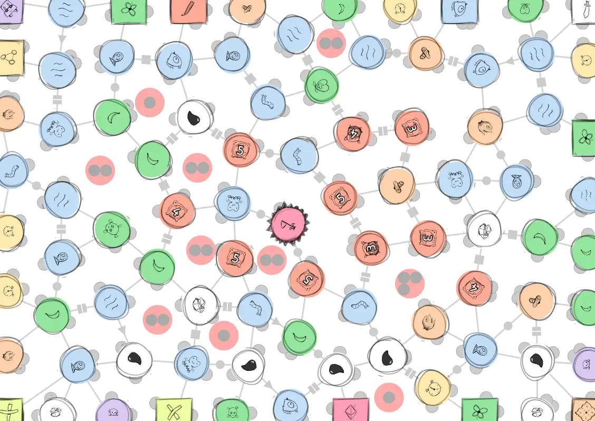
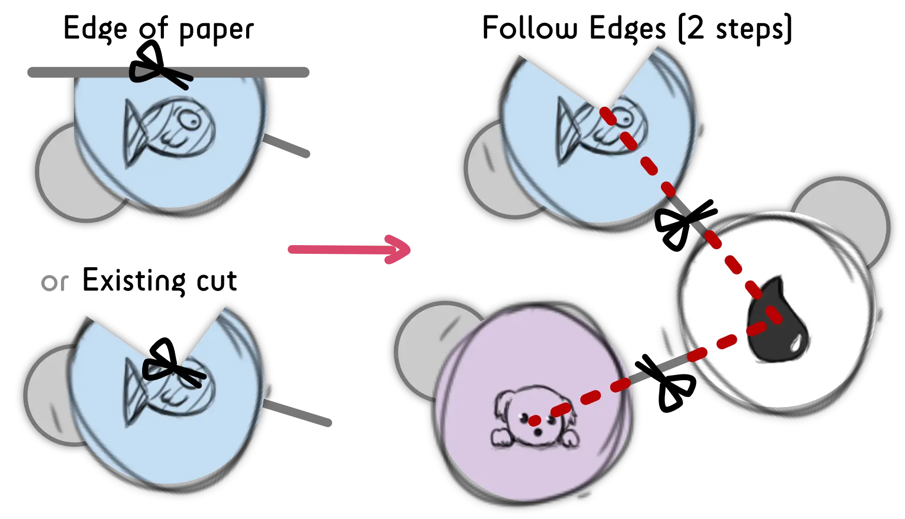
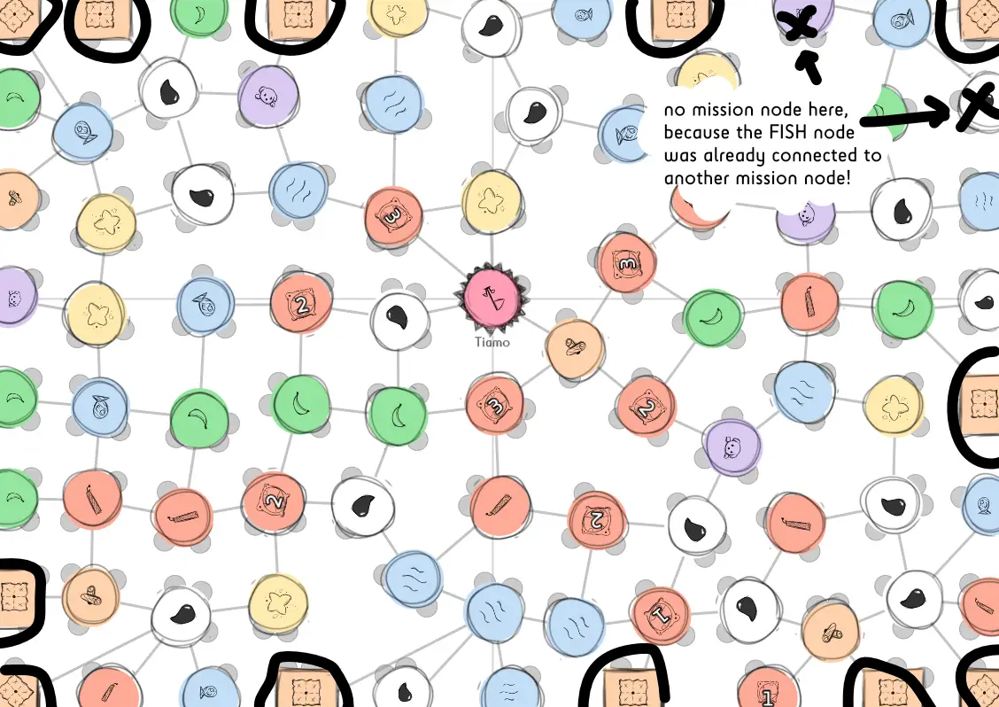
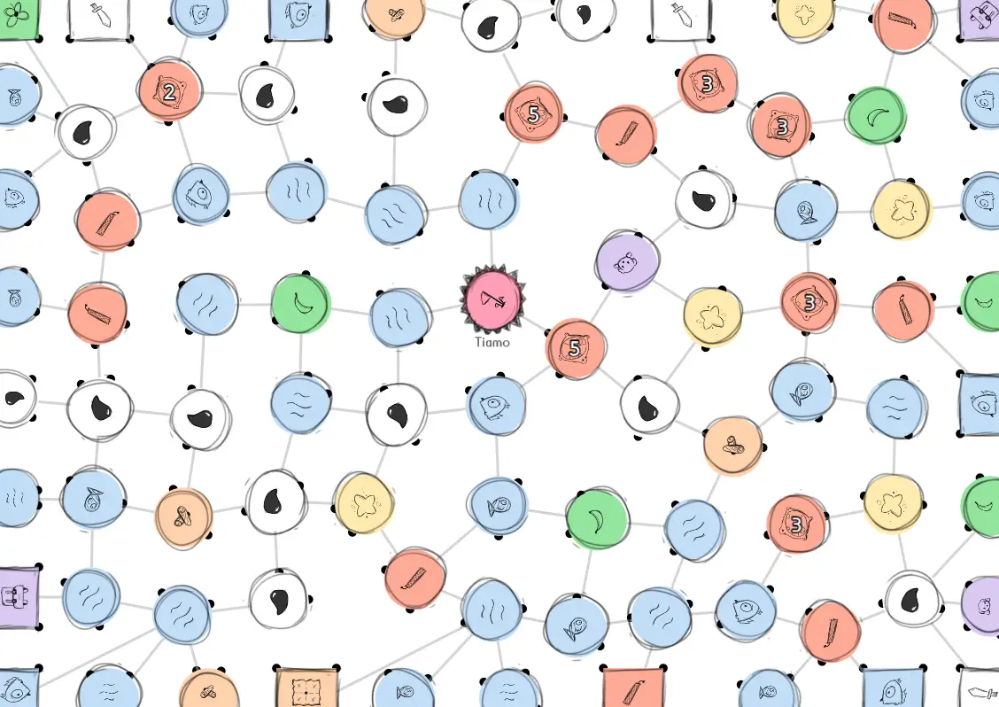

Welcome to another boardgame devlog!

This time, I will explain the process behind my thoroughly innovative
game [**Unstable Universe**](https://pandaqi.com/unstable-universe).

(I prefer the word "innovative" over "experimental and perhaps a bit
weird", as that doesn't leave a good first impression.)

As usual, I have written two devlogs:

-   The **regular devlog** (this one), which talks about the game design
    process, decisions being made, problems I faced, results from
    playtesting, etc.

-   The [**technical devlog**](/blog/boardgames/unstable-universe/technical-devlog-unstable-universe), which talks about
    how I programmed the website interface for the game. (For this game,
    the interface generates a random playing board AND a secret board,
    and is able to convert those to PDF format. Another step up from my
    last boardgame website!)

Hopefully you learn a thing or two about boardgame development and you
find this devlog interesting! (This is certainly one of my most
interesting games to date.)

*Remark:* this first part of the devlog is (by far) the longest, because
I wanted to keep the whole process of designing the first version ( =
base game, first draft) in a single article. It helps with understanding
the whole thought process and everything involved. The ones after that
are broken up more frequently as I create expansions, fix issues and
work towards the final version.

What's the game all about?
--------------------------

Slightly less than a year ago, I came up with the concept of the *One
Paper Game*. I saw that the boardgame hobby was really expensive and had
a high barrier of entry, and I wanted to fix that. So, as the title
indicates, each OPG only requires you to have (or print) a single sheet
of paper.

It didn't take long for me to realize the full implications of this
concept.

> **If every game requires a new sheet of paper ... there's no reason to
> leave the old sheet intact!**

Why don't we allow players to *cut* into the paper? Or fold it? Or
change parts of it in some way or another? This gives limitless extra
possibilities for gameplay. Possibilities that regular boardgames can't
have, as you're not supposed to destroy the game board.

And thus, the idea for a *cutting-edge game* was born! (Yes, that is my
best pun in the whole devlog.)

I envisioned a game where the most important action was **cutting into
the paper.** I didn't know how exactly, I just knew that you could put
scissors to papyrus as a valid (and essential) move. And if that caused
a piece of paper to *come loose* (it wasn't attached to the main board
anymore), it would "drift away" and be lost.

[plugin:youtube](https://youtu.be/eIcXJeHrPOA)

The Original Idea
-----------------

And so, the title **Unstable Universe** was born and I set out to create
the first cutting boardgame. This was my rough outline of an idea at the
start:

> The game board is a bunch of nodes ("locations") connected by edges
> ("routes")
>
> All players must start somewhere at a corner of the paper.
>
> Each turn, you can only *move*: find a node you are currently on, and
> go to another node that's connected with it.
>
> The first player to have 5 unique resources and enter the middle node
> of the board, wins the game! (Where "having a resource" means you have
> a dude standing on a node of that type.)
>
> **The plot twist**: players can cut into the paper, and if a piece
> comes loose, you lose all your dudes (and resources) on it!

The obvious **story element** that followed was:

> Our home planet is doomed. All living humans have set out to find a
> new home for us, and somehow arrived on the same *ice planet* at the
> same time.
>
> As you explore and conquer this planet, it will slowly break apart
> around you!
>
> The only way to win, is by striking a balance: use the resources, but
> not so aggressively that the planet is destroyed in the process!

**Remark:** Yeah, there are some subtle messages about climate change
and "taking care of nature" in there as well. I've always grabbed every
opportunity to remind people to be kind to nature, even before I learned
about climate change, but I will try to not let myself get carried away
with the theme.

I wanted nodes and edges, instead of a fixed grid, because it fit the
"unstable" theme and allowed way more variation in movement and cutting.

I wanted people to reach the center node, as stuff is generally most
stable at the *center*, but also because it gave all players an equal
but simple goal.

The reason you need 5 unique resources, is because that inspires the
actual gameplay. You can't just race to the center, you need to plan a
strategic route, *and* take into account that you might lose people due
to the cutting mechanic.

The game itself is extremely simple: you can only do one action
(*move*), there is only one node type, and only one simple goal.

I did this on purpose.

If I'm going to create a game with such a wild mechanic as *cutting into
the paper*, it's not so useful to bury that mechanic underneath a bunch
of other rules and intricate game systems. It needs to be front and
center. People need to actually consider playing this game. And for
that, the rules need to be dead simple.

How to Cut?
-----------

This was the big question: **how do you allow people freedom when
cutting into the paper, without making it easy to destroy the whole
board?**

I actually invented the idea for this game months ago, but I got stuck
on this question every time I tried to work on the game.

Of course, I finally managed to find a solution, which is why you're
reading this devlog and the game is finished.

But there were some other interesting options, so let's look at those

1.  The game board has "fault lines" on it, that divide the board into
    rectangular sections. When you *cut*, you must stop whenever you
    encounter a **fault line**!

2.  The game board is divided into sections of *any shape and size*.
    These are ordered. When cutting, you may first only cut in
    section 1. Once the planet becomes more unstable, section 2 crumbles
    as well. This continues until the planet is falling apart and you
    are finally able to cut anywhere.

3.  You may cut any way you want, but as soon as you've cut **two
    things** (either nodes or edges), you must stop.

4.  When cutting, you must follow the edges. The nodes you encounter
    along the way, determine *how many edges* you may cut.

In all the solutions, you could only start a cut from the edge of the
paper, but that seemed obvious. If I allow players to start cutting from
the center, they first need to punch a hole in the paper, and that
quickly becomes a giant mess :p

Also, in all solutions you had to stop when encountering another cut
that was already made.

**Solution 1** was great for theme and simplicity, but didn't really
solve anything. If you may only cut within a predefined rectangle, that
limits players to the point that the cutting mechanic is quite useless.
You can solve this by making the rectangles bigger, but in that case,
people can still slice the whole board within a few turns!

**Solution 2** had this idea of "escalating problems". At first, cutting
is slow and confined, but as the game progresses, you can cut more and
more regions.

I really liked this. However, it makes the game unfair: if you happen to
start close to the first section, people can just remove you from the
board immediately. Additionally, it makes the game a bit too predictable
for my tastes: you know exactly in which order sections are going to
fall.

So this concept might return at a later stadium, but not for cutting.

**Solution 3** seemed like the winner for some time, until I actually
got to try it out in full. It is *too easy* to make annoying or
"game-breaking" cuts with this system. You can always find a spot where,
if you cut at just the right angle or place, you can avoid hitting
things for a long time.

Additionally, if you don't have the best cutting skills, you might miss
your mark and accidentally cut more (or the wrong thing).

Unfortunately, all those solutions just didn't cut it. (Ha!)

The Winning Idea
----------------

**Solution 4** eventually became the winner. Why?

First reason: it was the clearest and simplest. Now the rule was simply:
"*follow the lines on the board!"*

(This is some general wisdom I've learned when making all the previous
games. If you can let the *game* or *computer* take care of something,
DO IT. It means players need to learn way fewer rules and can just focus
on the fun of the game.)

I had already worked on generating random boards, and saw that they
created varied patterns and shapes. Because you can *start* cutting
anywhere from the edge, and the board is so varied, I thought the
players would have enough freedom.

Second reason: when I used this mechanic, I actually achieved my main
goal: **put the cutting mechanic front and center**.

Why? Until now, I saw cutting as a single *action*. Some nodes on the
board would show a scissors icon, and if you landed on it, you could
perform a cut!

But that meant ... you were only cutting like 5% of the time. And it
usually didn't even make a difference, due to all the restrictions!

With my actual solution, I can do the following:

> **Each node is both a *resource and an action.***

The **resource** is simply needed to achieve the main goal (and send
players all over the board, instead of in a straight line to the
finish).

But the **action** can be a specific way of cutting. For example:

-   **Wood:** you may cut three steps ( = 3 nodes), but must take the
    first connection to the left each time*

-   **Stone:** if you encounter this node, you must stop immediately
    after cutting it!*

-   **Food:** if you encounter this node, you may cut one step
    further!*

This way, everything becomes about cutting parts off the paper, but it
also adds strategy to that: What is the best route? Where should I cut
to get the most benefit? Should I move there, or is it too risky given
that there's a lot of Food resources lying around?

Discoveries!
------------

I was happy with this solution, but one problem still wasn't solved.

Currently, there is absolutely *no reason* to cut close to yourself.
Each player will just cut on the other side of the board to annoy other
players.

And the starting player will have the obvious advantage. Worst case
scenario, they are able to remove another player from the board
*completely* before they even make a move!

I needed to provide some *(potential) benefit* to being removed from the
board. When a piece comes loose, it shouldn't always be a bad or unlucky
thing.

That's when I remembered we were on an *ice planet* as *explorers*, we
can actually **explore and make discoveries!**

My randomly generated boards created these nice shapes between them. I
can write an algorithm to detect those shapes, find their center, and
place *something* there. (As long as the area is large enough to fit an
icon there.)

This was an early version of the idea - the red circles inside areas indicate where expeditions would take place:

When that piece comes loose, everyone who has a *researcher* on that
piece of paper becomes involved. For example:

-   **Research Race (positive):** the player with the most researchers
    may immediately take 3 turns.

-   **Trap (negative):** for each researcher lost to this trap, a player
    must destroy another node they own

There's one issue here: if you cut *on* the nodes (remember, solution
4), then it can be hard to see which players are part of the piece of
paper (that came loose).

Why? Because all the nodes at the edges will be cut! You can only see
part of it, and that part might not show if there was a player there.

Here's an image from the rulebook that shows a fish-node that is half-cut:

{.float-right}

I'm still not sure what to do about that. If I add an extra action --
you can move to the center of a shape -- this mechanic loses some value
and the game becomes more complicated. **So this is still an open
question/problem, for now.**

But here's the real cherry on top: I can make those discoveries
**secret**.

If you have a double-sided printer, the discoveries can be placed at the
*backside*. You don't know what's there, until the piece actually comes
loose and you flip it over!

I'm super excited to try this out, but I realize not many people can
actually do this, so it won't be an important feature until the end of
development.

(Many people don't have a double-sided printer *or* aren't willing to
spend the ink on something like that. So, it will probably end up as an
*option* on the website.)

Personal Missions
-----------------

As I was writing the rules and generating random boards, I realized
something.

If you start in the corner of the map, you have a longer route towards
the center, than people starting halfway an edge of the paper. (Usually
like 4 or 5 more nodes.)

How do I solve this? I cannot change the shape of paper to be round! Or
diamond-shaped!

I realized that the starting node was *very important*. How do we make
the most of them?

-   I couldn't make them actionless. That would break the general rule
    (nodes are always a resource and an action) and it would suddenly
    make 20 nodes do *nothing*, which is boring.

-   I couldn't give them regular cutting actions, as that gives the
    first players a great advantage.

After some thinking, I came up with the idea of **personal missions**.

Don't worry, this is a *One Paper Game*, so there is no huge deck of
cards with missions going to be included. This game is also completely
analog, without a digital component, so no list of missions from the
website!

Instead, I devised a rule that I thought was quite clever. (It remains
to be seen whether that's true.)

> **All nodes at the *edge of the paper* only have so-called "mission
> actions"**
>
> **The node that you decide to *start* the game on, decides your
> mission.**

What are those "mission actions"?

-   The node shows a **special resource.** Only one or two exist on the
    board, all the way on the other side. You can only win if you grab
    another of that special resource.

-   The node shows a **bomb**. You can only win if all other bomb nodes
    have been removed from the board.

-   The node shows a **number**. You can only win if you control (at
    least) that number of nodes.

-   (I'll hopefully come up with some more before the game is done.)

In this image the starting nodes and their placement are shown. (Spoiler alert: later on I decided to give all players the _same_ mission on their First Game - another option you can enable or disable on the website. That's what this image shows as well.)

This means that any starting node will usually have both good and bad
attributes. Deciding where to start is a big deal and can completely
change your strategy the rest of the game.

Lack of Precision
-----------------

I've talked about the *lack of precision* in games before. For example,
in real-time games, people might do something *almost at the exact same
time*, and it can be hard to decide who was actually first and how to
continue.

Unsurprisingly, a game about cutting and drawing has some similar
issues.

**Question 1:** is a connection still active when someone has cut
through it? Yes, connections always stay active. (The only exception? If
a special action allows you to cut some other way or permanently disable
connections.)

**Question 2:** is a node still active when someone has cut through it?
Nodes have two "visibility points" on them. If all points are still
visible, the node is active. Otherwise, it's disabled and cannot be used
anymore.

What's the idea behind this? Well, if both points are still on the
paper, then the node should be mostly intact. If not, it's highly likely
the node has been destroyed and shouldn't be part of gameplay anymore.

Check the tiny black dots around each node in the image below:

**Question 3:** what if a node is destroyed or a person removed? Do we
need to draw with pencil and use an eraser?

No, from previous One Paper Games, I've learned the only possible course
of action here: just cross them out and make that permanent.

-   Crossing out a whole *node*, means the node is effectively removed
    from the board. Nobody can enter it, or use it. It's not connected
    with anything.

-   Crossing out your *researcher on a node, means nobody can enter the
    node. If someone moves to that node, they just skip it and
    immediately continue onward.*

One plus one means a game!
--------------------------

That was the whole process behind creating the first version of the
game. To recap, here's the idea:

-   All starting nodes (at the edge of the paper) give you an extra
    mission.

-   All other nodes have a *resource* and an *action.* The action is
    usually a specific way of cutting, but can be anything.

-   On your turn, you can only *move* to a connected node.

-   If you have 5 unique resources (and accomplished your personal
    mission), you may enter the center node and win!

-   If cutting causes a piece to come loose, the action(s) within that
    piece are executed on all researchers standing there.

That's basically the whole game. Simple, but innovative, and I think it
will work.

Of course, the real complexity and content is hidden within that list of
possible *resource/action combinations (which will probably end up quite
large)*. But you don't really need to learn those before you start the
game; you can just peek at that page in the rulebook whenever necessary.