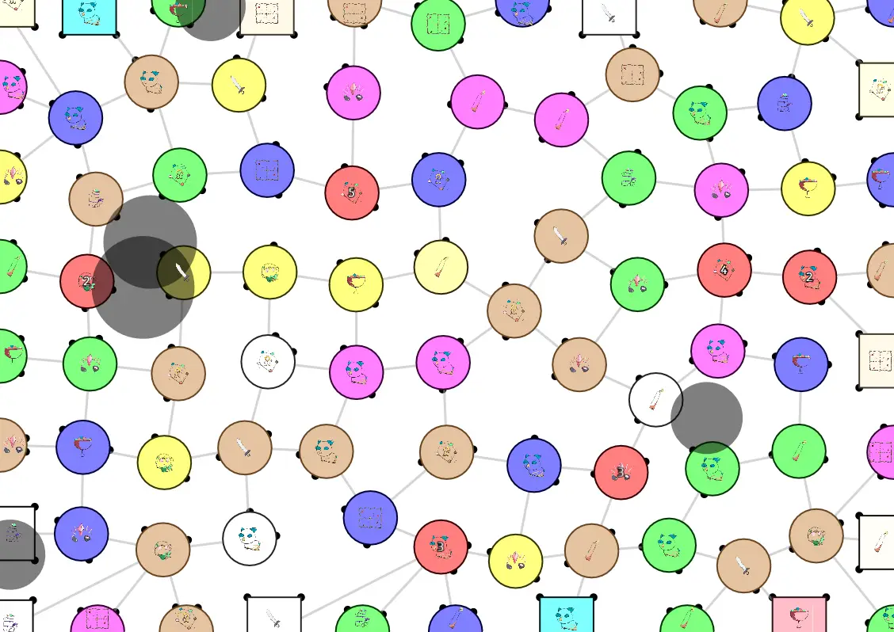
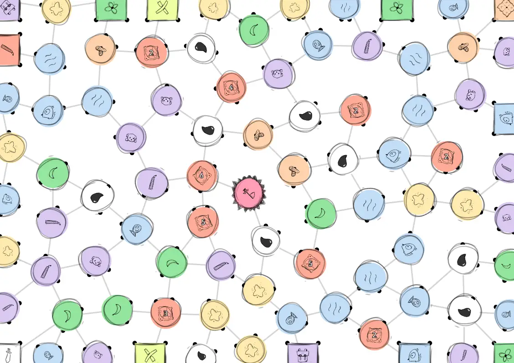
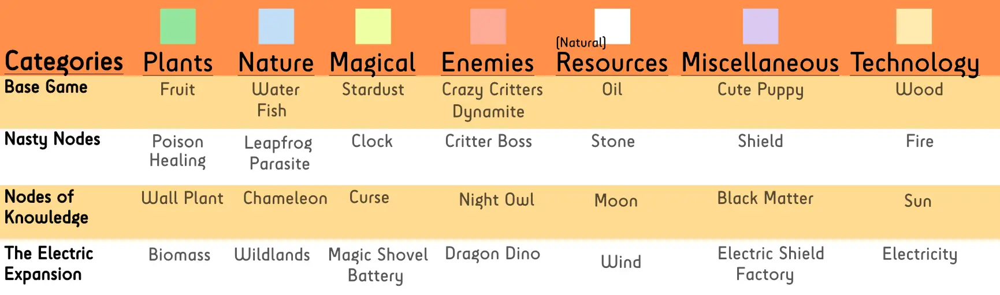
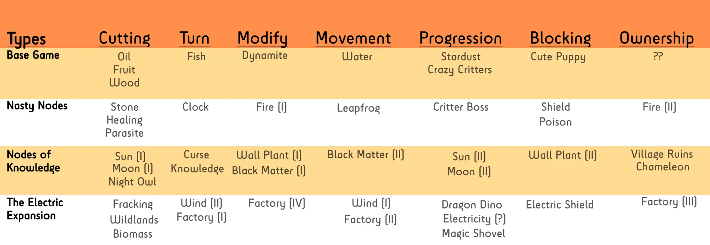

This devlog is part 2 in a series of articles about the development of Unstable Universe. 

Haven't read the other entries? Go to the [devlog overview](../).

Writing the Rules
-----------------

Usually, you only encounter the biggest problems (but also find the most
creative solutions) once you actually start writing the rules and
determining the *specifics* of all the actions you can take in a game.

This game was no different.

**Realization \#1:** I soon realized that turning *all* nodes at the
edge into starting nodes was stupid. It was an overwhelming number of
options. And the ones nearest the center node were still always the
best.

Instead, I decided to do the following:

-   Each edge (top, right, bottom, left) gets exactly 3 starting nodes.

-   I only pick the ones *furthest away* from the center node.

-   I don't allow two starting nodes to be connected to a common node.
    (That would mean that the player who gets there first immediately
    cuts off the other player, giving them a huge disadvantage at the
    start of the game.)

**Realization \#2:** If I create *too few* mission nodes, they become
too hard to execute. (If all players are fighting for a specific set of
nodes, for example, the game becomes near impossible to win.)

If I create *too many* mission nodes, however, they become overwhelming.
(Again. Creating games always seems to be a battle against overwhelming
players.)

Instead, I decided on a total of 10 unique mission nodes, of which 4
only appear when certain expansions are enabled.

Additionally, at first I thought along the lines of "hmm, maybe I will
just scatter a handful of nodes around the map and ask you to pick them
all up" (like the Twinbird). But that quickly becomes stale and
repetitive.

Instead, I decided to view Mission Nodes as a sort of "player roles". I
wanted each mission to force players to *change* their play style and
look at the board a different way. I hope my final set of mission nodes
accomplishes this well.

**Realization \#3:** If I move the idea of *Expeditions* to an expansion
... I can fit **all the rules on a single page!** Amazing!

And so I did. "Extreme Expeditions" is, at the moment, one of three
expansions to the game.

I also decided to properly name all the node types, which makes the
rules (and gameplay) much simpler. We have:

-   Mission Nodes (you start on it, gives you a goal)

-   Regular Nodes (resource + action, all other nodes)

-   Expedition Nodes (in the center of an enclosed area, only triggers
    when it is cut loose)

Creating the Visuals
--------------------

I usually only talk about creating the *visuals* and generating the
*game board* in my Technical Devlog.

But I wanted to shortly touch upon those aspects here, as they turned
out to be harder than I thought, and impacted many rules decisions.

This game is called **Unstable Universe**. What is the most unstable
form of drawing/designing? *Sketching*. And so, all elements in the game
(the icons, the nodes, etc.) have a loose and sketchy look.

Take a look below for a comparison between a computer-drawn ("perfect")
game board and one that uses the sketchy art:

This looks really cute and fitting! But when I add too many elements on
the page, this quickly becomes a mess (because of the funky art style).

By far the best solution was adding *color* to the game following a
certain logic. I invented several categories (such as Nature, Natural
Resources, Magic, ...) and tried to give each expansion 1-2 nodes per
category. By adding color, the board looks better and neater, but it
also helps to quickly identify what you're looking at.

Secondly, this influenced my decision to keep the base game really
simple. I wanted to do crazy stuff, like add "secret gold/treasures"
between nodes and allow players to retrieve them with some weird cutting
maneuvers -- but all of that just felt way too complicated.

In the end, there was only *one crazy idea* I had that passed the test:
a node that allows you to draw **new edges**. (Yes, I only got this idea
by staring at game boards and thinking "surely, I should be able to do
something nice with all that white space")

When you enter the *dynamite* node, you are allowed to draw a new edge
from that node to any other, as long as you don't cross anything on your
way and it's a straight line. This edge then simply becomes part of the
game: you can use it for travel, you can use it when cutting.

*This is the real power of One Paper Games*. I constantly need to remind
myself of this fact. Because we have a paper, because we can draw on it,
we can do *much more creative things* than move people around. We can
draw on the paper, invent our own icons, give stuff names, whatever!

Anyway, we're finally ready to playtest the game ... I just need to
invent 9 other nodes (besides the dynamite).

*Remark:* yes, I decided to do 10 mission nodes in total, and 10 regular
nodes for the base game, because that felt ... consistent. It also meant
I could fit everything on a *single page* in the rules, which is always
nice. It saves space *and* makes it easier to look up the meaning if
players forget it, because you know it will always be on the same page.

Don't forget the Theme!
-----------------------

There's one thing we haven't really discussed yet, and that is
**theme**. For some reason, it took me way too long to figure this one
out. In hindsight, it is obvious:

**It is a metaphor for climate change (or destroying the environment
because of commercialism).**

You want to win the game by grabbing resources ... but to get a
resource, you usually need to *cut into the paper* (aka "destroy the
environment").

What's the most obvious resource to use for such a system? Yes, it is
**oil**. (Another advantage: an oil drop makes a recognizable icon on
the board, even more so as a sketch.)

The most **prominent** node in the game is now oil. And it does exactly
what you expect: when you enter it, you must perform a basic cutting
action ( = "drill into the earth to get your oil")

I'm sure this whole concept will be lost on most of the players, but
hey, if at least some people realize what it's about, that's a win!

Which actions are fun?
----------------------

Because I invented the Mission Nodes first, I knew *what kind of* nodes
I needed to make those missions viable. For example, one mission asks
you to possess *more* nodes than any other player. That is only possible
if there is a way to *skip your turn* or *take two turns after each
other*, or things like that.

These "action types" seemed most fun and essential:

-   **Cutting** (with or without some restrictions, like disallowing
    certain combinations or stopping immediately after hitting a certain
    node)

-   **Turn** (skip a turn, do another turn for free, block someone
    else's turn, ...)

-   **Modify** (draw a new edge with the *dynamite*, destroy a node,
    ...)

-   **Movement** (teleport across the map, leapfrog over someone, ...)

-   **Progression** (you need to collect X nodes of a certain type
    before you can *pass* a certain monster or gate or challenge)

-   **Blocking** (forbid, barricade, destroy a certain action for
    another player)

-   **Ownership** (share a node with someone else, get back a node
    you've lost, ...)
 
Here's two diagrams I made for myself that show how all the nodes are distributed across the categories and action types. (I almost always do this for games, to get a nice overview and to automatically balance expansions and make them as varied as possible.) These are the (almost final) versions I made near the end, so they also include the other expansions, which we'll talk about soon!

Another interesting example if **blocking** is something like the "Cute
Puppy". If you are responsible for destroying this node (or cutting it
loose), you get a severe penalty. This acts as a sort of block: nobody
wants that penalty, so they will stay away from harming the puppy.
Perhaps they'll cut around it, or wait a few turns before moving in.

The **modify-type** nodes are most creative, but also most powerful, so
I only invented a few of them and spread those across the expansions.

(For example, there is one Expedition Node that allows you to *reattach*
the piece of paper that just came loose. This effectively allows you to
rearrange the board and move a whole group of nodes to somewhere else.
Very cool, never saw that before in a game, but also perhaps too
powerful.)

There's one specific **turn-type** node that I found so interesting,
that it basically shaped the whole first expansion to the game. It's the
**Time Trick** node. It allows you to "save" a turn for later. Why do I
think it's so special? Because this is the only thing that would allow
you to *plan far ahead* and use a *long-term strategy* in such a simple
game.