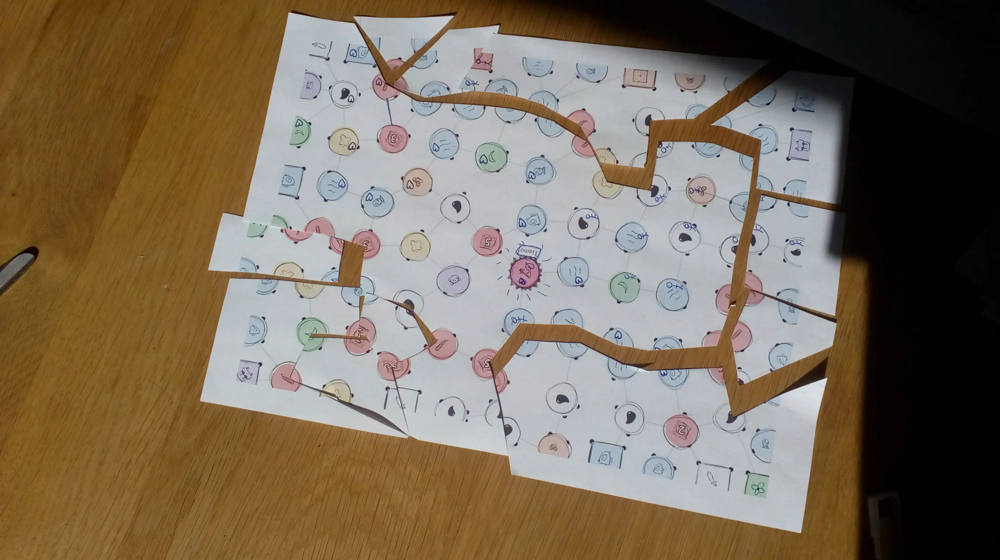

This devlog is part 3 in a series of articles about the development of Unstable Universe.

Haven't read the other entries? Go to the [devlog overview](../).

First Playtest Session
----------------------

Finally, FINALLY, this idea seems to be working and I have game boards
(that are good-looking enough) to play it with.

So, I printed a few of these, and played it.

(I also printed the rulebook, which is still ONE page for the whole
game, ONE page for Mission Nodes, and ONE page for Regular Nodes. Why do
I keep mentioning this? Because it's the shortest and simplest I've ever
created, and I'm really proud of that, as ~~sorry~~ simplicity seems to
be the hardest word.)

What's the result?

**It works great!**

I was really surprised by this, in a good way! It usually takes a few
versions to get something working well, especially if it has such a
weird main mechanic. But this just ... worked.

The missions we played seemed well-balanced, even the harder ones (which
receive special powers to compensate). Although I must note these
things:

-   There need to be more PLANT nodes on the board (for the Biologist),
    which are also distributed more fairly. (In this game, the biologist
    and almost all plant nodes were literally on opposite sides of the
    board.)

-   There needs to be more STARDUST, and Critters need lower numbers.
    (Now players just go *around* them, because it's not worth
    fighting.)

-   Maybe I do need to *reduce* the different number of Mission Node for
    your first game.

    -   Because right now, when you learn the game for the first time,
        players are just staring at the board and reading all the
        descriptions for a few minutes. Even though I always recommend
        just doing *something random* on your first game, because it's a
        learning game anyway, it's hard to convince others to do the
        same.

The nodes itself were also simple to understand, yet really useful and
powerful in the right situations. People were immediately able to
strategize, think ahead, make some plans, understand the effect of a
certain action. Some remarks:

-   The WATER node might be too powerful. (It gives you teleportation
    AND an extra turn.)

-   Sometimes, your options are too limited. You literally only have ONE
    node you can go to. (Being completely boxed in by opponents is fine,
    as that is just your own mistake *and* it allows you to restart
    somewhere else.)

-   The first several turns, people forgot the "During a cut" action of
    nodes. But that's not a big issue, because they understood it
    afterwards and made no mistakes again, so that just seems part of
    the "learning curve".

-   It's a bit confusing that a basic cut allows you to cut *two nodes*,
    which *includes* the first one when you start from the edge, but
    *excludes* your starting node when you continue an existing cut.
    (It's quite intuitive when looking at the board and taking the
    action, yet it feels like something that should be streamlined and
    explained better.)

Lastly, the board is really clear and cute. Everyone immediately
understands what's going on, likes the art style, and tells me "this is
my favorite icon/node" :p

-   However, some nodes can be quite unclear once cut off. (Because most
    of the node icon *or* player icon is removed, but the node is still
    active, you're not sure what is happening.)

I managed to create a game that balances itself, which is always nice.
For example:

-   You can try to cut off your opponents, but this also gives them
    options to hurt you (as you create more gaps from which they can
    start a cut) *and* it takes many turns to cut off large chunks of
    the board.

-   You can try to focus solely on your personal mission, but that
    leaves the door open for other players to remove your resources *or*
    finish earlier than you.

-   The cutting action is pretty basic, but *so useful* that there's
    this constant dilemma of: "Do I want this node which can *cut*, or
    do I want this other node with a unique action?"

-   Because of the organic board (which creates irregular shapes) *and*
    the rule about the "power dots" (remove one and the node is
    destroyed), cutting actually becomes really strategical. Sometimes
    circumstances cause a node to be almost impossible to cut off --
    recognizing this *before anyone else* is key in winning.

The biggest thing for me, however, was that I **asked my fellow players
to read the rules (and learn the game) themselves**. I gave no hints, or
explanation, or whatever. I just gave them the rules and asked them to
explain the game to me, once done.

Apart from some minor confusions because I hadn't yet put *images* into
the rules (which always say a thousand words), they immediately understood
the game and had no issues with it.

Intermezzo
----------

I'll fix these issues I encountered. Mostly, I need to think about a way
to create a *roughly equal/fair distribution* of nodes.

I don't want, say, all the Oil nodes to be right next to each other. But
I also don't want them to *perfectly spaced apart*, as that is boring
and predictable. So I need to find a middle ground, something like "Oil
may not be connected to 2+ other Oil nodes"

> (I talk in the Technical Devlog about how I actually solved this, as
> it's too ... well, technical to explain here.)

The other issues are fixed by actually finishing the rules (and adding
images) and being careful with placement of nodes/power dots on the
board.

One very funny **side-effect** from this game ... is that you
automatically end up with a **puzzle**! Once the game is over, you have
somewhere between 5 and 20 irregularly-shaped pieces of paper. It's can
be quite challenging to put them back together into the original paper!

So I'll just add that as a fun suggestion. Because the people with whom
I tested the game seemed to find a lot of joy in cutting extra pieces
and then solving that puzzle :p (It's the simple things in life.)

Some thoughts about (printing) costs
------------------------------------

I've been thinking hard about *money*.

Because you can only play each paper *once*, you'll need to print a new
paper for each game. How expensive is that? How feasible is this for the
average boardgamer? Am I even making a difference here?

So I decided to calculate it. Printing a game board, should be somewhere
around 10-15 cents per paper (on average).

How did I get this number? Most of the board is black and white (and if
you want, you can make it completely black-and-white) and it's not
completely filled *at all*. A black and white page is 3-5 cents, a full
color page can be 20-50 cents -- I just took the average.

A regular game like this would probably cost 20+ euros. You need to play
this game **160 times** to spend the same amount of money. (That's over
80 hours of gameplay.)

Pfew, that's good to know. I don't think anyone will come close to that
amount of games. And if you do like the game *so much*, it's surely
worth the money.

So yes, I think my idea of *One Paper Games* (and the optimizations I've
been making) is actually a huge improvement and makes the boardgaming
hobby much cheaper and more accessible.