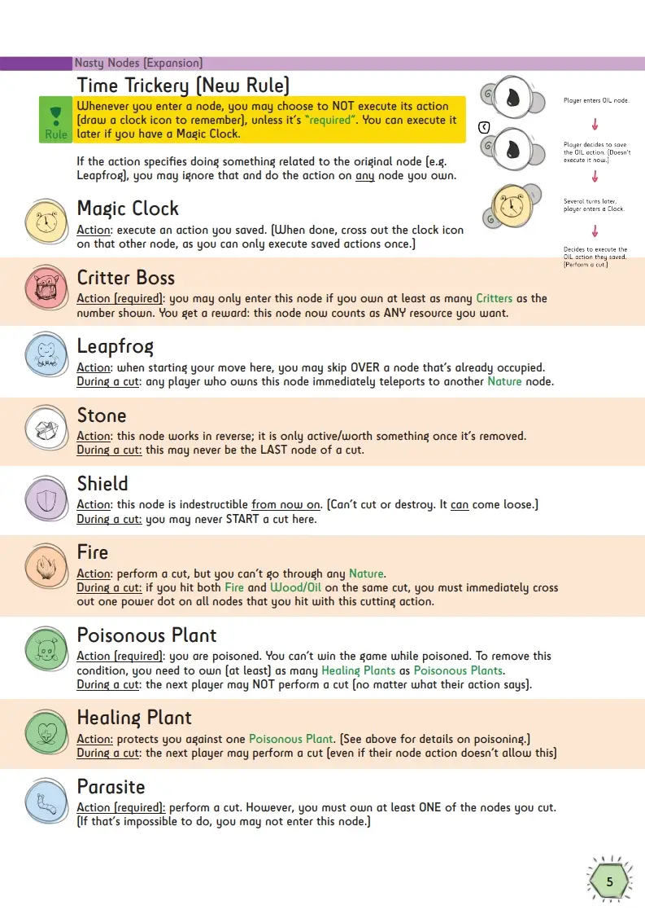

This devlog is part 4 in a series of articles about the development of Unstable Universe.

Haven't read the other entries? Go to the [devlog overview](../).

Welcome to Expansion Land
-------------------------

With the base game actually working really neatly, it's time to figure
out the expansions.

As said before, there are basically three things to do:

-   Add more nodes: I have about 10-20 more ideas that would fit well
    with this game and take it to the next level

-   Add expeditions into the game: all the proper nodes, the programming
    required to recognize shapes on the board, and the rules for
    joining/executing expeditions

-   Add extra cutting maneuvers to the game: at this moment, I'm not
    entirely sure how to do this. I just wanted to explore more cutting
    possibilities and some sort of "digging" or freeform "resource
    gathering" mechanic.

    -   I'm thinking about placing intermediate dots (halfway edges)
        that allow you to take a turn and cut through white space.

    -   Additionally, I'll place resources (gold, diamonds, whatever) in
        that white space.

    -   Whenever such an (intermediary) cut goes through a resource, you
        get it!

Those will be the three expansions to this game. There's no time to
waste, so let's get cracking!

Expansion 1: Nasty Nodes
------------------------

As mentioned above, I had a bunch of ideas for nodes that didn't fit
into the base game (they were too complex or too specific).

The first expansion, Nasty Nodes, was by far the easiest to make.

One disadvantage of these "One Paper Games" is the fact that you can't
really keep things secret from other players (because everyone is
writing stuff down on the same paper), so long-term strategy is hard.

In an attempt to fix that, I invented the "Clock" node. When you own a
clock node, you can use it to "save" a turn for later.

For example: you land on an Oil node. Instead of performing the action
immediately, you wait. A few turns later, you see a golden opportunity
for a cut, so you activate your clock and can immediately cut into the
paper!

Many of the other nodes in this expansion rely on this Clock node to
function, but of course this mechanic works with *all nodes*.

Secondly, I wanted to "fix" the fact that the base game has limited
options. Usually, there are only a few paths you can take, and you can't
often block someone else from taking a turn or cutting your nodes.

All other nodes, therefore, influence your cutting and movement options.
The *Stone* may never be the last node of a cut. The *Parasite* forces
you to cut (at least) one of your own nodes.

The *Poisonous Plant* prevents you from winning (by, well, poisoning
you), and can only be countered by entering a *Healing Plant*. This
means you can't take the straight route towards the center node, because
you might be poisoned along the way. Which adds even more strategy: are
you going to take the short route and hope you can heal yourself later,
or are you playing safe and going the long way around?

**Interesting remark:** many nodes in this expansion were more
complicated at first. However, when I realized I was making a second
expansion (as I'll discuss below), I moved many extra rules and
exceptions to this second expansion.

For example, the *Leapfrog* and *Black Matter* nodes were at first
combined! You could *choose* whether to cut across the paper or move
across it. But that was way too powerful and also took too many words to
explain, so it was split.

I wanted to remark this, because it's these kinds of (seemingly small)
decisions that really help the development of a game. Instead of one
overly complicated and powerful node, I now have two balanced and simple
nodes across two expansions. Win-win!

Here's the actual page from the rulebook, with extra images for clarification:

Expansion 2: The Electric Expansion!
------------------------------------

### First Try: Nodes of Knowledge

At first, I wanted to do only *one* expansion that added extra nodes.
But I had too many ideas!

So I started a second expansion, *Nodes of Knowledge*. Why? Because it
sounded nice, but also because some of my node ideas were based on a
sort of "ancient secrets" theme: as you explore the planet, you uncover
ruins, ancient history, curses, fossils, etcetera. In other words: you
gain knowledge about the history and inner workings of the planet.

That ... didn't work out, unfortunately, for these reasons:

-   I couldn't do enough interesting things with those nodes. (An
    expansion that adds 5 "meh"-nodes isn't ideal.)

-   It was very unbalanced. (The nodes from the base game and expansions
    were *way* stronger and more impactful.)

-   It didn't fit with the rest of the game. (The theme of this game is
    really about extracting resources from a planet, whilst also trying
    to keep it stable. Uncovering spells and ancient curses didn't feel
    like the same game.)

### Second Try: Electricity is the boss

What to do? Well, one of the nodes I wanted to add *somewhere* in the
game was the "Electricity" node. That's what I was building towards:
gather resources, gather oil, learn how to create fire, ... \<some steps
in between\> ..., electricity and advanced technology!

After some experimentation, I decided to make that the theme. Hence: The
Electric Expansion!

I wanted to use a mechanic that somewhat mirrors reality. Players could
mine for oil, gas, coal, and other natural resources. Then they'd need
to *use/burn/sacrifice* these to generate electricity.

After some thinking I had a few nice nodes that generated electricity
when you entered or used them.

But then I asked myself: why though? What makes electricity so
important?

I needed *something* that makes electricity a big deal in this game
(without contradicting the rules and objective of the base game).

These were my ideas:

-   Add a few nodes that you can only *enter* once you have enough
    electricity. (Similar to how you can only enter a *monster* node by
    defeating them.)

-   Only allow people to enter the *center node* if they have enough
    electricity. (In a way, this becomes an extra mission to fulfill.)

-   Allow players to use or "pay" electricity for awesome and useful
    powers in the game.

-   Literally build a fence or barrier around the center of the map,
    which can only be turned off or controlled with enough electricity.

-   Build an electricity network during the game. This network must
    reach the center node and supply it with electricity, otherwise
    *nobody* can win.

I felt that the first few ideas would work nicely, but wouldn't be
enough. Having a sort of *common goal* -- generate enough electricity to
power the planet -- would provide a more interesting and impactful
situation for the game.

Will you help yourself and hope that others provide the necessary
electricity? Or do you not trust the others with that power?

### Third Try: Electrifying the game

After (another) long thinking session, this is how I **electrified**
this expansion:

-   The center node gets a number. It needs (at least) that much
    electricity supplied to be reachable. (Sum the amount of electricity
    in each node connected to the center node via the power network.)

-   Electricity nodes can be used to "collect" and generate electricity.
    (In other words, electricity starts there.)

-   Whenever someone moves *from* an electricity node *or* a node
    connected to the network, they may *extend* the network by 2 nodes.
    (What does *extending* mean? Pick a node currently connected to the
    grid, follow one of its edges, draw a "ELECTRICITY/THUNDER" icon on
    the new node.)

I'm not sure how complicated this will be to explain in the rules (and
maintain during the game), but it seems like a good idea. It surely
needs some good images and iconography :p

The idea behind this mechanic is as follows:

-   You need to produce electricity, even if you don't want/need the
    special powers. To do so, you'll need to take a different route,
    pick up some nodes you otherwise wouldn't need, make more
    strategical choices.

-   In fact, all players combined need to produce enough electricity.
    Which means you might refrain from annoying another player and
    cutting them completely off the board ... because you *need* them.

-   On the other hand, you can fool your players into thinking you're
    going to help, then go solo at the last minute. Or let others do the
    work while you only try to help yourself. But if you go too far with
    that tactic, you won't be able to win the game at all!

This idea is a little prone to "assholery" (I don't see any better term
for it): someone can't win, or doesn't want to do their best, so they
just do a bunch of turns that are designed to make *everyone* lose. I
don't know how much of a problem this will be -- we'll have to see.

In a way, if the minority of players is doing this, they can most likely
be held back by the majority. (Many nodes allow you to block someone
else, make them skip a turn, prevent them from cutting somewhere, that
kind of thing. I hope it balances itself out. Those games are the best.)

### Almost forgot: the other nodes in this expansion

After all this talk about the electricity mechanic, it's easy to forget
that there are a bunch of other unrelated nodes in this expansion!

Let's talk about those.

I felt I needed some nodes that allow players to mess with ...

-   Turns (skip turn, repeat a turn, ...)

-   Movement options (place barriers, node that allows X players
    simultaneously, ...)

-   Cutting (pay something to shield one of your nodes against cutting,
    cut across gaps in the paper, ...)

And that's exactly how I filled up the rest of the expansion.

The core of this game remains the *cutting*, so you must be able to do
that quite often.

Besides that, the core of the game is *movement*, so being able to
add/remove move options strategically is very important.

It's never good for a game to forget your core mechanics and allow other
fancy mechanics to take over. (In the very first version of the
expansions, when I re-read all the actions, I realized that only about
10-20% of the nodes actually said "perform a cut". That's way too few
for a game that hinges on the special cutting mechanic.)

**Important remark (and spoiler alert)**: in the end, I completely re-did this expansion again and even split it into two. Perhaps you already thought this expansion was becoming a bit complex and messy when reading the part above, and if not, now is the time to challenge your creative self and find parts in this expansion that you'd want to change! (And _why_ they would be a bad idea, of course.)

The Problem with Many Nodes
---------------------------

By now, the game already has 30 nodes that can appear. Not only is that
a lot to remember, it also doesn't fit on the paper.

As such, I wrote a piece of code that selects a *subset* of the total
nodes list for each board.

It ensures that every category (Plants, Nature, Enemies, ...) is
represented at least once. Once that's done, it keeps adding random
nodes until we have enough to fill the board.

In practice, this usually means the list has 10-15 unique nodes. I think
that's the absolute *maximum* number of nodes I can ask players to keep
track of during a game -- it should not go higher than that.

There's a second problem, namely that the original objective of "own at
least 5 unique resources" is a bit ... boring.

With so many different resource types, it's quite easy to achieve. If
you don't achieve it, that's usually not your own fault (just bad luck
with the random board generation and starting position), which makes it
extra frustrating.

On the flipside, if I want this game to be playable on high player
counts (6+), this is actually really hard to achieve. There are roughly
75 playable nodes on the map. If each player needs to control 5 unique
resources, you can't lose many nodes due to cutting, or the game is
immediately lost.

(And no, I can't significantly increase the number of nodes. I know, I tried, but the
icons became too small and the board was a huge unreadable mess.)

I feel like this is a good opportunity to simplify the core of the game.
Maybe I can just *remove* that constraint? There's already a Mission
that does the same, but better. (You must *have owned* all unique
resource types on the board during the game. By the time you reach the center node, you may have already lost those resources.) It adds an extra layer of
explanation and "thinkiness", without adding very much to the game.