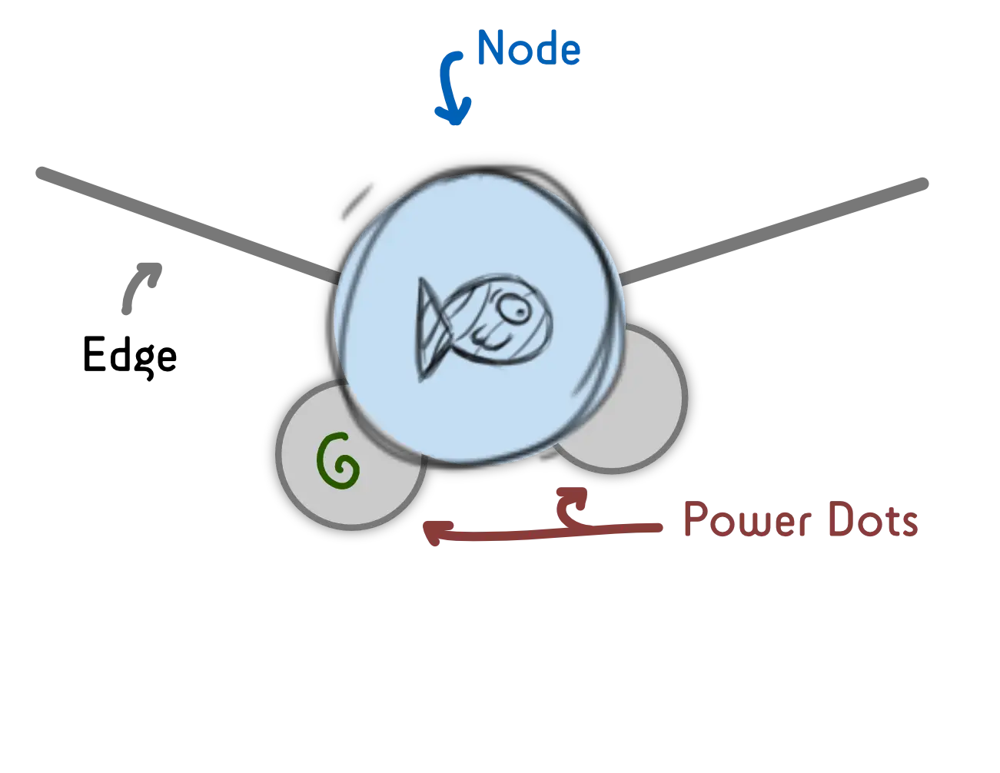
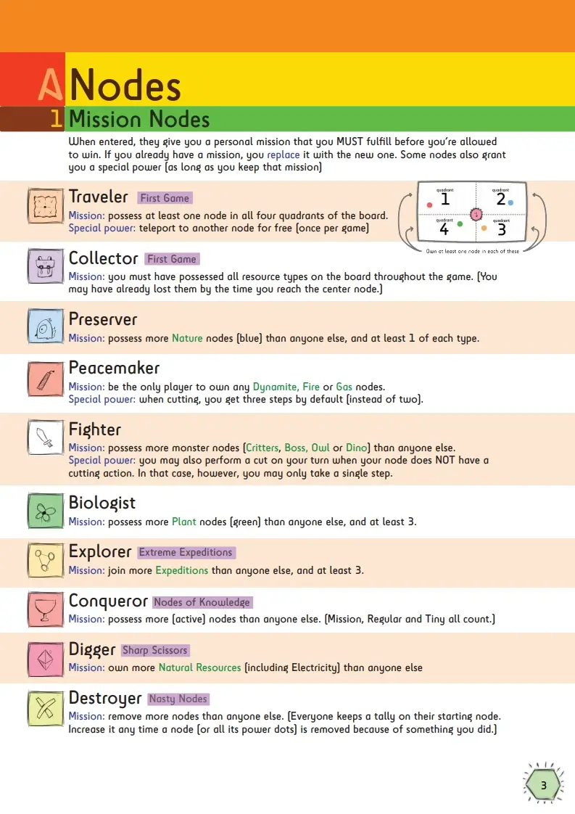
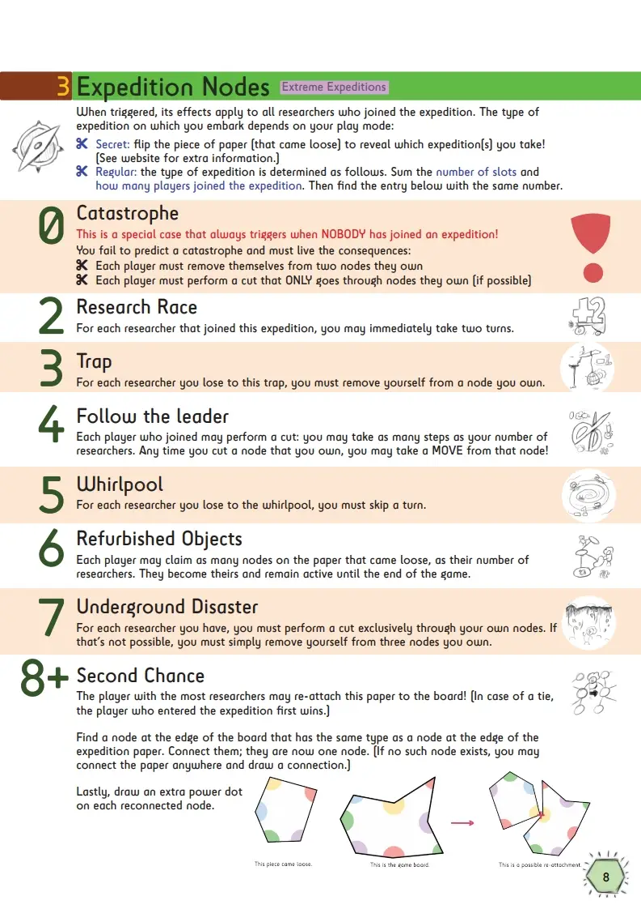

This devlog is part 5 in a series of articles about the development of Unstable Universe.

Haven't read the other entries? Go to the [devlog overview](../).

Intermezzo: a week of thinking
------------------------------

After writing the piece above, I set out to update the rules and work on
the last two expansions. In doing so, however, I realized more and more
that the priorities of the game had shifted.

### Problem 1

**Problem 1:** It stopped being a game about *cutting the board* and
became a game about *moving on a board with many special locations*.

I don't like that. So I gave myself the challenge of coming up with as
many unique cutting actions as I could. Just some examples:

-   Every time you hit a node that's owned by another player during your
    cut, THEY may decide in which direction you must continue your cut.

-   When you cut through a node owned by yourself, you may cut ACROSS
    the paper (through empty space) to another node.

-   Give certain combinations of nodes positive/negative effects. For
    example: if you hit both *Fire* and *Wood*, you get an *explosion*:
    immediately destroy all nodes you hit during your cut.

-   Any time you hit a node which has ALL its power dots filled (I'll
    explain that in a moment), you get a free extra step.

I think these kinds of actions fit the game better, lead to more
interesting results, and are way easier to explain. (As opposed to
inventing several new mechanics per expansion.)

### Problem 2

**Problem 2:** So, about those *power dots*. When I invented them, it
just sounded like a cool and fitting term: each node has a few dots
around it, when they lose one of them, they become destroyed/deactivated
( ... because they've lost power).

When I made them small, they were really hard to see. When I made them
large, it seemed like wasted space -- surely I should be able to do
something with those big power dots around every node?

At the same time, I had a problem with space on the board.

-   If you write your player icon inside a node, it's really hard to
    miss, because the game itself also has a "pencil/sketchy" style.

-   If another player claims a node, nobody else can pass through there
    anymore! Which really limits your options, especially on higher
    player counts.

That's when it hit me: those **power dots could be movement slots!**

{.float-right}

When moving to a node, you simply draw your icon in a *free*
(not-occupied) power dot around the node. All power dots are filled?
Sorry man, can't move to the node anymore. Your power dot gets cut off
the board? Sorry man, you lost possession of that node.

It simplified the rules, gave way more space and clarity to the board,
and even allowed me to give each node a *random* number of power dots.
So multiple people could own a single node at the same time ... but you
could *cut* the other player off the node if you wanted to!

And there was even an extra advantage: the name "power dot" says it all.
I could use the number of power dots around a node in my "Electric
Expansion" for determining how much electricity something gets! (At this
moment, I'm not entirely sure how to do that, especially because that
expansion is going to get a complete overhaul ... again.)

### Problem 3

**Problem 3:** when I created the base game (the "first version") I
wrote down 10 Mission Nodes that I thought were interesting. After
months of development, some of those missions have become quite boring
or ill-fitting.

For example, the mission "Preserver" simply says: collect two Twinbirds.
But Twinbirds don't do something by themselves. So I'm clogging up the
board by placing 4-5 of those icons, which don't do anything for anyone,
except the person who is a Preserver.

Even worse, if that Mission is not in the game, those Twinbirds are 100%
useless. Or if there are multiple players with this Mission, it suddenly
becomes nigh impossible to fulfill, because there are only a handful of
these on the board.

In the end, I changed the problem nodes to:

-   Preserver: Possess more Nature nodes than anyone else, and at least
    1 of each type

-   Peacemaker: Be the only player to own any Dynamite, Fire or Gas
    nodes on the board. (As it stands now, the "Gas" node will be so
    important that I expect players to be fighting over it. In a sense,
    the Peacemaker either wants to completely destroy these nodes, or
    exclusively keep them for themselves.)

(Unfortunately, this means my beautiful icon for a Twinbird will not
appear in the game anymore. Oh well, I'll probably use it for something
else later.)

**These changes were really important!** After just a week of thinking
and applying some major tweaks, I solved most of the issues I was having
with the game. Now cutting is the main mechanic again, moving around the
board is easy and intuitive (for all player counts), and missions are as
fun as they can be.

This is the page of Mission Nodes in the rulebook at the time of writing:

With this fixed, it's time to look at the 3rd and 4th expansion.

(Normally, I'd finish and test the other additions first, before
continuing development. However, these expansions are completely
independent of each other and also require *a lot of complex code* to
implement. So I decided that I wanted to have the board generation
working, to see if it was even *possible*, before making any other
decisions.)

Expansion 3: Extreme Expeditions
--------------------------------

This was the plan:

-   Detect all *areas* on the board (the white space between nodes).

-   Randomly place expeditions in the center of the biggest ones: an
    icon (*which expedition*) and 1-4 circles (*slots to join the
    expedition*)

-   And then simply invent a few cool events that can happen on an
    expedition.

As usual, reality hit me and I had to completely change the plan.

### Problem 1: Areas are irregular

Detecting all areas on the board was relatively simple (see the
technical devlog for that). However, areas are shaped very irregularly.
Throwing down a bunch of icons in the center was no guarantee that it
would fit ... at all.

**Solution?** Firstly, I wrote extra code to "relax" a point to where it
has the most room. This means that it calculates the distance to all
nodes in the area, moves a little bit towards the node furthest away,
and repeats this like 100 times. 99% of the cases, it finds the optimal
spot and there's enough space.

### Dynamic Expeditions!

Secondly, I got an idea I really liked: the **type of expedition** is
determined by **how many people join it**.

This way, I don't have to print a fixed icon on the board! I only need
to place a few circles ( = slots) in the middle of each area. When the
piece of paper comes loose, and the expedition triggers, whatever
happens is based on *how many slots there were* and *how many are
filled*.

For example: the expedition has three open slots. Two players decided to
join. Then we execute expedition 5 ( = 2 + 3). The rulebook has a page
with numbered expeditions, so you can look up what that means at all
times.

And then I thought: how can I make this mechanic the most exciting? How
can I make it a fun, unpredictable element of the game? (If you already
know what you're going to get when you join, it's not really a fun game
element.)

By creating both **positive expeditions** and **negative expeditions**,
and **alternating between them**. This way, whenever a new researcher
joins the expedition, it always flips between positive \<=\> negative.

For example: the expedition has two open slots. If you join, the number
would be 2 + 1 = 3. Oh no, that is a bad one! (I don't know, maybe all
players who joined get some penalty.)

But ... maybe you can convince another player to join as well. Then it
would be 2 + 2 = 4, and that is a good one! (All players who joined get
some reward.)

You need to predict what other players will do and maybe even work
together. But they can just as easily backstab you, not join the
expedition, and leave you with the bad consequences.

### The Big One: Re-attaching Nodes

Lastly, I saved one great idea for this expansion: **re-attaching
nodes.** If we're cutting into the paper and creating all these separate
pieces, we might as well make full use of them.

Let's say a piece of paper came loose which contained a Fruit, Wood and
Oil node.

To re-attach it, find another node (that is still on the board) that's
Fruit/Wood/Oil, and place the matching node next to it. Now all these
nodes are active again (because they are "on the board")!

Of course, this should be reserved for rare types of expeditions. (For
example, 4 slots, and all 4 are filled.) If this happens too often, the
board becomes a mess *and* you never really lose a node.

### Conclusion

This expansion was surprisingly easy to get right.

Not the coding aspect though -- those days spend programming the
algorithm to recognize areas and place expeditions correctly were a
*nightmare*.

But the rules themselves are really simple, yet give a great deal of
possibilities and strategy to the game. *And* they make cutting even
more important, because everything you cut loose *also* plays a last
trick on you.