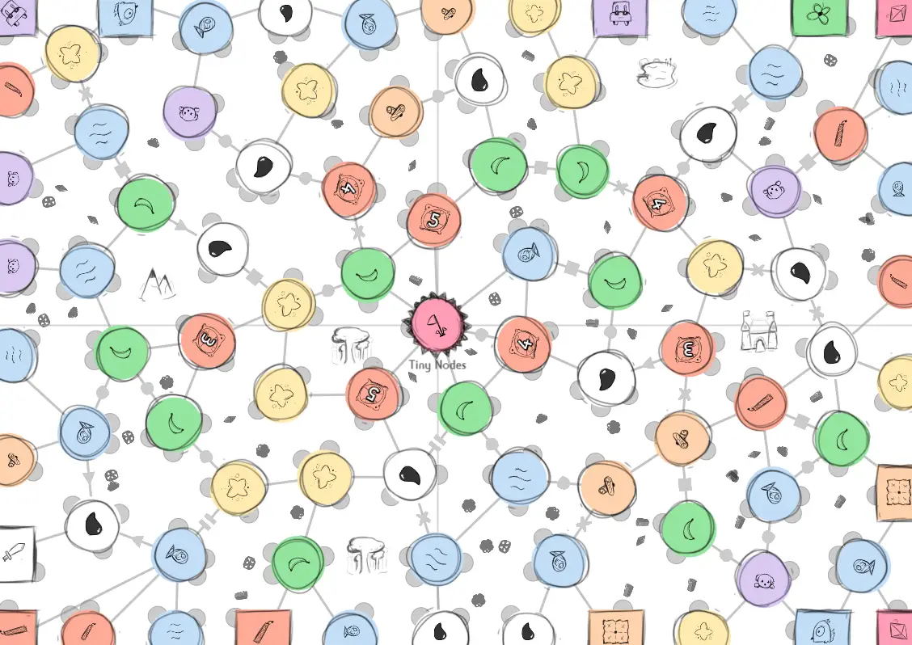

This devlog is part 6 in a series of articles about the development of Unstable Universe. 

Haven't read the other entries? Go to the [devlog overview](../).

Expansion 4: Sharp Scissors
---------------------------

The very first day I worked on the random board generation algorithm, I
got two ideas:

-   Special Edges: create dotted edge, or zigzags, or wavy curves. Each
    different type of edge has some special action. (For example, dotted
    edges may only be traveled *once*, and are then destroyed.)

-   Landmarks: make some nodes much bigger than others. They have
    multiple actions, or can be owned by many players, or do something
    very unique.

I remember this, because I left comments about it at the top of the code
with the date attached :p

Here's how these ideas look on the final board (I'll explain the thought process and functionality below):

### Tiny Nodes

I wanted to implement these ideas in this final expansion ... but
reality was my enemy again.

There just wasn't enough space to create different types of edges.
Either they'd be *so small* that you couldn't recognize them. (Who can
tell a dotted line from a striped one when they are 2 pixels wide?) Or
they would take up too much space and risk overlapping other nodes or
special elements.

Instead, after looking at my random boards for a good while, I saw that
the most space was to be had halfway each edge. Thus I invented the
**Tiny Node**.

These are a simple shape (circle, square, triangle, ...) placed exactly
on the halfway point between two nodes. They are usually *optional* --
you can just skip them and move straight from a regular node to the next
one. But if you do stop on them, you get certain benefits.

(The reason I made these a simple shape, is because those are still
recognizable when part of it is cut off. When you see a half-circle, you
still know the original Tiny Node was a circle.)

### Landmarks v2.0

I didn't have space to create ultra large nodes or complex landscapes.
(It also didn't fit the look and mechanics of the game.) I really wanted
to have "capitals" and "rivers" on the board, but it just didn't work
out.

(And because I don't have the space, I could only create a few landmarks
per board. But that would make the game unbalanced =\> some players can
use them, others will never even see them.)

So, I decided to re-use my complex area-recognition algorithm (from the
expansion \#3) for this as well! I pick a few random areas and place a
huge landmark in the center. (Just an icon of some mountains, or a tree
to represent a forest, or some copy of Stonehenge, whatever.)

Nodes around such a landmark are influenced by special rules. I'll keep
these really simple, because there are already more than enough rules in
this game. (And otherwise they'd be too powerful.)

Because it's just a single recognizable icon (everyone knows what a
mountain looks like), this is much easier to spot and remember. At the
same time, it's something completely new, because no other mechanic
influences all nodes around it.

### Natural Resources

Finally, FINALLY, we arrive at the final idea I have for this game (and
which was good enough to be implemented).

The previous expansions introduced the ability to *cut through empty
space* (instead of following the connections) and that complex
*area-recognition algorithm*.

Let's use those one last time for some fancy stuff!

Any area that has not been claimed by anything else yet (an expedition,
a landmark, ...) will receive a random number of natural resources.
These are placed randomly within the area and will be quite small in
size.

When I say Natural Resources, you should think about *Diamonds, Coal,
Minerals, Gold, etc.*

The rule is simply: **when you cut through them, you get them**. (In a
sense, you *dig* into the ground and retrieve this resource.)

"Getting them" means you get a special action or may add them to a
tally. (One of the missions is about having the most resources.
Obviously, it only shows up when this expansion is enabled.)

**Why was this added to the game?** First of all, to make cutting even
more important. Secondly, to reinforce the theme of "Unstable Universe".
This game basically tells a story of balance: you can drill into the
earth and mine resources to get advantages ... but if you do that too
much (too many cuts, too many destroyed stuff) it will wreck the whole
board and cause everyone to lose.

It's a clear message (and the first time I really put a message into a
game of mine) that fits the theme and game mechanics well. So I try to
continue it through all mechanics in the game.

Pfew, that's that for the main ideas!

It's a lot. It really is. I constantly have to remind myself to take it
slow, keep things small, one step at a time. Yet I still manage to
create these giant games (when all expansions are enabled).

It took me weeks just to implement all the code necessary for these
expansions and write them succinctly in the rule book. I must admit that
I doubted myself a lot during that time -- a weird game about cutting,
who is waiting on that? Why do I keep trying to invent new genres and
making each game as big and bold as it can be? WHY CAN'T I KEEP IT
SMALL?!

But each time, after one or two days of working on other projects, I got
my motivation back as I remembered that the game is actually already
quite good. And it's my responsibility to open the eyes of all people in
the world to the beauty of ... cutting games!

Now I'll need to actually *test* them rigorously and improve until the
game is as best as it can be!

**Remark:** I think I've said this before, but when I say *playtest* I
mean an *organized testing session with others*, usually friends and
family. It's not a good idea to just ... think about your game for
months in isolation and only try it when it's completely done.

As I work on the game, I regularly check how my rules work in practice,
and play mini-turns or mini-games against myself.

It surely doesn't catch all mistakes and nuances -- you need other
players with their own fresh set of eyes and brains for that -- but it
allows me to easily spot mistakes like "with 4 or more players, you're
never going to have enough space" or "this rule is too complicated -- I
forgot it last turn, and I created the darn game!"

Never mind, still more work to do
---------------------------------

As I was putting the finishing touches on the expansions, I soon
realized that they were all trying to do too much. I needed to throw
away some ideas to simplify them ... but after considering all the
possibilities, I just didn't want to throw away most of it. All nodes
and mechanics I invented, were fun and had a good reason to be here.

(They served a purpose in making the game balanced or
allowing/encouraging new strategies.)

So you guessed it: there's now a fifth expansion! I brought back the
"Nodes of Knowledge" expansion as the second one, although mostly by
title. The content -- aka, the actual nodes in the expansion -- are
heavily modified.

I try to keep all these expansions *independent*, so you can just enable
the ones you like (and disable the ones you don't). As such, I now need
to find a good balance between all action types (nodes that allow you to
cut, nodes that allow you to change turn order, etc.) within this
expansion.

This devlog is getting *looong*, so I'll just skip to the finished
product and the playtesting session.

(There are *many* tweaks, improvements, and updates that happen during
development of such a game. Almost every day, I write down 3 or 4
observations like "hmm, the center node should really have more
connections on average, because it's so important" or "the numbers on
the nodes should really depend on how many nodes are on the board *of
that type*"

And when I wake up the next day, I realize those observations are
completely valid and I should probably just implement them immediately.
Creative projects are basically infinite to-do lists.)

Playtesting Session \#2
-----------------------

So, finally, I managed to test the game.

It went well! Rules were quite simple to explain. It was an all-new
group, yet we managed to start playing very quickly and finished games
in 30-45 minutes.

There were still some minor issues though:

-   As I suspected, the Water node was too powerful. (It allowed you to
    teleport, essentially giving you two turns in a row.)

    -   Solution: now you may teleport, but you must remove your old
        icon if you do so.

-   Some icons weren't entirely clear at first glance. (The Fruit Plant
    was a Moon according to some, because its icon is a banana. And Wood
    was a bunch of matches, because the icon has two wood logs on top of
    each other.)

    -   Solution: this isn't that big of a deal. A quick glance at the
        rulebook solved all misconceptions, and most players *did*
        understand the icons at first glance.

-   People, somehow, think the game is much more difficult than it is.
    For example, when the rules say "perform a cut", that's it. Just
    perform a cut following the standard rules. But players were like
    "wait, the cut needs to start at our current node, right?" or "wait,
    the cut needs to go through nodes of the same type, right?"

    -   Solution: I discussed this with the players, and they agreed
        with me that this wasn't really something I could fix. It's just
        their way of thinking. Nevertheless, I tried to put a small
        reminder in the rules where possible, and included images at all
        places where people were uncertain.

The rest of the game actually went great. Even the more skeptical
players became enthusiastic by the end, trying to find the best ways to
cut the paper and the best move the make. (This shows there is at least
a strong core element to the game that is fun and engaging!)

As of right now, we didn't find more issues, but we obviously need to
test the game more. (Several expansions and player counts have not been
tested *at all* yet. In fact, that's what I'll talk about next ...)