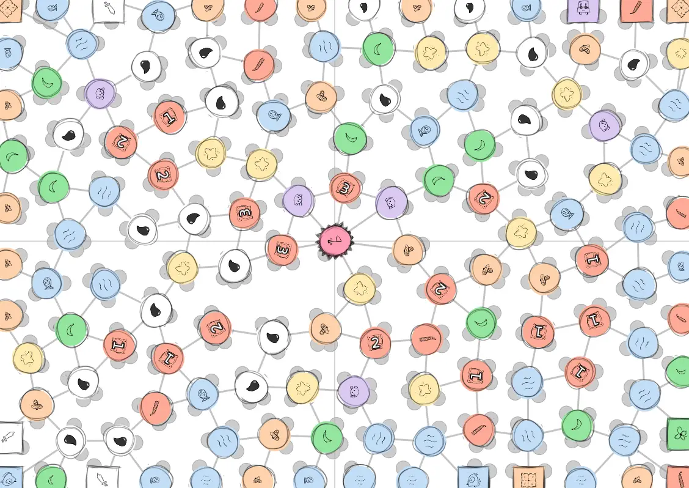
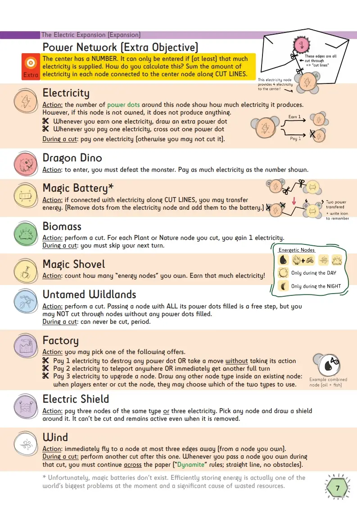

This devlog is part 7 (and also the final part) in a series of articles about the development of Unstable Universe.

Haven't read the other entries? Go to the [devlog overview](../).

Supporting Different Player Counts
----------------------------------

One of the problems with these *One Paper Games*, is, well, the fact
that it's always a fixed size single paper. This means there's often
*too much space* when you're with only 2 or 3 players, and *too little
space* on 6+ players.

As I come from a large family, and simply like playing games in large
groups, I still want to support a wide range of player counts.

How do we solve this? Here's what I came up with:

-   First of all, I foresaw this problem, which is why I **removed all
    "fixed" numbers from Mission Nodes** some time ago. It's not "own at
    least 3 Plant nodes", it's now "own more Plant nodes than anyone
    else". That scales automatically with player count.

-   On higher player counts, there are ***more* power dots around each
    node** (on average). In a 2 player game, each node can only be moved
    to once ( = it has one power dot). At 8 players (maximum capacity),
    each node has 2-4 power dots around it. This ensures you always have
    the right amount of movement options.

-   The **numbers on "progression" nodes depend on player count**. (For
    example, you can only enter a "Critters" node if you own as many
    "Stardust" nodes as the number shown. This number should be lower on
    higher player counts, because it's less likely you'll own so much of
    the board.)

-   On higher player counts, I only allow **one cutting step** by
    default. I'm not sure if this is needed, as an average board has
    *many* cutting steps before it's completely broken\*. Also, this
    would add a nasty exception to the otherwise straightforward rules.

-   On higher player counts, I **increase the minimum/maximum number of
    node occurrences**. For example, because the "Clock" node is vital
    to the 2^nd^ expansion, it's programmed to appear at least X times
    on the board ( = minimum). If you have more players, you obviously
    need more of each node to make the game coherent.

The last solution stated, however, also means the total set of nodes is
less diverse, which can be a problem. The *only* way I see to fix this,
is by making all nodes *smaller* so we can fit more of them on the
board.

But I don't like creating nigh unreadable boards. At most, I could go
*one step smaller* on higher player counts. This would gain one extra
row and columns, which are roughly 15-20 nodes.

I'm still not sure if I want to do this, but it's an option. (On
average, the game should be able to fit 3 different node types in 20
extra nodes. That's not nothing!)

(I just counted one board, and it easily had 120+ edges to cut. Even
in the worst-case scenario -- eight players aggressively taking 2
cutting steps per turn -- that's at least 8 full rounds. But because of
all the different actions and cutting rules, you should usually go
slower. Hmm, difficult to make a decision here.)

**Update! (Another spoiler alert)** After a lot of playtests, and improvements to the board generation, I _did_ decide to make nodes smaller on higher player count, so more of them fit on the page. At max player count, 9 players, you get a significant extra number of nodes and edges on the field. I approximate how many extra nodes you received and use that to keep the _total_ collection of nodes roughly the same size. (More than 12-15 unique nodes per game, is just too much to comprehend for players, and slows down the game a lot.) 

It looks like this (although it's still a work in progress):

The Electric Expansion -- Again!
--------------------------------

Ugh, this expansion is giving me trouble. I needed to simplify it and
incorporate the theme of electricity more with the base game (and
expansions before this one).

As usual, the solution was to tell myself the *core mechanics* in the
game again and force me to consider them. Core mechanic? Cutting the
paper? We need some sort of power network or connection for electricity?
What a minute ... when you cut the paper, you ALSO add a "line" to the
paper!

So, forget all that stuff about "extending" the power net I talked about
earlier. Seems a bit silly in hindsight.

Here's the new rule:

-   The center node has a number on it. You may only enter if it has (at
    least) that much electricity supplied.

-   Every electricity node connected to the center with CUT lines,
    supplies its electricity ( = number on the node) to it.

Way simpler. Fits better. Sometimes my brain is drunk when I make up the
first version of a game idea :p Luckily, it usually finds its way back
to sobriety after sitting on a problem for some time. (Not always
though.)

All other icons from this expansion are simply about generating
electricity (through Solar power, Wind power, burning Biomass, the usual
stuff), transferring it (with a Battery), or using it to buy cool
powers.

In the final version, I had to leave out some of the nodes, because it
was just too much. (The rule is: if images + explanations don't fit on a
single A4 page, the expansion is too complicated.) For example, I had a
thematic "Fracking" node with a cool cutting action (to mimic the
real-life action of fracking the ground in search of oil), but it just
didn't fit.

In my "doubt list" (which I always write when I'm not sure about
something in a project), I've written that this expansion might need
even more simplification later. But for now it seems fine.

Playtest Session \#3!
---------------------

Everything is finished! All expansions are done, their boards can be
generated on the website (without bugs), everything has an icon and a
nice image to explain it.

This means it's now time to playtest the heck out of this game!

> As I've said before, I would love to be able to playtest a game more
> during development, but it's just really hard to find the people *and*
> give them a good impression of the game when it's not yet finished. So
> it's my current habit to finish the game as a whole, and then playtest
> it as much as possible over the span of a couple months.

**The game works!** With the correct player boards (without any bugs,
but with improvements to node placement and such) the game is exciting
until the end and everyone has enough options at all times. It was easy
to explain, easy to play, and everyone had fun.

Only some minor issues remained:

-   I'd forgotten to update some rules in the latest version. (They
    talked about nodes being "destroyed", but that's not something that
    can happen anymore in this game.)

-   The worst offender was the "Puppy" node. Everyone kept forgetting
    its penalty when cut loose. That action is probably more "visible"
    if the penalty only happens when you cut through a Puppy (and not
    just when it completely comes loose).

-   With the lowest player counts, the game can take a bit longer (45-60
    minutes), because there's simply more space. Similarly, at the
    highest player counts, the board is very small, so I might want to
    add some more space there (more nodes and edges, or less cutting
    steps by default).

-   Some balancing, as always. The numbers on critters could be slightly
    lower, some nodes should appear more or less often. (For example,
    "cut blocking" nodes that force you to stop your cut are quite
    important to the game. Without them, the board is destroyed too
    quickly in most games.)

I'll fix these and then I call the game *done*!

(As always, I still playtest the game, improve where I can and would
love any and all feedback or errors you find. It's just not in "active
development" anymore.)

Conclusion
----------

So there you have it. The first ever "cutting boardgame" in the world!

The concept works really well. You don't need to explain to anyone what
cutting means or what "cutting loose a piece of paper" implies. It's an
intuitive, physical action that is quickly understood by all players.

The boards ended up looking nice and inviting. (And I got to practice
different art styles and hand-drawn sketches, which is also something I
needed to do.)

Last but certainly not least, the game is quick to teach and quick to
play, for all ages and players. Just print a few games and get a pen +
scissors, take them with you (on vacation, to school, to friends,
whatever) and you can have fun for hours!

This is also the longest devlog I've written thus far, which isn't
surprising. The game ended up quite large (both the original rules +
expansions and the website component) and it took a long while to figure
out *how* a cutting game would work.

Hopefully this devlog was fun to read, inspired you, or at least
explained how I made the game!

Until the next devlog,

Pandaqi