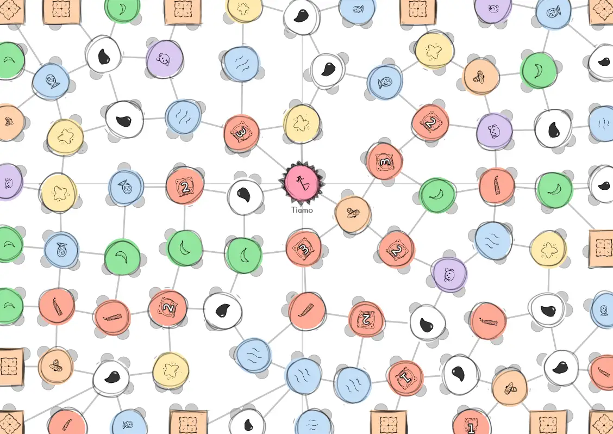
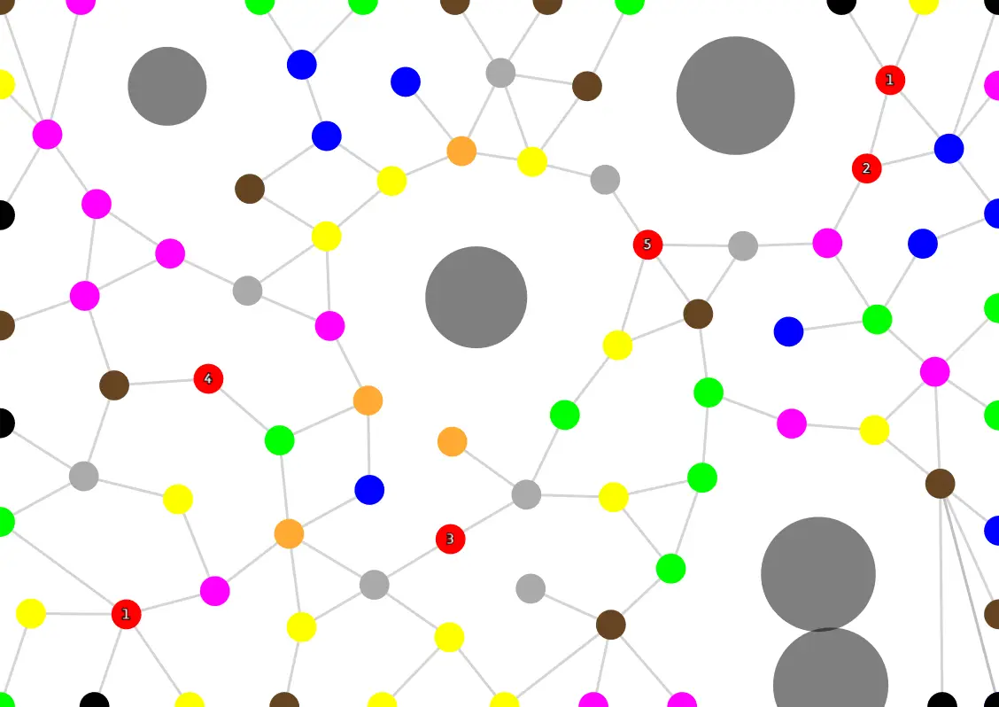

Welcome to the technical devlog about **[Unstable Universe](https://pandaqi.com/unstable-universe)**!

If you haven't yet looked at the game or played it, make sure to do so,
otherwise what I talk about in this article won't make much sense.

For this game, I needed to randomly generate player boards consisting of
lots of *nodes* with *edges* between them. Like this:

In my earlier games, the boards always followed a strict (rectangular)
grid or an even simpler method, so writing the code for such an organic
board already proved quite a challenge. Making the board balanced and
fair in all cases required even more ingenious algorithms, so let's get
started!

What's the game all about?
--------------------------

In this game, all players start at the edge (at one of those rectangular
nodes), and try to reach the center before anyone else.

There's only one action: **move**. You pick a node you're currently at,
and move (via an edge) to an adjacent node. Simple as that.

When you land on the new node, you may take its **action**. And most of
the time, that means a "cutting action": you're allowed to cut into the
board.

When you do so, you must start from the *edge of the paper* or an
*existing cut*, and follow the edges on the board. As you might expect:
if a piece of paper is cut loose from the board, it's gone. Out of the
game.

As such, this game is a challenge between moving towards the center +
grabbing useful nodes for your personal mission ... and making sure
you're not cut off + strategically cutting off your opponents.

Below is a GIF which can probably explain this better:

[plugin:youtube](https://youtu.be/eIcXJeHrPOA)

(This is also posted on the homepage. I'm starting to like these short
videos to explain a boardgame.)

Step 1: Placing Points
----------------------

As you might expect, it's vital that the randomly generated game boards
are *fair* and *balanced*. If one side of the board, by accident, has
way fewer nodes than the other side, or way fewer connections, you're
going to have a tough game.

Just before creating this game, I stumbled upon a technique called
**point relaxation**, which ended up being the solution.

The idea is as follows:

-   Randomly place points on the map.

-   Now perform X relaxation steps (where X is something like 100):

    -   For each node, look at the surroundings.

    -   Calculate the *vector* between each node around us and
        ourselves.

    -   Once we know all these vectors, sum them, and *move* the node by
        that much.

    -   (Each step, reduce the maximum allowed movement by a little
        bit.)

What does this do? It tries to push each node *away* from other nodes
that are too close. After doing this many times, each node will be at
(roughly) equal distance from each other.

(On the website, it actually shows this relaxation happening. I decided
to leave this in, because it looked interesting *and* it showed people
what was happening. Otherwise you'd be staring at a blank page for a few
seconds before the board suddenly popped up.)

It's essential to reduce the movement each relaxation step, otherwise
you'll never find a "balance" and nodes will just race back-and-forth
the whole time, as they are pushed around by their surroundings.

For this game, I decided on a "resolution" beforehand (how many nodes
should fit on the width/height of the paper). So, if I wanted 20 nodes
across the width, then the paper would be divided into sections 0-19.
Then I forced nodes to keep at least a distance of 1, because that's
exactly how much room there should be for each node.


const numIterations = 100;
const numPoints = this.points.length;
const equilibrium = 1.0;

for(var i = 0; i < numIterations; i++) {
  var stepSize = 2.0 / (i+1.0);

  // first, determine velocity based on connections
  for(var a = 0; a < numPoints; a++) {
    var p = this.points[a];
    var vel = [0,0];
    var cX = Math.floor(p.x), cY = Math.floor(p.y)
    
    var connections = // get list of nodes within X distance, whatever way you like

    for(var c = 0; c < connections.length; c++) {
      var p2 = connections[c];
      var vec = [p.x - p2.x, p.y - p2.y]
      var dist = Math.sqrt(vec[0]*vec[0] + vec[1]*vec[1]);

      var force = 0, dir = 1.0;
      
      // get the force (if node is closer, we're pushed away harder
      // and the direction of the push
      force = Math.abs(dist - equilibrium);
      dir = (dist < equilibrium) ? 1.0 : -1.0;

      if(force != 0) { vel = [vel[0] + dir*vec[0]*force, vel[1] + dir*vec[1]*force] }
    }

    p.relaxVelocity = vel
  }

  // then move all points based on that velocity
  // NOTE: It's important to first calculate velocity on all nodes, and THEN move all nodes together
  for(var a = 0; a < numPoints; a++) {
    var p = this.points[a]
    
    // cells at the edge of the paper are static in one direction; listen to that
    if(p.staticX) { p.relaxVelocity[0] = 0; } 
    if(p.staticY) { p.relaxVelocity[1] = 0; }

    // actually move
    p.x += p.relaxVelocity[0] * stepSize;
    p.y += p.relaxVelocity[1] * stepSize;
  }
}


<!--  -->

**Remark:** whenever a node is near the edge at the end of a relaxation
step, I also *snap* it to the edge and don't allow it to come off (it
can still move in the other direction). This helped ensure there were
enough edge nodes on every board. It also simply made boards look
better.

**Remark:** I still use a grid system underneath this all. Why? Because
it's faster. If I want to know which nodes are around me, I simple check
the few *grid* cells around me. And whenever a node moves, I just update
which cell of the grid it should be in. This is *way* faster for large
maps than checking the distance to *all* other nodes, especially when it
comes to the following algorithm ...

Step 2: Creating connections
----------------------------

In this game, the only thing you can do is move from one node to the
next. As such, all nodes should be *reachable* from all other nodes,
otherwise you can't really play the game.

In Mathematics, such a board (with nodes and edges) is called a *graph*.
They also have a name for the set of edges that ensures all nodes can be
reached: a *spanning tree*.

An easy way to create such a spanning tree, is of course to *connect
everything with everything!* That's also an ugly way, which doesn't work
for a boardgame.

Instead, we want a *minimum spanning tree*. We want to connect
everything with the *minimum* number of edges possible. For this, I used
**Prim's Algorithm**.

It works as follows:

-   Create an empty list L.

-   Pick any starting node, put it in L, mark it "visited".

-   Repeat this until *all* nodes have been visited:

    -   Define N: a node in the list L

    -   Define M: a non-visited node that's *not* in L.

    -   Find nodes N and M with the *shortest distance* to each other.

    -   Add M to the list and mark it "visited".

Quite simple, but also quite slow because it looks at *all nodes every
time*.

That's why I implemented a grid underneath it all. If I know a node is
in cell \[2,2\], then I know the nearest node is probably in its
neighbors (the cells \[1,2\], \[3,2\], \[2,1\], \[2,3\]). If that fails,
I cast a wider net, until I find something.

This requires some extra work ("bookkeeping" as Mathematicians like to
call it), but is *fast*. For this game, I ended up with relatively small
boards (only 80-90 nodes per game). But I initially tried this method on
a *way larger* project with thousands of nodes, and it still got a valid
result within a second.

Using this algorithm, we get something like this:

And here's the code:


var curPoint = this.points[0];
curPoint.visited = true;

var list = [curPoint];

// use Prim's algorithm to build a minimum spanning tree from ALL points
// NOTE: yes, we must do -1, because the last point has no new connection to make, so we terminate the iteration before that
while(list.length < this.points.length - 1) {
  var query = this.getClosestConnection(list); // again, implement any way you like => Euler distance, Manhattan distance, Grid, ...
  var p = query.p, p2 = query.p2;

  p.connections.push(p2);
  p2.connections.push(p);

  p2.visited = true;
  
  list.push(p2);
}


<!--  -->

Step 3: Filling the tree
------------------------

This is a cutting game which can be played with a large player group.
Having only ONE connection between nodes is not enough, we need some
backups!

Allow me to introduce the "random fill tree" algorithm:

-   Keep looping through the nodes until we've added X extra edges.

-   For each node, find the *nearest* node, which:

    -   Does not have a connection to it yet. (No sense in creating
        duplicate edges.)

    -   Does not already have too many connections. (Depends on node
        type.)

-   If we find something, connect the two nodes.

In this case, I allowed starting nodes at most 2 connections, and other
nodes at most 4. (Why do starting nodes get fewer? Because they only
have *half* the board into which to draw edges, it's likely that edges
will *overlap* if they get more than 2, which is ugly and unclear for
players.)

This algorithm is really simple. The complexity is hidden in the part
that finds the "nearest node": that function is a large bundle of loops
and if-statements to efficiently find a node following certain
conditions.


const numExtraConnections = 40;
const connectionMaximum = 3;

// then go through all the other points
for(var i = 0; i < this.points.length; i++) {
  var p = this.points[i];

  // Don't add connections if something already has too many of them
  // Also don't add extra connections to edgePoints (high probability of creating overlapping edges)
  if(p.edgePoint || p.connections.length >= connectionMaximum) {
    continue;
  }

  var query = this.getClosestConnection([p], 'unconnected');

  // there IS no closest connection, so continue without doing anything
  if(query.p2 == null) { continue; }

  // otherwise, make the connection we found (and we should always draw it)
  var p2 = query.p2;

  p.connections.push(p2);
  p2.connections.push(p);
}


<!--  -->

**Remark:** Later, when I was almost done with programming, I decided to
call a similar function on the *center node* only. This function would
give the center node *as many connections as possible* within a certain
radius. Why? Because it's important that every player can reach this
node (as that is how you win the game), so I wanted as many edges as I
could get.

Step 4: Determine starting nodes
--------------------------------

During generation, I already save all nodes at the edge of the paper. In
fact, I save them by side ("left", "right", "top", "bottom").

This allows me to pick *three* nodes from each side and convert them to
starting nodes. (These are rectangular and get a special icon. That
determines your *personal mission* for the game.)

At first, I did so randomly, but that quickly proved unfair. If your
starting node was near the center of the edge, you had a way shorter
path to victory than other players!

Instead, I *sort* the edges based on *distance to the center node*. Then
I pick those furthest away.

I also added another exception because of this problem: if two starting
nodes were connected with the same node ... one of them would be
worthless. Why? The player who happened to go first would snatch that
node, and the other literally has nowhere to go.

So, when I create a starting node, I go through all its connections and
set "hasStartingNode: true". Later, if I want to create a starting node
but one of its neighbors already has this property, I just skip that
node and consider the next option.


const edges = ['left', 'right', 'top', 'bottom'];
const numPlayersPerEdge = 3;	

for(var e = 0; e < 4; e++) {
  var edgeName = edges[e];
  var edge = this.edgePoints[edgeName]

  // first, sort all edge nodes based on distance to center
  for(var i = 0; i < edge.length; i++) {
    edge[i].distanceToCenter = Math.pow(edge[i].x - this.centerNode.x, 2) + Math.pow(edge[i].y - this.centerNode.y, 2) 
  }

  edge = edge.sort(function(a,b) { if(a.distanceToCenter < b.distanceToCenter) { return 1; } else { return -1; } })

  // then place mission nodes, with two restrictions:
  // 1) as far away from center as possible (so pick first in sorted list)
  // 2) they must have at least one connection that is NOT also used by another mission node
  var counter = 0;
  for(var i = 0; i < numPlayersPerEdge; i++) {
    var p;
      do {
        p = edge[counter];
        counter++;
      } while (this.invalidMissionNode(p));

      this.convertToMissionNode(p);
    }
}


<!--  -->

**Remark:** in case you were wondering "how do you pick the center
node?", the answer is probably exactly what you expect. When placing
nodes, I mark the one closest to the center as "Center", and that's it.
This allows some variation -- because the node can drift off during
relaxation -- but also means I know the center node early on. Which is
useful for coding other algorithms.

This devlog continues at part 2!