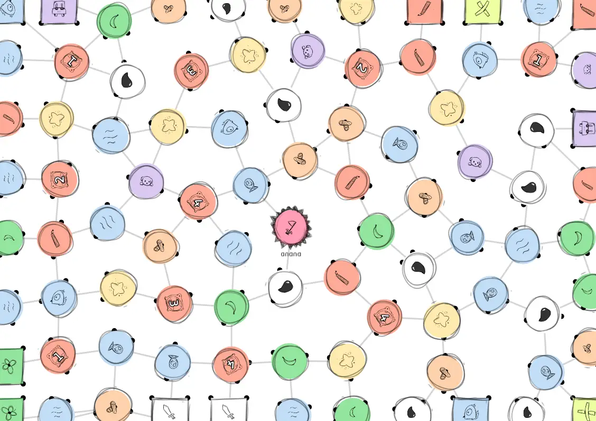
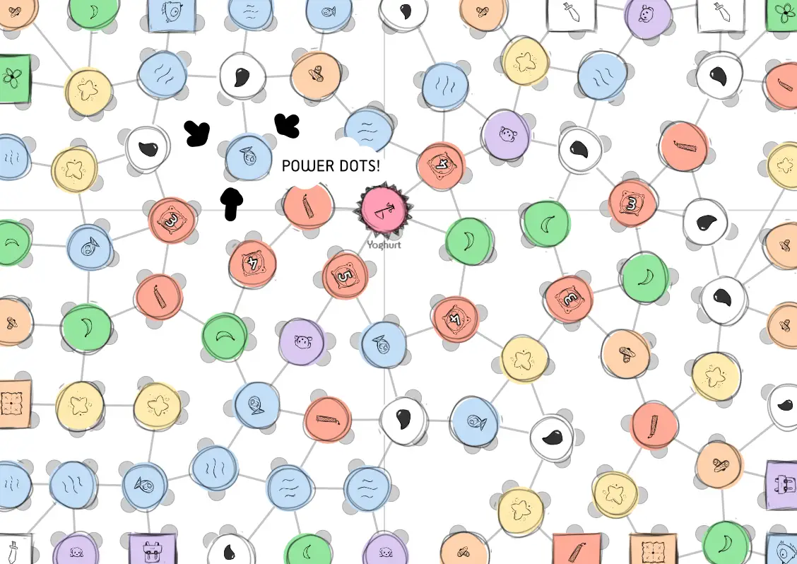
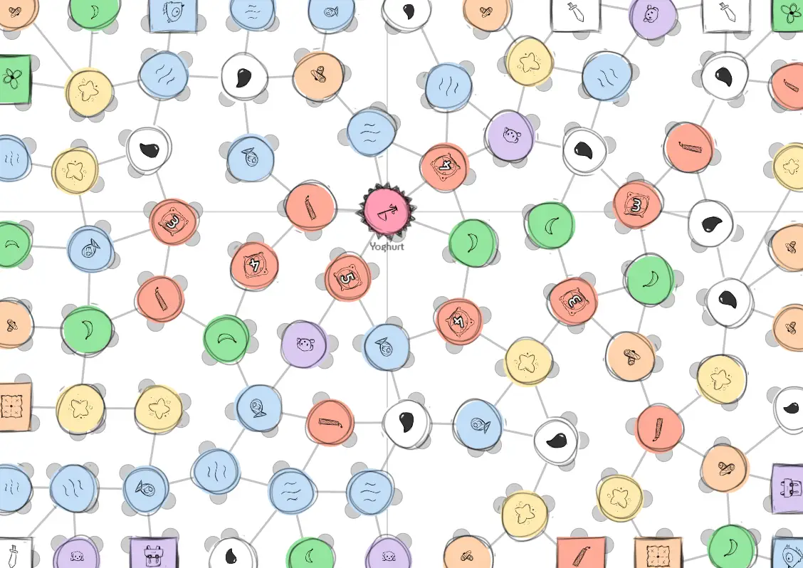

Welcome to part 2 of the technical devlog.

Haven't read the other entries? Go to the [devlog overview](../).

Step 5: Determine all other nodes
---------------------------------

This is the big one.

For each game, I needed:

-   A diverse set of node types (e.g. each different action type must
    appear at least once)

-   Following certain requirements (e.g. node X must appear at least 3
    times)

-   Placed at proper locations on the board (e.g. harder nodes must be
    placed more towards the center)

**Step 1:** determine the nodes we'll use. This is only activated if you
have *expansions* enabled, because then the computer needs to choose a
subset out of a large number of nodes. I'll elaborate on this later.

**Step 2:** create the full list of nodes *beforehand*. That's usually
the best way to go with random generation. Ensure that each type is
considered at least once, then fill the list randomly until it's equal
to the number of nodes on the board.

I ended up with these special settings that each node could have:

-   **Prob:** probability of drawing this node (required).

-   **Min:** when this node is selected, it is immediately added to the
    list "min" times.

-   **Max:** whenever this node is placed, we count how many already
    exist. If we've reached the maximum, we remove the node from the
    options (so it's never placed again).

-   **MinDistanceFromEdge:** self-explanatory.

-   **MaxDistanceFromEdge:** self-explanatory.

-   **MaxSequence:** how many of this type may be *in sequence*. Having
    nodes in sequence is usually boring or overpowered, and makes the
    board unbalanced (because all the nodes of type X are all in the
    same corner). By default, only two are allowed in sequence, with
    many nodes going down to 1. I'll explain the code below.

**Remark:** Nodes such as "Critters" require you to collect X nodes of a
different type before you're allowed to pass them. They are (near)
impossible to pass if you reach them early in the game, so that's why I
introduced the "minDistanceFromEdge" =\> to place these away from the
starting nodes. (To *ensure* this very rarely happens I even added an
extra constraint in the code: don't allow nodes with a number on them
right after a starting node.)

Whenever you need to find all nodes that share something (they are in
sequence, they are connected, whatever), but you have no clue how many
there are or where they are, your best bet is usually a **recursive
function**.

To check if a certain node placement would create too many identical
nodes in sequence, I execute this function:

-   Add the node to a shared list and mark it as "visited".

-   Go through all connections.

    -   If the connection has the same type as us, call this function
        again, but on *that* node.

The code for this particular part looks as follows: 


//
// somewhere else, where we check if a node is allowed
//
var sequenceLength = this.checkSequenceRecursive(p, type);
if(sequenceLength > maxSequence) { return false; }

//
// the big function
//
function checkSequenceRecursive(p, type) {
  var sequenceSums = 1; // also take into account the node itself
  p.sequenceCounter = this.curSequence + 1;

  for(var c = 0; c < p.connections.length; c++) {
    var conn = p.connections[c];
    
    // node is the wrong type, or already checked? Continue!
    if(conn.type != type || conn.sequenceCounter > this.curSequence) { continue; }

    // otherwise, this node extends the sequence, so call this function again on THAT node
    sequenceSums += this.checkSequenceRecursive(conn, type)
  }

  return sequenceSums;
}


<!--  -->

**Remark:** I use a trick to make this faster. Normally, you'd go
through *all* nodes and mark them "unvisited" before running such an
algorithm, but I found that slow. I keep a global counter that increases
every time this algorithm is run. If a node's sequenceCounter is
*smaller than* the global one, it means it hasn't been considered for
this algorithm yet!

(See the main code for the game for all the finer details.)

**Step 3:** go through all the nodes and assign their type: pick the
first type in the list, remove it from the list and give it to the node.

However, a node's special settings might forbid placing this type here.
If that's the case, we **temporarily** skip it and try the next one on
the list. Repeat until we find a matching type. (If we find nothing that
fits, the algorithm begrudgingly assigns a random type from the list.)


function determineNodeTypes() {
  // now go through all points 
  var nodeTypes = []; // ACTUALLY a list with all the nodes we actually want to place; explained later
  var nodeCounter = 0;
  for(var i = 0; i < this.points.length; i++) {
    var p = this.points[i];

    // (only update those that haven't yet been updated, otherwise we override center node and mission nodes)
    if(p.type != 'Regular') { continue; }

    // as long as we encounter nodes that are not allowed, try the next point type on the list
    // (if we've exhausted the whole list, reset to 0 and just pick that anyway)
    var nodeAllowed = false, counter = -1, tempType = null;
    do {
      counter++;

      if(counter >= nodeTypes.length) {
        tempType = nodeTypes[0]
        break;
      }

      tempType = nodeTypes[counter]
      nodeAllowed = this.checkIfNodeAllowed(p, tempType);
    } while(!nodeAllowed);

    p.type = tempType;
    nodeTypes.splice(counter, 1);
  }
}
 
function checkIfNodeAllowed(p, type) {
  // this is the huge dictionary that holds all node types (key = node name, value = data about it)
  var nodeData = NODES[type]

  //
  // some nodes are not allowed at the edge
  //
  if(p.edgePoint && nodeData.forbiddenOnEdge) { return false; }

  //
  // some nodes have a fixed minimum distance from the edge
  //
  var minDistance = nodeData.minDistanceFromEdge || -1;
  if(this.distanceToEdge(p) <= minDistance) { return false; }

  //
  // and some even have a fixed MAXIMUM distance from the edge
  // (such as water, because I don't want people teleporting to the center of the board)
  //
  var maxDistanceFromEdge = nodeData.maxDistanceFromEdge || Infinity;
  if(this.distanceToEdge(p) > maxDistanceFromEdge) { return false; }

  //
  // many nodes have a maximum on the number of them that may be "in sequence" ( = grouped together)
  //
  var maxSequence = nodeData.maxSequence || 2;

  this.curSequence++;
  var sequenceLength = this.checkSequenceRecursive(p, type);
  if(sequenceLength > maxSequence) { return false; }

  //
  // a node with a number is NOT allowed right after a starting node
  //
  if(nodeData.needsNumber && this.connectedToStartingSquare(p)) { return false; }

  return true;
}


<!--  -->

Here's the closest image I have of the board at this point in development. Notice how elements are evenly spread out and varied across the board:

Step 6: Placing Power Dots
--------------------------

The concept of "Power Dots" is actually the thing that holds this whole
game together.

If you allow cutting into the game board, there's going to be a ton of
*imprecision*. When is a node "destroyed" or "cut off"? When only half
of it is visible? When it's completely gone? When it's been cut at least
one time?

There were no satisfying answers to this question, until I realized that
the node *itself* wasn't important. The *edges* were important.

And so I invented the idea of power dots: these are placed *around* a
node, in the space between edges. (If possible, the board tries to make
sure they never overlap.) If such a dot is cut off -- which is a clear
yes/no answer -- it's lost. You only own a node as long as you own one
of its power dots.

The power dots are the small (semi-)circles around each node:

Finding a good placement algorithm took a few tries, but I eventually
settled on the following:

-   Determine the *angle* of all the edges (of this particular node).

-   Repeat until we find a fitting location:

    -   Pick a random edge. Check the angle between this one and the
        next one.

    -   If the angle is large enough, we should be able to *fit* a power
        dot between them.

    -   Place it randomly within the available space.

    -   (From now on, "pretend" the new power dot is also an edge, so we
        don't get overlapping power dots.)

We repeat this algorithm as many times as we need power dots. (On higher
player counts, there are more power dots around each node on average.)

The loop also terminates once we've *exhausted all possible angles*.
This simply means that we've checked the space between every edge in our
list and the next one, and found no space large enough. (It would be
unwise to wait until literally *all angles* have been tried, because
there are infinitely many of them.)

This is the code:


function placePowerDots() {
  const powerDotRadius; // size of power dots; depends on, well, whatever you decide to set it to
  var minPD, maxPD // minimum and maximum number of power dots; depends on player count

  var tempNumPowerDots = 0;
  for(var i = 0; i < this.points.length; i++) {
    var p = this.points[i];
    p.powerDots = [];

    tempNumPowerDots = Math.floor(Math.random()*(maxPD - minPD + 1)) + minPD;

    // make a COPY of the angles list, because we're going to be modifying it here, 
    // and we don't want to accidentally modify the original
    var allAngles = p.edgeAngles.slice();
    
    // How does it work?
    // We pick a random edge and calculate distance to next edge. If that is big enough, we can place the dot somewhere in between
    // The dot also counts as an edge, so we add it to allAngles
    for(var pd = 0; pd < tempNumPowerDots; pd++) {
      var curAngleIndex = Math.floor(RNG() * allAngles.length);
      var foundFreeSpace = false;
      var numTries = 0;

      allAngles.sort();

      do {
        var ang = allAngles[curAngleIndex];
        var nextAng = allAngles[(curAngleIndex + 1) % allAngles.length]

        var spaceBetween = (nextAng - ang + 2*Math.PI) % (2*Math.PI); 
        if(ang == nextAng) { spaceBetween = 2*Math.PI; }

        // yes, enough space! place it in here
        var res = false;
        if(spaceBetween > 2*powerDotRadius) {
          var randAngle = ang + Math.random() * (spaceBetween-2*powerDotRadius) + powerDotRadius;

          var res = this.createPowerDot(randAngle, p, allAngles)

          if(res) {
            foundFreeSpace = true;
            break;
          }
        }

        // no, not enough space, try again with the next edge!
        if(!res) {
          curAngleIndex = (curAngleIndex + 1) % allAngles.length;
          numTries++;
        }

      // we're certain there is no free space if we've tried all angles we have
      } while(!foundFreeSpace && numTries <= allAngles.length);
    }
  }
}


<!--  -->

(I've left out some exceptions in case of nodes at the boundary of the paper - which can't use all angles of course, because some are off the board - or when no power dot could be placed at all. For simplicity's sake.)

Step 7: Polishing & Visuals!
----------------------------

We're almost done! Already!

You might be thinking that the algorithms for this game aren't that
difficult at all, despite my claims at the beginning, but that's because
I only wrote down the end result. I can spend days if not weeks
pondering how to best solve a problem, trying five different approaches,
until I find the right one for this game.

(If you want to read about the failed attempts or early versions, they
are in the regular devlog. I don't see a point in explaining failed
algorithms and showing their code in such a technical devlog. I'd
basically be steering readers in the wrong direction all the time.)

**Finishing Touch \#1:** I mentioned that certain nodes, like Critters,
need a number on them. You need to collect that many nodes of some type
before you can enter. It's only logical that this number *depends* on
how many nodes of that type are even *on the board*.

So I count that, divide by the player count (as any player could snatch
those resources), and divide by *distance to the center node*. (If
you're further away, you should have really low numbers, as players
don't have that many resources yet.)

**Finishing Touch \#2:** until this point, I'd allowed my game engine
(Phaser v3) to draw some circles and lines. That looked fine, but was
too abstract and didn't fit the theme of the game.

I changed it to the following:

-   I draw a perfect circle/rectangle for each node and color it
    depending on their type.

-   I also draw a perfect line between the nodes (behind them in the
    visual hierarchy).

-   I drew several *rough/sketchy outlines* and imported them. They are
    placed around the nodes and rotated randomly for extra sketchiness!

-   Then I placed each node icon inside the circle and rotated that
    randomly as well.

I find this a nice balance: the basic parts of the game are drawn by the
computer, which makes them "perfect" and "crisp" (and saves me a lot of
time and effort). But the other half, the details and the icons, are
drawn by me in a looser and more organic style. Combining the two
strikes a nice balance between readability/clarity and
playfulness/interestingness (is that even a word?).

**Finishing Touch \#3:** one of the more common missions in the game is
to own (at least) one node in each "quadrant" of the board ( = top left,
top right, bottom left, bottom right). As you're playing, people
commented it was hard to see at a glance where each node was. So I added
two straight lines through the center node to clearly mark the
quadrants.

**Finishing Touch \#4:** edge nodes didn't have much space for icons. To
solve this, I offset every edge node 10px from the edge by default,
giving them some breathing space. (This turned out to be more annoying
than I thought, because it also messed with other calculations if
certain nodes were suddenly somewhere else. But I got it working after
some frustrating hours.)

Conclusion (for now)
--------------------

And that's it! Those are all the algorithms, code and ideas that went
into creating a random generator of game boards for *Unstable Universe*.

The first *cutting* boardgame ever made! (As far as I can tell.) The
boards turned out great, the game is a lot of fun, and there are many
possibilities with the cutting mechanic that are simply impossible in
other games. (Think about *re-attaching­ parts of the board somewhere
else* or *drawing your own edge*, which can then be moved over or cut.)

But for all those thoughts and comments, visit the regular devlog!

I always leave out the finer details, the exceptions, the failed
attempts, etcetera. So don't think that I did all this in one go,
finishing this whole system in a single afternoon. Certainly not, it
took months! (I also worked on many other things at the same time, but
still.)

Why do I say this? Because I used to be discouraged, when I was younger,
whenever I saw an artist create something cool or brilliant and
pretending they did it in a day. Without any effort, or failed attempts,
or doubts. I especially hate it when they don't explain *why* they do
something. With these devlogs, I try to give inspiration and explain how
to solve certain problems, without going too much into the details.

That said, there are still some expansions that we need to talk about!