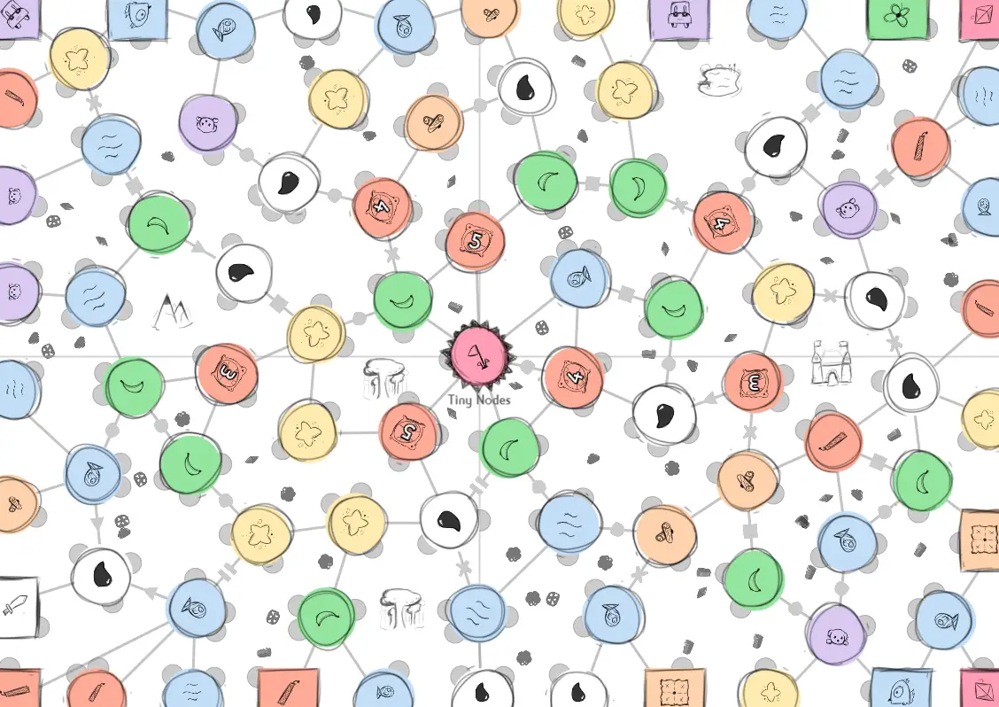

Welcome to part 3 of the technical devlog.

Haven't read the other entries? Go to the [devlog overview](../).

Expansions: Creating a better Node List
---------------------------------------

There are three expansions for this game that (mostly) add more nodes.
My experience from previous games tells me that I can't simply allow
such a huge list, because then each type would only appear 1 or 2 times
on the board. This makes games extremely random and unbalanced, whilst
making it more complex: each player needs to remember how 20+ unique
nodes work!

I, therefore, took the following approach.

Each node has a Category (like "Nature") and one or more Action Types
(like "Cutting" or "Moving"). I do this for all games now, because it
allows me to easily balance all parts of the game, while keeping them
varied.

If you look at the expansions, you'll see that they ALWAYS contain each
*Category* and each *Action Type* at least once. The "Cutting" action is
contained at least *three* times, because it's such a vital action.

No matter what expansion you pick, no matter which game you play, you
will *always* have a set of nodes that contains all possible actions and
categories this game has to offer.

Once I have this system, I can use it when generating the board:

1.  Initialize an empty list.

2.  Pick one random node from each *Category*, and add it.

3.  Pick one random node for each *Action Type*, and add it.

4.  Fill the remaining space with random nodes (that aren't already in
    the list).

*What's the remaining space?* Well, I know the number of nodes on the
board (usually around 80). I also gave each node a "min" and "max"
value, remember? Whilst adding nodes, I sum the average ( (min+max)/2 ),
until it goes *above* the total number of nodes. That's when I know that
there are enough nodes to fill the board, but not too many.

*What if a node requires other nodes to function?* Yeah, that's a big
problem I encountered for the first time in the last game I made.
Luckily, I had time to come up with much simpler (and better) solutions
for this particular game.

For example: the *Critters* node requires you to collect *Stardust*.
Adding one node without the other is literally useless, as they both do
nothing. So, each node has a **requirements** setting that holds a list
of required nodes.

When such a node is added, it automatically loops through its
"requirements" list, and adds those as well (if they aren't already in
the list).

This means we can sometimes "overshoot" the maximum, but that's not a
big deal. It just means one node type will have one or two fewer nodes
on the board than would be ideal.

*But, won't this add many duplicate nodes? For example, if a node has
Category X and Action Type Y, it would be added twice (both in step 2
and step 3)!* Of course, that was the last problem that needed solving.

At the start, I have two lists containing all possibilities (all
categories and all actionTypes).

Whenever I add a node, I check if its *Category* is still in the list of
categories. If so, I *remove it*. The same thing is done for *Action
Types*.

This means that, when I add such a node with Category X and Action Type
Y, both these elements are removed from their respective list, so they
won't be encountered any more in steps 2 and 3.

Hopefully the code clarifies any issues with this explanation:


function createBetterNodeCollection() {
  var tempNodes = {}, name = '', curNodeData = { sum: 0, categories: [], actionTypes: [] };

  // Step 1) For each category and action type, add ONE random node to the selection
  curNodeData.categories = [/* list of all the categories as strings */];
  curNodeData.actionTypes = [/* list of all the action types as strings */]

  while(curNodeData.categories.length > 0) {
    name = this.getRandomNodeOfType('category', curNodeData.categories[0], tempNodes, NODE_RNG);
    this.addNodeToCollection(tempNodes, name, curNodeData)
  }

  while(curNodeData.actionTypes.length > 0) {
    name = this.getRandomNodeOfType('actionType', curNodeData.actionTypes[0], tempNodes);
    this.addNodeToCollection(tempNodes, name, curNodeData)
  }

  // Step 2) Count how many "cutting nodes" we have => we want at least 3
  var cuttingNodesInSet = 0, minCuttingNodes = 3;
  for(var name in tempNodes) {
    if(tempNodes[name].actionTypes.includes("Cutting")) {
      cuttingNodesInSet++;
    }
  }

  while(cuttingNodesInSet < minCuttingNodes) {
    name = this.getRandomNodeOfType('actionType', 'Cutting', tempNodes);
    if(name == null) { break; }

    cuttingNodesInSet++;
    this.addNodeToCollection(tempNodes, name, curNodeData);
  }

  // Step 3) As long as we still have space left, keep adding more nodes (that we don't have yet)
  const errorMargin = 5;
  const maxPointsToFill = this.points.length - 12 - errorMargin; // all points - starting nodes - some margin
  while(curNodeData.sum < maxPointsToFill && Object.keys(tempNodes).length < Object.keys(NODES).length) {
    do {
      name = this.getRandom(NODES, this.totalNodeProbability);
    } while(tempNodes[name] != undefined);
    this.addNodeToCollection(tempNodes, name, curNodeData);
  }

  // finally, swap the old (full) NODES list with the new one
  NODES = tempNodes;
}

function addNodeToCollection(list, name, curNodeData) {
  // if it's already in the list, don't add it again
  if(list[name] != undefined) { return; }

  var node = NODES[name];
  list[name] = node;

  // update total sum (we stop filling the list when we have enough for the whole board)
  var nodeMin = node.min || 0, nodeMax = node.max || nodeMin;
  var diff = Math.ceil((nodeMin + nodeMax) * 0.5) + 1;
  curNodeData.sum += diff;

  // check if category needs to be removed from list
  var catInd = curNodeData.categories.indexOf(node.category)
  if(catInd > -1) {
    curNodeData.categories.splice(catInd, 1);
  }

  // check if action type(s) need to be removed from list
  for(var i = 0; i < node.actionTypes.length; i++) {
    var atp = node.actionTypes[i];
    var atpInd = curNodeData.actionTypes.indexOf(atp);

    if(atpInd > -1) {
      curNodeData.actionTypes.splice(atpInd, 1);
    }
  }

  // check if this node requires any other nodes; if so, add those as well
  var requirements = node.requirements || [];
  for(var i = 0; i < requirements.length; i++) {
    var req = requirements[i]
    this.addNodeToCollection(list, req, curNodeData)
  }
}

function getRandomNodeOfType(what = 'category', tp, nodesList) {
  var list = {}, totalProb = 0;
  for(var name in NODES) {
    if(nodesList[name] != undefined) { continue; }
    var n = NODES[name]

    if(what == 'category' && n.category == tp) {
      list[name] = n;
      totalProb += n.prob;
    } else if(what == 'actionType' && n.actionTypes.includes(tp)) {
      list[name] = n;
      totalProb += n.prob;
    }
  }

  // in this case, "getRandom()" is a default function that randomly draws nodes from a list, following weighted probabilities
  // but it can be any function that randomly selects one element from a list
  return this.getRandom(list, totalProb);
}


<!--  -->

Expansions: Area Detection I
----------------------------

This was the hardest algorithm to figure out for this game.

As I mentioned at the start, I'd only created grid-based boards until
now. Finding the empty areas *between* roads/connections is easy there.
(You start with a random empty square, then check if its neighbors are
empty, and repeat that until all neighbors are filled with something.)

This time, none of that would work. Nodes could be literally anywhere on
the board and the edges could be any length or angle.

Fortunately, a memory sprang at the back of my mind that said something
like "can't you find polygons by always going clockwise?" Turns out that
particular memory was correct.

Here's the idea:

-   Go through all nodes and *sort edges by angle*. (We already have
    this information from placing the power dots.)

-   Now go through all nodes again:

    -   Go through all edges around the node.

    -   Any time you encounter a node, pick the *next edge* from its
        list of edges. (Because this list is sorted by angle, the next
        edge will always be the first one you encounter counter
        clockwise.)

    -   Repeat until you're back at your starting node.

It's quite simple in summarized form on paper, but it has some
exceptions and technicalities that made it hard to implement.

**Exception \#1:** if we do this, then we get *many* duplicate polygons.
(Because we create the same polygon for *every* node within it.)
Instead, each edge should only be used in *two* polygons exactly.

(Because, well, an edge, basically cuts a space in half, so there is a
space on either side. Two spaces, two polygons in which this edge
falls.)

To solve this, I keep track of whether an edge has already been used
*coming from this particular node*. If so, don't ever use it again. This
means an edge is always used exactly twice: A-\>B, and B-\>A

Because we always go counter clockwise, these must represent the two
different polygons.

**Exception \#2:** there are no edges at the boundary of the paper! (I
hadn't even considered this, until it screwed me over and it took hours
to fix.)

Because there are no edges there, you can never find polygons with those
nodes, because you can never return to the starting node. (On top of
that, there isn't always a clockwise node to go to if you're in the
*corner* of the paper.)

In the end, I wrote a function "addTemporaryEdges()", which does exactly
what it says. It connects all nodes at the boundary (mostly the starting
nodes) with straight lines, and it connects corner nodes on both sides.

Calling this function *before* finding the areas, solved all issues.


function findEnclosedAreas() {
  this.areas = [];

  // initialize "connection used" to false for each edge
  for(var i = 0; i < this.points.length; i++) {
    var p = this.points[i];
    
    p.connectionUsed = [];
    for(var c = 0; c < p.connections.length; c++) {
      p.connectionUsed[c] = false;
    }
  }

  for(var i = 0; i < this.points.length; i++) {
    var p = this.points[i];
    
    // for each connection ... 
    for(var c = 0; c < p.connections.length; c++) {
      var conn = p.connections[c];

      // ignore edges that have already been used
      if(p.connectionUsed[c]) { continue; }

      // start a new area
      var area = [p], areaDone = false, failedArea = false;
      var curNode = conn, prevNode = p;

      p.connectionUsed[c] = true;

      while(!areaDone) {
        // add current node to area
        area.push(curNode);

        // find location of previous point in list of connections
        // (so we know the ANGLE at which we entered the node, so we can pick the one immediately clockwise to it)
        var indexByAngle = -1;
        for(var cc = 0; cc < curNode.connections.length; cc++) {
          if(curNode.connections[cc] == prevNode) {
            indexByAngle = cc;
          }
        }

        // now pick the NEXT connection after it
        var newIndex = (indexByAngle + 1) % curNode.connections.length;
        var newNode = curNode.connections[newIndex];

        // remember that the connection we will follow next, has already been used from this node
        // NOTE: Don't use the connection we used to GET here, as that should be saved on the node we CAME FROM
        curNode.connectionUsed[newIndex] = true;

        // set new current and previous node
        prevNode = curNode
        curNode = newNode

        // if we're back at our starting node, we're done
        if(curNode == p) { 
          areaDone = true; 
        }
      }
      
      // finally, add the new area we found to the global list
      this.areas.push(area);
    }
  }
}


<!--  -->

Expansions: Area Detection II
-----------------------------

Great! Now we have all areas on the board (in the form of a list of
nodes, in clockwise order).

However, I need the areas to place things *inside* it. Both "expedition
nodes" and "landmarks" can appear in the center of an area, and they
need quite a lot of space. How do we know which areas are big enough?
And how do we find a suitable position?

**Step 1**: average the position of all nodes. This gives the "true"
average of the polygon. However, if the area is weirdly shaped (like an
L-shape), this doesn't automatically mean it's the best location to
place something.

**Step 2:** calculate the *shortest* distance from the average to the
nodes of the polygon. This essentially determines the "largest circle"
we can draw around the center before we hit something.

-   If this circle is large enough -- great, we can place something
    here!

-   If it's too small -- too bad, leave this area alone (for now)

**Step 3:** let's revisit that **relaxation technique** from before!

Relax the "center point", considering only the nodes of this area. Just
like before, this means that this point is pushed away if it gets too
close to one particular node. In almost all cases, this means that the
point ends up in the location with the most space.

I don't apply this technique on polygons with only 3 or 4 nodes. Why
not? Firstly: there's nowhere to go. The center of such an area is
already the (near) optimal center. Secondly: relaxation doesn't work.
The point would just go through the empty spaces between the nodes,
because there isn't enough to push it back.

**Step 4:** use this point to place something inside this area!


function findSuitableAreas() {
  this.suitableAreas = [];

  for(var i = this.areas.length - 1; i >= 0; i--) {
    var a = this.areas[i].slice(), numNodes = a.length, nodeRemoveCounter = 0;
    var center = null
    var areaIsSuitable = false;

    do {

      // first, find the center point
      center = [0,0];
      var tempNumNodes = (numNodes - nodeRemoveCounter);
      for(var p = 0; p < tempNumNodes; p++) {
        center[0] += a[p].x / tempNumNodes;
        center[1] += a[p].y / tempNumNodes;
      }

      // then find the distance to the closest node
      // (aka "what's the biggest circle we can draw around the center that still fits within the polygon?")
      var closestDist = Infinity;
      for(var p = 0; p < numNodes; p++) {
        var dist = Math.sqrt( (a[p].x - center[0]) * (a[p].x - center[0]) + (a[p].y - center[1]) * (a[p].y - center[1]))
        closestDist = Math.min(closestDist, dist);
      }

      // if the center is too close to an edge node (of this enclosed area), try again, but change the center
      // (basically, we remove the last node of the area, and keep trying that until it works or we've nothing left to remove)
      if(closestDist <= someRadius) {
        nodeRemoveCounter++;

        if(numNodes - nodeRemoveCounter < 3) {
          areaIsSuitable = false;
          break;
        }
      } else {
        areaIsSuitable = true;
      }

    } while(!areaIsSuitable);

    if(areaIsSuitable) {
      
      // create an area object, including some useful metrics
      var dx = (this.centerNode.x - center[0]), dy = (this.centerNode.y - center[1])
      var distanceToCenterNode = Math.sqrt( dx*dx + dy*dy )

      var newArea = {
        'tiles': a,
        'center': center,
        'dist': distanceToCenterNode
      }

      // then add it to the suitable areas list
      this.suitableAreas.push(newArea);

      // and remove it from the original areas list (so it isn't used by any other game mechanics)
      this.areas.splice(i, 1);
    }
  }
}

//
// When we actually want to use the area for something, we call this function on the CENTER of the area to relax it
//
function relaxExpeditionNode(c, area) {
  const numSteps = 100;
  const center = c.slice()
  const equilibrium = 1.0
  const edgePushoff = 0.4

  // we can't really relax triangles or squares, as the node will just be pushed through the side (as there is no node there)
  if(area.length <= 4) { return center; }

  for(var i = 0; i < numSteps; i++) {
    var moveVec = [0, 0];

    for(var t = 0; t < area.length; t++) {
      var surroundingNode = area[t];

      var dx = surroundingNode.x - center[0], dy = surroundingNode.y - center[1]
      var dist = Math.sqrt( dx*dx + dy*dy );
      var force = Math.abs(dist - equilibrium)
      
      if(dist < equilibrium) {
        moveVec[0] += -dx * force;
        moveVec[1] += -dy * force * (this.cfg.cellSizeY / this.cfg.cellSizeX);
      }
    }

    // also push us off boundaries
    if(center[0] < edgePushoff) { moveVec[0] += Math.abs(edgePushoff - center[0]) }
    if(center[0] > this.cfg.resolutionX - edgePushoff) { moveVec[0] -= this.cfg.resolutionX - center[0] + edgePushoff }

    if(center[1] < edgePushoff) { moveVec[1] += Math.abs(edgePushoff - center[1]) }
    if(center[1] > this.cfg.resolutionY - edgePushoff) { moveVec[1] -= this.cfg.resolutionY - center[1] + edgePushoff }

    center[0] += moveVec[0] * 1.0 / (0.1*numSteps + 1);
    center[1] += moveVec[1] * 1.0 / (0.1*numSteps + 1);
  }

  return center;
}


<!--  -->

Below is an image that shows the expedition nodes (light red circles, with even more circles inside) being placed at the approximate best location within each area:

Expansions: Natural Resources
-----------------------------

Whenever an area is too small to fit a large object (like an expedition
or landmark), I try to fit smaller ones: *natural resources*.

These can be placed *anywhere* within the area, as long as they don't
overlap anything else (the nodes, edges, or other resources).

To do this, I use an old technique called **shrinking the polygon**:

-   Calculate the center of the polygon.

-   **Shrink:** subtract the center position from all points, scale them
    down (by multiplying with a value \< 1), then add back whatever you
    subtracted.

    -   This is standard procedure for scaling things. You translate it
        so that the origin (0,0) is at the center, then scale it, then
        put it back where it was.

-   While doing this, also calculate the *bounding box*. This is the
    smallest box that can fit around the whole area. It's nothing more
    than the largest X distance and largest Y distance between nodes.

-   Now I simply sample *random points within the bounding box*.

    -   They are not within the shrunk polygon? Try again.

    -   They are too close to a node from this area? Try again.

    -   They are too close to another natural resource? Try again.

Lastly, I rotate the resources randomly and vary their amount based on a
rough approximation of area size.


function addNaturalResources() {
  this.naturalResources = [];

  for(var i = 0; i < this.areas.length; i++) {
    var a = this.areas[i];

    // find center of polygon
    var center = [0,0];
    var numEdgeNodes = 0;
    for(var t = 0; t < a.length; t++) {
      center[0] += a[t].x / a.length;
      center[1] += a[t].y / a.length;

      if(a[t].edgePoint) {
        numEdgeNodes++;
      }
    }

    var numResources = Math.floor(Math.random()*4) + 1;

    // natural resources look ugly (and unbalanced) in areas connected to edge, so
    // 1) ignore any areas where more than HALF the points are edge points
    if(numEdgeNodes >= Math.round(a.length*0.5)) { continue; }

    // 2) and only allow 1-2 natural resources in areas with few nodes
    if(a.length <= 4) { numResources = Math.floor(Math.random()*2) + 1;}

    // shrink polygon towards center
    // also immediately find the bounding box
    var minX = Infinity, maxX = -Infinity, minY = Infinity, maxY = -Infinity;
    var scaleFactor = 0.7;
    var poly = [];
    for(var t = 0; t < a.length; t++) {
      var dx = (a[t].x - center[0]) * scaleFactor + center[0];
      var dy = (a[t].y - center[1]) * scaleFactor + center[1];

      minX = Math.min(dx, minX);
      maxX = Math.max(dx, maxX);

      minY = Math.min(dy, minY);
      maxY = Math.max(dy, maxY);

      poly.push({ 'x': dx, 'y': dy })
    }

    // randomly place points within bounding box
    // if they are also inside the polygon, yay! Save it!
    var tempResourceList = [];
    const maxTries = 200;

    for(var r = 0; r < numResources; r++) {
      var point = { 'x': 0, 'y': 0 };
      var outsidePolygon = false, tooCloseToNode = false, tooCloseToResource = false;
      var locationNotSuitable = false;

      var tries = 0
      do {
        point.x = RNG() * (maxX-minX) + minX;
        point.y = RNG() * (maxY-minY) + minY;

        outsidePolygon = !this.pointInsidePolygon(point, poly);

        if(!outsidePolygon) {
          tooCloseToNode = (this.closestDistToPolygonNode(point, a) <= someRadius);

          if(!tooCloseToNode) {
            tooCloseToResource = (this.closestDistToResource(point, tempResourceList) <= someOtherRadius);
          }					
        }

        locationNotSuitable = (outsidePolygon || tooCloseToNode || tooCloseToResource);

        tries++;
        if(tries >= maxTries) { break; }

      } while(locationNotSuitable)

      // if we failed to find anything (probably not enough space), just ignore this one and continue
      if(locationNotSuitable) { continue; }

      var nr = {
        'x': point.x,
        'y': point.y,
        'type': this.getRandom(NATURAL_RESOURCES, this.totalNaturalResourceProbability, RNG)
      }

      tempResourceList.push(nr);
      this.naturalResources.push(nr);
    }

  }
}

//
// These are just default helper functions for finding closest distance to something
// or checking if a point is inside a polygon
//
function closestDistToResource(point, list) {
  var minDist = Infinity;

  for(var i = 0; i < list.length; i++) {
    var dx = (point.x - list[i].x)*this.cfg.cellSizeX, dy = (point.y - list[i].y)*this.cfg.cellSizeY
    minDist = Math.min(dist, Math.sqrt( dx*dx + dy*dy ));
  }

  return minDist / Math.min(this.cfg.cellSizeX, this.cfg.cellSizeY);
}

function closestDistToPolygonNode(point, poly) {
  var minDist = Infinity;

  for(var i = 0; i < poly.length; i++) {
    var dx = (poly[i].x - point.x)*this.cfg.cellSizeX, dy = (poly[i].y - point.y)*this.cfg.cellSizeY
    dist = Math.sqrt( dx*dx + dy*dy )

    minDist = Math.min(dist, minDist);
  }

  return minDist / Math.min(this.cfg.cellSizeX, this.cfg.cellSizeY);
}

function pointInsidePolygon(point, vs) {
  // ray-casting algorithm based on
  // https://wrf.ecse.rpi.edu/Research/Short_Notes/pnpoly.html/pnpoly.html

  var csX = this.cfg.cellSizeX, csY = this.cfg.cellSizeY;
  var x = point.x * csX, y = point.y * csY;

  var inside = false;
  for (var i = 0, j = vs.length - 1; i < vs.length; j = i++) {
      var xi = vs[i].x * csX, yi = vs[i].y * csY;
      var xj = vs[j].x * csX, yj = vs[j].y * csY;

      var intersect = ((yi > y) != (yj > y))
          && (x < (xj - xi) * (y - yi) / (yj - yi) + xi);
      if (intersect) inside = !inside;
  }

  return inside;
}


<!--  -->

Here's how that looks:

Expansions: Tiny Nodes
----------------------

Last but not least, but certainly the least in size, are the **tiny
nodes**.

These are placed on *edges* to modify what they do (or can't do). They
are optional to visit and own. (Their usefulness highly depends on your
strategy, personal mission and what other players are doing. So it's not
fun to force players to use them all the time.)

For example, a Triangle turns the edge into a one-way route: you can
only move over it in the direction the triangle points.

These were very simple to add. (Fortunately, after that whole mess with
the area detection algorithm!)

-   Go through all nodes.

    -   Go through all edges of this node.

    -   If one endpoint of the edge already has more than X tiny nodes,
        ignore it. (Each edge has two endpoints: the node it came from
        and the node it's going to. The value X is simply a maximum on
        the number of Tiny Nodes per node.)

    -   Otherwise, calculate the average ( (node1+node2)/2) and place a
        random Tiny Node there.

    -   Also calculate the angle ( Math.atan2(node2.y -- node1.y,
        node2.x -- node1.x) ) and rotate the Tiny Node to match.

That's it! A simple, small addition that adds huge implications to the
gameplay.


function addTinyPoints() {
  // IMPORTANT NOTE: these nodes were called "intermediary points" before they became tiny nodes, so that's still everywhere in the code
  this.intermediaryPoints = [];

  const minPointDistance = 0.5;
  const maxPointsPerNode = 2;

  for(var i = 0; i < this.points.length; i++) {
    var p = this.points[i];

    if(p.edgePoint) { continue; }

    for(var c = 0; c < p.connections.length; c++) {
      var conn = p.connections[c];

      // enforce a strict maximum of X intermediary points surrounding each node
      if(p.iPointsCreated >= maxPointsPerNode || conn.iPointsCreated >= maxPointsPerNode) {
        break;
      }

      // don't consider connections twice!
      if(conn.intermediaryPointsExhausted) { continue; }

      // don't allow connecting with an edge node!
      // (first step of the whole game should not have a tiny node)
      if(conn.edgePoint) { continue; }

      var iPoint = {
        x: (p.x + conn.x)*0.5,
        y: (p.y + conn.y)*0.5,
        type: this.getRandom(TINY_NODES, this.totalTinyNodeProbability, NODE_RNG),
        angle: Math.atan2(conn.y - p.y, conn.x - p.x)
      }

      this.intermediaryPoints.push(iPoint)

      p.iPointsCreated++;
      conn.iPointsCreated++;
    }

    p.intermediaryPointsExhausted = true;
  }
}


<!--  -->

Check the small shapes (circles, triangles, etc.) halfway edges on the image below for the result:

Conclusion
----------

Hopefully this devlog was interesting to read and you've learnt many
awesome techniques for generating random worlds for games.

It's really mostly about practice though: as I create more and more of
these games, I find it easier to solve common problems with random
generation, and also dare venture more "out of the box". A year ago I
wouldn't even have known the first step -- how to place points
semi-randomly on the board -- but look where we are now!

So the least I can say is: hopefully this devlog inspired you to make
your own projects a reality, no matter how challenging or innovative
they are.

If you like what you see, please try any of my games and give me some
feedback, or support me any other way!

Until the next devlog,

Pandaqi