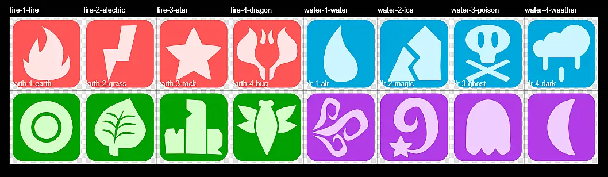
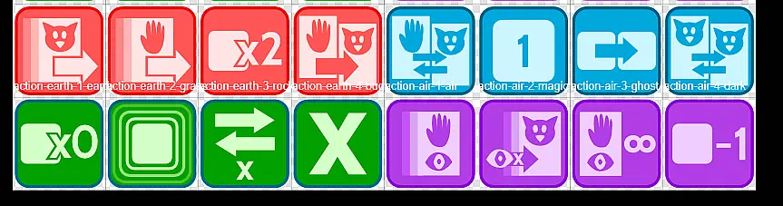
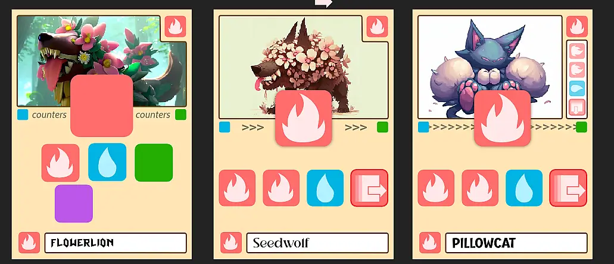
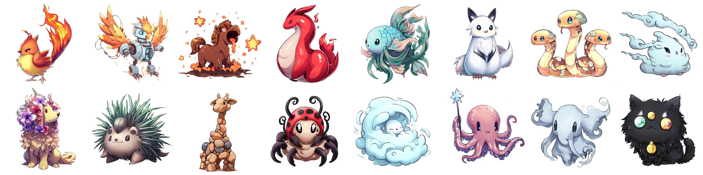
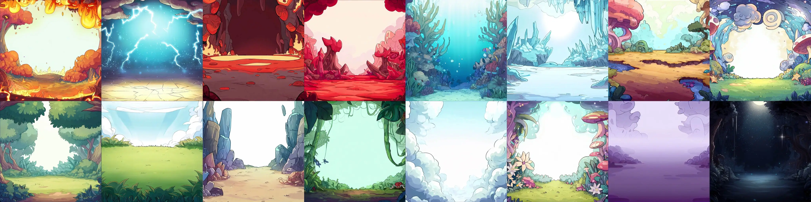
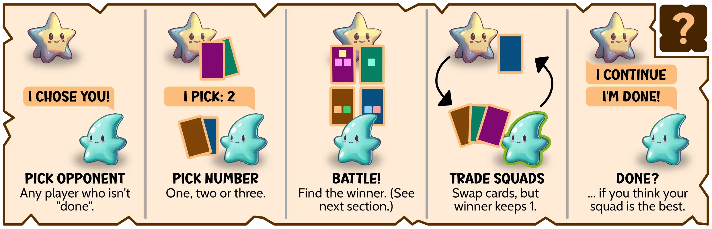
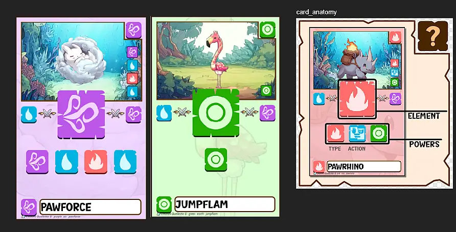

Welcome to the devlog for my game [Creature Quellector](https://pandaqi.com/waitless-games/play/creature-quellector/). In this devlog, I'll briefly describe the process, problems I faced, how I solved them, why I made certain decisions, yada yada.

And yes, I say "briefly". This devlog is nearly 6,000 words, but that's quite short for any development, and especially for one with as many bumps and sidetracks as this one.

Let's get the story rolling!

## What's the idea?

I'm on a search for "queueing games" or "waiting games". Games so simple, low on requirements and space, that you could play them to pass the time in a waiting room or queue.

Card games are ideal for this. You merely have to keep a small deck of cards with you. You don't need a table: players can keep the cards in their hand. 

However ... there's the problem of _the discard / draw pile_. Most card games feature either drawing cards during the game, or discarding them (very often).

I needed an idea that didn't need either of those things.

I came up with a few "Quellector" ( = obviously a pun on Collector) games. You don't play or draw cards. You _collect_ them, always keeping them in your hand. And the best hand, when the game ends, is the winner.

The goal of such a game is always to _improve_ your starting hand over time.

Initially, I had two ideas.

* One where the cards were creatures (like Pokémon). You'd battle, perhaps lose some creatures to the opponent (or capture them), and try to create the strongest squad.
* One where the cards where buildings / parts of a town. You'd try to improve the value or efficiency of that town in your hand.

This game is obviously the _first_ of those ideas.

## First try

### The general idea

I quickly grabbed a paper, cut it into small cards, and drew _type_ icons on them.

Each card could have 1-4 types. Often they were all the same, but they could appear in any (random) combination.

I decided on 5 possible types.

* Fire
* Water
* Grass (or nature)
* Earth (or stone)
* Air (or wind, or flying)

The typical "elements". 

Each had a **weakness**. They were in a circle: Fire < Water < Earth < Air < Grass < Fire.

Below was my first idea.

* Pick an opponent and a number 1--3.
* Both need to choose that many cards from your hand ( = your "Squad") and reveal them
* Check who wins (see below)
* You _trade_ squads. The winner, however, gets to keep one card back. 

A typical problem with these games is that strong people (with a lucky starting hand or first turn) just get _stronger and stronger_. The winner is already determined right from the start. And they'll play their strongest squad, each time, in a fight.

By _always_ swapping squads, I sought to remedy this. You still want to _win_ the fight---as you basically steal a card from the opponent---but need to take into account you'll lose the other cards. It becomes more fluid and strategical.

How do you count who wins?

* Sum all the icons across the whole squad.
* However, if the opponent has more icons of the _Counter_ to a type, that type is now worthless.

{}
You have 5 Fire. The opponent plays 6 water. Their squad is worth 6, yours is worth 0.
{}

To calculate your score at the end of the game, you simply check the Counters against _yourself_. (As such, during the game, you want to get rid of hand cards countering your other cards.)

That's the whole game, and, as always, I was hopeful and thought it would work.

### Why it did not work

Counting your score was just _too hard_. You had to count each type separately, _remember_ its total, and then work out which of them actually scored you points. It was overwhelming. It felt like homework.

When I lowered the elements to 4, it was easier to count, but also easier to start a game with a _great_ hand with no issues. Thus making the game itself pointless. (Lowering it to 3 broke everything.)

Additionally, I didn't _want_ to limit the types so severely. Because, if this game works, it'd be very _nice_ to create expansions or extra cards with new types along the way. (Like how Pokémon added more types and abilities over time, slotting them in.)

So we have a game that ...

* Has a simple core that actually _does_ work as intended. (You need to choose your battles wisely and can manipulate that.)
* But is over way too quickly
* Feels like homework to even think about
* And is generally overwhelming and not that fun.

## Second try

How do we make it easier? By changing the one rule that's the issue: the types and Countering them.

Instead of giving each card a mix of 1-4 icons, let's give each card two things.

* A _main type_. Clearly displayed, big, the whole card matches its color. Underneath it is a reminder of the type it _counters_. (For example, a Water creature would have a reminder that it counters Fire.)
* A set of _icons_ below. These will mostly match the main type, but _can_ have other types.

The new rule becomes

> All types that the opponent Counters, are worth nothing

Much simpler. It's all-or-nothing. It's _very unlikely_ that you get a starting hand where no type is countered away. You don't need to count, and recount, and remember all sorts of numbers.

Additionally, I wanted to add special actions to the cards. But this should be a very accessible "queueing" game, so _no text_! Instead, action icons are just another "type" that can appear.

Fights are a three-step plan.

* The player with the most action icons, picks one of those to execute.
* Any types countered are worth nothing
* Sum whatever type icons remain; each is worth +1

Testing this, the results are positive. It's now much easier/faster to see ...

* The "score" of your hand
* The result of a fight
* Things you might want to do

I did decide to decrease the hand size to **5 cards**. When you win a big fight, you might get a lot of cards. Anything above 7 or 8 cards is still overwhelming to calculate. (Although this is, again, hard to gauge playing against myself. Because I have to switch between 3 or 4 players, instead of being able to just look at my own hand and nothing else.)

And maybe, for a first game, the number of different types can be decreased to just **4 types**.

Lastly, if somebody is _out of cards_, the game also ends immediately. This can certainly happen, and I don't want one player to just ... sit and watch while the others keep battling for 15 more minutes (with a hand _filled_ with cards). It also adds a strategic element: you can bet your whole hand, because instantly finishing the game might surprise the others and lead to more points for you.

## Working towards a prototype

### Fixing types

I wanted to finalize the list of different types (and their general meaning/color/icon).

Then I realized: with these simplified rules, the different types _don't matter_. There can only be 4 or 5 types in a game. Any more, and the probability of countering each other (or your own hand) is just too low.

So what would be the point of adding more types? Would it just be for nice colors and variation in the design? That feels a bit flimsy to me.

Additionally, I can't just add another type to the "counter cycle". Let's say Fire < Water, but the expansion adds Fire < Ice. Now Fire suddenly has two weaknesses, which is unbalanced. But if I say Fire < Ice < Water, then all cards with water need to change because its _counter_ changed.

As such, I can't break the game into "modules" (to download/use/print separately) this way.

How to change that?

After considering many options, I decided that the idea of completely separate modules (that you could mix-and-match in any way after the fact) just wouldn't work for this game. Instead, if you wanted different cards, you'd have to reprint all material. That's just the logical consequence of having such a tightly knit game where each type must counter exactly one other type, in a cycle.

{}
Other options were, for example, to include _multiple_ counters per type. And to do that right from the start. Even if you selected only the basic elements (Fire, Water, Ground, Air), it would already add Counter icons for types in the expansion. If you were to add that expansion later, things would work fine. But ... that's visual noise doing _nothing_ for people playing the game for the first time.
{}

As such, the website should simply have 4 dropdown lists. Use those to pick _your_ 4 elements. It will generate a PDF using only that!

Moreover, the _action_ icons also have their own type. (Though they clearly signal they are an action by using a different icon.) Why? So that each type can have its own icon. A "fire action" always does X, a "water action" always does Y.

This is by far the easiest to explain and remember (for players). Once you've chosen the elements you like best, you get a PDF with just that and no other (visual or rules) noise. Once you've played a game with it, you know exactly what the Counters are and what the Action of each element is.

### Finalizing actions

So, what are good actions? With the new system, we only get _four_ different actions, whatever material you print. They need to be powerful, but also fitting for their element.

* FIRE/RED: Aggressive actions, mostly about stealing or removing a card.
* WATER/BLUE: Fluid actions, mostly about changing or swapping.
* GRASS/GREEN: Defensive actions, mostly about preventing bad stuff or controlling damage
* AIR/PURPLE: Surprise actions, mostly about randomness, variation, and risk.

I won't give the entire list, also because it will probably change as development continues. But the list above gives the general idea per type. Because each game will have all 4 types (exactly), I can be pretty sure it's balanced. There are just as many defensive actions (green) as offensive ones (red). (As long as I track this with my algorithm, when generating the material, of course.)

### Designing the types

As stated, I picked the 4 colors RED, BLUE, GREEN and PURPLE. They're simply at (roughly) equal distances to each other on the color wheel. This means maximum contrast/separation between all types, at all times.

Each color has 4 types. (For example, Fire has Fire, Lightning, Star, Dragon.) Each has a different, simple icon. For two of them, I was _heavily_ inspired by the Pokémon icon for the type, because I just couldn't figure it out myself. The others were done by me without reference, because, as I said, I want to move away from feeling like "you just copied Pokémon".

Additionally, each type has its own **action**. This also requires its own, simple icon.

I decided to first invent a few "shorthands" for the actions. For example, there's one action where you steal from another player's _hand_, but another where you steal from their _squad_. This is a subtle difference you want to put into the icon itself. (Instead of just using a generic card for both to indicate a "steal" action.)

* Hand = a card with a hand symbol
* Squad = a card with a creature symbol (a pretty generic face with pointy ears)
* Steal = one arrow
* Swap = two arrows (going opposite ways)
* Type = a rounded rectangle (which is also used around all type icons)

With those shorthands, most icons were very basic and straightforward (as they _should be_!) I also decided to add a slight border around them, to indicate they are the _action_ icons. A small thing, and it might change, but I think it really helps players quickly distinguish the symbols.

### Designing the cards

At first, I wanted to color the whole _card_ (according to the main type of the creature). After trying for a while, I had to give up on that idea.

Why? 

* Because the card can have _any_ other type icon as well, I'd need colors that look good on _all_ the other colors. You just can't get that with 4 completely different colors.
* The worst one was actually the type _itself_. If I want to add a _red_ icon to an already _red_ card ... I need two different shades of red, _or_ I have to add a thick outline/shadow/separation around all icons.

The simplest way to make everything simple, but clear and easily legible ... was just to make all card backgrounds white. Or, rather, a slightly off-white color to make it look a bit more warm and professional.

With that, I don't need any extra work to make all the colors look _clean_.

As expected, the drawing of the creature will go at the top. However, as the drawing has absolutely no value besides _looking good_, I don't want it to take up too much space.

The main type goes in the center, big and clear. With cards, though, you also want the most important information in the corners. (So it's easier to read when you have a hand full of cards and can't see the _full_ card all the time.)

I also added the main type in the top right and the bottom left. This interfered with my area reserved for the drawing ... so I just cut a hole out of that area.

Now I had no space to add the creature's **name** Normally, it goes above or below the creature drawing. I thought: why not put it at the bottom? It adds nice symmetry with the drawing at the top, so yeah, I did that. 

{}
Again, no value for gameplay, so this will just be a nice small addition. I do consider writing a simple piece of code to generate _random names_, though. This would allow the creatures to be slightly more unique and easier to remember when in your hand.
{}

I looked at my prototype and realized it's highly unlikely that a card has more than 4 type icons. So I fixed the icon size on something that allows _four_ icons next to each other on the card. (Placing them in two rows just looks worse, to my eyes.) The resulting size is nice and large.

Finally, I had two issues.

* That main icon cuts quite a bit into the drawing. It feels like a shame to hide a part of the drawing like that, but I see no way around it.
* Where/how do we display what this type **counters**?

Initially, I wanted to display the Counter type underneath the big bold type icon. But ...

* This leaves empty space at the sides that feels unbalanced
* We don't really have space for this: the type icons, the meat of the card, should be below it

So I placed it at the side. Not only what _this_ card counters, but also which type counters _us_. It's a cycle, and now each card has an easy reminder about the order of that cycle. I think it's an improvement over the initial idea.

After all that work, we get cards like below. (I hadn't fully decided the layout, but that wasn't necessary. I could already write the code and continue work with this general template.)

{}
I chose a very minimal and quite modern design for this game. Partially to make it easier to play, as there'll be a lot of calculating + checking icons. But also because I already created a few card games just before this one, with more traditional or "antique" designs, and I didn't want to repeat myself.
{}

### Coding the material generator

This is mostly just _boooooring_ :p I have to code stuff to be in the right place, load the right assets, put it all in a PDF.

The only interesting bit is how it decides to pick types and type icons.

* Every deck has equally many cards of each _main_ type, and equally many action icons.
* The first type icon of such a card is _always_ the same as the main type.
* Additionally, the action icons are distributed "beforehand". (To ensure they all get placed and it's fair.)

Once that is done, cards are free to "fill up" however they want. Although it follows some restrictions:

* The algorithm tracks how often each type icon has been used
* It favors picking types that have been used the _least_, of course. (To always balance the scales.)
* When it picks a type, it also picks how often it wants to place it (1-3 times). Why?
  *  Otherwise, we get many cards that just have ... one of each type (or something close). Cards aren't unique enough and are just random noise.
  *  At the same time, this purposely _unbalances_ the scales, adding more variation.
  *  (Once placed, it cannot pick that type again for the same card.)

It's a rather standard way to ensure types and actions are distributed fairly across the whole deck.

The downside is that I can't ensure this balance if you print multiple different decks, and then start to mix them. To ensure that, I'd have to balance the numbers _within_ each type. Doing that, however, makes the game too uniform and safe, so I don't want that.

I wanted to show an image here to break up the text, but, well, so far this is all just code and numbers. And a screenshot of a bunch of numbers that tell me "hey the types are properly distributed!" isn't that interesting.

But don't worry, the visuals will come soon!

### Maybe not so boring after all

**Update!** I took a break for a while (finishing other projects), and when I returned, I was in the middle of a big upgrade to the code behind my website. This prompted the thought: "Man, I should really write a proper layout/graphics system for all this game material I'm generating" 

It became clear to me that I was spending a lot of time---creating huge projects that I want to last---while coding parts of that on _quicksand_. Yes, my code was rather clean and fast, but it was still a mess of interconnected systems that wasn't ideal. 

With every game, I'd need to go in there and tweak some functionality, afraid it would break all the other board games that came before! 

I was placing all these elements (images, text, shapes) _manually_, by setting the position and size every time I made that draw call.

Surely, there was a better and faster way :p

I spent more than a week creating my own "Layout" system. Now, each design is a tree of containers (similar to an HTML web page), which can say stuff like "I want to be _centered_ inside my parent!" and "My children need to form a _grid_!" (Somewhat similar to the properties you have in CSS, the language for designing the _layout_ for web pages.)

To place things on the card, I merely create the right containers, then set the right properties to align/resize/anchor/etcetera them properly. Much faster, much more robust, much cleaner code. When I went back to update all the old games, I could often replace _hundreds_ of lines of code with just twenty lines of those Containers.

Anyway, this completely messed up my planning and made this project take much langer than I anticipated. Hopefully this improved design keeps paying off on all board game projects the next ten years.

_Why didn't you just build your material in HTML/CSS and use an existing JS library to take an image of that?_

I could have. It might have been the better choice. (For example, there's [html2canvas](https://github.com/niklasvh/html2canvas) that is serving millions of people quite well.)

I, however, don't want to take on any dependencies. These have bitten me in the past, time and time again, and bloat the size of the website. I want to keep it extremely small and efficient, partially because that's just the best thing to do, partially because my old broken laptop really can't handle more.

Additionally, 

* HTML/CSS is very much based around text. In all my games so far, text has been a rarity, as those designs are mostly about shapes and images.
* I need tighter control over certain things (resolution, exact card dimensions, freeform placement) that I can provide more easily this way.
* I can slot this in with my _other_ system (that uses Phaser) for generating boards. (So I could generate a board with Phaser, but use my own Layout system to design a certain part of it more easily.)
* I liked the challenge and learnt a lot from it.

That said, this was a _very_ tough challenge that derailed me for a while, and maybe it was the wrong choice. Who knows. At least I have a working Layout system now that is making me more productive.

## Creating the creature drawings

Hmm, I thought I already wrote a loooong bit here about my research and trials. Apparently I merely did that in my head, or I lost it somewhere. 

{}
I have the annoying tendency to accidentally write parts of my devlog/diary with _another_ project I'm currently working on. And such a file can hardly be traced to its origin a month later.
{}

Anyway, this was another learning process.

* I wanted creatures in the style of Pokémon ... but not steal/copy/overdo Pokémon.
* I wanted creatures that looked natural and cute ... but also related to their element and action
* I wanted creatures within a nice environment ... without showing too much/too little of either

I tried a few different styles.

* More cartoony => too simplistic and too stylistically diverse at the sane time
* (Flat) icons (like the element types I did) => well, they looked like _icons_, not full size card art
* Knitted/Plushy/Stuffed animals => looked AMAZING on some, absolutely terrible/unusable for most animals or creatures
* More painterly (watercolor, digital art) => again, sometimes this just REALLY works, and then often it doesn't

In the end, I settled on the following balance. 

* A prompt that _does_ say "in the style of Pokémon"
* But also adds other modifiers that highlight aspects of that (manga, hand-drawn, cute)
* The keyword "semi-detailed" seemed magic. (Just "detailed" created something too realistic, leaving it out created simplistic cartoon animals again.)

This created images that resembled Pokémon, but were never clearly inspired by one of them or stuck too rigidly to that.

### An important lesson

This wasn't enough, though. If I ask for a dolphin, I get a pretty standard dolphin. If I ask for a dragon---an actual Pokémon creature (type)---I get some morphing that is _clearly_ inspired by that actual Pokémon.

As I've (also) learned with previous projects, I need to be more specific and targeted with my initial ideas. I need to come up with something odd, something unique, something that turns the AI into fun directions.

For example, 

* Not "a dolphin creature", but "a dolphin with ten fins like a mane".
* Not a "dragon", but a "red dragon with a body shaped like a flame".
* Not a "grass animal", but a "porcupine with grass as its spikes".

With some luck, prompts like these instantly gave usable and unique results. The animals became _creatures_, more magical and fantasy without going overboard.

### The biggest lesson

Was that enough? No, then I learned the biggest lesson. 

For the "weather" type ... I didn't know what to do. A cloud creature seemed obvious, but that was better suited for the "air" type. A creature made from rain or snow yielded no usable results, while telling it to draw an animal _standing in the rain_ usually just meant half your image was covered in waterdrop icons.

Until I tried to blend two animals. I picked one water animal (a goldfish) and something related to weather (a bird) and told the AI to mix the two.

While this is no magic wand---it never is---this does force the AI to be creative and come up with interesting usable results. A goldfish-bird immediately looked like it _could_ be a Pokémon.

Below is an image of _one_ creature for each possible element. (There are multiple spritesheets like these so that even within one element there is variation.)

{}
Though, in the case of weather, I did experiment with drawing my own rain _on top_ of the image afterwards. It looked good, but seeing that it was the _only_ image with this extra treatment, it felt out of place and I removed it again.
{}

Even though I was already done with generating images, I decided to do another round a few days later. This new approach yielded much better results for certain elements. (Usually, I'm happy with about 50% of the results after an hour or two. The other 50% is "usable", but I write down which ones I'd like to improve by hand if possible.)

### Separating background from foreground

See, I'm still sure I _did_ write this section earlier, because now I completely forgot to mention a smart decision I took just _before_ generating the creatures!

I decided to separate background and foreground. The creatures are generated on a white background, then cut out and edited later (on their own). Then I generate empty background images.

In my material generator, it picks two of them (one belongs to the main type of the card, the other to a secondary type that's also present) and puts them on top of each other.

This meant that a beautiful creature couldn't be ruined by a bad background in the image (or vice versa). It meant more control over both of them and how prominent they are. It also meant more creativity and personal input into the process, preventing the feeling of "being lazy and letting AI do all the work".

Below is a separate spritesheet with one _background_ for each type. Because, again, there are multiple of these so that backgrounds stay diverse as well.

### About rules images

On a side note, I've learned that adding some sort of _frame_ around images in my interactive rules is basically what you _always_ want. I've done this for each of my past few games, and it just always makes the rules look cleaner and the separation of image/text more easily distinguishable.

(In Kangaruse, there's a wooden frame around everything. In this game, there's a rectangle with parts "cut out". That's what I mean with framing.)

This is especially true for digital rules / web pages, where text can reflow in ways you didn't predict, or I might change the background color of a section on a whim and forget that the rules image becomes less readable ;)

With every project, you learn a little more.

Expect all my rules from now on to find _some_ visual decoration to frame rules images and clearly set them apart.

## A major change

As I made my rulebook images and interactive example, something nagged at me. Something I probably saw a long time ago, but I dismissed it. I was so focused on making a game inspired by the idea of "Pokémon types" and how they "countered each other", that I clung to that rule, even when the whole game around it changed.

The current rules are:

* Check the main types of your opponent (the big icon in the middle)
* Now check the type that they _counter_. (Always the same, displayed to the right of it.)
* All icons of that type are worth nothing for you in this fight.

This isn't terrible. It's short and fast. See, I just explained it with three bullet points!

But ... it's still one step too many.

Why the extra step? Why "check the main type ... and _then_ check what they _counter_"?

That's a second step with no purpose. Water always counters fire, for example. So all these rules do is add an extra, unnecessary, always-the-same step when calculating your battle results. It makes the rules very indirect, whereas they could be much sharper.

Namely, by simply _removing_ this whole counter system. I know, I know, the whole idea started with _that_ and it has been the core of the game _since the beginning_. That's probably why I subconsciously ignored the nagging voice about this inefficiency. (Though I also kept the system of counters, partially, because I thought I might be able to do something more with it.)

We can take that rule away and nothing changes. See,

* Check the main types of your opponent.
* All icons of that type are worth nothing for you in this fight.

Tada! Even simpler rules, even simpler explanation, everything still works.

I normally don't make such a huge change this late in the process. I already have the code, the example images, everything tightly integrated with the current idea.

But it just feels stupid to release the game with that, knowing one entire _chunk_ of the rules could be removed (simplifying the game) without affecting anything. (Well, some special actions need a minor tweak as they talk about those "counters", but that's it.)

After a long sigh, I moved all the current work to a _backup_ folder (ya never know), so I could rip out the counter system from the game in the definitive version.

{}
If this change ends up being a mistake, I can just revert to the old version/backup in five seconds, no harm done.
{}

The rules text didn't become much shorter: just two lines and a few shorter sentences. The images/example, however, which are both quite crucial to explaining the game, became much simpler.

I also made a mess with naming. There are three different things in this game, and I called them "main type", "type (icon)" and "action type (icon)". Yeah, not great, the new rules highlighted that even more.

Now ...

* The "main type" of each creature is called its **element**. (I already called the four elements, well, _elements_ in all other places.)
* The other icons are called its **powers**, and are either a _type_ or an _action_.
* So the core rule of the game becomes: "All your types that match an element of the opponent are worth nothing"

Much clearer. Saves a few words as well!

I am a _little_ sad about losing the whole counter system and the UI part I made for that. But this change really does seem like an obvious way to simplify and streamline the game, without _really_ losing anything.

{}
I made the change in 5 minutes by just ripping out some parts and turning a few bits of code into a comment. That really shows how the whole counter system was just needless indirection on top of the rest.
{}

I forgot to take a screenshot/save a PDF of the old versions. So here's a screenshot of the _old_ versions of the card, next to the _new_ version of the rulebook image explaining what each element of a card means. 

Sorry, it's the best I have! It's also the first screenshot of the actual (near) finished cards, I realize now. If you want to see the full set of cards, you can obviously just go to my website and get yourself a PDF!

## Playtesting & Conclusion

We finally have our cards, balanced and polished, so I can start playtesting the game with people _other_ than myself.

Unfortunately, I wasn't able to test the game as much as one should. As always happens with me, projects that see too many obstacles (and take too long) really take a toll on me and I've taught myself to just "finish it and move on" at some point. 

I was so _done_ with working on this game that I finished it, did one playtesting night to see if there were no major mistakes, and that was that. Taking on the extra task of "create a whole layout library" while in the middle of this project was a _bad idea_. 

Lessons learned. Not doing that again. Finish a project first, _then_ consider major rewrites or code architecture challenges.

Anyway, the game worked when I tested it against myself, it also worked when played with others. It's a really, really fast game. It's over once people have seen most of the cards that are in this particular game (and can thus make an educated guess whether their hand is the best one or not). There's a good amount of luck, but also a good amount of strategy. 

You can certainly do smart moves by picking _who_ you want to battle and _which cards_ you want to use. 

Starting with a "better hand" (lucky hand) isn't a big deal, because you don't _know_ if it's good (as you don't know the other cards yet), and you have to fight at least once before you can say you're done. (And then again, a game is over after 5 to 10 minutes.)

The rules---especially after removing the Counter system---are really simple and quick to teach.

The fact that no cards are ever drawn/removed enhances strategy while keeping the game small and light. The fact that all play happens by battling other players creates super high interactivity---which, if you know my games, is something I always aim for.

I only made these small changes/clarifications after testing. All of them relate to the _actions_ and how they're handled. (As I expected, they're the lifeblood of the game that need finetuning.)

* When you have the most action icons, you _must_ execute one of the actions. (It's not optional.) In practice, this was simply more fun and more interesting. It means you can actually hinder yourself if you're not smart about your action icons. It means something always happens, instead of players deliberating for 30 seconds then ... doing nothing.
* Similarly, if there's a tie, the defender wins. It's consistent with the overall fighting rules, and it, again, ensures at least _one_ action happens.
* When calculating your final score, action icons used to count as +1 (always). In practice, though, it's more consistent and easy to understand if they can be countered as well (just like regular types). 
* Most of the actions were designed with the idea that you want to win fights more often than lose them. However, in practice, it's more 50/50. As such, some of the actions were changed to also allow the other side. (For example, an action that allowed adding a card to the squad, now also allows removing one.)

**My only major gripe** is that the game can be a bit random, as from the start you have no idea what other players have in their hand or what they'll put into a battle. (As a consequence of that, "winning" a battle is perhaps discouraged _too much_ at times. Because if you have 6+ cards, it's highly likely that you have all elements and thus are left with 0 points.)

This isn't a real issue in the sense that you can _theoretically_ learn the other player's hands (after a few turns): each battle has players publicly showing cards, then trading them, so you _know_ they have those cards. In practice, however, this requires serious memorization skills that most won't have (or don't care to apply).

The _purple_ actions somewhat combat this, as they're about revealing and giving information. I searched for some simple rule change or tweak that might help more. Eventually, _one_ extra scoring rule did most of the trick.

> Your actions are _not_ countered if you have the most out of all players.

This means you can have a lot of cards (with all elements) and _still_ score reasonably, as long as you've consciously upped your number of actions. It's a blend between the original rule (actions can't be countered) and the new one (actions are just types when scoring) that mitigates this issue.

So yeah, the game is pretty good, especially for what it's supposed to be (a quick, light filler game you might even play while waiting in line). But I'm not going to lie and pretend I tested this more than that, and I think there's a _better_ version of this game somewhere (both gameplay and graphics). That always happens though. You made something, so you learned how to do it better next time.

I am done with this game! It became something that took 10x more time than it should've, and I'm ready to move on. As soon as you start to hate every aspect of your current project and just _can't_ make yourself work on it, that's when you know you should just finish it and move on.

As such, you might also have guessed that I'm writing this devlog at 12 AM as the _last task_ from the to-do list before the game is officially done. And I am tired, so I'm stopping here! 

(This might all sound a bit negative, but I want to remind you that this is a completely honest and transparent _devlog_ about the journey of developing such projects. Making games is hard. Not everything works out, or feels good, or stays fun forever.)

Until the next devlog,

Pandaqi