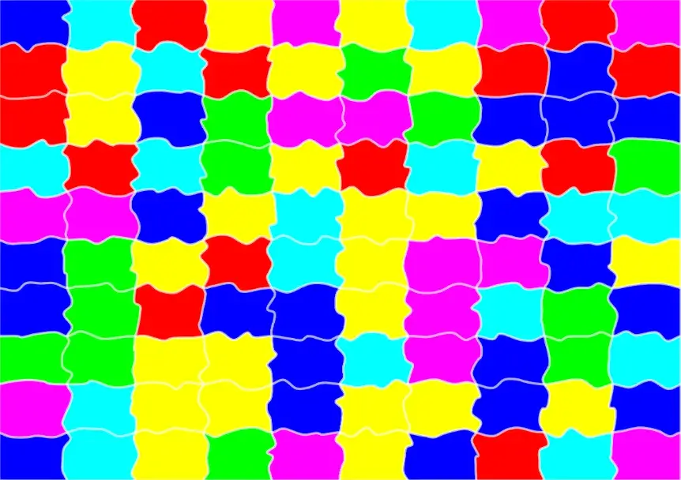
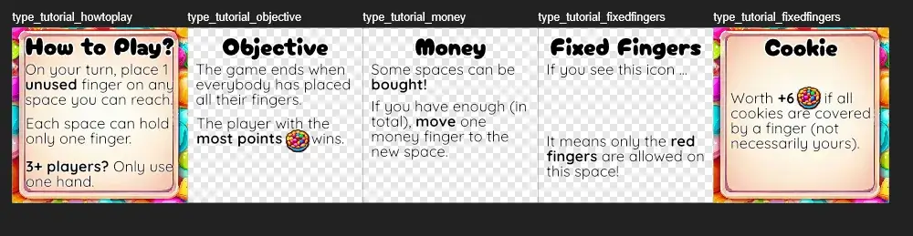
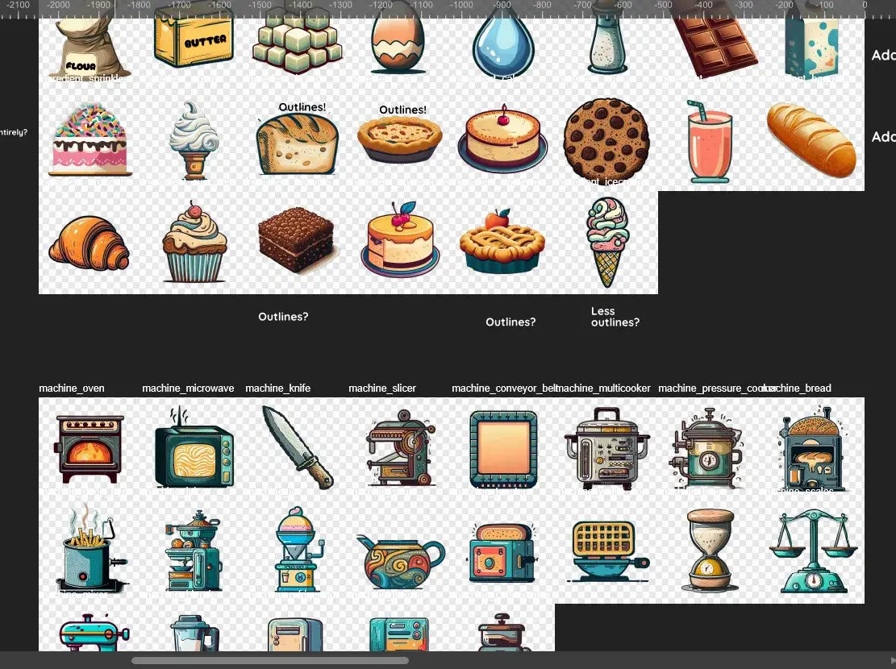
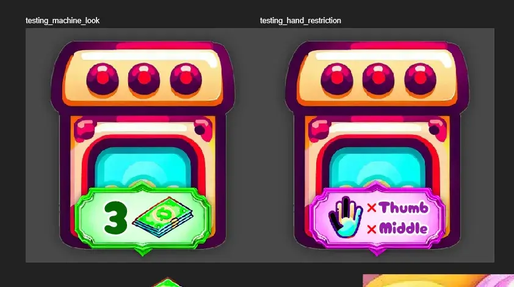
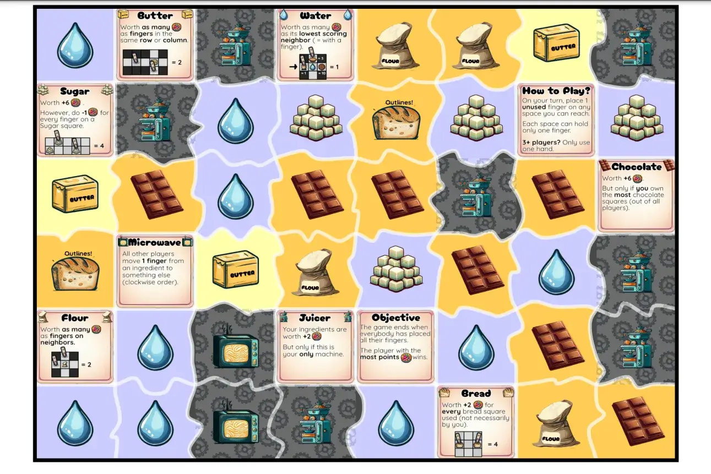
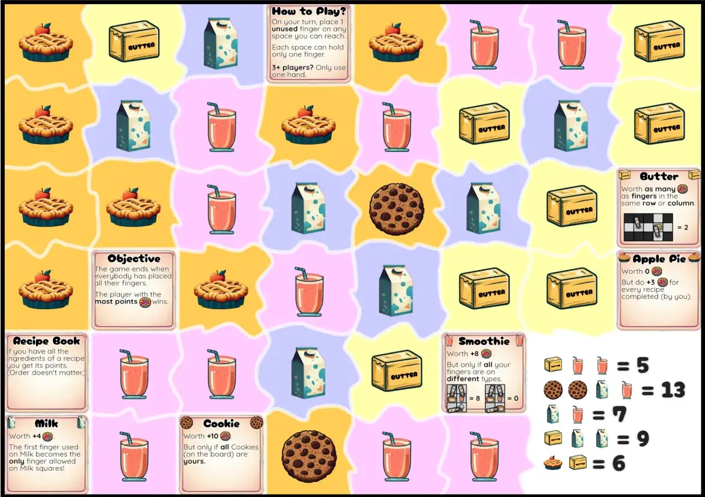
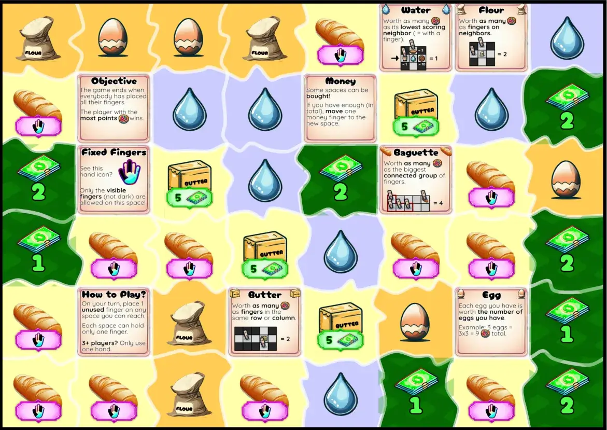

Welcome to the devlog for my game [Finger Food](https://pandaqi.com/waitless-games/play/finger-food/). I'll (briefly) explain the design process for the game. Where did the idea come from? How did I develop it? What interesting problems did I have to solve?

## What's the idea?

Some time ago, I made the game [Foldigami](https://pandaqi.com/waitless-games/play/foldigami/). In the devlog for that game, I narrate this process in more detail, but here's the gist.

I wanted to make a _true_ One Paper Game. One that didn't even require a pen(cil), or reading a separate sheet of rules, or _anything_.

My first try, Foldigami, did this through _folding_. Every move, you folded the paper in some way or another.

While making that, however, I realized a much _simpler_ implementation of this idea: **playing a game with your fingers**. (Which ... sounds weird when you phrase it like that, so let's quickly continue.)

All you need to do is ...

* Grab a paper
* On your turn, place a finger from your chosen hand onto a square on the board.
* _Somehow_ this scores points, or does something interesting, and allows you to play a game

For the longest time, the working title was "Finger Twister". While it conveyed the general sense (it's like playing twister with your fingers, on a board the size of a paper), it otherwise steered people entirely the wrong way with their expectations.

Then the working title became Hand Pies. I might still accidentally call the game that in certain places.

But in the end, after asking others and taking a vote on it, the name "Finger Food" was chosen. It's simply the ideal pun---a game about food, and a game about placing fingers to get it, and the term itself even means something---and it "flows" or pronounces more easily than something like Hand Pies.

{}
This project was called "Finger Pies" for a single day, until I learned the actual slang meaning of that ...
{}

## How do we implement this?

My first idea was the obvious one: place your finger on a square to get the points on it.

However ... now your finger is _on_ the square. Which means you can't _see_ the points. It will be very annoying to play a game where you constantly have to ask everyone: "could you raise your left finger, please, I forgot how much that scores"

We can solve this in two ways.

* Somehow the fact that points are _secret_ (and you have to memorize the moves) is important
* Scoring happens in an entirely different way. (Adjacent squares, score is only counted at the _end_, etcetera.)

I don't really like the first one. (A game that merely tests memory, isn't an interesting game in my eyes.)

Additionally, we can structure this game differently than Foldigami. In that game, you have to score _more points_ than your opponent at the end of your turn---otherwise you lose. That's the objective, that determines the end of the game.

With a game like this, a different (and simpler) objective is available: when you run out of fingers :p

The game simply continues until both players have played all 10 fingers. (On higher player counts, players play with only _one_ hand. Five fingers, hopefully.)

This means that we, indeed, do _not_ need to count score during the game. We only need to count it at the end.

As such, the rules should probably revolve around "synergies". From the start, I really wanted to give this game a "food" theme. Which means it will be about creating **recipes**.

> The ingredients your fingers are on (at the end of the game), are your points. Some ingredients work well with others. Some do not. Some need multiple steps.

Fingers have the second benefit of being **movable**. In a regular One Paper Game, once you make a mark on the paper (with a pen), it's permanent. But in this game, you can place your finger ... then move it afterwards. Maybe other players can even _force_ you to move! That should be the second mechanic in the game.

> Squares that allow you to move your fingers, or force the opponent to move them (in a certain way)

## A more fleshed-out idea

The paper represents a bakery, maybe a sweet bakery (making pies and brownies and stuff). It's a grid of squares, as usual. Ingredients, perhaps machines or customers with special actions.

* The game ends when all fingers have been used. Count score, highest wins.
* One finger per square _and_ fingers can't be adjacent.
* The game is explained on the paper: there are a few larger squares that explain the rules + what each special square does. (You can't put your finger on those?)

_Why can't fingers be adjacent?_ It just seems like a nice rule. It makes the game more strategic (you pick a square not because of the points, but because it disallows its neighbors for your opponent). It keeps the board clear and easier to see.

Also, to make the paper playable for several player counts, we need to add more squares ( = a higher grid resolution). Forcing fingers to stay apart ensures you won't spend 10 minutes finding "_the_ perfect square out of 40 options" when playing with 2 players.

In general, there are two types of squares.

* **Ingredients**: these score points when used in certain conditions.
* **Machines**: they are an immediate action to take.

Squares allow _moving_ fingers (or _adding more_), but never _removing_. (This would cause a loop that might mean the game never ends. Add a finger, remove it, add it again, remove it, ...)

{}
Well, I could add one special square that does this. But it'd need an extra rule: "once placed, the finger from this square may never move or be removed" Even so, this should be a very _rare_ square.
{}

### Ingredients

**Idea 1**: a recipe book. A square with randomly generated recipes that tells you exactly how much each one scores.

I prefer this approach over any other.

* Randomizing point values per ingredient is just annoying.
* Printing point values _on_ the ingredients---which you just covered with your finger---is also annoying, as stated at the start.
* It adds that synergy, that idea of "you score points by using all your fingers well, not just each one individually". Once somebody claims a "pie", they don't just get a fixed score and that's it. They can still go a number of ways, fulfill a number of recipes, before the game ends.

**Idea 2**: conditional ingredients. For example, 

* This one scores 1 point _per ingredient you have_. 
* This one scores 5 points _only if_ you have at least 5 ingredients.
* This one scores 10 points _only if_ you have _all_ instances of this ingredient. (And it'd appear, like, 4 times in total.)

As always, don't know which one is more fun. They're probably both fun in their own ways, so let's implement both and see what we keep.

### Machines

As stated, these would be special actions. (Themed like machines/items from a bakery.)

* Move one of your fingers.
* Force another player to move one of their fingers.
* All fingers of yours currently on a machine, should move to an ingredient.
* Swap places: 1 finger of yours moves to the square of an opponent's finger, and vice versa.
* ...

And, as always, special squares that provide exceptions to the main rules.

* A square that can hold multiple fingers
* A square that _allows_ adjacent fingers
* ...

### Money

This might be a part of the base game, or it might be an expansion.

I realized that your fingers are like computer memory. By staying on a square, it "remembers" that state: you own that square, however you came to own it.

What does that mean? That you can slowly _build_ something while playing, like ... money, capital, or power.

For example,

* You put your finger on a "5 money"
* Next turn, this allows you to place your finger on a really powerful machine. (Which required "5+ money" or something.)
* You paid that money, so now remove your fingers from it
* You still own the machine!

The game becomes longer and more tactical. You don't get 10 moves (one for each finger), but maybe 20, as you slowly gain money, place your fingers on _bigger_ machines, free up a finger or two, repeat, ...

I think this would turn a very simple game into something with true replayability over many games.

{}
It does require toning down squares that allow you to just "swap fingers with an opponent". Because then you can just wait until they own a powerful machine, and then swoop in to take it from them for free. But that's a simple 5 lines of code in the algorithm.
{}

### Finger Restrictions

This is another idea that will probably be optional / an expansion.

> Add an icon to squares showing a hand with one (or multiple) fingers highlighted. You can _only_ place those fingers on that square.

Very simple. Should fit well. Restricts your moves, but in an interesting way that is easy to see ahead of time.

(Although certainly not _all_ squares should get that icon, as it would be overwhelming and _too_ restricting.)

## Creating the Board

### A wobbly-bobbly grid

After creating many games with a square or regular grid, I wanted to do something slightly different. A little something that makes the game look more organic, fun and diverse.

Under the hood ... it's still a square grid. That's simply the best option for this game and there's nothing wrong with that.

The only thing we change is how it's _displayed_.

A game about pies and candy feels like it should be colorful and playful. So what did I decide to do? Well, see for yourself.

The edges of the squares are moved around randomly to create "wobbly squares". But it's not in a chaotic or uncontrolled way: they're still clearly squares of roughly the same size.

How did I do this? 

> By not seeing the squares first, but focusing on the grid lines (horizontal and vertical) instead.

This is how the code works for _creating the lines_.

* It creates the grid lines (simple equidistant lines from top to bottom, left to right)
* Then it subdivides them (it's still a straight line, just filled with equidistant points). In my case, a resolution of 4 points per cell seemed fine.
* Then it randomly _moves_ all those points around.
* Then it _smooths_ the resulting lines. (Bezier interpolation, you can find the algorithm/formula for it online.) This creates organic curves instead of spiky mountains.

Now you have nice wobbly lines. But ... how do we create squares from that? Well, by realizing one "cell" is just the area between the lines.

Let's take the cell in the top-left corner (x = 0, y = 0).

* Its top edge is the first chunk (first 4 points) of horizontal line 0
* Its right edge is the first chunk of vertical line 1
* Its bottom edge is the first chunk of horizontal line 1 (but in reverse)
* Its left edge is the first chunk of vertical line 0 (but in reverse)

In other words, each cell simply extracts its own edges from the wobbly grid lines. I combine those 4 tiny lines into one list---which is now a polygon---and then simply draw/fill that.

This ensures that, no matter how wobbly it gets, the squares perfectly fill the board _and_ they never overlap or get in each other's way.

### Tutorial Squares

I did write an exception for tutorial squares. I need all the space I can get for the explanation, and I want to make them stand out anyway, so their edges are forced into **straight lines**. (Essentially creating 3--5 normal rectangles within the wobbly grid.)

Additionally, it doesn't look pretty to just paste the text on top of the square. It needs a nice background image or "container". (Just like I used _scrolls_ with Foldigami.)

This time, a _menu_ or _plate_ seemed suitable. At least one with lots of empty space in the center where I could place text ;)

I asked an image AI to generate a few of these, but it didn't really understand my needs. (It just created loads of candy with a tiny menu card in the center.) So I ended up drawing something simple myself. Just a rounded rectangle with slight texture and shadow to make it look better. The very colorful candy around it _does_ come from the AI, although it's barely visible in the final product.

After some experimentation, I realized I needed only _two_ tutorial squares.

* One to explain what you do on your turn (place an unused finger on an empty space)
* One to explain the objective (when the game ends + scoring)

I also realized they could just be regular size. (No need for a 2x1 or 2x2 area for the tutorials.) Even if you play with 4 players, that means only 4 * 5 = 20 fingers. I really don't need a grid so small that I get more than ~50 squares.

So, the final grid (at least for now) has 8 * 6 = 48 squares. This is enough for any player count or content, but still large enough to fit tutorial/explanation.

### Art style

Well, the theme is pretty clearly that of a bakery or candy land. It should be really colorful, cartoony, bright, playful.

So that's what I went for ... initially. 

As the project continued, I landed on two possible names "Hand Pies" and "Finger Food". Both types of food, however, are _not_ candy! The first one would be more bakery/cake related, the second one more about small party food.

Even though I love colorful and poppy art, it just didn't seem to fit. Because the icons I actually needed were things like "bread" or "milk", not "a lolly" and "bright candy wrappers". The images I generated (with AI) and the ones I drew myself all just felt ... off.

On top of that, some ideas for ingredients (like _butter_ or _flour_) are ... really hard to turn into recognizable icons. Yeah, I could do a flour bag, but you know what a bag can also contain? ANYTHING ELSE.

So I tried both.

* I created a handful of assets for the _pie_ theme.
* I created a handful of assets for the _finger food_ theme.
* Then I checked the resulting boards and decided which one I liked better.

The final images are a mixture between AI-generated (after a _lot_ of experimentation to find consistent prompts that I liked) and drawn myself.

{}
AI can't know the exact colors I want, or dimensions, or the style of the other icons. I try my best here to _not_ lean on the AI too much, but rather use it as a tool or starting point. In this game, especially the COLORS were a huge issue and caused me to do many parts manually.
{}

Below are the initial versions of these sprites.

You can see comments here and there about having to manually add thicker outlines, or change colors, or redraw something. Because I've already done many games with really cartoony or colorful designs, I wanted something a bit more vintage and subdued. Slightly more realistic or detailed, without going too dark.

You'll notice _most_ of the sprites are consistent in style and fit my vision. Some don't and are just "the best I could get", but need manual adjustments. I kept flip-flopping between these more subdued colors and a clearly more colorful/poppy approach, trying to find a middle ground.

I also reserved two colors: **green** and **black/gray**. The first should be for Money squares and the second for Machine squares. 

If I'd use those colors for ingredients as well---or use a different color for every money/machine square---it'd get confusing really quickly. Now, when you enable the expansions, you can immediately see

* "Hey, those green squares are all Money---needed to buy better machines"
* "Hey, those gray squares are all Machines---they activate some action when I pick them"

### Preventing clashes

With the limited space, I quickly learned that you don't want a square with _both_ a MONEY value and a FINGER RESTRICTION.

So, instead, let's ...

* Make both systems use the same space on the tile
* So a cell can only have _one_ of them, at most

Below were my first experiments with how to _display_ such a value.

I think this is a fine start. 

I'll need to figure out if I want the "finger restriction" to show ...

* The fingers that ARE allowed (by highlighting them)
* Or the fingers that are NOT allowed (by making them black or hiding them)

It depends on what works best for the game. Restrict 1 finger? Or only allow 1, restricting the use of the other 4? I'm leaning towards a much _tighter_ restriction (the second option), otherwise this addition feels pretty useless. 

(There are so many squares and so many ways to place fingers, would disallowing _one specific finger_ really do much?)

### Do we need a starting square?

This was one of the last remaining doubts. Do we add "default starting squares" to the board? 

The advantages are ...

* Gives an easy way to start your (first) game. "Place your finger here or here" is much more approachable than "place your finger ANYWHERE!"
* Might prevent discussions about who should start or long "think tank" moments about your first turn.

The disadvantage, however, are ...

* Takes up a lot of squares. (Because there need to be enough starting squares in case you go for the full player count of 6)
* Would need extra tutorial explanation, which I really don't want.
* You only have 5 fingers (with 3+ players), so losing one action to a square that does nothing isn't great.
* Simply moves the issue of "thinking too long about your best first move" to your second finger.

Well, the disadvantages clearly outweigh the advantages, so I decided against this entirely.

### How to balance money?

This is a tough issue. If there's too little money on the board, players can't actually buy stuff. If there's too much, it's too easy and the whole mechanic becomes worthless.

How do you solve this? I used the following approach.

First, we need to get sensible money values.

* The ingredients/machines have different power levels (set manually by me). The more powerful they are, the higher their level.
* Why? To set logical _money values_ for these squares. (A more powerful machine should cost more money.)
* At the start, it picks a certain percentage of all the types to be "purchasable", and prefers higher power ones when doing so.

Now we have squares on the board with a money value attached. To keep things simple, this price is the same for all squares of a type. (So an oven will always cost "3 money", instead of one oven costing "2 money" and another suddenly "4 money".)

This means we can _sum_ the total amount of money you could _spend_ the board.

The money _available_ (through money squares) should be some percentage of that. A good value seems to be around 50%. (Too high and there's so much money that buying stuff is no issue. Too low and only one player might be able to use money in a game.)

So now we have a target. Maybe the result is "we need 20 money in total".

The second step is now to _distribute_ this value over the number of money squares. We need to chop this value (20) into a list of discrete numbers (1 money + 3 money + 2 money + ... = 20).

For this, I use the bucket algorithm.

* Create a list of length X ( = a randomly chosen number of money squares), all initialized to 0.
* Keep a running sum, also initialized at 0.
* While the runningSum is less than our targetValue (20) ...
  * Pick a random bucket. (If it's full---the value is our max money allowed per square---keep picking.)
  * Add 1 to its number
  * Add 1 to runningSum.

Once done, this means we have a list of somewhat random discrete values (each "bucket"), which add up to our target value. 

Now we can just place all the money squares (following the values of this list of buckets), and we're certain that the money is well-balanced on the board.

This is all during **setup**. Here, I place one cell of each type (to make sure everything appears at least once), then calculate a good starting money value.

From that moment, though, it's allowed to draw freely. As such, whenever it picks a money square, I recalculate the current amount of money on the board.

* Way higher than our target? Add a money square with a high number.
* Close to our target? Add a money square with a low number.
* We're already at or above our target? Prevent randomly drawing a money square to place.

## Inventing all the options

For this, I did what I always do.

* Invent _as many different things_ as I possibly can. (Creating a list of almost 50 ideas for ingredients and machines.)
* Remove those that seem "meh" (too hard to explain, too many side-effects, not strong enough).
* Implement everything else.
* Then whittle down the list even further by seeing what works best _in practice_.

### What are "good" ideas?

My main goal was to have loads of interactivity. This shouldn't be a puzzle you solve for yourself. (Hmm, which five ingredients do I pick that yield the highest score?) Most rules should depend on what other players do or what the current board state is.

That's why I am still uncertain about my "recipe book" idea. If the game simply has 5 fixed recipes for a fixed number of points ... well then everyone will go for the highest scoring one, won't they? It's a boring puzzle game you play on your own. So a recipe book would never work on its own, though it _might_ work as an expansion.

Let's look at another example.

I might add a square that says "EGG: worth +4 points, but only if you also have MILK."

This seems great, until you consider the consequences. _Nobody_ would ever pick just EGG or MILK, because they're worthless on their own. Which means you have now already decided two of your precious actions (one finger on an EGG, one on MILK). Moreover, unless there's like _one_ MILK square on the board, others can't really stop you from doing that or interact with you.

It's a _fine_ idea, just far from great.

Instead, I want actions like this.

* "EGG: worth as many points as fingers in the same row or column"
* "MILK: each milk is worth as much as the number of milk squares you have" (1 = 1 point per milk, 2 = 2 points per milk, 3 = 3 points per milk)
* "CHOCOLATE: worth 8 points, but only if _all_ chocolates squares are used (not necessarily by you)"
* "BROWNIE: worth 8 points, but remove 2 points for every Machine a player used."

All such ingredients have interaction or a risk/reward. (If you don't play it smartly, you're left with almost 0 points. High risk, high reward.)

Thinking this way, I still ended up with a list of 40 types. 

### Just create them all

I can't predict the future nor run through test games inside my own head. At this point, I just need to ... implement _everything_ and see what happens.

Sure, that's a lot of work for 40 types, of which not all will be kept. But it's the only way, I've learned from experience. I just can't know what are the "best ideas" before they are implemented and tested. And wasting days just doubting and overthinking things ... is an even bigger waste.

{}
Though I do know that I have the tendency to add _too much stuff_ to my games. I mean, any other person with this idea and my skillset would probably just add 10 ingredients that seem fun and call it a day. I have to be insane and add expansions, try absolutely everything, experiment with the idea ad nauseum, etcetera ...
{}

### What boards look like at the moment

After inserting all ingredients + machines + tutorials for them, boards look like this. (I also added some polish things that I'll talk about later---I took this screenshot too late and didn't have something from this actual version.)

As you see, icons and spaces are actually quite _large_. This helps prevent the issue of not being able to see what is underneath your finger while playing ;)

Even so, tutorials are a bit cramped, but just readable. Wherever possible, I try to shorten their text and make things as large as I can.

## Recipe Books

These turned out rather simple to code (and a worthy addition!), or maybe I had a moment of clarity while implementing them.

When included,

* It reserves a 2x2 square in the bottom right of the board. (Those 4 cells are removed from generation and told they can't be anything else.)
* It picks a random number of recipes (3 to 5)
* Creates a fair distribution of lengths. (It just cycles through the numbers 2,3,4,5 until it has enough.)
* Then creates those recipes and draws them inside the 2x2 area.

To create recipes,

* It sorts all the types based on how often they occur on the board.
* Types earlier in that list have a higher probability. (In other words, it prefers building recipes from ingredients that appear _often_.)
* But types later in the list have a higher _value_ ( = worth more points)
* Once it has enough types, it sums their values for the final recipe score.

_Why prefer common elements? Isn't it more challenging if players need rare ingredients to complete a recipe?_ Yes. It also means that, if such an ingredient is already picked or blocked, it's literally _impossible_ to complete the recipe. It stops being an option to go for, and just becomes ... a game element to be ignored.

If recipes are built from rare ingredients, there's a high likelihood nobody can complete any of them, or a single move can stop somebody who is _clearly_ going for a certain recipe. It's just too likely that this whole part of the game is rendered useless.

It's more fun if you can pivot halfway (if one of your ingredients is in danger of being blocked), or keep your options open, or actually have to _choose_ which of the three recipes still possible you want.

At the same time, because rare elements are valued higher, it's still a (risky and challenging) thing you can go for.

While implementing this, I found a few minor improvements:

* Randomly, recipes are inverted. If you (accidentally) grab these recipes, you actually get NEGATIVE points.
* Before displaying, the recipe is sorted alphabetically, so that the same types are displayed next to each other. (Looks more neat. Otherwise you might get silly stuff like "CAKE + COOKIE + CAKE + COOKIE = 6 points")

## Fixed Fingers

In the end, I decided to make these FORBIDDEN. It made the explanation and visualization easier.

* When a cell has a hand icon ...
* ... any fingers that are darkened/blacked out are FORBIDDEN

To visualize this, I merely have to _overlay_ several images.

* A base image for the whole hand
* And one image for every finger that's forbidden => this is drawn from a spritesheet where frame 0 is the mask for the first finger, frame 1 is the mask for the second finger, etcetera.

I also decided to make these _the same per type_. If every could could have _any_ value for this, it soon looked messy and overwhelming. Instead, if one "water" cell forbids the thumb, then _all_ "water" cells forbid the thumb.

{}
As mentioned before, a square can only have _one_ type of extra data. They either cost money OR have forbidden fingers, never both. A simple approach that is advisable for basically any visual design project: restrict special icons or exceptions to only ONE OR THE OTHER, never multiple.
{}

Below is an example of this. (It also shows money being enabled, because I forgot to show that before, as it was one of the first things that was implemented.)

Also notice how things are already balanced at this stage. Butter and baguette are the _strongest_ cells in this game, so they get the restrictions. 

I manually set the power level of each cell in the data. This is often based on simple logic: for example, Butter scores for the whole row/column, while Flour only scores for neighbors. In other words, Flour is the _weaker_ child of Butter, hence the power difference.

The number of money cells is perhaps a bit high, though I need that to prevent a single money square being worth like "10 money". (I still tweaked it slightly after taking this screenshot :p)

## Polishing & Playtesting

At this stage, I basically spend a few hours checking things off a _long_ list of minor and major fixes.

* I added (sensible) colors behind all the icons
* Some special types had no rules yet, or vague rules that didn't make sense anymore.
* Money and Machine cells received a nice pattern (as well as their default color)
* I rewrote the code for randomly picking types, as the old one was a mess coded in the dumbest way possible (which led to infinite loops 10% of the time). Don't know what I was doing there, but it needed a rewrite.
* I removed the candy around the tutorial frame. (The game isn't themed around candy anymore, plus it was barely visible anyway.)
* I added explanation images to tutorial frames where I thought they might help. (Very simple types, like "+1 to all ingredients", don't receive one. It would just add more stimuli that will make players second-guess themselves.)
  * As you see in the last few images, some text/images from tutorials overlapped with the frame or wasn't properly centered. I leave stuff like that for the "polishing" stage---trying to perfect it while still figuring out the game just leads to a blockade and slow development. In the end, whether an explanation image is perfectly centered is waaaay less important than whether the game even works. 
* The illustrations weren't always consistent in style or color. I did what I could to bring them all in line, but this is something I'm still learning. (How to blend AI generated images and my own designs/fixes/ideas into one coherent style.)

With all that done, the boards were now both pretty and correct, and all the rules and mechanics solidified. This meant it was ready for "official" playtesting with others.

{}
As I've mentioned multiple times, there's only so much you can do while testing a game against yourself, or testing a game with ugly white paper and half the icons lacking. Other people only come aboard---and really give the game a chance---if it already looks mostly finished and polished. Without that, they'll either disregard the game immediately and not properly test it, or they'll shroud all their critique/feedback in "but the game isn't finished yet so it doesn't matter", which is also useless :p
{}

### Playtesting results

I wasn't able to do as much playtesting as I'd liked, but enough to verify the game ideas and find any potential issues.

The game ... works?

Sure, with 4+ players the space is cramped and there's a mess of fingers. _That's the point._ It's a quick, silly, party game that everybody immediately started calling "finger twister".

And yes, this makes counting score sometimes a bit difficult. It's useful to have one person take a photograph or write down the final board situation (with their other hand), to prevent accidentally removing your hands and forgetting the exact scoring.

None of this breaks the game or makes it less fun.

Extremely easy to teach and start playing. The first game, people will probably be annoyed at themselves for their "stupid thumb placement", and one player will one with a simple and obvious strategy. But players learn from that---the whole point of the first game is to learn the basics of the strategy and "smart moves"! 

And indeed, in subsequent games people actually place their fingers more smartly, and block another player going for their 5th Egg, or suddenly devalue their Sugar with their final move. There's a surprising strategic depth here, without making the game too complicated or "thinky". 

To most people, it's not "thinky" _at all_ :p It's just a fun ride of "get shiny food you like, block others, be blocked, twist your hand in an effort to score just a few more points, then hope you end up with the highest score".

After <5 minutes, you can grab another paper and play again.

That's perhaps the biggest thing that makes the game work. It's not necessarily about who has the biggest hands or blocking each other's moves. It's about who can read a new (randomly generated) board _the fastest_, so they know exactly which 5 ingredients will get them the most points this time.

It's a fast interactive puzzle that somehow manages to be physical and loose as well.

Not for everyone, but I quite like what I made and call it a success. In fact, I'm already pondering the possibility of other "finger-based" games ...

{}
For example, if the game is short enough, one could just use their finger as their _pawn_. No need for the usual One Paper Game approach of "cross out your old icon, write it somewhere new". Just use your finger as your pawn, and a different world of possibilities opens up for my One Paper Games.
{}

## Conclusion

A weird and experimental game. But it worked out and I think the boards are colorful, vibrant, easy to read, and near professional level.

Not bad for the first finger-based game. Still many ways to improve upon the idea.

As always, if you play the game and have any remarks (good or bad), let me know. As I regularly mention, I'm on my own and cannot playtest/stress test these games as much as I should. As I _also_ regularly mention, the benefit of these online-randomly-generated games is that they can _always_ be improved. 

I can come back two years later, tweak a few numbers, replace one image, and from now on the game is _better_. For everyone, for always.

As it stands, though, I don't see major flaws in this game and everyone has enjoyed the quick test games of Finger Food, despite the board / player count / ingredients used.

Until the next devlog,

Pandaqi