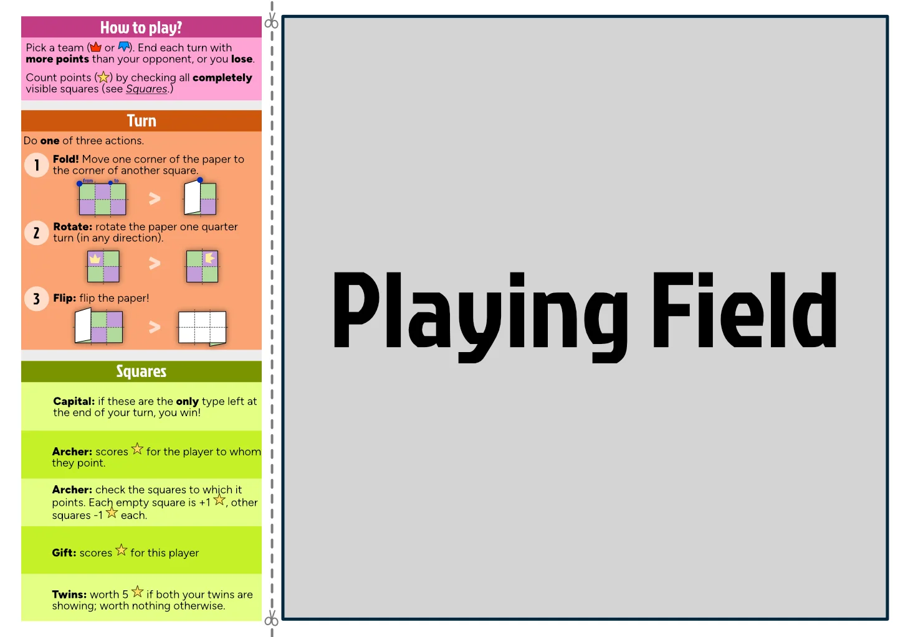
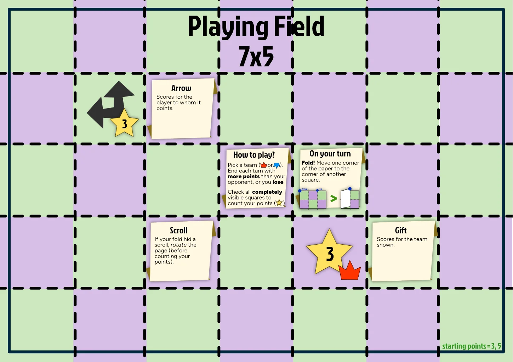
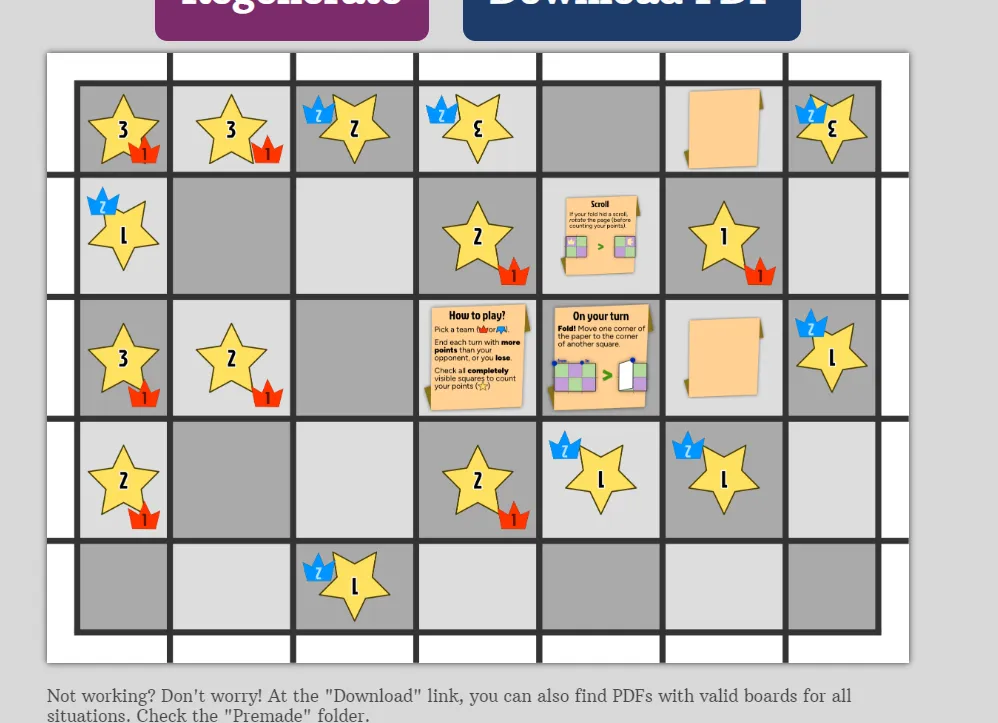
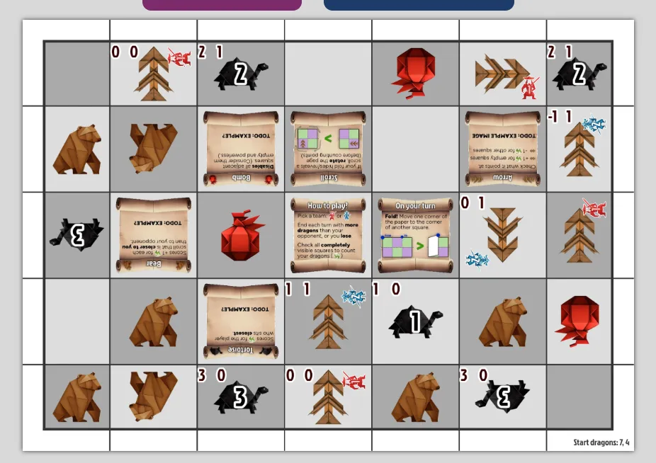
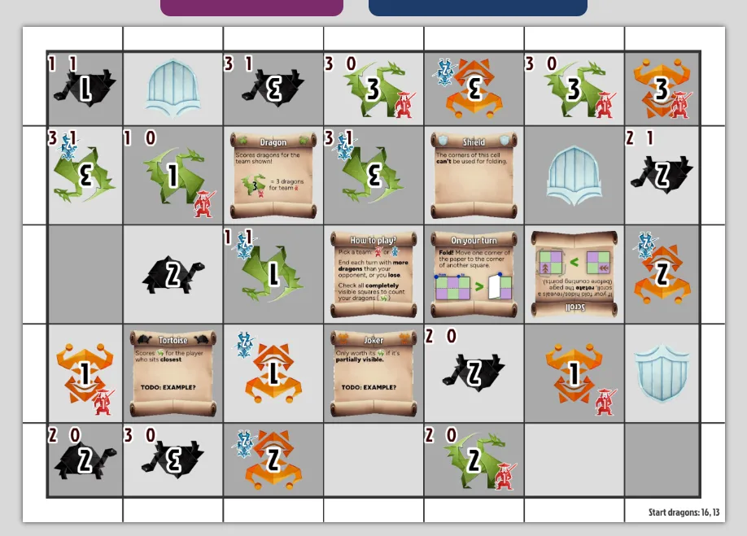
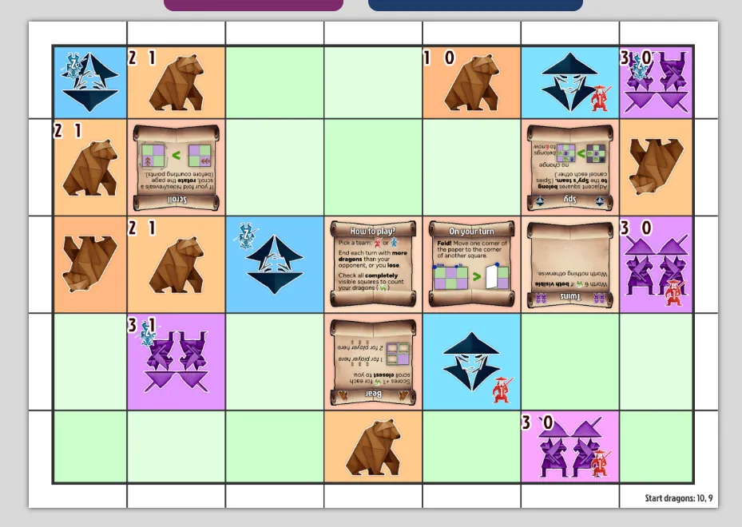
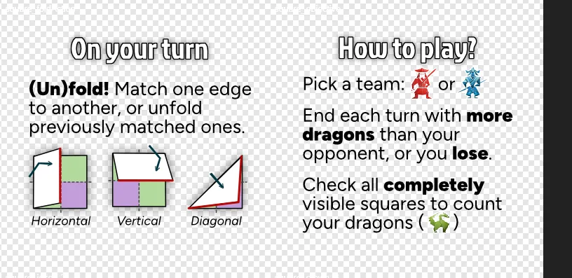
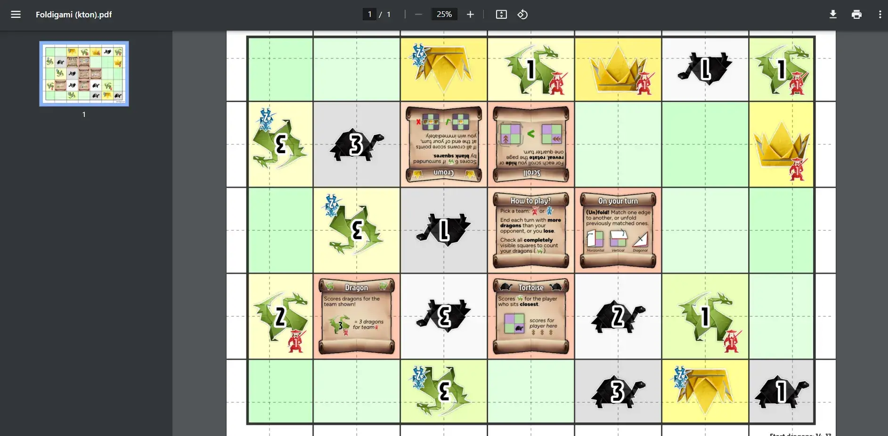

Welcome to the devlog for my game [Foldigami](https://pandaqi.com/waitless-games/play/foldigami/). Here, I'll (briefly) explain the design process for the game. Where did the idea come from? How did I develop it? What interesting problems did I have to solve?

## What's the idea?

It all started with a conversation with a family member about my One Paper Games. We joked about the fact that they weren't _truly_ "One Paper": you still needed to read the rules beforehand and/or have a pen(cil). Surely, those aren't major requirements and I can confidently keep using the term "One Paper Games".

But it did make me wonder: _can we design a game that is TRULY one paper and nothing else?_

You don't even need a pen. You don't even need to read rules. Could it be done? 

Well, when you ask my mind a question of "can X be done?", it can't stop thinking about it until it has an answer :p

{}
I also considered ideas with soft requirements, like requiring a single pen (with rules printed on the board). That still counts as an OPG to me, but I wanted to try my hand at a TRUE OPG first.
{}

## The first idea

### Experimentation

A few days later, I realized the only three ways to play with just a paper (and nothing else)

* Fold the paper
* Rotate the paper
* Flip the paper (front <=> back)

With just these actions, the whole game has to be played.

Additionally, the _rules_ will have to be printed on the paper itself.

I quickly grabbed a paper, folded it a few times, and started experimenting. I quickly learned that ...

* We really want a _square_ playing field. Otherwise, squares have different sizes, and most ways of folding the paper are ugly and unusable.
* The backside of the paper (with empty squares, nothing printed) will need to fulfill _some_ necessary function. Perhaps they are wildcards or react to their environment: they become whatever cell they're next to. If we **don't** do this, we literally have a whole side of the paper that can't be used and just gets in the way.
* I probably want squares with _arrows_, or some _direction_, to make rotating the paper a useful action.

This is how I settled on my first idea of rules.

### Rules

Objective = if you end your turn with _fewer points_ than the opponent, you immediately lose. (Yes, I envisioned this as a 2-player game for now.) In other words, you need to score the same or better than the opponent to stay in the game.

This means it will be a very fast game. But that's fine. The board will be infinitely reusable: just unfold it and play again.

On your turn, do one of three actions

* Fold the paper: bring (at least) one corner of the paper onto another corner of a square.
* Rotate the paper: self-explanatory
* Flip the paper: same

You cannot undo the previous action. Any squares that aren't completely visible (due to diagonal folding) are worth nothing.

Your points are calculated as follows

* Some cells are fixed points for a certain team. (Either positive or negative.)
* But most cells show one (or more) arrows. If the arrow points at you, it scores points for _you_. Additionally, any **empty cells** in the way are worth one point.
* (And perhaps another cell type that converts each adjacent empty square into the same type.)

### The board

The board is now simply two components:

* The biggest square possible, cut into an even number of squares. (Probably 6x6. Or 8x8, but that feels too big and overwhelming.)
* The remaining chunk of the (A4) paper contains the rules, which should be cut off.

I _can_ create an alternative version that requires no scissors and just uses the full board. But if I do so, I might have to disallow diagonal folding (it's messy). And it would only be playable by those who _know_ the game.

Of course, it feels like a waste to _reprint the rules_ on each board. Let's add some random generation to this.

* For each board, it picks a few cell types to use (and doesn't use others). The rules only explain those.
* Additionally, I invent a list of "interesting bonus rules", and pick one or two at random.

## A first sketch

I needed to know how to lay out those rules on the board, and whether it even fit. So I did a quick sketch.

This made me feel ... both hopeful _and_ terrible :p

Hopeful, because it looks quite good and the rules can be explained this way. I have space for at most 4 or 5 different types of special squares.

Terrible, because I can't give proper (visual) examples in so little space nor deal with exceptions. These rules skip over a lot of detail---assuming most people fill them in automatically---but that's not the way to go. It also reminds me how this still isn't a _true_ One Paper Game, because you need scissors to cut off the explanation.

Which, honestly, makes it even more awkward. If you cut off the explanation in advance, well, how are you keeping it around for when you will actually play the game? With a paperclip? 

Even more annoying is the fact that there will always be these margins around the paper. Which mess with the grid and also have to be cut off first for the best experience. 

### Solving the issues

At this point I _fortunately_ realized some easy solutions were at hand.

* To combat the issue of margins around the paper, I can just make the cells at the edge _smaller_. So that, when folding, everything still lines up perfectly. (Might need to inform players of this, though, before they _do_ cut off the edges or mess with the margins some other way.)
* I _can_ use the full paper! I don't know why I didn't see this before, but I can obviously use different dimensions horizontally and vertically. Yes, an 8x8 board will have distorted squares. But turn it into an 8x6 and you're almost at square cells.
* Maybe the explanation of the game is simply part of the board.

That last one will be tricky, but ultimately the best way to do it (I think).

Instead of reserving a strip for the rules and giving them all in one go, we reserve some squares here and there for the rules.

* One big square in the center that explains objective and turns.
* Each special square gets a "scroll" icon (like, an ancient scroll or law) next to it that explains what it does. These scroll icons are simply worth 1 point for their team, or something.
  * (I only do this once per square. No need to explain what the "bomb" does for _every bomb_.)

This meant---again---that rules needed further simplification. 

{}
This is really a challenge and a battle of perseverance, because the rules are already so simple they can barely be called rules. In a normal game, I wouldn't consider further simplification. But in this case, it was necessary.
{}

I realized three things.

* The _folding_ has to stay. That's the main, unique, powerful action of this game.
* But my best ideas for special squares require that _rotation_ as well. We need another way to trigger that action.
* We need one scroll to explain itself :p As in, to explain what scrolls do.

Why don't we combine the last two items? Scrolls _allow_ you to rotate. If your folding hid a scroll, you must rotate the page at the end of your turn.

Combining all that, we have a game that ...

* Fully explains itself. (Almost no assumptions needed or details left out.)
* Uses the full paper, but still has nice square tiles.
* Needs no preparation, or scissors, or whatever.

My only issue is the fact that board space is really limited now. Only 35 squares total, and about 1/3 of that will be used for explanation. At the same time ... I guess that still leaves 20 squares to fill with something else, which should be enough for diversity and tactical depth, right?

{}
Also notice the small "starting points" text in the bottom right. I though this'd be helpful for two reasons. One: to help me debug and test the system that evaluates how good each team is. Two: to help players check if they understand the rules, by quickly recounting.
{}

## Towards a prototype

My biggest fear is that games can be over immediately, due to the random generation making it _impossible_ to get through the first few turns. (As in, you are simply dealt a bad hand by the "board", and can't get more points than the opponent on your first turn.)

At the same time, players can obviously choose at which side of the paper they sit. 

I can also control this in the generation.

* While generating, keep track of how "strong" each team is. (For example, if team 1 already has 10 points on the board, and team 2 only 1, that's a problem.)
* Keep retrying, or modifying numbers, until opposite sides of the board have very similar point values.

As such, I made the generation a bit "smart" (without wasting too much time on that).

With that all done, I can finally generate boards and actually test the full game.

### Icon Designs

I envisioned this game as a sort of Chess or Go. Something that should look like a _classic_ game, like it used to be played in some ancient civilization. That's why I gave icons this fantasy-like, old, ancient look. At least, that's what I tried.

{}
The alternative was to make this a modern, abstract game. With simple symbols---squares, circles, triangles---that represent nothing but a specific rule needed for the game. That just felt a bit lifeless to me, and also not as attractive to play when you see it.
{}

After researching different styles, and asking an AI for inspiration, I settled on 

* Origami
* Paper texture
* Influenced by Ancient China (warfare)

The first two obviously fit the game really well. Origami originated from either China or Japan (depending on who you ask), which is why I was drawn towards that culture. It also felt more unique and inviting than "another game with knights or based on medieval warfare". (I've always loved the designs, patterns and iconography of ancient Asian culture.)

It was something that the AI could handle reasonably well, with me doing the final 20% of work. (Picking good colors and aesthetic combinations. Fixing mistakes in the generated images, or literally finishing them by hand because they were cut off.)

This, to me, illustrates the power of these imagery AIs if used as a _tool_. (In the hands of somebody who has already designed or drawn their fair share of art.) I was able to create the full visual design for this game in less than a few hours. And I think it looks _really nice_.

Below are a few different versions of the boards. (I worked on this game one hour each night, a few days in a row. So small improvements each day.)

The numbers in the top right are from my `Evaluator` class that checks if the board is fair. (Obviously, I use these for debugging but don't include this in the final game.) First number is the score, second number is the team to which the board belongs (after considering special effects like the _bomb_ or _spy_.)

A few simple additions made the boards look much more clean and professional:

* The addition of an _outline_ (thin white or black) around each icon
* A subtle drop-shadow for each icon
* Coloring the rectangle to match the icon on it. (At first, these colors had more contrast, and some were _dark_ for the lighter icons. However, this made the board look like a mess. It looked much better with only subtle coloring, and all rectangles being a similar _light_ color.)

I still want to do one last "design" pass, where I add decorations and make the whole paper look like origami. But that's not the main priority right now, and I'm not even sure _how_ to do this yet.

For now, these boards are testable. All rules are explained, the evaluator can ensure fair starting boards, it looks clean and clear, and printing 10 of these doesn't feel like a waste of ink :p

## Playtest / Prototype

Good news and bad news.

The game _does_ work. 

* You can actually do meaningful moves with folding
* Allowing you to _rotate_ when folding away a scroll is a simple rule that seems to work well.
* You can play 5--10 games with the same paper, as long as your starting move is different.
* Calculating your points isn't too hard, especially on more empty starter maps.

But that's where the good stuff ends.

### Better folding rules

First of all, playing around with these printed boards, I quickly saw a much cleaner way to implement folding.

* We need a dotted line **halfway** squares. This would actually allow folding any way you like, instead of only allowing half the possible folds.
* I should just **forbid** diagonal folding. It's messy, no good can come from it.
* The only diagonal fold that works, is one where each side is equal. (So you cover equally many square horizontally as vertically.)

### Mediocre squares

Secondly, some of the squares I invented are too "niche" or "complicated". Pretty quickly, after a few folds, a large part of your paper is filled with _empty_ squares. As such, I should include way more special cells that actually use that empty space.

More specifically, I was wondering about a rule that says "half visible tiles are only worth half the points (rounded down)". I think this would work well, _but_, because the square is only partially visible, important information might be hidden. (Such as who _owns_ the tile.) 

As such, I ended up deciding against this. This rule would only work for things that don't have a number or team printed on them, which is a very small subset of the squares. Additionally, disabling anything not fully visible helps simplify the game in a way that I really appreciated when I tested the game.

{}
Although, this _would_ be possible if I printed the square's team on all four corners. Then it doesn't matter: if the tile is partially visible, its team will be visible. But that probably adds more visual noise than I'd like.
{}

My specific notes ...

* The rule of "you must have more points than your opponent" is simple and strong ... but can also easily lead to games that are over within 1 turn.
* IDEA: A special square that disables that rule. (While visible, you're allowed to end your turn with fewer points than your opponent.)
* IDEA: A square that allows you to fold _twice_. (Again, only while visible. Or maybe a special action when you hide/reveal it, like scrolls.)
* IDEA: A square that scores 1 dragon for each _blank square_ closer to you than your opponent.
  * Make a clear distinction between "empty square" (part of the board, just has no icon) and "blank square" (the white backside of the paper)??
* The Twins are perhaps too "all or nothing". (If even one of them is _half_ occluded, you're suddenly down 6 points.)
* Crowns are too powerful. (You win if they are the only type showing at the end of your turn. With my test boards, this happened surprisingly often within 1 or 2 moves.)
* The Bear, Tiger and Arrow are perhaps too complicated to use or calculate in play.
* Also, the Arrow is very similar to the Sword.
* With the new folding rules, the Shield might have become ... pointless? (It says "you can't use this square's corner for folding".)

Finally, with the folding rules streamlined, I might be able to _code_ folding actions. This way, I can ask the generation to test _all possible folds_ for the first few turns, to see if the board is unplayable or not.

## Some realizations

After writing the piece above (and my todo list for improving the game), I took a shower, and went to bed. As always, you have the best ideas when standing in the shower.

### The Folding Mechanic

I realized the simple truth of _folding_ as a mechanic: **"You can only get _less_ of everything."**

That's why something like the "Twins" doesn't work. It's a very simple, intuitive, fun idea _in theory_. Both twins are showing? Lots of points! Any other situation? No points!

But folding ensures that, once a Twin is folded away, it basically never comes back. (This can only happen if it was a huge folding action, which allows a player to pull the paper back at some later stage. Rare. Usually not a good move.)

As such, if Twins are in the game, your best first move is _always_ to remove one of them. A game with a clear best first move, in all cases, isn't a great game.

I need to rethink my squares in terms of "do they become more or less interesting when their numbers dwindle?" The game should obviously have as many squares as possible that become _more_ interesting :p

I'll show this with an example.

The Crown square used to work as follows.

> If Crowns are the only thing showing at the end of your turn, you win immediately.

The likelihood of somebody winning within 3 turns because of this, by accident or because the board is somewhat unfair, is quite high. Even worse, as the number of Crowns dwindle (while playing the game), this becomes _less_ interesting. Because that probability shoots towards near 100%.

Now let's apply the Truth of Folding! Let's rewrite the rule.

> If you _own_ all the Crowns at the end of your turn, you win immediately.

This is pretty inconceivable at the start of the game. Maybe there are 4 Crowns, and none of them are yours (or the opponent's).

But as the game goes on ... and you start claiming crowns ... and some crowns are folded away ... this becomes _more_ interesting.

### Folding troubles continue

My second realization was that my folding rule still wasn't watertight. It says

> Match the edge of the paper with a line on the board.

But this is only one type of fold. You can obviously go the other direction (unfolding), in which case this rule isn't applicable. (You're moving the edge of the paper to ... empty space.)

Even worse, when I tested the game, I found one type of fold that was more useful than the others: the one that _doesn't_ use the edge of the paper. Instead, you match an edge on the board ... with another edge on the board.

As such, I had to change the folding explanation to be more general and perhaps vaguely worded. I hope people's general knowledge about folding, and the example images, are able to explain it.

### Sharpening the scrolls

Finally, I realized my scroll rule could be better. It says

> If your fold hides/reveals a scroll, rotate the page (before scoring).

_Rotate the page_ is too vague _and_ too powerful. It's more interesting if you can only rotate the page one quarter turn for each scroll (hidden/revealed). This adds more strategy, as you can't just blindly fold away all the scrolls, or rotate however you like. The number of scrolls you fold away must match your plan exactly.

### What now?

I implemented all my ideas as "variations" on the existing squares. I didn't want to add even more types/animals/icons. I'd rather _replace_ the existing Bear, for example, with a different type of Bear. Because at least half of my existing squares were too complicated or just mediocre, so they needed to be replaced anyway.

However, I'm not sure which ideas are the best until I've tested them. So, for now, they all remain in the game. (If you look at the code, the alternatives are just "bear1", "bear2", etcetera.)

Once one option has been chosen, the code automatically throws away all the others. (It would be endlessly confusing if the same icon was used twice, with different rules, in the same game :p)

In the end, I'll probably only keep the _best_ version of each icon.

With that done, I was ready to print new boards and test the game again. 

## Update: forget about the folding algorithm

Teaching a computer how any "fold" works on a complex board, and the consequences of it, is _hard_. 

The more I worked on it, the more I realized I'd need to cut corners to get _any_ fast and working algorithm. But those corners I'd cut are _exactly_ what the algorithm is supposed to prevent: boards that are immediately done if you find the _perfect_ move on turn 1.

After putting some time into it, I decided it just wasn't worth the effort. If you're unfortunate enough to have such a board ... and somebody finds _that perfect move_ ... then, well, I guess "well played!" Shake hands, print another board, play another game.

Such an algorithm is way too complicated. The gains would be minimal compared to how much time and effort it takes. (Not only to write, but also to _execute_ on every board, which might cause generation to take 10, 20, 30 seconds---instead of a fraction of a second.)

Also ... my old laptop is dying. Any complex task is just too much and it's become so frustrating to work on _any_ code/program/website that I simply want to give up.

So, before I go insane, I decided to shelve this "would be nice to have but really isn't essential"-idea. Bugs were fixed, last polishes were made, and the game is now done.

{}
Most of this work is just small tweaks to numbers and the random generation to prevent as many "bad luck boards" as I can. So, for example, I track how many empty squares we have left, how many different types have been selected, if there are any imbalances between the players, etcetera etcetera.
{}

Below is an image of a randomly generated board.

### About the dying laptop

This is a recurring theme in the last few devlogs. You might notice a dip in project quality, at least for these board games. I just can't help it. There's a limit to what I can do with failing hardware and no funds for anything better. 

And, when it comes down to it, these are all free games that I create in my spare time. I set a deadline, I make sure to deliver something playable by then, but I can't make any more guarantees at the moment.

The day I actually get a new computer that _works_ will be a wonderful one. Hopefully everyone can see this exact moment in time due to subsequent projects being much more polished and refined.

## Playtest v2

_There was supposed to be a bit about the last playtesting and polishing here, but somehow it was removed or not copied. And seeing that I make these projects 6+ months before they release, I don't remember any of this and can't write it again. Sorry. Let's jump to the conclusion._

## Conclusion

Is it an amazing game? Not really. But it works! Unless you have terrible luck with the generated boards, it's a nice simple puzzle against one other player. (And the board, which will be new for both players most of the time.)

Most importantly, I _made it_ and I _finished the project_.

I made the first folding game. My first two-player (Chess-like) game as well.

The boards and design are quite pretty. The fact that you don't need _any_ other material or _any_ rulebook is also a nice achievement.

Working on this showed me the flaws in such a design. It gave me ideas and lessons to make the next "true One Paper Game" much better.

Nothing is ever as perfect or amazing as I imagined beforehand. This game is no Chess, not by any means ;)

But it's a worthy addition to my games portfolio. The development wasn't as troubled as some other projects (COUGH Photomone Antsassins COUGH), which is also nice.

Until the next devlog,

Pandaqi