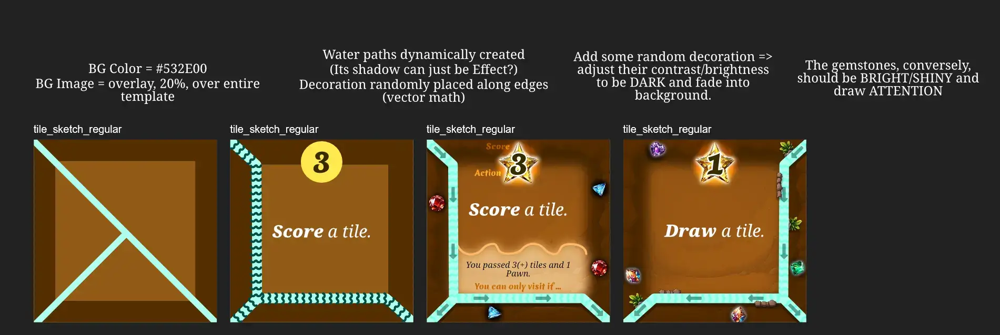
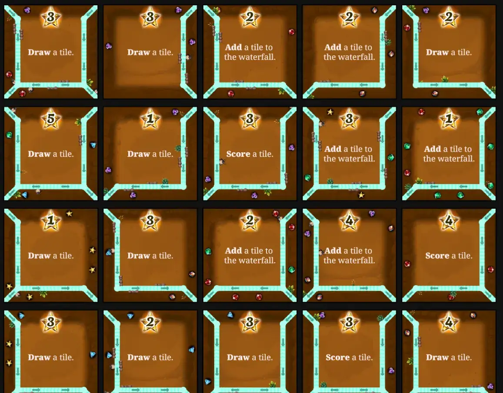
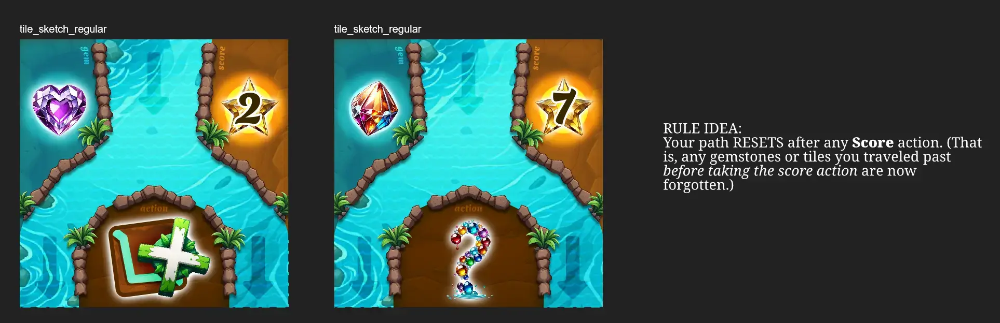

Welcome to the devlog for my game [Waterfall](https://pandaqi.com/waterfall/)! In this article, I keep track of the entire process from start to finish, talking about interesting problems and how I solved them, and anything else that's relevant. Hopefully it's interesting or instructive!

## What's the idea?

A while ago, I was exploring the idea of automatically generating "decision trees" in my rulebooks. These decision trees

* Are an immense help to new players who just want to know "what do I do (to accomplish X in this game)"
* Help me see flaws, simplifications, etcetera in a game idea.

In doing so, I suddenly had an insight that decision trees were almost like ... a map. A board for a board game, with places to visit and arrows connecting them.

This is how _Waterfall_ was born, which (for a while) had the working title of "Decision Trees: The Game!"

{}
That system for generating decision trees in rulebooks might come one day, but it's not a top priority now. I found it too hard to really make it look good and be useful in enough games---this requires more research.
{}

In a nutshell, this was the idea.

* The game has a lot of cards/tiles showing an "input" and two "outputs".
* By placing these in a pyramid-like structure, you obviously get a decision tree: you start at the top, then make decisions as you move down (go left or go right?)
* Unsurprisingly, **that's the gameplay**. Each turn, you fall down the decision tree. The tiles you pass along the way determine your actions and rewards. 
* And a common action, of course, is to _change_ this tree (by adding options, swapping decisions around, etcetera).

This felt like a simple idea that could have incredible depth, which is why I pushed it near the top of my list.

* Your turns are incredibly simple and consistent: place your pawn at the top, for each tile decide to go left or right, until your path ends at the bottom. 
* The whole theme of waterfall and "falling down" is very intuitive and probably understood immediately by all.
* But players are constantly shaping and changing this "waterfall", which basically allows _anything_ to happen or occur in any game.
* And we don't need any more material or explanation: the tiles do all the work, and the actions are written on them.

As with any general idea, however, we now need to _specify_ it and solve some of the issues that pop up.

## How to keep the waterfall alive?

The most logical way to end the game, would be if the waterfall has reached a certain length. 

Additionally, if the waterfall stays the same all the time, then turns become repetitive. If you've found your perfect path, well, just repeat it five times in a row!

This means we need a steady pace (on average) at which the waterfall is _extended_ or _changed_.

* A common action should be to _extend_ the waterfall. In fact, we might want a default "starting card" that has this action.
* I want players to be able to stop earlier on, which means their pawn _stays_ on the waterfall. This allows adding a core rule: _Any locations with a pawn are "blocked"_. This forces you to regularly take different paths around others.

How do we "extend" a waterfall? Where do cards come from?

* **Bad Option:** You could draw them from the top of the deck. This is completely random, however, lacking any control or strategy.
* **Bad Option:** We might have an open "market" (say 6 faceup tiles in a row) that you can choose from. This will be confusing, however, as the waterfall is _also a set of identical faceup tiles_. People might forget which is which and it will just be messy.
* **Better Option:** Players have cards in their hands.

This requires us to have another common action: draw new cards.

Adding a card to the waterfall uses the rules you'd expect.

* It must be adjacent to the current waterfall.
* And its "paths" (the input to output split) should match with its neighbors, to keep everything nicely connected.

## How do you score?

I like solving multiple issues with one solution. As such, I wanted to use "the way you score" to _also_ keep the waterfall more alive. (That is, to prevent repetitive turns taking the exact same route down the waterfall.)

* **Bad Option:** Tiles simply have a "score X points" action. Because scoring is the most essential thing, people will simply always take the path to the highest scoring tiles.
* **Bad Option:** How tiles score depends on their surroundings, place in waterfall, etcetera. This is _fine_, but it's still fixed. You can calculate the best path and all players simply take that.
  * I also don't like how such ideas would require an extra set of material---victory points or something---to track that score. I like keeping material minimalist, so I want to reuse the tiles to _also_ track score.
* **Better Option:** We add some random elements (from a small set of options) to each tile. When you take a "score" action, you score a **hand card** with a _matching element_.

For example, I'm leaning towards adding "gemstones" to all tiles. (Some have only one, some have more. There would be 4 or 5 options in total.)

When you enter a tile with a "score" action, you'd ...

* Check the gemstones on that tile.
* And find a tile _in your hand_ that matches.
* And you score that by placing it facedown before you. (Each scored tile is then simply worth one point.)
* (Optionally, though, we might add "scores" to tiles as well, making some more valuable than others.)

This means different players are gunning for different things. This means you _can't_ keep taking the same path and scoring, because your hand and the gemstones on tiles keep changing.

Additionally, to prevent "score" actions to be overpowered, other actions would need to be equally valuable. We already have some of this, as you can't score if your hand is empty. (So you want to regularly take a path that allows drawing more cards too!) But we need a little more of that. 

Actions that allow changing the waterfall in powerful ways, or the paths you may take, would be "useful enough" in my eyes. For example, an action like "You may enter tiles with other players (from now on)" would be incredibly useful to work around blocked paths that turn.

## How to add some final spice?

I keep calling this "adding spice" or "adding the cherry on top". I don't really know how else to call it. It's that intuitive feeling that "the current idea is fine, but it needs one thing to make it _really cool_". It's the realization that turns will still be a little bit repetitive and tiles a bit too .. standalone?

In other words, **we need a lot of actions that depend on the path taken so far**.

It should _matter_ whether you reach tile Z through A and B, or Y and X. If it doesn't, then each tile and its action is completely standalone and could have been anywhere in the waterfall. You could have taken _any_ path towards it, and as far as I can tell now, the number of "pretty much identical" options would overwhelm players.

{}
Once the base rules are down, I will write a simulation to actually test all these feelings and see how true they are. Asking the computer to play 10,000 games, I can track how many "possible paths" you have on every turn, how often pawns fail to exit the waterfall and block others, etcetera.
{}

Instead, we should have a good chunk of "conditionals" or "gates". Things like ...

* "Do a SCORE action. If your path contains 3 blue gemstones, SCORE _twice_."
* "To enter this tile, your path must be in only one direction (always picking the LEFT or the RIGHT option)."
* "If you enter this tile, your path may not be longer than 3 steps."

It feels too messy to tack this onto certain actions (at the start/end), so let's instead make it a core part of the game. A section of the tile that can stay empty (if there's no conditional, which would be 2/3 of tiles), but is otherwise filled with a simple check on your path so far.

With this in place, your turns _should_ become really dynamic. Even if the waterfall stays the same, you still might want to take a different _path_ to get to certain tiles. Blocking someone else by making your pawn stuck halfway the waterfall can have enormous consequences.

As such, this felt like a solid foundation and enough to start properly developing the game.

{}
I delayed creation of this game for half a year because I don't want to introduce other material requirements. Namely, a PAWN of some sort which you use to fall down. Then, in the meantime, I figured out pretty simple ways to also allow pawns to be print and cut, which removed the final hurdle and put this idea at the front of my mind.
{}

{}
As usual, many ideas are shifted around between "base game" and "expansion" all the time. For example, those conditionals on tiles might end up in the base game (if they're simple and crucial enough) ... or they might be an expansion only. All of this must be figured out through simulation, playtesting, etcetera.
{}

## Let's make that!

### Generation

This is nothing special. 

* I manually input how many tiles should be created.
* I manually input the _distribution_ of score, number of paths going _into_ a tile (left, right or both), number of paths going _out_ of a tile (left, right or both).
* Then I turn those distributions into lists of options (exactly as long as the number of tiles I need), which I "shuffle" or "randomize"
* Because then I can simply create all those tiles and pick the first option of every list (for score, water, gemstones, everything)

I use my own "balanced picker" to make sure each gemstone appears equally often on the tiles (roughly speaking), but that's it. In that sense, the material for this game is _very_ straightforward.

Because the game only works if there are lots of "core" actions (DRAW, ADD or SCORE), I had to do a little more work to ensure they appear often enough.

{}
Also, because they're so important and ~75% of all actions, I added a toggle to display them as ICONS instead. If you want the game to be "textless", perhaps when playing with kids, you can just turn that on and have action icons.
{}
 
### Drawing

There are many ways to display a decision tree, or more specifically "paths" on a tile that should connect.

* Paths start/enter halfway the edges.
* Always one path in, that splits into two.
* Cards are laid out like a _pyramid_ instead, changing where paths start and end.
* Etcetera

In my case, however, I have additional requirements that eliminate most options.

* The center needs to stay free to write down action (and/or "gate"). This needs to be uncluttered and spaceous, and just looks best when the action text can be centered.
* I need to display a big "score" number somewhere. This, too, looks best if it can be centered on an edge. If you put score in the corner---and leave the other corners empty---the design looks very unbalanced.
* And I obviously need the _gemstones_ for matching (when scoring), which can be any number and should not interfere with the text or score. (As in, they shouldn't be hidden by it or overlap it.)

All of that lead me to the only possible design, really.

We use the _corners_ for connecting tiles. The water path goes _around_ the rectangle in the center. This has the added benefit that it allows any input and/or output, and tiles can just be laid out in a simple grid.

It did make it hard to illustrate the feeling of a waterfall, as the actual "water" part is relatively tiny now. I added some waves and arrows, and random decorations _around_ the water, to improve this.

Below is an image of the tiles once _dynamically generated_ (through my website).

My only gripe is that the tiles are very _uniform_ now. As the image shows: it almost looks like _one_ huge brown tile, instead of clearly unique and individual tiles.

I might change some colors based on the action or gemstones, just to get some variation. At the same time, it's very clean and simple now, and I don't have much motivation at the moment to create more unique/intricate designs. (As in, I want to get these simple game ideas "out of my system" moreso than I expect them to be masterpieces.)

And with that ... we're already done! That's the beauty of a game with only _one_ (simple) type of material, and all my built-in systems (and skill/experience) with random generation and drawing.

The tiles are actually quite intricate, as they have to randomly create the right water paths, ensure gemstones don't overlap that (or anything else), place decorations nicely _along_ the edges, etcetera. But those are all things I've done several times before, which means this game was made start to finish in roughly a day.

## Let's make a simplified version!

As always, by developing an idea and iterating on it, you actually learn how to make it _better_. Or, at least, _simpler_.

I've noticed I have the tendency to make games _text-based_ first, perhaps because I'm a writer as well. In other words, I invent a list of 10--15 unique actions _written in text_ and place those on the tiles. That's my go-to design behavior.

In practice, however, less text on tiles/cards is always better. Sure, I can make things as _succinct_ as possible, but it's still text that people need to read over and over. It also makes me fall into a design trap of trying to add too much or too many unique actions.

I try to make the game more fun by inventing crazy actions---when really, I should be making it more fun through its _core_ gameplay.

As such, this version of the game is _fine_, but I saw ways to remove the text and make an even more "streamlined" version. I'm not sure if I'll merge the games, or keep them as separate games, or only pick the best one, but I wanted to _try_ the other idea at least.

What's the idea?

* Only one gemstone per tile. This makes it much quicker to find matching gemstones + see your "path" so far. (And takes less space.)
* Only the "core" actions: add to waterfall, draw hand card, score. (Perhaps also "teleport" or "(re)move Pawn" or "remove tile from waterfall", but those are very optional.)
* It should be _much more likely_ to get stuck halfway the waterfall and thus block/influence each other.
* Which means we need _much more (dynamic) control_ over how far you get or where you may go.
* Now that the idea is simplified, we _can_ use "pyramid" placement and just make every card 1-in, 2-out.

The biggest changes here would be the following ideas.

* You may **score** any tile that matches a gemstone that you **passed on your path**. (Not just from those on the current tile.)
  * This _inherently_ makes the specific path + actions you choose dynamic and important. And, as stated, it also allows tiles to just show ONE gemstone and that's it.
* At the start of your turn, you simply **continue from wherever your pawn is**. (You don't reset to top for next turn every time.) 
  * If you're more likely to get stuck in this new idea, this is necessary anyway. It wouldn't be much fun to build an entire waterfall if most people only see the first layer of it.
* And you must **play a hand card**: its "score" number determines how many steps you may fall down. (You may even play multiple if you want.)

This means that number has multiple uses (and more justification for taking up valuable space on the tile). But it's also inherently balanced: you may fall further if you play bigger numbers ... but then they're gone from your hand, so you can't score them at some later point. I hope such a rule creates a fun tug-of-war between when you want to make a lot of steps and when you want to save big numbers for higher scores.

Hopefully you agree with me thta this version would probably be both simpler _and_ a better execution of the "Waterfall mechanic". It would also be textless and very easy to make (especially now that I already have 90% of the other rules and assets), so I went for it.

With my new "1-in-2-out" system, I can make the water more round/organic and take up more space on the tile. It also neatly disects every tile into _three_ empty spaces, which we can use for the three elements: GEMSTONE, SCORE, ACTION, all of which are _icons_ now.

All of that combines into something like this.

I think you can tell, from the look alone, that this is a cleaner and more streamlined game. (Also, of course, because I don't have to randomly generate the waterfall elements, I can just draw it once in a much prettier way inside my illustration software.)

## Simulation

I should really do these simulations far earlier, as they _always_ provide crucial insights and fixes to the game's rules. (Now I've had the awkward situation, numerous times, where I'd already printed + cut test material ... and then had to scratch out/rewrite some parts of the material with pen to update it :p)

Anyway, I teach the computer how to play Waterfall, then ask it to play 50,000 games and give me some statistics.

At first, this was horrible.

* About 50% of the games took over 150 turns, and they sometimes _never ended at all_.
* Scoring was way too hard.
* About 85% of the time, players' hands were simply empty and they couldn't do anything.
* Similarly, about 30% of the time, a player simply couldn't do ANY move because they were blocked on all sides. (This was one cause of the endless games: the entire waterfall was filled and blocked, making it impossible for all players to move.)

I tried many, many small tweaks, but they all made no discernable difference. After creating the visualizations and checking them, I was also able to get rid of all bugs or potential issues in the simulation. 

{}
Many games have _extremely_ rare situations that might cause an error or a fault in the logic. This is no issue in the real world. But if you're simulating hundreds of thousands of games, those rare situations are bound to show up and ruin all the data. Or just crash the simulation, of course.
{}

Also, I just want to state again how annoying it is to write logic for finding paths and routes in a pyramid-shaped tree of tiles ... which can also have holes or pawns blocking each other. I should make fewer games like that.

This revealed that we needed some changes to the _core_ of the game instead.

### Fix #1: Simpler blocking

**Change #1:** I already added a rule that blocking can be ignored if _all_ paths are blocked. This is, however, hard to check and not strong enough. (In a large waterfall, it takes a while to check that literally _all_ paths are impossible to complete.)

Instead, it was simply changed to: "if both your downward options are blocked (by another pawn), you may ignore this and share a tile with a pawn."

This fixes the "deadlock" from pawns blocking the top few tiles. (If they do so now, you can simply ignore that and be on your way.) It's also simpler to understand and execute. Finally, the simulation showed this situation is rare enough that this isn't too much of an "advantage".

### Fix #2: Never stop the game

**Change #2:** Finding the root cause of those "endless games" was hard. I thought it had to do with the special actions such as "remove a tile" that, somehow, ended with the entire waterfall being removed or something. This caused me to search in the wrong place for a while.

It turned out that the cause was far simpler. 

The game has three core actions: ADD (a tile to the waterfall), DRAW (a tile to your hand) and SCORE (a tile from your hand). If any of them fall away, the game is never completed. And so you _could_, if all players play very dumb, end up in the situation where ...

* There isn't a single DRAW tile.
* So player's hands are empty (over time)
* Making it impossible to ADD or SCORE.
* Leading to a game that never finishes _or_ one where the winner wins with 0 points.

This situation could literally not be resolved. Because if you're out of tiles, you're allowed to move 1 step ... but that's it. You have to visit another DRAW tile to get any tiles back into your hand.

Once realized, the fix here was simple: "If you have no tiles, move 1 step _and_ draw a tile."

This completely removed all endless games (that used to go 100, 200, 500 turns before). Because even if the waterfall ends up very unfavorable, there is always an influx of movement and tiles that will resolve it at some point.

With human players---instead of dumb computer players that do random moves---this should never happen. You'll plan ahead and take routes that ensure you keep tiles on hand or a nicer waterfall for all. But even then, never expect your players to "fix" your game by playing smart all the time. It actually has to be impossible to deadlock, even if you play dumb as can be!

Another fix that removed almost all games with 100+ turns was to disallow _breaking_ the waterfall into multiple pieces when removing tiles. When looking at all these "endless games", I saw that almost all of them ended with a waterfall that was missing one entire row, making it literally impossible to fall down from top to bottom :p

The final fix that removed _all_ those games, was to simply end the game when all tiles have been used. Because of course, if _all_ tiles are scored by players or stuck in the waterfall, it is _also_ impossible to continue the game and end it. This is extremely rare though---only on low player counts, once every 10000 games---so I'm fine with insta-ending the game then.

### Fix #3: Simply more drawing

Finally, the stats still showed too few tiles drawn (and subsequently, games taking too long and scoring happening too infrequently).

I simply changed those specific actions:

* DRAW allows you to draw _three tiles_ (instead of one)
* SCORE allows you to score _two tiles_ (instead of one)

This seemed to balance it out. You can still be out of cards _or_ unable to score a tile (if gemstones don't math your path), but more often than not, you _are_ able to do something.

These numbers seemed the best fit and resulted in the following final statistics.

* The average number of rounds per game is ~30. (For 2--6 players. At an average player count of 4, this means about 7 or 8 turns per player. Simple games like these should always be somewhere around that range, I feel.)
* Average path length per turn is 2 tiles. (The average path length without blocking and stuff is about 3, because the numbers on cards range from 1--5.)
* The average winning score is around 12. 
  * Scoring might still be slightly too hard, but then again, these computer players do random stuff that doesn't help them most of the time.
  * In any case, I removed the condition that your path "resets" after scoring. (So you can't match gemstones visited before that score action.) It is a fine rule, but with scoring being as hard as it is, removing it seemed wiser.
* On average, there are ~15 situations in which your path is blocked by another player's pawn per game. (This doesn't mean fully blocked necessarily, just one of your paths was cut off by another player.) So there's interaction, but it's not too overwhelming.
* On average, you "reset" to the top of the waterfall about one every 2.5 turns. This also seems nicely balanced.

### Realization: exiting the waterfall

I somehow failed to (consciously) grasp this, but my visualization/simulation clearly showed this: of course you can also exit the waterfall at earlier points than the bottom!

Each turn, you simply have the choice to move down and to the left or down and to the right. If one of them simply doesn't have a tile, well, now you've exited the waterfall.

I kept this (instead of saying something like "you can ONLY exit the waterfall at the lowest layer") because ...

* It's simple and prevents adding another rule.
* It actually gives more _choice_ and _freedom_ of movement. For example, if the top of the waterfall has what you need, then strategically exit it early so you start the next turn at the top.
* The simulation showed that this way of handling movement was superior when it comes to the balance of all those numbers I mentioned.

This is an example of something that is obvious once you've seen it before you, but that property or consequence of your idea simply never occurred to you before.

Anyway, with that done, we could finally playtest the game with _human_ players.

## Playtesting & Polishing

@TODO: write down playtesting results + conclusion