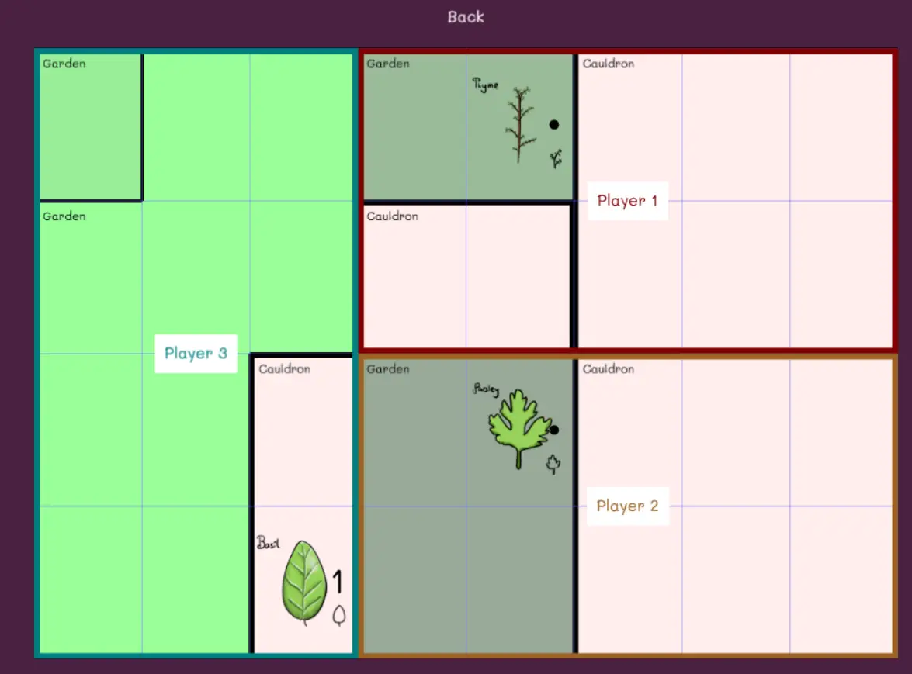
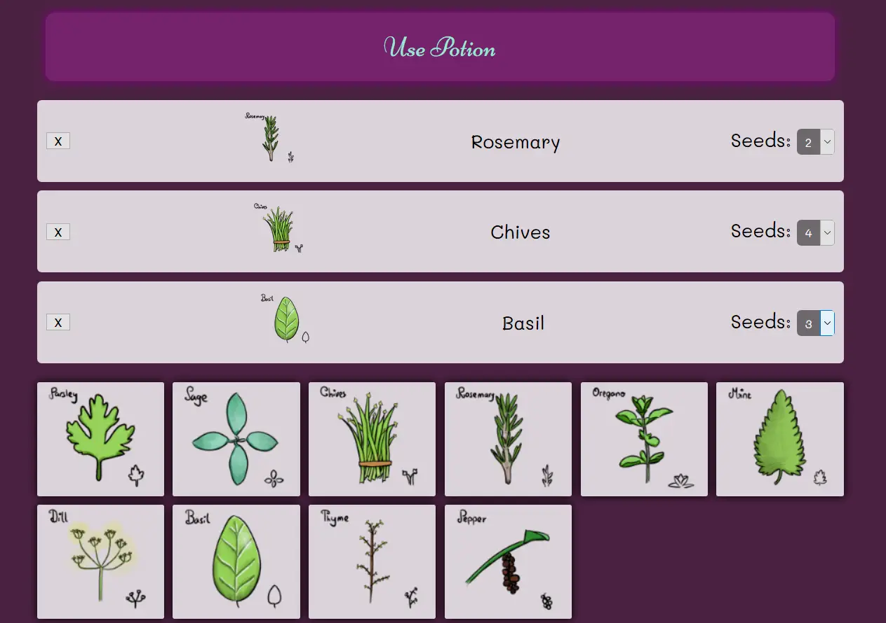

Welcome to the *technical devlog* of Wondering Witches!

In case you haven't played it yet, visit [Wondering Witches (Game Page)](https://pandaqi.com/wondering-witches).

Read the rules, gather some friends and play yourself a fun little
game :)

What is the game about? It's a cooperative, logical puzzling boardgame
which only requires you to grab a *single piece of (empty) paper*. The
game takes place on this paper, but there is an important digital
component.

The idea of the game is that, through experimentation, growing the
right ingredients, and logic deduction, you must discover the secret
recipe!

What's the digital component? When you go to the official page, you
can press a button to generate a random starting setup. Scroll down and
you can press another button to generate the actual puzzle.

This website, even though it's really simple and only a few button
clicks, contains a LOT of ideas and algorithms to make the game
experience as smooth and exciting as possible.

In this article I'll explain *how* I created this "online component"
of the game. I'll also share *why* I added this component and the things
I learned along the way (whenever necessary).

*Remark:* I also wrote a more general devlog about the game design
process. It's rather long, but if you are interested in boardgames or
game design, I'm sure you'll find it interesting: [Devlog Wondering Witches](/blog/boardgames/wondering-witches/devlog-wondering-witches)

*Remark:* of course, the explanations and code samples here are only a
small simplified fraction of the full code. You can visit the website
and check the source code to see exactly how it all works. (I apologize
in advance for pieces of code that are messy, unoptimized or weirdly
structured. I'm an "if it works, it works" kind of guy. I do, however,
comment and space out everything neatly.)

The Two Elements
----------------

The website has two distinct elements: the **board generation** and the
**puzzle generation**. (In fact, you can check the source code and see
that these algorithms reside in two separate files.)

**Board Generator**: this designs a random layout (based on player count
and difficulty) of cauldrons and gardens, adds some special cells and
ingredients on top, and draws this to the screen.

**Puzzle Generator:** this generates a random *puzzle* and gives you an
interface to *test* your solutions.

A "puzzle" in this game is a secret **recipe**. Some ingredients are
good, some are bad. The good ingredients get a number, and you must put
them in the correct order. The bad ingredients try their best to mess
with your puzzle, by obscuring the results.

**Testing** a solution simply means that you input a set of ingredients,
press "Use Potion", and it gives you feedback about the results. For
example, if two of the ingredients had a number that was too *low*, it
reports "2 undergrown ingredients".

Both parts were written in pure vanilla **JavaScript**. The Board Generation
also used the **Phaser** framework for drawing the board. (I know the
framework very well and saw no need to write custom graphics code.)

I'll talk about the Puzzle Generator first.

Evaluating Potions
------------------

This is by far the simplest part of this system! Which is why I wanted
to start here.

A **potion** is represented by a list of ingredients, an *array* if you
wish.

The order matters a lot. To win the game, ingredients need to be in the
correct order. (Ingredient with number 2 must come directly after number
1, for example.)

The computer simply **loops** through the list from start to finish,
checking the numbers and executing any effects of each ingredient.


function usePotion() {
	var cSize = curCauldron.length;

	// read ingredients from the interface
	// (elements on the page have ids "ingredientSeeds#", where # is the index of the element in the cauldron)
	// (perhaps not the cleanest way to do it, so don't focus too much on this piece of code)
	for(var i = 0; i < cSize; i++) {
		curCauldron[i].mySeeds = parseInt(document.getElementById('ingredientSeeds' + i).value);
	}

	// now step through the list and determine whatever happens
	var growingResult = '';
	var totalEffectResult = [];

	//
	// EXECUTE EFFECTS (+ find UNDERGROWN ingredients)
	// 
	//  => we go through the cauldron from OLDEST/FIRST element to the newest; order is important
	var numWrongIngredients = 0;
	var numUndergrown = 0;
	var numOvergrown = 0;
	var elementsConsidered = 0;

	for(var i = 0; i < cSize; i++) {
		// if the number of seeds = -1, set it to whatever is necessary to make this ingredient report correctly
		if(curCauldron[i].mySeeds == -1) {
			curCauldron[i].mySeeds = curCauldron[i].myNum;
		}

		// check the ingredient!
		var checkResult = checkIngredient(i);

		var ing = curCauldron[i];
		var skipEvaluation = false;

		// if this ingredient is an IGNORE DECOY, well, ignore it
		if(ing.decoyStatus == 0) {
			skipEvaluation = true;
		}

		if(!skipEvaluation) {
			elementsConsidered++;

			// if it is undergrown, count that (and set ingredient to "wrong")
			if(ing.mySeeds < ing.myNum) {
			numUndergrown++;
			checkResult.isWrong = true;

			// if it is overgrown, also count that (and set ingredient to "wrong")
			} else if(ing.mySeeds > ing.myNum) {
			numOvergrown++;
			checkResult.isWrong = true;
			}

			// if something is wrong with this ingredient, count that
			if(checkResult.isWrong) {
			numWrongIngredients++;
			}
		}

		// add feedback to the effect feedback bar
		// also flatten feedback (in case an ingredient has multiple effects; otherwise they stay in order)
		for(var f = 0; f < checkResult.feedbackText.length; f++) {
			totalEffectResult.push( checkResult.feedbackText[f] );
		}

		//
		// if a DIRECT EFFECT must happen, do that
		//
		if(effs['Cutoff']) { break; } // cutoff immediately stops executing this potion
		if(effs['Enthusiastic']) { i++; } // skip the next element in line		
	}

	// combine results from growing
	growingResult = '
Potion had <strong>' + numUndergrown + ' undergrown</strong> and <strong>' + numOvergrown + ' overgrown</strong> ingredients.
';

	// shuffle effects and combine them into string as well
	totalEffectResult = shuffle(totalEffectResult);
	totalEffectResult = totalEffectResult.join("");

	//
	// determine if the players WON
	//  => if so, override all messages with a congratulatory one!
	//
	if(elementsConsidered >= codeLength && numWrongIngredients == 0) {
		totalEffectResult = '
Congratulations! You won!
';
	}

	// display the results
	document.getElementById('potionResult').style.display = 'block';
	document.getElementById('potionResult').innerHTML = growingResult + totalEffectResult;

	// clear the current cauldron
	clearIngredients();
}


<!--  -->

### Effects

Because of this linear structure, I needed to be very careful about what
"effects" could do. Once an ingredient has been checked, it's never
checked again. Which means I cannot change anything in a potion that
comes BEFORE my current ingredient. I can only change stuff that comes
after it.

What does this mean? An effect can only ...

-   *Report* the results from ingredients BEFORE it.

-   *Alter* the values of the ingredients AFTER it.

"Report" example: the *Hugger* effect reports whether the ingredient
BEFORE itself has a value within a range of 1. (So if the Hugger has
value 6, and the one before it has value 5, it will report *yes*.)

"Alter" example: the *Spicy* effect changes the value of the ingredient
AFTER itself by 1. (So if the element after Spicy has a value of 3, it's
now changed to 4.)

By implementing the effects this way, I ensure that there are never
mistakes or inconsistencies about the results.

*But, why not change the loop? Why go through the potion linearly?*
Because of simplicity, both in code and in human deduction. This
constraint made the game *much* easier to play and grasp, and the code
much cleaner.

(That's usually how it works: a creative constraint should be viewed as
a *good thing* you can use to simplify your piece of art. Whatever that
may be.)

Of course, there were some ideas I had to throw out, but it was a
trade-off I could live with. 


function checkIngredient(cauldronIndex) {
  // get ingredient and initialize empty object for it
	var ing = curCauldron[cauldronIndex];
	var obj = { 
		"isWrong": false, 
		"feedbackText": [], 
		"directEffects": {
			"Cutoff": false,
			"Enthusiastic": false,
			"Fertilizer": false,
			'Resetter': false,
			'Coward': false,
		} 
	};

	// if the number is greater than 0, check the ordering
	// ordering is correct if two ingredients are in direct sequence (e.g. 4 => 5)
	if(cauldronIndex > 0) {
		obj.isWrong = !(curCauldron[(cauldronIndex-1)].myNum == (ing.myNum - 1));
	}

	// now check all the effects individually
	var effects = ing.effects;
	for(var i = 0; i < effects.length; i++) {
		checkEffect(cauldronIndex, effects[i], obj);
	}

	return obj;
}

function checkEffect(cauldronIndex, effectName, obj, obscureName = false) {
	var feedbackText = '';
	var cSize = curCauldron.length;

	var feedbackValue = '';
	var singular = true;
	switch(effectName) {
		case 'Cutoff':
			obj.directEffects['Cutoff'] = true;
			feedbackValue = "The ingredient was cut off";
			break;

		case 'Spicy':
			if(cauldronIndex < (cSize - 1)) {
				curCauldron[(cauldronIndex+1)].myNum++; 
			}
			feedbackValue = "A spicy ingredient was encountered";
			break;

		// many more cases here ....
	}

	// and return feedback here
}


<!--  -->

### Effects II

After several playtests, I noticed something annoying:

-   Effects were evenly distributed (intentionally), but this made the
    game significantly easier. If you knew an ingredient could have, at
    most, one effect, it became much easier to solve that puzzle.

-   Effects were picked completely at random. This meant that there were
    games where *all* effects had the same type, which made the game way
    less fun changed the dynamic too much.

The first problem was fixed by distributing effects completely randomly.
On average, the distribution will be somewhat fair, but it could happen
that one ingredient has 2 or 3 effects, while others have none.

The second problem was fixed by splitting the effects into categories.
Instead of one giant list, I made several lists ("investigative
effects", "change cauldron effects", etc.)

First, it grabs one random element from *each list*. If that is not
enough ( = we need more effects), it concatenates all the lists (turning
it into one huge list again) and picks randomly from that.

This ensures we have at least one effect of each type, but also keeps
some randomness. 


function createPuzzle() {
	// generate a random ordering of numbers
	var allNumbers = [];
	for(var i = 0; i < numIngredients; i++) {
		// these ingredients are part of the recipe, so give them numbers 1,...,n
		if(i < codeLength) {
			allNumbers[i] = (i+1);

		// these ingredients are not, so give them a -1 (this will be replaced with a proper decoy soon)
		} else  {
			allNumbers[i] = -1;
		}
		
	}
	allNumbers = shuffle(allNumbers);

  // save the ingredients
  // and determine a decoy type for the non-ingredients (those without a number)
	for(var i = 0; i < numIngredients; i++) {
		var num = allNumbers[i];
		var effects = [];

		// let's determine a random decoy type (0,1,2)
		// 0 = IGNORE; this ingredient will be skipped and not interacted with, although effects execute
		// 1 = OVERACHIEVER; this ingredient is always undergrown (0) or overgrown (n+1)
		// 2 = IMPOSTER; this ingredient behaves like a regular ingredient, but it has the "imposter" effect
		var decoyStatus = -1;
		if(num == -1) {
			var randNum = Math.random();
			if(randNum <= 0.33 || difficulty < 2) {
				decoyStatus = 0;
			} else if(randNum <= 0.66) {
				decoyStatus = 1;

				if(Math.random() <= 0.5) {
					num = 0;
				} else {
					num = (codeLength+1);
				}
			} else {
				decoyStatus = 2;
				num = Math.floor(Math.random()*codeLength)+1;
				effects.push("Imposter");
			}
		}

		var obj = { "myName": ingredientNames[i], "myNum": num, "effects": effects, "decoyStatus": decoyStatus };
		curPuzzle[i] = obj;
	}

	// if effects are enabled ...
	//  => randomly distribute effects across the ingredients
	//  => shuffle them, grab X of them (however many needed)
	if(effectsLevel > 0) {
		// DEEP copy the effects array
		// (because we'll be adding/removing in a moment)
		var effectListCopy = JSON.parse(JSON.stringify(allEffects));

		// determine number of effects (based on number of ingredients + effects level)
		if(effectsLevel == 1) {
			numEffects = Math.floor(numIngredients*0.5);
		} else if(effectsLevel == 2) {
			numEffects = Math.floor(numIngredients*0.75);
		}

		// RETRIEVE this number of effects
		// there's a specific order to grabbing effects: 1) Change Cauldron, 2) Investigative, 3) Change Player, 4) Change Field, 5) Complex
		// once this order is exhausted, it starts picking stuff randomly, according to some probabilities
		var possibleEffectTypes = ['ChangeCauldron', 'Investigative', 'ChangePlayers', 'ChangeField'];
		var finalEffectList = [];
		finalEffectList[0] = shuffle(effectListCopy['ChangeCauldron']).splice(0, 1)[0];
		finalEffectList[1] = shuffle(effectListCopy['Investigative']).splice(0, 1)[0];
		finalEffectList[2] = shuffle(effectListCopy['ChangePlayers']).splice(0, 1)[0];
		finalEffectList[3] = shuffle(effectListCopy['ChangeField']).splice(0, 1)[0];
		if(effectsLevel >= 2) {
			finalEffectList[4] = shuffle(effectListCopy['Complex']).splice(0, 1)[0];
			possibleEffectTypes.push('Complex');
		}

		// now build a single list consisting of all types
		// (this automatically ensures that, when grabbing randomly, we have the right probabilities of grabbing each type)
		var bigEffectList = [];
		for(var i = 0; i < possibleEffectTypes.length; i++) {
			bigEffectList = bigEffectList.concat(effectListCopy[ possibleEffectTypes[i] ]);
		}

		// once the default order is done, as long as we don't have enough effects yet, grab them completely randomly
		while(finalEffectList.length < numEffects) {
			finalEffectList.push( bigEffectList.splice(0, 1)[0] );
		}

		// now apply them randomly
		for(var i = 0; i < finalEffectList.length; i++) {
			var curEffect = finalEffectList[i];

			// access a random ingredient
			var randType = Math.floor(Math.random() * numIngredients);
			curPuzzle[randType].effects.push( curEffect.name );
		}
	}
}


<!--  -->

### Some remarks on implementation

**Implementation Remark:** at the start of potion evaluation, I create
an object. Why? Because objects are passed by *reference* in JavaScript.
As I evaluate each ingredient, I add any results (feedback, changes I
need to make) to this object. Once evaluation is complete, this means I
have an *array* of feedback I need to return to the player.

Here's the most important thing: I shuffle this array. In the first
implementations, I forgot to do this, which meant the order of feedback
gave away which ingredients had which effects.

**Implementation Remark 2:** each effect is thrown through a huge
**switch** statement in the code. It's perhaps not ideal, but it was a
very fast and clean way to implement *many* different effects.

However, there were some "direct effects" that had a delayed execution.
For example, the "Enthusiastic" effect means you *skip* the next
ingredient. This effect needed to be remembered and only applied at the
end of a loop iteration.

For this, I also added a list of *direct effects* to that object I
described above. At the end of each loop iteration, I check for these
effects and handle them accordingly.