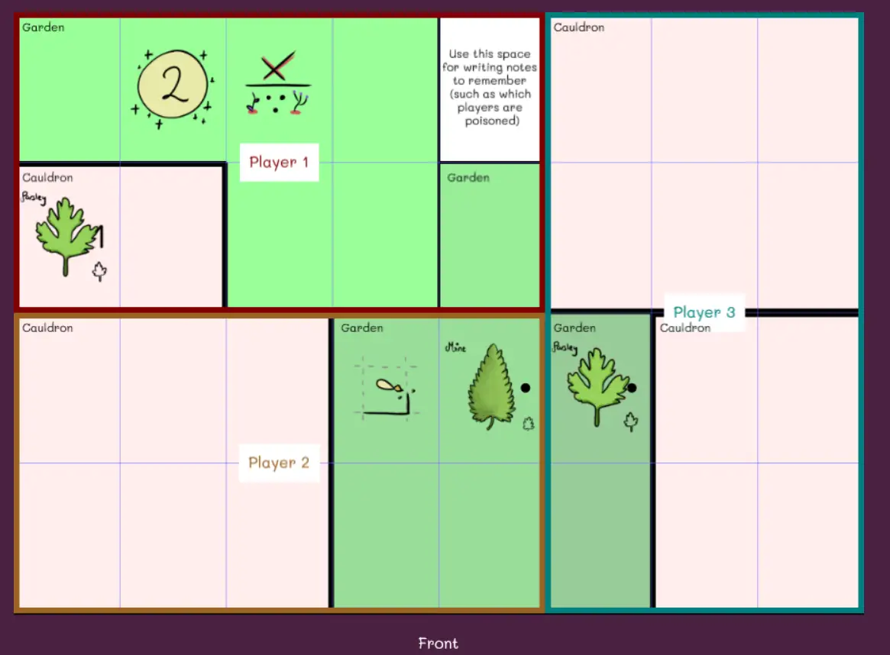

Welcome to part 4 of my Technical Devlog for the game Wondering Witches!

Haven't read the other entries? Go to the [devlog overview](../).

Drawing a Board
---------------

To my surprise, randomly generating the game board was actually *by far
the hardest part* of this project.

At first, I thought: "well, I'll just randomly generate some rectangles
and place them across the field so they don't overlap, randomly add some
ingredients/special cells on top, and we're done!"

Then reality hit. These were just a few of the problems:

-   This game supports different player counts. This means that you need
    to be able to *cut* the board into pieces and give one piece to each
    player. Thus, the pieces needed to be roughly equal (in size and
    content).

-   Cauldrons can only be rectangular. But gardens can be any shape.
    Thus, I needed to write an algorithm to randomly merge cells
    together into a garden, and then draw the correct border around it.

-   I need a (roughly) 50/50 split between cauldrons and gardens. Not
    only that, I need a 50/50 split *per player*. If one player has *all
    the cauldrons*, and another has *all the gardens*, the game will be
    boring, one-sided, and way too short.

This is the age-old problem with random generation: you want it to be
random ... but within very specific parameters.

I needed the boards to be as random and varied as possible, but if I
make a single mistake during generation, it will likely ruin the whole
game.

(For example, one of the early playtests saw a board with only 20
cauldron cells, and 44 garden cells. We had *way* too few opportunities
to test potions, which meant the game was over fairly quickly and we had
to guess the final solution. As it happens, we guessed correctly :p)

So, before we get into the algorithms for *generating a fair board*,
let's first talk about actually *drawing* this board. (As it's way
easier. And it also gives us some restrictions for *how* we must
generate the board.)

### Using HTML5 Canvas (and Phaser)

When you press the button "Generate Board", I start a Phaser game.

I won't explain how Phaser works here, but it's a free library for
creating browser games, which means it requires a \<canvas\> element
onto which to draw stuff. (And, of course, it has many helper functions
for making this drawing as painless as possible.)

Let's assume I've generated a board. This means I have several populated
arrays:

-   Cauldrons = a list of rectangles, each representing a single
    cauldron

-   Gardens = a list of arrays; each array contains all the cells that
    make up this garden

-   Ingredients = a list of random ingredients to place (and where to
    place them + what number to give them)

-   Special cells = a list of special cells to place (and where to place
    them)

-   Required cell = I always leave one cell empty for players to write
    down important information

The last three arrays are not important to talk about, because they are
very straightforward. I just pick random cells, check if I can place
something there, and then place the ingredient/special cell/required
cell.

(The most annoying thing was the actual visual placement. To make it
look good, these elements needed to be centered and scaled properly
within their cells. Which always takes some trial and error.)

The *Cauldrons* and *Gardens* array are the real deal.

### Cauldrons

Cauldrons must be rectangular. This is good, because Phaser has a quick
function for creating and drawing rectangles. (It's literally a handful
of lines to draw all the cauldrons. Search "Phaser Notes Rectangle" for
more info.)

Cauldrons are colored a light red, but I needed something more
distinctive to separate them from gardens.

Eventually, I decided to write the text "Cauldron" at the top left of
each cauldron. This was easy as well: the (x,y) coordinate of the
rectangle was already its top left.

Lastly, I made the border around cauldrons a thick black line (thicker
than the garden border).

### Gardens

Gardens can be any shape. That's why I store them as a *list of cells*.
There's no order to this list, and there doesn't need to be.

To show the garden, I color each of these cells a faint shade of green.

To display the text "Garden" at the top left, I loop through all the
cells and keep track of *which one is most top left*.

The difficult part was *generating the border* of this weirdly-shaped
thing. I tried all sorts of "rectangle merging" algorithms for a few
hours, until I realized I was overcomplicating things.

This is the algorithm I ended up using:

-   Loop through all cells

-   For each cell, check its neighbours (up, down, left, right)

-   If the neighbour cell **is not** within the same garden, we must
    draw a border to this side!

-   If the neighbour cell **is** within the same garden, we just
    continue and draw nothing.

This has worked perfectly since. To speed up this process, I also check
if a neighbour is *outside of the paper*, because that will happen a
significant chunk of the time, and if so ignore it.


//
// Draw gardens
//
var gardenColors = [0x99FF99, 0x99EE99, 0x99DD99, 0x99CC99, 0x99BB99, 0x99AA99];
var gardenLines = [];
for(var g = 0; g < this.gardens.length; g++) {
  var gard = this.gardens[g];

  // draw each cell in the garden
  for(var i = 0; i < gard.length; i++) {
    var tempX = gard[i][0];
    var tempY = gard[i][1];

    var rect = new Phaser.Geom.Rectangle(tempX*this.rectWidth, tempY*this.rectHeight, this.rectWidth, this.rectHeight);
    graphics.fillStyle(gardenColors[g % gardenColors.length], 1.0);
    graphics.fillRectShape(rect);

    // also check, for each cell, if it should have a border
    // check all neighbours; if the neighbouring cell is NOT in the garden (for whatever reason), draw a border line
    var dirs = [[1,0], [0,1], [-1,0], [0,-1]];
    var myCenter = [(tempX+0.5)*this.rectWidth, (tempY+0.5)*this.rectHeight];
    var dirLines = [[1,-1,1,1], [1,1,-1,1], [-1,1,-1,-1], [-1,-1,1,-1]];
    for(var d = 0; d < 4; d++) {
      var nbX = tempX + dirs[d][0], nbY = tempY + dirs[d][1];

      var foundCell = false;
      for(var j = 0; j < gard.length; j++) {
        if(i == j) { continue; }

        if(gard[j][0] == nbX && gard[j][1] == nbY) {
          foundCell = true;
          break;
        }
      }

      // if there was NO cell from the same garden on this side, draw a line
      if(!foundCell) {
        var dl = dirLines[d]
        var line = new Phaser.Geom.Line(
            myCenter[0] + 0.5*dl[0]*this.rectWidth, myCenter[1] + 0.5*dl[1]*this.rectHeight, 
            myCenter[0] + 0.5*dl[2]*this.rectWidth, myCenter[1] + 0.5*dl[3]*this.rectHeight
        );
        gardenLines.push(line);
      }
    }
  }
}

// This STROKES the gardens
// (we already determined the border edges in the code above)
for(var l = 0; l < gardenLines.length; l++) {
  graphics.lineStyle(this.lineWidth, 0x000000, 1.0);
  graphics.strokeLineShape(gardenLines[l]);
}


<!--  -->

### A crucial last step!

So, we've just created a canvas that looks like a nice game board.

This works fine ... except it's a waste of resources and it has some
hiccups.

For example, you cannot zoom in/out on a canvas on mobile, as the
gestures are absorbed by the game. Quite annoying if you're trying to
copy the game board to your paper.

Additionally, you must keep the website open, which means the game will
*keep running* for probably 30 minutes.

Not good enough!

Once the canvas has been generated ...

-   I wait a short while (a handful of milliseconds)

-   I convert the canvas to a **"data URL"**

-   I create a new **image** from this data and put it on the page.

-   And then I **delete the game**.

The code is actually quite simple: 


// after a small time interval, replace this whole game with just a static image
// (why the wait? the canvas needs to be drawn/dirtied and updated, otherwise we copy a black canvas)
this.time.addEvent({
    delay: 200,
    callback: function() {
        // get link to canvas
        // (there's probably a cleaner way using Phaser, didn't know it at the time)
        var canv = document.getElementById('phaserContainer').firstChild.nextSibling;

        // create new image from old data url + append to DOM
        var img = new Image();
        img.src = canv.toDataURL();
        img.style.maxWidth = '100%';
        document.getElementById('phaserContainer').appendChild(img);

        // finally, destroy this whole game
        GAME.destroy(true);
    },
    loop: false
})


<!--  -->

**Why do we need to wait?** Because it takes time to draw and update the
canvas. If I try to turn the canvas into an image immediately, I get a
completely black image, because the canvas *hasn't been updated yet*.

**What's a data URL?** Every image is nothing more than a string of text
( = a chunk of data) that the computer *interprets* as an image. By
using the default function ".toDataUrl();" you can convert anything to
its URL, which is extremely useful. Then you simply create a new \
element and set this URL as its src.

Deleting the game was ... surprisingly easy and painless. I just needed
to call the default Phaser function, and it removes all traces of itself
without any issue.

(In fact, on most devices, you won't even see the moment where it
deletes the game and switches to a static image. It's like a magic trick
:p)

Because the board is just an image now, you can zoom in/out, save the
image, anything you want -- and it doesn't cost any additional
computational resources.