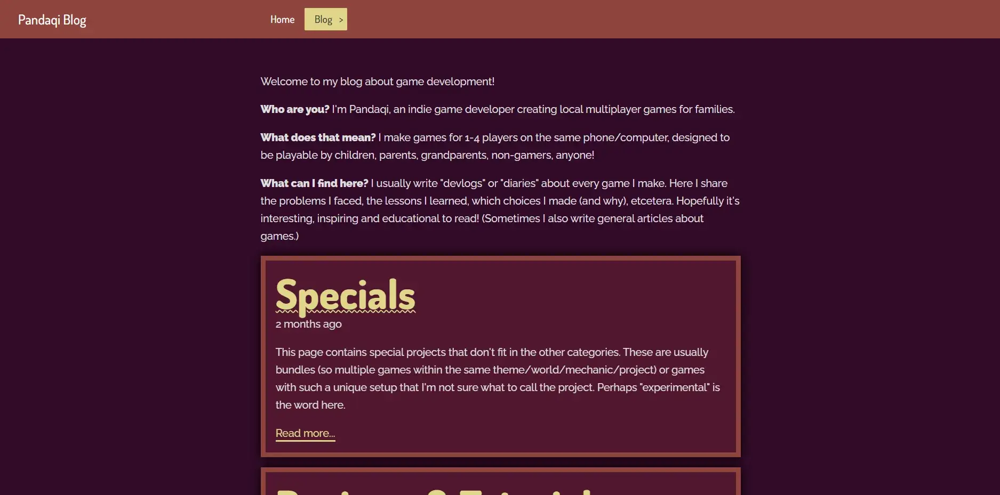
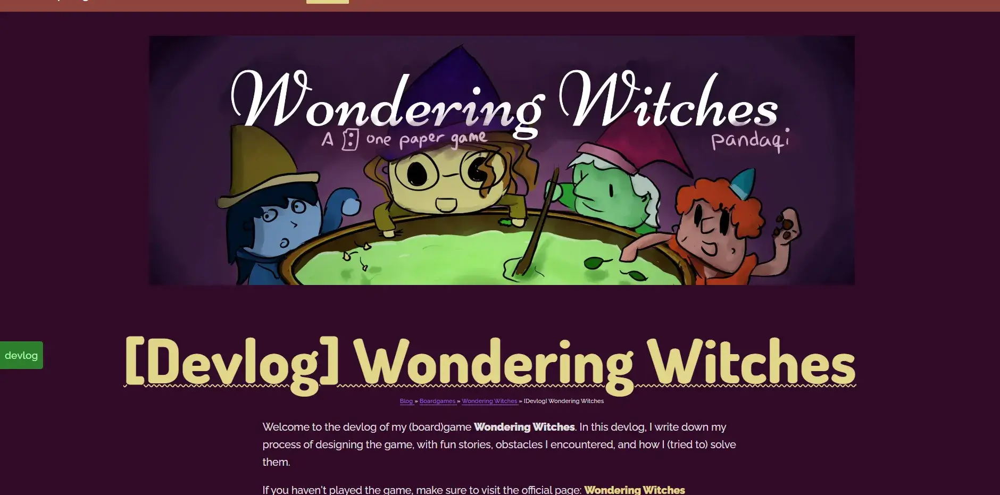
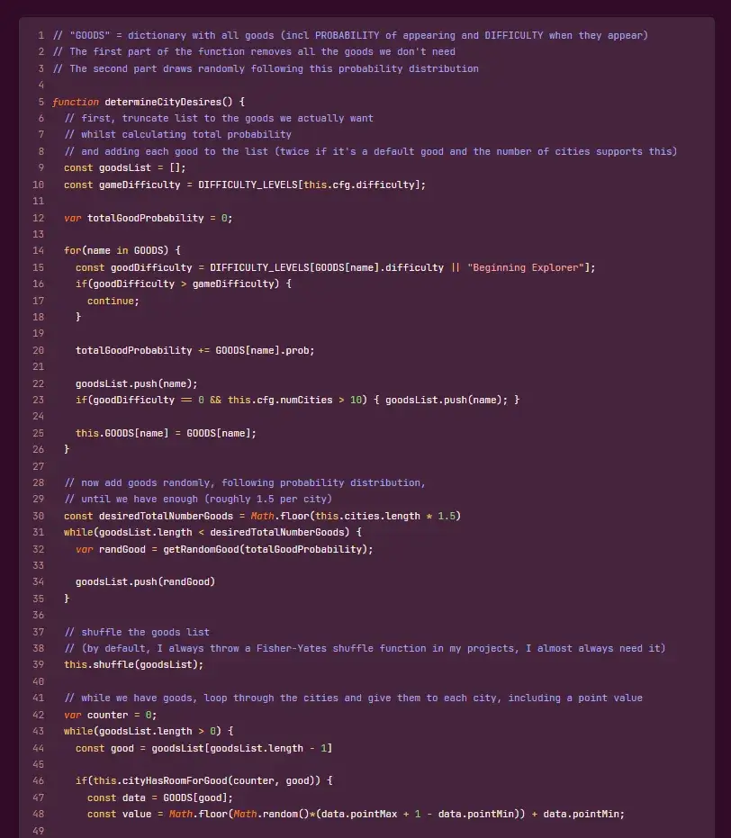
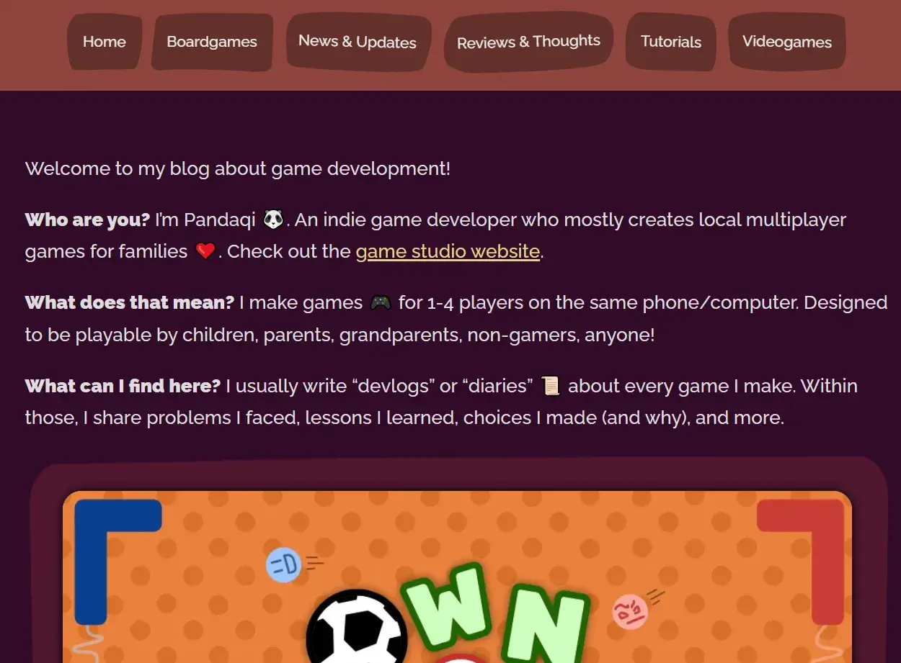
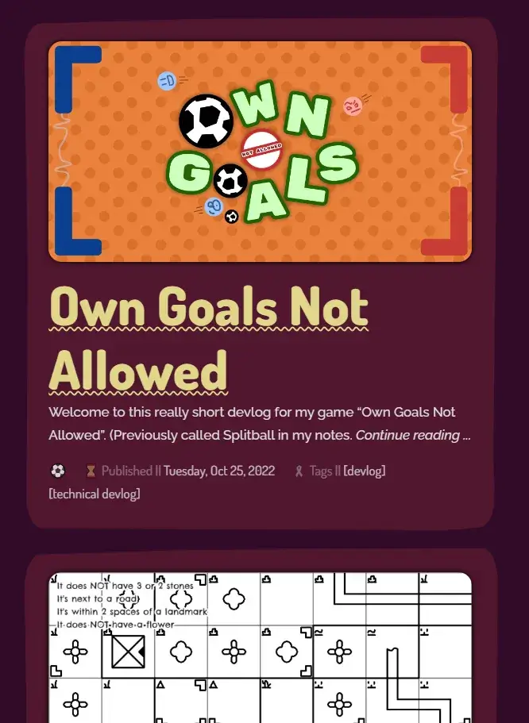
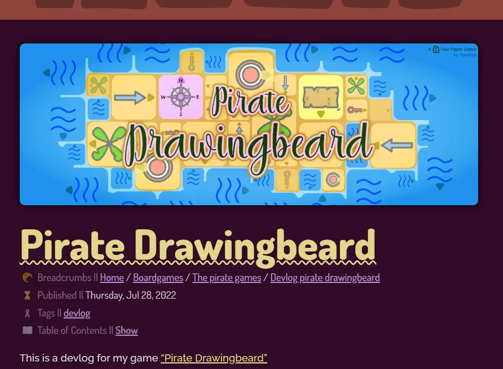
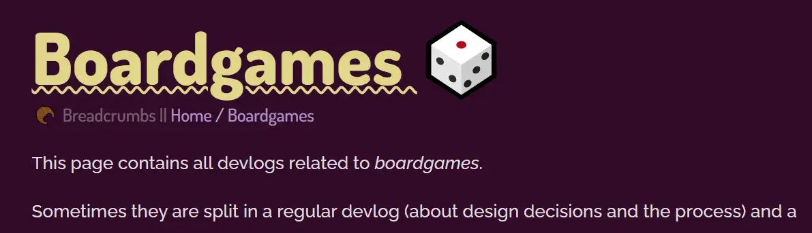

Long ago, when I started my Pandaqi Blog, I wanted to try a new CMS and chose Grav.

It's been ... okay. But all my other websites are in Hugo now, which I vastly prefer. I often didn't upload new devlogs/articles to the blog for months, simply because it was such a pain to do it.

These were some of my major annoyances.

* Grav has a bug that didn't allow me to log in. I had to clear cookies, cache, install a different browser, until I could finally login on most days.
* Grav has another bug that sometimes doesn't save your changes ... (Maybe related to the first, but could never find any cause or error for both, so never filed a bug report.)
* Grav is still PHP and server-based. Which is slower and more clunky than just using static files and developing locally. (I know, PHP is much-improved these days, I have nothing against the language per se.)
* Because of that, I often had to click a button, wait a few seconds until it opened the next folder, click a new button, wait a few seconds, etcetera until I could finally do what I want.
* The "editor" in Grav isn't an improvement or useful tool. It mostly gets in my way and I prefer writing in any other software.

This felt like the right time to transfer the whole blog to a Hugo website. It would make it much easier (and less painful) to add new content to the blog. It would also seamlessly integrate with the main website. (Until now, I had to carefully _exclude_ the "blog" folder when building and deploying the main website, otherwise I'd override the Grav installation and lose the whole blog!)

Here are some images of the old blog. It's very simple, very plain, very rectangular.

## Step 1: downloading the original website
Fortunately, this is easy. Grav has a backup option: click it, download the zip, it has your whole website.

From it, I only needed two things:
* My custom CSS
* My content

I changed the custom CSS to a SCSS file. (Between starting the blog and now, I've learned the wonderful ways of SASS and how I never want to be without it again.) I placed that in the _assets_ folder.

I threw the content directly into the Hugo _content_ folder.

## Step 2: actually transfering the content
A pain in the butt, but not as bad as I feared. Grav already works with Markdown files, in a (very detailed) folder structure.

In case you're thinking of migrating your website, here's what I learned.

### Filenames
* Whatever name your Markdown files used to have, rename them all to "index.md"
* Images/Media should be nicely bundled with the markdown in the same folder. As such, these links all still work and Hugo is fine with that.
* Grav numbers folders. This is a problem now, because it will end up in the URL. Either remove all those numbers, or add a setting to your config to prettify URLs.

### Frontmatter
* Grav uses `published: true/false`. Hugo uses `draft`. Use a simple Find-and-Replace across the whole project for this.
* Grav uses a list in a list structure for taxonomies. Select the part _until_ the tagname. Do a Find-and-replace with that, replacing with "tags: ". Same for other taxonomy, like categories.


taxonomy:
    - tags:
        - sometagname


* I personally like the ``[tag1, tag2, tag3]`` syntax for lists. Don't know why. So I did another Find-and-Replace using a Regular Expression: ``tags: ([a-zA-Z]+)`` replaced with ``tags: [$1]``
* Grav doesn't save publishing dates by default---so I've learned. Almost all my posts where without _date_. I had to search back when they were most likely published and add the date manually.
* Grav saves a "media_order". You can remove this, you don't need this anymore, it was for the editor. _Unless_ your theme uses the first image of this list as the thumbnail/header image. In my case, I thought it was cleaner to remove this anyway and use a frontmatter parameter "thumbnail" for actual thumbnails.

In general, try to find patterns, and use a simple Regular Expression to replace this across the whole project. I used Visual Studio Code. It gives a preview of what it matches and how it's replaced, so you can check if you're not doing something stupid. And it's quite fast.

### Content
Grav sometimes adds weird symbols. Other markdown converters I used in the past (when I wrote in Microsoft Word and converted to markdown _later_) did the same. A simple quote (``"``) is converted to its HTML entity. It might have removed your beautiful em dashes (``---``) for just a dash. Anything could have happened!

These are also ripe for Regular Expressions. When you find something ugly, or something Hugo can't handle, search and replace it everywhere.

With that done, the content is already transferred!

## Step 3: creating the layout
My blog layout is _very simple_, by design, and I didn't intend to change that. 

### HTML
I used a completely blank Hugo theme. I went to the blog in my browser and checked the HTML for whatever structure it had.

Then I copied that to the Hugo templates. I did rename classes, use more semantic HTML tags, and removed things I thought were redundant. But mostly it was just a copy paste of the HTML structure of the previous blog.

### CSS
Any CSS is also SCSS. So renaming the file was already enough. However, 

* I again had some issues with the previous design
* And it's better to use the full potential of SASS to make your stylesheet as readable and flexible as possible (for the future)

So I edited this file to use variables, reusable functions, and nested selectors. In the end, it was a _very_ small and simple stylesheet. I could easily tweak colors, padding, margins, etcetera with the variables I had for it.

That's all we need. It's a very image and text-heavy blog. Its only purpose is to be very fast, clean and readable.

_Naming things_ is such a basic programming skill, yet it's often neglected. The old code (HTML, CSS and JavaScript) mixed up the naming constantly. This led to many bugs and moments of confusion when I was migrating. I spent some time renaming to the following:

* HTML uses "hyphen-case" at all times. If possible, I use a semantic tag for what I want. I rarely use ids.
* CSS uses "hyphen-case" at all times. Thanks to SASS, I can simply nest selectors, so I don't need to write very long descriptors. (If I'm already inside "pagination" I don't need to give links a style "pagination-link". They can just be target with "a" or a class "link".)
* The Hugo files also use "hypen-case" consistently.
* JavaScript uses "camelCase" at all times. I avoid global variables or states like the plague, but if I need some globals or constants, they'd use "CAPS_SNAKE_CASE".

When in doubt, I add a hyphen just in case :p For example, I'm still not sure if boardgame is one word or two words. I'm slowly renaming things across my games to be "board-game" for consistency.

It just makes a huge difference. You never mistype a file/folder/variable/path anymore. You can almost immediately guess what something was called. It just _looks_ neat in your code and in the file explorer.

### Syntax Highlighting
Over the past few years, I've tried to completely cut myself off from external dependencies.

It takes more effort and skill, at the start. But in the end it's just better in every way:
* Faster websites
* More security and privacy
* Complete control; the only way your website goes down, stops working, whatever is because _you_ screwed up
* No worries about services shutting down, becoming paid, or updating to something incompatible

The original blog therefore already had only _two_ dependencies:
* Github Gist for code examples
* Font Awesome for literally two icons

I knew Hugo had built-in support for Syntax Highlighting. The [docs](https://gohugo.io/content-management/syntax-highlighting/) and support are a bit lacking, so it took some trial-and-error to get it working nicely.

To add a code block, simply use the built-in shortcode.



    function thisIsATest() {
        return 5 + 5;
    }



Of course, if the content is _Go template code_, Hugo will just run it instead of displaying it. The docs explain what to do then (add ``/*`` and ``*/`` around it).

Within the config, you can choose your theme. Or you can ask Hugo to create a CSS file from a theme, so you can extend it.

I chose the second option. I find many themes to have either too much contrast (very readable, hurts my eyes) or too little (only some keywords are vaguely highlighted). On top of that, my blog has this dark purple theme, which doesn't look nice. (Most other websites, that display code, already have a color scheme that fits one of these highlighter themes. Mine doesn't.)

I got that file, added it, made it SASS as well, until I had a handful of color variables at the top for specific things (keywords, functions, etcetera).

Then I used an online color generator to generate lots of colors that fit my purple background. I chose the ones with the best contrast. It's not perfect, but I think the final highlighter is both easy to read, and colorful/friendly to look at.

I was a bit confused why there was no parameter for line wrapping. Until I realized I was being stupid and this could be done with three lines of CSS:


.highlight > pre {
    max-width: 500px;
    white-space: pre-wrap;
    word-break: break-word;
}


Lastly, I didn't like the fonts. One of the [tutorials I read](https://mertbakir.gitlab.io/hugo/syntax-highlighting-in-hugo/) used a font I _loved_. I went into the inspector, it turned out to be "JetBrains Mono". So I used it as well, and I like it a lot. I picked the _light_ variant, as the _regular_/_medium_ where just too thick and attention-grabbing.

All that remained was grabbing the code out of all GitHub Gists and throwing them in these code blocks.

Here's an image of what a very long code block looks like:

### More consistency
I _did_ alter the layout to be more consistent with the main website. So it uses ...

* Those wavy underlines
* Those buttons with wobbly rectangles
* The same fonts of course
* Roughly the same structure in header and footer

And most importantly, the old website did NOT have a direct link to the blog, and vice versa. I forgot. It was probably too much work and I already planned to overhaul the blog.

Now the blog and the main (game studio) website are more closely linked.

This image of the front page shows the wobbly rectangles and fonts. I _did_ dial back the curvy underlines, because it could be overwhelming.

## Step 4: Cleaner content
Because I couldn't get Grav to structure things how I liked, I ended up introducing some stupid things into the content.

For example, devlogs all start with **"\[Devlog\]"**. This makes titles hard to read and unnecessarily long. The fact that it's a devlog should be stated in the introduction, should be a tag/category/section, should be in the URL---but not in _every darn title_! I removed all that.

Similarly, I hardcoded links between posts, because Grav pagination ("go to next in section", "go to previous in section") was again wonky. With Hugo I could just get big buttons on the page that always go to the next/previous part of a series. And all those hardcoded links could be removed.

Speaking of that, **most work went into updating links**.

Not only the blog. Across _all_ my websites are _many_ links to this blog. Because it's just so big and has a devlog/article for almost any project.

And now all those links would stop working. (About 25% of them were already dead anyway. Due to the previous blog restructuring, when I tried to make Grav do what I wanted, in vain.)

Fortunately, all those websites use Hugo. They are all in a folder "Websites" on my laptop. 

It's time for another Find-and-Replace! I searched for ``pandaqi.com/blog/`` in all the files. It found 128 links across all websites. I had to manually check if the link was still correct and update if not. (I saw no faster way, as the whole URL structure of the blog changed in all sorts of ways.)

With these changes, there are no unnecessary words or dead/redundant links anymore.

## Step 5: Extending the website
The website needed a few things to be more usable. 

I never intended to create a big succesful blog; I only wanted to make a place to publicly share the devlogs I write anyway. So this blog will always be small and simple, perhaps "barebones".

Nevertheless, I want to make it as _easy_ to read and navigate as possible. I want features that help with ease of reading and comprehending information---without getting in the way.

I settled on these features ...

* Those big navigation buttons. (Within series of articles, or on overview/listing pages.)
* A table of contents for articles. (They can get _very_ long.)
* Breadcrumbs. (The path to an article can have many steps.)
* Some buttons for things most people might want to do: go back to the main website, load a random article, or the latest update/article

I considered adding comments or something like that. I didn't do it. I saw no clear reason. The only website that has comments is my personal blog (in Dutch), because those articles often invite comment. They might be a discussion on a controversial topic, instead of just an article explaining how I coded something. Even then, 99% of the comments is simply "thanks for writing this!" or "was fun to read!" Which is, you know, really nice to hear, but not enough to warrant enabling comments on every article.

I'm very much about staying small, lean, streamlined. I _need_ that because I don't have the resources (money, time, energy) to uphold a large number of complicated websites.

Here's an image of the final look. Notice how it looks way more soft and round. How it reuses those wobbly rectangles more. How it displays actual metadata in the front, instead of only a title and the first sentence. How there's a button for the table of contents.

### Emojis

These were added really late into development, so they might change.

But the idea was as follows:
* The blog is very text-heavy
* I needed another fast way to differentiate post types and what they might be about.
* I thought simple emojis per section/subsection/article would help a lot!

And they do. These HTML entities are built into every browser, so I only needed to look them up on the Emojipedia and copy-paste into the markdown.

These icons left and right really help make the website feel more alive and easy to navigate. (You don't need to read the text to know you're in the video game category, if a huge icon of a controller is displayed.)

It's not perfect. Not all icons look equally great in all browsers, and I'm sometimes not sure where to put them.

But it's a nice addition that I'll probably add to other sites as well. Very simple, but changes a lot.

(Additionally, it helps with streamlining your ideas. If I can't find an emoji to match the article I'm writing/game I'm making ... it's probably too vague, abstract or complicated.)

## Step 6: Deploying
Okay, so the main website (pandaqi.com) is a Hugo site. With its own rules, templates, content, etcetera.

How do we get the blog on there? Without conflicts? Without ever accidentally removing it?

The solution is easy once you see it. (I had to think about this a few hours :p) Hugo automatically copies anything in the _static_ folder directly to the final build of your website. It doesn't change it, it doesn't render it, it just copies whatever is there.

So I simply build this blog the usual way. Then I drag it to a _blog_ folder in the static directory of the main website. Now, anytime I build and deploy the main website, the blog is taken with it! Fully functional. It's already flat HTML files.

## Conclusion

That's it. A very short article (for me, at least) about how I took a few days to improve the blog _a lot_. Hopefully I don't have to do this more often, as migrating content between systems is a pain :p