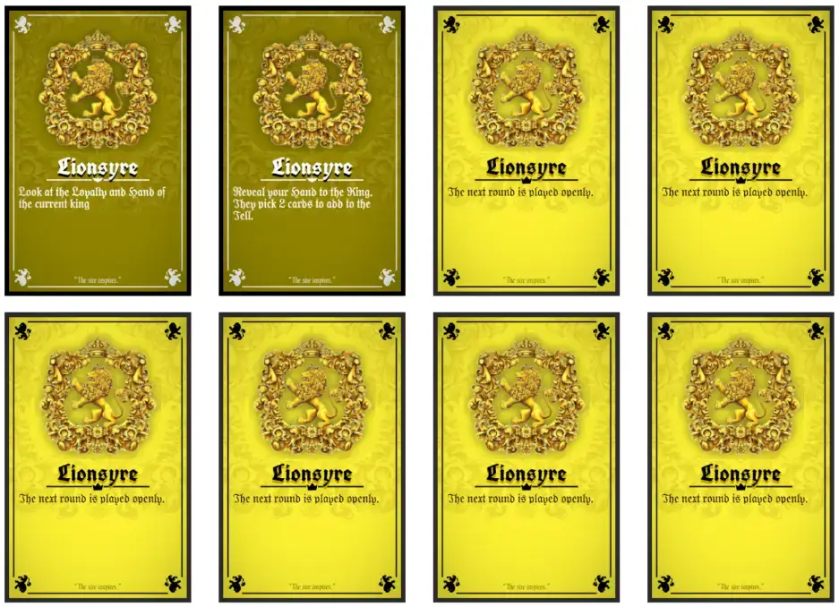

This article is a short explanation of the [Throneless Games](https://pandaqi.com/throneless-games/), but mostly a personal reflection on what their creation and process means to me. I wrote it because it was interesting to realize and perhaps helps other creatives keep good habits and motivation. I also wrote it to have a nice devlog article to link to from the Throneless Games main page ;)

## What are the Throneless Games
In short, they are games which have the same Throneless Mechanic at their core.
* Players receive random cards at the start (each showing one "faction" or "political party").
* Each round, you simultaneously vote.
* The longest sequence of matching votes, judging from the Throne in clockwise direction, wins the round.
* Winning cards go into the Teller; Losers execute their card's action OR swap places.
* At the end, the faction that appears the most in the Teller, wins!

This was a very simple ruleset I came up with after brainstorming. It's consistent, it allows simultaneous turns, and it's _active_ (always changing places or having something to do). 

It was my first attempt at creating a game you _could_ play in a queue or waiting room. Though the games ended up slightly too big to actually do so, it was a good first attempt.

After inventing the mechanic and testing it, I realized several different ways in which you could implement it. That's how one idea grew into multiple, and this became a "project".

But let's take a step back now and see how we got here.

## It all started with Kingseat
Near the end of 2023, I launched a little game called [Kingseat](https://pandaqi.com/throneless-games/conquer/kingseat/). I was both proud of it and disappointed by it. 

Proud because the rules were very simple and the visual design was a _huge_ step up from most of my previous work. This was only the third time ever that I had _generated_ the material for my games on my Pandaqi website. (Which also meant the original code was a mess as I hastily created functionality for the stuff I needed to draw.)

Disappointed because the game was "almost there", but not quite. I couldn't figure out what was missing or how to improve it, though. I made a choice: I'd publish the game as it is, but plan to do an update to this project (and introduce a few spin-offs) in a year's time.

I wrote down three more ideas for games that used the same core mechanic, but applied differently. Then I left it alone.

## Coming back later
The year passed. I came back to these games ... and noticed how one year can make a _world_ of difference.

* My Pandaqi website now has built-in frameworks (which I coded myself) to easily support any drawing, effects, etcetera that I need for game material. What used to be 100 lines of custom code is now just 1 simple call to a built-in function.
* I've made many more games since, learning even more about illustration, design, writing rules, etcetera. Coming back, the improvements to the idea and the cards seemed almost "obvious".
* I've discovered that I usually design games in "projects" or "series" (of related mechanics or ideas). Using this to its full potential, I can share a lot of code/assets and make the website structure _much_ nicer.

I was truly astonished by this. It felt like it was _years_ ago that I started generating my first board game PDFs, that I tried generative AI for the first time, and so forth. Kingseat, and the quality of its code/cards, felt like prehistory to me. 

In reality, it was less than a year.

**That's what happens when you just do something every day.**

Quite invisibly, you rapidly improve at the skill you practice (almost) every day. When I made my other board games, I didn't think I was making masterpieces, or set out to study and "learn" anything. I just made the game idea I had, as quickly as possible, as best as I could at the time.

Repeat it 50 times, though, and your work from one year ago suddenly feels awfully amateurish.

And so, when I came back, it took me only a few days to ...

* Collect all these games under the Throneless Games banner. (Including a master page, shared code and marketing images for that.)
	* This means all the different games now just link to some shared scripts, which do 95% of the work. The other 5% is simply filled with the unique elements of that version, such as the "Throne Cards" from Queenseat that no other game has.
* Comb through all AI generated sigils I already had---I thank past Tiamo for generating all of these ahead of time when I still had free access to it!---and turn them into their final form for all games.
	* This meant 36 sigils. Which need to be cut out, resized, and usually edited to remove inconsistencies, paint missing parts myself, change clashing colors, etcetera.
	* Also, for each sigil, I create a simplified icon by hand. This looks good on the card, trains my illustration skills slightly, but mostly helps players quickly identify the card if they can't see it fully.
* Then look into my past notes on rules and possible actions, and quickly rewrite them into something _much_ simpler and better.

Things that took me a few weeks to code and get right back then, were now done before the weekend was over.

{}
Still not perfect or optimized, of course. I can already see new ways to improve these systems and pieces of code now, but I try not to fall into the trap of perfectionism.
{}

## Examples of realizations
### Example 1: Lack of Info
Things I just _could not see_ at the time were now obvious to me.

For example, one big issue with the core Throneless Mechanic is that there's a lack of _information_. 

You start with random cards, you don't see the other's cards, and there's no control or limits here.

At no point do you have any clue what others are holding. Sure, you can try to infer this from how they vote, but that's very vague and inconsistent.

So I added a few actions to help with this. Which was nice, but you can't solve a _core_ issue with _optional actions_. (You could, for example, just not include those cards in your game.)

So I complicated the setup for Kingseat. At the start, you give 2 cards to your right, then 2 to your left. This at least gives everyone some information about each other's hands. Which is _better_, but now the rules aren't as clean as I'd like, and it's not _great_.

When I returned to invent the details for Smallseat (the simplest next version), I immediately saw the actual solution.

> Almost all actions require giving away information about yourself for a greater reward.

Instead of saying "You may look at another player's hand", we say "Reveal 2 cards; then look at another player's hand".

Instead of saying "Swap with another player", we say "Show a card from your hand; swap with any player who also has that type"

When actions are created this way, almost everything gives you information _of some kind_. Actions aren't as black-and-white, but players need to constantly evaluate if they're willing to give up some bit of themselves to get the reward.

You can actually strategize and do smart moves, without changing or adding _any_ rule to the game. (And I do very much try to keep my rulebooks absolutely as short as possible.)

### Example 2: Lack of Variety/Control
Another issue that popped up in playtesting is the lack of control.

As a reminder, this is how you find the winner of a round:
* Start from the "Throne" position (the King).
* In clockwise order, find the longest sequence of matching votes. (So, votes for the same faction next to each other.)
* If there's a tie, the first one wins. (That's why the "clockwise" part is very important.)

Ties happen regularly. Checking clockwise, from the Throne, really _matters_. (If you start elsewhere or go the other way, the winner changes in many rounds.)

That is good. But in reality, players don't swap places _so often_ that this order completely changes all the time. There are many pairs of rounds where voting happens in the same way, or the vote of the Throne is simply the one that wins.

Similarly, because players can pick _any_ card from their hand, there isn't much certainty about what will happen next round. You'd need to know basically all cards of another player, and have a deep understanding of their psyche, to play into it :p

Again, with Kingseat, I added some actions to play with general voting rules, such as triggering a "public vote". But, again, these might not be included and this is very indirect.

When I came back, I saw the obvious two solutions.

> Allow the King (whoever sits in that main position) to pick if we go clockwise or counter clockwise. (Or any other decision that adds variety to the core rules.)

> Add actions that limit/control what players can do _next round_. (Maybe they can only play the type they have the most. Maybe they can only play the card they played this round. Maybe checking starts from someone else than the King.)

The whole idea is that this "King" location is special and valuable, so giving it extra powers makes sense anyway. Doing it in this way also solves my major gripes with the idea.

{}
I also had a moment when I considered if the entire idea of "checking votes in sequence" was even necessary. Can't we just say the type with the most voters wins? And only if there's a tie, pick the one closest to King?

This is the downside of being away for so long: you forget why you did certain things. It took me a while to realize that the entire core of the game about "swapping places" is meaningless if order / position doesn't matter :p So no, this core mechanic surely stays.
{}

These are just two examples of major issues I personally had with the original Kingseat---why I thought it was "almost there, but not yet"---and the extremely simple (nearly invisible) way to alleviate most of that. Things I just _could not see_ (or implement) only a year ago, but were now the very first thing I thought was worth a try.

### Other tiny realizations

**Readability:** When I made Kingseat, I used the same "medieval" font for the body of cards ( = the specific action text) as I did for headings and the Prince title. This was "pretty readable", and so I accepted it.

Coming back to it, I realize "pretty readable" just isn't good enough. We don't want players to have _any_ trouble reading a card at a glance, no matter their age, reading comprehension, etcetera. The font I "accepted" a year ago just felt amateurish and too illegible to me now.

So I replaced it with a much more readable---but still thematic---font. This made the cards much easier to read and even allowed actions to be longer without overflowing (as this font is more compact).

Most importantly, however, I immediately added a "blurred rectangle background". This is a technique I learned somewhere in the past year and it has proven a _great_ tool in the design toolbox. So great, in fact, that it's usually the first thing I try.

What is it? Well, I simply draw a white rectangle behind the text and add a slight "BlurEffect" on it. The blur allows the rectangle to seamlessly "fade into" the surroundings. The solid white middle creates a nice background that makes text highly legible.

This is a few lines of code, but it looks good and improves readability by 10x again. A solution I just didn't know a year ago, but which I try almost immediately now.

**Text Formatting:** When I made Smallseat (the next version after I came back), I added text formatting to the actions completely subconsciously. In the past year, I'd coded support for **bold** text, _italic_ text, icons within text, etcetera. So I used all of that to make the actions as clear and pretty as possible.

Then I realized ... I hadn't done any of that for Kingseat, because the whole system didn't exist yet! In fact, the website didn't even load a different version of the main font, which means _italics_ were "faked" by the browser. (Which always looks way worse.)

So I also updated the Kingseat actions, loaded the other font variations, and it all just looked much better. In any game, a large part will be text, so if you can automatically support nicer fonts and text formatting it just goes a long way to looking professional.

Something I do instantly now, but I didn't do (as consistently) a year ago.

Check out the comparison between the different versions below. This change is ~5 minutes of work in code, but is a world of difference when playing.

## Game Differentiation

When I invented the four different Throneless Games, I envisioned them as "slight variations" with different animals and specific actions. A year later, I know this _doesn't work_. It makes the games too similar to stand on their own and feel worth making/trying. Too similar to feel like I actually explored all opportunities here.

I noticed this when I came back and just kept "inventing" actions ... that I'd already invented for another version. Because the games were _so_ similar.

Now I know that you actually want to make the different versions unique _at their core_. You want to look at that interesting simple mechanic you invented, and ask yourself all the possible ways to twist it and turn it on its head. For each unique direction you find, create a new game. This leads to creative ideas, this makes each game stand on its own, this actually makes development _easier_.

If I'd finished this project a year ago, all four games would have used an identical core mechanic and just variations on what the animals do. 

Now all four games have unique twists in their setup, objective and gameplay that make them worth their unique title. Namely,

### Smallseat

The simplest version clearly aimed at kids and meant to be played without table.
* Single action per animal
* One player _holds_ the voted cards (= Tell)
* The Boss chooses voting direction each round 
* Swapping places also swaps a card.

### Queenseat

A slightly more complex version that changes the objective, but can still be played anywhere you can stand in a circle.

* There is no Tell/Discard (all players hold all cards in their hand the whole game)
* Because the Objective is to sit on the Queenseat when the game ends (_not_ to get the most votes for your secret party perse, though that helps)
* An added rule limits what you're allowed to vote every round

### Kingseat

The original version that tries to strike a balance between "very light waitless game" and "more traditional game".

* Each animal has one regular action and two Dark ones (which have a wild impact and balance it)
* The setup is slightly more involved to make sure players can "design" their hand or have more information from the start.
* Similarly, your Loyalty ( = if this Prince wins, you win) is picked at the _start_.
* All of this allows the core rules to be the simplest of them all.

### Kaizerseat

* The actions can be many different types (when revealed, when inside Tell, when winning vote, ...).
* This means they always trigger and you can't choose to swap instead by default. (You only swap places if your action does nothing / is not executable.)
* This also means _every_ single aspect of the game is configurable, changable mid-game, controllable.
* But this requires more text on cards and harder actions to comprehend.
* A random Throne card twists the rules for each game/round.

## What is your point?
Even though I _know_ doing something every day and just trying a lot of things will make you grow rapidly, I was _still_ surprised by this.

As stated, it felt like making Kingseat was a tough process that I went through ages ago. It felt like the problems of the games were unsolvable and I'd tried everything.

Less than a year later, I had systems in place to make all 4 games in the project a breeze to setup and generate, and I quickly saw some "obvious" ways to at least implement the core mechanic better.

At first, when I came back to the project, I wanted to "copy-paste" the work I did for Kingseat. In my mind, Kingseat had been plugged into my Pandaqi systems long ago, and I could plug in the others the same way.

Then I was shocked to read the old code and realize all of it was manually drawn, not using _any_ of the functionality I'd been using for all the other games the past year. After making 20+ games with that, I was so accustomed to it that I _misremembered_ also making Kingseat using those systems and workflows.

The memory of humans is ... well, bad. When you do a little bit every day, all you remember is that you "barely did anything yesterday". While in reality, if you manage to look objectively at where you were a year ago, you'd see that you progressed in _huge_ leaps and bounds.

So, in conclusion, if you want to get good at something, just go and do it every day. Just a little bit, just playing around, just making stuff without a goal, it _all_ helps tremendously to become much more skilled in just a year.

Who knows, maybe I'll return to the Throneless Games in a year or two again, and immediately see other "obvious ways" to increase the quality 10x ;)