The original title for this article was "nobody becomes anything overnight". While true, I was afraid this would set the wrong tone or give the wrong impression. Because this article merely showcases my journey to becoming a game designer.

I will reveal my interesting flaws and successes, hopefully inspiring others _and_ showing the truth about what it means to become good at something.

Why? Well, this article started its life when I ran out of space around my work area.

Over the years, I've made numerous games, and the number only seems to increase each year. Most of those games are _board games_, which means I have printed and cut physical materials. As it turns out, physical items take up _space_. 

When I made my first few games, I could easily stash them away in some random container. They were just a handful of cards, or a few playing boards printed on an A4 paper.

Until the pile grew to 10, 20, 30+ games and didn't fit anymore. Even worse, it was hard to find any game in this mess (whenever I wanted to show them or play them again), and their contents kept spilling out. Younger me didn't even have the patience to put an elastic or _something_ around the cards and tiles I cut out, which meant they were free to move all over my desk :p

Needless to say, I needed a better structure. 

That structure isn't the important part. (I simply bought some sorting boxes with variable divisions, so I can store a bunch of games neatly in one box. Revolutionary idea, I know. Buying storage boxes to store things.)

What's important is that I had to take out, look at, and clean up _aaaaaalll_ the games I made throughout my whole life. This gave me an opportunity to look back on all of them and hopefully say some interesting things.

{}
All early games will have some Dutch text written over it. It took a while before I defaulted to creating games in English. I'll translate whenever it's important.
{}

I apologize in advance for the image quality. I have the cheapest smartphone I could find and live in an old house that's very dark. No amount of lights, flashlights, waiting for sun, etcetera could make these images any brighter. (I ended up applying an automatic post-processing filter to all images.)

## Who are you?

I'm Pandaqi, or Tiamo Pastoor. A freelance artist who creates video games and board games (though mostly board games), writes books, creates music, and much more.

I'm not perfect by any means. In fact, I've never even had a game traditionally published. I call myself a game designer because I _design games_. (A lot, for a long time now.) Not because I have won awards, or think I'm amazing at it, or whatever.

I _do_ know that I am a much better designer than I was five, ten, twenty years ago. I know I've learned a lot, I know many of my mistakes are common across new game designers, and I know the things I make now are consistently good-looking and somewhat fun.

This article simply chronicles my process until the present day.

## High School

The earliest games I can show you are from when I was at high school. I know there are a few earlier games, but they are lost to time. 

(I was probably the only kid at elementary school who was part of the "board game club" in our village. I was certainly the only _kid_ who was a member of that club.)

### Maps & Cards

I basically had an obsession with two things: _maps_ and _Pokémon_.

Every game I made was either ...

* A card game with made-up creatures and attacks
* Or some tile-laying game in which you build a railroad or network or whatever. (I also drew a lot of fantasy maps at the time, and I honestly became quite skilled at drawing that particular kind of map from imagination.)

Below are images from two of those card games. The first game was from the _start_ of high school, the second near the _end_ of high school.

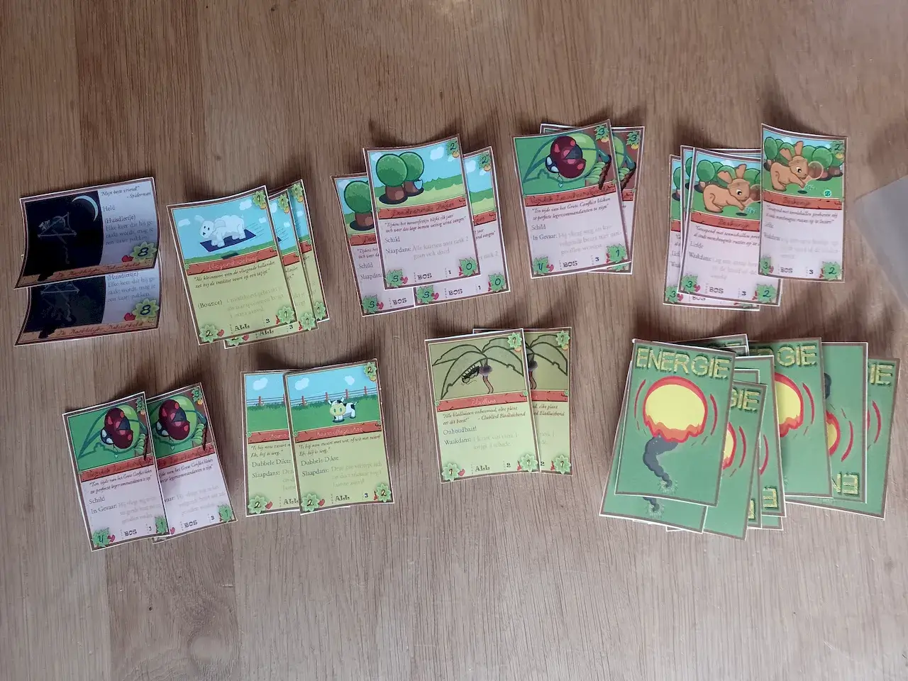

You can clearly see the progression in terms of graphics and design. I can't really speak to the game itself, because first of all those cards are _completely unreadable_, and secondly I lost the rulebook.

I can't remember ever playing the first game with someone. 

I _do_ remember playing the second one---it's easier to get people playing when it _looks_ somewhat good---and getting my first taste of "testing will reveal a thousand flaws you never saw coming". I remember the cards leading to a stalemate or locked game half the time. In other words, if a certain combination of cards was played, the game literally _could not continue_ according to the rules.

As expected, I abandoned these projects rather quickly.

**UPDATE!** I found some of those old fantasy maps, and hidden inside were some games that were probably even older. I have absolutely no clue how to play them or if I ever tested them with somebody, but below are some images of that.

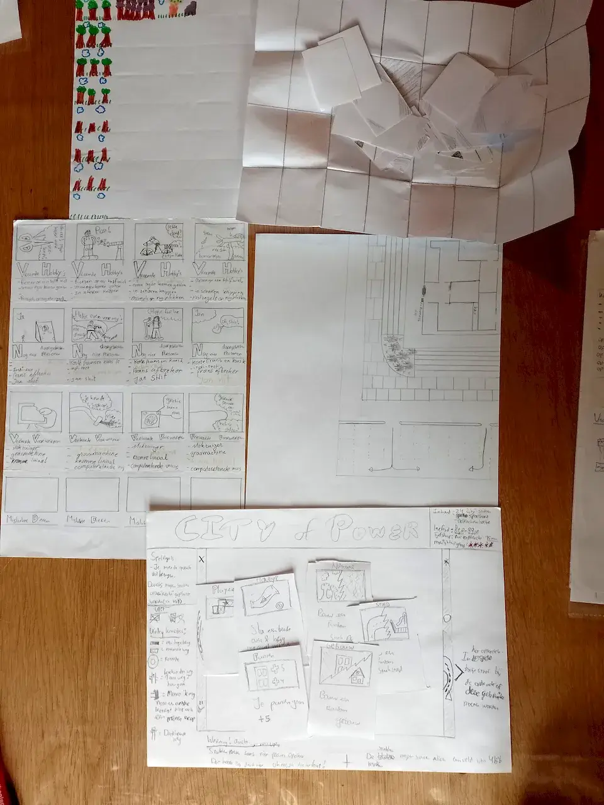

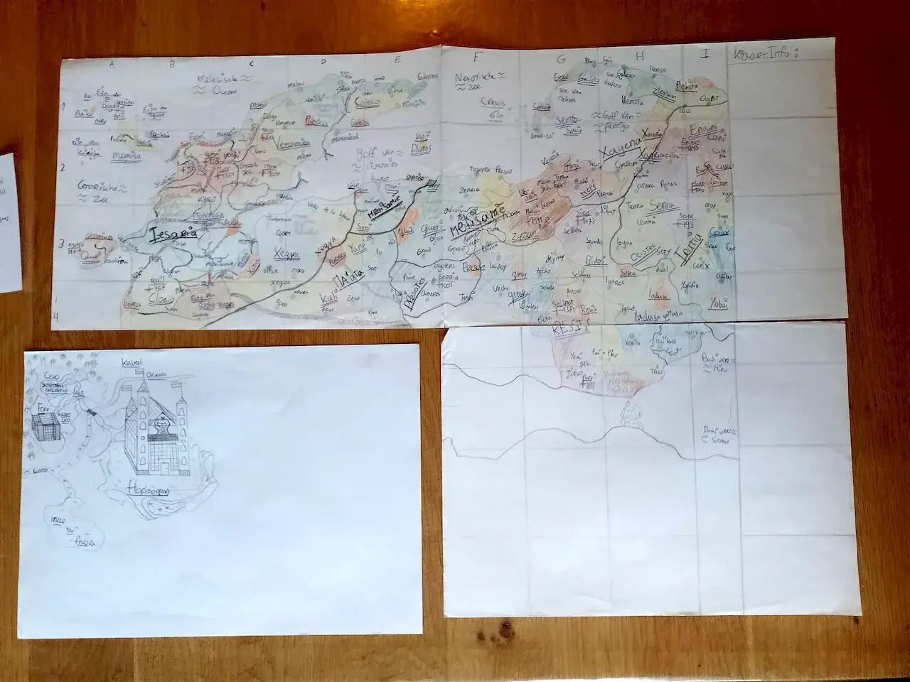

End of update, let's continue the article!

Below is an example of such a tile-laying game about creating roads.

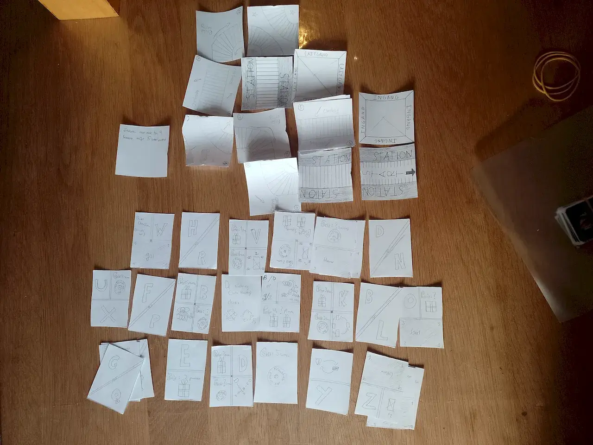

For those who are confused, it is themed around a Dutch cultural thing called St. Nicholas (_Sinterklaas_), which means I probably made it especially for that event. (It's basically Christmas but a few weeks earlier and with some other questionable changes. In any case, gifts are involved, hence the gift icons.)

Again, no rulebook in sight, but these tiles clearly paint a picture of the general game idea. Place roads, connect stuff, get points. We must've played this on the night itself, but I can't remember any of that. Anyway, also abandoned and probably really bad.

As you can see, during this period I already did a mix of hand-drawn prototypes and digital graphics. I had played so many board games that I had a general _idea_ of what a good game looked like. I knew you could do fun stuff with tiles and networks. I knew you could create cool games with cards. But I was certainly not skilled enough to actually _do_ that.

It might be hard to believe when looking at the images above, but I focused 90% on _graphics_ and only 10% on game design. Which is another reason why I only have the cards and not a rulebook for these games.

### Going bigger

Are we done with St. Nicholas? Of course not!

With my new graphical prowess, 15-year-old me obviously thought I could make a _professional_ game now.

I decided to use _The Game Crafter_ to create an actual box, with actual cards, and actual components. I also somehow convinced my parents to financially back me up on this one, which was a bad idea in all possible ways, as the eventual cost of this game ... well let's not talk about.

Anyway, a third obsession reveals itself: _Werewolf_ (or _Mafia_).

To this day, the idea of Werewolf still feels strong to me. Hidden role game, with tension and betrayal, playable with just some cards, playable with big groups. Now that I'm older, however, I must say there are plenty flaws and downsides in that game and I wouldn't quickly play it again. That said, I am _still_ regularly trying to find a set of rules or ideas that would create a "better werewolf". (Some of those ideas are literally labeled "werewolf but better?")

{}
In fact, all through high school I tried to organize Werewolf evenings with friends. We barely played any Werewolf, but we _did_ consistently have fun get-togethers :p 
{}

So what did I do? I repurposed famous characters from the St. Nicholas "lore" as hidden roles in a Werewolf-inspired game.

In keeping with the trend, we only played this thing once, and it wasn't even that night. A few years later my mother found the box again and said "we paid so much for this, surely we should play it!"

And we did. And it ... kinda worked?

This is the first game where I really focused on the gameplay and the rulebook as well. The first project I actually _finished_! 

It was certainly playable. I wouldn't call it _good_ or _an improvement over Werewolf_. After that evening, I immediately wrote a second version of the rules. (At this time, I was 22 years old I believe.) With my experience, it was easy to see all the flaws and simplify the rules.

Still, it showed some potentially unique ideas.

* People also had _day_ roles (besides their night roles). These were clearly separate, but did influence each other in fun ways.
* The night actions mostly consisted of _stealing wooden components_ from the center of the table. I thought this would add some stealth and extra strategy. It, again, _kinda_ worked.
* The day roles, however, took too much time and would slow down the whole game. While most roles were certainly _interesting_ and could be used for strategy, they were just too convoluted and slow. (They also required way too much material. This game has _so many different chips and tokens and what not_!)

The imagery was quite clear. The rulebook wasn't half bad. And, as I said, I actually _finished the game_ and it was _playable_. 

Those might seem like obvious requirements for a game---and they are---but achieving this was a major milestone. Making games is hard. Learning how to do all the parts well is hard. Compare this game with what I made just ~5 years prior and it's a world of difference. 

I think everybody who designs their first game will create an incoherent mess with contradicting rules, which they'll abandon way before it's done. It's just part of the process of becoming a better designer.

So what did I learn? The price of this _one print_ and the complexity of it all basically taught me to _simplify_ and become more _minimalist_. This should have been my peak when it comes to complexity, but as it happens with stubborn teenagers fumbling around, I only really learned these lessons a few years later ...

## Start of university

### Tower of Zero

Near the end of high school, during a long break (because many teachers had fallen ill that day), I basically made up a whole card game with a girl sitting next to me. It was a weird day, but it was fun and exciting to just _create_ something and immediately test it, and to do it together.

I met her again at the start of university and we recalled this moment. That convinced me to cycle home and work on the "official version" of that game right away!

At the end of the weekend, I had created "Tower of Zero: Ultimate Edition". (Yes, we're finally naming projects now.)

As you can see, the graphics received a boost in some ways, but degraded (compared to the previous project) in other ways. (I clearly hadn't figured out that things should be at a high resolution when printing.)

This is common. Many people think that learning or progress is a straight line, always going up, but it's absolutely not. Sometimes you happen to do better, sometimes you just happen to do worse. You have good days and bad days. You have challenging projects and projects that really suit you and flow easily.

I remember really struggling with trying to make these cards look good and keeping the text legible. I just didn't know how. The game had no "theme" to anchor to---it's just an abstract card game about numbers. I'd never done something in this vein before, so I gave it my best shot and that was that.

That said, these cards are certainly _playable_ and they are more consistent and minimal than anything I did before. The whole game is just this one deck of cards in the same style.

The rules were also better than anything I'd done before. (I actually printed and kept the rulebook! Hurray!) They are still too long to explain completely here, but the general gist is ...

* On your turn, you play a number one above or below the current one.
* If you're ever able to play a "0" on a pile, you win the game.
* To make this work, the "0"-s all have different unique rules for when they may be played, and other numbers mess with the pile a lot.
* The most common actions are things that _split_ and _merge_ piles, and things that force you to give cards away or steal cards.

We're still in the stage, however, of "the rules work but it's not great". The explanation above is quite simple and the game _can_ be really fun and quick. But it's mostly just random and luck-based. Again, I barely played this with anyone, because it's just _not that fun after the first time_.

### Coup & Resistance

This is also the period in which I started imitating (or simply copying) existing games. Partially because it makes _great_ training, partially because I wanted to play those games but didn't have the money to buy them.

I probably copied more, but the ones I clearly remember are Coup and The Resistance. Unfortunately, I threw away my own Resistance artwork once we got the real game. But I still have Coup!

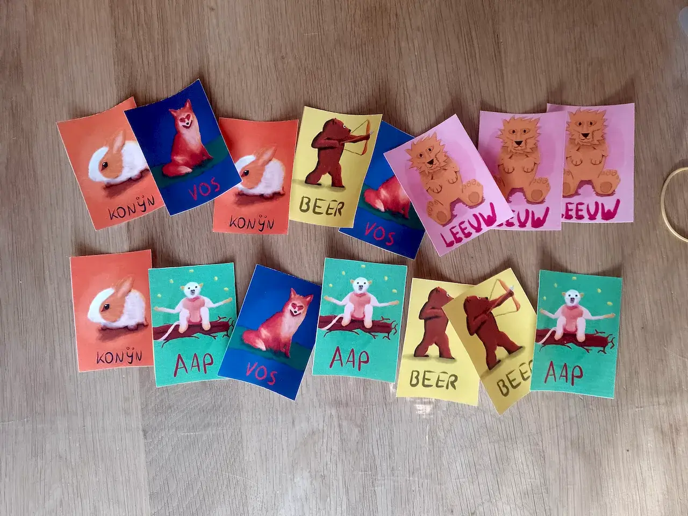

As I said, this was mostly training. I saw this as an opportunity to practice painting some animals and gold tokens. (I simply repurposed the characters from the game as random animals.)

But I _do_ remember playing this quite a lot with others. 

It's a clear indicator that _Coup_ is a really good game, and my own games at that time were not :p

That's another thing I've learned. Whenever I tested a new game of mine, I obviously asked what people thought of it and whether they had any critique. Most people think you're supposed to be "nice", so they lie and say "no it was fine!"

Don't! That's completely useless! If a creative person asks for your feedback, give them your actual feedback.

Anyway, I learned to simply _read_ other signs. When the game is good, people want to play another round. They maybe even _assume_ we're going to play another round and already shuffle the deck. If it's not, people immediately stand up once the game is done.

Similarly, a bad game prompts no discussion. We test it, it's not great, I never hear anything about it again. I know a game is _good_ when, two days later, one of the people with whom I tested suddenly goes "you know what you should do? Add a monkey to that card game that can do action X!"

It shows it was fun and interesting enough that people thought about it and want to say something about it.

(The third sign is obviously just ... enjoyment. Laughter. Funny jokes. Active participation in the game.)

Studying the art and rules of famous (good) games, and trying to copy or imitate them myself, was a _great_ learning tool. 

There's this stigma around using references or imitating others. I think that's a terrible influence on all the creative people in this world. I wish I'd copied and imitated, without shame or hesitation, much more and much earlier in my development. 

As with most creative people, I automatically reached a point (after perhaps a handful of imitated games) at which I wanted to deviate and add my own ideas again. There's really no danger here of truly getting stuck blatantly copying others ideas your whole life. (Not if you're in it for the creativity and the games, as opposed to money or easy success.)

### More network games!

After the previous phase, I went on a rampage creating games all about networks and travel again :p Returning to my first love and all that.

I created three in quick succession, each one better than the other. (On my Dutch blog, which was my only website at the time, I named these "spiritual successors" of each other.)

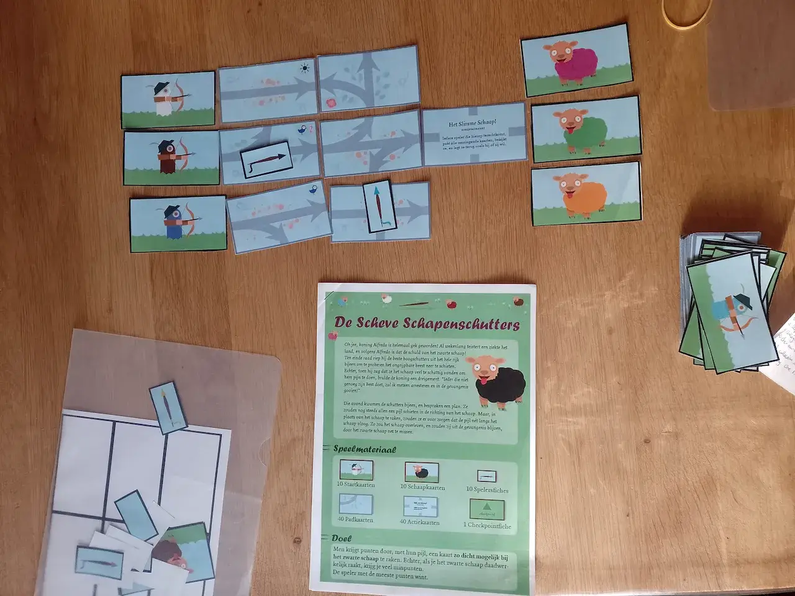

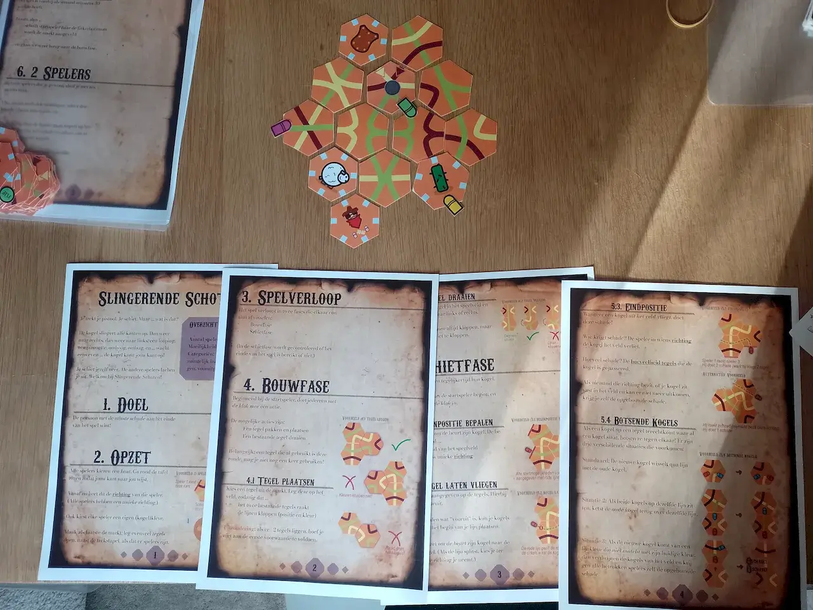

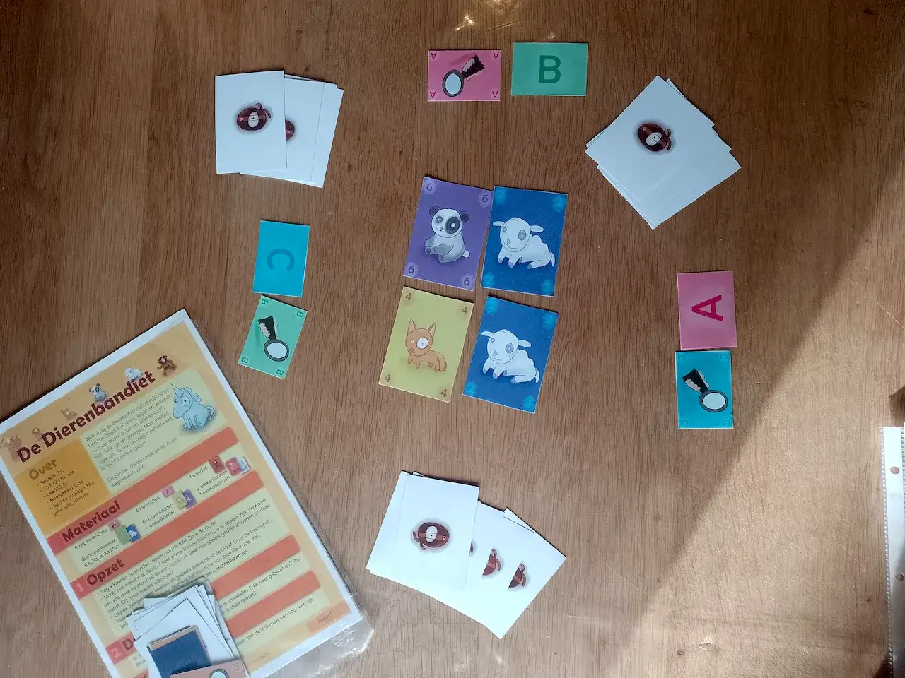

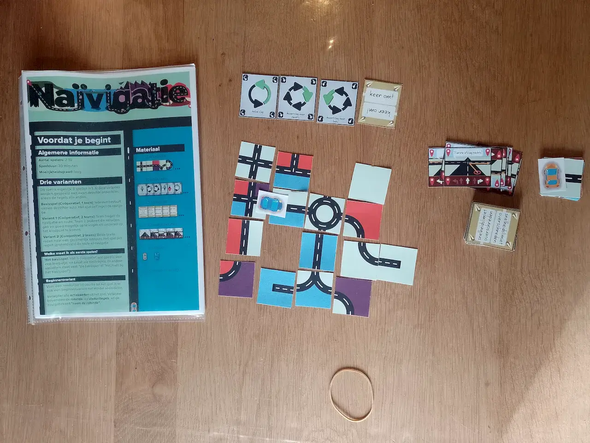

What drew me to these games? I guess it was the _randomness_ and _variety_, combined with that minimalism I was searching for.

I've apparently always been annoyed that (great) board games only had _one_ fixed board. Only one world, one layout, and that's all you get. 

With tile-based games (which combine to create a network), every game has a completely different world! As you play those games shown above, you keep adding more tiles to the world, creating an entirely different layout/network each time.

Additionally, those games were (mostly) a deck of tiles and nothing else. Not a bunch of different tokens/decks/whatever, just _one consistent type of material_. Minimal and simple.

This is the point at which I finally focused on _game mechanics_. All these games have a great rulebook with lots of images, examples, etcetera. All of these games have actually been tested several times and improved upon.

Again, you may think "duh, of course you test your games and give examples in the rules!" 

But it's not that obvious, or easy, or even _possible_. Especially not when you're still very much a beginner designing your first few games. (Even counting the games I'm pretty sure I made but lost somewhere, these were only my ... 10th game and up?)

With every project you make, you overcome _one_ flaw. You improve _one_ aspect. You make _one_ fewer mistake. 

A beginning game designer will not worry about a neat rulebook if they haven't even figured out how to put legible text on a card. It's one step at a time, and only now did I arrive at the step of "test and iterate on a good rulebook".

With the exception of the sheep game (the first one), these games can actually still be played today! They are on my Pandaqi website, which I'll talk about soon. I deemed the sheep game too bad to put online, while the others are "acceptable and maybe fun for some". (Additionally, the sheep game was in a format that made it really hard to translate to English and share.)

The "Swerving Shots" game was the first game I ever introduced to and tested with my friends, with whom I held regular game nights at the time. (We still do, just less regular now that we're boring _adults_ with _work to do_ and stuff.) 

My friends are smart. I've studied Mathematics, and people always called me a genius, but let me tell you: I seem a dumb stumbling fool compared to all my friends (and classmates) at university.

As such, just one test game with them immediately prompted five smart ways to improve the game. It really _showed_ the power of testing games with other people, especially those who previously had no clue that you were even working on the game. They bring a fresh perspective and solve issues on which you've been stuck for a while. (Also, pick really smart playtesters, it helps.)

But what does an "improvement" mean? How do you improve rules? During this period, as I iterated on basically the same core design, I gained more wisdom in this area.

* Simpler is always better. Try to keep everything focused on _one_ system. Try to solve multiple problems with _one_ rule.
* Try radical changes. Only changing one minor thing and then playing again won't really tell you anything. Best case scenario, it will only bring you towards the better rules _really slowly_.
* Look for the fun. "Clever" rules, or mechanics, or systems, or balancing ... is all worthless if people aren't having fun.
* Don't expect people to keep _anything_ in their head. Reduce the overhead, reduce the mental calculation. Put everything _on the board_ (or _on the cards_), at all times, as reminders.

The list could go on and on. Every test of these games revealed other major flaws that have taught me lessons I still use to this day.

I guess the biggest lesson is that it's valuable to pick _one idea_ and _iterate on it_ for several games in a row. It allows you to gain much deeper knowledge for once, instead of broadening your knowledge.

The last game---Naivigation---is fine as it stands, but I've always known that it hides a true _gem_ of a game. So it's always been my plan to revamp it. The idea is strong, the execution just okay.

That's another lesson. When you're just starting out, most of your ideas or intuition will be right, it's just that the _execution_ is severely lacking. As such, I think it's smart to pick your first projects based on what you can _execute_, not based on how good you think the idea is. Otherwise you'll get frustrated and give up, because the idea is _so good_ but you just can't _get it to work_!

My ideas folder is filled with things I came up with yesterday ... and things I came up with 15+ years ago. Yes, newer ideas are generally more refined and "fully cooked". But some of my oldest ideas still seem brilliant and I want to find the time to make them one day. I am glad that I've had the good habit of _writing stuff down_ for a long time.

### Che-ou-wyen

Here we go again. Once more, my younger self thought "I've made ~15 games in my whole life, surely now I'm ready for _the real deal_!"

I started work on this huge, complex boardgame about economy, selling, making products, etcetera. It was themed around smartphones/computers and the whole pipeline towards creating and selling them.

{}
There is a sadder story attached to it, thought. I made the game after the sudden death of my brother, who worked at ASML and was thus involved with the whole process of creating chips for computers. I somewhat started and finished the game for him.
{}

In my estimation, it would take 2--2.5 hours to play. It had loads of different components (cards, tableaus, tokens, money, ...)

_"In your estimation"?_ Yeah, it was never played. It _was_ finished. Or, at least, a first (rough) version was done.

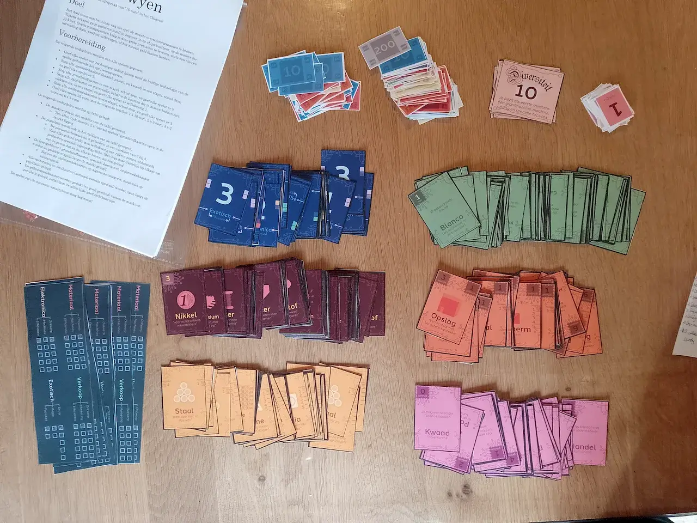

Once again, I focused on the graphics first, and basically convinced myself "well I can always change the rules, I'm pretty sure this first idea of mine will work out!"

By now, you know---and I _should_ have known---that the first version of the rulebook rarely works out.

The game was so _big_ that I was burned out once the first version was done. I didn't even feel like playing it myself. That's never a good sign, of course, when a game is so complicated that you don't even want to _test_ it :p

This hammered home the idea of keeping things _simple_ and _minimal_, as well as focusing on _rules_ first and _testing_ early and often.

The name, by the way, is a terrible way to write the Chinese word for "10 dollar" (if I remember correctly). Because this game _did_ have one neat trick that was promising.

> Anything you sell in the game has to have _more features_ than the previous product, but always sell for 10 dollar.

This is great because it forces players to expand and grow their business, without blowing up the amount of money circulating in the game. (As such games often tend to do. By the end of Monopoly, for example, the players left are just swimming in absurd amounts of money. It makes the game more complicated, slower, and just less fun in general.)

This engine would probably have made a really good game, had I not buried it underneath layers of needless complexity. Oh well, maybe I'll make the proper (simpler) version one day.

As you might expect, after the death of my brother I struggled my way to a delayed graduation. I had no time nor energy to make more games until I had finished my degree. (I did write a few stories and a lot of music, but that's not relevant here.)

So let's jump forward to ...

## End of university

### One Paper Games

Still traumatized by Che-ou-wyen and its complexity (probably), my brain invented **One Paper Games**. 

I can't remember how or when the idea came to me. I guess it was after I'd played a few roll-and-write games, as I remember buying a few of those at the time.

But the idea is simple: create games that you can play by printing _one paper_ and _writing_ on that.

This seemed ideal to me. It forced me to keep the ideas _simple_, as you just don't have that much space or possibilities. It also made my games instantly more unique and accessible.

This moment, which coincided with leaving the terrible educational system for good, was my first "game design boom". In short succession, I made ...

* Paper Thieves (the first OPG)
* Epic Medics
* Wondering Witches
* Timely Transports
* Unstable Universe
* Starry Skylines
* One Pizza the Puzzle

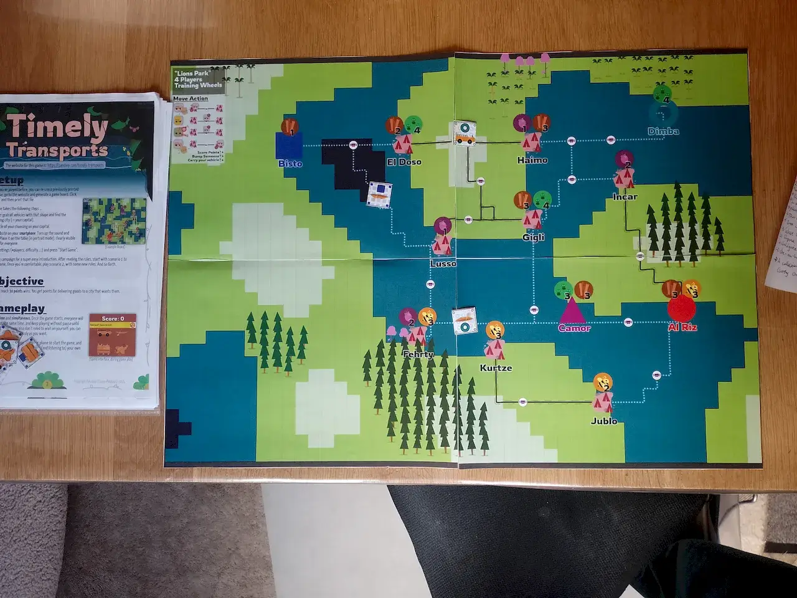

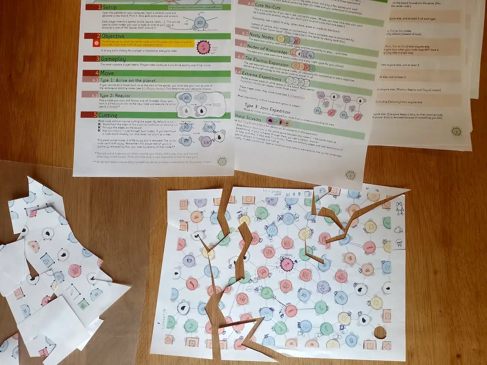

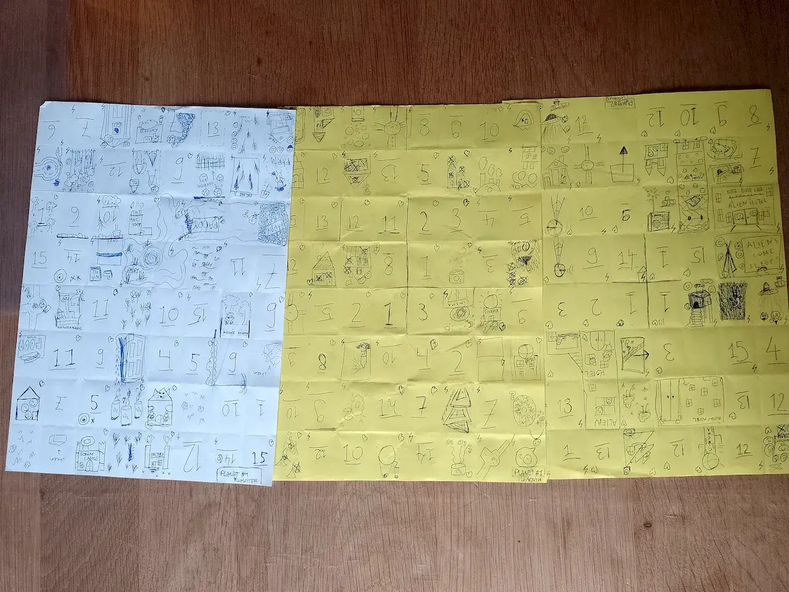

Each time, I got better at generating the random boards/puzzles and simplifying the rules. The difference between Paper Thieves and One Pizza is still huge, even though they have the same core idea and weren't made that far apart. (Again, iteration and just doing something a lot will make you better at it.)

Like the other group of games (about networks and tiles), all of these are still online, but the first ones aren't all that good and might disappear/update. 

**Paper Thieves** is just a very mediocre game. But it was the first time I tried a One Paper Game! It was the first time I made a game which you played by _writing_ on it. I still had to figure out, well, basically anything. (It is a very _simple_ game, though. Probably the simplest I'd made to date.)

**Epic Medics** is a good game, but I approached it in the wrong way. I tried to turn a One Paper Game into a heavyweight strategy game that can take 2+ hours. Even if it's fun and challenging, sitting around _one paper_ and _writing symbols on it_ for that period of time isn't the best use of this idea. (Additionally, I focused so much on the rules that the art is lacking.)

### Hybrid Games

Epic medics also carries another, more subtle, honor. It was my first **hybrid game**. When I finished the whole game, I suddenly thought: "huh, wouldn't it be fun if you could get random events between rounds?" So I made a little app on the website that you can start on a device (probably smartphone), which hands you a random event each round. 

This was a huge success. Very little work, but all players loved it and were eager to see the next event. There were two big lessons here.

* Yes, hybrid games are cool and full of possibilities. I also have the programming knowledge to easily make them.
* Events are almost always a great expansion/module for a game. Easy to create, easy to play with, yet they add endless variety and random challenges.

The next three games would all be hybrid games with events! (See the pattern here? I learn a lesson and I immediately obsess over it and apply it to the next 3 games, until I learn nuance and when the lesson does NOT work, and I back off :p)

**Wondering Witches** and **Timely Transports** are good games. Also because I've already _updated_ them in the mean time! Whenever I have a weekend with nothing (urgent) planned, I can look back on older projects and see if I can improve them now. These two games were the first on my list, because I _knew_ and _felt_ how much better they could be.

If you play them now, they are _much_ better (both the analog and the digital side) than the version I originally uploaded.

Timely Transports isn't a One Paper Game like the others. It's played with real material. The board is one paper showing a world full of cities and routes, and you move your vehicle tokens (a canoe, a bus, etcetera) over those routes.

I thought it'd be nice to try that, but I quickly stopped doing it again. Why? Because moving _printed paper material_ over a _printed paper board_ just isn't a great experience. Until I'm able to traditionally publish these games, I have to stick to things that _can_ be printed at home and played easily. I decided to stick to OPGs with just _writing_, or games with just cards or tiles (no fixed game board).

### Expansions & Campaigns

In fact, we went completely the other way! **Starry Skylines** doesn't even need a printed paper. You simply fold a blank page and write on that. It's one of those inventions that makes you wonder: "why didn't I think of that sooner?" 

With such a game, players don't even need a printer (or pay for ink). To me, this is the true One Paper Game: grab a blank paper, a pen, and play. The only issue, of course, is that you need to get the rules from somewhere and you probably need a digital component (some app on my website) to make anything fun happen. Even so, whenever possible, I strive for a game as simple and accessible as that.

By now, I'd learned another trick to keep rules and teaching simple.

* Move everything to an _expansion_.
* And/or teach the game as a _campaign_.

Whereas games such as Naivigation and Wondering Witches had a nearly 10 page rulebook, my games now only had **1 or 2 pages of rules**. 

Were the new games that much simpler? Was I dumbing-down my ideas? Partially, but that's only 10% of the explanation. I mostly became good at separating the _core_ of the game, and mechanics that would just be _nice to try for an expansion_. 

I truly believe that you should never have to read more than 2 pages before playing your _first game_. If you need more complexity or explanation ...

* Rethink your design and see if you can simplify!
* Or move them to expansions or modules.
* Or create a campaign: your first game plays with rules X, your second game adds rules Y, your third game adds rules Z, ...

Video games have been doing it for ages, to great success. I never understood why this is far from common practice in board games.

People's brains can't really handle more than 2 pages of information. Teaching anything beyond that is completely useless and will be forgotten. The best way to learn a game, is simply to play it. So get playing as quickly as possible and clearly communicate that the first one or two games are always "test drives", which you can do through a campaign structure.

The _downside_ of this trick, though, is that you're tempted to put way more stuff in your game (in total)!

Everything is moved to expansions or later levels anyway, so they don't get in the way. So why not add _another_ expansion? Why not add another deck of cards with special powers you _can_ include if you want?

I really went overboard with this. It sucked up time and I'd be surprised if anyone actually played _all_ expansions available on a given One Paper Game.

Starry Skylines is the best example. 

* Each round, three options appear. Each player picks one.
* An option is filled with 1--4 components to place in your city (by drawing it in a square on the paper), such as a specific type of people or a specific building.
* What did I do? I invented **over one hundred components** that could appear.

Ludicrous. Unnecessary. Made the game absolutely huge and hard to test/debug after a while. Never doing that again.

_Keep things small and simple. You may think you're dumbing-down or wasting an opportunity; your players will just think "what a fun, neat little game that's well-designed!"_

Oh, dang it, I completely skipped over **Unstable Universe**! Well, the idea is the same. Extremely simple rules, innovative idea (playing a game by cutting into the paper!), but like 10 pages of _expansions_.

### A pivotal game

Lastly, **One Pizza the Puzzle** was a crucial game in my development.

The randomly generated boards use loads of smart algorithms I invented on the spot. The result is a board that generates _extremely quickly_, but always looks and plays well.

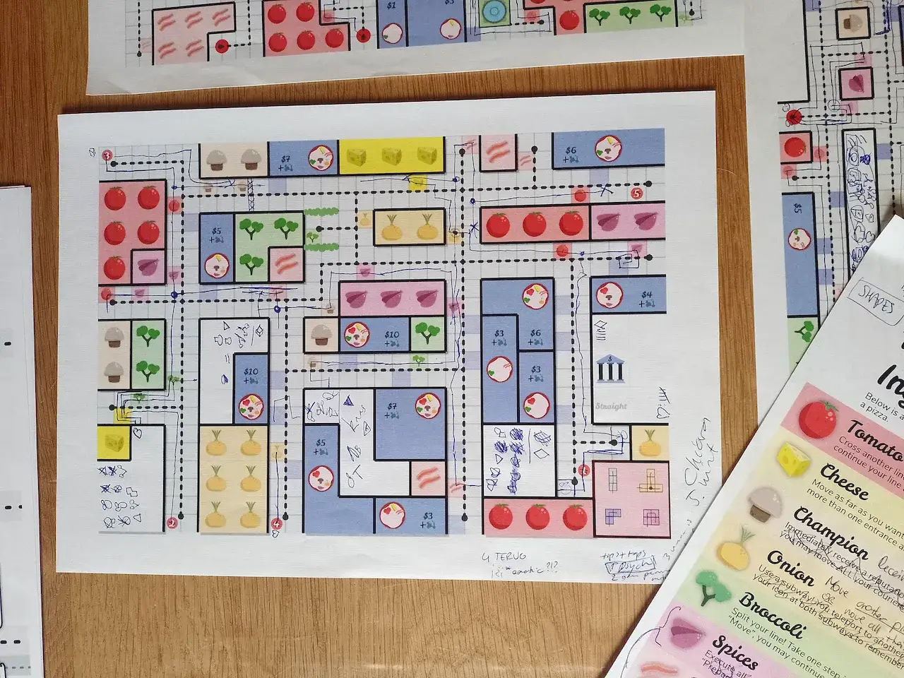

I probably tested this game 2 or 3 times as often as I did any game before it. This caused major rewrites and changes, multiple times, to the whole game.

{}
At first, movement was freeform. This both overwhelmed players as well as made the game too easy. That's how I eventually ended up with "Tetris"-like movement in a game like this. Something I would have never come up with or even considered if I hadn't tested the game a lot and bumped into this issue every time.
{}

The game also has really nice art, a consistent style, colorful assets, and a general vibe that's just fun and professional.

This game took a long time to make. It was also the culmination of _all_ I'd learned about games and One Paper Games until now.

And it shows. This was the first game I was somewhat _proud_ to put online. I was certain it looked professional and would give people a good time.

### The long pause

After making that many games, it's not surprising that I wanted to do something else for a while. Also because these games earn me no income and probably never will. And now that I was done with my degree and had started my own business, I needed to start earning income.

The _other_ reason for the long pause, was simply a string of failures.

I tried to make an OPG about---you never guessed it---constructing a metro network. I wrote a generator to create beautiful _boards_ ... but never actually wrote down rules and couldn't figure out how the game would even work. (More on that lesson soon.)

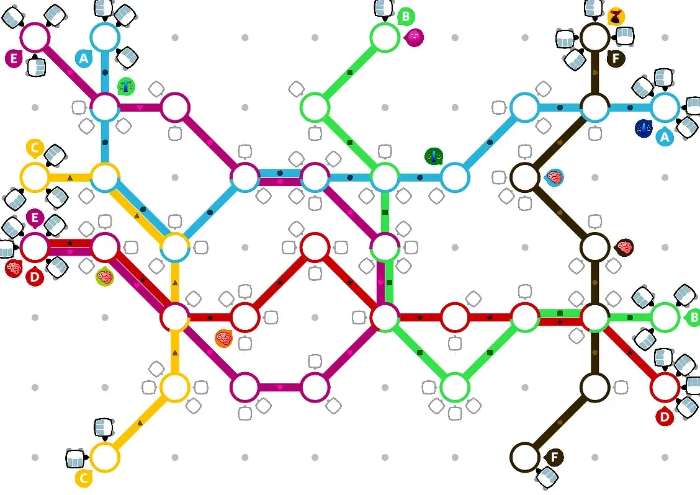

I tried to make a _folding_ game. Yes, you read that right. The game is played through pieces of paper that you can _fold_. (Both to change their dimensions as well as their power, as only icons _showing_ would be in play.)

This was a very experimental idea---even for my standards!---and I just couldn't figure it out at the time. I still have all the original notes and art, and I hope to one day open the document and immediately know how to fix those issues.

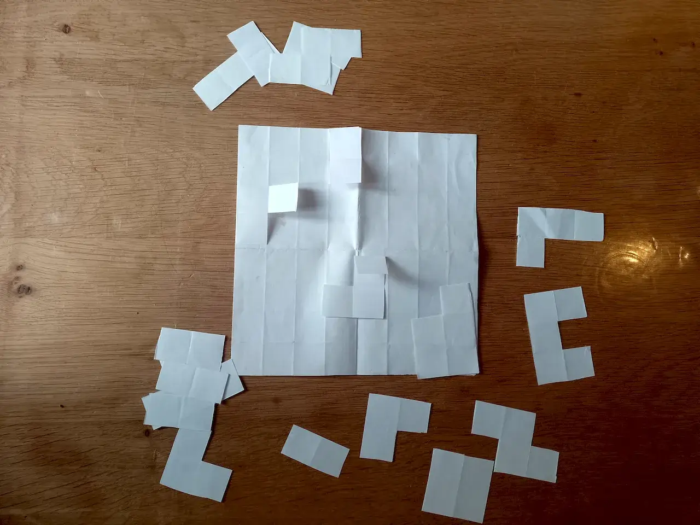

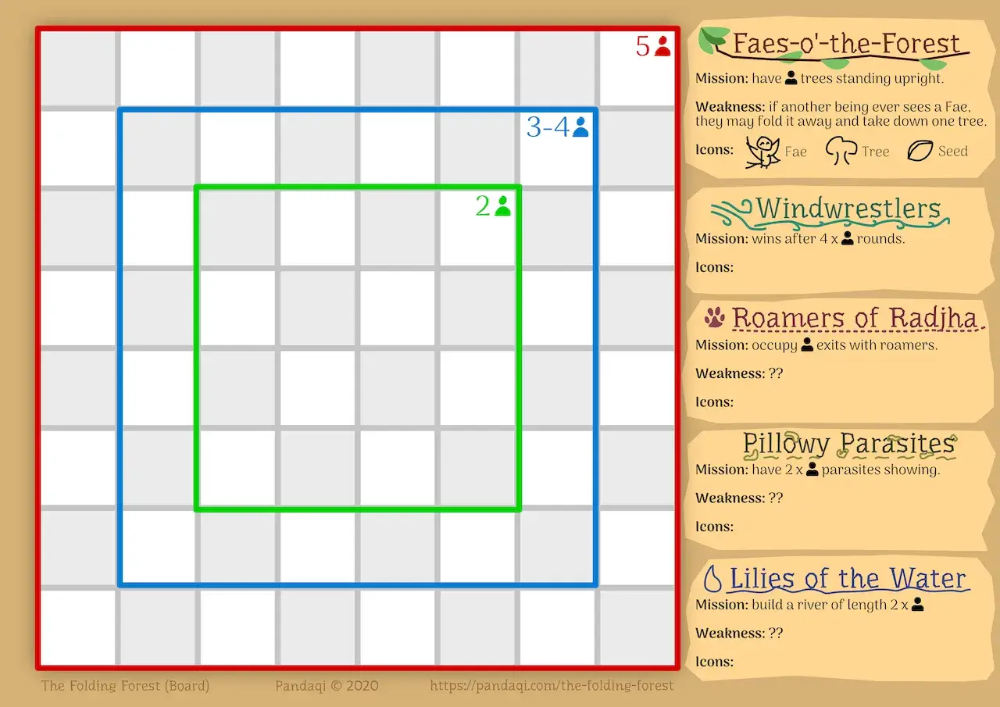

I tried to make a game about chasing cryptids. A hybrid game. One smartphone would allow you to take "photographs" or "search for clues" in certain areas. It was your job to find the current location of the cryptid before time ran out.

A great idea. It got quite far. But, as with the others, it was experimental and ran into issues I didn't know how to solve then. (I also made the MISTAKE of writing a story in this "game world" at the same time, which divided my attention and caused _both_ to never be finished.)

{}
Unfortunately, I have no screenshot of the UI on the website and have since lost my license for the software in which the rules (with nice graphics and such) were written. Hopefully, one day, this game is brought back to life and you can simply PLAY it.
{}

As with most creative people, the fact they don't put out some new work doesn't mean they're _doing nothing_. It probably means their last 10 ideas have failed and they're still searching for the new big one.

I'm not sure what caused this string of failures. Yes, some of the ideas were very experimental and risky. But not all of them. And, I mean, "experimental ideas" is my middle name and I'd created a bunch of them with the One Paper Games.

Perhaps it was simple that burn-out related to boardgames. I'd made so many and learned a lot---my brain needed time to rest and to process it.

## Guess I'm an adult now

### Coming back to board games

For a few years, I mostly did _everything besides creating board games_. Wrote a bunch of books, recorded 5 albums, created a string of video games, that kind of stuff.

What made me come back to board games? (For reference, I am 26 years old now.)

* My laptop became so broken that developing video games simply wasn't an option anymore. (Music as well, though physical health issues were the major culprit here.)
* Additionally, video games take much more work to create ... _something_. Board games can be invented, created and iterated on much faster. 
* I'd written so much that my brain just couldn't come up with more stories.

I'm seeing a pattern here. I focus too much on _one thing_ until I burn out on it, and the cycle repeats.

As such, when I came back, I also knew I needed a better structure or approach to my projects.

From all my experience creating projects (the past 10--15 years), I devised the following method.

* Every month, I'd release two projects.
* One would be writing-related
* One would be something else, which usually means a board game

Somehow, this structure, this pacing, this idea _works_ for me and my brain. It gives me a constant variety. At the same time, I always get the writing work done (which is the thing actually earning me income) as well as a hobby project.

With this structure in place, we arrived at my second "game design boom".

This boom kicked off with two crucial realizations that I want to share. Because if you can take this to heart, I am certain you will become a successful game designer.

* Simpler is always better. Done is always better than unfinished. So pick your projects based on how **quickly they can be finished**. Nowadays, my ideas are sorted based on how far along they are / how much work is left. I simply pick the one furthest along and make it. 
* Start with the **game engine**. Do not put any more work into an idea until you know the _specific actions players will take on every turn_. That is the "game loop" or the "game engine". If you can find a simple loop, the rest of the game will follow. If you start with anything else (theme, graphics, components, a unique scoring rule, a vague direction), you're likely to fail.

As always, this might sound obvious to some. But they are crucial realizations and they're even harder to get right and consistently implement.

Finishing stuff is _hard_. So make it exceptionally easy for yourself to finish it. Pick your tiniest idea and execute it in the tiniest sense. Usually, your estimations will be wrong anyway and the idea will be slightly bigger (and take longer to make) than you anticipated. This is fine. You kept it as small _as possible_ and you're likely to finish it.

Only finished games can be played, tested, and improved upon.

Similarly, finding a strong game loop is _hard_. I've started so many games with a clear _theme_ or _general idea_ ... that never went beyond that because I had no clue what you would actually _do_ on your turn.

Start with that. Get good at inventing game engines on the spot. That's the mark of a great designer, in my eyes.

As an example,

* DON'T: "Wouldn't it be fun to have a game with DRAGONS? Let me write down that idea."
* DO: "Here's the idea: your turn has two steps. Fly to one adjacent space, then optionally burn that space to the ground." (This is a _game loop_ and the specific actions you will take.)

Another example,

* DON'T: "Let's make an economic game about growing your business! You should be able to choose your area, your products, your prices, ..."
* DO: "Your turn has two phases: CARD and BUY. CARD: play a product card from your hand. BUY: buy any product that another player is offering."

Or perhaps a real example from my latest games. (I really hope they have come out by now, otherwise you should expect these in the coming months. My future timeline can be a bit flexible.) They all started with this very simple game loop and then grew into the full game.

* "Hold my Bear": on your turn, you either play a valid set of cards, or give away two cards. (That's a _game loop_!)
* "Kangaruse": on your turn, you jump to a new square and execute its action. When jumping, you must follow either the _direction_ command of your cell or the _number_ command ( = how many spaces)
* "Kingseat": everybody simultaneously picks and reveals a card. The longest sequence of cards (of the same type) wins the vote. Any other cards are used for their action. At the end, the party with the most votes wins.

The theme, the expansions, the little details, they come _later_.

If the engine is in place, you can immediately test the game (with a paper prototype), refine it, make it perfect. With the certainty of a working game, making adjustments and adding the other elements (such as graphics) becomes a breeze.

Nowadays, if I can't write down the game loop for an idea, the idea immediately goes to the lowest priority. Conversely, I have game ideas that are _nothing but a game loop_ (no theme, no graphic style, nothing) that immediately shot to the top of the list.

That system has worked wonders for me for two years now.

Below is an image of some of the _later_ "One Paper Games", made while this system was just in place.

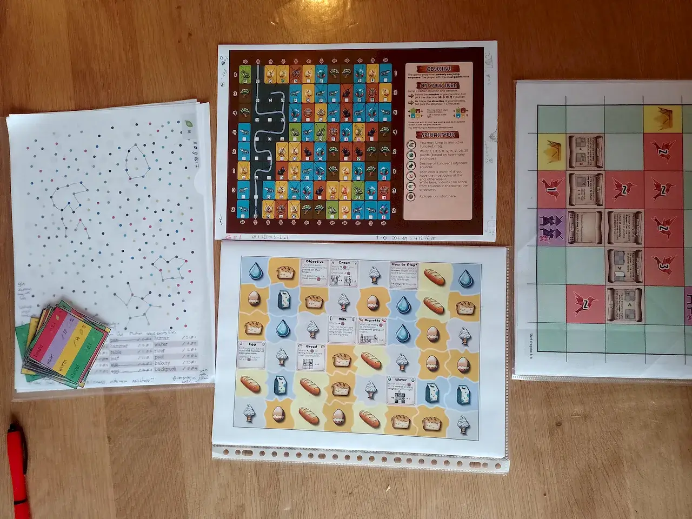

### Shots Fired

I originally made this game for my little brother, when he was obsessed with Valorant (a shooter video game).

This was the last game I made _before_ learning the lessons above. It was also the last game I made _before_ completely revamping my processes for making games (as explained in the section below).

As such, the game is currently in a bit of a limbo.

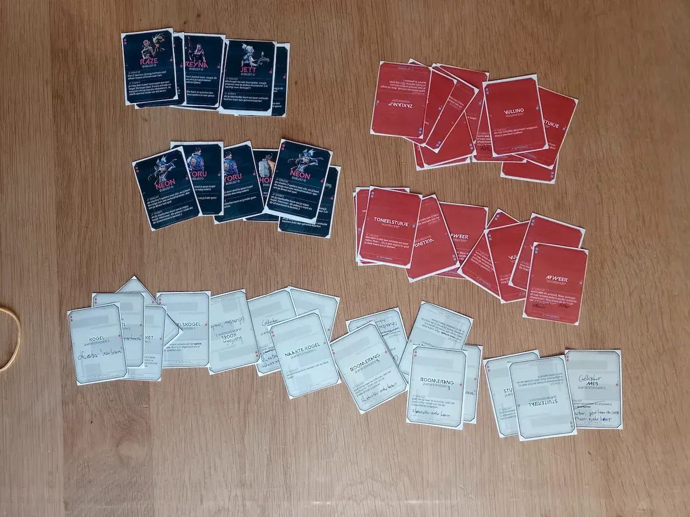

The art and card design are all pretty professional. (What you're seeing is the very first prototype I tested against myself, not te final design. Also, if I ever release this game, the Valorant characters are obviously going to be replaced.)

The general idea is strong and promising. There are some good bits (based on all lessons I've learned), but also bad bits.

But I didn't start with the game engine, which meant the game never really worked, not even on the evening I gave it to my brother and we tested it.

That version worked as follows.

* On your turn, you _shoot_. Pick a bullet card from your hand and pick a victim.
* The victim can either receive the shot (discarding cards to "take damage") _or_ deflect it to another player (using another card in their hand)
* The winner is the last player with cards left.

A simple and promising structure. But seasoned game developers might see the issue here ...

* So, your cards are your _lives_.
* If "getting hit" means you discard a card ...
* But deflecting the bullet also means you discard a card ...
* And shooting a bullet obviously means you lose that bullet card ...
* Then every action is equally meaningless!

It's such an obvious flaw in the design, but because I was in a hurry and couldn't test it (because it would have given the surprise away, as my brother was nearly always home during that period), this never occurred to me.

It's doubly stupid because I'd already designed loads of cards, and even expansions, which all had to be binned (or at least changed) now that the core of the game would need a huge change.

Right after testing, I wrote down an idea on how to completely redo the rules. Hopefully this year (maybe next), I'll have finished that final version and will publish it.

{}
One simple change would be that, when you deflect the bullet, you _add_ the card you used to deflect it. This means the bullet becomes "more powerful" the longer it goes around the table. If you're hit by a 3-card-bullet, you lose 3 lives. So then it _does_ make sense to always try and deflect it.
{}

This is the umpteenth example that rules need to be battle tested and iterated on. That even after 20+ games, I still fail to see obvious flaws in my first version. No idea enters your brain in a perfect flawless state, and starting on other parts of the project _before_ even knowing if your game engine works is generally a bad idea.

### Playful Rules

At this point, I am basically on a journey to create the smallest, most minimal and accessible games possible.

Reduce material. Reduce rules. Reduce overhead. Solve ten problems with one rule. Carefully phrase the rules to cut 100 words from the rulebook.

And it works. It truly makes a difference. My last 10+ games have extremely simple and streamlined rules. If you think about it for longer, if you truly consider other possibilities, you can often find a way to make your game _simpler_. To reduce three different decks of cards to one deck. To remove the need to add a bunch of extra tokens or tiles.

As my collection of games (and their requirements) grew, I revamped the whole structure of my gaming website. 

It was a mess, it really was. Because the games had been made over a long stretched-out period of time, they all used different coding conventions, different systems, etcetera. I unified it all into _one_ system. One "pandaqi games library" behind the scenes with useful tools for any game-related stuff.

This made the website smaller and faster, so that's nice.

But it mostly made it _easier_ to create and update games. Which means you're more likely to actually do it.

I am currently working on games with randomly generated boards that do things I couldn't have even dreamed of 10 years ago. I've learned so much about random generation, drawing stuff on the web, etcetera, that I can dream even bigger. (I'm not sure if this game is released by the time this post comes online, but all I can say is that I might have written a generator that creates random Ticket to Ride boards on a dime ...)

Similarly, all the material for my games is now _generated on the website_. I don't have to manually create all the cards and components, arrange them, put them in a PDF. The website does it for me, in a matter of seconds! This opened up the opportunity to have _random material_: any time you download a PDF, you're getting a slightly different game than anybody else.

It's faster, it's unique, it actually works on my broken laptop that can barely open graphics software anymore.

And in that same vein, I started creating **playful rules**. Because the best way to learn a game is to _play it_. But then the second-best way is to have _interactive rules_ you can play with.

What does that mean? The rules are online, for one. And inside of them I add a button that you can click to generate a random turn / situation. It will show what happens, what your valid moves are, and (if possible) explains the consequences of that turn.

This only takes a few hours to code and perfect (for me). For new players trying to learn the game, this is _gold_. You can click the button a few times, see the correct handling of that specific situation, and you get a much faster understanding for any game.

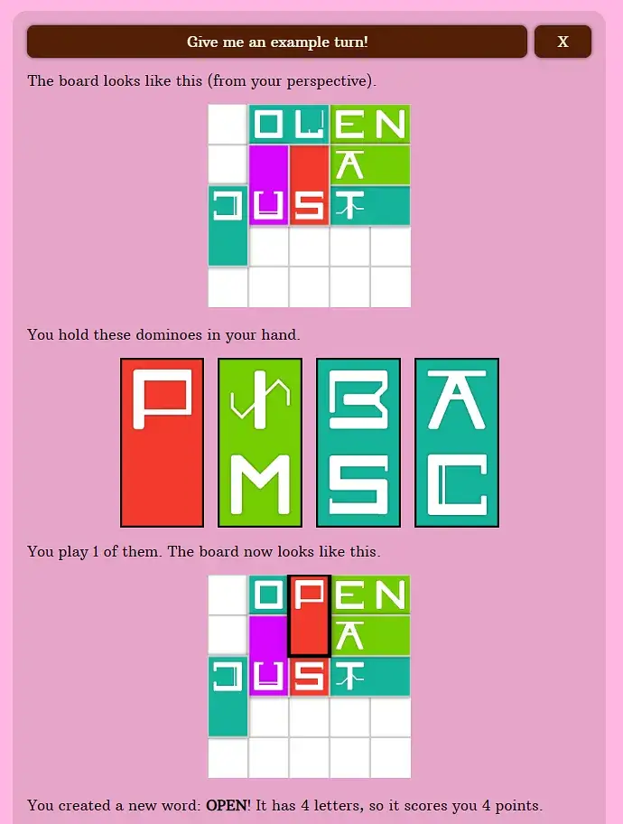

I truly believe this is the future and all games should be taught this way. Which is why I'll keep working on it and trying to improve it.

As an additional benefit, those "interactive examples" are a great test for my rules!

* If it's too hard to code the examples, then my rules are too complicated.
* Conversely, if coding takes ten minutes and all random examples are basically the same, then my rules are too simplistic.
* I press the button twenty times and check if the situations are interesting and fun. If I see situations where players can't make a move, or have _too many_ options, or something else that irks me, I know I have to change that.

As another benefit, these playful rules caused me to think about the ideal structure/order for teaching a game. Reading my old rulebooks, and rulebooks from existing games which I think are good, I settled on the structure my playful rules have now: **Setup > Objective > Gameplay > Clarification > Expansions**. 

All my games so far have perfectly slotted into this order. Again, in my experience, this is always the way to go. People need to know the _game loop_ (gameplay) and _what they're working towards_ (objective), nothing more. In fact, I always try to keep the setup section as short as possible, because it's literally busywork that nobody wants to do or read.

Even as a board game enthusiast, I find most rulebooks (even today) unnecessarily bloated and badly written. I like being able to create games that are only 1 or 2 pages of rules. I think it's worthwhile to spend a lot of time perfecting the language used, to make it as concise and precise as possible.

And as I'll talk about next, others think so too ...

### Where we are now

When I was young, I really struggled to get people to test my games. That's not surprising: they didn't work, they looked ugly, the rules were way too complicated.

Nowadays, I strive for games I can setup and explain within a minute. And the difference is simply night and day. People are more ready to try it. People simply have more fun and less downtime, and are more likely to volunteer playing another round.

I guess the biggest lesson is ...

> _Nobody likes the learning and teaching part of a game. NOBODY. Be absolutely ruthless in trying to eliminate and shorten those aspects._

This combines with a similar lesson ...

> _Games are supposed to be fun. Interesting =/= fun. Clever =/= fun. Thematic =/= fun. Kill your darlings, simplify, focus on what makes people smile, keep what is fun._

I will cut cool mechanics if it also cuts 5 minutes of explanation. I will rewrite the rules one more time if it allows me to lose 200 words, without losing any meaning. I will spend more time creating that playful example than creating other aspects of the game. I will consider completely redoing a functional game just to get those three nasty exceptions out of the way.

And, if you ask me, that's the mark of a professional game designer. Or a professional in any creative field. The ability to separate "but _I_ like it so I'm stubbornly sticking to it" and "it's not good for the game so it goes away". The ability to focus on the hard stuff, the boring stuff, the tough decisions _knowing_ (from experience and intuition) it will lead to the better end product.

Since my confusing stint with the "Shots Fired" game, I've made over 15 games. Many more are partially done or ready to get started. Because the games are simpler, I can create, iterate and finish them more quickly. I'd rather have a simple fun game after a week, which you will play for twenty times and then forget, than spend a whole year trying to get a complex behemoth working.

And I truly believe One Paper Games, Hybrid Games, Playful Rules, all those ideas have a bright future.

Below is one image with my many, many recent games. (Not even all of them, and some will come out in the future.)

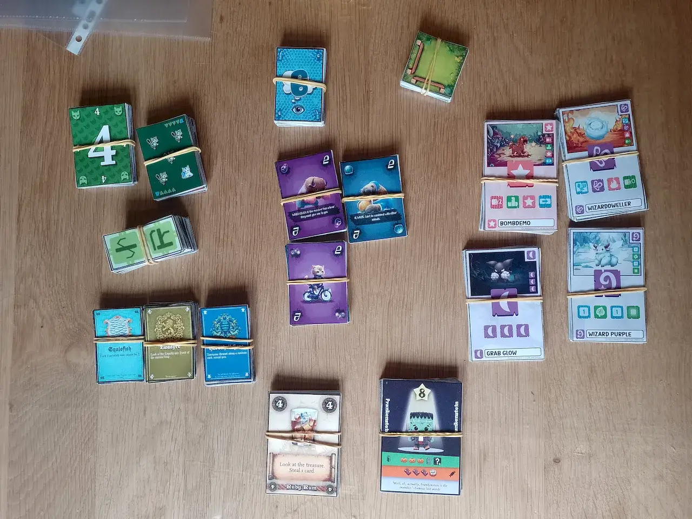

And that's the whole journey, so far, to becoming a game designer.

{}
I forgot to talk about the fact that I started using generative AI for a lot of the design about half a year ago. That's something I've discussed numerous times in the devlogs for those games. As these examples show, I can and do design/draw things myself, but it feels silly to spend _days_ creating something that an AI can generate in five seconds. 

In that sense, drawing has never been my strong suit or something on which I want to spend a lot of time, and I like being able to use this extremely powerful tool.

I do still force myself to design something completely by hand from time to time. That's also what happend when I created [Wie is de Trol?](https://pandaqi.com/wie-is-de-trol) for example, many years ago. I wanted to prove to myself that I COULD paint fun professional characters, and I did.
{}

## Conclusion

What I hope this article shows, is that getting good at something is a long process of just _doing it_. Trying, failing, trying again. I made many, many games. The early ones were mostly abandoned, terrible, ugly, simply unplayable. But with each one, I got slightly better.

And you will be discouraged from time to time. Either by your own doubt and frustration, or by others critiquing you. Like many creatives, I've heard it all before. How my ideas were weird and wouldn't work, how I couldn't draw or pick colors to save my life, how I should find something I was good at, how I should get a real job, how my games were complicated and people didn't want to test them anymore, etcetera.

And you know what? They were right! As the images showed, my first designs were murder on the eyes! My rules were so bad games couldn't even be finished and I never even saved the rulebooks.

You take it all in. You sift through the information and pick the things that seem useful or instructional to you. And you try to make a better game next time.

Skill is an invisible thing. People have this idea that a game designer will pour over their rules, read their notes a million times, reason about it, read some textbooks about "game design", and then come up with a perfect solution. 

That's not how it works.

The experienced game designer will _automatically_ pick options that result in better games. They probably can't even explain why or where it came from. And then they'll simply try again with the new rules, over and over.

Experience and doing trumps everything. 

Nowadays, I make (design) decisions in a heartbeat that I would've never made even a few years ago. And those decisions usually turn out to be right.

I guess that's your goal when trying to become a game designer. I hope this article was interesting, gave some good advice, and perhaps inspired you to start turning those awesome ideas of yours into games.

As the saying goes: "The master has failed more times than the beginner has even tried."

I wish everyone in the world would grow up taking this quote to heart, because if you truly work according to this principle, you can learn anything, become anything, achieve anything. Faster than those stuck in the useless ways of the educational system, stuck in doubt, stuck in fear of failure.

I guess it's a fitting metaphor. To my sadness, I've met so many people who will not even _try_ to play a (board) game. They're always adults---never kids---who preemptively tell themselves they won't understand _or_ who don't want to play unless they're almost guaranteed to win. Because to many above the age of 18, it is UNTHINKABLE to _try_ something and not _perfectly succeed the first time_!

Kids understand that you need to just try stuff, make stuff, experiment, and fall on your butt. Over and over. Until you're suddenly very good at something. Somewhere along the way, we're taught to stop doing that. 

Don't let it happen to you.

Keep playing,

Pandaqi