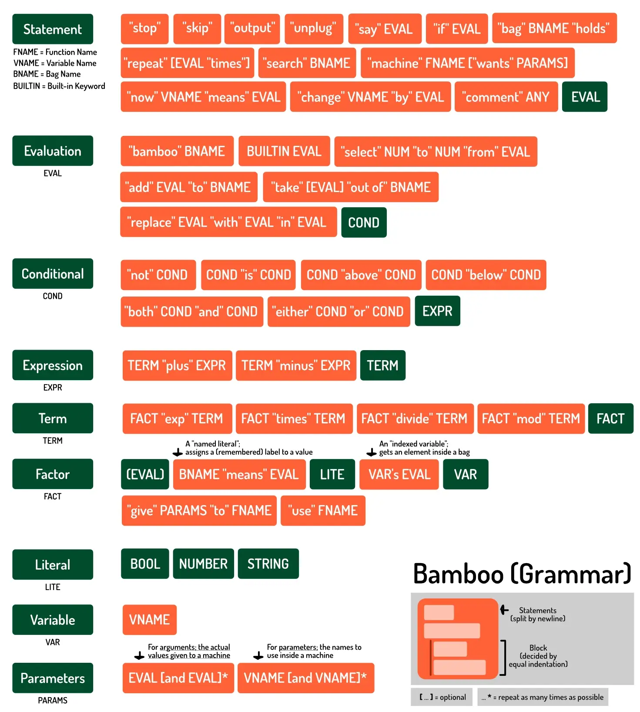

Bamboo is my own lightweight scripting language. This article is about the whole process of creation, from start to finish. If you want to use it, read the [documentation](../bamboo-docs/).

I created it for my tutorial website ([Pandaqi Tutorials](https://pandaqi.com/tutorials)). 

Why? Because I needed a language for my interactive examples. One that was so _simple_ and _small_ that even those without any coding knowledge could follow. One that didn't require you to know a specific language before you're able to follow the tutorial. One that reads like simple English sentences.

Of course, "create my own language" is very ambitious. It's easy to say, hard to execute. In fact, I've been interested by this since I was a child, but always found the task too daunting to even attempt.

So how did I finally do it? What techniques did I use? What problems did I encounter? 

This article gives the (mostly fun) **overview of the journey**. I made many mistakes. I hit many stupid errors. I introduce syntax, only to tell you why that was a _bad idea_ a few sections later. If you just want the end result, scroll all the way to the end. But as always, the full journey of mistakes and realizations is way more educational (and interesting) to read.

This article can be technical at points, but mostly talks about general ideas. So let's start there.

{}
You can find the end result [on GitHub](https://github.com/pandaqi/pq-daw).
{}

## What's my purpose?

I need a language that ...

* Can be executed in a browser using JavaScript
* Reads like basic English sentences
* Is fast/easy enough that I can add interactive windows everywhere in the tutorials (without issue)
* Only supports the barebones of coding ...
* ... but still has enough functionality to actually explain all crucial programming concepts

Of course, I wanted to cheat at first. Just write a few "regular expressions" to make my specific examples work.

But I knew---in my heart---this was a terrible idea. Learning happens when people get to actually _do_ and _experience_. I wanted my readers to be able to play around and write anything they like. I wanted the language to be an actual language, not a gimmick or a magic trick.

Also, as mentioned, I just wanted to _learn_ how these things are done. Now I had a good excuse to do so.

With that in mind, I started writing a **specification**.

## Specification

I don't know how to write a formal or "correct" specification. As I said, never even attempted to design a language before! As such, I just wrote the general things I'll need.

### Literals

All languages start with "atoms" or "terminals". These are your actual tiny pieces of information. They are "literal", they are "done" (hence _terminal_). They don't need to evaluate or calculate any further.

Almost all languages have the same set. I saw no need to change this, although I did change the _names_.

* `Number` (integers/floats): 1, 2, 3.5
* `Text` (string): "bla bla"
* `Truth` (bool): true/false
* `List` (array): \[elem1, elem2, ... \] 
* `Bag`: \{key1:elem1, key2:elem2, ... \} 

The more I thought about it, the more my language became about _changing names_. For people new to programming, the word "array" is probably uncommon or unexpected. It's just a list---why isn't it called a list?

Of course, I've programmed for a long time and understand why languages are designed the way they are. But our purpose is not to create the fastest or most versatile language. It's to create the simplest one for the non-initiated.

As such, notation for lists and bags could still change.

### Math

Math works using the regular symbols. There's really no (better) alternative. I do want written alternatives for all symbols: `2 plus 2` is parsed the same as `2 + 2`.

### Variables

The symbol `=` is quite well-known, so I want to support it. But, again, let's add a written alternative.

At first, I wanted to use the keyword `is`. But then I realized I got into trouble with _conditionals_: the word "is" is much better suited there. Writing code to allow both assignments _and_ variables to use the exact same template is ... not a good idea.

I left it open for a while. 

A moment later, I wanted to find syntax for assignment (`a += 2`). The `+=` symbol is far more confusing to beginners. I really wanted an alternative to that.

This led to the following rules:

* `put <value> into <var>` => assignment
* `change <var> by <value>` => update

It reads exactly like what it _does_. It's more verbose, and restricting, than other languages. But I think it's enough.

### Indexing

How do we work with lists or bags? (Arrays or dictionaries.) 

They need to support a few key properties

* Indexing => getting one specific item
* Assignment => putting one specific item in it
* Size => getting the length
* Keys/Values => getting these somehow

I specified these as follows.

* `item <index> of <var>`
* `put <value> into <var> at <index>`
* `length of <var>`
* `labels of <var>` and `items of <var>`

Moreover, we need an easy way to _iterate_ over these. But I'll leave that for when we get to **loops**.

### Conditionals

These also read like a sentence: `if <a> is <b> then`

Here I encountered my next question: when do statements end? When do blocks start and end?

Forgetting to add semicolons or braces is _another_ common hurdle for beginners. I knew quite quickly that I wanted to use ...

* Newlines to separate statements
* Tabs/Indentation for blocks

How I was going to code that ... I had no clue. But it seemed like the only reasonable solution if I want the language to be as accessible as possible.

{}
Coding it would probably be easier if I require some word to finish the block, like `end`. But I want to avoid that, if possible.
{}

### Conditional Operators

Inverting is easy: add the word `not` in front.

Logical "or" and "and" just use those words: `or` and `and` 

More complicated checks---such as "greater than"---are still up for discussion. Writing them out is _very_ verbose. For the moment, I decided on this compromise:

* `below` for "less than"
* `above` for "greater than"

_What about else? And else if?_ They're not necessary. I rarely ever use these anymore. So they go away.

{}
Instead, you write your code using guard clauses. If something is not true, return out of the function. If something else is not true, go away. This way, you get the same functionality, but with less syntax and less nesting / levels of indentation.
{}

### Loops

I wrote down a few different syntaxes. I didn't like any of them for my language.

You have the traditional for loop. But that's a _bunch_ of syntax.


for(var i = 0; i < n; i++)
{
    ... do stuff ...
}


I liked the "do-while" loop best. Because it reads like a sentence again: "do the following, while something is true". But even that isn't great. It creates this huge distance between one part of your loop (the declaration) and the rest (when it terminates).

Considering it some more, I realized I barely use loops that way anyway. It's not needed. We can just ...

* Add one `repeat` keyword.
* Then break out of it with a simple `stop`.

For ranging over lists and stuff, we can add some (tiny) syntactic sugar.

* `for all items in <var>`
* `for <number> ... <number>`

I think that's more than enough. The main idea is that I want a simple keyword or sentence structure for each type of statement. (Because I think that will help when coding. But I don't really know yet, as I haven't started implementation.)

## Functions

This was my biggest fear :p These are complex, they need _some_ syntax, and I wasn't sure how to approach it.

For now, I decided to rename them to _machines_. You put something in, to get something out. I think this analogy will work well, but it might change. (People expect a _machine_ to always produce the same result. If you press "home" on your phone, it always goes to the home screen.)

To **define** a function: `machine <name> wants <params>`

To **call** it: `give <arguments> to <name>`

To **return** from them: `output <result>`

How is a list of arguments given? You guessed it: just words separated by `and`.

This is enough. Like any language, you can chain these to _save_ the result value.


machine adder wants a and b
    output a + b
end

put (give 5 to adder) into result


But it has a few issues.

* The line above isn't how a normal sentence works. (The order is confusing.)
* Returning without giving back a value can be confusing this way.

I wrote some ideas to improve that.

* To call and get the return value: `give <arguments> to <name> and output to <var>`
* To hard return out of a function: `unplug`

You'd get code like below.


machine login wants username and password
    if not username then unplug
    output "Logged in!"
end

give "Pandaqi" and "1234" to login and output to result
tell result


## Logging

Yes, the final piece of the puzzle. Some way to actually _output_ or _use_ the result. I ended up on the word `tell`. 

Other things like "sing" or "shout" are fun, but too childish. Turning it into a sentence is too verbose and won't always work (depending on how you name your variables).

Looking at this, my syntax seems a mix of Lua, Python and Go.

Let's make it!

## An introduction to Parsing

This specification isn't watertight. I knew things would change, but I needed to just _start somewhere_. Do some research, get an intuition for this, see problems as they arise.

Writing your own language is a tough problem. Which means I did what I always do: break it down into the smallest possible steps and prioritize that. Once I have _some_ starting point (from my research), just execute that.

Below is what I learned from that initial research.

To create a language, you need ...

* **A Tokenizer** (or lexer): something that reads your big blob of _code_ and chops it into tiny pieces, or "tokens".
* **An Abstract Syntax Tree** (or AST): something that converts those tokens into a tree, which it can simply evaluate (from leaves to branches) to get the final result.
* **String parsing functionality**: because my language is built on top of JavaScript, I get this for free. For any native functionality, I just call the JavaScript for it!

A Tokenizer uses _patterns_ to recognize the little parts that make up your code. For example, when it finds "number + number", it recognizes that as one token---the "add operation".

The AST is a quite direct result of that. It provides actual nodes for all the tokens. You give these nodes a simple function like `evaluate` or `getResult`, which extracts the value. Because it's a tree, nodes higher on the tree contain nodes below them. Executing your code simply means a long list of recursive function calls.

{}
When you call `evaluate()` on the top node, it calls its child, which calls its child, and so forth---until it finds an actual value.

Then it returns the value all the way up the chain. Any node that wants to do something with it, does so. And it keeps bubbling up, and up, until it reaches the top node with the _end result_ of our code.
{}

{}
A node like "add operation" will contain two values: 

* The first value 
* The second value

Its `evaluate` function then simply returns "value1 + value2". 
{}

The tree structure is important to remember here. Those values for the add operation? They might not be actual values. They might be an operation themselves, or another expression.

If your tokenizer did its job, it will have matched the _smallest_ parts first (one value, one operator, etc.), and continued from there until it matched the _largest_ patterns (a whole statement, a whole code block).

This means the tree follows automatically.

### How to implement this?

Most languages use a _recursive descent parser_ (or a variation on it). If you read the explanation above, you already know what it does.

* It's recursive: it calls function after function
* It descends: with each function call, it goes _deeper_ into the code (towards smaller and smaller patterns)

If you look this up, you'll find the usual nonsense that seems to come with any academic field (such as computer science). Article after article that tells you the _exact same theoretical definitions_, without giving an example or any practical tips! It's like one person wrote the theory, and all other websites just copied it blindly.

{}
Once we start talking about "the left recursion problem", you'll see me get even angrier about this :p
{}

In the end, it took a while before I found a few videos/articles that clicked with me. They actually _showed_ how to do it and were 100% _practical_.

I chose to follow this methodology, which is called **functional parsing**.

### What's functional parsing?

Your parser only has _functions_ that go `String -> [Tree, leftoverString]`

In other words, each parser function

* Receives a string (the part of your code you haven't parsed yet)
* And returns two things.
  * The tree parsed so far
  * And the string left over

As expected, it's best to just go left to right. To just check if the first character of the string matches whatever we want to check.

And if a parser fails? We just return an empty array (`[]`).

{}
This approach has advantages and disadvantages, like everything. It's very clean, fast and makes for simple code. It also cannot do some things that are extremely easy in non-functional parsing.
{}

Let's use a simple example. We write a parser `char` that checks if the first character of the string is a specific character.


const char = (c) => {
    return (str) => {
        const matches = str.length && str[0] == c;
        if(matches)
        {
            return [str[0], str.slice(1)]
        }
    }
}

char("c")("cat"); // ["c", "at"]
char("z")("cat"); // []


Our parsing program will exist out of many of these _tiny function generators_. On their own, they are obviously too simple and can't achieve much. But when _chained_ together (in a few ways), it can do parsing magic.

### Chaining parsers

Here you see why we return a _function_, instead of a _value_. Because most of the time, we don't know exactly what we're going to find. That's the whole point. 

We have multiple patterns to check. We want the first one that succeeds (and parse it), or if all of them fail, parsing has failed.

That's why I started the parsing library with a few crucial helper functions. I was lucky enough to find a _great_ resource about functional parsing in JavaScript here: [GitHub Parser Library](https://github.com/lupomontero/parsing)

I copied its code, rewrote it so I understood what it did, then built everything else on top of it.

{}
In general, you'll see the code for the parser is pretty verbose and explicit. Just vanilla JavaScript. No tricks used to make it shorter or to produce "one-liners". To help me understand it better and prevent mistakes.
{}

Here's the summary.

* `seq`: receives a list of parser functions. It tries them all in sequence and they must all succeed.
* `choice`: receives a list of parser functions. It tries them all and returns the first one that succeeds. (It only fails if all of them fail.)
* `nothing`: will accept the input as correct without actually parsing/changing it (useful for defaults or failsafes)
* `some`: executes a parser once, then repeats until it fails. (It only fails if the first one fails, otherwise any number of matches is fine.)

This is, essentially, all you need. I won't share the source code for these functions, as it's just too long and precise to be nice and easy to explain. This is a general overview, not an in-depth technical course. You can find it the [source code](https://github.com/pandaqi/bamboo), in the file `Parser`. (Or in that other GitHub project I linked, which is smaller and perhaps more beginner-friendly.)

But I'll give examples on how to _use_ them in practice.

### Examples

Let's start very simple. We want to check if we've encountered a boolean: "true" or "false"


// checks if the next symbols are exactly the string "c" we provided
const chars = (c) => {
    return (str) => {
        if(str.length < c.length) { return []; }
        const match = (str.slice(0, c.length) == c);
        if(!match) { return []; }
        return [str.slice(0, c.length), str.slice(c.length)];
    }
}

// first try matching true, then try false
const bool = () => {
    return (str) => {
        return choice(chars("true"), chars("false))(str);
    }
}

bool()("false"); // ['false', '']
bool()("what"); // []
bool()("true"); // ['true', '']


That's the idea. You find the tiniest possible parts of your language and write a simple "parser" to find them. Then you chain them together into _bigger_ parts (like "expression" or "assignment"), until you're all the way at the top and can parse your whole code.

For example, let's take the next step. We want to check if the next set of symbols is a _literal_. A literal value, which is either a boolean, a string, or a number. Then you'd write ...


// for simplicity, let's assume all our numbers are floating point: XX.XXXX
// we match any sequence of digits, a dot, and then more digits
const number = () => {
    return (str) => {
        return seq(some(digits()), char("."), some(digits()))(str);
    }
}

// for simplicity, let's assume we can't have empty strings
// this will match any set of symbols that are "valid in a string", but at least one
const string = () => {
    return (str) => {
        return seq(some(stringchars()))(str);
    }
}

// this will check if something is a boolean first, then a string, then a number
const literal () => {
    return (str) => {
        return choice(
            bool(),
            string(),
            number()
        )(str);
    }
}


### But wait, this only gives yes/no?

Yes! So far, the parser just gives us a "fail" (empty result) or a "succeed" (the whole string parsed).

But we want to actually _use_ that data, right? We want to actually turn them into tokens, with meaning and properties.

That's why these helper functions get a second argument. Besides a list of **parsers**, you can add a **return function**. 

* This function receives the parsed result. 
* Within it, you can do _anything you want_ with that result. 
* And whatever you output from that function is then saved in the left side of the output (the "parsed so far"-side)

Again, an example will show this. Let's say we match a literal. Then we want to convert it into a node with the right value.

In this case, that's just an instance of the class `Literal`.


// the returner functions are incredibly simple, but a crucial part for making this work
// @NOTE: the arguments to "choice" are now in an array, because we need to add the returner as an argument
const literal () => {
    const returner = (res) => {
        return new Literal(res);
    }

    return (str) => {
        return choice([
            bool(),
            string(),
            number()
        ], returner)(str);
    }
}


Now remember the general idea of this algorithm. It's _recursive descent_. So this value---this node---is returned to whatever function called us. If an "expression" matched this literal, it will receive the value and can save it inside its own node. One level up, a "statement" might have matched this expression---it gets the value and saves it inside its own node.

That's how the nodes are automatically built and linked into a tree. Each node will not only have its data ... you can also add other useful properties!

### The Node interface

In my case, I knew I also wanted a syntax highlighter. In fact, that's where I started. That was my "smallest possible step": if I can tokenize a few numbers to recognize that _they are numbers_ (and give them some CSS class), then I'll at least have a starting point.

Which means all nodes have a `toString()` function. This returns its value inside some HTML nodes saying _what is inside_, so I can style that.

They also all have a `toResult()` function. This returns its actual value.

At first, I gave all nodes a `toType()` function as well. But then I realized I was being stupid. I can easily _link_ value and type, instead of storing and retrieving it separately! I should do that!

So I created one (very simple) `Value` class, which simply holds a value and its type. This is what's saved at the leaves of the tree (the literals, the actual data), and passed upwards.

This means `toResult()` gives you a `Value` object instead. (From which I can read either the value or its type, whatever I want.) 

## An application of Parsing

First, I setup a very simple `<pre>` with attribute `contentEditable=true`. This is an HTML attribute that, well, allows you to directly edit the contents of anything. 

Why is this important? Why don't we just use a text input field? For syntax highlighting. Because it's a `<pre>` element, we can put _HTML tags_ inside (to style our tokens), and whitespace is preserved.

When it receives input, it grabs the content (`innerHTML`) and feeds it to the parser. This will return that tree. 

I call `toString()` on it and put the result back into the node.

There's a crucial step here that I copied from somebody else's code! When you replace the content of that `<pre>` with the parsed content, it's obviously ... different. It's now encapsulated in many nodes. It might have grown in size due to CSS styling.

So you need to

* Keep the selection where it was.
* And strip _out_ all the tags before you feed it into the parser again.

This is 100+ lines of copied code that I don't completely understand, but it works!

### Where to start?

Okay, by this point I have many of those atomic parsing functions. I can get literals, I can recognize characters, I can see things as numbers (both integers and floats), that's great.

Now we need to combine it into a **grammar**. A grammar is a set of rules for the language that define _patterns_ and give them a _name_. These go from most _general_ to most _specific_. Remember our algorithm again: this means the most specific ones are most important. Lower on the list = higher priority.

This is best illustrated with arithmetic. We've all learned the order of operations: 

* First evaluate anything in brackets---any "groups"
* Then multiplication (and division)
* Then addition (and subtraction)

In grammar notation, we get


Expr ::= Term + Expr | Term - Expr | Term  // Expression => plus and minus
Term ::= Factor * Term | Factor / Term | Factor // Term => multiply and divide
Factor ::= (Expr) | Literal // Factor => grouping or final value


An expression is either a term `+` an expression, a term `-` an expression, or it's just a term. Yes, the `|` means "or". (The `choice` parser we defined earlier!)

The grammar is written this way on purpose. These definitions depend on each other. This opens the possibility for an **endless loop**. 

* Expression checks for another expression
* Which will check for another expression
* And so on
* ...

How do we prevent this? By adding the dependency _later_. The "Expr" is on the _right_ of the "Term". This means that we don't cycle endlessly, because an expression never matches only itself. It always matches _something else_ plus itself. Which means it keeps consuming more parts of the string and _will_ terminate.

### Building our grammar

You can continue this pattern and add, for example, exponentiation and variables. (Where exponents come before multiplication, of course. And variables resolve to values, so they are functionally on the same priority level as literals.)


Expr ::= Term + Expr | Term - Expr | Term 
Term ::= Exp * Term | Exp / Term | Exp
Exp ::= Factor ^ Exp | Factor
Factor ::= (Expr) | Literal | Variable


And what is code ... if not just a long list of expressions? The `*` behind a definition is the same as our `some` function: match least once, and as much as possible.


Code ::= (Block)*
Block ::= (Statement)*
Statement ::= (Expr)*


This is obviously not the full grammar. But now we have a functional parser. We start by matching the _code_ pattern, which will automatically match further and further, down to the variables and literals.

If written correctly, there should never be an endless loop. And it should be like magic :p

Coding this was a lot like trying to code in the language Rust. Either you hit some stupid limitation with the "rules" of the system ... or your code runs and you are 100% sure it works flawlessly. If all parser functions are correct---and that's easy to check, they are usually only two lines---the result will always be correct.

### Finally, results!

With this knowledge, I could now extend my syntax highlighter to actually calculate formulas.

That was my next "tiny step". First tokenizing, then syntax highlighting, then calculating simple math.

During this process, I hit a few noteworthy walls.

* Accidentally rounding things here and there. (For example, I called `parseInt` on a string which could also be a float.)
* **Type coercion.** To be accessible, my language has to allow basically any type to operate on any other type. This meant defining what it meant to, for example, multiply a boolean and a string.
* The biggest of them all ... **whitespace**

## The issue of whitespace

Honestly, I never expected the biggest demon of parsing to be _whitespace_. But here we are. Let me explain.

### Spaces

Whitespace is for humans ... mostly. The computer doesn't care if you type `2+2` or `2 + 2`. But we do: things are more readable, and more like natural language, with spaces and newlines.

This is true for _most_ things, but not all. Variables, for example, need a clear start and end. Otherwise we _cannot_ know if something is a variable.

For example, let's say you type `ifvaristruethen`. How is the parser supposed to know it's an if-statement with a variable `var`? With our rules so far, it would just assume the whole thing refers to one variable. We might filter out the `if` at the start, or the `true` as a boolean, but that would mean _forbidding_ those sequences of characters from all variables!

All my kneejerk reactions to whitespace don't work:

* Split the code on whitespaces? Can't be done. Many patterns work across whitespaces, so you need match further than just your current word.
* Collapse all whitespace? Can't be done. Due to the example above, but also because syntax highlighting would stop working. (You'd type something with whitespace ... and then it parses the result and gives your code back without any space :p)

Just to keep going, I started capturing whitespace within patterns. For example, my pattern to match the ADDITION operator, will match both `2+2` and `2 + 2`. The extraneous whitespace is saved on the node, so it can put it back when needed.

This is fine, and probably 90% of the final solution. I just need to be smart about which nodes capture the white space, and how to deal with that efficiently.

### Newlines

The same happened with newlines. My kneejerk reaction was to split all statements on newlines. 

But this doesn't work for the same reasons. A "block of code" (the second-highest pattern in our grammar) _will_ usually work over multiple lines.

Instead, newlines need to be smartly integrated with the patterns as well.

But ... the _last_ line of our code will not have a newline (usually). So ... aargh!

In the end, I added a `lineterminator` parser. 

* It checks for newline symbols (`\n` and `\r`) _or_ the end of the input string. 
* Every _statement_ needs to end with one.
* (And a block is just a list of statements)
* (In other languages, you might use a symbol like a semicolon (`;`) to split statements.)

The hardest part was teaching the program about blocks. I didn't want to introduce symbols for denoting blocks (like `{` and `}`). That would've been rather easy to parse:


const block = () => {
    return (str) => {
        seq([char("{"), whitespace(), some(statement()), whitespace(), char("}")])
    }
}


This made my life considerably harder.

I did research. I read the [Python docs](https://docs.python.org/3/reference/lexical_analysis.html). (They are surprisingly well-written and easy to follow.)

But because I was fully functional in my approach, their method didn't work for me. All I have are _functions_, which both tokenize _and_ build the tree at the same time.

Most languages, though, separate this:

* Tokenizer: produces just a long list of tokens
* TreeBuilder: goes through the list to combine the right ones into a tree.

At this point, I took some time off to consider if I wanted to research and rewrite. Yes, a more powerful (and generally adopted) method would be nice. But it felt like too big of a step---something that was currently above my understanding and available time for this project. The current code was simple and clean, which I liked.

### Semi-Functional

As I read more docs (and general article about parsing), I realized none of them even mentioned the idea of "blocks" :p They all evaluated line by line. A "line statement" was the highest group.

Slowly it dawned on me that this was the solution. Instead of going Code -> Blocks -> Statements, I could make Statements the highest level.

When parsing, I catch all statements. Then I loop over them, keeping track of indentation. When I see the next line increases, I start a new block. All statements from now on are part of that block. Until the indentation decreases again, and this block is done.

A `Block` node is then nothing more than:

* Its defining statement (such as `for ...` or `if ...`)
* The list of statements that belong to it

The defining statement determines the type of block. What it actually does with its statements.

* An `if` statement will only execute the statements if its condition is correct
* A `for` statement will execute its statements as many times as the loop wants
* Etcetera

It's optional. The first level for example---without indentation---is just a block of statements with no other meaning attached.

I thought it was a nice compromise. We're still 99% functional, but this solves our last big issues. 

{}
I just needed to fiddle a bit with what constitutes "a space" and how many spaces is a "tab" and all that. Again, whitespace is the real issue with parsing!
{}

## Where are we now?

The code can recognize indented code as its own block, and attach meaning to it. This is how it chops the whole code into chunks. On top of that, it can evaluate mathematical expressions.

A good start. Nowhere near a complete language, of course. We need a few crucial things:

* **Variables**: retrieving and assigning
* **Blocks**: the if-statement, for-loops, etcetera.
* **Functions**: ability to call and retrieve result
* **Lists & Bags**: ability to declare, index, use these two data types

With all this groundwork---fortunately---these have become rather easy.

### Variables

For this, I used a good old JavaScript dictionary. Just one big variable called "MEMORY".

* When a variable is declared, it enters it into MEMORY. When updated, it just enters the new value.
* When a variable is retrieved, it asks for the key ( = the name) in MEMORY. If not found, throw some errors.

I ended up making this variable local to the parser. Seemed neater than attaching it to the window, especially because that might mess with things if there are _multiple_ examples on my page. (The other ones would also have the memory stored by others.)

In fact, when I implemented that, I realized variables are the _only_ thing that need to have access to memory! So they get a reference to the current memory, and the other 99% of the program knows nothing about this.

{}
Functions are also just variables, but with a _function_ stored inside of them instead of a _value_.
{}

### Blocks

The if-statement evaluates its conditional. If the answer is not `true`, it bails out. Otherwise, it goes through its statements and executes them.

The for-statement is an endless loop through its statements. If it finds a `stop`, it, well, stops.

This was tougher than I thought. How do we find this `stop` keyword nicely? How do we track it back to the loop it belongs to?

The "simple" alternative would be to keep track of this with a separate stack on the parser. Each time you start a loop, add it to the stack. Each time you find a stop keyword, it pops the last known loop off that stack.

But this means adding more and more variables _outside_ of my nice functional structure. I want to at least _try_ other approaches. So in the end, I stayed true to my course of "functional programming".

When the `stop` keyword is found, that statement evaluates to a value of type "stop". This bubbles up. Any block/statement that encapsulates this expression, will receive that value and pass it on. This means that it will, at some point, reach the node calling this loop. That checks for the keyword and abandons ship if found.

Yes, this means I finally decided what "blocks" should actually return! Before, they just returned an array with all their statements. (So each line just pushed its final value to that array. These were all concatenated until we had one huge array with the result for each line.)

Now it only returns the last (valid) result. However, I still save _each_ result in a separate "feedback" array. Because this is extremely helpful information when debugging---both when I create this language, and when somebody else will eventually use it.

### Functions

These were harder to grasp. I had to think about it for a bit before I even knew how to _approach_ it. 

In the end, this was the recipe, 

* Save the **node** in MEMORY.
* That FunctionNode has a `params` variable.
* When called, I first set the params to whatever was given.
* And then I call `toResult` => this executes all statements within its block
* Crucially, these statements now use the _params_ object for variables. (Regular MEMORY isn't accessible to them.)
* As this is just a JavaScript function, I can look for my keywords (`output` and `unplug`), and just return the value they have in their node.

As expected, the reality was more complicated and riddle with rewrites.

Because it's not just functions ... every block needs its own "memory context". Variables defined inside it are only available there. (And variables defined outside a function aren't available inside it.)

So I needed to actually think more about memory than "one big dictionary everything uses". Who would've thought?

### Proper memory management

This is how the final system works.

* When a Block is _initialized_, it checks its subtype. (Just an expression? If-statement? Loop?) 
* Most types create a new memory context. (Example: the body of an if-statement is a new context.) It pushes this onto the stack of memory contexts.
* Then it evaluates what's inside, like usual.
* But the variables and functions ask for the _latest memory context_ (instead of just the big one from before)
* The block is _done_? If it created a context, it "pops" the last one off the stack. (That should be their context, otherwise something went horribly wrong.)

When defining a function, I can just give it a reference to the context created for its block. When you pass parameters to the function, it puts them into that dictionary.

This works! Although there are some details to figure out.

Now it only checks the latest context. But ... as I said earlier, variables declared in a "higher" context should be available too. So I rewrote it to ...

* Walk back from the latest context until the first one---the "global" memory. 
* It executes this for variables, but not for functions (they only have what you give them).
* This meant I had to create a simple "Memory" class that also remembers what type of block _made_ it.

Secondly, I encountered my first name clash. Passing parameters uses "and" (`give a and b to function`) ... just like conditionals (`if a and b`).

Dang it. I think it's the best word for both occasions. Thinking about it, I realized the booleans had to change. I'm so used to programming that I actually made some assumptions here with which newcomers might struggle.

Namely, how "logical AND" and "logical OR" work. For me, `if a and b` is second nature and instantly means "if both a and b are true". For people new to coding or logical statements? Not so much.

As such, the syntax for booleans changed.

* Logical AND: `if both a and b`
* Logical OR: `if either a or b`

I actually prefer it now. One of the crucial parts of programming is _naming_ things well. This syntax kind of nudges you in that direction. Something like `if both userLoggedIn and passwordCorrect` is quite nice, if you ask me.

### Lists & Bags

I left these for last ... because I had no clue how to do them. Like before, the easiest syntax to parse (with lots of fixed symbols and operators) is also the one I didn't want to use.

But can we do something else? Does it exist? Or am I making this needlessly complicated?

How would a regular human being, with no experience coding, think about typing a list?

They'd probably use bullet points, commas or just a white space. Is that something?


save 
* a
* b
* c
into myListVariable


Hmm, I don't know.

For a bag, they might want to use a word. Like `5 labeled KEY1` or `KEY1 unlocks 5`. I kinda like that. Although I'm reconsidering the name "bag", as the term "label" doesn't really fit with it.

I do notice a pattern here. Every sentence can be written in two ways: the two related values can be ordered 1,2 or 2,1. I guess this has become a _feature_ of this language :p To make it a feature, I'll try to apply this to _everything_ and keep the wording consistent.

@TODO: Specify, then implement

## Performance

Ah, the thing I've been ignoring. As I neared "completion" on my language features, the slowdown became noticeable. Especially when you add subexpressions (through brackets; `(5+5)*3`), as it means it cycles through the whole chain of patterns multiple times, to evaluate stuff in the right order.

I wrote some testing functions for my parsers. That's always a nice thing---it showed me some corner cases I forgot to handle---but it also allows me to _time_ every parsing function or expression.

And indeed, all of them were very fast, except for the subexpressions.

But ... how to optimize? The code is already very short and efficient. It calls a lot of tiny functions, then bubbles upward with the value, and _that's it_. There are currently only _two_ variables maintained outside of the function chain (block indentation and current memory context).

Like usual, I researched online until I discovered everyone else was doing things in a different way. They obviously knew what they were doing---I didn't :p

Here's the problem.

### Silly repetition

I input every individual option for a pattern _separately_. For example, a conditional can be ...

* not Cond
* both Expr and Cond
* either Expr or Cond
* Expr is Cond
* Expr

If the first fails, it starts over from the start and checks the second, then the third, and so forth until it fails or succeeds.

But ... there's a lot of overlap here. We can bundle the overlapping options!

* not Cond
* \[both \| either \| nothing\] Expr \[and Cond \| or Cond \]

What's this? The "not Cond" is a bit special (it's a unary operator, which only has _one_ input). Nothing to do about that.

But the others have now become a single search. A conditional ...

* Starts with "both", "either" or nothing
* Followed by an expression (for sure)
* Then optionally "and" + a condition, or "or" +  a condition

Instead of doing 5 individual searches, we only do the "expensive" search two times. And only when necessary.

Well, this was a bit of a pain to rewrite. Because it made the parsing chain a bit harder to understand. Let's hope it's worth it. (I'll benchmark that soon.)

### Smart order

A second optimization is to check the cheapest patterns first: the ones that almost instantly fail or succeed.

For example, `not Cond` fails quickly. Because if it doesn't find that exact word (`not`), it immediately stops and never even gets to that expensive Conditional evaluation!

The only pitfall is that some rearrangements break the correctness of the grammar. It would lead to the wrong results in certain occasions. I had to watch out for that. (You'll notice this immediately, because 99% of the crashes with a parser ... are because you entered an infinite loop or exceeded the maximum call stack size :p)

Otherwise, the idea is just: the cheapest or most likely hits are checked _first_.

### Simpler grammar

Until this moment, I basically stumbled around and threw everything against the wall. Now that I have (almost) everything in place, I can see what I actually need. I can see patterns. For example, because this language aims to emulate regular sentences, almost everything has one of the following patterns:

* Keyword Value
* Keyword Value AnotherKeyword AnotherValue

I decided to _fully_ lean into that and make almost any pattern match that. With the rules above, it allows rewrites like the following.

Previously, the `Statement` pattern had ~10 different categories: `IfStatement`, `LoopStatement`, etc. These were checked separately, had their own nodes, etcetera. Additionally, things like _comments_ used a symbol all this time (I picked `>` based on ... nothing, really). I can change that to the keyword `comment`.

All that brings the new grammar down to ...

> Statement ::= (if | repeat | stop | ...) expression [is | and | ...] \[ expression \]

The first keyword and expression are required, the others optional. When matched, I check _what_ it actually matched (e.g. "if" and "is") and pick the right node for the tree based on that.

## Did it do anything?

### Statements Before

I benchmarked the speed _before_ the change: 450-500 milliseconds on average. That's for _three simple statements_, namely

* `(2+3)^2` => should be 25
* `(2+3)/(2+3)` => should be 1
* `(2-1/2)^(2-1)` => should be 1.5

### Functions Before

It gets even worse if you combine it with functions. Five simple function statements took _15 seconds_. These are statements like ..


machine A
 say 0

use A


Absolutely ridiculous, of course. I knew I had to be doing something exceptionally stupid somewhere.

But I also added an easy switch between "only parse" and "parse + calculate result". This gave even more information

* If I only _parse_ the function statements, they take ... 0 milliseconds. They are expensive because of the _calculations_ involved.
* If I only _parse_ the grouping statements, they take ... 500 milliseconds still. They are expensive because of the _parsing_.

As such, I expect these changes to solve the second issue (as parsing doesn't call a gazillion functions anymore). But I don't really know what's happening with the functions.

### Statements After

I did an intermediate benchmark to see if I was doing the right thing. Only after rewriting three of the definitions (Factor, Term and Expression), the results became ...

* 6 milliseconds for the grouping statements
* 8 milliseconds for the functions

Yes! That looks like progress!

### Too many functions

It was at this point that I realized how stupid I was. Why my code was _so_ slow. 

I had _encapsulated_ all the parsers ... twice. Yeah, I don't want to talk about it. I did that when I still had no clue how this functional parsing actually worked.

This means that a single function call ... was actually four function calls. Which means I was hitting the "maximum call stack exceeded" error _even when there was no mistake in my code_.

Because, remember, with function chains this number grows exponentially. One function becomes four functions, which calls another function to get 16 calls, which calls another to get 64 calls. Within 10-20 functions, you're already in a bad place (`4^20 = 1.1^12 = ` a "gigabyte" of function calls).

I can show this mistake by referring to my simple examples earlier in this article. Maybe you already caught it when you read that.

This was my parser for a "boolean".


const bool = () => {
    return (str) => {
        return choice(chars("true"), chars("false))(str);
    }
}


You see what I see? It ...

* Returns a function (with no params)
* Which is another function (with param string)
* Which returns another parser ("choice) ... executed on string

All we want is that final parser. Which is already a valid function from `(str) -> output`. Which means this function is just ...


const bool = choice(chars("true"), chars("false));


Apply this to a whole codebase (~1000 lines at this point) and performance skyrockets. (And the file get way shorter and easier to read.)

{}
I also moved the parsing and highlighting to a separate thread ("Web Worker"). That needed to be done anyway, as it allows you to keep typing while it calculates results in the background. Even if it takes a while to calculate, you won't be interrupted or laggy.
{}

### Delayed evaluation

**However**, there's one issue here. Some definitions are self-recursive. For example, this is an "expression". If you remember, that checks for an optional `+` or `-` operation. (I've left out some details in this example, such as the reducer functions that convert the output into an Expression node for the tree.)


const exprOperator = (op, needsSpace) => { return seq([operator(op, needsSpace), expression]); } // operator expr
const exprChoice = choice([exprOperator("+", false), exprOperator("-", false), nothing]) // "operator expr" | nothing
const expression = seq([term, exprChoice]); // term [operator expr | nothing]


Expression ... relies on exprChoice ... which relies on exprOperator ... which relies on expression again!

Now that these are just _variables_, their value is determined once (on initialization). And when I define `exprOperator`, I haven't defined `expression` yet, so it saves `undefined`. Which leads to errors, obviously.

How do we solve this? I looked around some more, did some thinking, until it clicked for me. I introduce something I call "delayed evaluation".

Those "recursive" variables can be _wrapped_ inside a function. Just a simple, empty function: `() => someParser`

When it's actually being _evaluated_, we check if the parser is inside such a wrapper, and _then_ call that (to get the most recent result).

{}
Apparently, if you call `.length` on a function, it tells you how many parameters it wants. This is how I can easily distinguish between a _wrapper_ (without arguments) and a _parser_ (which always requires exactly one argument, a string)
{}

### The final benchmark

Now let's check the speed once I finished optimizing the whole thing. It's still _far_ from 100% optimized, because I didn't even touch the huge tree structure with many superfluous nodes.

But let's see the results.

* Expensive bracketed expressions: ~10 ms
* Function statements: ~2 ms
* Whole testing suite (about 50+ calls to all different function types): ~40 ms

I'm sad about bracketed expressions going up slightly (on average), but I'll figure that out. Otherwise, we're looking good. (These are inflated numbers. I have many tabs open, an extremely old laptop, and my tests print a few things to the console. I think we're fine for now.)

## Lists & Bags

Where are we now? My language has ...

* Data types / literals
* Calculation / expressions using them
* Variables
* If-statements (albeit rudimentary)
* Looping (albeit rudimentary)
* Functions

Which means I must finally provide an answer to the last remaining questions. Most importantly: _how to support arrays and objects_?

I already started writing my "Coding for Beginners" tutorial (using this language). This gave me the final insights.

### Assignments

First of all, variable assignment now uses the syntax: `now NAME means VAL`

Why?

* It's consistent with the rest. (Keyword, value, keyword, value.)
* It reads like a sentence. 
* A sentence that says exactly what it does.
* It emphasizes that you change/overwrite/calculate this value _now_---when the statement executes. And that you can only use it _after_ this line.

It was the best balance between all things considered. (How accessible, how verbose, how intuitive, how similar to the other syntax, ...)

### The final bag

With that in place, I realized what to do with arrays and objects.

* It should, again, be like an English sentence.
* I've created this nice structure that turns code into "blocks" based on indentation. I can use this grouping ... for _grouping_! (As in, collecting multiple values inside a list/object.)
* It's probably best if I just _combine_ the two. Fewer things to explain. Many languages do this anyway, explicitly or implicitly.

This led to the following syntax.

To **define** a bag, write `bag NAME holds`, then start a new code block. (Indent the lines after it by one more space/tab.) In this new block, you can write as many expressions as you want!

By default, they'll be numbered (starting from 0). Like an array. But you can label them.


bag myBag holds
    elem1
    elem2
    elem3 as username
    elem4 as password


To **get** properties from them ... use a possessive apostrophe :p It's a weird idea. I thought it would look ... off. But I think it works for this language. The same is true for properties of the bag, like its size ( = length; number of elements).


now (myBag's 0) means

if myBag's size is 10
    say myBag's username


### How to implement that?

A _bag_ is just a small class in my JavaScript. It's not a (literal) "value" on its own; it's a _collection_ of values.

For the definition, my code searches the pattern `bag ` + `<varchars> ` + `holds`.

It turns this into a "BagStatement". As it parses the lines within, it saves their results inside the created bag.

* `<expression>` + `as` + `<varchars>` saves the value (first part) at the given key (second part) 
* `<expression>` calculates the current size of the bag and adds this at the next index

Before, checking if something was a variable had only _one_ option. (Any string of varchars: valid characters in a variable.) Now we have two.

* `<varchars>` + `'s` + `<spaces>` + `<varchars>`
* `<varchars>`

If it finds the first, it knows it's dealing with a Bag. It takes its value out of memory (the first name), then accesses that object's key (the second name).

Note that everything in memory (in my system) is a "Value" object. This means we can read _and_ write to bags using this system. Because we retrieve a _reference_ to the Value at that key. If we change its value/type, we've just updated that specific key for free!

## The final stretch

As I finished my "Learn to Code" (or "Coding for Beginners") course, I also honed in on the last details of my language. (Because I needed those features for the examples, and I needed them to work.)

As always, **things changed**.

I did not like the `as` syntax for named elements in a bag. _All_ parts of Bamboo, thus far, used this order:

* First the _name_
* Then the _value_ (which you put into it)

It would be a crime to suddenly switch it around just for this thing. (First the value, then "as", then the name.)

Also, I forgot one crucial part of working with arrays: _adding and removing elements_.

This led to the realization: "why invent new syntax? I already have nice syntax for assigning values to names: variables. Let's reuse that."

As such, 

* Named values (in a bag) used the syntax: `NAME means VALUE`.
* To add an element, use `add VALUE to BAG` 
* To add a named element, use `add (NAME means VALUE) to bag`
* To remove an element, use `take out of BAG` 
* To remove a named element, use `take NAME out of BAG`

Yes, this means adding/removing uses the last element by default. And no, I did not provide alternative syntax for adding/removing at some other index. That would make the language more complicated. And I've realized the past few years that I barely use such a feature anyway. Almost 100% of code working with arrays only adds/removes at the end (`push` and `pop`).

Also, notice how I still try to keep my structure of "keyword value (keyword value)". I purposely chose phrases that would allow me to stay consistent. 

* Anything you want to do in Bamboo, will either use 2 words, 4 words or 6 words (rare)
* Most of the time, the syntax alternates between a _keyword_ and a _value_

This seems nice and coherent to me.

### Implementing bags

This is a bit messy. But it's fine for what Bamboo tries to be.

I actually **did** decide to make Bags their own data type. In other words, every expression in Bamboo either ...

* Resolves to a **Value** (boolean, number, string)
* Or to a **Bag** (list of Values)

I decided to do this after two or three rewrites of the Bag system, none of which worked. 

The disadvantage? Crucial code needs to _check_ if they're working with a Value or a Bag.

The advantage? Everything else. Once I had defined operations for both (such as "what if we multiply a Bag with a single number?"), all the other code could stay almost entirely the same. It doesn't care which of the two it's working with, and every operation is defined for _both_

The `Bag` object handles a _lot_ behind the scenes. At first, this wasn't the case. I just gave it an empty object (`{}`) and stored new values inside it. If you didn't give a name/key, it just used array indices (0, 1, 2, ...) as the keys.

This soon ran into trouble, though. There's a _reason_ languages make a distinction between arrays ("numbered lists") and objects ("named lists"). At their core, they have very different strengths and weaknesses. Trying to combine both into one thing just meant that code was inconsistent and messy.

Now, the bag can _either_ hold an object or an array. When you ask something of it, it checks its type and calls the correct function. (Are we an array? Use simple array indexing. Are we an object? Grab the given key.)

This might change in the future. As I said, this is my first time implementing something like this, and it's not as clean as I'd like.

But for now, this is fine.

### Resolving keys

This is another part that I underestimated. At first, the parser just checked for anything that would be a valid variable name (alphanumeric characters, no spaces).

But ... what if it's _actually_ a variable? It needs to grab the _value_ stored inside it, instead of using its name as a key.

But ... what if it's a key name wrapped in strings? Like `BAG's "keyname"`? I'd also like to support that. It feels so intuitive that I accidentally used that syntax in some of my own examples!

The possibilities for what could be a key grew and grew. Until I finally decided to just stop doing that and write a smart function to decipher _anything_ you throw at it.

Now, when it encounters a possessive statement (`BAG's KEY`), it ...

* Checks if it's a reserved keyword (like `size`).
* Checks if the KEY might be a variable.
* It requests its value. If it exists, return that, and we're done.
* If not, use the variable _name_ as a string.
* If all fails, return an error saying we can't access that key

{}
This is still simplified, of course. But it's the general idea.
{}

### Adding built-in functions

This was (relatively speaking) the easiest part. I wanted to support useful functions out of the box. Things like ...

* Round / floor / ceil a number
* Absolute value
* String replace or slice
* Random numbers
* Get current time/date
* Get current iterator in a loop
* Etcetera

Any functions that needed another value were simply baked in. For example, you can type `round VALUE` anywhere, and it will return the rounded value.

Functions that needed no input were assigned to a global `bamboo` object. It ...

* Felt appropriate. To _collect_ all those helper functions under one syntax or one name.
* Prevented me from having to disallow even _more_ common English words, because they are reserved.

For example, you can type `bamboo iterator` inside a loop, and it will give you the current iteration (number).

These are just a few more parsers on top of the existing ones. Ones that check the given keyword and any value behind it.

## Syntax Highlighting

Oh boy, the struggle continued. I tried, and tried, and tried to make my current approach work.

* A `contenteditable` div
* When changed ( = given new input), it extracts the contents as plain text
* And saves where the mouse cursor currently is
* Sends that to the parser
* Receives the highlighted HTML; that becomes the new content (`innerHTML`) of the div
* And resets the mouse cursor to where it was before

This was both great and problematic to the extent that I had to give up on it.

Great because it means all the highlighting and editing happened in one place. So 95% of the time, things worked flawlessly without effort on my part.

But a few crucial things were broken to an extent that simply _could not be repaired_

* Pressing TAB or ENTER would move your mouse cursor to the start/end of the file
* If you did anything slightly weird (pressed Enter from inside a word, for example), it might just decide to remove half your code and move the mouse cursor somewhere else again
* When I wanted to add line numbers (and more complex styling), everything broke

After pulling my hair out in frustration, I switched to the alternative I'd researched at the start.

* A regular textarea.
* Made _invisible_ and placed on top of a regular div.
* The textarea actually receives your input and sends it to the parser
* The div only _displays_ the highlighted result (but isn't editable or interactive in any way)

Because input happens with a textarea, everything is taken care of. Tab, Enter, newlines, spacing, it's all supported by default. Most importantly, the mouse cursor will stay where it is, because no magical "substitution" is happening in the textarea.

Instead, a few milliseconds after typing, the highlighted result simply appears below it inside the div.

The trick is, of course, to make the two elements **match perfectly**. Placing, font size, cursor, etcetera. To keep the illusion that it's one thing.

This was very tricky. When coding my website (and the original styles for the Bamboo highlighter), I had _never_ thought I'd be doing something like this. So over the span of a few hours, I kept uncovering more hidden rules that we making my textarea _slightly different_ than my div.

(Like, 10% difference in line height, or 2px extra padding somewhere. Once you have 5+ lines of code, these tiny differences throw the textarea and the div completely out of sync. Breaking the whole system.)

Additionally, textareas don't match the size of your input by default. They have a fixed height (but can be resized manually by the user). Therefore, when _any_ change happens, it syncs the width and height of the div and textarea.

Once that was sorted, though, this worked _flawlessly_.

Now I could finally type inside my code examples _without_ worrying any change might destroy everything :p

## Conclusion

Pfew, what a project. I learned a lot, failed a lot, rewrote most code three times. 

And it's still not done. There are features missing. There are edge cases. The error reporting is abysmal and at some point I stopped writing unit tests.

But I've written my programming tutorials and all my examples work. I'm confident the language is solid enough to show to the world.

What have I learned?

* Functional parsing is great and leads to clean code. 
* But some things must be done non-functionally. Having outside information (such as memory, context, a loop or indentation level) is crucial.
* The feature I missed the most was a _lookahead_ or _peek_. A way to look into the future _without_ consuming those symbols.
* The general grammar that allows you to build a full programming language.
* How to implement things under the hood. 
  * You don't want to store raw values; you want to store them as Objects that also contain other metadata. (Such as the type.)
  * Start with code that neatly finds your _blocks_ and individual _statements_. Don't do what I did and only realize you need that halfway through.
  * Whitespace and newlines are _stupid_. Also start by handling those properly and cleanly.
  * Handle Arrays, Objects and raw Literals as different things. Don't try to combine them all into one master object.
  * If done right, most operations that code does are extremely obvious. They are just one or two calls to a well-known, basic JavaScript function.

I'm also surprised at how many things I did right the first time. For example, creating the syntax highlighting _and_ executing the code barely needed any changing after my first try. Every object has a `toString` and `toResult` function that does one simple thing.

* It calls the same function on its children
* It potentially changes some of it. (For example, an _operator_ would combine the two _results_ it gets from its children.)
* Then returns that out of the function (to whomever called it)

In the future, I'd like to

* Use two steps: first tokenize the input, then create a tree from that.
* Prevent creating a ludicrous amount of nodes. (Both for the tree and the syntax highlighting.)
* Perhaps write it in a more performant  language, and rethink some of the syntax, so Bamboo could _actually_ do some damage.
* But if I do that, I'd need to give it real-world uses too. Like an "update" loop for games. Or a way to draw simple graphics to the screen.

Doing all things at once (read string, syntax highlight, build tree) is what leads to a lot of waste or extra code. If we only wanted to parse the input, we'd just throw away all the white space and forget about delimiters (once we've created the tokens). But we also want to highlight, so we need to _remember_ every single symbol somewhere nice. 

This means that the final (executed) tree will often have nodes that are just ... a lot of whitespace, saved inside even more nodes.

Anyway, that's pretty much the whole journey from "hey wouldn't it be cool to create a tiny example language?" to "hey this is a pretty full-fledged language that you can play with in your browser".

Below is the final image of the grammar (as it stands now, March 2023) of Bamboo.

