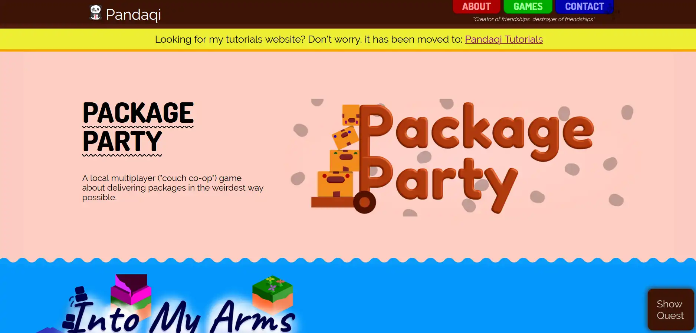
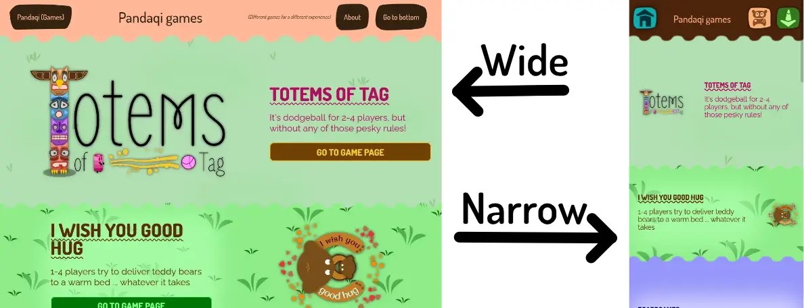
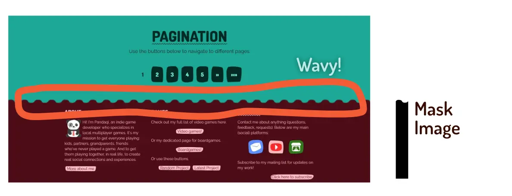
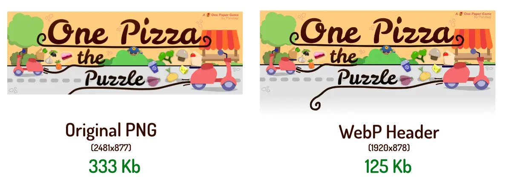
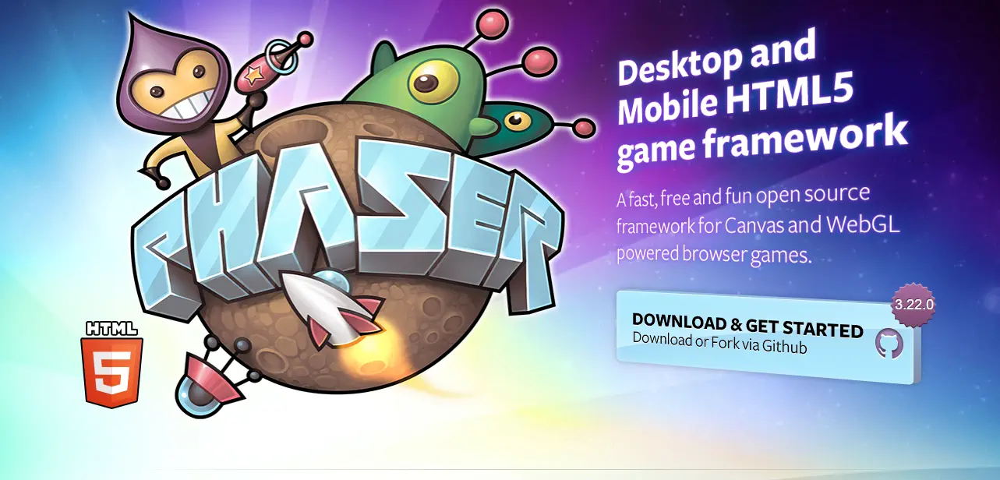
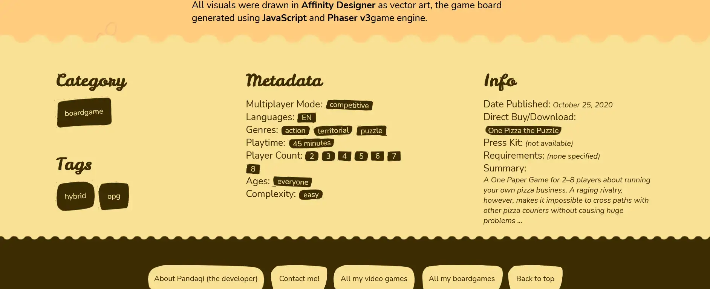
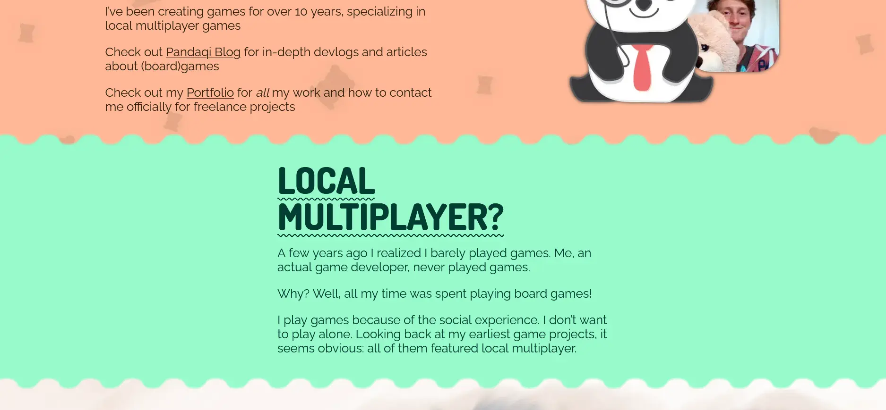
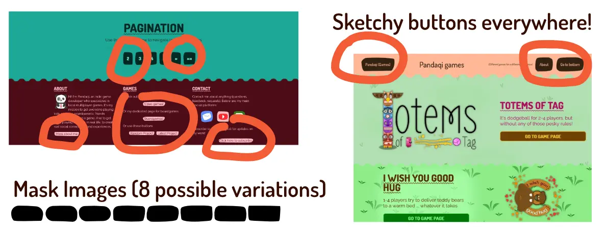

I've been making games and uploading them (under the moniker "Pandaqi")
for about 7+ years now.

At first, they were just a few hobby projects on some sketchy website.

But as it goes, you grow more professional over time, you create bigger
games, more people find them and download them ... and then you realize
it's all a mess.

For 6 years, I had been haphazardly uploading games left and right,
without any clear structure. There was *no* central place for all my
games, even though I'd made quite a lot of them at this point. (I was
actually surprised people were able to find an email address amongst the
chaos and successfully *mail me* about projects.)

That's why, when I registered myself as a freelancer (in the
Netherlands, my home country), I decided to create a proper "game studio
website".

I was a fool. I thought websites like these needed to be "flashy". I
thought it was a good idea to *make the website itself a game*. I
thought I was good enough, and big enough, to warrant a website with
boatloads of pictures and GIFs.

At the same time, I thought "I've made less than 10 games these past 6
years ... surely this website will only grow *slowly* and I won't need
to update it very often".

All of this led to a website that:

-   Was incredibly slow to load.

-   Had to outsource all its images to a free image hosting service,
    because my cheap server couldn't handle it otherwise.

    -   (Before doing this redesign, I had 400+ big images hosted and
        requested 24 hours a day from my free imgur account :p)

-   Only looked *awesome* ... some of the time.

    -   (I used "ColorThief" to read the logos when they were displayed
        and find the most common colors. Then I used those in the
        design. Needless to say, this doesn't *ensure* legibility or
        something that looks good in general.)

-   Was incredibly hard to navigate.

-   Got in my visitor's way by prompting them to "play the game" and go
    with that flow

    -   The game was simply "find the hidden pandas on the website". If
        you found one, you could click it and progress.

-   And was so hard to update that I even forgot to do it for my latest
    projects.

Yes, I only made a handful of games in that timespan *because I was
still studying* and *still learning how to develop games*. Once I
finished my degree, and became a full-time freelancer, I made 10+ games
in a single year. Each of them bigger and more professional than all
that came before.

Additionally, I implicitly built the website for *video games*. I had
never thought I would be developing loads of boardgames in the year
after it ... which subsequently never had a good place on the website.

That's why I decided to **completely redesign the website and all its
content**. In this article I'll explain **what I did, why I did it, and
what you can learn from that**. (For your own website, portfolio, game
studio, anything that tries to showcase projects and wants to have a
good user experience.)

Step 1: What are the requirements?
----------------------------------

Before doing anything, I have to ask the important question: "what
*should* the new website do? Which problems am I fixing and how do I
prevent adding more problems?"

Before doing this update, I also redesigned [my portfolio](https://rodepanda.com)

Such a website is, of course, purely designed to give an *overview* of
all my work. Which means structure, navigation, and literal overviews
are important.

This gave me my first clues for this website, which I *somehow* didn't
think of the first time:

### Hierarchy

-   There should be a clear *hierarchy*. A few categories (video game,
    board game) and tags you might search for (free, paid, mobile, PC,
    etc.)

-   This hierarchy should enable users to *get anywhere they want*
    within *a single click*.

-   To do so, each game needs to be properly tagged, and this metadata
    should be displayed in a few consistent, easy-to-reach places.

### Visuals

-   Each project, without exception, should have a *thumbnail, header,*
    and *logo*.

-   Always use these images in overviews/lists. If space is at a
    premium, I'm okay with leaving out any *text* (even the title of the
    game), if it allows the visuals to come through.

-   There should be *no* case, *no* page, *no* screen size that makes
    the website (almost) impossible to read or navigate. (Sounds
    obvious. But the previous website had some really wonky colors and
    font sizes on breakpoints between "wide screen (desktop)" and "small
    screen (mobile)".)

-   These images should be as big as possible. Clicking *anywhere* on
    such an image leads you to the project page. (Nothing worse than
    clicking ... and nothing happening. Until you realize, 10 seconds
    later, there was some *small button* saying "visit game" somewhere
    that you actually had to click.)

The original design tried to do everything in one image. I would create
single image with a (repeating) background and the logo on top. Then I
used many (*many*) CSS tricks to make this look good on all sizes, and
even allow it to *swap sides* (so if the logo was on the left at first,
it now was on the right).

As you can expect: this was a lot of work ... for a system that only
worked 60% of the time. Often you'd still see the gaps, or the image
wouldn't scale correctly, or the text overlapped the logo.

That *surely* had to change.

### Speed

A nice start, but not all issues are resolved. The second problem had to
do with **speed** and **website size.** Obviously, *faster is better*,
which can be achieved by:

-   Reducing page size, mainly by reducing *number of images* and their
    *size*

-   *Loading CSS / JavaScript / Fonts after the whole document is
    already loaded.*

-   Sharing files across the different pages. (So it can be downloaded
    once, then cached, then reused.)

-   Being *very* picky about what I do or do not include.

-   Removing all the scripts that are now running *on every page*. (I
    have one that dynamically changes the colors of projects, another
    that loads the "game" portion of the website, etcetera.)

### Minimalist

That last point illustrates something that's annoying me about many
"modern" websites: they all add these fancy effects, huge graphics
everywhere, dynamic widgets and whatnot.

The result? I have to wait 10 seconds before the whole thing is loaded.
During that period, the page keeps jumping, changing in size, adding new
stuff. And while it plays some cool animation (or asks my permission to
show push notifications), I'm just *trying to read the thing for which I
came*.

As such, I try to keep my websites minimalist. It should just be: click
on something, it loads almost instantly, you can read/see/use it, boom
-- done. No extra animations. No dynamic things that should update all
the time.

In fact, if I can manage it, *no scripts at all*.

After all these years of designing things, I've learned that the hardest
thing is not to create fancy and spectacular designs. The hardest thing
is keeping things simple and streamlined (without making them look ugly
or boring).

Hence why I probably failed on that part with the first design.

In any case, the new website should be minimalist and streamlined.

### Usability

The website shouldn't just be good and quick to use for *others*, it
should also be great for me to *update and maintain*.

-   Host all assets (mainly images) on my own server. This way, I keep
    total control, and everything is in *one place*.

-   For any "pattern" that occurs, create a module for it I can reuse.
    New game pages should consist like 90% out of things I *already
    made* and can just easily reuse.

-   The final folder structure should be one that is obvious and easy to
    navigate. (For example, it's easy to fall into the trap of placing
    all images in one big "assets" folder. But over time, you'd get a
    single folder with *a thousand images* belonging to *many different
    projects*. Not great. Instead, each project has its *own* folder
    which contains *everything* that's relevant.)

-   Use a "static site generator". (I'll explain that one soon.)

### Variety & Showcasing

And lastly, I should be able to give each game *its own unique page*.
Which might look *completely different* from any other page on the
website. Which might be completely interactive or contain its own
"digital component" that belongs to a boardgame of mine.

-   This was a hard one to fulfill. I had to research *a lot* to find a
    good way to do this.

-   But eventually, I decided to simply treat each game page as a *blank
    slate*. Almost zero markup or styles are copied from the "main
    theme" -- instead, I can create anything I want for each particular
    game.

-   But, I will still create *some* general patterns. Some "plugins" I
    can reuse anywhere I want. Some "general properties" I can set for
    each game, such as which color scheme to use when showcasing the
    game on the front page.

That's about it for the requirements. It should be something that
showcases all my games in their visual glory, but still keeps a strong
user experience and navigation to get anywhere with ease. Each game
should have their own unique look, but behind the scenes I should be
able to create that look with just a few "modules" (which I made
myself).

And I should let go of the "naïve" implementation of a "game within the
website" and other fancy stuff that contributes absolutely nothing :p

Step 2: Say goodbye to databases
--------------------------------

Most online hosting -- at least the *cheap* variants -- only support the
PHP + MySQL databases.

After all these years, I've grown to hate these with a passion. The
interface is slow, ugly, and dated. Their speed (when requesting info or
updating) is nothing to write home about.

But at the time, it was the only thing I *had*, and the only thing I
*knew well*. So the old website had all its content stored in a
database, and almost every file was a **.php** file that included some
other files here and there.

Since the inception of this website, I've learned about **static site
generators**. I built two websites with them and it's just been a
*breeze* compared to the old PHP/SQL/Database method.

As such, even though this is a *game website* and thus *very
interactive*, I just *had* to use this system.

A static site generator works like this:

-   You download the generator software.

-   You work on the website locally, on your own computer, by writing
    content in files.

-   With the help of some tools, you can create *templates* to transform
    your content into good-looking websites.

-   When satisfied, you can tell the generator to "build" or "export"
    the whole thing, which gives you *one folder* that contains your
    *whole website* (as static .html files)

-   Drag that folder to your server (to upload it) and you're done!

These are the *benefits*:

-   Extremely fast. The end-product is just a bunch of small files. No
    databases, no other connections, nothing to be calculated
    dynamically.

-   Modular. For example, I can write a bit of code for a "screenshot
    gallery". Now, whenever a game wants to display some screenshots in
    a gallery, I just type the name of that code and it's done. No need
    to repeat myself. And if something drastically changes, I only need
    to change this *one file*, and it updates the whole website
    accordingly.

-   You can work completely offline, locally, without any issues.
    Deploying the website simply means uploading the final folder to
    your server.

-   Creating content is just *creating content*. I make a file, I type
    my words, I tell it to use images in a few places, and it all works
    out.

The *downsides* are:

-   Can't be used for very dynamic websites. (For example, one that has
    *user accounts* and shows *different pages to different users*. Or
    one that is updated 100 times per hour.)

-   You need to learn the specific concepts and syntax for your
    generator.

-   For me, there was *no* easy way to transfer the old website to the
    new one. The systems are so drastically different that I had to
    manually copy-paste most of it.

The first website I created this way took a *long time*. I needed to
wrap my head around this "new" way of thinking, designing, and
deploying.

That's why I saved this website (Pandaqi) for *last* out of all my
websites. Because I knew it'd be the hardest, with its many interactive
components.

(In case you don't know: many of my boardgames are actually "hybrid
boardgames". They have an additional digital component. Which is
basically a whole game, written in JavaScript, that should always be
online and able to execute on any device. It took quite some skill to
copy that to the new system *without breaking everything*.)

For this website, I chose [Hugo](https://gohugo.io). It's one of the most
popular, it has great documentation and help forums, it has all the
features I need, and is *super fast*. Nevertheless, I've done research
on many different static site generators, and they all seem more than
able to do the job. So don't feel like you *have* to choose Hugo.

Step 3: A better general design
-------------------------------

The old *design* was great! But the way I made it happen -- using all
those CSS and markup tricks I mentioned earlier -- was bug-ridden and
messy, to say the least.

Fortunately, I'm a wiser man now, and the internet has grown.

This is how I will design the same thing ... but better:

-   Nothing uses the CSS "background-image" property.

    -   Why? I can't optimize their loading, making them slow,
        especially when you have many *huge* background-images on a
        single page. They are also sometimes hard to position/scale
        correctly.

    -   Instead, I use regular pictures, wrapped in a **\<picture\>**
        element.

-   Each game has a *background pattern* that scales the full width.
    This, too, is a regular image I designed beforehand.

-   On top of that, there's a *flexbox* with two components: *text* (on
    the left) and *logo* (on the right)

    -   By adding one CSS class, these can easily be *reversed*.

-   On smaller screens, both logo and font-size shrink to fit the space.

    -   I've experimented with "wrapping" them, so the text appears
        *underneath* the logo on small screens. But it just looked weird
        and ugly.

-   The actual *images* and *colors* to use are set directly in the
    entry for this game.

    -   At the top of markdown files, which Hugo uses, I can set
        "frontmatter". Which basically means "any property I want to
        give this game".

    -   There I can just say something like "bgColor: \#FFF" and then
        use that in the template that renders this thing.

    -   Most importantly: I do **not** dynamically determine these, but
        input them **manually** to look as good as possible.

This recreates everything the old design did ... but much faster,
cleaner, better-looking and easier to maintain.

Well, everything except for one trick: the **wavy borders** separating
entries.

The trick I used back then was a complicated idea with pseudo-elements
and background-colors. Fortunately, some new (CSS) properties are now
well-supported, which make this *much easier*.

I'm talking about **mask-image.** I can just draw this wave in my design
software and use that as a mask. Boom, done.

(In fact, it was so easy and nice, that I wanted to experiment with
other patterns. So I ended up spending a few days trying to find
interesting masks I could use throughout the design. I'll talk about that near the end.)

And if a browser doesn't support it? The entries are just separated by a
straight line, which is fine as well.

Step 4: Faster speeds
---------------------

### Images

By now, it's obvious this website needs images. It already had a lot,
but with the new design *this amount will only increase*.

Some of these images, like big banners/headers across the full width of
the website, are *huge*. Despite my best efforts back then, I could only
get them to a 500-700 kb .png file, before it started looking too
pixelated.

But now ... now we have new image formats! The **webp** format has
*huge* compression bonuses over the **jpg** and **png** formats. And
it's supported everywhere now.

The upcoming **avif** format is even better, and it's getting there, but
not quite supported enough to use it fully.

So, I use *both* and let the browser pick the one they understand.

With such a conversion, a single game page (that might've been 2-3 MB
before) is reduced to 200-300 kb. And, to my eyes at least, the
difference is only barely noticeable. Faster load times, less server
stress, win-win for everyone.

**Remark:** and the images are now on my own server. Which removes the
need for an external connection, which *should* be faster on a decently
fast hosting.

### Moving images

Because the website showcases games, there are many *GIFs*. These are
terrible for performance. Even *extremely compressed and optimized* GIFs
can easily run 3-4 mb. And I might need multiple of the on a single
page!

These are converted to **video**. (The **webm** format is optimal. It's
often at most 20% of the original GIF size.)

During this process, however, I noticed I went a bit overboard with
GIFs. So many of the were simply *removed* and it made the page
*better*.

Which means that many optimizations were done by simply **removing
things I don't really need.**

A screenshot gallery with 5 screenshots is fine, I don't need 10 of
them. Displaying one gif that shows the core gameplay is enough, three
of them that *look kinda similar* just adds noise.

### Images, but now later

Native support for "lazy loading" has also arrived!

Lazy loading means: only load an image *after* the rest of the page has
loaded and/or *when* they actually come into view.

On a typical page, you'll only see the first 2-3 game entries, or just
the header + trailer for a game. This means that 80% of the images on a
page are *not in view*.

By not loading them yet, pages become *much faster*.

**Remark:** I've experimented a bit with the "content-visibility" CSS
property. This allows lazy loading for *any block on the website*, not
just specific images. But it's only (well-)supported in Chrome at this
time, so I'm not betting on this doing anything for me.

**Remark:** I also ask Hugo for the dimensions of each image, so I can
hardcode them into the **width** and **height** parameters on the image.
This makes browsers and search engines very happy, but also makes users
happy, because it reduces those "jumps" or "content shifts" that happen
when a new image gets loaded.

### The usual suspects

Most of my performance increase, though, comes simply from using a
static website. It removes the need to **query a database for things**
and **do calculations/operations** on the page itself. This saves a lot
of time.

It also makes each page (and asset) easily **cacheable**. After a few
page views, visitors should have most of the website cached in their
memory, reducing *any* requests from the server.

But the other main factor is of course **server quality**. I use
relatively cheap hosting. At times, it might take a second before the
server responds to a new request. I can't do anything about that except
*upgrading to a better server*.

Step 5: Modules
---------------

### Why modules?

This redesign was my first experiment with making a website *really*
modular.

This was the idea:

-   Each unique game page can be built from modules ("templates" or
    "shortcodes" in Hugo) I designed myself.

-   Each different component receives its own CSS file. These are
    combined into a *single* CSS file when deployed.

-   One module is the "critical CSS". This is loaded *before* the rest
    of the webpage loads, hence "critical". All other CSS is loaded
    *after* the content is already showing.

Why? Because I've learned that modular methods ...

-   **Make development itself more efficient**. It's way easier to find
    where something is, update it, and get the precise result you expect
    (because nothing else is affected).

-   **Make me more productive.** A new web page is nothing more than
    chaining the correct modules together, instead of *writing all that
    HTML myself from scratch.*

-   **Reduce the chance (and severity) of bugs.** It's just easier to
    reason about issues and spot errors with your code.

-   **Create a nice structure/hierarchy to the whole project.**

Again, this required me to "think differently". I had to find patterns
and common blocks among *all* the pages I'd created thus far.

And when I found something, I had to ask myself: "is this common enough
to justify creating a module for it?"

And even when I didn't find anything, I often had to ask myself: "but I
*might* need something like this in the future -- how likely is that?"

### The basic modules

In the end, these modules were created:

-   Video =\> shows the trailer for the project + its banner behind it
    (as background)

-   Section =\> creates a section with header + paragraphs of content

    -   Section-centered does the same, but now it's *centered* with a
        specific (consistent) maximum width.

-   Gallery =\> shows a gallery of screenshots

    -   Figure =\> shows a *single* (full-size) image on a game page, in
        the optimized way

-   BuyLink =\> shows big, bold links to the official page of a project
    (where you can buy it or play it)

    -   There's a BuyLinkContainer as well, as some projects have
        *multiple* links/locations of interest, such as something
        released on both Desktop and Mobile.

    -   A variation is DownloadBtn, which is used for boardgames where
        you can *download* files.

-   Metadata =\> creates clickable buttons for the *categories* and
    *tags* related to the current project

-   DigitalComponent =\> holds the form (with settings, input, etc.) I
    use on almost all boardgames for launching the digital component

All of these are *shortcodes* in Hugo.

This means I create a file for them (like "embedvideo.html", which shows a YouTube video _over_ the game header) which holds
their code:


<section class="game-header {{ .Params.class }}">
	{{ if (.Get "bg") }}
		{{ $img_url := add (.Get "bg") ".webp" }}
		{{ partial "show-image.html" (dict "context" $.Page "img_url" $img_url) }}
	{{ end }}

	{{ $border_col := or (.Get "col") "#6bb73e" }}
	{{ $border_width := or (.Get "thickness") "5px" }}

	{{ $base_class := "video-over-header" }}
	{{ $fixed_size := "width='560' height='315'" }}
	{{ if .Get "full-size" }}
		{{ $fixed_size = "" }}
		{{ $base_class = "video-no-header" }}
	{{ end }}
  
	

		

			<iframe src='{{ .Get "vid" }}' allow="accelerometer; autoplay; encrypted-media; gyroscope; picture-in-picture" allowfullscreen="" {{ $fixed_size }} frameborder="0"></iframe>
		

	

	{{ if .Get "caption" }}
		

			{{ .Get "caption" | markdownify }}
		

	{{ end }}
</section>


<!--  -->

Then, when I want to use it, I call it by its name and feed it the right
urls:

<!-- Note the /* */ around it; that's needed to tell hugo NOT to execute this, but leave as is -->

{}


<!--  -->

As such, what used to be 20 lines of identical code *on each page*, with
40 lines of identical styling *on each page* ... is now just one line.

**Remark:** I've written all these modules to support adding any number
of CSS classes I want. This way, I can still style them differently,
even if their functionality/markup is the same everywhere. For example,
some games have the "darkened" class added, which darkens the background
image. In some cases, this just looks better *and* makes the text on top
more legible. But not all cases.

### The support

Again, each module had its *own* CSS file. (Which means these files were
often only 20-30 lines for the whole thing.) And these are all combined
at the end.

**Remark:** I use SASS for writing CSS. It has loads of functionality
that I sorely miss in the basic CSS ruleset *and* it can combine
multiple files.

I hardcoded support for an extra CSS file (literally called "extra.css")
on each page. This would hold all the unique adjustments they wanted to
make, which often ends up *longer* than the general styles. (Because,
remember, each game page has a unique layout, with unique fonts, colors,
dimensions, etcetera.)

And finally, I hardcoded support for Google Fonts. All game pages use
it. In the past, I copy-pasted the code (with the new fonts I wanted to
use) between pages. Now I just specify the font names in the
"frontmatter", and it loads them when deployed.

**Remark:** it might be faster to download these fonts and place them on
my own server. But this meant \~200 kb extra space *per game page*, a
lot of extra work, without any certainty that it even *is* an
improvement for me. So I left it for now. I can always do this later.

Step 6: Copying all the content
-------------------------------

Well ... this was an annoying job. To say the least.

I ended up limiting myself to 1 or 2 projects per day. Because they
sometimes took *hours*. I had to:

-   Copy the original HTML file and its files.

-   Convert all images, rename sensibly, put in the correct location,
    then link to them again in the new post.

-   Remove all styling, extra markup, etcetera from the original HTML
    file. So I was left with *just* the content itself. (To replace it
    with my new modules. Or simply because it was messy or unnecessary.)

-   Place it at the right location in the new website.

-   Then test if it all worked =\> realized some things didn't work
    (they looked bad, links stopped working, etc.) =\> fix them =\> and
    restart the cycle.

I really tried finding ways to automate this. But despite some mild
automation on the *image conversion* part and the *stripping HTML* part,
I didn't find any.

Step 7: Fixing all the interactive components
---------------------------------------------

The hardest part was **making the digital (interactive) components
work**. They often involved

-   A bunch of JavaScript + Assets

-   That used the Phaser.io framework for many things

-   That needs to communicate with the main page in certain (mostly
    identical) ways

-   Which requires something to be on a *server* and will not work when
    testing from the local filesystem

-   And often *hardcoded* the URL to assets used in the component

So, I first had to come up with a "general script" that would allow this
communication between main page (where you input settings and click
"start game") and the actual interactive component. Now, all pages use
this script and can use its functionality, which *greatly* simplifies
(future) code.

Then I had to update all references to JavaScript (to a
better/consistent folder structure), remove the hardcoding, make the
Phaser references local, link it to the "general script", and test if it
all still worked. Probably not. Fix the issues, and the cycle repeats.

At first, I *thought* the process was even worse. You see, JavaScript is
not allowed to read from your filesystem (for obvious security reasons),
so any HTML5 game that uses image assets has to be run through a
*server*.

When creating my old Phaser games, I always had to boot up a *local
server* on my machine, otherwise the images wouldn't load.

I thought this would be the case here. I thought I had to do some hacky
tricks to combine the *hugo website* with my *local server*.

**But I didn't!**

Hugo itself already runs over a *websocket* and is viewed as a local
server (by the Phaser framework). I didn't have to do anything to make
testing these games (directly) possible!

(You can imagine the pleasant surprise on my face when I simply ...
copied the JavaScript to the new folder, the page automatically
reloaded, and the images just *showed up perfectly*.)

Which isn't just great news now, but also for the future, as it means
development of these interactive components will be *much* faster and
smoother.

**Remark:** I also learned the Phaser simply supports "whatever formats
the browser supports". So, I can use any *audio* and *image* assets that
I want, without requiring any other change. This prompted me to
*convert* (almost) all the old assets to **.webp** as it's supported
everywhere now. This made the interactive components 2x-10x *smaller*
than they were before! Which is awesome, as it means load times (and
"time until play") are much faster, without losing anything.

### When *do* you need a local server?

If you want to execute PHP code or read from a database anyway. (I can
think of a few reasons why you'd want PHP functionality in a static
website anyway, it's not that strange.)

If you want to do that, here's how you do it:

**How do you boot up a local server?** I have installed the free
software "XAMPP". Just download it, install it, then run it. By default,
it serves websites from its own directory (C:\\xampp\\htdocs).

**How do we connect it with our hugo folder?** But we want it to serve
from the directory in which I'm working (with Hugo enabled).

To do so, you go to Apache =\> Configure =\> httpd.conf =\> and change
"DocumentRoot" to the root of your hugo folder. Also change the
"Directory" after that! (I forgot that at first and spent 30 minutes
pulling my hair out why it didn't work.)

**It doesn't work?** Restart the xampp server! Then build your website
(to the directory you just linked), and your project is running on a
local server.

### Lessons learned

**The lesson here?** Many actually:

-   Don't hardcode URLs

-   Don't have external dependencies =\> keep everything local, on your
    own server, if possible

-   Future-proof your websites *before* you start adding tons of content

-   Be consistent with naming, folder hierarches, etc. Even if you think
    it won't matter, it *will*.

-   Use TypeScript instead of JavaScript. With my oldest projects, I am
    in constant fear of it *breaking* and *never finding out how to fix
    it again* :p

Step 8: Finishing it off
------------------------

By now, all original content had been copied. The interactive components
worked again, their images were loaded (from my own server now), great.

But now it was time to *improve* the old content.

### Metadata

While building the new website, I noticed it was hard to navigate
quickly to *specific* pages. Thinking about it, I realized that game
stores always show this big block of information about the game:

-   How many players does it support?

-   Offline or online?

-   System requirements?

-   Etc.

**Yes! That's what I needed!**

Every game page received a "metadata block" at the bottom, which is
filled with all this information. It took quite some time to *edit all
the gamepages to contain this data*, but it's certainly worth it.

Now you can scroll down to see info about each game, in a predictable
and clear way. Then you can *click* on any part of it to find an
overview of all games that share this trait. (For example, click on
"Playercount 2" to get all games you can play with two players.)

### Colors

I needed a general list of "color schemes" which could be applied.
Sometimes randomly, sometimes given a specific input.

Why?

-   Because each game page *does* receive this standard metadata block
    (and a small footer). These need to look good with whatever is on
    the page, and can't have "one fixed style".

-   Because *overview* pages (e.g. a list of all genres) don't have
    images or thumbnails. Therefore, I need *some* colors for their
    background and text color.

In the end, the website received 10 color schemes. (Which are just all
the different colors along the color wheel, with one "light" variant and
one "dark" variant for contrast.)

-   Each gamepage has a *specific* color set. (This is used in all
    locations where no image is present or it isn't overridden by the
    stylesheet.)

-   Overview pages pick random colors, ensuring no color is used two
    times in a row

-   The general header and footer of the website *also* pick a random
    color.

Again, it took quite some time to find the right color (and set it) for
*every project*. But it's more than worth it. The website looks bright,
colorful, playful, exciting!

This *does* have the issue of, sometimes, creating a color combination
(two color schemes near each other) that is a bit "meh". The way I chose
the colors, it will never be *ugly* or downright *terrible*, but it can
be a bit mediocre.

I decided I can live with that. If needed, I could always write a script
to say "when picking colors, these combinations are never allowed"

### Sketchy Buttons

The idea with the "mask-image" (creating a wavy underline underneath
each game banner) worked so well, that I wanted to use it more.

At first, I wanted to try different shapes (curved, sharp edges,
triangles, etc.) ... but that looked messy. Maybe for a specific game,
or for another design that's completely about shapes.

Instead, I drew eight "sketchy rectangles". (Which is my term for
rectangles that are *mostly perfect, but also have imperfections, such a
rounded corners or angled edges. A rectangle that looks like it was
loosely sketched.)*

These are used as the background for (almost) all links on the website.
The header, the footer, the metadata block.

Maybe in the future I'll use them for literally everything. But for
now, there were issues with that I couldn't quickly solve, and I kept it
the way it was.

### Finishing touches

As always, there are literally *hundreds* (if not *thousands*) of small
choices and additions to make the site work and look better.

I won't list them all. But here are some interesting ones:

-   On narrow (mobile) screens, the text in the header is replaced by
    icons. This way, you keep full functionality (without needing to
    "expand" a menu or something), without becoming ugly/illegible/too
    big.

-   A small "go to bottom" icon floats on top of *every* page, in the
    top-right corner. Pressing it will immediately scroll you down to
    the metadata block. When navigating my own website, I just felt that
    such a button was too useful not to add. (Even if it means an icon
    hovering on *every* page.)

-   Because my mask-image is set to *cover the whole element*, it
    *scales* with the size of the element. This was a problem with the
    footer. On narrow screens, it can be quite long (as all text is
    stacked underneath each other, instead of side by side). Which
    caused the waves to be HUGE. As such, on smaller screens, I remove
    the mask image from the footer, and add a "divider" element that has
    a fixed height, then give *that* the mask-image.

-   Many elements are (not so) subtly animated. When visiting other game
    (studio) websites, I noticed they had loads of animations and moving
    parts. And that it was quite fun. So I wanted to copy it, without
    adding the complexity (and thus making the website slower again). An
    example of this: those sketchy buttons are *slightly* rotated and
    will snap back to 0 rotation when you hover over them.

Step 9: Profit
--------------

Let's hope I profit from it :p

The website is much faster, prettier, more consistent (on all devices,
even the most terrible of phones), easier to navigate and easier to
update, has more information and images, the list goes on.

Looking at it now, and comparing to the previous website, it just feels
like an "upgrade to professionalism". The earlier website was *fine*,
and *okay* in many departments, but showed its amateurism after a minute
of navigating. The new website looks and feels like a professional
website, from a serious game studio, who has loads of experience under
his belt.

I'm quite sure it will bring in more gamers, shine a better spotlight on
my games, and lead to more opportunities in the indie game dev business.

That's it for today, until the next devlog,

Pandaqi
