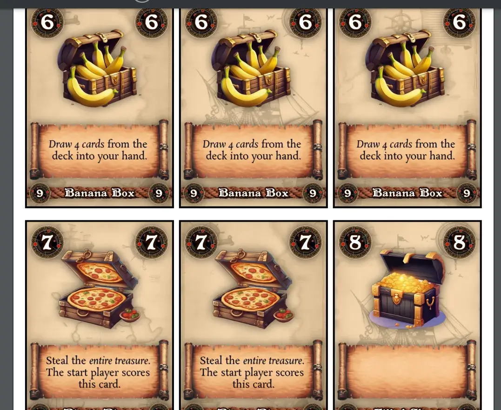

My [game studio website](https://pandaqi.com) has become so large and interactive these past few years that I basically have to do a big rewrite behind the scenes every few months now.

This article is about one of the biggest and most complex rewrites. The issue that plagued me for years until I finally took a break from my projects to add proper solutions.

It's called **text**. (More specifically, text blocks, text wrapping, and images inline with text.)

## What's the problem?

On my website, for almost all board games, you can press a button and it _generates_ the material on the spot.

It uses technologies that have been well-supported in all browsers for over a decade now, mainly **Canvas** and **JavaScript**. 

The output is a high-resolution, professional PDF with the material (usually playing cards or tiles) you need for that game. 

{}
My One Paper Games are similar, but they generate one _paper_ or playing board for you, per game you want to play.
{}

Working with _images_ is relatively easy.
* I create the correct image myself in drawing software.
* Then simply use `drawImage` (on the canvas) to place the right frame of the image at the right location.

Similarly, working with _shapes_ is relatively easy.
* I create the correct points for the shape.
* Then use the built in `path2D`, `stroke` and `fill` (of canvas) to create it.

But text? Text is like an entirely different world. Every time I tried to tightly integrate it with the other code, I failed and had to compromise by making a separate class for drawing text.

Why?
* You have no clue about the dimensions beforehand. (Different cards will have different texts or powers, creating a text box of a different size. Even _single word_ text boxes are obviously not consistent in width or height.)
* In most cases, you want the text to _wrap_---to neatly stay inside its box instead of becoming one huge line.
* Similarly, you often want different text styles _within_ a text box, such as one word that is **bold**.
* And as if that's not enough, any reasonably complex layout will also require **images** (mostly icons) inline with the text.

When I just started making One Paper Games, I used the _Phaser_ framework. Perhaps the biggest reason was that it supported a few nasty things, such as _text_, out of the box.

But despite being perhaps the biggest and most-used Canvas framework on the planet, it _does not support_ changing styles or adding inline images.

If you want that, they advise you to just put an HTML container _on top of_ your game, and use the built-in browser capabilities to render more complicated text.

This is a fine solution for interactive games, but simply doesn't apply to _generated images/PDFs_. When I generate a paper for your One Paper Game, I can't cheat my way through the text by placing some HTML elements _on top_ of it. Because once you click the download/print button, those would be gone!

So I needed my own solution for displaying text, and that's how this journey started.

## The first approach

For my very first games, I took the approach of "be smart with your layout, so you don't NEED that extra functionality".

In other words, I designed the cards in such a way that they needed no text, or only a _single_ centered word.

This can be accomplished quite easily with
* Setting the `textAlign` property to `center`
* Then using the built-in `fillText` function to draw the text at some coordinates

Each time I needed letters, I re-wrote the same 10 lines of code to put raw text onto the canvas.

This obviously stopped being fun after a few games---if it was ever fun---and stopped being useful once I really needed text that would wrap.


const canv = document.createElement("canvas");
const ctx = canv.getContext("2d");
ctx.textAlign = "center"

const textToDisplay = "Play a card";
const position = new Point(10, 20); // my custom class for 2d vector stuff
ctx.fillText(textToDisplay, position.x, position.y);


## How to wrap text?

The Canvas has a useful function called `measureText`. It tests how much space a piece of text would take up---on the current canvas, with the current font settings---and returns that.

With that function in hand, the general algorithm is rather simple.

* Split the text into lines (by the `\n` symbol) and then words (by spaces).
* Keep track of the current position (x and y)
* Repeat the loop below until done.
  * Measure the size of the next word. 
  * If we've exceeded the size of our text box, increase the Y-position and start on the next line
  * Otherwise, increase the X-position and keep going on this line

This places the text from top to bottom, left to right. How do we align it differently?

* Left? See above.
* Center? Add _half_ the size of the text box to the starting position, set `textAlign` to `center` when drawing.
* Right? Add the _entire_ size of the text box to the starting position, set `textAlign` to `right` when drawing.

This is for the X-axis: the horizontal axis. The Y-axis is dynamic---it depends on the specific text and how it wraps---so we must calculate it differently.

* Top? See above.
* Center? Calculate the empty space within the text box. (Total text box - height used by text) Add _half_ that to the coordinates.
* Right? Add the _entire_ empty space to the coordinates.

Below is some (incomplete, incorrect, but clear) pseudo-code for this.


const inputText = "Play a card.\nImitate a crocodile.";
const lines = inputText.split("\n");
let curLineWidth = 0;
let posY = 0;

for(const line of lines)
{
  let lineTooLong = true;
  let tempLine = line;
  let textLeftToProcess = tempLine.length > 0;
  while(textLeftToProcess)
  {
    while(lineTooLong)
    {
      removeLastWord(); // tempLine = tempLine.slice(0, tempLine.lastIndexOf(" "));
      checkNewLength(); 
      // newWidth = curLineWidth + ctx.measureText(tempLine).width;
      // lineTooLong = (newWidth > textBoxWidth);
    }

    drawLine(); // use position = (0, posY);
    startNewLine(); // curLineWidth = 0; posY += lineHeight;
  }
}


The remaining question is, of course, _how do we find the actual width/height used by the text?_

## How to find text dimensions?

Here we see _another_ nasty side of text. 

Letters aren't uniform. Some letters have ascenders (such as `b`) or descenders (such as `p`) that stick out. Capital letters are obviously different from lowercase letters.

As such, the `measureText` actually returns several different metrics with subtle differences in how they're defined.

* `actualBoundingBoxLeft`: left-most pixel
* `actualBoundingBoxRight`: right-most pixel
* `actualBoundingBoxAscent`: distance from center line to top-most pixel
* `actualBoundingBoxDescent`: distance from center line to bottom-most pixel

In other words, to get the _true_ (complete) height of a piece of text, we need to _add_ the Ascent and Descent.

The distance between complete _lines_ can be controlled by ourselves. In my code, there's a simple `lineHeight`: whenever it moves to a new line, that's the distance it adds to the coordinates.

When the text is _long_ (many wrapped lines), you can simply multiply the number of lines by the lineHeight. It won't be exactly correct, but nobody will notice.

When the text is _short_ however, I figured out I had to use the true size, otherwise the value could be _wildly inaccurate_ and hence aligning looked inconsistent. 

{}
For example, a card design might have certain powers that take 3 or 4 lines, but other powers that are so simple they only take 1 line. Using _line height_ for height then would be completely wrong. Because there's only one line, and all you see is its specific height.
{}

Now that we know how to get the boundaries, we can get the exact, _actual_ dimensions of the text by ...

* Looping through all lines
* Measuring them
* And finding the _furthest_ coordinates (minX, minY, maxX, maxY)

I quickly learned that this distinction is important. Sometimes I want to center text based on the _text box_ I supply, sometimes I want text centered based on the _actual_ dimensions it happens to fill. As such, there's a toggle for this inside my system.

Again, below is hugely simplified pseudo-code for clarity.


const lines = ["Play a card", "Help your neighbor"]; // an array of text chunks, one per line
const minPos = new Point(Infinity, Infinity);
const maxPos = new Point(-Infinity, -Infinity);
for(const line of lines)
{
  const metrics = ctx.measureText(line);
  const minPosLine = new Point(metrics.actualBoundingBoxLeft, metrics.actualBoundingBoxAscent);
  const maxPosLine = new Point(metrics.actualBoundingBoxRight, -metrics.actualBoundingBoxDescent)

  minPos.x = Math.min(minPos.x, minPosLine.x);
  minPos.y = Math.min(minPos.y, minPosLine.y);
  maxPos.x = Math.max(maxPos.x, maxPosLine.x);
  maxPos.y = Math.max(maxPos.y, maxPosLine.y);
}

const actualSize = new Point(maxPos.x - minPos.x, maxPos.y - minPos.y);

// now use actualSize for positioning
// for example, to align to BOTTOM (on Y-axis), we'd start drawing the first line from this anchor position ...
const anchorPos = new Point(
  minPos.x,
  maxPos.y - actualSize.y
);


## Icons and Styles: attempt 1

This works fine. It's relatively fast and simple, yet will suit most games. 

But certainly not all. I kept the system in this state for a while because it was daunting to move further, but I eventually created a game that simply _required_ icons in line with the text.

Being a programmer, however, I first tried the lazy way out.

I wrote a simple script to turn any part of my layout into an HTML element. (In other words, each resource has a `toCanvas` function that puts it on the canvas, but also a `toHTML` that creates a `div` element and sets a few simple CSS properties to get the same look.)

Now I could use one of many "html-to-canvas" JavaScript libraries!

I could create my text as an HTML block, use CSS to modify styles, and then stamp that onto the canvas at the right location.

Below is some pseudo-code of the functions that would be on each "Drawable" object. (This is very inefficient and copies a lot of code. It's not how I actually do it, but it illustrates the concept.)


toCanvas()
{
  ctx.fillText(this.text, this.pos.x, this.pos.y);
}

toHTML()
{
  const span = document.createElement("span");
  span.innerHTML = this.text;
  span.style.top = this.pos.x + "px";
  span.style.bottom = this.pos.y + "px";
}

toCanvasUsingHTML()
{
  const node = this.toHTML();
  await htmlToCanvas(node); // this uses that external library
}


This works. After a few hours of fiddling and realizing a few stupid mistakes, it worked flawlessly and allowed me to make that game the next day.

But you probably feel the same way as I did. _Two_ separate systems? A messy codebase that needs to connect different APIs and hope no update ever breaks it? When I was so close to doing it all with one unified system?

Furthermore, the effort it takes to _convert_ pieces of the layout to HTML (so I can run this system) is non-negligible. (The _performance_ isn't great either, although not too bad that this was really my first concern.)

In my ideal world, I'd have ...
* One system behind the scenes
* With a unified API that _says what it intents to do_. (When reading, you clearly see "this should be a red rectangle" and "this image should appear with size X and a shadow effect")
* Completely known and controlled by me, for good performance and easy maintainability. (If there's one thing I've learned, it's that every piece of code will be obsolete by next year, no matter how much you try to future-proof it.)

So ... how do we do this ourselves?

## Icons and Styles: attempt 2

As I coded my latest generator, using that HTML-to-Canvas system from above, I realized something.

To get _images_ inline with text, I had to ...

* Break the text into an array of individual `` nodes.
* And replace the images needed by an `` node pointed to the right thing.

In other words, I had to create an array with individual pieces that I fed the system. (That's why I said the effort of using HTML-to-Canvas was non-negligible. You still need to turn everything into HTML nodes.)

But ... I can just do that myself?

We can extend our TextDrawer to ...

* **Parse** the incoming text, automatically breaking it into images and style changes.
* Then, instead of trying to draw the text word for word, we simply execute one "element" of this array at a time.

Every single thing the text drawer might need to do, is an operation in this list. The basic ones would be ...

* TextChunkText => just draw this text please
* TextChunkImage => add this image. It automatically adds it at our current coordinates, with dimensions matching the font size.
  * Because we know its size, we also know if it'll fit on the line or not! So this can just plug into our wrapping system we already have.
* TextChunkBreak => a forced line break
* TextChunkStyle => a style change, such as "regular" to "bold". (All text already uses the same `TextConfig` to know their style. I can simply clone this and modify as we go, based on these style changes.)

_What's with the names!?_ There are obviously other parts in the system related to images, or styles, or text. As such, just "Chunk" (or Part or Component) isn't enough. The name `TextChunk` clearly differentiates it. (For completeness, one might even consider `TextBoxChunk`.)

Moreover, I always place the main category at the start, then its subcategory at the _end_ of the name. The other way around is more natural for our natural language ("roundedRectangle" instead of "rectangleRounded"), but way harder to parse and work with in _code_. I might write an article about this some day: this simple switch-around with naming made my code much better.

So that's what I did. 
* I wrote a _parser_ that turns any text into this list of TextChunk components. (And if we already give it a list, it will just use that and do no parsing.)
* In the **first pass**, it creates the general components. (Where are style changes? Where is a line break?) Text is kept together.
* In the **second pass**, each TextChunk is broken into words and spaces. This is somewhat bad for performance, but leads to _much_ cleaner code.
  * Instead of measuring the whole line, seeing its too long, removing the last word, measuring again, etcetera ...
  * We can now just step through the list of components, and add a line break whenever the next component doesn't fit, and that's it.
* So we step through, measure size, and _wrap_ as usual.

Below is a general overview of the code for this system. Once you've seen/done it once, it's rather simple. But it took me a long time to understand how to even approach it and how to program it cleanly.


const text = "You can <b>dance</b> if you want to.";
const textParsed = parse(text);
const textWrapped = wrap(textParsed);
draw(textWrapped);

// Turns a STRING into a set of TEXT_CHUNK objects
const parse = (text) =>
{
  let regex = /<b>|<\/b>/g // obviously not the full regular expression 
  const chunks = [];
  let match;
  do
  {
    match = regex.exec(text);
    if(!match) { chunks.push(new TextChunkText(text)); break; }

    const str = match[0]; // the full matched string
    const idx = match.index; // its position in entire string

    const theresTextBeforeTag = idx > 0;
    if(theresTextBeforeTag) { chunks.push(new TextChunkText(text.slice(0, idx))); continue; }

    if(str == "<b>") { chunks.push(new TextChunkStyle("weight", TextWeight.BOLD)) }
    else if(str == "</b>") { chunks.push(new TextChunkStyle("weight", TextWeight.REGULAR)) }

    text = text.slice(str.length); // cut off the string at the start, keep only the remaining text

  } while(match);

  return chunks;
}

// Determines where to place TextChunkBreak objects, hence wrapping the text
const wrap = (chunks) =>
{
  let lineWidth = 0;
  const output = [];
  for(const chunk of chunks)
  {
    const width = chunk.getWidth();
    const newWidth = lineWidth + width;
    const lineTooLong = newWidth > textBoxWidth;
    
    if(lineTooLong || chunk instanceof TextChunkBreak)
    {
      if(lineTooLong) { output.push(new TextChunkBreak()); }
      lineWidth = 0;
    }

    lineWidth += width;
    output.push(chunk);
  }
}

// At this point, we're certain about everything (line breaks, chunks, etcetera)
// So just _draw_ whatever needs to be drawn (using fillText, strokeText, and drawImage)
const draw = (chunks) =>
{
  const position = new Point(0,0);
  for(const chunk of textParsed)
  {
    if(chunk instanceof TextChunkStyle)
    {
      textConfig.update(chunk);
      continue;
    }

    if(chunk instanceof TextChunkBreak)
    {
      position.x = 0;
      position.y += lineHeight;
      continue;
    }

    chunk.draw(ctx);
  }
}


### What's our syntax?

I basically picked simplified HTML syntax for formatted text strings.

* Because I like the HTML syntax. 
* Because then it automatically supports the two outputs of my system: canvas and HTML.

In practice, this means that if I want to make text **bold**, I write `<b></b>` around it. If I want an image inline with text, I use ``.

This allows me to keep the data underpinning the games simple and readable.

For example, one "special power" in a game might read `If used, draw <b>2 cards</b>.` 

Very readable, but also easy to parse into different chunks.
* Text: "If used, draw "
* Style: "weight" to "bold"
* Text: "2 cards"
* Style: "weight" to "normal"

### Style changes through state management

If all you want to do is make text **bold** and then normal again, this works.

But once we add more complex formatting, we really need a _stack_ that tracks our state changes. So that, instead of manually specifying the new value, we can just say "remove the last modification".

For example, I want to support **coloring** text differently.

* To set a new color (from now on), use `<col hex="#aabbcc">`
* To _remove_ that color again, I want to be able to just do `</col>`.

When not given a new value, it should automatically pop the last known value off the stack and reset the style to the previous value.

To do so, I added a simple `history` variable that tracks the history of all values in the `TextConfig` as we go.

### How to do images?

To parse images inline with text, we use the same approach as the one above for colors: ``.

We, however, need an extra step, because images are an _external resource_.

We need to pass in the ResourceLoader, so it can grab the correct image by _id_ and _frame_ (if it's a spritesheet).

I was stumped on how to approach this in a clean way. I really didn't want to modify a bunch of functions to _also_ pass in the ResourceLoader every time. (Especially because we don't need one if the text has no images, which is currently 99% of the text in my game generators.)

Then I realized this was a _configuration_ thing, and we already have that nice `TextConfig` running all that!

I extended that class to optionally hold a ResourceLoader, which is used for all images when drawing.

Still, images are a whole different beast. There are endless remaining questions here.

* How to align the image?
* How to calculate / manually set its size?
* What if we want to add common effects (such as outline or shadow) to the icons?

On my website, all those things are handled by the `LayoutOperation` class. Whenever you draw something, it accepts an optional LayoutOperation which holds dimensions, position, FX, etcetera.

As such, we already have _global_ support for this. Whenever I draw text, I can pass an operation to add shadow or whatever to the _whole_ text.

To add _local_ support (only to one or more chunks) ... I saw no way to do so via string parsing. It would get messy. If I want to do that, I'll have to pass in the text as an array of chunks.

If we have that, this actually becomes trivial: allow attaching a LayoutOperation to any chunk, and we're done. (I want an image with shadow? I simply add the ShadowEffect to that particular TextChunkImage.)

By default---if I simply say "draw this image" with nothing else---it will ...
* Make the image the same size as the font.
* And make it sit on the same baseline.

That should usually be what you want.

### Doing the aligning ourselves

All of this has one major downside, though. **We can't use the built-in aligning from canvas anymore.**

Because if we align text to the center ... and then add an image ... those positions will not line up.

We have to draw everything from the same anchor point (top-left corner), and do aligning _ourselves_.

Fortunately, we now have the text broken into chunks with a nice `getSize()` function. We call it to find the **total dimensions** of each line, which allows us to center it.

* Align left? Do nothing.
* Align right? Calculate the remaining space (total text box size _minus_ actual text size). Start from that coordinate.
* Align center? Calculate the remaining space, _half it_, start from that coordinate.

This is true for both horizontal and vertical aligning. Though horizontal is _per line_, and vertical is _once for the whole block_.

### Other minor tweaks

Creating this system made me realize how many small "exceptions" go into wrapping text in a good way.

For example: adding spaces to the start of a new line looks weird. How to fix?
* When parsing the text
* If we encounter an empty space, and the previous chunk is a LineBreak,
* Just throw away the empty space entirely

Similarly, we don't want "orphans". For example, an entire line fits on the same line ... but the final period (`.`) doesn't, which requires an entire line wrap just for that!

To fix something like that,
* I added a "moveLineBreak" function.
* And two functions to check the path to the nearest _visible element_, before and after a chunk.
* So that I can check if this path contains a line break and/or is long enough.
  * The line is too short to be on its own? Move the line break back to add more to this line.
  * It's punctuation on a new line? Move the line break back to add the last word of the previous line.

Stuff like that creates a handful of nasty exceptions in the code, but it's worth it for how much cleaner and more readable it looks.

## Where are we now?

Pfew. Those were a few tough days, hammering out code and fixing obscure bugs.

But now that we're done, I have a _much more powerful_ text rendering engine to use. With capabilities that any framework or library I researched did not (easily) support.

* We can change the text style at will. (Bold, italic, size, font, small-caps, color, you name it.)
* We can align it any way we want.
* We can insert images inline.
* And all of that uses the same API as the rest of my systems, which also means we can apply the same effects and features to all of that. (It also means that, in most cases, I can still just give it a simple string without overhead.)

It's quite a bit slower to render. I'll have to research ways to increase performance, but for now it's "fast enough". (The real bottlenecks are in other parts of the system, certainly not the TextDrawer.)

Looking at the next 20+ games I have planned, I can't see anything else I might want from text rendering. Even so, if something _does_ come along, I now completely control and understand this system, so it should be easy to add that functionality.

Below is an example of the first game I quickly converted to the new system. (Before using _italics_, there was no emphasis or I CAPITALIZED important words.)

And that's it!

I've already converted a few of the latest games to this new system. Formatted text just looks so much more professional and readable. You can clearly emphasize words or create structure/hierarchy, without being messy or distracting.

Knowing how "easy" it is to do it---using this technique---it boggles my mind how few frameworks support this. Then again, for _most_ applications you can say "just use basic HTML + CSS for powerful text rendering" and you'd be fine. My specific requirements, workflow and projects just made that impossible or annoying.

Of course, over time I'll make the code cleaner and more performant, and probably find some bugs to fix.

For now, my nightmare with text is over.

Until the next update, keep playing,

Pandaqi